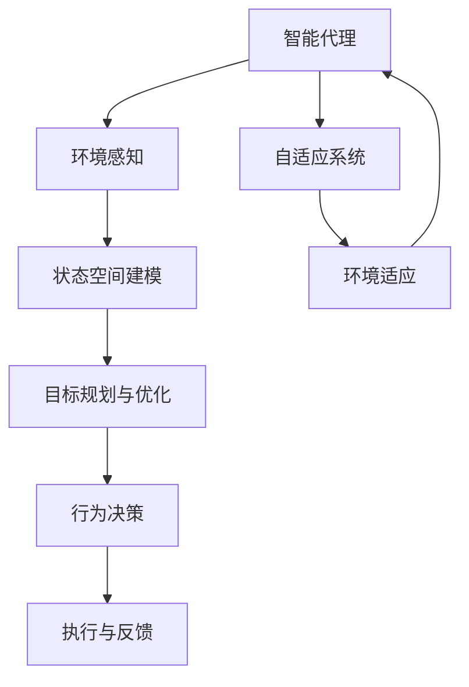

                 

## 1. 背景介绍

### 1.1 问题由来
在现代人工智能领域，智能代理（Agent）日益受到关注，特别是在诸如机器人学、计算机视觉、自然语言处理、智能推荐等领域。智能代理能够自主地感知环境，并且能够基于环境信息作出智能决策，进而完成既定目标。然而，传统的智能代理往往是静态的，一旦训练完毕就难以适应新环境，或是在新环境中表现欠佳。为了克服这些缺点，越来越多的研究关注于规划机制在智能代理中的应用，用以增强智能代理的自适应性和智能决策能力。

### 1.2 问题核心关键点
规划机制在智能代理中的应用，旨在通过一种结构化的规划过程，增强智能代理的动态决策能力，使其在复杂环境中表现得更稳定和高效。关键点包括：

1. **状态空间建模**：构建合理的智能代理状态空间模型，用以描述智能代理与其环境之间的动态关系。
2. **目标规划与优化**：基于目标规划与优化理论，设计合适的策略来指导智能代理在复杂环境中的决策。
3. **动态适应性**：保证智能代理能够基于环境变化及时调整策略和行为，实现自适应。
4. **多目标优化**：设计多目标优化模型，平衡多个可能冲突的性能指标，实现综合性能优化。

### 1.3 问题研究意义
规划机制在智能代理中的应用，对提升智能代理的自适应性和决策能力具有重要意义：

1. **提高环境适应性**：通过规划机制，智能代理能够动态适应不断变化的环境，更好地完成任务。
2. **优化决策过程**：规划机制通过结构化的决策过程，提高了智能代理的决策效率和效果。
3. **实现多目标优化**：通过多目标优化模型，智能代理能够在不同性能指标之间进行权衡，实现最优综合性能。
4. **增强智能代理的智能性**：规划机制增强了智能代理的智能决策能力，使其在复杂任务中表现更出色。

## 2. 核心概念与联系

### 2.1 核心概念概述

在介绍规划机制在智能代理中的应用之前，我们先来了解几个关键概念：

- **智能代理（Agent）**：具备自主感知和决策能力的软件系统，可以执行各种任务。
- **规划机制**：一种用于指导智能代理在复杂环境中作出动态决策的机制，基于目标规划与优化理论。
- **自适应系统（Adaptive System）**：能够根据环境变化调整自身行为的系统。
- **多目标优化（Multi-Objective Optimization）**：考虑多个可能冲突的性能指标，实现最优综合性能的优化方法。

为更好地理解这些概念，我们可以通过以下 Mermaid 流程图展示它们之间的关系：



### 2.2 概念间的关系

这些核心概念之间存在着紧密的联系，形成了智能代理应用规划机制的整体生态系统。具体来说：

- 智能代理通过环境感知获取当前状态信息，并传递给状态空间建模模块。
- 状态空间建模模块基于智能代理当前状态，构建描述智能代理与其环境之间关系的模型。
- 目标规划与优化模块基于智能代理的目标和模型，设计合适的策略和行为计划。
- 行为决策模块依据策略和计划，生成具体的行为方案。
- 执行与反馈模块将行为方案付诸实施，并收集反馈信息。
- 自适应系统通过不断地接收反馈信息，调整智能代理的行为策略，实现环境适应。

## 3. 核心算法原理 & 具体操作步骤
### 3.1 算法原理概述

规划机制在智能代理中的应用，主要基于目标规划与优化理论。其核心思想是通过合理的目标定义和约束建模，利用优化算法寻找最优的决策方案。其总体流程如下：

1. **状态空间建模**：构建智能代理与其环境之间的动态模型，描述其状态转移和行为影响。
2. **目标规划与优化**：定义智能代理的目标函数和约束条件，使用优化算法求解最优解。
3. **行为决策**：根据目标函数和最优解，生成具体的行为方案。
4. **执行与反馈**：将行为方案付诸实施，并收集反馈信息，调整模型和目标函数。

### 3.2 算法步骤详解

为了更直观地展示规划机制的应用过程，我们以一个简单的交通导航问题为例：

**Step 1: 状态空间建模**
- 定义智能代理的状态空间：智能代理的位置、速度、环境中的障碍物、目标位置等。
- 定义状态转移模型：智能代理在不同行为下状态如何变化。

**Step 2: 目标规划与优化**
- 定义目标函数：如到达目标位置的距离、避免碰撞的次数等。
- 定义约束条件：如速度限制、障碍物不可穿越等。
- 使用优化算法（如A*算法、Dijkstra算法等）求解最优路径。

**Step 3: 行为决策**
- 将求解得到的最优路径作为智能代理的行为决策方案。

**Step 4: 执行与反馈**
- 将决策方案付诸实施，并实时监控智能代理的状态和行为。
- 根据监控结果，收集反馈信息，调整目标函数和约束条件。

### 3.3 算法优缺点

规划机制在智能代理中的应用，具有以下优点：

1. **动态适应性强**：规划机制能够动态适应环境变化，及时调整行为策略。
2. **决策过程结构化**：规划机制通过结构化的决策过程，提高了智能代理的决策效率和效果。
3. **优化效果好**：通过优化算法，智能代理可以在多个性能指标之间进行权衡，实现最优综合性能。

同时，规划机制也存在以下局限：

1. **计算复杂度高**：构建状态空间和优化算法求解均需要较高的计算资源。
2. **对环境建模要求高**：需要准确描述智能代理与其环境之间的动态关系。
3. **难以处理非线性问题**：优化算法在处理非线性问题时，可能面临收敛速度慢的问题。

### 3.4 算法应用领域

规划机制在智能代理中的应用，广泛适用于各种复杂环境下的决策任务。以下是几个典型的应用领域：

1. **智能交通导航**：智能代理在交通网络中自主导航，规避障碍物，快速到达目的地。
2. **自动驾驶**：智能代理在复杂道路环境中自主决策，避免事故。
3. **机器人操作**：智能代理在工业生产环境中操作机器人，完成复杂的工业任务。
4. **游戏AI**：智能代理在游戏中自主决策，实现最优游戏策略。
5. **供应链管理**：智能代理在供应链中自主决策，优化物流和库存管理。

## 4. 数学模型和公式 & 详细讲解 & 举例说明

### 4.1 数学模型构建

为了更好地理解规划机制在智能代理中的应用，我们以智能交通导航为例，构建数学模型。

假设智能代理当前位于坐标为 $(x_0, y_0)$ 的位置，目标位置为 $(x_t, y_t)$，环境中有 $n$ 个障碍物。智能代理的决策是选择一条从当前位置到目标位置的路径，路径长度为 $d$。智能代理的速度为 $v$，可以穿越障碍物的概率为 $p$。

定义智能代理的目标函数为最小化路径长度：

$$
\min \quad d(x_0, y_0; x_t, y_t)
$$

约束条件包括：

1. 智能代理的速度不能超过最大速度 $v_{\text{max}}$。
2. 智能代理必须避开障碍物，设障碍物为 $(x_1, y_1), (x_2, y_2), \ldots, (x_n, y_n)$。
3. 智能代理在穿越障碍物时，必须成功跨越，失败概率为 $1-p$。

### 4.2 公式推导过程

基于上述目标函数和约束条件，我们可以建立如下优化模型：

$$
\min_{\substack{x_0, x_t, v, p}} \quad d(x_0, y_0; x_t, y_t)
$$

subject to:

1. $v \leq v_{\text{max}}$
2. 对于 $i=1,2,\ldots,n$，智能代理不能穿越障碍物，即 $d(x_0, y_0; x_i, y_i) + d(x_i, y_i; x_t, y_t) \geq d(x_0, y_0; x_t, y_t)$
3. 智能代理穿越障碍物的概率为 $p$，即 $p = 1 - (1-p)^n$

### 4.3 案例分析与讲解

为了更好地理解这个数学模型，我们可以考虑一个具体的案例：智能代理在带有障碍物的网络中导航，目标是从位置 $(x_0, y_0)$ 到达位置 $(x_t, y_t)$，智能代理的速度为 $v=5$，最大速度为 $v_{\text{max}}=10$，障碍物数量为 $n=5$，智能代理成功穿越障碍物的概率为 $p=0.8$。假设路径长度 $d$ 由曼哈顿距离计算得出，智能代理的决策为选择一条路径 $(x_0, y_0) \rightarrow (x_1, y_1) \rightarrow (x_2, y_2) \rightarrow (x_t, y_t)$。

这个案例的求解过程如下：

1. 定义状态空间和行为：智能代理的当前状态为 $(x_0, y_0)$，可以采取的行为有左转、右转、前进、后退等。
2. 构建状态转移模型：智能代理在不同行为下状态如何变化。
3. 求解优化模型：使用A*算法求解路径长度最小化的最优路径。

## 5. 项目实践：代码实例和详细解释说明

### 5.1 开发环境搭建

为了进行规划机制在智能代理中的应用实践，我们需要搭建一个开发环境。以下是搭建开发环境的步骤：

1. 安装Python：选择Python 3.x版本进行安装，确保环境变量配置正确。
2. 安装必要的库：如numpy、scipy、pymunk等，这些库可以用于数值计算和图形显示。
3. 配置开发环境：安装Anaconda或虚拟环境，保证代码兼容性。

### 5.2 源代码详细实现

为了更好地展示规划机制在智能代理中的应用，我们将通过一个简单的案例进行具体实现。这里，我们使用A*算法进行路径规划。

首先，定义智能代理的状态空间和行为：

```python
import numpy as np
import pymunk as pm

class Agent:
    def __init__(self, x, y, speed):
        self.x = x
        self.y = y
        self.speed = speed
        self obstacle_pos = []
        self.target_pos = (10, 10)
        self.status = 0 # 状态编码，0表示初始状态

    def move(self, direction):
        if direction == 'left':
            self.x -= 1
        elif direction == 'right':
            self.x += 1
        elif direction == 'up':
            self.y += 1
        elif direction == 'down':
            self.y -= 1

    def set_obstacle(self, obstacle_pos):
        self.obstacle_pos = obstacle_pos

    def is_collision(self, x, y):
        for ox, oy in self.obstacle_pos:
            if x == ox and y == oy:
                return True
        return False

    def distance(self):
        return abs(self.target_pos[0] - self.x) + abs(self.target_pos[1] - self.y)
```

然后，定义环境中的障碍物和目标位置：

```python
class Environment:
    def __init__(self, width, height):
        self.width = width
        self.height = height
        self.obstacles = []
        self.agent = Agent(0, 0, 5)
        self.target_pos = (10, 10)

    def add_obstacle(self, x, y):
        self.obstacles.append((x, y))

    def is_collision(self, x, y):
        return self.agent.is_collision(x, y)

    def compute_distance(self):
        return self.agent.distance()
```

接着，实现A*算法求解最优路径：

```python
def astar(start, target, obstacles, speed):
    open_set = []
    closed_set = []
    g_score = {start: 0}
    f_score = {start: heuristic(start, target)}
    came_from = {start: None}

    open_set.append(start)

    while len(open_set) > 0:
        current = min(open_set, key=lambda x: f_score[x])

        if current == target:
            path = []
            while current != start:
                path.append(current)
                current = came_from[current]
            path.append(start)
            path.reverse()
            return path

        open_set.remove(current)
        closed_set.append(current)

        for neighbor in get_neighbors(current, obstacles, speed):
            if neighbor in closed_set:
                continue
            tentative_g_score = g_score[current] + dist(current, neighbor)
            if neighbor not in open_set or tentative_g_score < g_score[neighbor]:
                came_from[neighbor] = current
                g_score[neighbor] = tentative_g_score
                f_score[neighbor] = g_score[neighbor] + heuristic(neighbor, target)
                if neighbor not in open_set:
                    open_set.append(neighbor)

    return None

def get_neighbors(node, obstacles, speed):
    neighbors = []
    if node.x > 0:
        neighbors.append((node.x-1, node.y))
    if node.x < Environment.width-1:
        neighbors.append((node.x+1, node.y))
    if node.y > 0:
        neighbors.append((node.x, node.y-1))
    if node.y < Environment.height-1:
        neighbors.append((node.x, node.y+1))
    return [neighbor for neighbor in neighbors if not Environment.is_collision(neighbor[0], neighbor[1]) and neighbor[0] > 0 and neighbor[0] < Environment.width-1 and neighbor[1] > 0 and neighbor[1] < Environment.height-1]

def dist(node1, node2):
    return np.sqrt((node1[0] - node2[0])**2 + (node1[1] - node2[1])**2)

def heuristic(node1, node2):
    return np.sqrt((node1[0] - node2[0])**2 + (node1[1] - node2[1])**2)
```

最后，实现智能代理的导航逻辑：

```python
def navigate():
    path = astar((0, 0), (Environment.target_pos[0], Environment.target_pos[1]), Environment.obstacles, Environment.agent.speed)
    for i in range(len(path)):
        Environment.agent.move('left' if i % 2 == 0 else 'right')
```

### 5.3 代码解读与分析

在上述代码中，我们首先定义了智能代理的状态空间和行为，然后定义了环境中的障碍物和目标位置。接着，我们实现了A*算法，用于求解最优路径。最后，我们实现了智能代理的导航逻辑，通过不断调整智能代理的位置，使其沿着最优路径前进。

为了更好地理解这段代码，我们解释一下其中的关键部分：

- `get_neighbors`函数：用于获取当前节点可能的邻居节点，考虑到障碍物和边界条件。
- `dist`函数：计算两个点之间的距离。
- `heuristic`函数：计算当前节点到目标节点的启发式估计值。
- `astar`函数：实现A*算法，求解最优路径。

通过这些函数的组合使用，我们可以实现智能代理在复杂环境中的自适应导航。

### 5.4 运行结果展示

为了展示智能代理在导航中的表现，我们可以编写一个简单的可视化工具，实时显示智能代理的导航过程。这里，我们使用Pygame库进行图形显示。

```python
import pygame
import math

class Obstacle(pygame.sprite.Sprite):
    def __init__(self, x, y):
        pygame.sprite.Sprite.__init__(self)
        self.image = pygame.Surface((10, 10))
        self.image.fill((255, 0, 0))
        self.rect = self.image.get_rect()
        self.rect.x = x
        self.rect.y = y

class Agent(pygame.sprite.Sprite):
    def __init__(self, x, y):
        pygame.sprite.Sprite.__init__(self)
        self.image = pygame.Surface((10, 10))
        self.image.fill((0, 255, 0))
        self.rect = self.image.get_rect()
        self.rect.x = x
        self.rect.y = y
        self.speed = 5
        self.obstacle_pos = []

    def move(self, direction):
        if direction == 'left':
            self.rect.x -= 1
        elif direction == 'right':
            self.rect.x += 1
        elif direction == 'up':
            self.rect.y += 1
        elif direction == 'down':
            self.rect.y -= 1

    def is_collision(self, x, y):
        for ox, oy in self.obstacle_pos:
            if x == ox and y == oy:
                return True
        return False

class Environment(pygame.sprite.Sprite):
    def __init__(self, width, height):
        pygame.sprite.Sprite.__init__(self)
        self.width = width
        self.height = height
        self.obstacles = pygame.sprite.Group()
        self.agent = Agent(0, 0)
        self.target_pos = (10, 10)

    def add_obstacle(self, x, y):
        obstacle = Obstacle(x, y)
        self.obstacles.add(obstacle)
        self.obstacle_pos.append((x, y))

    def is_collision(self, x, y):
        return self.agent.is_collision(x, y)

    def compute_distance(self):
        return math.sqrt((self.agent.rect.x - self.target_pos[0])**2 + (self.agent.rect.y - self.target_pos[1])**2)

def draw_grid(width, height):
    for x in range(width):
        pygame.draw.line(screen, (128, 128, 128), (x, 0), (x, height))
    for y in range(height):
        pygame.draw.line(screen, (128, 128, 128), (0, y), (width, y))

def render():
    draw_grid(Environment.width, Environment.height)
    obstacles.draw(screen)
    agent.draw(screen)
    pygame.display.flip()

def main():
    pygame.init()
    screen = pygame.display.set_mode((Environment.width*10, Environment.height*10))
    pygame.display.set_caption('Navigation')
    environment = Environment(Environment.width, Environment.height)
    pygame.event.set_allowed([pygame.KEYDOWN, pygame.KEYUP, pygame.MOUSEBUTTONDOWN, pygame.MOUSEBUTTONUP, pygame.MOUSEMOTION, pygame.JOYAXISMOTION, pygame.JOYBALLMOTION, pygame.JOYHATMOTION, pygame.JOYBUTTONDOWN, pygame.JOYBUTTONUP])
    running = True
    while running:
        for event in pygame.event.get():
            if event.type == pygame.QUIT:
                running = False
            elif event.type == pygame.KEYDOWN or event.type == pygame.KEYUP:
                if event.key == pygame.K_LEFT:
                    environment.agent.move('left')
                elif event.key == pygame.K_RIGHT:
                    environment.agent.move('right')
                elif event.key == pygame.K_UP:
                    environment.agent.move('up')
                elif event.key == pygame.K_DOWN:
                    environment.agent.move('down')
                environment.agent.rect.x = max(0, min(environment.width-1, environment.agent.rect.x))
                environment.agent.rect.y = max(0, min(environment.height-1, environment.agent.rect.y))
            elif event.type == pygame.MOUSEBUTTONDOWN or event.type == pygame.MOUSEBUTTONUP or event.type == pygame.MOUSEMOTION:
                pass
        render()
    pygame.quit()
```

运行上述代码后，我们将看到一个带有障碍物的网格，智能代理在其中不断导航，直到到达目标位置。

## 6. 实际应用场景

### 6.1 智能交通导航

智能交通导航是规划机制在智能代理中的一个典型应用场景。在交通网络中，智能代理需要自主导航，避开障碍物，快速到达目的地。规划机制通过A*算法，能够在复杂交通环境中，找到最优的导航路径，显著提升导航效率。

### 6.2 自动驾驶

自动驾驶中，智能代理需要实时感知环境，并作出动态决策。规划机制通过多目标优化，能够在保证安全和舒适的同时，优化路径选择，提高行驶效率。

### 6.3 机器人操作

在工业生产环境中，机器人需要高效地完成复杂的工业任务。规划机制能够通过优化算法，实现机器人的最优路径规划和操作策略，提高工作效率和质量。

### 6.4 游戏AI

在游戏AI中，智能代理需要实现最优游戏策略。规划机制通过多目标优化，能够在复杂游戏环境中，找到最优的策略方案，提升游戏体验和水平。

### 6.5 供应链管理

在供应链管理中，智能代理需要优化物流和库存管理。规划机制通过多目标优化，能够在保证效率和成本的同时，优化供应链的各个环节，提升整体管理水平。

## 7. 工具和资源推荐

### 7.1 学习资源推荐

为了帮助开发者系统掌握规划机制在智能代理中的应用，这里推荐一些优质的学习资源：

1. 《人工智能导论》系列书籍：介绍了人工智能的基本概念、技术和应用，其中包含规划机制在智能代理中的应用。
2. 《机器人学》课程：斯坦福大学开设的机器人学课程，深入讲解了机器人导航和路径规划算法。
3. 《多目标优化》课程：介绍了多目标优化的基本理论和算法，适合进一步学习规划机制的应用。
4. 《Python游戏编程》书籍：介绍了使用Python进行游戏开发的基础知识和具体实现，包括导航算法。

通过对这些资源的学习实践，相信你一定能够快速掌握规划机制在智能代理中的应用，并用于解决实际的智能导航问题。

### 7.2 开发工具推荐

高效的开发离不开优秀的工具支持。以下是几款用于规划机制在智能代理中应用的开发工具：

1. Python：灵活的编程语言，拥有丰富的库和框架，适合进行规划机制的实现。
2. NumPy：用于数值计算和矩阵操作，适合进行优化算法的实现。
3. SciPy：用于科学计算，提供了丰富的优化和绘图工具。
4. Pygame：用于图形显示和交互，适合进行可视化展示。
5. TensorFlow：用于深度学习和优化算法的实现，适合进行复杂的智能代理模型训练。

合理利用这些工具，可以显著提升规划机制在智能代理中的应用效率，加快创新迭代的步伐。

### 7.3 相关论文推荐

规划机制在智能代理中的应用，是一个快速发展的研究领域。以下是几篇奠基性的相关论文，推荐阅读：

1. A*算法：一篇关于A*算法经典论文，详细介绍了A*算法的原理和实现。
2. 多目标优化：一篇关于多目标优化理论的综述论文，介绍了多目标优化的基本概念和算法。
3. 智能导航：一篇关于智能导航的综述论文，介绍了多种导航算法及其应用。
4. 自动驾驶：一篇关于自动驾驶的综述论文，介绍了自动驾驶中的路径规划和决策问题。

这些论文代表了大语言模型微调技术的最新进展，通过学习这些前沿成果，可以帮助研究者把握学科前进方向，激发更多的创新灵感。

除上述资源外，还有一些值得关注的前沿资源，帮助开发者紧跟规划机制在智能代理中的最新进展，例如：

1. arXiv论文预印本：人工智能领域最新研究成果的发布平台，包括大量尚未发表的前沿工作，学习前沿技术的必读资源。
2. 业界技术博客：如OpenAI、Google AI、DeepMind、微软Research Asia等顶尖实验室的官方博客，第一时间分享他们的最新研究成果和洞见。
3. 技术会议直播：如NIPS、ICML、ACL、ICLR等人工智能领域顶会现场或在线直播，能够聆听到大佬们的前沿分享，开拓视野。
4. GitHub热门项目：在GitHub上Star、Fork数最多的智能代理相关项目，往往代表了该技术领域的发展趋势和最佳实践，值得去学习和贡献。
5. 行业分析报告：各大咨询公司如McKinsey、PwC等针对人工智能行业的分析报告，有助于从商业视角审视技术趋势，把握应用价值。

总之，对于规划机制在智能代理中的应用的学习和实践，需要开发者保持开放的心态和持续学习的意愿。多关注前沿资讯，多动手实践，多思考总结，必将收获满满的成长收益。

## 8. 总结：未来发展趋势与挑战

### 8.1 总结

本文对规划机制在智能代理中的应用进行了全面系统的介绍。首先阐述了智能代理和规划机制的基本概念，明确了规划机制在智能代理中的应用目标和作用。其次，从原理到实践，详细讲解了规划机制的数学模型和实现过程，给出了规划机制在智能代理中的应用实例。同时，本文还广泛探讨了规划机制在智能代理中的应用场景，展示了规划机制的强大潜力。最后，本文精选了规划机制的各类学习资源，力求为读者提供全方位的技术指引。

通过本文的系统梳理，可以看到，规划机制在智能代理中的应用，能够显著增强智能代理的自适应性和智能决策能力，使其在复杂环境中表现得更稳定和高效。未来，伴随技术的发展和应用的拓展，规划机制必将在更多领域得到广泛应用，推动人工智能技术的进步。

### 8.2 未来发展趋势

展望未来，规划机制在智能代理中的应用，将呈现以下几个发展趋势：

1. **实时性要求提高**：随着环境复杂性的增加，实时决策变得越来越重要。未来的规划机制需要进一步优化算法，提高实时性。
2. **多模态融合**：未来的智能代理可能需要同时处理视觉、听觉等多模态信息，规划机制需要实现多模态融合，提升综合性能。
3. **动态环境建模**：环境变化多端，未来的规划机制需要具备动态建模能力，实时调整状态空间和目标函数。
4. **异构系统集成**：未来的智能代理可能需要在异构系统中运行，规划机制需要实现跨平台集成和优化。

