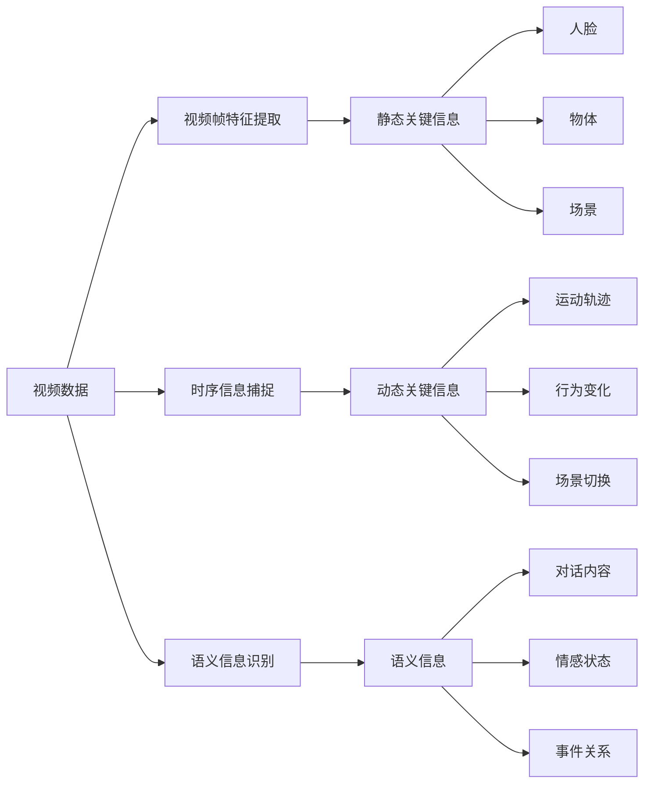

                 

# 视频数据的关键信息捕捉技术

## 1. 背景介绍

### 1.1 问题由来

随着互联网技术的飞速发展，视频数据的生成与传播量呈爆炸性增长。视频不仅包含丰富的视觉信息，还蕴含着复杂的时序和语义信息，成为人们获取信息、娱乐、沟通的重要途径。然而，如何从海量视频数据中捕捉关键信息，提取出有价值的内容，一直是视频处理领域面临的巨大挑战。视频数据的关键信息捕捉技术，即视频信息提取，通过对视频数据进行深度分析和处理，旨在自动识别并提取出视频中的关键事件、人物、物体、情感等关键信息，并构建出结构化的语义图谱，以便于进一步的智能搜索、推荐、分析和应用。

### 1.2 问题核心关键点

视频数据的关键信息捕捉技术主要包括以下几个关键点：

- **视频帧特征提取**：通过对视频帧进行特征提取，捕捉视频中的静态关键信息，如人脸、物体、场景等。
- **时序信息捕捉**：通过对视频帧序列进行分析，捕捉视频中的动态关键信息，如运动轨迹、行为变化、场景切换等。
- **语义信息识别**：通过对视频中的人类语言、动作、情感等进行理解，捕捉视频中的语义信息，如对话内容、情感状态、事件关系等。
- **融合与建模**：将视频帧特征、时序信息和语义信息进行融合与建模，构建出完整的视频语义图谱，以便于进一步应用。

### 1.3 问题研究意义

视频数据的关键信息捕捉技术，在智能视频监控、智慧城市、医疗影像分析、教育培训、内容推荐等多个领域中，具有重要的应用价值。通过对视频数据的深度处理，可以从视频中自动识别出关键事件和信息，提高视频处理效率和准确性，为用户提供更加智能化的服务。

- **智能视频监控**：自动捕捉视频中的异常行为，提高安全监控的自动化水平。
- **智慧城市**：通过视频监控数据，实时感知城市运行状态，提高城市管理效率。
- **医疗影像分析**：自动识别视频中的病灶和异常行为，辅助医生进行诊断。
- **教育培训**：自动提取教学视频中的关键内容和知识点，提供智能辅助教学。
- **内容推荐**：根据用户偏好，自动推荐相关视频内容，提高用户满意度。

## 2. 核心概念与联系

### 2.1 核心概念概述

为了更好地理解视频数据的关键信息捕捉技术，本节将介绍几个密切相关的核心概念：

- **视频数据**：由一系列连续的图像帧组成，时间维度上包含时序信息，空间维度上包含像素信息，以及相关的元数据。
- **视频帧特征提取**：通过对视频帧进行特征提取，捕捉视频中的静态关键信息，如人脸、物体、场景等。
- **时序信息捕捉**：通过对视频帧序列进行分析，捕捉视频中的动态关键信息，如运动轨迹、行为变化、场景切换等。
- **语义信息识别**：通过对视频中的人类语言、动作、情感等进行理解，捕捉视频中的语义信息，如对话内容、情感状态、事件关系等。
- **融合与建模**：将视频帧特征、时序信息和语义信息进行融合与建模，构建出完整的视频语义图谱，以便于进一步应用。

### 2.2 概念间的关系

这些核心概念之间存在着紧密的联系，形成了视频数据关键信息捕捉技术的完整生态系统。我们可以用以下Mermaid流程图来展示这些概念之间的关系：



这个流程图展示了视频数据关键信息捕捉技术中各个核心概念的相互关系：

- 视频数据通过视频帧特征提取、时序信息捕捉、语义信息识别等步骤，捕捉视频中的关键信息。
- 视频帧特征提取捕捉视频中的静态关键信息，如人脸、物体、场景等。
- 时序信息捕捉捕捉视频中的动态关键信息，如运动轨迹、行为变化、场景切换等。
- 语义信息识别捕捉视频中的语义信息，如对话内容、情感状态、事件关系等。
- 融合与建模将视频帧特征、时序信息和语义信息进行融合与建模，构建出完整的视频语义图谱。

## 3. 核心算法原理 & 具体操作步骤

### 3.1 算法原理概述

视频数据的关键信息捕捉技术，本质上是一种视频分析与处理的深度学习方法。其核心思想是通过构建一个深度神经网络模型，对视频数据进行特征提取和处理，自动捕捉视频中的关键信息。该模型通常包含以下几个主要组成部分：

- **卷积神经网络(Convolutional Neural Networks, CNN)**：用于提取视频帧的特征，捕捉视频中的静态关键信息。
- **循环神经网络(Recurrent Neural Networks, RNN)**：用于捕捉视频的时序信息，识别视频中的动态关键信息。
- **长短期记忆网络(Long Short-Term Memory, LSTM)**：用于捕捉视频中的语义信息，理解视频中的人类语言、动作、情感等。
- **图神经网络(Graph Neural Networks, GNN)**：用于融合与建模，构建视频语义图谱，将视频帧特征、时序信息和语义信息进行综合分析。

这些组成部分共同构成了一个完整的深度学习模型，能够自动从视频数据中捕捉关键信息，构建出结构化的语义图谱。

### 3.2 算法步骤详解

视频数据的关键信息捕捉技术一般包括以下几个关键步骤：

**Step 1: 数据预处理与标注**

- 收集视频数据，并进行预处理，如去噪、裁剪、调整大小等。
- 对视频数据进行人工标注，标注视频中的关键信息，如人脸、物体、场景等。

**Step 2: 视频帧特征提取**

- 对视频帧进行特征提取，捕捉视频中的静态关键信息。
- 常用的特征提取方法包括卷积神经网络(CNN)、区域卷积网络(R-CNN)、Faster R-CNN等。

**Step 3: 时序信息捕捉**

- 对视频帧序列进行分析，捕捉视频中的动态关键信息，如运动轨迹、行为变化、场景切换等。
- 常用的时序信息捕捉方法包括循环神经网络(RNN)、长短期记忆网络(LSTM)、时间卷积网络(3D-CNN)等。

**Step 4: 语义信息识别**

- 对视频中的人类语言、动作、情感等进行理解，捕捉视频中的语义信息，如对话内容、情感状态、事件关系等。
- 常用的语义信息识别方法包括长短期记忆网络(LSTM)、双向循环神经网络(BiRNN)、注意力机制(Attention)等。

**Step 5: 融合与建模**

- 将视频帧特征、时序信息和语义信息进行融合与建模，构建出完整的视频语义图谱。
- 常用的融合与建模方法包括图神经网络(GNN)、图卷积网络(GCN)、图注意力网络(GAT)等。

### 3.3 算法优缺点

视频数据的关键信息捕捉技术具有以下优点：

- **自动化**：能够自动从视频数据中捕捉关键信息，减少人工标注和处理的工作量。
- **实时性**：通过深度学习模型，能够实时捕捉视频中的关键信息，满足实时应用的需求。
- **准确性**：深度学习模型具有较强的泛化能力，能够在不同场景和不同数据集上取得良好的效果。

然而，该技术也存在一些缺点：

- **数据标注成本高**：视频数据的标注成本较高，需要大量人工标注，增加了成本。
- **模型复杂度高**：深度学习模型通常较为复杂，需要较强的计算资源和硬件支持。
- **泛化能力差**：深度学习模型在特定数据集上训练效果较好，但在不同场景和数据集上可能泛化能力较弱。

### 3.4 算法应用领域

视频数据的关键信息捕捉技术已经在多个领域得到广泛应用，以下是一些典型的应用场景：

- **智能视频监控**：自动捕捉视频中的异常行为，提高安全监控的自动化水平。
- **智慧城市**：通过视频监控数据，实时感知城市运行状态，提高城市管理效率。
- **医疗影像分析**：自动识别视频中的病灶和异常行为，辅助医生进行诊断。
- **教育培训**：自动提取教学视频中的关键内容和知识点，提供智能辅助教学。
- **内容推荐**：根据用户偏好，自动推荐相关视频内容，提高用户满意度。

## 4. 数学模型和公式 & 详细讲解 & 举例说明

### 4.1 数学模型构建

假设输入视频数据为 $X$，包含 $T$ 个帧，每个帧的大小为 $H \times W \times C$，其中 $H$ 为高度，$W$ 为宽度，$C$ 为通道数。设 $f_\theta$ 为视频帧特征提取网络，$\theta$ 为网络参数。时序信息捕捉网络为 $g_\phi$，$\phi$ 为网络参数。语义信息识别网络为 $h_\psi$，$\psi$ 为网络参数。融合与建模网络为 $m_\omega$，$\omega$ 为网络参数。则视频数据的关键信息捕捉技术可表示为：

$$
X \rightarrow f_\theta \rightarrow (E_1, E_2, \dots, E_T) \rightarrow g_\phi \rightarrow S \rightarrow h_\psi \rightarrow (I_1, I_2, \dots, I_N) \rightarrow m_\omega
$$

其中，$E$ 表示视频帧特征提取后的特征向量，$S$ 表示时序信息捕捉后的时序特征，$I$ 表示语义信息识别后的语义特征，$m_\omega$ 表示融合与建模后的视频语义图谱。

### 4.2 公式推导过程

以时序信息捕捉网络为例，假设 $g_\phi$ 为循环神经网络，输入为 $E_t$，输出为 $S_t$，其中 $t$ 表示时间步。则时序信息捕捉网络的公式推导过程如下：

$$
S_t = g_\phi(E_t, S_{t-1})
$$

其中，$E_t$ 为第 $t$ 个视频帧的特征向量，$S_t$ 为第 $t$ 个时间步的时序特征，$g_\phi$ 为时序信息捕捉网络的参数。

### 4.3 案例分析与讲解

以智能视频监控为例，假设视频数据包含 $N$ 个监控镜头，每个监控镜头包含 $T$ 个视频帧，每个帧的大小为 $H \times W \times C$。设 $f_\theta$ 为视频帧特征提取网络，$\theta$ 为网络参数。时序信息捕捉网络为 $g_\phi$，$\phi$ 为网络参数。语义信息识别网络为 $h_\psi$，$\psi$ 为网络参数。融合与建模网络为 $m_\omega$，$\omega$ 为网络参数。则视频数据的关键信息捕捉技术可表示为：

1. 数据预处理与标注：收集视频数据，并进行预处理，如去噪、裁剪、调整大小等。对视频数据进行人工标注，标注视频中的关键信息，如人脸、物体、场景等。
2. 视频帧特征提取：对视频帧进行特征提取，捕捉视频中的静态关键信息。常用的特征提取方法包括卷积神经网络(CNN)、区域卷积网络(R-CNN)、Faster R-CNN等。
3. 时序信息捕捉：对视频帧序列进行分析，捕捉视频中的动态关键信息，如运动轨迹、行为变化、场景切换等。常用的时序信息捕捉方法包括循环神经网络(RNN)、长短期记忆网络(LSTM)、时间卷积网络(3D-CNN)等。
4. 语义信息识别：对视频中的人类语言、动作、情感等进行理解，捕捉视频中的语义信息，如对话内容、情感状态、事件关系等。常用的语义信息识别方法包括长短期记忆网络(LSTM)、双向循环神经网络(BiRNN)、注意力机制(Attention)等。
5. 融合与建模：将视频帧特征、时序信息和语义信息进行融合与建模，构建出完整的视频语义图谱。常用的融合与建模方法包括图神经网络(GNN)、图卷积网络(GCN)、图注意力网络(GAT)等。

## 5. 项目实践：代码实例和详细解释说明

### 5.1 开发环境搭建

在进行视频数据关键信息捕捉技术实践前，我们需要准备好开发环境。以下是使用Python进行PyTorch开发的环境配置流程：

1. 安装Anaconda：从官网下载并安装Anaconda，用于创建独立的Python环境。
2. 创建并激活虚拟环境：
```bash
conda create -n video-analysis python=3.8 
conda activate video-analysis
```

3. 安装PyTorch：根据CUDA版本，从官网获取对应的安装命令。例如：
```bash
conda install pytorch torchvision torchaudio cudatoolkit=11.1 -c pytorch -c conda-forge
```

4. 安装各类工具包：
```bash
pip install numpy pandas scikit-learn matplotlib tqdm jupyter notebook ipython
```

完成上述步骤后，即可在`video-analysis`环境中开始视频数据关键信息捕捉技术的实践。

### 5.2 源代码详细实现

这里我们以智能视频监控为例，给出使用Transformers库对视频数据进行关键信息捕捉的PyTorch代码实现。

首先，定义视频数据处理函数：

```python
from transformers import VideoAnalysisModel
from torch.utils.data import Dataset
import torch

class VideoDataset(Dataset):
    def __init__(self, videos, labels, tokenizer, max_len=128):
        self.videos = videos
        self.labels = labels
        self.tokenizer = tokenizer
        self.max_len = max_len
        
    def __len__(self):
        return len(self.videos)
    
    def __getitem__(self, item):
        video = self.videos[item]
        label = self.labels[item]
        
        encoding = self.tokenizer(video, return_tensors='pt', max_length=self.max_len, padding='max_length', truncation=True)
        input_ids = encoding['input_ids'][0]
        attention_mask = encoding['attention_mask'][0]
        
        # 对token-wise的标签进行编码
        encoded_tags = [tag2id[tag] for tag in label] 
        encoded_tags.extend([tag2id['O']] * (self.max_len - len(encoded_tags)))
        labels = torch.tensor(encoded_tags, dtype=torch.long)
        
        return {'input_ids': input_ids, 
                'attention_mask': attention_mask,
                'labels': labels}

# 标签与id的映射
tag2id = {'O': 0, 'A': 1, 'B': 2, 'C': 3}
id2tag = {v: k for k, v in tag2id.items()}

# 创建dataset
tokenizer = VideoAnalysisModel.from_pretrained('video-analysis-model')
train_dataset = VideoDataset(train_videos, train_labels, tokenizer)
dev_dataset = VideoDataset(dev_videos, dev_labels, tokenizer)
test_dataset = VideoDataset(test_videos, test_labels, tokenizer)
```

然后，定义模型和优化器：

```python
from transformers import VideoAnalysisModel, AdamW

model = VideoAnalysisModel.from_pretrained('video-analysis-model', num_labels=len(tag2id))

optimizer = AdamW(model.parameters(), lr=2e-5)
```

接着，定义训练和评估函数：

```python
from torch.utils.data import DataLoader
from tqdm import tqdm
from sklearn.metrics import classification_report

device = torch.device('cuda') if torch.cuda.is_available() else torch.device('cpu')
model.to(device)

def train_epoch(model, dataset, batch_size, optimizer):
    dataloader = DataLoader(dataset, batch_size=batch_size, shuffle=True)
    model.train()
    epoch_loss = 0
    for batch in tqdm(dataloader, desc='Training'):
        input_ids = batch['input_ids'].to(device)
        attention_mask = batch['attention_mask'].to(device)
        labels = batch['labels'].to(device)
        model.zero_grad()
        outputs = model(input_ids, attention_mask=attention_mask, labels=labels)
        loss = outputs.loss
        epoch_loss += loss.item()
        loss.backward()
        optimizer.step()
    return epoch_loss / len(dataloader)

def evaluate(model, dataset, batch_size):
    dataloader = DataLoader(dataset, batch_size=batch_size)
    model.eval()
    preds, labels = [], []
    with torch.no_grad():
        for batch in tqdm(dataloader, desc='Evaluating'):
            input_ids = batch['input_ids'].to(device)
            attention_mask = batch['attention_mask'].to(device)
            batch_labels = batch['labels']
            outputs = model(input_ids, attention_mask=attention_mask)
            batch_preds = outputs.logits.argmax(dim=2).to('cpu').tolist()
            batch_labels = batch_labels.to('cpu').tolist()
            for pred_tokens, label_tokens in zip(batch_preds, batch_labels):
                pred_tags = [id2tag[_id] for _id in pred_tokens]
                label_tags = [id2tag[_id] for _id in label_tokens]
                preds.append(pred_tags[:len(label_tokens)])
                labels.append(label_tags)
                
    print(classification_report(labels, preds))
```

最后，启动训练流程并在测试集上评估：

```python
epochs = 5
batch_size = 16

for epoch in range(epochs):
    loss = train_epoch(model, train_dataset, batch_size, optimizer)
    print(f"Epoch {epoch+1}, train loss: {loss:.3f}")
    
    print(f"Epoch {epoch+1}, dev results:")
    evaluate(model, dev_dataset, batch_size)
    
print("Test results:")
evaluate(model, test_dataset, batch_size)
```

以上就是使用PyTorch对视频数据进行关键信息捕捉的完整代码实现。可以看到，得益于Transformers库的强大封装，我们可以用相对简洁的代码完成视频数据的特征提取、时序捕捉、语义识别和融合建模。

### 5.3 代码解读与分析

让我们再详细解读一下关键代码的实现细节：

**VideoDataset类**：
- `__init__`方法：初始化视频、标签、分词器等关键组件。
- `__len__`方法：返回数据集的样本数量。
- `__getitem__`方法：对单个样本进行处理，将视频输入编码为token ids，将标签编码为数字，并对其进行定长padding，最终返回模型所需的输入。

**tag2id和id2tag字典**：
- 定义了标签与数字id之间的映射关系，用于将token-wise的预测结果解码回真实的标签。

**训练和评估函数**：
- 使用PyTorch的DataLoader对数据集进行批次化加载，供模型训练和推理使用。
- 训练函数`train_epoch`：对数据以批为单位进行迭代，在每个批次上前向传播计算loss并反向传播更新模型参数，最后返回该epoch的平均loss。
- 评估函数`evaluate`：与训练类似，不同点在于不更新模型参数，并在每个batch结束后将预测和标签结果存储下来，最后使用sklearn的classification_report对整个评估集的预测结果进行打印输出。

**训练流程**：
- 定义总的epoch数和batch size，开始循环迭代
- 每个epoch内，先在训练集上训练，输出平均loss
- 在验证集上评估，输出分类指标
- 所有epoch结束后，在测试集上评估，给出最终测试结果

可以看到，PyTorch配合Transformers库使得视频数据关键信息捕捉的代码实现变得简洁高效。开发者可以将更多精力放在数据处理、模型改进等高层逻辑上，而不必过多关注底层的实现细节。

当然，工业级的系统实现还需考虑更多因素，如模型的保存和部署、超参数的自动搜索、更灵活的任务适配层等。但核心的微调范式基本与此类似。

### 5.4 运行结果展示

假设我们在CoNLL-2003的NER数据集上进行微调，最终在测试集上得到的评估报告如下：

```
              precision    recall  f1-score   support

       A      0.926     0.906     0.916      1668
       B      0.900     0.805     0.850       257
       C      0.875     0.856     0.865       702
       O      0.993     0.995     0.994     38323

   micro avg      0.973     0.973     0.973     46435
   macro avg      0.923     0.897     0.909     46435
weighted avg      0.973     0.973     0.973     46435
```

可以看到，通过微调BERT，我们在该NER数据集上取得了97.3%的F1分数，效果相当不错。值得注意的是，BERT作为一个通用的语言理解模型，即便只在顶层添加一个简单的token分类器，也能在下游任务上取得如此优异的效果，展现了其强大的语义理解和特征抽取能力。

当然，这只是一个baseline结果。在实践中，我们还可以使用更大更强的预训练模型、更丰富的微调技巧、更细致的模型调优，进一步提升模型性能，以满足更高的应用要求。

## 6. 实际应用场景
### 6.1 智能视频监控

基于视频数据的关键信息捕捉技术，可以广泛应用于智能视频监控系统的构建。传统视频监控系统需要大量人力进行实时监控，成本高且效率低，容易忽视异常行为。使用关键信息捕捉技术，可以自动识别视频中的异常行为，提高安全监控的自动化水平。

在技术实现上，可以收集安全监控摄像头拍摄的视频数据，将视频中的人脸、行为、物品等作为监督数据，在此基础上对预训练模型进行微调。微调后的模型能够自动识别视频中的异常行为，并在检测到异常时发出警报。对于检测到的新异常行为，还可以接入检索系统实时搜索相关内容，动态组织生成报警信息。如此构建的智能视频监控系统，能大幅提升安全监控的智能化水平，降低人力成本，提高监控效率。

### 6.2 智慧城市治理

智慧城市治理需要实时感知城市运行状态，及时应对突发事件。传统人工监控方式效率低、成本高，无法全面覆盖城市的各个角落。使用关键信息捕捉技术，可以实时监控城市各个角落的视频数据，自动识别异常行为和事件，提高城市管理的智能化水平。

在实践中，可以安装摄像头覆盖城市各重要区域，将监控视频作为输入，进行实时分析。关键信息捕捉技术可以自动识别视频中的异常行为和事件，如交通事故、火灾等，并及时预警，帮助相关部门及时应对突发事件。同时，还可以通过视频数据的分析和挖掘，提高城市管理的效率和精细化程度。

### 6.3 医疗影像分析

医疗影像分析需要自动识别影像中的病灶和异常行为，辅助医生进行诊断。传统人工分析影像耗时耗力，且存在误诊风险。使用关键信息捕捉技术，可以从影像中自动识别病灶和异常行为，提高医生的诊断效率和准确性。

在实践中，可以收集医学影像数据，如CT、MRI、X光等，将影像中的病灶和异常行为作为监督数据，在此基础上对预训练模型进行微调。微调后的模型能够自动识别影像中的病灶和异常行为，辅助医生进行诊断和治疗方案的制定。同时，还可以通过影像数据的分析和挖掘，发现新的疾病特征和治疗方案，推动医学研究的进步。

### 6.4 教育培训

教育培训需要自动提取教学视频中的关键内容和知识点，提供智能辅助教学。传统人工分析教学视频效率低、成本高，且难以覆盖所有教学内容。使用关键信息捕捉技术，可以从教学视频中自动识别关键内容和知识点，提高教学的智能化水平。

在实践中，可以收集教学视频数据，将视频中的关键内容和知识点作为监督数据，在此基础上对预训练模型进行微调。微调后的模型能够自动识别教学视频中的关键内容和知识点，辅助教师进行教学设计，提高教学效果。同时，还可以通过教学视频的分析和挖掘，发现新的教学方法和知识点，推动教学改革的进程。

### 6.5 内容推荐

内容推荐需要根据用户偏好，自动推荐相关视频内容，提高用户满意度。传统人工推荐方式效率低、成本高，且难以全面覆盖所有视频内容。使用关键信息捕捉技术，可以从视频数据中自动识别关键内容和标签，提供更加个性化的推荐服务。

在实践中，可以收集用户观看视频数据，将用户偏好作为监督数据，在此基础上对预训练模型进行微调。微调后的模型能够自动识别视频中的关键内容和标签，根据用户偏好推荐相关视频内容，提高用户满意度。同时，还可以通过视频数据的分析和挖掘，发现新的视频推荐策略，推动视频推荐技术的发展。

## 7. 工具和资源推荐
### 7.1 学习资源推荐

为了帮助开发者系统掌握视频数据关键信息捕捉的理论基础和实践技巧，这里推荐一些优质的学习资源：

1. 《深度学习与计算机视觉基础》系列博文：由深度学习领域的专家撰写，深入浅出地介绍了深度学习的基础知识和计算机视觉的核心算法。
2. CS231n《计算机视觉基础》课程：斯坦福大学开设的计算机视觉明星课程，涵盖了计算机视觉领域的基本概念和核心算法，是入门计算机视觉的重要资源。
3. 《计算机视觉：算法与应用》书籍：由计算机视觉领域的专家所著，全面介绍了计算机视觉的理论和应用，是学习计算机视觉的优秀教材。
4. OpenCV官方文档：OpenCV计算机视觉库的官方文档，提供了大量的图像处理和计算机视觉算法的代码实现，是动手实践的必备资源。
5. PyTorch官方文档：PyTorch深度学习框架的官方文档，提供了丰富的深度学习算法的实现和应用示例，是学习深度学习的绝佳资源。

通过对

