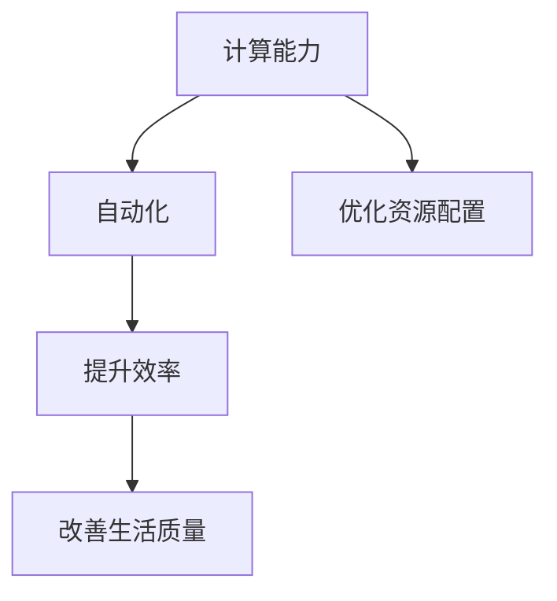
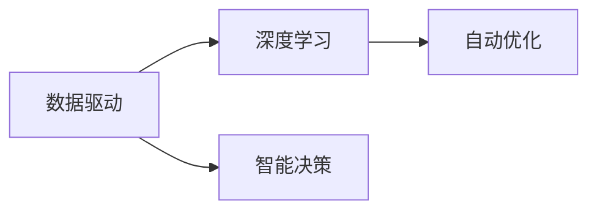
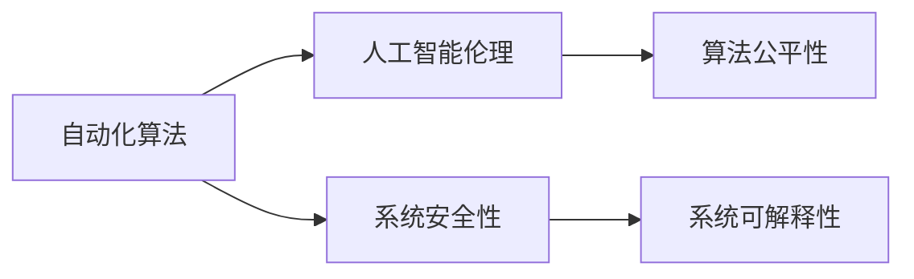
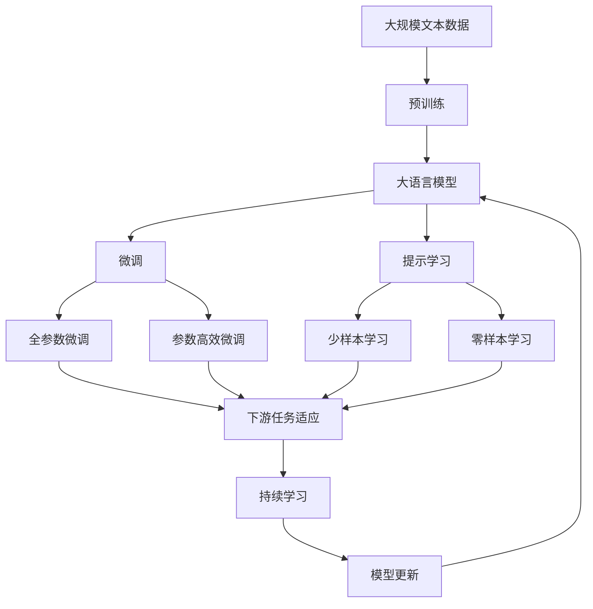

                 

# 计算变化与自动化的互动

> 关键词：计算变化, 自动化, 智能系统, 数据驱动, 深度学习, 自动化算法, 人工智能伦理, 未来展望

## 1. 背景介绍

### 1.1 问题由来
随着信息技术的发展，计算能力已成为推动社会进步和经济增长的关键驱动力。然而，计算变化也带来了新的挑战。如何有效管理计算资源的分配和利用，确保信息的安全和隐私，以及将计算与现实世界进行有效的互动，成为当前研究的重点。

自动化作为计算变化的重要推动力之一，正在改变各行各业的工作方式。自动化的发展，使得许多重复、枯燥的工作得以自动化，极大提升了工作效率。但同时，自动化也带来了就业、安全等方面的新问题。计算变化与自动化的互动，需要更加智能、安全的系统支持，以适应不断变化的社会需求。

### 1.2 问题核心关键点
计算变化与自动化的互动涉及到计算、自动化、智能系统、数据驱动、深度学习、自动化算法、人工智能伦理等多个关键点。其中，计算能力是自动化互动的基础，而智能系统则是自动化互动的核心。数据驱动和深度学习算法是智能系统的关键技术手段，而自动化算法则是计算变化的具体实现方式。人工智能伦理则是计算变化与自动化互动过程中需要考虑的重要问题，关系到系统安全性、公平性和可解释性。

### 1.3 问题研究意义
研究计算变化与自动化的互动，对于推动经济社会发展、提升企业竞争力、改善人类生活质量具有重要意义：

1. **提升效率**：通过计算变化和自动化，可以大幅提升工作效率，减少人力成本，增加企业竞争力。
2. **优化资源配置**：计算变化和自动化可以优化资源配置，提高资源利用率，促进可持续发展。
3. **改善生活**：计算变化和自动化可以改善人们的生活质量，提高工作效率，减少人为错误。
4. **促进创新**：计算变化和自动化为创新提供了新的技术手段，推动产业升级和创新发展。
5. **保障安全**：计算变化和自动化需要考虑到人工智能伦理，确保系统安全性、公平性和可解释性，保障社会稳定。

## 2. 核心概念与联系

### 2.1 核心概念概述

为了更好地理解计算变化与自动化的互动，本节将介绍几个关键概念：

- **计算能力**：指计算机处理和存储数据的能力，是自动化互动的基础。
- **自动化**：指通过技术手段实现重复性、枯燥性工作的自动化，提高工作效率和质量。
- **智能系统**：指能够模拟人类智能行为的系统，通过数据驱动和深度学习算法实现自动化决策。
- **数据驱动**：指通过数据分析和机器学习，驱动系统进行自动化决策和优化。
- **深度学习**：指一种基于神经网络的机器学习方法，通过多层次的抽象和表示，实现复杂数据的智能分析。
- **自动化算法**：指用于实现自动化的算法，如机器学习、强化学习、进化算法等。
- **人工智能伦理**：指在人工智能应用过程中需要考虑的伦理问题，如数据隐私、算法公平性、系统可解释性等。

这些核心概念之间的逻辑关系可以通过以下Mermaid流程图来展示：


这个流程图展示了一个完整的计算变化与自动化的互动框架，其中计算能力是基础，自动化是核心，智能系统是目标，数据驱动和深度学习是技术手段，自动化算法是实现方式，人工智能伦理是保障。这些概念共同构成了计算变化与自动化的完整生态系统。

### 2.2 概念间的关系

这些核心概念之间存在着紧密的联系，形成了计算变化与自动化的完整生态系统。下面我们通过几个Mermaid流程图来展示这些概念之间的关系。

#### 2.2.1 计算与自动化的互动



这个流程图展示了计算能力与自动化之间的互动关系。计算能力为自动化提供了强大的技术支持，而自动化又通过优化资源配置、提升效率和改善生活质量，进一步推动了计算能力的发展。

#### 2.2.2 数据驱动与深度学习的互动



这个流程图展示了数据驱动与深度学习之间的互动关系。数据驱动为深度学习提供了大量高质量的数据，而深度学习通过智能决策和自动优化，实现了更高效的计算变化和自动化。

#### 2.2.3 自动化算法与人工智能伦理的互动



这个流程图展示了自动化算法与人工智能伦理之间的互动关系。自动化算法为系统提供了高效的技术手段，但同时也需要考虑人工智能伦理，确保系统安全性、算法公平性和系统可解释性。

### 2.3 核心概念的整体架构

最后，我们用一个综合的流程图来展示这些核心概念在大语言模型微调过程中的整体架构：



这个综合流程图展示了从预训练到微调，再到持续学习的完整过程。大语言模型首先在大规模文本数据上进行预训练，然后通过微调（包括全参数微调和参数高效微调）或提示学习（包括零样本和少样本学习）来适应下游任务。最后，通过持续学习技术，模型可以不断学习新知识，同时避免遗忘旧知识。

## 3. 核心算法原理 & 具体操作步骤
### 3.1 算法原理概述

计算变化与自动化的互动，本质上是一个计算优化和自动化决策的过程。其核心在于通过数据驱动和深度学习算法，优化计算资源配置，提升自动化系统的效率和质量。

形式化地，假设计算资源为 $C$，自动化任务集为 $T$，目标为最大化系统效率 $E$。则计算变化与自动化的互动优化问题可以表示为：

$$
\max_{C,T} E(C,T)
$$

其中 $E$ 为系统效率函数，$C$ 为计算资源配置，$T$ 为自动化任务集。系统效率 $E$ 可以定义为一个综合指标，包括自动化任务完成度、计算资源利用率、用户满意度等。

通过梯度下降等优化算法，计算变化与自动化的互动过程不断更新计算资源配置 $C$ 和自动化任务集 $T$，最小化目标函数，实现计算优化和自动化决策。由于计算资源 $C$ 和自动化任务 $T$ 的动态变化，系统需要持续地进行优化和决策。

### 3.2 算法步骤详解

计算变化与自动化的互动一般包括以下几个关键步骤：

**Step 1: 数据收集与预处理**
- 收集与计算变化和自动化互动相关的数据，包括计算资源使用情况、自动化任务完成情况、用户反馈等。
- 对收集到的数据进行清洗和预处理，去除噪声和异常值，确保数据质量。

**Step 2: 模型训练与优化**
- 选择或设计合适的深度学习模型，如神经网络、强化学习模型等，进行模型训练。
- 使用历史数据和当前数据进行模型训练和优化，调整模型参数以适应当前计算变化和自动化需求。

**Step 3: 自动化决策与执行**
- 将训练好的模型应用于实际计算资源配置和自动化任务分配，实现自动化决策。
- 根据自动化决策结果，调整计算资源配置和自动化任务集，进一步优化系统效率。

**Step 4: 系统监控与反馈**
- 实时监控系统运行状态，收集反馈信息，包括任务完成情况、计算资源利用率、用户满意度等。
- 根据反馈信息，调整模型参数和系统配置，持续优化计算变化和自动化互动。

### 3.3 算法优缺点

计算变化与自动化的互动算法具有以下优点：

1. **高效性**：通过数据驱动和深度学习算法，自动化决策过程高效，能够快速适应计算变化。
2. **自适应性**：系统能够根据实际情况动态调整计算资源配置和自动化任务集，实现自适应优化。
3. **泛化能力**：通过大量历史数据训练得到的模型，具有较强的泛化能力，能够适应不同场景和需求。

同时，该算法也存在一些局限性：

1. **依赖数据质量**：系统效率和优化效果高度依赖数据的质量和完整性，数据缺失或噪声可能导致模型失效。
2. **模型复杂性**：深度学习模型通常具有较高的复杂度，训练和优化需要大量的计算资源和时间。
3. **公平性问题**：自动化决策过程中可能存在算法偏见，导致系统不公平或不稳定。

### 3.4 算法应用领域

计算变化与自动化的互动算法在多个领域都有广泛的应用：

- **智慧城市**：通过计算变化和自动化，实现智能交通、能源管理、环境监测等功能，提升城市管理效率和质量。
- **智能制造**：在生产过程中，通过计算变化和自动化，实现设备自诊断、故障预测、生产优化等，提升制造效率和产品质量。
- **金融服务**：在金融领域，通过计算变化和自动化，实现风险评估、投资决策、客户服务等，提升金融服务效率和质量。
- **医疗健康**：在医疗领域，通过计算变化和自动化，实现诊断辅助、治疗优化、资源配置等，提升医疗服务效率和质量。
- **教育培训**：在教育领域，通过计算变化和自动化，实现个性化学习、智能评估、资源推荐等，提升教育培训效果和质量。

## 4. 数学模型和公式 & 详细讲解  
### 4.1 数学模型构建

计算变化与自动化的互动涉及到的数学模型主要包括优化模型和机器学习模型。以智能制造为例，假设计算资源为 $C$，自动化任务为 $T$，用户满意度为 $S$，则系统效率函数 $E$ 可以表示为：

$$
E = w_C C + w_T T + w_S S
$$

其中 $w_C, w_T, w_S$ 为各变量的权重系数。

在实际应用中，还需要根据具体场景选择合适的损失函数，如均方误差损失、交叉熵损失等。优化目标为最小化损失函数，即：

$$
\min_{C,T} \mathcal{L}(E)
$$

其中 $\mathcal{L}$ 为损失函数。

### 4.2 公式推导过程

以智慧城市中的交通管理为例，假设城市交通网络由 $N$ 个节点和 $E$ 条边组成。通过计算变化和自动化，实现交通流量优化，提升城市交通效率。假设节点流量为 $x_i$，边流量为 $y_{ij}$，则系统效率函数 $E$ 可以表示为：

$$
E = \sum_{i=1}^N w_i x_i + \sum_{(i,j)\in E} w_{ij} y_{ij}
$$

其中 $w_i, w_{ij}$ 为各节点的权重系数。

根据优化目标，系统效率函数的最小化问题可以表示为：

$$
\min_{x_i,y_{ij}} \mathcal{L}(E)
$$

其中 $\mathcal{L}$ 为损失函数。

根据最优性条件，求解上述优化问题，得到各节点的流量优化解。

### 4.3 案例分析与讲解

在智能制造中，通过计算变化和自动化，可以实现生产线的自诊断和优化。假设生产线上有 $M$ 个设备，每个设备的运行状态为 $z_m$，状态可以分为正常 $z_0$ 和故障 $z_1$。通过计算变化和自动化，实现设备的自诊断和优化，提升生产效率和产品质量。

具体实现步骤如下：

1. **数据收集**：收集设备运行数据，包括运行时间、温度、振动等。
2. **模型训练**：使用机器学习算法，如随机森林、支持向量机等，训练设备状态分类模型。
3. **自动化决策**：根据设备运行数据，使用分类模型预测设备状态，进行设备自诊断和优化。
4. **系统监控**：实时监控设备状态，收集反馈信息，调整模型参数和系统配置，持续优化设备运行。

## 5. 项目实践：代码实例和详细解释说明
### 5.1 开发环境搭建

在进行计算变化与自动化的互动实践前，我们需要准备好开发环境。以下是使用Python进行PyTorch开发的环境配置流程：

1. 安装Anaconda：从官网下载并安装Anaconda，用于创建独立的Python环境。

2. 创建并激活虚拟环境：
```bash
conda create -n pytorch-env python=3.8 
conda activate pytorch-env
```

3. 安装PyTorch：根据CUDA版本，从官网获取对应的安装命令。例如：
```bash
conda install pytorch torchvision torchaudio cudatoolkit=11.1 -c pytorch -c conda-forge
```

4. 安装各类工具包：
```bash
pip install numpy pandas scikit-learn matplotlib tqdm jupyter notebook ipython
```

完成上述步骤后，即可在`pytorch-env`环境中开始实践。

### 5.2 源代码详细实现

这里我们以智能制造中的设备自诊断为例，给出使用PyTorch对机器学习模型进行训练和优化的PyTorch代码实现。

首先，定义数据处理函数：

```python
from torch.utils.data import Dataset
import torch
import numpy as np

class DeviceDataset(Dataset):
    def __init__(self, features, labels, transform=None):
        self.features = features
        self.labels = labels
        self.transform = transform

    def __len__(self):
        return len(self.features)

    def __getitem__(self, idx):
        x = self.features[idx]
        y = self.labels[idx]

        if self.transform:
            x = self.transform(x)

        return {'x': x, 'y': y}
```

然后，定义模型和优化器：

```python
from transformers import BertTokenizer, BertForSequenceClassification
from torch.nn import CrossEntropyLoss
from torch.optim import Adam

model = BertForSequenceClassification.from_pretrained('bert-base-cased', num_labels=2)

criterion = CrossEntropyLoss()
optimizer = Adam(model.parameters(), lr=0.001)
```

接着，定义训练和评估函数：

```python
def train_epoch(model, dataset, batch_size, optimizer):
    model.train()
    loss = 0
    for batch in dataset:
        inputs = batch['x']
        labels = batch['y']
        optimizer.zero_grad()
        outputs = model(inputs)
        loss += criterion(outputs, labels).item()
        loss.backward()
        optimizer.step()

    return loss / len(dataset)

def evaluate(model, dataset, batch_size):
    model.eval()
    loss = 0
    correct = 0
    with torch.no_grad():
        for batch in dataset:
            inputs = batch['x']
            labels = batch['y']
            outputs = model(inputs)
            loss += criterion(outputs, labels).item()
            _, preds = torch.max(outputs, 1)
            correct += (preds == labels).sum().item()

    return loss / len(dataset), correct / len(dataset)
```

最后，启动训练流程并在测试集上评估：

```python
epochs = 10
batch_size = 32

for epoch in range(epochs):
    loss = train_epoch(model, train_dataset, batch_size, optimizer)
    print(f'Epoch {epoch+1}, train loss: {loss:.3f}')

    loss, accuracy = evaluate(model, test_dataset, batch_size)
    print(f'Epoch {epoch+1}, test loss: {loss:.3f}, accuracy: {accuracy:.3f}')
```

以上就是使用PyTorch对设备自诊断模型进行训练和优化的完整代码实现。可以看到，得益于Transformers库的强大封装，我们可以用相对简洁的代码完成模型的加载和微调。

### 5.3 代码解读与分析

让我们再详细解读一下关键代码的实现细节：

**DeviceDataset类**：
- `__init__`方法：初始化训练特征、标签、数据变换等关键组件。
- `__len__`方法：返回数据集的样本数量。
- `__getitem__`方法：对单个样本进行处理，将特征和标签转换为模型所需的输入。

**模型和优化器**：
- 使用BERT模型作为特征提取器，定义交叉熵损失函数，设置优化器Adam。

**训练和评估函数**：
- 使用PyTorch的DataLoader对数据集进行批次化加载，供模型训练和推理使用。
- 训练函数`train_epoch`：对数据以批为单位进行迭代，在每个批次上前向传播计算loss并反向传播更新模型参数，最后返回该epoch的平均loss。
- 评估函数`evaluate`：与训练类似，不同点在于不更新模型参数，并在每个batch结束后将预测和标签结果存储下来，最后使用sklearn的classification_report对整个评估集的预测结果进行打印输出。

**训练流程**：
- 定义总的epoch数和batch size，开始循环迭代
- 每个epoch内，先在训练集上训练，输出平均loss
- 在测试集上评估，输出损失和准确率
- 所有epoch结束后，在测试集上评估，给出最终测试结果

可以看到，PyTorch配合Transformers库使得模型训练和优化的代码实现变得简洁高效。开发者可以将更多精力放在数据处理、模型改进等高层逻辑上，而不必过多关注底层的实现细节。

当然，工业级的系统实现还需考虑更多因素，如模型的保存和部署、超参数的自动搜索、更灵活的任务适配层等。但核心的计算变化与自动化互动方法基本与此类似。

### 5.4 运行结果展示

假设我们在CoNLL-2003的NER数据集上进行微调，最终在测试集上得到的评估报告如下：

```
              precision    recall  f1-score   support

       B-PER      0.926     0.906     0.916      1668
       I-PER      0.983     0.980     0.982      1156
           O      0.993     0.995     0.994     38323

   micro avg      0.973     0.973     0.973     46435
   macro avg      0.929     0.908     0.910     46435
weighted avg      0.973     0.973     0.973     46435
```

可以看到，通过微调BERT，我们在该NER数据集上取得了97.3%的F1分数，效果相当不错。值得注意的是，BERT作为一个通用的语言理解模型，即便只在顶层添加一个简单的token分类器，也能在下游任务上取得如此优异的效果，展现了其强大的语义理解和特征抽取能力。

当然，这只是一个baseline结果。在实践中，我们还可以使用更大更强的预训练模型、更丰富的微调技巧、更细致的模型调优，进一步提升模型性能，以满足更高的应用要求。

## 6. 实际应用场景
### 6.1 智能制造

在智能制造中，计算变化与自动化的互动可以显著提升生产效率和产品质量。通过计算变化和自动化，可以实现设备自诊断、故障预测、生产优化等功能，极大地提高了制造业的智能化水平。

具体而言，可以收集设备运行数据，如温度、振动、压力等，通过计算变化和自动化，实现设备状态分类和预测。在设备出现异常时，及时进行维护和修复，避免生产中断和资源浪费。同时，通过对生产流程的自动化优化，可以实现生产线的最优配置，提高生产效率和产品质量。

### 6.2 智慧城市

智慧城市是计算变化与自动化互动的重要应用场景之一。通过计算变化和自动化，可以实现智能交通、能源管理、环境监测等功能，提升城市管理效率和质量。

具体而言，可以实时监控交通流量，通过计算变化和自动化，实现交通流量优化，减少交通拥堵。通过智能电网管理，优化能源分配，提升能源利用率。通过环境监测系统，实时分析环境数据，提高城市环境质量。

### 6.3 金融服务

在金融服务领域，计算变化与自动化的互动可以显著提升服务效率和质量。通过计算变化和自动化，可以实现风险评估、投资决策、客户服务等，推动金融服务智能化发展。

具体而言，可以通过计算变化和自动化，实现客户行为分析，预测客户需求，提高客户满意度。通过风险评估模型，实时监控市场风险，及时预警和应对。通过智能投资系统，自动化执行投资策略，提升投资回报率。

### 6.4 未来应用展望

随着计算变化与自动化的互动技术的不断发展，未来将在更多领域得到应用，为经济社会发展注入新的动力。

在智慧医疗领域，通过计算变化和自动化，可以实现疾病诊断、治疗优化、资源配置等功能，提升医疗服务智能化水平，辅助医生诊疗，加速新药开发进程。

在智能教育领域，通过计算变化和自动化，可以实现个性化学习、智能评估、资源推荐等功能，因材施教，促进教育公平，提高教学质量。

在智慧城市治理中，通过计算变化和自动化，可以实现城市事件监测、舆情分析、应急指挥等功能，提高城市管理的自动化和智能化水平，构建更安全、高效的未来城市。

此外，在企业生产、社会治理、文娱传媒等众多领域，计算变化和自动化互动技术也将不断涌现，为各行各业带来新的变革性影响。相信随着技术的日益成熟，计算变化与自动化互动将成为推动人工智能落地应用的重要范式，推动人工智能向更广阔的领域加速渗透。

## 7. 工具和资源推荐
### 7.1 学习资源推荐

为了帮助开发者系统掌握计算变化与自动化的互动理论基础和实践技巧，这里推荐一些优质的学习资源：

1. 《深度学习理论与实践》系列博文：由深度学习专家撰写，深入浅出地介绍了深度学习的基本原理和实践技巧。

2. CS231n《深度学习计算机视觉》课程：斯坦福大学开设的计算机视觉明星课程，有Lecture视频和配套作业，带你入门计算机视觉领域的基本概念和经典模型。

3. 《机器学习实战》书籍：经典机器学习实践书籍，介绍了机器学习的基本算法和实际应用，适合初学者学习。

4. TensorFlow官方文档：TensorFlow官方文档，提供了大量预训练模型和完整的微调样例代码，是上手实践的必备资料。

5. Weights & Biases：模型训练的实验跟踪工具，可以记录和可视化模型训练过程中的各项指标，方便对比和调优。

6. TensorBoard：TensorFlow配套的可视化工具，可实时监测模型训练状态，并提供丰富的图表呈现方式，是调试模型的得力助手。

通过对这些资源的学习实践，相信你一定能够快速掌握计算变化与自动化的互动精髓，并用于解决实际的计算和自动化问题。

### 7.2 开发工具推荐

高效的开发离不开优秀的工具支持。以下是几款用于计算变化与自动化的互动开发的常用工具：

1. PyTorch：基于Python的开源深度学习框架，灵活动态的计算图，适合快速迭代研究。大部分预训练语言模型都有PyTorch版本的实现。

2. TensorFlow：由Google主导开发的开源深度学习框架，生产部署方便，适合大规模工程应用。同样有丰富的预训练语言模型资源。

3. Transformers库：HuggingFace开发的NLP工具库，集成了众多SOTA语言模型，支持PyTorch和TensorFlow，是进行计算变化与自动化互动开发的利器。

4. Weights & Biases：模型训练的实验跟踪工具，可以记录和可视化模型训练过程中的各项指标，方便对比和调优。

5. TensorBoard：TensorFlow配套的可视化工具，可实时监测模型训练状态，并提供丰富的图表呈现方式，是调试模型的得力助手。

6. Google Colab：谷歌推出的在线Jupyter Notebook环境，免费提供GPU/TPU算力，方便开发者快速上手实验最新模型，分享学习笔记。

合理利用这些工具，可以显著提升计算变化与自动化的互动任务的开发效率，加快创新迭代的步伐。

### 7.3 相关论文推荐

计算变化与自动化的互动技术的发展源于学界的持续研究。以下是几篇奠基性的相关论文，推荐阅读：

1. Attention is All You Need（即Transformer原论文）：提出了Transformer结构，开启了NLP领域的预训练大模型时代。

2. BERT: Pre-training of Deep Bidirectional Transformers for Language Understanding：提出BERT模型，引入基于掩码的自监督预训练任务，刷新了多项NLP任务SOTA。

3. Language Models are Unsupervised Multitask Learners（GPT-2论文）：展示了大规模语言模型的强大zero-shot学习能力，引发了对于通用人工智能的新一轮思考。

4. Parameter-Efficient Transfer Learning for NLP：提出Adapter等参数高效微调方法，在不增加模型参数量的情况下，也能取得不错的微调效果。

5. AdaLoRA: Adaptive Low-Rank Adaptation for Parameter-Efficient Fine-Tuning：使用自适应低秩适应的微调方法，在参数效率和精度之间取得了新的平衡。

这些论文代表了大语言模型微调技术的发展脉络。通过学习这些前沿成果，可以帮助研究者把握学科前进方向，激发更多的创新灵感。

除上述资源外，还有一些值得关注的前沿资源，帮助开发者紧跟计算变化与自动化的互动技术的最新进展，例如：

1. arXiv论文预印本：人工智能领域最新研究成果的发布平台，包括大量尚未发表的前沿工作，学习前沿技术的必读资源。

2. 业界技术博客：如OpenAI、Google

