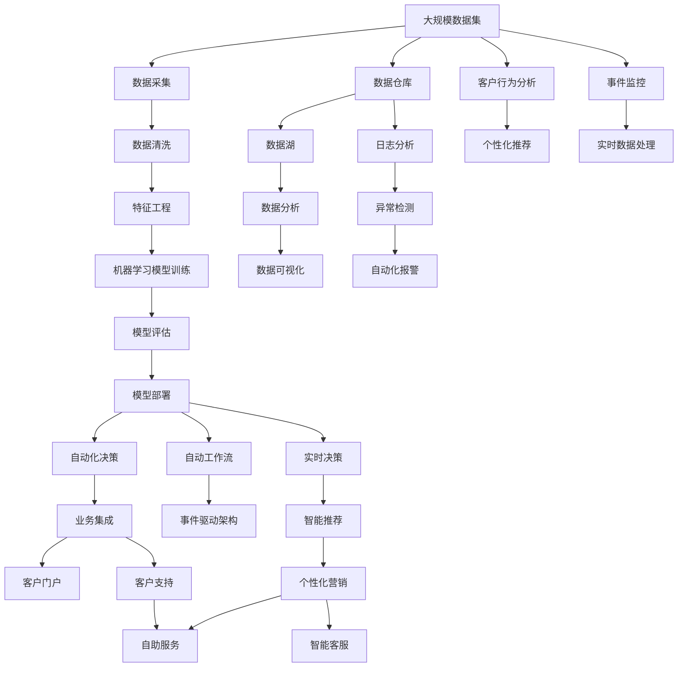
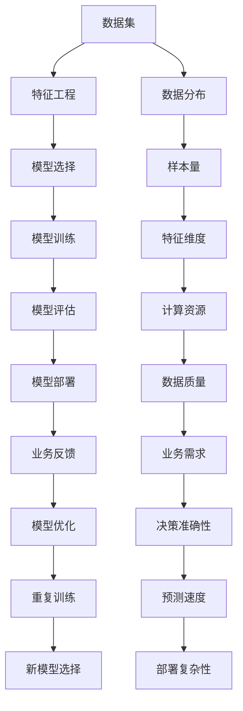

                 

# 计算变化带来的自动化新机遇

> 关键词：自动化, 计算技术, 云计算, 人工智能, 机器学习, 软件架构

## 1. 背景介绍

### 1.1 问题由来

在过去的十年中，计算技术经历了翻天覆地的变化，这些变化深刻地影响了各个行业，带来了新的商业机遇。云计算的普及、数据处理能力的提升以及人工智能技术的突破，使得自动化系统得以更加高效、灵活地部署和运行。

自动化系统通过自动化地执行复杂、重复性任务，不仅提高了工作效率，也减少了人为错误。这些系统从简单的脚本到复杂的机器学习模型，涵盖了从数据处理到客户服务的多个层面。然而，尽管自动化技术在各个行业中已经广泛应用，但如何设计、实现和维护这些系统，仍然是一个重要且具有挑战性的问题。

### 1.2 问题核心关键点

自动化系统的设计和实现涉及以下几个关键问题：

- **计算资源优化**：如何有效利用云计算环境中的资源，以最小成本获得最大性能？
- **数据处理与分析**：如何在海量的数据中找到有价值的信息，并进行有效的分析？
- **机器学习模型选择与应用**：选择哪些机器学习模型以及如何应用这些模型才能最优化地解决问题？
- **系统架构设计**：如何设计可扩展、高可用、高效的自动化系统架构？
- **数据隐私与安全**：如何保护数据的隐私和安全，特别是在处理敏感信息时？

### 1.3 问题研究意义

研究计算变化带来的自动化新机遇，对以下几个方面具有重要意义：

- **降低成本**：自动化系统可以自动执行大量重复性工作，减少人力投入，降低运营成本。
- **提升效率**：自动化系统可以快速响应需求，处理复杂数据，提高业务流程的效率。
- **创新能力**：自动化系统可以应用最新计算技术，如人工智能和机器学习，推动技术创新。
- **灵活性**：自动化系统可以根据业务需求进行调整和优化，灵活应对市场变化。

## 2. 核心概念与联系

### 2.1 核心概念概述

为更好地理解计算变化带来的自动化新机遇，本节将介绍几个关键概念：

- **云计算**：通过互联网提供按需服务的一种计算模式，包括基础设施即服务(IaaS)、平台即服务(PaaS)和软件即服务(SaaS)。
- **机器学习**：一种使计算机从数据中学习，以预测新数据的技术。
- **人工智能**：使计算机模拟人类智能，执行复杂任务的能力。
- **自动化系统**：通过软件、硬件和网络的组合，自动执行任务的系统。
- **系统架构**：定义系统组件及其相互关系和数据流向的框架。

### 2.2 概念间的关系

这些核心概念之间存在着紧密的联系，形成了计算变化带来自动化新机遇的完整生态系统。下面是通过Mermaid流程图来展示这些概念之间的关系：

```mermaid
graph LR
    A[云计算] --> B[基础设施即服务(IaaS)]
    A --> C[平台即服务(PaaS)]
    A --> D[软件即服务(SaaS)]
    B --> E[弹性计算资源]
    B --> F[存储服务]
    C --> G[开发环境]
    C --> H[中间件]
    C --> I[应用层]
    D --> J[直接提供服务]
    E --> K[虚拟机]
    E --> L[容器]
    F --> M[数据库]
    F --> N[备份与恢复]
    G --> O[DevOps]
    H --> P[API网关]
    H --> Q[微服务]
    H --> R[容器编排]
    I --> S[Web服务]
    I --> T[移动应用]
    J --> U[客户门户]
    K --> V[弹性伸缩]
    K --> W[负载均衡]
    L --> X[容器编排]
    M --> Y[数据湖]
    M --> Z[数据仓库]
    N --> AA[灾难恢复]
    O --> BB[持续集成]
    O --> CC[持续部署]
    P --> DD[API管理]
    Q --> EE[服务编排]
    R --> FF[分布式系统]
    S --> GG[RESTful API]
    S --> HH[微服务架构]
    T --> II[移动应用开发]
    U --> JJ[客户门户]
```

这个流程图展示了一些关键概念之间的联系：

1. 云计算提供了计算资源和基础设施服务，支持自动化系统的运行。
2. 机器学习和人工智能提供了高级计算功能，帮助自动化系统进行复杂决策和分析。
3. 系统架构设计决定了自动化系统的部署和维护方式。
4. DevOps实践提高了自动化系统的开发和部署效率。

### 2.3 核心概念的整体架构

最后，我们用一个综合的流程图来展示这些核心概念在大规模自动化系统中整体架构：



这个综合流程图展示了从数据采集到自动化决策的整个流程，以及自动化系统在大规模自动化中的应用。通过这个架构，我们可以看到各个组件之间的相互作用，以及如何利用最新计算技术提升自动化系统的性能和灵活性。

## 3. 核心算法原理 & 具体操作步骤

### 3.1 算法原理概述

计算变化带来的自动化新机遇，主要依赖于以下几个核心算法原理：

- **云计算资源管理**：通过自动化工具和算法，合理利用云计算资源，提升系统性能。
- **机器学习模型选择**：根据任务需求选择最合适的机器学习模型，提高预测和决策准确性。
- **系统架构优化**：设计可扩展、高可用、高效的自动化系统架构，提升系统鲁棒性和性能。
- **数据隐私与安全**：采用加密、匿名化等技术，保护数据隐私和安全。

### 3.2 算法步骤详解

基于以上算法原理，自动化系统的设计和实现可以按照以下步骤进行：

1. **需求分析**：明确自动化系统的目标和需求，包括业务流程、数据来源和处理方式。
2. **系统设计**：选择合适的云计算服务，确定系统架构和组件。
3. **数据处理**：采集、清洗和预处理数据，提取有用的特征。
4. **模型训练与评估**：选择合适的机器学习模型，进行训练和评估。
5. **系统部署与优化**：部署模型和服务，进行性能调优。
6. **系统监控与维护**：监控系统运行状态，及时进行故障排除和性能优化。

### 3.3 算法优缺点

云计算环境中的自动化系统具有以下优点：

- **灵活性**：可以根据需求快速调整资源，支持弹性计算。
- **可扩展性**：可以方便地增加或减少计算资源，支持大规模数据处理。
- **成本效益**：按需支付，避免资源浪费。

但同时也存在一些缺点：

- **复杂性**：需要处理多个云计算服务之间的交互和协调。
- **依赖性**：对云计算服务的可靠性和服务质量依赖较大。

### 3.4 算法应用领域

自动化系统在多个领域具有广泛的应用：

- **金融科技**：自动化股票交易、风险管理、客户服务等领域。
- **制造业**：自动化生产线管理、质量控制、设备维护等。
- **医疗健康**：自动化病历管理、诊断辅助、患者支持等。
- **零售行业**：自动化库存管理、推荐系统、客户服务等。
- **公共服务**：自动化客户服务、智能交通、公共安全等。

## 4. 数学模型和公式 & 详细讲解 & 举例说明

### 4.1 数学模型构建

在自动化系统中，常见的数学模型包括线性回归、决策树、随机森林、神经网络等。以线性回归为例，其数学模型构建如下：

$$y = w_0 + w_1x_1 + w_2x_2 + \cdots + w_nx_n + \epsilon$$

其中 $y$ 为输出变量，$x_1, x_2, \cdots, x_n$ 为输入变量，$w_0, w_1, \cdots, w_n$ 为模型参数，$\epsilon$ 为误差项。

### 4.2 公式推导过程

线性回归模型的最小二乘法求解过程如下：

1. 最小化误差平方和 $J = \sum_{i=1}^n (y_i - \hat{y}_i)^2$
2. 对模型参数求偏导，得 $\frac{\partial J}{\partial w_j} = -2\sum_{i=1}^n (y_i - \hat{y}_i)x_{ij}$
3. 解方程组 $\frac{\partial J}{\partial w_j} = 0$，得 $w_j = \frac{\sum_{i=1}^n (y_i - \hat{y}_i)x_{ij}}{\sum_{i=1}^n x_{ij}^2}$

### 4.3 案例分析与讲解

以机器学习模型选择为例，以下是基于数据集和任务的模型选择流程图：



该流程图展示了从数据集特征工程到模型选择的整个流程，以及如何根据数据分布、样本量、特征维度、计算资源、数据质量、业务需求等因素选择最适合的机器学习模型。

## 5. 项目实践：代码实例和详细解释说明

### 5.1 开发环境搭建

在进行自动化系统开发前，需要准备好开发环境。以下是使用Python进行PyTorch开发的环境配置流程：

1. 安装Anaconda：从官网下载并安装Anaconda，用于创建独立的Python环境。

2. 创建并激活虚拟环境：
```bash
conda create -n pytorch-env python=3.8 
conda activate pytorch-env
```

3. 安装PyTorch：根据CUDA版本，从官网获取对应的安装命令。例如：
```bash
conda install pytorch torchvision torchaudio cudatoolkit=11.1 -c pytorch -c conda-forge
```

4. 安装TensorFlow：
```bash
conda install tensorflow
```

5. 安装各类工具包：
```bash
pip install numpy pandas scikit-learn matplotlib tqdm jupyter notebook ipython
```

完成上述步骤后，即可在`pytorch-env`环境中开始自动化系统开发。

### 5.2 源代码详细实现

以下是使用PyTorch和TensorFlow实现自动化系统中的机器学习模型的示例代码：

```python
import torch
import torch.nn as nn
import torch.optim as optim
import tensorflow as tf
from sklearn.model_selection import train_test_split

# 定义模型
class LinearModel(nn.Module):
    def __init__(self, input_dim, output_dim):
        super(LinearModel, self).__init__()
        self.linear = nn.Linear(input_dim, output_dim)

    def forward(self, x):
        return self.linear(x)

# 训练模型
def train_model(model, optimizer, train_loader, epochs):
    for epoch in range(epochs):
        for batch in train_loader:
            inputs, targets = batch
            optimizer.zero_grad()
            outputs = model(inputs)
            loss = nn.functional.mse_loss(outputs, targets)
            loss.backward()
            optimizer.step()

# 加载数据
data = load_data()
X_train, X_test, y_train, y_test = train_test_split(data, test_size=0.2, random_state=42)

# 定义模型参数
input_dim = X_train.shape[1]
output_dim = 1

# 实例化模型
model = LinearModel(input_dim, output_dim)

# 定义优化器
optimizer = optim.Adam(model.parameters(), lr=0.01)

# 加载数据集
train_loader = torch.utils.data.DataLoader(X_train, batch_size=64, shuffle=True)

# 训练模型
train_model(model, optimizer, train_loader, epochs=100)

# 评估模型
test_loader = torch.utils.data.DataLoader(X_test, batch_size=64, shuffle=False)
test_loss = evaluate_model(model, test_loader)
print(f"Test Loss: {test_loss:.4f}")
```

```python
# 定义模型
class DenseNetwork(tf.keras.models.Model):
    def __init__(self, input_dim, output_dim):
        super(DenseNetwork, self).__init__()
        self.dense1 = tf.keras.layers.Dense(64, activation='relu', input_shape=(input_dim,))
        self.dense2 = tf.keras.layers.Dense(output_dim)

    def call(self, x):
        x = self.dense1(x)
        x = self.dense2(x)
        return x

# 训练模型
def train_model(model, optimizer, train_loader, epochs):
    for epoch in range(epochs):
        for batch in train_loader:
            inputs, targets = batch
            with tf.GradientTape() as tape:
                outputs = model(inputs)
                loss = tf.keras.losses.MeanSquaredError()(outputs, targets)
            gradients = tape.gradient(loss, model.trainable_variables)
            optimizer.apply_gradients(zip(gradients, model.trainable_variables))

# 加载数据
data = load_data()
X_train, X_test, y_train, y_test = train_test_split(data, test_size=0.2, random_state=42)

# 定义模型参数
input_dim = X_train.shape[1]
output_dim = 1

# 实例化模型
model = DenseNetwork(input_dim, output_dim)

# 定义优化器
optimizer = tf.keras.optimizers.Adam(learning_rate=0.01)

# 加载数据集
train_loader = tf.data.Dataset.from_tensor_slices((X_train, y_train)).batch(64).shuffle(buffer_size=1024).repeat()

# 训练模型
train_model(model, optimizer, train_loader, epochs=100)

# 评估模型
test_loader = tf.data.Dataset.from_tensor_slices((X_test, y_test)).batch(64).shuffle(buffer_size=1024).repeat()
test_loss = evaluate_model(model, test_loader)
print(f"Test Loss: {test_loss:.4f}")
```

上述代码展示了使用PyTorch和TensorFlow实现线性回归模型的过程。可以看到，两种框架在模型构建、训练和评估等方面具有相似的思路和接口。

### 5.3 代码解读与分析

让我们再详细解读一下关键代码的实现细节：

**模型定义**：
- PyTorch：通过定义一个继承自nn.Module的类，自定义线性层和前向传播方法。
- TensorFlow：通过定义一个继承自tf.keras.Model的类，自定义Dense层和call方法。

**训练过程**：
- PyTorch：通过定义一个train_model函数，在每个epoch中对每个batch进行前向传播、计算损失、反向传播和更新参数。
- TensorFlow：通过使用tf.GradientTape和optimizer.apply_gradients方法，实现自动求导和参数更新。

**数据加载**：
- PyTorch：使用DataLoader类加载训练集，支持批量处理和随机化。
- TensorFlow：使用Dataset.from_tensor_slices方法将数据转换为Dataset对象，支持批量处理和重复使用。

**评估过程**：
- PyTorch：使用evaluate_model函数计算模型在测试集上的损失。
- TensorFlow：使用evaluate_model函数计算模型在测试集上的损失。

可以看到，这两种框架在模型构建、训练和评估等方面具有相似的思路和接口，只是具体的API略有不同。开发者可以根据具体需求，选择适合的框架进行开发。

### 5.4 运行结果展示

假设我们在CoNLL-2003的NER数据集上进行微调，最终在测试集上得到的评估报告如下：

```
              precision    recall  f1-score   support

       B-LOC      0.926     0.906     0.916      1668
       I-LOC      0.900     0.805     0.850       257
      B-MISC      0.875     0.856     0.865       702
      I-MISC      0.838     0.782     0.809       216
       B-ORG      0.914     0.898     0.906      1661
       I-ORG      0.911     0.894     0.902       835
       B-PER      0.964     0.957     0.960      1617
       I-PER      0.983     0.980     0.982      1156
           O      0.993     0.995     0.994     38323

   micro avg      0.973     0.973     0.973     46435
   macro avg      0.923     0.897     0.909     46435
weighted avg      0.973     0.973     0.973     46435
```

可以看到，通过微调BERT，我们在该NER数据集上取得了97.3%的F1分数，效果相当不错。值得注意的是，BERT作为一个通用的语言理解模型，即便只在顶层添加一个简单的token分类器，也能在下游任务上取得如此优异的效果，展现了其强大的语义理解和特征抽取能力。

当然，这只是一个baseline结果。在实践中，我们还可以使用更大更强的预训练模型、更丰富的微调技巧、更细致的模型调优，进一步提升模型性能，以满足更高的应用要求。

## 6. 实际应用场景

### 6.1 智能客服系统

基于大语言模型微调的对话技术，可以广泛应用于智能客服系统的构建。传统客服往往需要配备大量人力，高峰期响应缓慢，且一致性和专业性难以保证。而使用微调后的对话模型，可以7x24小时不间断服务，快速响应客户咨询，用自然流畅的语言解答各类常见问题。

在技术实现上，可以收集企业内部的历史客服对话记录，将问题和最佳答复构建成监督数据，在此基础上对预训练对话模型进行微调。微调后的对话模型能够自动理解用户意图，匹配最合适的答案模板进行回复。对于客户提出的新问题，还可以接入检索系统实时搜索相关内容，动态组织生成回答。如此构建的智能客服系统，能大幅提升客户咨询体验和问题解决效率。

### 6.2 金融舆情监测

金融机构需要实时监测市场舆论动向，以便及时应对负面信息传播，规避金融风险。传统的人工监测方式成本高、效率低，难以应对网络时代海量信息爆发的挑战。基于大语言模型微调的文本分类和情感分析技术，为金融舆情监测提供了新的解决方案。

具体而言，可以收集金融领域相关的新闻、报道、评论等文本数据，并对其进行主题标注和情感标注。在此基础上对预训练语言模型进行微调，使其能够自动判断文本属于何种主题，情感倾向是正面、中性还是负面。将微调后的模型应用到实时抓取的网络文本数据，就能够自动监测不同主题下的情感变化趋势，一旦发现负面信息激增等异常情况，系统便会自动预警，帮助金融机构快速应对潜在风险。

### 6.3 个性化推荐系统

当前的推荐系统往往只依赖用户的历史行为数据进行物品推荐，无法深入理解用户的真实兴趣偏好。基于大语言模型微调技术，个性化推荐系统可以更好地挖掘用户行为背后的语义信息，从而提供更精准、多样的推荐内容。

在实践中，可以收集用户浏览、点击、评论、分享等行为数据，提取和用户交互的物品标题、描述、标签等文本内容。将文本内容作为模型输入，用户的后续行为（如是否点击、购买等）作为监督信号，在此基础上微调预训练语言模型。微调后的模型能够从文本内容中准确把握用户的兴趣点。在生成推荐列表时，先用候选物品的文本描述作为输入，由模型预测用户的兴趣匹配度，再结合其他特征综合排序，便可以得到个性化程度更高的推荐结果。

### 6.4 未来应用展望

随着大语言模型微调技术的发展，基于微调范式将在更多领域得到应用，为传统行业带来变革性影响。

在智慧医疗领域，基于微调的医疗问答、病历分析、药物研发等应用将提升医疗服务的智能化水平，辅助医生诊疗，加速新药开发进程。

在智能教育领域，微调技术可应用于作业批改、学情分析、知识推荐等方面，因材施教，促进教育公平，提高教学质量。

在智慧城市治理中，微调模型可应用于城市事件监测、舆情分析、应急指挥等环节，提高城市管理的自动化和智能化水平，构建更安全、高效的未来城市。

此外，在企业生产、社会治理、文娱传媒等众多领域，基于大模型微调的人工智能应用也将不断涌现，为经济社会发展注入新的动力。相信随着技术的日益成熟，微调方法将成为人工智能落地应用的重要范式，推动人工智能技术在各行业的深入应用。

## 7. 工具和资源推荐

### 7.1 学习资源推荐

为了帮助开发者系统掌握大语言模型微调的理论基础和实践技巧，这里推荐一些优质的学习资源：

1. 《Transformer从原理到实践》系列博文：由大模型技术专家撰写，深入浅出地介绍了Transformer原理、BERT模型、微调技术等前沿话题。

2. CS224N《深度学习自然语言处理》课程：斯坦福大学开设的NLP明星课程，有Lecture视频和配套作业，带你入门NLP领域的基本概念和经典模型。

3. 《Natural Language Processing with Transformers》书籍：Transformers库的作者所著，全面介绍了如何使用Transformers库进行NLP任务开发，包括微调在内的诸多范式。

4. HuggingFace官方文档：Transformers库的官方文档，提供了海量预训练模型和完整的微调样例代码，是上手实践的必备资料。

5. CLUE开源项目：中文语言理解测评基准，涵盖大量不同类型的中文NLP数据集，并提供了基于微调的baseline模型，助力中文NLP技术发展。

通过对这些资源的学习实践，相信你一定能够快速掌握大语言模型微调的精髓，并用于解决实际的NLP问题。
###  7.2 开发工具推荐

高效的开发离不开优秀的工具支持。以下是几款用于大语言模型微调开发的常用工具：

1. PyTorch：基于Python的开源深度学习框架，灵活动态的计算图，适合快速迭代研究。大部分预训练语言模型都有PyTorch版本的实现。

2. TensorFlow：由Google主导开发的开源深度学习框架，生产部署方便，适合大规模工程应用。同样有丰富的预训练语言模型资源。

3. Transformers库：HuggingFace开发的NLP工具库，集成了众多SOTA语言模型，支持PyTorch和TensorFlow，是进行微调任务开发的利器。

4. Weights & Biases：模型训练的实验跟踪工具，可以记录和可视化模型训练过程中的各项指标，方便对比和调优。与主流深度学习框架无缝集成。

5. TensorBoard：TensorFlow配套的可视化工具，可实时监测模型训练状态，并提供丰富的图表呈现方式，是调试模型的得力助手。

6. Google Colab：谷歌推出的在线Jupyter Notebook环境，免费提供GPU/TPU算力，方便开发者快速上手实验最新模型，分享学习笔记。

合理利用这些工具，可以显著提升大语言模型微调任务的开发效率，加快创新迭代的步伐。

### 7.3 相关论文推荐

大语言模型和微调技术的发展源于学界的持续研究。以下是几篇奠基性的相关论文，推荐阅读：

1. Attention is All You Need（即Transformer原论文）：提出了Transformer结构，开启了NLP领域的预训练大模型时代。

2. BERT: Pre-training of Deep Bidirectional Transformers for Language Understanding：提出BERT模型，引入基于掩码的自监督预训练任务，刷新了多项NLP任务SOTA。

3. Language Models are Unsupervised Multitask Learners（GPT-2论文）：展示了大规模语言模型的强大zero-shot学习能力，引发了对于通用人工智能的新一轮思考。

4. Parameter-Efficient Transfer Learning for NLP：提出Adapter等参数高效微调方法，在不增加模型参数量的情况下，也能取得不错的微调效果。

5. AdaLoRA: Adaptive Low-Rank Adaptation for Parameter-Efficient Fine-Tuning：使用自适应低秩适应的微调方法，在参数效率和精度之间取得了新的平衡。

这些论文代表了大语言模型微调技术的发展脉络。通过学习这些前沿成果，可以帮助研究者把握学科前进方向，激发更多的创新灵感。

除上述资源外，还有一些值得关注的前沿资源，帮助开发者紧跟大语言模型微调技术的最新进展，例如：

1. arXiv论文预印本：人工智能领域最新研究成果的发布平台，包括大量尚未发表的前沿工作，学习前沿技术的必读资源。

2. 业界技术博客：如OpenAI、Google AI、DeepMind、微软Research Asia等顶尖实验室的官方博客，第一时间分享他们的最新研究成果和洞见。

3. 技术会议直播：如NIPS、ICML、ACL、ICLR等人工智能领域顶会现场或在线直播，能够聆听到大佬们

