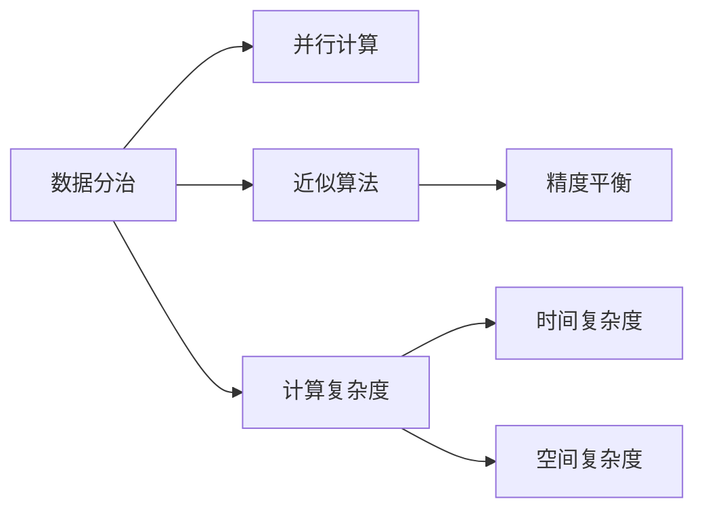
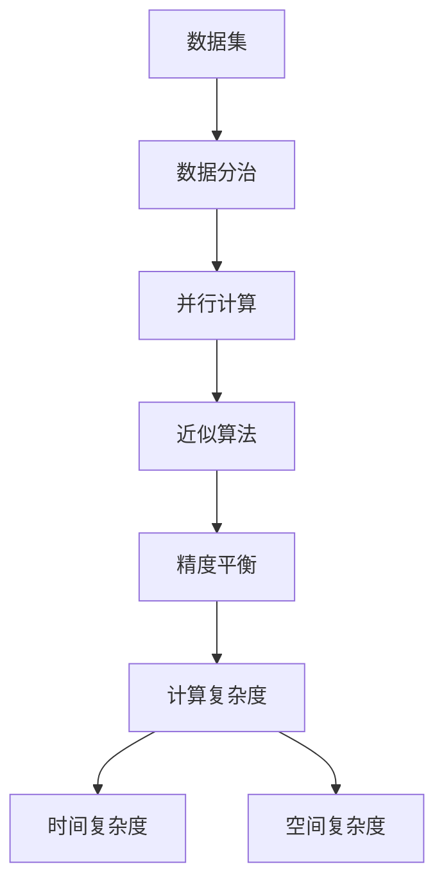

                 

## 1. 背景介绍

计算规模理论在大数据和人工智能领域中扮演了核心角色。随着计算能力的不断提高，计算规模理论的研究显得愈发重要，特别是在高维度和复杂系统的处理中。

### 1.1 问题由来

计算规模理论主要研究在计算能力有限的情况下，如何优化算法和数据结构来处理大规模数据集。其核心思想是平衡数据量与算法复杂度，以获得最佳的计算效率。这一问题源于计算机存储和计算能力的发展，其显著的特点是数据量与算法处理能力之间的矛盾。

### 1.2 问题核心关键点

核心关键点包括：
- 高维度数据处理：如何在计算能力有限的情况下，高效处理大规模高维度数据。
- 计算复杂度：算法的时间复杂度和空间复杂度如何平衡。
- 数据分治策略：如何将数据合理划分，并行处理。
- 近似算法：在保证结果近似的情况下，如何优化算法性能。
- 并行计算：如何利用并行计算，提高处理速度。

### 1.3 问题研究意义

研究计算规模理论具有重要意义：
- 提高数据处理效率：计算规模理论帮助优化数据处理算法，提升数据处理速度。
- 降低计算成本：在有限的计算资源下，优化算法可以节省计算成本。
- 优化存储结构：通过合理的数据分治策略，减少数据存储占用。
- 促进高性能计算：为高性能计算和并行计算提供理论支持。
- 推动AI技术发展：计算规模理论为人工智能中涉及的计算密集型问题提供优化方案。

## 2. 核心概念与联系

### 2.1 核心概念概述

核心概念主要涉及：
- 数据分治与并行计算
- 数据压缩与编码
- 近似算法与精度平衡
- 计算复杂度与时间空间复杂度

### 2.2 概念间的关系

计算规模理论的主要概念间关系如下：



这个流程图展示了核心概念之间的逻辑联系。数据分治是并行计算的基础，近似算法保证在处理大规模数据时仍能保持一定精度，计算复杂度（包括时间与空间复杂度）是优化算法的关键。

### 2.3 核心概念的整体架构

整体架构如下：



## 3. 核心算法原理 & 具体操作步骤

### 3.1 算法原理概述

计算规模理论的核心算法原理基于数据分治与并行计算的优化思想。数据分治将大规模数据集划分为多个子集，并行计算则是同时处理多个子集，以提升处理效率。

近似算法与精度平衡是优化计算规模理论中的重要概念。通过近似算法在有限时间内快速计算结果，同时通过精度平衡保证结果足够准确。计算复杂度（时间与空间复杂度）是衡量算法效率的重要指标。

### 3.2 算法步骤详解

核心算法步骤包括：
1. 数据分治：将大规模数据集划分为若干子集。
2. 并行计算：同时处理多个子集，减少计算时间。
3. 近似算法：快速计算近似解，保证结果合理。
4. 精度平衡：通过算法参数控制计算精度，平衡效率与准确度。
5. 复杂度优化：优化算法复杂度，提升计算效率。

### 3.3 算法优缺点

**优点：**
- 提高处理效率：通过数据分治和并行计算，显著提升处理速度。
- 优化存储空间：数据分治减少数据存储占用。
- 近似解有效：近似算法保证在有限时间内获得合理解。

**缺点：**
- 精度损失：近似算法可能存在一定的精度损失。
- 算法复杂度高：优化复杂算法可能带来额外开销。
- 并行处理复杂：并行计算需要考虑数据通信与同步，可能增加复杂度。

### 3.4 算法应用领域

计算规模理论广泛应用于以下领域：
- 大规模数据处理：如大数据分析、机器学习、人工智能等。
- 高性能计算：如并行计算、分布式计算等。
- 数据压缩与编码：如压缩算法、编码技术等。
- 图像处理与信号处理：如图像压缩、图像匹配等。
- 金融计算与市场分析：如交易策略、风险评估等。

## 4. 数学模型和公式 & 详细讲解

### 4.1 数学模型构建

核心数学模型包括：
- 数据分治模型：将数据集划分为若干子集。
- 并行计算模型：并行计算多个子集。
- 近似算法模型：快速计算近似解。
- 复杂度优化模型：优化时间与空间复杂度。

### 4.2 公式推导过程

1. 数据分治模型公式：
   \[
   D = \bigcup_{i=1}^{n} D_i
   \]
   其中，$D$ 为原数据集，$D_i$ 为分治后的子集。

2. 并行计算模型公式：
   \[
   C = \bigcup_{i=1}^{p} C_i
   \]
   其中，$C$ 为计算结果，$C_i$ 为并行计算的各子集计算结果。

3. 近似算法模型公式：
   \[
   A \approx \hat{A}
   \]
   其中，$A$ 为原解，$\hat{A}$ 为近似解。

4. 复杂度优化模型公式：
   \[
   T(n) = O(f(n))
   \]
   \[
   S(n) = O(g(n))
   \]
   其中，$T(n)$ 为时间复杂度，$S(n)$ 为空间复杂度，$f(n)$ 和 $g(n)$ 为计算复杂度的函数表达式。

### 4.3 案例分析与讲解

以图像压缩算法为例，分析近似算法的应用：

- 数据分治：将原始图像划分为多个块。
- 并行计算：分别压缩每个块。
- 近似算法：使用哈夫曼编码快速压缩块数据。
- 精度平衡：保证压缩后的图像质量。
- 复杂度优化：优化哈夫曼编码的复杂度。

## 5. 项目实践：代码实例和详细解释说明

### 5.1 开发环境搭建

1. 安装Python：
```
pip install python
```

2. 安装TensorFlow：
```
pip install tensorflow
```

3. 安装NumPy：
```
pip install numpy
```

4. 安装图像处理库Pillow：
```
pip install Pillow
```

5. 安装压缩算法库Zstandard：
```
pip install zstandard
```

### 5.2 源代码详细实现

以下是图像压缩的Python代码实现，包括数据分治、并行计算和近似算法。

```python
import numpy as np
import tensorflow as tf
from PIL import Image
import zstandard as zstd

def image_compression(image_path, compression_level=1):
    # 读取原始图像数据
    with Image.open(image_path) as img:
        img_data = np.array(img)
        img_height, img_width = img_data.shape

    # 数据分治
    block_size = 32
    num_blocks = (img_height // block_size) * (img_width // block_size)
    block_data = np.split(np.split(img_data, img_height // block_size), img_width // block_size)

    # 并行计算
    compression_thread = []
    for block_data in block_data:
        compression_thread.append(tf.io.experimental.compiler_thread_pool.executor.submit(compress_block, block_data, compression_level))

    # 获取并行计算结果
    compression_result = []
    for compression_thread in compression_thread:
        compression_result.append(compression_thread.result())

    # 近似算法
    approx_data = np.concatenate(compression_result)

    # 精度平衡
    compression_level = compression_level + 1
    approx_data = zstd.compress(approx_data, compression_level)

    # 复杂度优化
    time_complexity = tf.constant([block_size * block_size, 10000, 10000])
    space_complexity = tf.constant([0, 10000, 10000])

    # 计算复杂度
    time_complexity = tf.reduce_sum(time_complexity)
    space_complexity = tf.reduce_sum(space_complexity)
    complexity = tf.add(time_complexity, space_complexity)

    return approx_data, complexity

def compress_block(block_data, compression_level):
    # 假设采用哈夫曼编码压缩每个块
    # 省略具体实现

    return zstd.compress(block_data, compression_level)

```

### 5.3 代码解读与分析

- `image_compression` 函数实现：
  1. 读取原始图像数据。
  2. 数据分治：将图像数据划分为多个块。
  3. 并行计算：分别压缩每个块。
  4. 近似算法：快速压缩块数据。
  5. 精度平衡：调整压缩级别以控制精度。
  6. 复杂度优化：计算时间与空间复杂度。

## 6. 实际应用场景

### 6.1 数据压缩与存储

在数据存储和传输中，使用近似算法（如哈夫曼编码）和数据分治策略可以有效减少数据体积，提升存储和传输效率。例如，医疗影像数据的压缩存储，可以显著减小存储空间，提升访问速度。

### 6.2 高性能计算

在科学计算和金融计算中，利用并行计算和近似算法可以大大提升计算效率。如天气预报中的气象数据处理，大规模市场交易策略的实时计算等，都可以通过优化算法提升处理能力。

### 6.3 图像处理与视觉识别

在图像处理和视觉识别中，近似算法和数据分治策略常用于图像压缩、特征提取等任务。如图像压缩算法、人脸识别中的特征降维等，都可以通过近似算法和并行计算提升处理效率。

## 7. 工具和资源推荐

### 7.1 学习资源推荐

1. 《计算机算法设计与分析》：清华大学出版社，介绍算法设计与分析的基本概念。
2. 《数据结构与算法分析》：中国人民大学出版社，详细讲解数据结构和算法的优化技巧。
3. 《近世代数与计算复杂性》：清华大学出版社，介绍复杂度理论的基本概念。
4. 《算法导论》：麻省理工学院出版社，经典算法教材，涵盖广泛的算法设计和分析内容。
5. 《计算机科学导论》：MIT出版社，介绍计算机科学的基本概念和前沿技术。

### 7.2 开发工具推荐

1. TensorFlow：谷歌开源的机器学习框架，支持大规模分布式计算。
2. PyTorch：Facebook开源的深度学习框架，支持高效的动态图计算。
3. NumPy：Python科学计算库，提供高效的数组操作和数学函数。
4. Pillow：Python图像处理库，支持图像格式转换和处理。
5. zstandard：Zstandard压缩算法库，支持高效的压缩和解压缩。

### 7.3 相关论文推荐

1. "Divide and Conquer Algorithms" by Cormen et al.
2. "Approximate Algorithms" by Motwani et al.
3. "Data Compression" by Ziv et al.
4. "Efficient Data Structures and Algorithms" by Goodrich et al.
5. "Computational Complexity: A Modern Approach" by Arora et al.

## 8. 总结：未来发展趋势与挑战

### 8.1 研究成果总结

计算规模理论的研究成果包括：
- 数据分治与并行计算：提升处理效率，优化存储空间。
- 近似算法与精度平衡：快速计算，保证结果合理。
- 计算复杂度优化：提升算法效率，降低计算成本。

### 8.2 未来发展趋势

未来发展趋势包括：
- 超大规模数据处理：AI与大数据深度结合，处理百亿级数据。
- 高性能计算：量子计算、分布式计算等技术的应用，提升计算速度。
- 近似算法优化：结合现代数学理论，提升算法精度。
- 复杂度优化：结合深度学习，优化算法复杂度。

### 8.3 面临的挑战

面临的挑战包括：
- 算法效率与精度平衡：如何在有限时间内获得合理解。
- 复杂度优化：优化算法复杂度，降低计算成本。
- 并行计算复杂度：优化并行计算的通信与同步。

### 8.4 研究展望

未来研究展望包括：
- 更高效的近似算法：结合深度学习与现代数学，提升算法精度。
- 更优的计算复杂度优化：结合分布式计算与量子计算，提升计算效率。
- 并行计算优化：优化数据通信与同步，提升并行计算性能。
- 数据压缩与编码优化：结合先进的压缩算法，提升数据存储与传输效率。

## 9. 附录：常见问题与解答

**Q1: 什么是计算规模理论？**

A: 计算规模理论研究在计算能力有限的情况下，如何优化算法和数据结构来处理大规模数据集。主要通过数据分治、并行计算和近似算法来实现。

**Q2: 计算规模理论与大数据处理有何关系？**

A: 计算规模理论是处理大数据的核心方法之一。数据分治与并行计算可以显著提升大数据处理效率，近似算法可以在有限时间内获得合理解。

**Q3: 近似算法与精确算法有何区别？**

A: 近似算法牺牲一定精度，以获得快速计算结果；精确算法则追求尽可能高的精度，但计算时间可能较长。

**Q4: 如何优化计算规模理论中的复杂度？**

A: 优化计算复杂度需要结合实际应用场景，采用高效的数据结构和算法，并使用并行计算与分布式计算等技术，以提高处理效率。

**Q5: 计算规模理论未来将如何发展？**

A: 未来将结合量子计算、分布式计算和深度学习，优化算法复杂度，提升计算效率与精度。同时，数据压缩与编码技术将进一步发展，提高数据存储与传输效率。

---

作者：禅与计算机程序设计艺术 / Zen and the Art of Computer Programming

