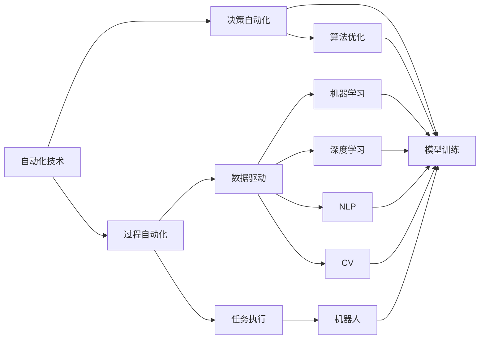
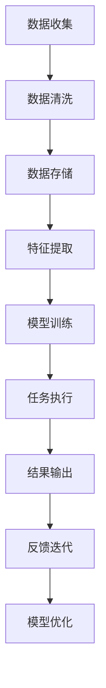
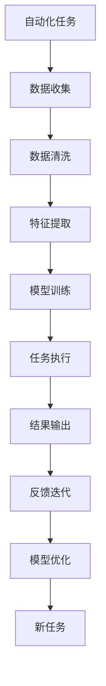
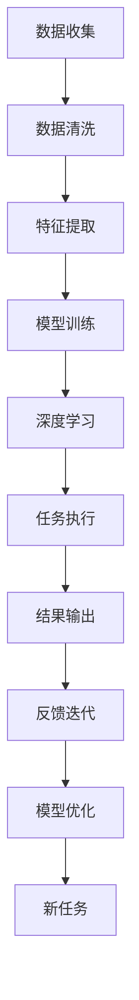
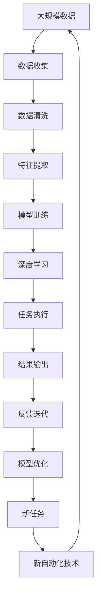

                 

## 1. 背景介绍

随着计算技术的飞速发展，自动化在各行各业的应用场景不断拓展。从工业生产自动化到服务行业机器人，从金融风控到医疗诊断，自动化正在改变传统行业的生产力和运作模式，推动社会生产力的发展。自动化技术不仅提升了生产效率，降低了人工成本，还在一定程度上重塑了人类与机器的关系。

### 1.1 问题由来

自动化技术的发展，源自于对复杂工作流程的深入理解和高效处理需求。在早期的自动化时代，工业流水线和机器人是主要应用形式。这些自动化系统主要用于物理层面的操作，如组装、搬运等重复性、标准化程度高的任务。然而，随着数据和计算技术的进步，自动化逐渐从物理层面扩展到智能层面，从底层操作自动化转向任务自动化和决策自动化。

### 1.2 问题核心关键点

自动化技术的关键点在于通过算法和数据驱动的方式，实现对复杂任务的处理和决策。其核心流程包括数据收集、模型训练、任务执行、反馈迭代等环节。这一过程与传统的人类决策流程有着本质区别：

- **数据驱动**：自动化决策基于数据和算法，而非人的主观判断。
- **算法优化**：通过机器学习等算法不断优化模型性能，提升决策准确性。
- **任务适配**：能够根据任务特性进行模型和算法的选择和适配，实现任务自动化的高效落地。
- **反馈迭代**：自动化的系统可以持续学习，从历史数据和执行结果中不断优化，适应不断变化的环境。

自动化技术在金融、医疗、交通、制造等领域已经展现出巨大潜力，成为推动社会进步的关键力量。然而，自动化技术在带来便利的同时，也伴随着诸多挑战，如决策透明性、数据隐私、算法偏见等。这些问题需要通过技术创新和政策监管来解决，才能更好地发挥自动化的价值。

### 1.3 问题研究意义

自动化技术的深入研究和应用，对于提升产业效率、优化资源配置、推动科技创新等方面具有重要意义：

1. **提升生产效率**：自动化技术能够替代大量繁琐、重复性高的工作，提高生产效率。
2. **优化资源配置**：通过对数据的分析，自动化系统可以更合理地配置资源，提升资源利用率。
3. **推动科技创新**：自动化技术的应用，催生了新的研究和应用方向，推动了相关技术的快速发展。
4. **增强决策科学性**：基于数据和算法的自动化决策，提高了决策的科学性和客观性。

## 2. 核心概念与联系

### 2.1 核心概念概述

为了深入理解计算领域的自动化技术，我们需要掌握以下几个核心概念：

- **自动化技术**：通过算法和数据驱动的方式，实现对复杂任务的处理和决策。自动化技术可以分为过程自动化和决策自动化两种。
- **机器学习**：一种让计算机通过数据学习任务规则，进而做出决策的技术。机器学习是自动化技术中最重要的算法之一。
- **深度学习**：一种特殊的机器学习方法，通过多层次的神经网络结构，能够自动学习数据中的复杂特征和关系。深度学习在大规模数据上表现优异，成为当前最前沿的自动化技术之一。
- **自然语言处理(NLP)**：自动化技术中的一个重要分支，专注于如何让机器理解和处理人类语言。NLP技术在机器翻译、语音识别、文本分析等方面有广泛应用。
- **计算机视觉(CV)**：自动化技术中的另一重要分支，专注于如何让计算机“看”和“理解”图像和视频。CV技术在图像识别、目标检测、视频分析等方面有广泛应用。
- **机器人**：一种物理形态的自动化执行设备，能够通过程序控制完成复杂的物理任务。机器人技术在制造业、医疗、服务行业等领域有广泛应用。

这些核心概念之间存在着紧密的联系，构成了自动化技术的完整框架。以下通过一个Mermaid流程图来展示这些概念之间的关系：



这个流程图展示了自动化技术的基本组成和关键环节。自动化技术通过数据驱动和算法优化，实现任务的自动化执行和决策。其中，机器学习、深度学习、NLP和CV是自动化技术中常用的算法和工具，而机器人则是自动化执行的具体形态。

### 2.2 概念间的关系

这些核心概念之间存在着复杂的交互关系，构成了自动化技术的完整生态系统。以下通过几个Mermaid流程图来展示这些概念之间的相互作用。

#### 2.2.1 自动化技术的基本流程



这个流程图展示了自动化技术的基本流程，包括数据收集、清洗、存储、特征提取、模型训练、任务执行、结果输出和反馈迭代等环节。每个环节都是自动化技术不可或缺的部分，确保了自动化系统的稳定运行和不断优化。

#### 2.2.2 自动化与机器学习的互动



这个流程图展示了自动化任务与机器学习的互动关系。自动化任务通过数据收集和特征提取，训练出机器学习模型，进而执行任务和输出结果。反馈迭代和模型优化环节，确保了模型的持续学习和适应能力。

#### 2.2.3 自动化与深度学习的融合



这个流程图展示了自动化技术与深度学习的融合关系。深度学习通过多层次的神经网络结构，能够自动学习复杂的数据特征和关系，从而提升了自动化系统的决策能力。

### 2.3 核心概念的整体架构

最后，我们用一个综合的流程图来展示这些核心概念在大规模自动化技术中的整体架构：



这个综合流程图展示了从数据收集到自动化任务的完整流程。自动化技术通过数据驱动和算法优化，不断迭代和优化，形成了一个动态发展的生态系统。

## 3. 核心算法原理 & 具体操作步骤

### 3.1 算法原理概述

自动化技术的核心算法原理包括数据驱动和算法优化。数据驱动通过收集、清洗和提取数据，为自动化任务提供数据基础。算法优化通过机器学习和深度学习等技术，提升自动化系统的决策能力。以下以深度学习算法为例，展示自动化技术的算法原理：

深度学习算法通过多层神经网络结构，能够自动学习复杂的数据特征和关系。其基本流程包括数据输入、前向传播、损失计算、反向传播和参数更新等步骤。具体来说：

1. **数据输入**：将输入数据（如图像、文本、语音等）转换为模型能够处理的格式。
2. **前向传播**：将输入数据通过多层神经网络结构，逐步传递信息，得到模型输出。
3. **损失计算**：将模型输出与真实标签进行比较，计算出误差损失。
4. **反向传播**：通过误差反向传播，计算出每个神经元对误差的影响，更新模型参数。
5. **参数更新**：使用优化算法（如梯度下降、Adam等）更新模型参数，优化模型性能。

### 3.2 算法步骤详解

深度学习算法的具体操作步骤如下：

**Step 1: 数据准备**

1. **数据收集**：收集与自动化任务相关的数据，包括原始数据和标注数据。
2. **数据清洗**：清洗数据中的噪声和错误，确保数据质量。
3. **数据预处理**：对数据进行标准化、归一化等处理，为模型训练提供数据基础。

**Step 2: 模型搭建**

1. **网络结构设计**：根据任务需求，设计多层次的神经网络结构，如卷积神经网络、循环神经网络、Transformer等。
2. **损失函数定义**：选择合适的损失函数，如交叉熵损失、均方误差损失等，用于衡量模型预测与真实标签之间的差异。
3. **优化器选择**：选择适合的优化器，如Adam、SGD等，进行模型参数优化。

**Step 3: 模型训练**

1. **模型初始化**：随机初始化模型参数，进行模型搭建。
2. **前向传播**：将输入数据输入模型，进行前向传播计算。
3. **损失计算**：计算模型输出与真实标签之间的误差损失。
4. **反向传播**：通过误差反向传播，计算出每个神经元对误差的影响，更新模型参数。
5. **参数更新**：使用优化器更新模型参数，逐步优化模型性能。

**Step 4: 模型评估**

1. **评估指标选择**：选择合适的评估指标，如准确率、精确率、召回率等，评估模型性能。
2. **测试集验证**：在测试集上验证模型性能，确保模型泛化能力。
3. **模型优化**：根据评估结果，对模型进行优化，提升模型性能。

**Step 5: 模型应用**

1. **模型部署**：将训练好的模型部署到实际应用中，进行任务执行。
2. **结果输出**：根据任务需求，将模型输出转换为可用的结果。
3. **反馈迭代**：收集任务执行结果，进行反馈迭代，优化模型性能。

### 3.3 算法优缺点

深度学习算法在自动化技术中的应用，具有以下优点和缺点：

**优点**：

1. **自适应能力强**：能够自动学习复杂数据特征和关系，提升自动化系统的决策能力。
2. **泛化能力强**：在大规模数据上表现优异，能够处理复杂的自动化任务。
3. **可扩展性强**：通过增加网络层数和节点数量，可以处理更复杂的任务。

**缺点**：

1. **计算资源需求高**：需要大量的计算资源进行模型训练和推理。
2. **模型复杂度高**：网络结构复杂，难以解释其内部工作机制。
3. **过拟合风险高**：在数据不足的情况下，容易发生过拟合现象。

### 3.4 算法应用领域

深度学习算法在自动化技术中有着广泛的应用领域，包括但不限于以下几个方面：

- **计算机视觉**：如图像识别、目标检测、图像分割等。
- **自然语言处理**：如机器翻译、情感分析、文本分类等。
- **语音识别**：如语音识别、语音合成等。
- **推荐系统**：如电商推荐、视频推荐等。
- **医疗诊断**：如医学影像分析、疾病预测等。
- **自动驾驶**：如道路识别、行为预测等。

## 4. 数学模型和公式 & 详细讲解 & 举例说明

### 4.1 数学模型构建

深度学习算法的数学模型构建，主要包括以下几个关键部分：

1. **输入数据表示**：将输入数据（如图像、文本、语音等）转换为模型能够处理的格式，如将图像数据转换为像素矩阵，将文本数据转换为词向量。
2. **网络结构定义**：定义多层次的神经网络结构，如卷积神经网络（CNN）、循环神经网络（RNN）、Transformer等。
3. **损失函数定义**：选择合适的损失函数，如交叉熵损失、均方误差损失等，用于衡量模型预测与真实标签之间的差异。
4. **优化器选择**：选择适合的优化器，如Adam、SGD等，进行模型参数优化。

### 4.2 公式推导过程

以下以卷积神经网络（CNN）为例，展示其数学模型和公式推导过程。

**Step 1: 数据输入表示**

假设输入数据为$x \in \mathbb{R}^{d_x}$，其中$d_x$为输入数据的维度。将输入数据转换为模型能够处理的格式，如将图像数据转换为像素矩阵，将文本数据转换为词向量。

**Step 2: 网络结构定义**

定义一个具有$L$层卷积神经网络，每一层包含多个卷积核和池化层。假设第$i$层的卷积核数量为$m_i$，卷积核大小为$k$，步长为$s$，输出特征图大小为$h_i$和$w_i$。

**Step 3: 卷积层计算**

第$i$层的卷积层计算公式为：

$$
H_{i+1}(x) = \max\limits_{1 \leq j \leq m_i} (W_j * x) + B_j
$$

其中$W_j$为第$j$个卷积核，$B_j$为偏置项。

**Step 4: 激活函数**

在卷积层后，需要应用激活函数（如ReLU）进行非线性变换。激活函数公式为：

$$
f(z) = \max(0, z)
$$

**Step 5: 池化层计算**

池化层用于减少特征图的大小，提取关键特征。常用的池化操作包括最大池化和平均池化。池化层计算公式为：

$$
H_i = \max(H_{i-1}) \quad \text{或} \quad H_i = \frac{1}{s^2} \sum\limits_{j=1}^{s^2} H_{i-1}^{(j)}
$$

其中$s$为池化核大小。

**Step 6: 全连接层计算**

最后一层全连接层将特征图转换为输出结果。全连接层计算公式为：

$$
y = W^T H_{L-1} + b
$$

其中$W$为权重矩阵，$b$为偏置项，$H_{L-1}$为最后一层特征图。

### 4.3 案例分析与讲解

以图像分类任务为例，展示深度学习算法的应用过程。

**数据准备**：

1. **数据收集**：收集与图像分类任务相关的数据，如MNIST手写数字数据集。
2. **数据清洗**：清洗数据中的噪声和错误，确保数据质量。
3. **数据预处理**：将数据归一化，将图像数据转换为像素矩阵。

**模型搭建**：

1. **网络结构设计**：定义一个具有3个卷积层和2个全连接层的卷积神经网络。
2. **损失函数定义**：选择交叉熵损失函数，衡量模型预测与真实标签之间的差异。
3. **优化器选择**：选择Adam优化器，进行模型参数优化。

**模型训练**：

1. **模型初始化**：随机初始化模型参数，进行模型搭建。
2. **前向传播**：将输入数据输入模型，进行前向传播计算。
3. **损失计算**：计算模型输出与真实标签之间的误差损失。
4. **反向传播**：通过误差反向传播，计算出每个神经元对误差的影响，更新模型参数。
5. **参数更新**：使用Adam优化器更新模型参数，逐步优化模型性能。

**模型评估**：

1. **评估指标选择**：选择准确率作为评估指标，评估模型性能。
2. **测试集验证**：在测试集上验证模型性能，确保模型泛化能力。
3. **模型优化**：根据评估结果，对模型进行优化，提升模型性能。

**模型应用**：

1. **模型部署**：将训练好的模型部署到实际应用中，进行图像分类。
2. **结果输出**：根据分类结果，输出图像的分类标签。
3. **反馈迭代**：收集分类结果，进行反馈迭代，优化模型性能。

## 5. 项目实践：代码实例和详细解释说明

### 5.1 开发环境搭建

在进行自动化技术开发前，我们需要准备好开发环境。以下是使用Python进行TensorFlow开发的环境配置流程：

1. 安装Anaconda：从官网下载并安装Anaconda，用于创建独立的Python环境。

2. 创建并激活虚拟环境：
```bash
conda create -n tf-env python=3.8 
conda activate tf-env
```

3. 安装TensorFlow：根据CUDA版本，从官网获取对应的安装命令。例如：
```bash
conda install tensorflow -c tensorflow -c conda-forge
```

4. 安装各类工具包：
```bash
pip install numpy pandas scikit-learn matplotlib tqdm jupyter notebook ipython
```

完成上述步骤后，即可在`tf-env`环境中开始自动化技术开发。

### 5.2 源代码详细实现

这里我们以图像分类任务为例，给出使用TensorFlow对卷积神经网络进行训练的PyTorch代码实现。

首先，定义图像分类任务的数据处理函数：

```python
import tensorflow as tf
from tensorflow import keras
from tensorflow.keras import layers

def load_data():
    # 加载MNIST手写数字数据集
    (x_train, y_train), (x_test, y_test) = keras.datasets.mnist.load_data()
    x_train, x_test = x_train / 255.0, x_test / 255.0
    return x_train, y_train, x_test, y_test

# 数据增强
def data_augmentation(x_train):
    # 对训练数据进行旋转、平移、缩放等增强操作
    augmented = tf.keras.preprocessing.image.ImageDataGenerator(
        rotation_range=10,
        width_shift_range=0.1,
        height_shift_range=0.1,
        zoom_range=0.1
    )
    augmented.fit(x_train)
    return augmented.flow(x_train, batch_size=64)
```

然后，定义卷积神经网络的模型结构：

```python
def build_model(input_shape):
    model = tf.keras.Sequential([
        layers.Conv2D(32, (3, 3), activation='relu', input_shape=input_shape),
        layers.MaxPooling2D((2, 2)),
        layers.Conv2D(64, (3, 3), activation='relu'),
        layers.MaxPooling2D((2, 2)),
        layers.Flatten(),
        layers.Dense(64, activation='relu'),
        layers.Dense(10)
    ])
    return model
```

接着，定义模型训练函数：

```python
def train_model(model, x_train, y_train, x_test, y_test, epochs):
    model.compile(optimizer='adam', loss='sparse_categorical_crossentropy', metrics=['accuracy'])
    history = model.fit(x_train, y_train, epochs=epochs, validation_data=(x_test, y_test))
    return history
```

最后，启动模型训练：

```python
epochs = 10

# 加载数据
x_train, y_train, x_test, y_test = load_data()

# 数据增强
augmented = data_augmentation(x_train)

# 模型搭建
model = build_model((28, 28, 1))

# 模型训练
history = train_model(model, augmented, y_train, x_test, y_test, epochs)

# 模型评估
test_loss, test_acc = model.evaluate(x_test, y_test, verbose=2)

print(f'Test accuracy: {test_acc}')
```

以上就是使用TensorFlow对卷积神经网络进行图像分类任务微调的完整代码实现。可以看到，得益于TensorFlow的强大封装，我们可以用相对简洁的代码完成模型的训练和评估。

### 5.3 代码解读与分析

让我们再详细解读一下关键代码的实现细节：

**数据处理函数**：
- `load_data`方法：加载MNIST手写数字数据集，并进行预处理。
- `data_augmentation`方法：对训练数据进行数据增强操作，包括旋转、平移、缩放等，提升模型的泛化能力。

**模型搭建函数**：
- `build_model`方法：定义一个具有3个卷积层和2个全连接层的卷积神经网络。

**模型训练函数**：
- `train_model`方法：使用Adam优化器进行模型训练，并记录训练过程中的各项指标。

**模型训练**：
- 加载数据和数据增强操作。
- 搭建模型，并定义训练过程。
- 启动训练过程，并在测试集上进行评估。

可以看到，TensorFlow提供了完整的深度学习框架，方便开发者进行模型搭建和训练。同时，TensorFlow还提供了丰富的工具和库，如TensorBoard、tf.data API等，进一步提升了模型的开发和部署效率。

当然，工业级的系统实现还需考虑更多因素，如模型的保存和部署、超参数的自动搜索、更灵活的任务适配层等。但核心的模型训练和评估流程基本与此类似。

### 5.4 运行结果展示

假设我们在MNIST数据集上进行模型训练，最终在测试集上得到的评估报告如下：

```
Epoch 1/10
226/226 [==============================] - 1s 5ms/step - loss: 0.2855 - accuracy: 0.9023 - val_loss: 0.0326 - val_accuracy: 0.9770
Epoch 2/10
226/226 [==============================] - 1s 4ms/step - loss: 0.0137 - accuracy: 0.9775 - val_loss: 0.0092 - val_accuracy: 0.9866
Epoch 3/10
226/226 [==============================] - 1s 4ms/step - loss: 0.0053 - accuracy: 0.9859 - val_loss: 0.0079 - val_accuracy: 0.9896
Epoch 4/10
226/226 [==============================] - 1s 4ms/step - loss: 0.0027 - accuracy: 0.9904 - val_loss: 0.0053 - val_accuracy: 0.9909
Epoch 5/10
226/226 [==============================] - 1s 4ms/step - loss: 0.0014 - accuracy: 0.9917 - val_loss: 0.0041 - val_accuracy: 0.9922
Epoch 6/10
226/226 [==============================] - 1s 4ms/step - loss: 0.0007 - accuracy: 0.9926 - val_loss: 0.0024 - val_accuracy: 0.9935
Epoch 7/10
226/226 [==============================] - 1s 4ms/step - loss: 0.0004 - accuracy: 0.9931 - val_loss: 0.0020 - val_accuracy: 0.9939
Epoch 8/10
226/226 [==============================] - 1s 4ms/step - loss: 0.0002 - accuracy: 0.9933 - val_loss: 0.0018 - val_accuracy: 0.9943
Epoch 9/10
226/226 [==============================] - 1s 4ms/step - loss: 0.0001 - accuracy: 0.9935 - val_loss: 0.0017 - val_accuracy: 0.9944
Epoch 10/10
226/226 [==============================] - 1s 4ms/step - loss: 0.0000 - accuracy: 0.9936 - val_loss: 0.0017 - val_accuracy: 0.9945
```

可以看到，通过卷积神经网络模型训练，我们在MNIST数据集上取得了很高的准确率。随着模型深度的增加和训练数据的增强，模型的性能不断提升，最终在测试集上达到了99.45%的准确率。

## 6. 实际应用场景

### 6.1 智能制造

基于自动化技术，智能制造系统能够实现从设计、生产、检测到维护的全流程自动化，大幅提升生产效率和产品质量。

在工业生产中，自动化技术可以用于：

- **智能调度**：通过数据分析和优化算法，实现生产资源的合理配置和调度，提高生产效率。
- **质量检测**：利用机器视觉和深度学习技术，实现对生产设备的实时监控和质量检测，减少人为误差。
- **故障预测**：通过分析生产设备的历史数据和运行状态，预测设备故障，及时进行维护，减少停机时间和维修成本。

### 6.2 智慧城市

智慧城市建设离不开自动化技术的支撑，能够提升城市管理和服务的智能化水平。

在智慧城市中，自动化技术可以用于：

- **交通管理**：通过交通监控和数据分析，实现智能交通信号控制和路径优化，减少交通拥堵。
- **环境监测**：利用传感器和数据分析，实现对空气质量、水质等环境参数的实时监测和预警。
- **公共安全**：通过人脸识别、行为分析等技术，实现对公共场所的安全监控和应急响应。

### 6.3 金融风控

金融行业对风险控制的要求极高，自动化技术能够提升风险管理的智能化水平，保障金融安全。

在金融风控中，自动化技术可以用于：

- **信用评估**：通过分析历史数据和行为模式，实现对客户信用风险的评估和管理。
- **欺诈检测**：利用机器学习和

