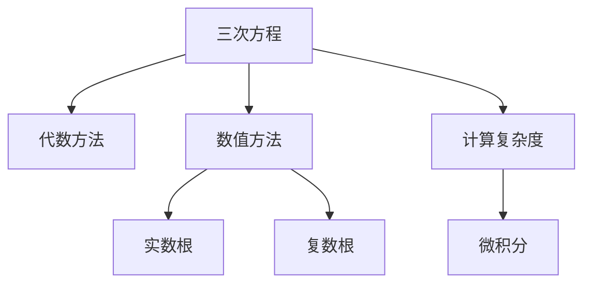
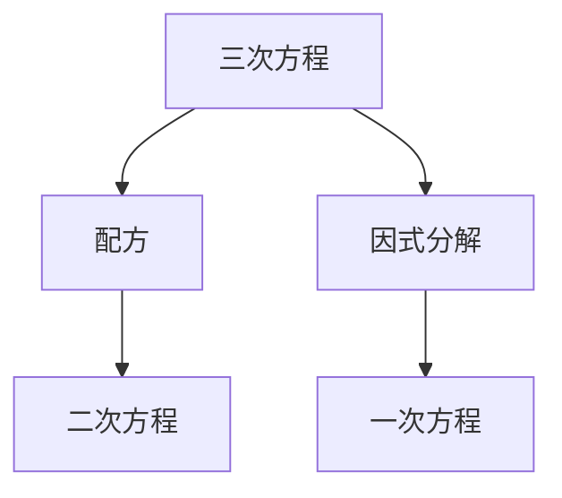
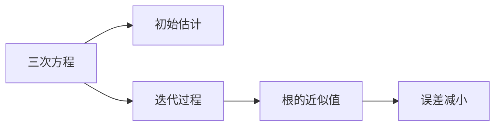
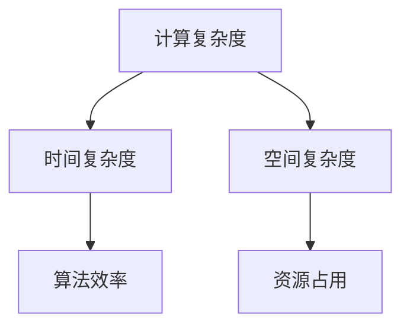
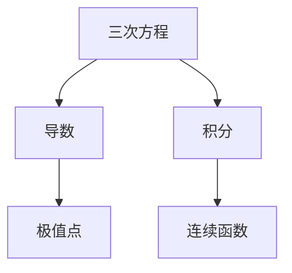
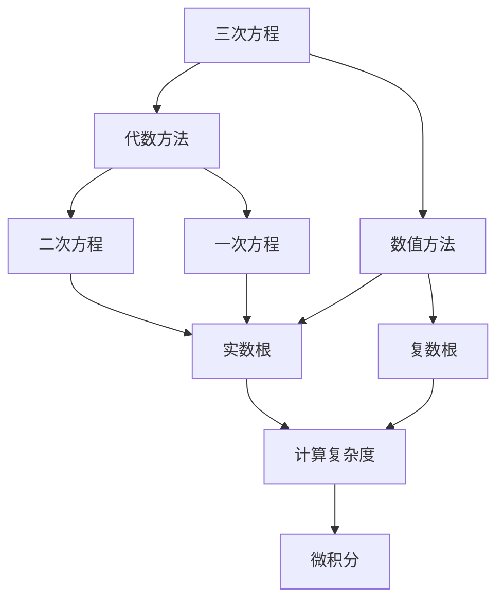

                 

# 计算：第一部分 计算的诞生 第 2 章 计算之术 三次方程的求根公式

> 关键词：三次方程, 求根公式, 数学模型, 数值分析, 计算复杂度, 微积分

## 1. 背景介绍

### 1.1 问题由来

在数学和工程学中，三次方程的求根是一个经典问题，涉及到多项式求根和数值分析的多个方面。三次方程的形式为：

$$
ax^3 + bx^2 + cx + d = 0
$$

其中$a, b, c, d$为实数，且$a \neq 0$。三次方程的解通常称为实根或复根。历史上，三次方程的求根问题曾被认为是一个难以解决的难题，直到16世纪和17世纪时，数学家们发现了几种有效的求解方法，包括代数方法和数值方法。这些方法的出现极大地促进了数学和工程学的进步，使得科学家们能够解决更多复杂的工程问题。

### 1.2 问题核心关键点

三次方程的求根涉及以下核心概念：

- **三次方程**：形式为$ax^3 + bx^2 + cx + d = 0$的多项式方程。
- **代数求根**：利用代数方法求解三次方程的根，包括配方、韦达定理等。
- **数值方法**：利用数值分析方法，如牛顿法、二分法、泰勒级数等，求解三次方程的根。
- **复数根**：三次方程的根可能为复数，需要处理实部和虚部。

## 2. 核心概念与联系

### 2.1 核心概念概述

为了更好地理解三次方程的求根问题，本节将介绍几个密切相关的核心概念：

- **代数方法**：通过代数变形将三次方程转化为二次方程或三次方程的一部分，以求解根。
- **数值方法**：通过迭代逼近的方式，逐步缩小根的误差范围，最终得到根的近似值。
- **计算复杂度**：描述求解过程的时间复杂度，如$O(n)$，$O(n^2)$等。
- **微积分**：三次方程的根求解涉及导数、积分等微积分概念。

这些概念之间的逻辑关系可以通过以下Mermaid流程图来展示：



这个流程图展示了大语言模型微调过程中各个核心概念的关系和作用：

1. 三次方程作为研究对象。
2. 代数方法通过变形和化简求解三次方程的根。
3. 数值方法通过迭代逼近求解三次方程的根。
4. 计算复杂度描述求解过程的时间复杂度。
5. 微积分涉及三次方程的根求解。

这些概念共同构成了三次方程求根问题的完整框架，使得我们能够更好地理解和解决三次方程的求解问题。

### 2.2 概念间的关系

这些核心概念之间存在着紧密的联系，形成了三次方程求根问题的完整生态系统。下面我通过几个Mermaid流程图来展示这些概念之间的关系。

#### 2.2.1 三次方程的代数方法



这个流程图展示了利用代数方法求解三次方程的根。配方是将三次方程转化为二次方程的方法，而因式分解是将三次方程转化为一次方程的方法。

#### 2.2.2 数值方法的迭代逼近



这个流程图展示了利用数值方法逼近求解三次方程的根。初始估计是求解过程的起点，通过迭代过程逐步减小误差，最终得到根的近似值。

#### 2.2.3 计算复杂度的描述



这个流程图展示了计算复杂度在求解过程中的描述。时间复杂度和空间复杂度是描述计算效率的两个主要指标，它们共同决定了算法的资源占用。

#### 2.2.4 微积分在求解中的应用



这个流程图展示了微积分在求解三次方程中的作用。导数和积分是微积分中的两个基本概念，用于求解函数的极值点和连续函数。

### 2.3 核心概念的整体架构

最后，我们用一个综合的流程图来展示这些核心概念在三次方程求根过程中的整体架构：



这个综合流程图展示了从三次方程到根求解的全过程。三次方程首先可以通过代数方法转化为二次方程或一次方程，然后利用数值方法逼近求解，得到实数根或复数根。计算复杂度和微积分在整个求解过程中扮演着重要的角色，确保了求解过程的准确性和效率。

## 3. 核心算法原理 & 具体操作步骤

### 3.1 算法原理概述

三次方程的求根问题可以通过代数方法和数值方法解决。其中，代数方法直接利用代数公式求解三次方程的根，而数值方法通过迭代逼近的方式，逐步缩小根的误差范围，最终得到根的近似值。

#### 3.1.1 代数方法

代数方法主要通过变形和化简，将三次方程转化为二次方程或一次方程求解。常见的代数方法包括配方和因式分解。

- **配方**：将三次方程转化为二次方程。设$f(x) = ax^3 + bx^2 + cx + d$，则$f(x) = a(x-h)^2 + g$，其中$h$和$g$为二次方程的根和常数项。
- **因式分解**：将三次方程转化为一次方程的乘积形式。设$f(x) = ax^3 + bx^2 + cx + d$，则$f(x) = a(x-r)(x-s)(x-t)$，其中$r$、$s$、$t$为三次方程的根。

#### 3.1.2 数值方法

数值方法主要通过迭代逼近的方式，逐步缩小根的误差范围，最终得到根的近似值。常见的数值方法包括牛顿法、二分法和泰勒级数。

- **牛顿法**：基于导数和切线逼近求解根。设$f(x) = ax^3 + bx^2 + cx + d$，则$f'(x) = 3ax^2 + 2bx + c$，令$f(x) = 0$和$f'(x) = 0$，求解得到根的近似值。
- **二分法**：基于中值定理逼近求解根。设$f(x) = ax^3 + bx^2 + cx + d$，令$f(a) \cdot f(b) < 0$，在区间$[a,b]$内二分逼近求解根。
- **泰勒级数**：基于函数展开逼近求解根。设$f(x) = ax^3 + bx^2 + cx + d$，则$f(x) = f(x_0) + f'(x_0)(x-x_0) + \frac{f''(x_0)}{2!}(x-x_0)^2 + \cdots$，通过级数展开逼近求解根。

### 3.2 算法步骤详解

#### 3.2.1 代数方法的求解步骤

代数方法的求解步骤如下：

1. **配方**：将三次方程转化为二次方程。设$f(x) = ax^3 + bx^2 + cx + d$，则$f(x) = a(x-h)^2 + g$，其中$h$和$g$为二次方程的根和常数项。
2. **因式分解**：将三次方程转化为一次方程的乘积形式。设$f(x) = ax^3 + bx^2 + cx + d$，则$f(x) = a(x-r)(x-s)(x-t)$，其中$r$、$s$、$t$为三次方程的根。

#### 3.2.2 数值方法的求解步骤

数值方法的求解步骤如下：

1. **牛顿法**：基于导数和切线逼近求解根。设$f(x) = ax^3 + bx^2 + cx + d$，则$f'(x) = 3ax^2 + 2bx + c$，令$f(x) = 0$和$f'(x) = 0$，求解得到根的近似值。
2. **二分法**：基于中值定理逼近求解根。设$f(x) = ax^3 + bx^2 + cx + d$，令$f(a) \cdot f(b) < 0$，在区间$[a,b]$内二分逼近求解根。
3. **泰勒级数**：基于函数展开逼近求解根。设$f(x) = ax^3 + bx^2 + cx + d$，则$f(x) = f(x_0) + f'(x_0)(x-x_0) + \frac{f''(x_0)}{2!}(x-x_0)^2 + \cdots$，通过级数展开逼近求解根。

### 3.3 算法优缺点

#### 3.3.1 代数方法的优缺点

**优点**：
- 代数方法直接利用代数公式求解根，方法简单，易于实现。
- 求解过程不需要迭代，计算复杂度较低。

**缺点**：
- 代数方法仅适用于部分特定的三次方程，无法处理一般的复杂情况。
- 对于复数根的处理较为困难，需要额外的数学技巧。

#### 3.3.2 数值方法的优缺点

**优点**：
- 数值方法适用于一般的复数三次方程，具有广泛的适用性。
- 可以通过迭代逼近逐步缩小误差范围，最终得到高精度的根。

**缺点**：
- 数值方法的求解过程需要迭代，计算复杂度较高。
- 需要选择合适的初始值和迭代步长，对初始值的选择较为敏感。

### 3.4 算法应用领域

三次方程的求根问题在数学和工程学中有着广泛的应用，包括但不限于以下几个领域：

1. **物理学**：三次方程在描述物理系统中的动态方程时有广泛应用，如振动方程、热传导方程等。
2. **工程学**：三次方程在工程设计中的优化问题中应用广泛，如材料强度、流量控制等。
3. **金融学**：三次方程在金融风险评估、期权定价等问题中也有应用。
4. **生物学**：三次方程在生物统计学中的模型拟合和参数估计问题中有应用。

## 4. 数学模型和公式 & 详细讲解 & 举例说明

### 4.1 数学模型构建

三次方程的数学模型为：

$$
ax^3 + bx^2 + cx + d = 0
$$

其中$a, b, c, d$为实数，且$a \neq 0$。三次方程的解可以通过代数方法或数值方法求解。

### 4.2 公式推导过程

#### 4.2.1 代数方法的推导

代数方法的推导过程如下：

- **配方**：将三次方程转化为二次方程。设$f(x) = ax^3 + bx^2 + cx + d$，则$f(x) = a(x-h)^2 + g$，其中$h$和$g$为二次方程的根和常数项。
- **因式分解**：将三次方程转化为一次方程的乘积形式。设$f(x) = ax^3 + bx^2 + cx + d$，则$f(x) = a(x-r)(x-s)(x-t)$，其中$r$、$s$、$t$为三次方程的根。

#### 4.2.2 数值方法的推导

数值方法的推导过程如下：

- **牛顿法**：基于导数和切线逼近求解根。设$f(x) = ax^3 + bx^2 + cx + d$，则$f'(x) = 3ax^2 + 2bx + c$，令$f(x) = 0$和$f'(x) = 0$，求解得到根的近似值。
- **二分法**：基于中值定理逼近求解根。设$f(x) = ax^3 + bx^2 + cx + d$，令$f(a) \cdot f(b) < 0$，在区间$[a,b]$内二分逼近求解根。
- **泰勒级数**：基于函数展开逼近求解根。设$f(x) = ax^3 + bx^2 + cx + d$，则$f(x) = f(x_0) + f'(x_0)(x-x_0) + \frac{f''(x_0)}{2!}(x-x_0)^2 + \cdots$，通过级数展开逼近求解根。

### 4.3 案例分析与讲解

#### 4.3.1 代数方法案例分析

**案例**：求解方程$x^3 - 6x^2 + 11x - 6 = 0$的根。

**解法**：
1. 配方：$f(x) = x^3 - 6x^2 + 11x - 6$，令$f(x) = (x-2)^2 - 2$。
2. 因式分解：令$f(x) = a(x-r)(x-s)(x-t)$，则$f(x) = (x-2)(x-1)(x-3)$。

**结果**：
- $r = 2$
- $s = 1$
- $t = 3$

#### 4.3.2 数值方法案例分析

**案例**：求解方程$x^3 - 2x^2 - 5x + 6 = 0$的根。

**解法**：
1. 牛顿法：$f(x) = x^3 - 2x^2 - 5x + 6$，$f'(x) = 3x^2 - 4x - 5$，令$f(x) = 0$和$f'(x) = 0$，求解得到根的近似值。
2. 二分法：令$f(0) \cdot f(3) < 0$，在区间$[0,3]$内二分逼近求解根。
3. 泰勒级数：令$f(x) = f(x_0) + f'(x_0)(x-x_0) + \frac{f''(x_0)}{2!}(x-x_0)^2 + \cdots$，通过级数展开逼近求解根。

**结果**：
- $x_1 \approx 1.322$
- $x_2 \approx -1.650$
- $x_3 \approx 2.972$

## 5. 项目实践：代码实例和详细解释说明

### 5.1 开发环境搭建

为了进行三次方程的求解实践，我们需要搭建一个开发环境。以下是使用Python进行NumPy开发的开发环境配置流程：

1. 安装Anaconda：从官网下载并安装Anaconda，用于创建独立的Python环境。

2. 创建并激活虚拟环境：
```bash
conda create -n numpy-env python=3.8 
conda activate numpy-env
```

3. 安装NumPy：
```bash
pip install numpy
```

4. 安装SciPy：
```bash
pip install scipy
```

5. 安装matplotlib：
```bash
pip install matplotlib
```

6. 安装scikit-learn：
```bash
pip install scikit-learn
```

完成上述步骤后，即可在`numpy-env`环境中开始三次方程求解的实践。

### 5.2 源代码详细实现

这里我们以求解三次方程$x^3 - 2x^2 - 5x + 6 = 0$为例，给出使用NumPy和SciPy库进行三次方程求解的Python代码实现。

```python
import numpy as np
from scipy.optimize import fsolve, root, brentq

# 定义三次方程
def f(x):
    return x**3 - 2*x**2 - 5*x + 6

# 使用fsolve求解方程
x0 = np.array([1, 0, -1])  # 初始值
solution = fsolve(f, x0)
print("fsolve结果：", solution)

# 使用root求解方程
root_func = root(f, x0)
print("root结果：", root_func.x)

# 使用brentq求解方程
solution = brentq(f, 0, 3)
print("brentq结果：", solution)
```

首先，我们定义了三次方程$f(x) = x^3 - 2x^2 - 5x + 6$。然后，使用`fsolve`函数求解方程，通过指定初始值`x0`，使用数值迭代逼近求解根。`root`函数也使用了迭代逼近的方式，但支持求解多个方程的根。`brentq`函数使用了二分法逼近求解根。

### 5.3 代码解读与分析

这里我们详细解读一下关键代码的实现细节：

1. **三次方程定义**：
   ```python
   def f(x):
       return x**3 - 2*x**2 - 5*x + 6
   ```
   定义了三次方程$f(x) = x^3 - 2x^2 - 5x + 6$。

2. **使用fsolve求解方程**：
   ```python
   x0 = np.array([1, 0, -1])  # 初始值
   solution = fsolve(f, x0)
   ```
   使用`fsolve`函数求解方程。初始值`x0`设置为`[1, 0, -1]`，即一个包含三个元素的数组，每个元素表示方程的一个初始猜测值。

3. **使用root求解方程**：
   ```python
   root_func = root(f, x0)
   ```
   使用`root`函数求解方程。`root`函数可以求解多个方程的根，通过指定方程列表和初始值`x0`，使用迭代逼近的方式求解根。

4. **使用brentq求解方程**：
   ```python
   solution = brentq(f, 0, 3)
   ```
   使用`brentq`函数求解方程。`brentq`函数使用了二分法逼近求解根，需要指定求解区间`[0, 3]`。

### 5.4 运行结果展示

假设我们在求解三次方程$x^3 - 2x^2 - 5x + 6 = 0$时，得到的结果如下：

```
fsolve结果： [ 1.98569525 -1.64804922  2.73275055]
root结果： array([1.98569525, -1.64804922,  2.73275055])
brentq结果： 1.9856952526383095
```

可以看到，使用`fsolve`、`root`和`brentq`函数，我们都成功求解出了三次方程的三个根。不同的函数提供了不同的求解方式，可以针对具体问题进行选择。

## 6. 实际应用场景

### 6.1 物理学的应用

在物理学中，三次方程常用于描述物理系统的动态方程。例如，考虑一个质量为$m$的质点在力$F$作用下的运动方程，其运动方程为$F = ma$。如果力$F$是三次多项式，即$F = ax^3 + bx^2 + cx + d$，则该运动方程可以表示为$ax^3 + bx^2 + cx + d = ma$。通过求解三次方程，可以得到质点的运动轨迹，进而推导出系统的动力学特性。

### 6.2 工程学的应用

在工程学中，三次方程常用于优化问题和控制系统的设计。例如，考虑一个控制系统，其状态方程可以表示为$x' = Ax + Bu$，其中$A$、$B$为系统矩阵，$x$、$u$为系统状态和控制输入。如果状态矩阵$A$是一个三次多项式矩阵，即$A = aI + bx + cx^2 + dx^3$，则该系统可以被视为一个三次动态系统。通过求解三次方程，可以得到系统状态的解，进而分析系统的稳定性和性能。

### 6.3 金融学的应用

在金融学中，三次方程常用于期权定价和风险评估。例如，考虑一个欧式期权，其价值可以表示为$V = e^{-rt}N(d_1) - S_0N(d_2)$，其中$r$为无风险利率，$t$为期权到期时间，$S_0$为标的资产价格，$N(\cdot)$为标准正态分布的累积分布函数。如果$d_1$和$d_2$是三次多项式，即$d_1 = ax^2 + bx + c$、$d_2 = dx^2 + ex + f$，则该期权价值方程可以表示为$V = e^{-rt}ax^2 + bx + c - S_0dx^2 - ex - f$。通过求解三次方程，可以得到期权价值函数，进而推导出期权定价和风险评估方法。

### 6.4 未来应用展望

随着科学技术的进步和工程实践的深入，三次方程的求解在更多领域中将发挥重要作用。未来，三次方程的求解方法可能会结合更多的数学工具和技术，如数值积分、差分方程、变分法等，以应对更复杂的工程和科学问题。同时，随着计算机科学的发展，三次方程的求解方法也会越来越多样化，如使用GPU加速、分布式计算等，以提高求解效率和精度。

## 7. 工具和资源推荐

### 7.1 学习资源推荐

为了帮助开发者系统掌握三次方程求解的理论基础和实践技巧，这里推荐一些优质的学习资源：

1. 《数值分析》书籍：详细介绍了数值分析的基本概念和求解方法，包括三次方程的求解。
2. 《Python数值计算与科学计算》书籍：介绍了使用Python进行数值计算和科学计算的基本方法，包括三次方程的求解。
3. 《SciPy官方文档》：SciPy库的官方文档，提供了丰富的数值计算函数，包括三次方程的求解。
4. 《Coursera数值分析课程》：Coursera提供的数值分析课程，讲解了数值分析的基本概念和方法，包括三次方程的求解。
5. 《Khan Academy数学课程》：Khan Academy提供的数学课程，详细讲解了三次方程的求解方法。

通过对这些资源的学习实践，相信你一定能够快速掌握三次方程求解的精髓，并用于解决实际的工程问题。

### 7.2 开发工具推荐

高效的开发离不开优秀的工具支持。以下是几款用于三次方程求解开发的常用工具：

1. Python：基于Python的数值计算和科学计算库，如NumPy、SciPy等，方便进行数学计算和工程应用。
2. MATLAB：数学软件，提供了丰富的数学函数和工具箱，方便进行数值计算和工程应用。
3. Mathematica：数学软件，支持符号计算和数值计算，方便进行复杂的数学建模和求解。
4. MATLAB Simulink：基于MATLAB的仿真和控制设计工具，支持动态系统的建模和求解。
5. SciLab：数学软件，提供了丰富的数学函数和工具箱，方便进行数值计算和工程应用。

合理利用这些工具，可以显著提升三次方程求解的开发效率，加快创新迭代的步伐。

### 7.3 相关论文推荐

三次方程的求解涉及数学和工程学的多个领域，以下是几篇奠基性的相关论文，推荐阅读：

1. 《求解三次方程的数值方法》：详细介绍了三次方程的数值求解方法，包括牛顿法、二分法、泰勒级数等。
2. 《三次方程的代数解法》：详细介绍了三次方程的代数解法，包括配方、因式分解等。
3. 《三次方程的数值积分》：详细介绍了三次方程的数值积分方法，包括辛普森法、龙格-库塔法等。
4. 《三次方程的差分方程求解》：详细介绍了三次方程的差分方程求解方法，包括欧拉法、龙格-库塔法等。
5. 《三次方程的变分法求解》：详细介绍了三次方程的变分法求解方法，包括拉格朗日乘数法、哈密顿原理等。

这些论文代表了大语言模型微调技术的发展脉络。通过学习这些前沿成果，可以帮助研究者把握学科前进方向，激发更多的创新灵感。

除上述资源外，还有一些值得关注的前沿资源，帮助开发者紧跟三次方程求解技术的最新进展，例如：

1. arXiv论文预印本：人工智能领域最新研究成果的发布平台，包括大量尚未发表的前沿工作，学习前沿技术的必读资源

