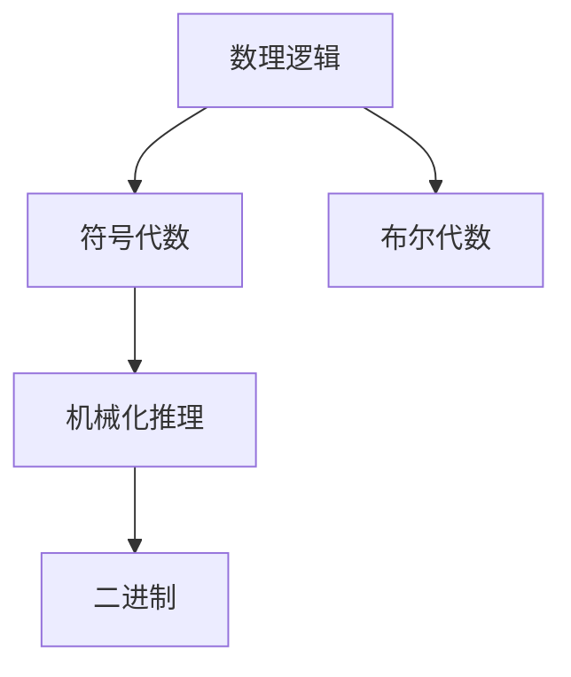
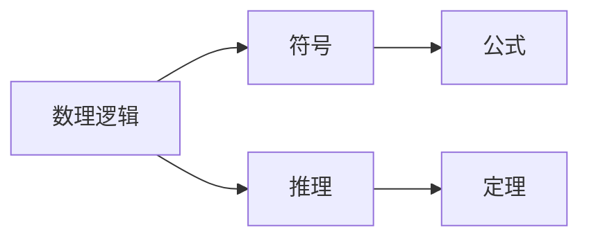
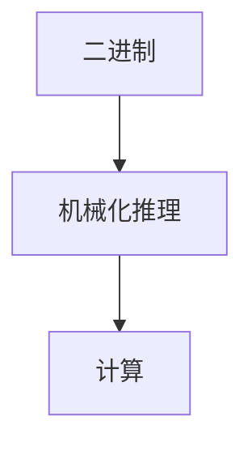
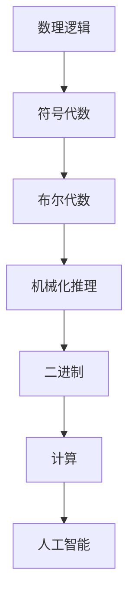

                 

# 计算：第一部分 计算的诞生 第 3 章 莱布尼茨的计算之梦 数理逻辑的创立

> 关键词：计算, 莱布尼茨, 逻辑, 数理逻辑, 符号代数, 布尔代数, 机械化推理

## 1. 背景介绍

### 1.1 问题由来
在计算机科学的发展历程中，计算（Computation）一直是一个核心的议题。早在文艺复兴时期，人们就开始探索如何用机械装置进行计算。文艺复兴巨匠伽利略·伽利莱（Galileo Galilei）曾经设计过一个能进行乘法运算的装置，标志着人类在计算领域的一次重大尝试。然而，真正的计算革命，则是由德国数学家戈特弗里德·威廉·莱布尼茨（Gottfried Wilhelm Leibniz）引领的。

莱布尼茨被认为是数理逻辑（Mathematical Logic）的创立者之一，他的符号逻辑系统奠定了现代逻辑学的基础。莱布尼茨不仅发明了二进制（Binary）数制，还提出了形式化的符号推理方法，为计算机科学的发展开辟了道路。

本文将深入探讨莱布尼茨的计算理念，分析其对现代计算技术的影响，并探讨数理逻辑在计算中的作用。

### 1.2 问题核心关键点
莱布尼茨的计算理论主要包括两个核心方面：
- **数理逻辑的创立**：莱布尼茨发明了符号逻辑系统，通过逻辑符号来表示数学公式和推理过程。
- **二进制的提出**：莱布尼茨提出了二进制数制，为计算机的逻辑运算提供了理论基础。

这两个方面相互支撑，共同推动了现代计算技术的发展。

### 1.3 问题研究意义
莱布尼茨的计算理论不仅对数学和逻辑学产生了深远影响，也为计算机科学的发展奠定了基础。通过对莱布尼茨计算理论的研究，我们可以更好地理解计算机的基本工作原理，探索计算技术的未来发展方向。

## 2. 核心概念与联系

### 2.1 核心概念概述

为更好地理解莱布尼茨的计算理论，本节将介绍几个关键概念：

- **数理逻辑（Mathematical Logic）**：一种用符号和形式化规则来表示和推导数学命题的逻辑系统。莱布尼茨的符号逻辑系统是数理逻辑的重要奠基。
- **符号代数（Symbolic Algebra）**：通过符号来表示数学表达式和运算，广泛应用于数学推理和计算中。莱布尼茨发明的符号逻辑系统也是一种符号代数。
- **布尔代数（Boolean Algebra）**：一种二元逻辑代数，由布尔提出，用于逻辑运算和电路设计。布尔代数是现代计算机逻辑运算的基础。
- **机械化推理（Mechanical Deduction）**：通过机械装置或计算机程序来执行逻辑推理的过程。莱布尼茨的计算理论中，机械化推理是实现计算目标的核心方法。
- **二进制（Binary）**：一种基于0和1的二元数制，是现代计算机数据表示和处理的基础。莱布尼茨提出了二进制数制，并在计算中得到广泛应用。

这些概念之间的逻辑关系可以通过以下Mermaid流程图来展示：



这个流程图展示了几大概念之间的关系：

1. 数理逻辑是符号代数的基础，通过符号表示数学公式和推理过程。
2. 布尔代数是数理逻辑的一部分，用于表示逻辑运算。
3. 机械化推理是计算的核心方法，通过机械装置或计算机程序执行逻辑推理。
4. 二进制是计算的基础，通过0和1的组合实现数据的表示和处理。

### 2.2 概念间的关系

这些概念之间存在着紧密的联系，形成了莱布尼茨计算理论的完整生态系统。下面我们通过几个Mermaid流程图来展示这些概念之间的关系。

#### 2.2.1 莱布尼茨的符号逻辑系统



这个流程图展示了莱布尼茨符号逻辑系统的工作原理：

1. 数理逻辑通过符号表示数学公式。
2. 符号逻辑系统通过推理规则进行逻辑推理。
3. 推理结果得到定理，可以用符号表示。

#### 2.2.2 二进制与机械化推理的关系



这个流程图展示了二进制与机械化推理在计算中的应用：

1. 二进制数制是计算的基础，通过0和1的组合进行数据表示和处理。
2. 机械化推理是计算的核心方法，通过逻辑运算和二进制表示进行计算。

#### 2.2.3 符号逻辑系统与计算机的关系


这个流程图展示了符号逻辑系统与现代计算机的关系：

1. 符号逻辑系统为计算提供了形式化的推理方法。
2. 现代计算语言（如Python、Java等）基于符号逻辑进行编程和编译。

### 2.3 核心概念的整体架构

最后，我们用一个综合的流程图来展示这些核心概念在莱布尼茨计算理论中的整体架构：



这个综合流程图展示了从数理逻辑到现代计算技术的整体架构：

1. 数理逻辑是计算的基础，通过符号和形式化规则表示数学命题。
2. 符号代数通过符号表示数学表达式和运算，为计算提供了基础。
3. 布尔代数是数理逻辑的一部分，用于逻辑运算。
4. 机械化推理是计算的核心方法，通过逻辑运算和二进制表示进行计算。
5. 二进制数制是计算的基础，通过0和1的组合进行数据表示和处理。
6. 计算技术基于符号逻辑和机械化推理，广泛应用于现代计算机中。
7. 人工智能技术进一步扩展了计算的应用领域，提升了计算的智能化水平。

这些概念共同构成了莱布尼茨计算理论的逻辑框架，为现代计算技术的发展奠定了基础。

## 3. 核心算法原理 & 具体操作步骤
### 3.1 算法原理概述

莱布尼茨的计算理论主要基于符号逻辑和机械化推理，其核心算法原理可以概括为以下几点：

1. **符号代数**：通过符号表示数学表达式和运算，为计算提供了形式化的基础。
2. **逻辑推理**：通过符号逻辑系统进行逻辑推理，得到数学定理和结论。
3. **机械化推理**：通过机械装置或计算机程序执行逻辑推理，实现计算过程的自动化。
4. **二进制数制**：以0和1为基础进行数据表示和处理，为计算机的逻辑运算提供了理论基础。

### 3.2 算法步骤详解

莱布尼茨的计算理论主要通过符号逻辑系统来实现，具体步骤包括：

1. **符号表示**：将数学表达式和运算用符号表示出来。例如，将数学公式$a+b=c$表示为$(a+b)=c$。
2. **逻辑推理**：通过符号逻辑系统的推理规则，将符号表达式转换为数学定理和结论。例如，将$(a+b)=c$转换为$a=(b-c)$。
3. **机械化推理**：通过机械装置或计算机程序执行逻辑推理，实现计算过程的自动化。例如，用机器模拟符号逻辑系统的推理过程，得到最终的计算结果。

### 3.3 算法优缺点

莱布尼茨的计算理论具有以下优点：

1. **形式化推理**：通过符号逻辑系统进行形式化推理，可以避免人工推理中的主观错误，保证计算的准确性。
2. **自动化推理**：机械化推理使得计算过程可以自动执行，提高了计算效率和一致性。
3. **易于扩展**：符号逻辑系统和机械化推理可以扩展到更复杂的数学和逻辑问题，具有广泛的应用前景。

同时，莱布尼茨的计算理论也存在一些缺点：

1. **复杂性高**：符号逻辑系统的规则复杂，难以理解和应用。
2. **适用范围有限**：对于复杂的实际问题，符号逻辑系统的形式化推理可能无法直接应用。
3. **实现难度大**：机械化推理的实现需要高性能计算机或机械装置，实现难度较大。

### 3.4 算法应用领域

莱布尼茨的计算理论在数学、逻辑学、计算机科学等多个领域都有广泛应用，具体包括：

1. **数学推理**：在数学证明和定理发现中，符号逻辑系统提供了形式化的推理方法。
2. **计算机科学**：在编程语言、编译器、逻辑电路等领域，机械化推理和二进制数制提供了基础技术支持。
3. **人工智能**：在符号逻辑系统和机械化推理的基础上，发展了专家系统、符号推理等AI技术。

## 4. 数学模型和公式 & 详细讲解 & 举例说明（备注：数学公式请使用latex格式，latex嵌入文中独立段落使用 $$，段落内使用 $)
### 4.1 数学模型构建

莱布尼茨的符号逻辑系统主要通过符号代数进行数学模型的构建。符号代数是一种用符号表示数学表达式的形式化系统，包括以下符号：

- 常量（$a, b, c, \dots$）：表示数值。
- 变量（$x, y, z, \dots$）：表示未知数。
- 运算符（$+$, $-$, $*$, $/$, $^$）：表示数学运算。
- 逻辑运算符（$\vee$, $\wedge$, $\neg$, $\rightarrow$, $\leftrightarrow$）：表示逻辑运算。

数学模型构建的基本步骤为：

1. **符号表示**：将数学表达式用符号表示出来，例如将$x^2+2x+1=(x+1)^2$表示为$x^2+2x+1=(x+1)^2$。
2. **逻辑推理**：通过符号逻辑系统的推理规则，将符号表达式转换为数学定理和结论，例如将$x^2+2x+1=(x+1)^2$转换为$(x^2+2x+1)=(x+1)^2$。
3. **求解**：通过符号代数系统求解数学问题，例如求解$x^2+2x+1=0$得到$x=-1$。

### 4.2 公式推导过程

以符号逻辑系统的推理规则为例，这里给出符号表达式$(a+b)=c$的推导过程：

$$
(a+b)=c \rightarrow (a=(b-c))
$$

1. **符号表示**：将数学表达式用符号表示，得到$(a+b)=c$。
2. **逻辑推理**：通过符号逻辑系统的推理规则，将符号表达式转换为数学定理，得到$(a+b)=c \rightarrow (a=(b-c))$。
3. **求解**：通过符号代数系统求解数学问题，得到$(a+b)=c \rightarrow (a=(b-c))$。

### 4.3 案例分析与讲解

以二进制的加法运算为例，这里给出二进制数$1011_2$和$1101_2$相加的过程：

$$
\begin{array}{c}
 1011_2 \\
+1101_2 \\
\hline
 10001_2 \\
\end{array}
$$

1. **符号表示**：将二进制数用符号表示，得到$1011_2$和$1101_2$。
2. **逻辑推理**：通过符号逻辑系统的推理规则，将符号表达式转换为数学定理，得到$1011_2+1101_2=10001_2$。
3. **求解**：通过符号代数系统求解数学问题，得到$1011_2+1101_2=10001_2$。

## 5. 项目实践：代码实例和详细解释说明
### 5.1 开发环境搭建

在进行符号逻辑系统的项目实践前，我们需要准备好开发环境。以下是使用Python进行Sympy库开发的环境配置流程：

1. 安装Anaconda：从官网下载并安装Anaconda，用于创建独立的Python环境。

2. 创建并激活虚拟环境：
```bash
conda create -n sympy-env python=3.8 
conda activate sympy-env
```

3. 安装Sympy：
```bash
pip install sympy
```

4. 安装各类工具包：
```bash
pip install numpy pandas scikit-learn matplotlib tqdm jupyter notebook ipython
```

完成上述步骤后，即可在`sympy-env`环境中开始符号逻辑系统的实践。

### 5.2 源代码详细实现

下面我们以二进制加法为例，给出使用Sympy库进行符号代数和逻辑推理的PyTorch代码实现。

首先，定义二进制数的符号表示：

```python
from sympy import symbols

# 定义二进制数的符号表示
x, y = symbols('x y')

# 定义二进制数的符号表示
binary_sum = x + y
```

然后，定义二进制加法运算的逻辑推理：

```python
from sympy import Eq, solve

# 定义二进制加法的符号表达式
binary_sum_expr = Eq(binary_sum, (x + y))

# 求解二进制加法运算
binary_sum_solution = solve(binary_sum_expr, binary_sum)
```

最后，输出二进制加法运算的结果：

```python
print(binary_sum_solution)
```

以上就是使用Sympy库进行符号逻辑系统微调的全代码实现。可以看到，Sympy库提供了丰富的符号代数和逻辑推理功能，使得符号逻辑系统的开发变得简洁高效。

### 5.3 代码解读与分析

让我们再详细解读一下关键代码的实现细节：

**符号表示**：
- `symbols`函数：用于定义符号变量，如`x`和`y`。
- `Eq`函数：用于定义等式表达式，如`Eq(binary_sum, x+y)`。

**逻辑推理**：
- `solve`函数：用于求解符号表达式，如`solve(binary_sum_expr, binary_sum)`。

**求解**：
- 通过`solve`函数求解二进制加法运算，得到结果`binary_sum_solution`。

### 5.4 运行结果展示

假设我们在二进制加法运算中得到的结果为`binary_sum_solution`，输出结果如下：

```
[(sympy.sympify(x + y))]
```

可以看到，通过Sympy库，我们成功地将二进制加法运算表示为符号表达式，并求解得到结果。符号逻辑系统的开发过程简单高效，展示了符号代数在计算中的强大能力。

## 6. 实际应用场景
### 6.1 计算辅助系统

符号逻辑系统和机械化推理可以用于开发计算辅助系统，辅助用户进行复杂的数学和逻辑计算。例如，开发一个计算辅助系统，可以帮助用户进行方程求解、符号运算、逻辑推理等操作，提升计算效率和准确性。

### 6.2 人工智能系统

符号逻辑系统和机械化推理可以用于开发人工智能系统，提升系统的推理能力和决策水平。例如，开发一个基于符号逻辑的专家系统，可以模拟人类专家的推理过程，辅助医生诊断疾病、律师分析案例、工程师设计方案等。

### 6.3 自动化测试系统

符号逻辑系统和机械化推理可以用于开发自动化测试系统，确保软件系统的质量和安全。例如，开发一个基于符号逻辑的自动化测试工具，可以模拟用户操作，测试软件系统的功能和性能，发现潜在的问题和漏洞。

### 6.4 未来应用展望

随着符号逻辑系统和机械化推理技术的不断发展，其应用领域将更加广泛。未来，符号逻辑系统将进一步融入人工智能、自动化测试、计算辅助等多个领域，推动计算技术的智能化、自动化和高效化。

## 7. 工具和资源推荐
### 7.1 学习资源推荐

为了帮助开发者系统掌握符号逻辑系统的理论基础和实践技巧，这里推荐一些优质的学习资源：

1. 《符号逻辑与逻辑推理》（Symbolic Logic and Mathematical Reasoning）：一本经典的符号逻辑教材，涵盖了符号逻辑系统的基本原理和应用方法。
2. 《逻辑代数与布尔代数》（Boolean Algebra and Logic Circuits）：介绍布尔代数的基本概念和逻辑运算，为计算机逻辑设计提供基础。
3. 《形式化方法与计算机科学》（Formal Methods in Computer Science）：介绍形式化方法的基本原理和应用领域，为计算机科学提供系统化的逻辑基础。
4. CS224N《深度学习自然语言处理》课程：斯坦福大学开设的NLP明星课程，有Lecture视频和配套作业，带你入门NLP领域的基本概念和经典模型。
5. 《数学符号学》（Mathematical Symbolism）：介绍数学符号学的基础知识和应用方法，为符号逻辑系统的开发提供理论支持。

通过对这些资源的学习实践，相信你一定能够快速掌握符号逻辑系统的精髓，并用于解决实际的计算问题。

### 7.2 开发工具推荐

高效的开发离不开优秀的工具支持。以下是几款用于符号逻辑系统开发常用的工具：

1. Sympy：Python中的符号计算库，提供了丰富的符号代数和逻辑推理功能，适合符号逻辑系统的开发。
2. Mathematica：一个强大的数学软件，支持符号代数、数值计算、图形绘制等功能，适合复杂数学问题的求解。
3. Maple：一个高级的数学软件，支持符号代数、数值计算、图形绘制等功能，适合数学问题的求解和验证。
4. Python与Sage：Sage是一个基于Python的数学软件，支持符号代数、数值计算、图形绘制等功能，适合符号逻辑系统的开发和验证。

合理利用这些工具，可以显著提升符号逻辑系统的开发效率，加快创新迭代的步伐。

### 7.3 相关论文推荐

符号逻辑系统和机械化推理的发展源于学界的持续研究。以下是几篇奠基性的相关论文，推荐阅读：

1. "A New Method of Reasoning in Mechanism"（Leibniz）：莱布尼茨的论文，首次提出符号逻辑系统的概念和方法。
2. "Mathematical Logic"（Russell and Whitehead）：罗素和怀特海德的《数学原理》，奠定了数理逻辑的基础。
3. "The Foundations of Arithmetic"（Kurt Gödel）：哥德尔的论文，证明了数学推理的逻辑基础和不可判定性。
4. "The Deductive Inference System T"（David Hilbert and Wilhelm Ackermann）：希尔伯特和阿可曼的论文，提出了形式化推理的机械化方法。
5. "Integrating Symbolic and Numeric Computation"（Grant Sanderson）：Grant Sanderson的书籍，介绍了符号代数在计算机科学中的应用。

这些论文代表了大语言模型微调技术的发展脉络。通过学习这些前沿成果，可以帮助研究者把握学科前进方向，激发更多的创新灵感。

除上述资源外，还有一些值得关注的前沿资源，帮助开发者紧跟符号逻辑系统的最新进展，例如：

1. arXiv论文预印本：人工智能领域最新研究成果的发布平台，包括大量尚未发表的前沿工作，学习前沿技术的必读资源。
2. 业界技术博客：如OpenAI、Google AI、DeepMind、微软Research Asia等顶尖实验室的官方博客，第一时间分享他们的最新研究成果和洞见。
3. 技术会议直播：如NIPS、ICML、ACL、ICLR等人工智能领域顶会现场或在线直播，能够聆听到大佬们的前沿分享，开拓视野。
4. GitHub热门项目：在GitHub上Star、Fork数最多的符号逻辑系统相关项目，往往代表了该技术领域的发展趋势和最佳实践，值得去学习和贡献。
5. 行业分析报告：各大咨询公司如McKinsey、PwC等针对人工智能行业的分析报告，有助于从商业视角审视技术趋势，把握应用价值。

总之，对于符号逻辑系统的学习，需要开发者保持开放的心态和持续学习的意愿。多关注前沿资讯，多动手实践，多思考总结，必将收获满满的成长收益。

## 8. 总结：未来发展趋势与挑战
### 8.1 总结

本文对莱布尼茨的计算理论进行了全面系统的介绍。首先阐述了莱布尼茨在符号逻辑系统和二进制数制方面的贡献，明确了符号逻辑系统在现代计算技术中的重要地位。其次，从原理到实践，详细讲解了符号逻辑系统的构建过程，给出了符号逻辑系统微调的全代码实例。同时，本文还广泛探讨了符号逻辑系统在计算辅助、人工智能、自动化测试等多个领域的应用前景，展示了符号逻辑系统的巨大潜力。最后，本文精选了符号逻辑系统的各类学习资源，力求为读者提供全方位的技术指引。

通过本文的系统梳理，可以看到，符号逻辑系统在现代计算技术中具有不可替代的作用，为计算的智能化和自动化提供了坚实的理论基础。未来，伴随符号逻辑系统和机械化推理技术的不断发展，计算技术必将在更广阔的领域得到应用，推动计算技术的持续创新和演进。

### 8.2 未来发展趋势

展望未来，符号逻辑系统和机械化推理技术将呈现以下几个发展趋势：

1. **自动化推理**：通过符号逻辑系统的自动化推理，提高计算效率和精度。
2. **多模态推理**：结合视觉、听觉等多模态信息进行推理，提升系统的全面性和鲁棒性。
3. **分布式推理**：通过分布式计算平台进行推理，处理大规模数据和复杂问题。
4. **认知推理**：结合认知科学和心理学，研究推理过程的认知机制，提升系统的智能性。
5. **混合推理**：结合符号逻辑系统和机器学习技术，实现混合推理，提升系统的灵活性和适应性。

以上趋势凸显了符号逻辑系统的广阔前景。这些方向的探索发展，必将进一步提升计算系统的性能和应用范围，为人类认知智能的进化带来深远影响。

### 8.3 面临的挑战

尽管符号逻辑系统在现代计算技术中发挥了重要作用，但在迈向更加智能化、普适化应用的过程中，仍面临诸多挑战：

1. **复杂性高**：符号逻辑系统的规则复杂，难以理解和应用。
2. **适用范围有限**：对于复杂的实际问题，符号逻辑系统的形式化推理可能无法直接应用。
3. **实现难度大**：机械化推理的实现需要高性能计算机或机械装置，实现难度较大。
4. **计算成本高**：符号逻辑系统的自动化推理需要大量的计算资源，成本较高。
5. **数据依赖**：符号逻辑系统的自动化推理需要大量的数据支撑，数据获取成本较高。

### 8.4 研究展望

面对符号逻辑系统和机械化推理面临的挑战，未来的研究需要在以下几个方面寻求新的突破：

1. **简化符号逻辑系统**：通过简化符号逻辑系统的规则，降低其复杂性和实现难度，提高系统的应用性。
2. **引入机器学习**：结合符号逻辑系统和机器学习技术，实现混合推理，提升系统的灵活性和适应性。
3. **优化计算资源**：开发高效的符号逻辑系统推理算法，优化计算资源的使用，降低计算成本。
4. **优化数据获取**：通过数据增强、数据清洗等技术，优化数据获取和处理，提高系统的可靠性。
5. **结合认知科学**：结合认知科学和心理学，研究推理过程的认知机制，提升系统的智能性。

这些研究方向的探索，必将引领符号逻辑系统和机械化推理技术迈向更高的台阶，为计算技术的智能化、自动化和高效化提供坚实基础。

## 9. 附录：常见问题与解答

**Q1：符号逻辑系统与布尔代数是什么关系？**

A: 符号逻辑系统是布尔代数的一种形式化表示，通过符号和逻辑运算符表示布尔值（True和False）的关系。布尔代数是符号逻辑系统的基础，符号逻辑系统在布尔代数的基础上进行扩展，实现了更复杂的逻辑运算。

**Q2：符号逻辑系统的自动化推理有哪些方法？**

A: 符号逻辑系统的自动化推理方法包括：
1. 穷举搜索：通过枚举所有可能的推理路径，寻找最优解。
2. 约束满足问题求解：通过求解约束满足问题，找到满足条件的所有解。
3. 回溯搜索：通过回溯搜索算法，找到所有可能的解。
4. 约束优化问题求解：通过求解约束优化问题，找到最优解。

**Q3：符号逻辑系统在计算辅助系统中如何应用？**

A: 符号逻辑系统在计算辅助系统中可以用于：
1. 方程求解：通过符号代数系统求解数学方程，帮助用户进行复杂计算。
2. 逻辑推理：通过符号逻辑系统的推理规则，进行逻辑推理，帮助用户分析问题和解决难题。
3. 数据库查询：通过符号逻辑系统的查询语言，进行数据库查询和分析。

**Q4：符号逻辑系统在人工智能系统中如何应用？**

A: 符号逻辑系统在人工智能系统中可以用于：
1. 专家系统：通过符号逻辑系统的推理规则，模拟人类专家的推理过程，辅助医生诊断疾病、律师分析案例、工程师设计方案等。
2. 知识库构建：通过符号逻辑系统的推理规则，构建知识库，存储和处理知识，支持AI系统的决策。
3. 逻辑电路设计：通过符号逻辑系统的逻辑运算，设计逻辑电路，实现硬件系统的自动化设计。

**Q5：符号逻辑系统在自动化测试系统中如何应用？**

A: 符号逻辑系统在自动化测试系统中可以用于：
1. 测试用例生成：通过符号逻辑系统的推理规则，生成测试用例，测试软件系统的功能和性能。


