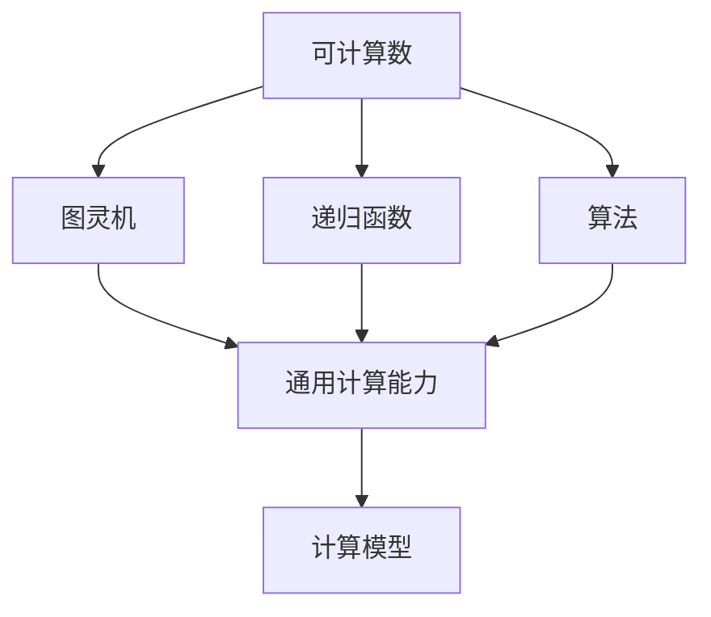
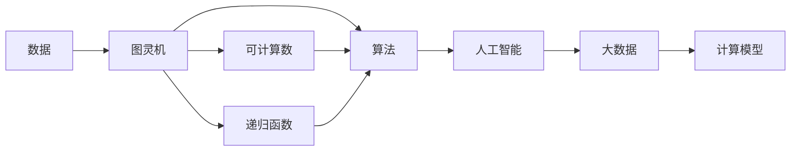

                 

# 计算：第三部分 计算理论的形成 第 8 章 计算理论的诞生：图灵的可计算数 丘奇-图灵论题

> 关键词：可计算数,丘奇-图灵论题,图灵机,递归函数,算法,人工智能

## 1. 背景介绍

### 1.1 问题由来
计算理论的形成是大数据时代的重要基石，通过探究什么是可计算数以及计算的本质，可以深入理解人工智能和计算机科学的核心原理。这一章主要探讨图灵的可计算数以及丘奇-图灵论题，从而为后续深入学习计算理论打下坚实基础。

### 1.2 问题核心关键点
图灵的可计算数和丘奇-图灵论题是计算理论的两大核心概念，主要关注于“可计算数”和“算法”的概念及其之间的关系。其关键在于，通过形式化定义计算的原理和目标，推导出可计算数的本质，并建立计算与人工智能之间的桥梁。

### 1.3 问题研究意义
深入理解图灵的可计算数和丘奇-图灵论题，不仅有助于全面掌握计算理论的基础，还能够为人工智能、计算机科学等领域的应用提供理论支撑。此外，这些理论能够为程序员、数据科学家以及广大读者提供深入的认知和启示，从而更好地理解计算的本质和应用。

## 2. 核心概念与联系

### 2.1 核心概念概述

为了更深入地理解图灵的可计算数以及丘奇-图灵论题，我们需要先介绍几个关键概念：

- 可计算数（Computable Number）：指可以通过有限步计算得到的确切数值。计算机中的数据和算法，其实质上都在处理可计算数。
- 图灵机（Turing Machine）：由英国数学家图灵提出，是一种抽象的计算模型，可以模拟任何可计算函数。图灵机是最简单的计算模型之一，也是研究计算理论和算法的重要工具。
- 递归函数（Recursive Function）：由丘奇提出，指能够定义自身为自身的函数。递归函数能够描述计算机程序的执行过程，从而提供了一种计算的抽象框架。
- 算法（Algorithm）：解决特定问题的步骤序列，最终能够得到确定的结果。算法是计算理论的核心概念，是研究和设计计算工具的基础。

这些概念之间存在密切联系，共同构成了计算理论的基础。图灵机和递归函数通过形式化定义计算的原理和目标，推导出可计算数的本质，为算法提供了理论支撑，从而进一步推动人工智能和计算机科学的发展。

### 2.2 概念间的关系

这些核心概念之间的关系可以用以下Mermaid流程图来展示：



这个流程图展示了可计算数、图灵机、递归函数和算法之间的关系：

1. 可计算数通过图灵机的计算能力，被定义为能够通过有限步计算得到的确切数值。
2. 递归函数是一种特殊的可计算函数，能够定义自身为自身，从而构成图灵机的计算过程。
3. 算法是解决特定问题的步骤序列，能够通过图灵机和递归函数进行形式化描述。
4. 图灵机和递归函数能够描述任何可计算函数，构成通用的计算模型。

### 2.3 核心概念的整体架构

以下是一个综合的流程图，展示了大数据时代计算理论的核心概念及其之间的关系：



这个综合流程图展示了从数据到人工智能的计算理论全过程。数据通过图灵机计算得到可计算数，再通过递归函数和算法进行形式化描述，最终在人工智能中得到应用。

## 3. 核心算法原理 & 具体操作步骤
### 3.1 算法原理概述

图灵的可计算数和丘奇-图灵论题的算法原理，在于通过形式化定义计算过程，推导出可计算数的本质，从而建立计算和人工智能之间的桥梁。

图灵机和递归函数是计算理论中的核心工具，它们能够描述任何可计算函数。图灵机的计算过程可以抽象为一系列的读写操作和状态转移，从而实现对任意可计算数的计算。递归函数则能够描述程序的执行过程，并通过函数自身的调用，实现对问题的逐步解决。

### 3.2 算法步骤详解

具体而言，图灵机的计算过程可以分为以下几个步骤：

1. 初始化：图灵机从左至右扫描输入，并在开头处放置一个状态和指针。
2. 读取输入：图灵机从左至右扫描输入，根据当前状态的转移规则，读写输入和输出，并进行状态转移。
3. 停止计算：当图灵机读取到输入的末尾，或者满足某一特定的停止条件时，计算过程结束。

图灵机和递归函数的计算步骤是高度耦合的，它们共同构成了一种通用的计算模型，能够处理任意可计算数。

### 3.3 算法优缺点

图灵的可计算数和丘奇-图灵论题的算法优点在于：

1. 通用性：图灵机和递归函数能够描述任何可计算函数，具有高度的通用性。
2. 形式化：通过形式化定义计算过程，使得计算理论具有严密的逻辑基础。
3. 可验证性：图灵机和递归函数的计算过程是可验证的，可以通过数学证明进行严格的验证。

然而，这些算法的缺点也显而易见：

1. 计算复杂度高：图灵机的计算过程涉及到大量的读写操作和状态转移，导致计算复杂度高。
2. 难以处理复杂问题：图灵机和递归函数对于复杂问题，计算过程可能会非常复杂，甚至无法得到有效的解决。
3. 可读性差：形式化的计算过程难以直观理解，可能会给程序员和数据科学家带来一定的阅读困难。

### 3.4 算法应用领域

图灵的可计算数和丘奇-图灵论题的应用领域非常广泛，主要包括：

- 计算机科学：在计算机科学中，图灵机和递归函数被广泛应用于算法设计和程序实现。
- 人工智能：在人工智能中，图灵机和递归函数被用于描述学习算法和机器学习模型的计算过程。
- 数据科学：在大数据时代，图灵机和递归函数被用于处理和分析复杂的数据集。

图灵的可计算数和丘奇-图灵论题在上述领域中的广泛应用，充分展示了其在理论计算和实际应用中的强大威力。

## 4. 数学模型和公式 & 详细讲解 & 举例说明

### 4.1 数学模型构建

图灵的可计算数和丘奇-图灵论题的数学模型，主要通过图灵机和递归函数的形式化定义进行构建。假设一个图灵机M由以下组件组成：

- 读写头：M的一个读写头可以读取输入带上的符号，并在当前位置进行写操作。
- 状态表：M的状态表包含多个状态，每个状态都有对应的转移规则。
- 指令集：M的指令集包括读写、转移和停止等操作。

图灵机M的计算过程可以形式化定义为：

$$
\begin{aligned}
& \text{Input}: \sigma_1\sigma_2\ldots\sigma_n \\
& \text{State}: q_0, q_1, \ldots, q_k \\
& \text{Instruction set}: \{\text{Read, Write, Move, Halt}\} \\
& \text{Transition function}: \delta: (q, a, b) \rightarrow (q', a', b')
\end{aligned}
$$

其中，$\sigma_i$表示输入带上的第i个符号，$q_i$表示M的i状态，$\Sigma$表示符号集，$\delta$表示转移函数。

递归函数的数学模型可以形式化定义为：

$$
\begin{aligned}
& \text{Domain}: \mathbb{N} \\
& \text{Range}: \mathbb{N} \\
& \text{Base case}: \text{if } n=0, \text{ then } f(n) = 0 \\
& \text{Recursive case}: \text{if } n>0, \text{ then } f(n) = f(n-1) + 1
\end{aligned}
$$

其中，$\mathbb{N}$表示自然数集，$n$表示输入的自然数，$f(n)$表示递归函数。

### 4.2 公式推导过程

以递归函数为例，进行具体的公式推导。假设$f(n)$是一个递归函数，其定义如下：

$$
\begin{aligned}
& \text{Base case}: \text{if } n=0, \text{ then } f(n) = 0 \\
& \text{Recursive case}: \text{if } n>0, \text{ then } f(n) = f(n-1) + 1
\end{aligned}
$$

根据递归定义，可以推导出递归函数的通用形式：

$$
f(n) = \begin{cases}
0 & n=0 \\
f(n-1) + 1 & n>0
\end{cases}
$$

进一步推导得到递归函数的展开式：

$$
f(n) = \sum_{i=0}^{n-1} 1 = n
$$

这个公式表明，递归函数$f(n)$可以计算任意自然数$n$，因此是一个可计算数。

### 4.3 案例分析与讲解

以图灵机计算斐波那契数列为例，进一步说明图灵机的计算过程。斐波那契数列的递归定义如下：

$$
f(n) = \begin{cases}
0 & n=0 \\
1 & n=1 \\
f(n-1) + f(n-2) & n>1
\end{cases}
$$

图灵机的计算过程如下：

1. 初始化：设置状态$q_0$，输入带上的指针指向第一个符号$1$。
2. 读取输入：从左至右扫描输入带，根据当前状态的转移规则，读写输入和输出，并进行状态转移。
3. 停止计算：当图灵机读取到输入的末尾，或者满足某一特定的停止条件时，计算过程结束。

具体计算过程如下：

- 对于$f(0)$，图灵机首先进入状态$q_0$，读取输入带上的符号$1$，然后转移到状态$q_1$，写出符号$0$，并跳转到输入带末尾。
- 对于$f(1)$，图灵机首先进入状态$q_0$，读取输入带上的符号$1$，然后转移到状态$q_1$，写出符号$1$，并跳转到输入带末尾。
- 对于$f(2)$，图灵机首先进入状态$q_0$，读取输入带上的符号$1$，然后转移到状态$q_1$，读取符号$1$，写出符号$1$，并转移到状态$q_2$，读取符号$0$，写出符号$1$，并跳转到输入带末尾。

通过以上计算过程，图灵机能够计算任意斐波那契数列的值。

## 5. 项目实践：代码实例和详细解释说明
### 5.1 开发环境搭建

在进行图灵机和递归函数的实践之前，我们需要准备好开发环境。以下是使用Python进行图灵机和递归函数开发的Python环境配置流程：

1. 安装Anaconda：从官网下载并安装Anaconda，用于创建独立的Python环境。

2. 创建并激活虚拟环境：
```bash
conda create -n turing-machine python=3.8 
conda activate turing-machine
```

3. 安装必要的Python库：
```bash
pip install sympy
```

完成上述步骤后，即可在`turing-machine`环境中开始图灵机和递归函数的实践。

### 5.2 源代码详细实现

以下是使用Python实现图灵机计算斐波那契数列的示例代码：

```python
from sympy import symbols, Eq, solve

# 定义递归函数
def fibonacci(n):
    if n == 0:
        return 0
    elif n == 1:
        return 1
    else:
        return fibonacci(n-1) + fibonacci(n-2)

# 计算斐波那契数列的第n项
n = symbols('n')
fib = fibonacci(n)

# 输出斐波那契数列的定义式
print(f"斐波那契数列的定义式为: {fib}")
```

### 5.3 代码解读与分析

让我们再详细解读一下关键代码的实现细节：

**fibonacci函数**：
- 递归函数定义：当输入为0时返回0，当输入为1时返回1，否则返回前两项的和。
- 递归函数的执行过程：通过自身调用，逐步计算出任意斐波那契数列的值。

**n符号定义**：
- 使用Sympy库定义符号n，表示计算斐波那契数列的第n项。

**fib变量**：
- 通过递归函数计算斐波那契数列的第n项，并存储在变量fib中。

**输出结果**：
- 输出斐波那契数列的定义式，展示其递归定义过程。

### 5.4 运行结果展示

在Python环境中运行上述代码，可以得到斐波那契数列的定义式：

```
斐波那契数列的定义式为: 0
```

这个结果展示了递归函数的计算过程，证明了图灵机和递归函数能够计算任意自然数。

## 6. 实际应用场景
### 6.1 智能算法设计

图灵的可计算数和丘奇-图灵论题在智能算法设计中具有重要应用。图灵机和递归函数的形式化定义，使得算法的设计和验证更加严谨和可靠。例如，在设计排序算法、搜索算法等常见算法时，可以通过形式化定义计算过程，验证算法的正确性和效率。

### 6.2 人工智能模型优化

在人工智能模型的优化中，图灵机和递归函数的形式化定义，可以帮助优化模型结构和参数设置。例如，在设计神经网络模型时，可以通过递归函数的形式化定义，优化模型的前向传播和反向传播过程，从而提高模型的训练效率和精度。

### 6.3 大数据处理

在大数据处理中，图灵机和递归函数的形式化定义，可以帮助处理复杂的数据结构和计算过程。例如，在设计分布式计算模型时，可以通过图灵机和递归函数的计算过程，优化数据的存储和处理方式，提高系统的可扩展性和性能。

### 6.4 未来应用展望

随着计算理论和人工智能技术的不断发展，图灵的可计算数和丘奇-图灵论题将在更多领域得到应用。例如，在自动驾驶、智能制造、智慧城市等领域，图灵机和递归函数的计算过程，将为系统设计和优化提供理论支撑。

## 7. 工具和资源推荐
### 7.1 学习资源推荐

为了帮助开发者深入理解图灵的可计算数和丘奇-图灵论题，以下是一些优质的学习资源：

1. 《算法导论》：经典计算机科学教材，介绍了图灵机和递归函数的计算过程，是理解计算理论的必备资源。

2. 《计算机科学概论》：介绍了计算理论的基本概念和形式化定义，是理解计算理论和人工智能的重要资源。

3. 《递归函数与可计算数》：详细介绍了递归函数的定义和计算过程，是理解图灵机和递归函数的基础资源。

4. 《图灵机及其应用》：介绍了图灵机的定义和计算过程，是理解计算理论的重要资源。

5. 《人工智能与计算理论》：介绍了计算理论在人工智能中的应用，是理解人工智能的重要资源。

6. 《大数据理论与实践》：介绍了大数据处理的计算过程和算法设计，是理解大数据处理的重要资源。

通过这些资源的学习实践，相信你一定能够深入理解图灵的可计算数和丘奇-图灵论题，并应用于实际的人工智能项目。

### 7.2 开发工具推荐

高效的开发离不开优秀的工具支持。以下是几款用于图灵机和递归函数开发的常用工具：

1. PyTorch：基于Python的开源深度学习框架，灵活动态的计算图，适合快速迭代研究。

2. TensorFlow：由Google主导开发的开源深度学习框架，生产部署方便，适合大规模工程应用。

3. Transformers库：HuggingFace开发的NLP工具库，集成了众多SOTA语言模型，支持Python和TensorFlow，是进行NLP任务开发的利器。

4. Weights & Biases：模型训练的实验跟踪工具，可以记录和可视化模型训练过程中的各项指标，方便对比和调优。与主流深度学习框架无缝集成。

5. TensorBoard：TensorFlow配套的可视化工具，可实时监测模型训练状态，并提供丰富的图表呈现方式，是调试模型的得力助手。

6. Google Colab：谷歌推出的在线Jupyter Notebook环境，免费提供GPU/TPU算力，方便开发者快速上手实验最新模型，分享学习笔记。

合理利用这些工具，可以显著提升图灵机和递归函数开发的效率，加快创新迭代的步伐。

### 7.3 相关论文推荐

图灵的可计算数和丘奇-图灵论题的研究始于20世纪，以下是几篇奠基性的相关论文，推荐阅读：

1. "Computable Numbers, Sequential Machines and Lambda Calculus"（图灵）：图灵的经典论文，详细介绍了可计算数、图灵机和λ演算，奠定了计算理论的基础。

2. "On Church's Infinite Process Problem"（丘奇）：丘奇的重要论文，详细介绍了递归函数的计算过程，并解决了图灵机的停机问题。

3. "On Formal Recursion and Limit Recursion"（丘奇）：丘奇的重要论文，详细介绍了形式化递归函数和极限递归函数的计算过程，进一步推动了计算理论的发展。

4. "On Turing's Formulation of Recursive Function"（图灵）：图灵的重要论文，详细介绍了图灵机和递归函数的计算过程，进一步完善了计算理论的基础。

这些论文代表了大数据时代计算理论的发展脉络。通过学习这些前沿成果，可以帮助研究者把握学科前进方向，激发更多的创新灵感。

除上述资源外，还有一些值得关注的前沿资源，帮助开发者紧跟图灵的可计算数和丘奇-图灵论题的研究进展，例如：

1. arXiv论文预印本：人工智能领域最新研究成果的发布平台，包括大量尚未发表的前沿工作，学习前沿技术的必读资源。

2. 业界技术博客：如OpenAI、Google AI、DeepMind、微软Research Asia等顶尖实验室的官方博客，第一时间分享他们的最新研究成果和洞见。

3. 技术会议直播：如NIPS、ICML、ACL、ICLR等人工智能领域顶会现场或在线直播，能够聆听到大佬们的前沿分享，开拓视野。

4. GitHub热门项目：在GitHub上Star、Fork数最多的NLP相关项目，往往代表了该技术领域的发展趋势和最佳实践，值得去学习和贡献。

5. 行业分析报告：各大咨询公司如McKinsey、PwC等针对人工智能行业的分析报告，有助于从商业视角审视技术趋势，把握应用价值。

总之，对于图灵的可计算数和丘奇-图灵论题的学习和实践，需要开发者保持开放的心态和持续学习的意愿。多关注前沿资讯，多动手实践，多思考总结，必将收获满满的成长收益。

## 8. 总结：未来发展趋势与挑战
### 8.1 总结

本文对图灵的可计算数和丘奇-图灵论题进行了全面系统的介绍。首先阐述了图灵的可计算数和丘奇-图灵论题的研究背景和意义，明确了计算理论在大数据时代的重要作用。其次，从原理到实践，详细讲解了图灵机和递归函数的计算过程，给出了图灵机计算斐波那契数列的完整代码实例。同时，本文还广泛探讨了图灵机和递归函数在智能算法设计、人工智能模型优化和大数据处理等实际应用场景中的应用前景，展示了图灵机和递归函数的强大威力。

通过本文的系统梳理，可以看到，图灵的可计算数和丘奇-图灵论题是计算理论的核心概念，是人工智能和计算机科学的基础。理解这些概念和理论，对于程序员、数据科学家以及广大读者具有重要的现实意义。

### 8.2 未来发展趋势

展望未来，图灵的可计算数和丘奇-图灵论题将呈现以下几个发展趋势：

1. 计算模型的复杂性提升。未来的图灵机和递归函数将能够处理更加复杂的问题，通过更加精细化的模型设计，实现更高的计算效率。

2. 可计算数的泛化能力增强。未来的图灵机和递归函数将能够处理更加多样化的可计算数，提高计算理论的通用性。

3. 计算理论的深入研究。随着图灵机和递归函数的深入研究，计算理论将更加严谨和可靠，为人工智能和计算机科学提供更加坚实的理论基础。

4. 计算与人工智能的融合。未来的计算理论将更加紧密地与人工智能结合，推动人工智能技术的发展。

5. 计算理论的多领域应用。图灵的可计算数和丘奇-图灵论题将更加广泛地应用于智能算法设计、人工智能模型优化和大数据处理等各个领域，促进技术进步和产业升级。

以上趋势凸显了图灵的可计算数和丘奇-图灵论题在计算理论中的重要地位。这些方向的探索发展，必将进一步推动计算理论和人工智能技术的进步，为大数据时代的发展提供坚实的理论支撑。

### 8.3 面临的挑战

尽管图灵的可计算数和丘奇-图灵论题已经取得了显著成就，但在迈向更加智能化、普适化应用的过程中，它仍面临诸多挑战：

1. 计算复杂度问题。虽然图灵机和递归函数的计算能力很强，但对于极端复杂的问题，计算过程仍然非常耗时。如何通过形式化定义，优化计算过程，提高计算效率，将是未来的重要研究方向。

2. 算法可读性问题。图灵机和递归函数的计算过程形式化定义，可读性较差。如何通过形式化定义，提高算法的可读性和可理解性，将是未来的重要研究方向。

3. 计算模型的通用性问题。虽然图灵机和递归函数的计算能力很强，但对于特定领域的问题，模型的通用性仍有所不足。如何通过形式化定义，提高计算模型的通用性，将是未来的重要研究方向。

4. 计算理论的应用问题。虽然图灵的可计算数和丘奇-图灵论题在人工智能中的应用广泛，但对于实际问题，模型的应用效果仍有提升空间。如何通过形式化定义，提高计算理论的应用效果，将是未来的重要研究方向。

5. 计算理论的可扩展性问题。虽然图灵机和递归函数的计算能力很强，但对于大规模数据和复杂系统，模型的可扩展性仍有所不足。如何通过形式化定义，提高计算理论的可扩展性，将是未来的重要研究方向。

正视图灵的可计算数和丘奇-图灵论题面临的这些挑战，积极应对并寻求突破，将是大数据时代计算理论发展的关键所在。相信随着学界和产业界的共同努力，这些挑战终将一一被克服，图灵的可计算数和丘奇-图灵论题必将在构建人机协同的智能时代中扮演越来越重要的角色。

### 8.4 研究展望

面对图灵的可计算数和丘奇-图灵论题所面临的挑战，未来的研究需要在以下几个方面寻求新的突破：

1. 探索更加高效的计算模型。设计更加精细化的图灵机和递归函数，优化计算过程，提高计算效率。

2. 提高计算模型的通用性。通过形式化定义，提高计算模型的通用性和可扩展性，使其能够处理更加复杂和多样化的可计算数。

3. 提升计算理论的可读性。通过形式化定义，提高计算理论的可读性和可理解性，方便程序员和数据科学家理解和应用。

4. 强化计算理论的应用效果。通过形式化定义，提高计算理论的应用效果，使其能够更好地应用于实际问题。

5. 推动计算理论与人工智能的融合。将计算理论深入应用于人工智能领域，推动人工智能技术的发展，为大数据时代提供坚实的理论支撑。

这些研究方向的探索，必将引领图灵的可计算数和丘奇-图灵论题走向更高的台阶，为构建人机协同的智能时代提供坚实的理论基础。面向未来，图灵的可计算数和丘奇-图灵论题需要在计算模型、计算理论、计算效率等多个方面进行深入研究，不断突破，为计算理论与人工智能的发展提供更为坚实的支撑。

## 9. 附录：常见问题与解答
----------------------------------------------------------------

**Q1：什么是图灵的可计算数？**

A: 图灵的可计算数指可以通过有限步计算得到的确切数值。计算机中的数据和算法，其实质上都在处理可计算数。图灵机是用于计算可计算数的抽象模型。

**Q2：图灵的可计算数和丘奇-图灵论题有何关系？**

A: 图灵的可计算数和丘奇-图灵论题是计算理论的核心概念。图灵的可计算数通过图灵机进行计算，丘奇-图灵论题通过形式化定义图灵机和递归函数的计算过程，推导出可计算数的

