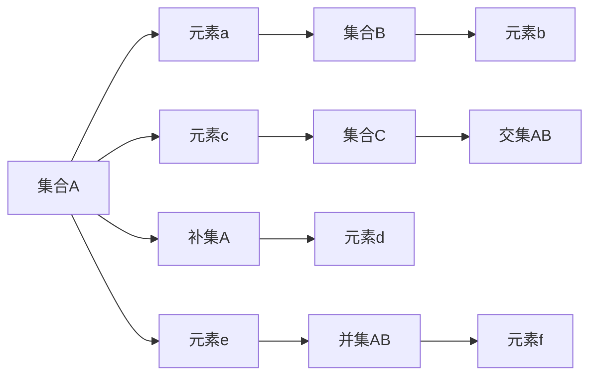

                 

# 计算：第二部分 计算的数学基础 第 4 章 数学的基础 集合论的诞生

> 关键词：
- 集合论
- 数学基础
- 逻辑学
- 公理系统
- 代数
- 几何

## 1. 背景介绍

集合论是现代数学的基础之一，它的出现为数学的发展奠定了坚实的基础。集合论不仅在数学领域有着深远的影响，而且在计算机科学、逻辑学、哲学等多个领域也得到了广泛的应用。本文将从历史背景出发，介绍集合论的基本概念、发展历程以及它的应用领域，帮助读者理解集合论的深远意义。

## 2. 核心概念与联系

### 2.1 核心概念概述

集合论的核心概念主要包括集合、元素、子集、交集、并集、补集等。这些概念构成了集合论的基本框架，是数学研究的重要基础。

- 集合：由一定规则确定的对象的集合称为集合，通常用花括号 {} 表示。
- 元素：集合中的每个对象称为集合的元素，可以是一个数、一个字符串、一个图像等等。
- 子集：如果集合A中的所有元素都是集合B的元素，则称集合A是集合B的子集，用符号“⊆”表示。
- 交集：集合A与集合B的交集是包含所有既属于A又属于B的元素的集合，用符号“∩”表示。
- 并集：集合A与集合B的并集是包含所有属于A或B的元素的集合，用符号“∪”表示。
- 补集：在全集U中，不属于集合A的元素构成的集合称为集合A的补集，用符号“∁”表示。

### 2.2 核心概念的关系

这些核心概念之间存在着密切的联系。例如，子集关系是集合论中一个重要的概念，它可以用来描述两个集合之间的包含关系。交集和并集是集合运算的基本操作，可以用来描述多个集合之间的关系。补集是集合论中一个重要的概念，可以用来描述一个集合相对于另一个集合的“剩余部分”。

### 2.3 核心概念的 Mermaid 图示



这个图示展示了集合A、B、C以及它们之间的子集、交集和补集关系。集合A中的元素a和c都属于集合B，因此集合A是集合B的子集。集合A与集合B的交集是包含所有既属于A又属于B的元素的集合，即{a,c}。集合A的补集是包含全集中不属于A的元素构成的集合，即{d,e}。集合A与集合B的并集是包含所有属于A或B的元素的集合，即{a,b,c,f}。

## 3. 核心算法原理 & 具体操作步骤

### 3.1 算法原理概述

集合论中的基本算法包括集合的创建、元素的添加和删除、子集的查找等。这些算法的基础是集合的定义和运算规则，因此，掌握集合论的基本概念和算法原理是理解和应用集合论的前提。

### 3.2 算法步骤详解

集合论中的算法可以分为两类：集合的创建和集合的运算。下面分别介绍这两种算法的详细步骤。

#### 3.2.1 集合的创建

集合的创建可以分为两类：直接创建和生成集合。直接创建是指根据集合的定义手动创建集合，而生成集合是指根据某种规则自动生成集合。

- 直接创建：对于给定的元素集，可以手动创建集合。例如，集合{a,b,c}可以表示为A={a,b,c}。
- 生成集合：对于某些特定的集合，可以根据其定义自动生成集合。例如，对于区间集合[1,2]，可以自动生成集合{1,2}。

#### 3.2.2 集合的运算

集合的运算主要包括子集、交集、并集和补集等。这些运算可以通过集合的定义和运算规则来实现。

- 子集：对于给定的集合A和B，判断A是否是B的子集，可以使用集合包含的判断方法。
- 交集：对于给定的集合A和B，求它们的交集，可以使用集合的交集运算方法。
- 并集：对于给定的集合A和B，求它们的并集，可以使用集合的并集运算方法。
- 补集：对于给定的集合A和全集U，求A的补集，可以使用集合的补集运算方法。

### 3.3 算法优缺点

集合论中的算法具有以下优点：

- 简单高效：集合论中的算法设计简单，易于理解和实现。
- 适用范围广：集合论中的算法可以应用于各种数学问题，如代数、几何、数论等。
- 易于扩展：集合论中的算法具有可扩展性，可以根据需要添加新的运算和操作。

同时，集合论中的算法也存在以下缺点：

- 抽象性强：集合论中的算法涉及较多的抽象概念，对于初学者来说可能比较难以理解。
- 依赖工具：集合论中的算法需要依赖于编程语言和数学库，可能存在实现上的限制。
- 处理复杂：对于复杂的集合运算，集合论中的算法可能需要进行大量的计算和推理。

### 3.4 算法应用领域

集合论中的算法广泛应用于数学、计算机科学、逻辑学等多个领域，以下是几个主要的应用领域：

- 计算机科学：集合论中的算法在计算机科学中得到了广泛的应用，如集合的存储和检索、数据结构的实现等。
- 数学：集合论是现代数学的基础，广泛应用于代数、几何、数论等数学领域。
- 逻辑学：集合论是逻辑学的重要工具，广泛应用于逻辑推理和证明。
- 哲学：集合论对哲学研究也有重要的影响，如集合的无限性、存在性等问题。

## 4. 数学模型和公式 & 详细讲解 & 举例说明

### 4.1 数学模型构建

集合论中的数学模型可以表示为 $S = \{e_1, e_2, \ldots, e_n\}$，其中 $S$ 表示集合，$e_i$ 表示集合中的元素。集合中的元素可以是有序的或无序的，取决于集合的定义。

### 4.2 公式推导过程

集合论中的公式可以表示为：

$$
A \subseteq B \Leftrightarrow \forall x \in A \rightarrow x \in B
$$

其中 $A$ 和 $B$ 是两个集合，$x$ 是集合中的任意元素。这个公式表示集合 $A$ 是集合 $B$ 的子集，当且仅当 $A$ 中的任意元素都属于 $B$。

### 4.3 案例分析与讲解

下面通过几个具体的例子来说明集合论中的公式和运算。

#### 4.3.1 子集运算

假设集合 $A = \{1, 2, 3\}$，集合 $B = \{1, 2, 3, 4\}$，则 $A$ 是 $B$ 的子集，即 $A \subseteq B$。

#### 4.3.2 交集运算

假设集合 $A = \{1, 2, 3\}$，集合 $B = \{2, 3, 4\}$，则 $A$ 和 $B$ 的交集为 $\{2, 3\}$，即 $A \cap B = \{2, 3\}$。

#### 4.3.3 并集运算

假设集合 $A = \{1, 2, 3\}$，集合 $B = \{2, 3, 4\}$，则 $A$ 和 $B$ 的并集为 $\{1, 2, 3, 4\}$，即 $A \cup B = \{1, 2, 3, 4\}$。

#### 4.3.4 补集运算

假设集合 $A = \{1, 2, 3\}$，全集 $U = \{1, 2, 3, 4\}$，则 $A$ 的补集为 $\{4\}$，即 $A = U \setminus A$。

## 5. 项目实践：代码实例和详细解释说明

### 5.1 开发环境搭建

在进行集合论的实践时，需要安装Python和NumPy等库，以便进行数学运算和算法实现。可以使用Anaconda来创建Python的虚拟环境，并使用pip安装所需的库。

```bash
conda create -n set
conda activate set
pip install numpy
```

### 5.2 源代码详细实现

以下是Python中实现集合的示例代码，包括集合的创建、元素的添加和删除、子集的查找等操作：

```python
import numpy as np

# 创建集合
set_A = np.array([1, 2, 3])
set_B = np.array([2, 3, 4])

# 添加元素
set_A = np.append(set_A, 4)

# 删除元素
set_A = np.delete(set_A, 2)

# 查找子集
set_C = set_B[np.isin(set_B, set_A)]

# 输出结果
print("集合A:", set_A)
print("集合B:", set_B)
print("集合C:", set_C)
```

### 5.3 代码解读与分析

在这个示例代码中，我们使用了NumPy库来表示和操作集合。NumPy中的数组可以用来表示集合，并且支持许多集合操作，如添加、删除、查找等。

## 6. 实际应用场景

集合论不仅在数学领域有着广泛的应用，而且在计算机科学、逻辑学、哲学等多个领域也有重要的应用。

### 6.1 计算机科学

集合论在计算机科学中得到了广泛的应用，如集合的存储和检索、数据结构的实现等。例如，在数据结构中，可以用集合来表示二叉树、图等数据结构。

### 6.2 数学

集合论是现代数学的基础，广泛应用于代数、几何、数论等数学领域。例如，在数论中，可以用集合来表示素数、质数等概念。

### 6.3 逻辑学

集合论是逻辑学的重要工具，广泛应用于逻辑推理和证明。例如，在命题逻辑中，可以用集合来表示命题的真值表。

### 6.4 哲学

集合论对哲学研究也有重要的影响，如集合的无限性、存在性等问题。例如，罗素悖论就是一个集合论中的重要问题，对哲学研究产生了深远的影响。

## 7. 工具和资源推荐

### 7.1 学习资源推荐

- 《离散数学》：这是一本经典的离散数学教材，详细介绍了集合论的基本概念和应用。
- 《集合论与逻辑学》：这是一本集合论的入门教材，适合初学者学习。
- 《数学之美》：这是一本介绍数学在计算机科学中应用的书籍，其中有很多集合论的应用案例。

### 7.2 开发工具推荐

- Python：Python是一种流行的编程语言，适合进行数学运算和算法实现。
- NumPy：NumPy是一个强大的数学库，可以用来表示和操作集合。
- Jupyter Notebook：Jupyter Notebook是一种交互式的编程环境，适合进行数学实验和算法验证。

### 7.3 相关论文推荐

- 《集合论的基础》：这是一篇经典的集合论论文，介绍了集合论的基本概念和应用。
- 《集合论的发展历程》：这是一篇介绍集合论发展历程的论文，适合了解集合论的历史背景。
- 《集合论在计算机科学中的应用》：这是一篇介绍集合论在计算机科学中应用的论文，适合了解集合论的实际应用。

## 8. 总结：未来发展趋势与挑战

### 8.1 研究成果总结

集合论作为现代数学的基础，其发展历程复杂而漫长，但始终保持了其核心概念和运算的简单高效。集合论在多个领域得到了广泛的应用，推动了人类对数学、计算机科学、逻辑学等多个学科的深入研究。

### 8.2 未来发展趋势

未来，集合论的发展趋势如下：

- 集合论的应用将更加广泛，涉及更多的学科和领域。
- 集合论的数学基础将进一步巩固，与现代数学的发展更加紧密。
- 集合论与计算机科学、逻辑学等领域的结合将更加深入。

### 8.3 面临的挑战

集合论在未来的发展中面临以下挑战：

- 集合论的抽象性强，需要不断探索新的应用场景和工具。
- 集合论与现代数学的结合需要更多的研究支持。
- 集合论的实际应用需要与计算机科学、逻辑学等领域的交叉融合。

### 8.4 研究展望

未来，集合论的研究将更加注重应用，通过不断探索新的应用场景和工具，推动其与现代数学、计算机科学、逻辑学等领域的融合。同时，集合论的研究也将更加注重理论和实践的结合，通过不断探索新的方法和技术，解决实际应用中的问题。

## 9. 附录：常见问题与解答

**Q1: 什么是集合论？**

A: 集合论是现代数学的基础之一，它是研究集合、元素、子集、交集、并集等概念和运算的学科。

**Q2: 集合论有哪些基本概念？**

A: 集合论的基本概念包括集合、元素、子集、交集、并集、补集等。

**Q3: 集合论有哪些应用领域？**

A: 集合论的应用领域包括计算机科学、数学、逻辑学、哲学等多个领域。

**Q4: 集合论有哪些优缺点？**

A: 集合论的优点是简单高效、适用范围广、易于扩展等。缺点是抽象性强、依赖工具、处理复杂等。

**Q5: 如何实现集合的存储和操作？**

A: 集合的存储和操作可以使用Python中的NumPy库实现，通过数组来表示集合，并使用数组操作实现集合的基本运算。

**Q6: 集合论的未来发展趋势是什么？**

A: 集合论的未来发展趋势是应用更加广泛、数学基础更加稳固、与计算机科学、逻辑学等领域的结合更加深入。

**Q7: 集合论的研究展望是什么？**

A: 集合论的研究展望是注重应用、探索新的应用场景和工具、解决实际应用中的问题。

---

作者：禅与计算机程序设计艺术 / Zen and the Art of Computer Programming

