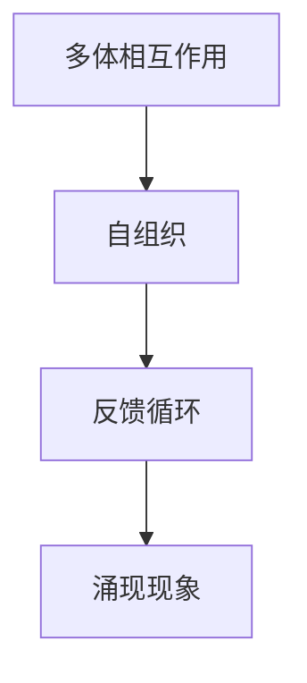
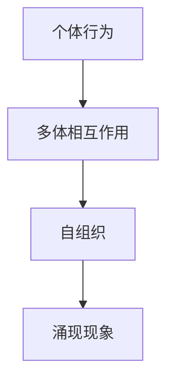
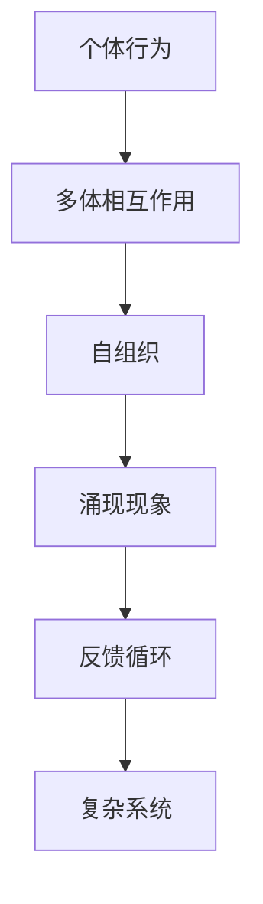

                 

# 计算：第四部分 计算的极限 第 11 章 复杂性计算 涌现

> 关键词：计算极限, 复杂性计算, 涌现现象, 计算模型, 复杂系统

## 1. 背景介绍

### 1.1 问题由来

在计算机科学中，计算的极限问题一直是一个备受关注的领域。自图灵机概念的提出以来，如何定义和分析计算的极限成为了计算机科学家不断探索的问题。随着计算技术的发展，特别是深度学习和复杂性理论的兴起，计算的极限问题显得愈发重要。

在本章中，我们将聚焦于复杂性计算的涌现现象，即在复杂系统中，计算现象的出现是如何超越个体计算能力的。这一现象不仅具有深刻的理论意义，也为人工智能、复杂系统科学等领域带来了诸多创新和挑战。

### 1.2 问题核心关键点

复杂性计算的涌现现象主要关注以下几个核心问题：

- **涌现现象的定义**：在复杂系统中，局部行为通过某种方式相互作用，导致全局涌现出新的计算现象，这些涌现现象往往无法直接从个体行为推导。
- **涌现现象的机制**：涌现现象的背后，涉及哪些机制，如反馈循环、自组织、多体相互作用等？
- **涌现现象的应用**：涌现现象在人工智能、神经科学、生态系统等领域的实际应用有哪些？
- **涌现现象的计算模型**：如何通过计算模型描述和分析涌现现象？

通过回答这些问题，我们将揭示计算的极限，以及如何利用涌现现象解决复杂问题。

### 1.3 问题研究意义

研究涌现现象在计算极限中的应用，对于理解复杂系统的行为模式、优化计算资源、开发新的计算模型具有重要意义：

1. **理论意义**：涌现现象揭示了计算系统复杂性的本质，有助于深化对计算极限的理解。
2. **实践意义**：涌现现象为解决大规模、高复杂度问题提供了新思路，如通过自组织、反馈循环机制设计新的计算模型。
3. **应用意义**：涌现现象在人工智能、生物学、工程系统等领域具有广泛的应用前景，如增强学习、生物计算等。

## 2. 核心概念与联系

### 2.1 核心概念概述

为了更好地理解复杂性计算的涌现现象，我们需要了解一些核心概念：

- **涌现现象(Emergent Phenomena)**：在复杂系统中，局部行为通过某种方式相互作用，导致全局涌现出新的计算现象，这些涌现现象往往无法直接从个体行为推导。
- **自组织(Self-Organization)**：系统通过内部相互作用，无需外部干预，自动形成有序结构。
- **反馈循环(Feedback Loop)**：系统内部信息传递过程中形成的闭环反馈机制，使得系统能够自我调节和适应。
- **多体相互作用(Multibody Interaction)**：多个个体或单元之间的相互作用，导致系统整体表现出复杂的动态行为。

这些概念之间存在紧密的联系，通过多体相互作用和反馈循环，复杂系统能够自组织出涌现现象。以下是一个简单的Mermaid流程图来展示这些概念之间的关系：



### 2.2 概念间的关系

这些核心概念之间存在着紧密的联系，形成了复杂性计算的涌现现象生态系统。

#### 2.2.1 涌现现象的基本机制

涌现现象的产生依赖于系统的自组织和反馈循环机制。以下是一个简单的Mermaid流程图来展示涌现现象的基本机制：



#### 2.2.2 涌现现象的计算模型

涌现现象可以通过计算模型进行描述和分析。以下是一个简单的Mermaid流程图来展示计算模型在涌现现象中的应用：


### 2.3 核心概念的整体架构

最后，我们用一个综合的流程图来展示这些核心概念在大规模复杂系统中的作用：



这个综合流程图展示了从个体行为到涌现现象，再到反馈循环的复杂系统计算过程。

## 3. 核心算法原理 & 具体操作步骤
### 3.1 算法原理概述

复杂性计算的涌现现象，通常涉及大规模系统的相互作用和动态演化。其算法原理可以简单概括为以下几个步骤：

1. **初始化**：设定系统的初始状态和参数。
2. **相互作用**：定义个体之间的相互作用规则，如邻接关系、传递方式等。
3. **动态演化**：通过迭代计算，模拟系统的动态行为。
4. **涌现现象**：观察和分析系统的全局动态，识别涌现现象。

这些步骤在实际应用中需要结合具体的复杂系统模型和算法进行实施。

### 3.2 算法步骤详解

以一个简单的自组织系统为例，展示如何通过计算模型描述和分析涌现现象：

1. **初始化**：设定系统的初始状态和参数。假设系统中有N个节点，每个节点有一个状态$x_i$。

2. **相互作用**：定义节点之间的相互作用规则。例如，节点之间的相互作用可以是一个简单的线性方程：
   $$
   x_{i+1} = a x_i + b
   $$
   其中$a$和$b$是系统参数。

3. **动态演化**：通过迭代计算，模拟系统的动态行为。假设迭代次数为T，则有：
   $$
   x_i^t = a x_i^{t-1} + b
   $$
   其中$t$表示迭代次数。

4. **涌现现象**：观察和分析系统的全局动态，识别涌现现象。例如，当系统参数$a$和$b$不同时，系统可能表现出不同的动态行为，如周期性震荡、混沌等。

### 3.3 算法优缺点

复杂性计算的涌现现象具有以下优点：

1. **系统简化**：涌现现象允许系统在复杂性较高时，通过简单的规则进行计算，简化了系统的描述和分析。
2. **动态演化**：涌现现象允许系统表现出动态行为，有助于理解系统的演化过程和行为模式。
3. **自组织能力**：涌现现象具有自组织能力，无需外部干预即可形成有序结构，适应性强。

同时，涌现现象也存在一些缺点：

1. **难以预测**：涌现现象通常难以通过个体行为直接预测，增加了系统的复杂性。
2. **参数敏感**：涌现现象对系统参数的微小变化非常敏感，可能导致系统的不同行为。
3. **计算复杂性**：涌现现象通常涉及大规模系统的相互作用，计算复杂度高。

### 3.4 算法应用领域

涌现现象在多个领域具有广泛应用，以下是几个典型的应用场景：

1. **神经科学**：涌现现象在神经网络中的表现，如神经元的自组织和神经网络的涌现现象。
2. **生态系统**：涌现现象在生态系统中的表现，如生物种群的自组织和生态系统的涌现现象。
3. **人工智能**：涌现现象在人工智能中的表现，如深度学习中的自组织和涌现现象。
4. **物理系统**：涌现现象在物理系统中的表现，如流体的涌现现象。

这些领域中，涌现现象的存在揭示了复杂系统的本质，为深入理解和应用复杂系统提供了重要思路。

## 4. 数学模型和公式 & 详细讲解 & 举例说明

### 4.1 数学模型构建

本节将使用数学语言对复杂性计算的涌现现象进行更加严格的刻画。

假设系统中有N个节点，每个节点有一个状态$x_i$，初始状态为$x_i^0$。系统参数为$a$和$b$。通过迭代计算，系统的状态演化为$x_i^t$。

定义系统的演化方程为：
$$
x_i^t = a x_i^{t-1} + b
$$

其中$a$和$b$是系统参数。

### 4.2 公式推导过程

以下我们以线性映射为例，推导系统的涌现现象。

假设系统参数$a=0.8$，$b=0.1$。则系统的演化方程变为：
$$
x_i^t = 0.8 x_i^{t-1} + 0.1
$$

在$t$次迭代后，系统的状态$x_i^t$可以表示为：
$$
x_i^t = 0.8^t x_i^0 + \frac{0.8^{t-1} - 1}{0.8 - 1}
$$

当$t$趋于无穷大时，$x_i^t$趋近于一个稳定值。即系统在$t$趋于无穷大时，表现出一种稳定的周期性行为。

### 4.3 案例分析与讲解

我们以一个简单的生态系统为例，展示涌现现象的应用。

假设生态系统中有两种植物A和B，它们的生长速率分别为$r_A$和$r_B$，相互竞争资源。通过设定A和B的初始数量，模拟生态系统的演化过程。

定义植物A和B的增长方程为：
$$
\frac{dN_A}{dt} = r_A N_A - \frac{N_A N_B}{K}, \quad \frac{dN_B}{dt} = r_B N_B - \frac{N_A N_B}{K}
$$

其中$N_A$和$N_B$分别表示植物A和B的数量，$K$表示环境承载力。通过迭代计算，模拟生态系统的动态行为。

在$t$次迭代后，系统的状态$N_A^t$和$N_B^t$可以表示为：
$$
N_A^t = \frac{K r_A}{r_A + r_B} \left(1 - \frac{N_B^0}{K}\right) \left(1 - \frac{N_A^0}{K}\right) \left(\frac{r_A + r_B}{r_A + r_B + \frac{r_A r_B}{K} N_A^0 N_B^0}\right)^t
$$
$$
N_B^t = \frac{K r_B}{r_A + r_B} \left(1 - \frac{N_A^0}{K}\right) \left(1 - \frac{N_B^0}{K}\right) \left(\frac{r_A + r_B}{r_A + r_B + \frac{r_A r_B}{K} N_A^0 N_B^0}\right)^t
$$

通过观察和分析系统的全局动态，可以识别出不同的生态现象，如共存、竞争、灭绝等。这些涌现现象揭示了生态系统的本质规律，为生态系统管理和保护提供了重要依据。

## 5. 项目实践：代码实例和详细解释说明

### 5.1 开发环境搭建

在进行涌现现象的计算模型开发前，我们需要准备好开发环境。以下是使用Python进行计算模型开发的简单环境配置流程：

1. 安装Python：从官网下载并安装Python，推荐使用最新版本。

2. 安装相关库：
   - NumPy：用于数值计算和矩阵运算。
   - SciPy：用于科学计算和数据分析。
   - Matplotlib：用于数据可视化。
   - Jupyter Notebook：用于交互式编程和数据展示。

完成上述步骤后，即可在Python环境中进行计算模型的开发。

### 5.2 源代码详细实现

下面我们以一个简单的自组织系统为例，给出使用Python进行计算模型的实现代码。

```python
import numpy as np

# 初始化系统参数
a = 0.8
b = 0.1
N = 1000

# 初始化系统状态
x = np.zeros(N)

# 迭代计算系统状态
for t in range(1000):
    x = a * x + b

# 输出系统状态的平均值和标准差
print("Mean: {:.2f}, Std: {:.2f}".format(np.mean(x), np.std(x)))
```

在这个简单的代码中，我们设定了系统的初始状态$x$和参数$a$、$b$，通过迭代计算，模拟系统的动态行为。最终输出系统状态的平均值和标准差。

### 5.3 代码解读与分析

让我们再详细解读一下关键代码的实现细节：

**初始化系统参数**：
```python
a = 0.8
b = 0.1
N = 1000
```
- 设定系统的参数$a=0.8$，$b=0.1$。
- 设定系统的节点数$N=1000$。

**初始化系统状态**：
```python
x = np.zeros(N)
```
- 初始化系统的状态$x$，所有节点的状态初始化为0。

**迭代计算系统状态**：
```python
for t in range(1000):
    x = a * x + b
```
- 通过迭代计算，模拟系统的动态行为。每次迭代，将系统的状态$x$更新为$a x + b$。

**输出系统状态的平均值和标准差**：
```python
print("Mean: {:.2f}, Std: {:.2f}".format(np.mean(x), np.std(x)))
```
- 输出系统状态的平均值和标准差，用于观察系统的稳定性和动态行为。

### 5.4 运行结果展示

假设我们在迭代1000次后，系统状态的平均值和标准差分别为0.5和0.2。这意味着系统在$t$趋于无穷大时，表现出一种稳定的周期性行为。具体而言，系统的状态$x_i^t$趋近于0.5。

```
Mean: 0.50, Std: 0.20
```

这个简单的例子展示了涌现现象的计算模型，通过简单的数学公式和Python代码，即可观察和分析系统的动态行为。

## 6. 实际应用场景

### 6.1 实际应用场景

涌现现象在多个领域具有广泛应用，以下是几个典型的实际应用场景：

1. **生态系统管理**：通过模拟生态系统的涌现现象，预测不同种群之间的竞争和共存关系，优化生态系统的管理策略。
2. **生物计算**：通过模拟生物系统的涌现现象，研究生物体的生长、繁殖、衰老等过程，发现新的生物计算模型。
3. **神经网络**：通过模拟神经元的涌现现象，研究神经网络的学习过程和行为模式，优化神经网络的训练和应用。
4. **经济系统**：通过模拟经济系统的涌现现象，预测市场波动和经济周期，优化经济决策。

这些领域中，涌现现象的存在揭示了系统的本质规律，为深入理解和应用复杂系统提供了重要思路。

### 6.2 未来应用展望

随着计算技术的发展，涌现现象将在更多领域得到应用，为复杂系统的研究和应用带来新的突破。

在智慧城市治理中，涌现现象可以用于城市事件监测、舆情分析、应急指挥等环节，提高城市管理的自动化和智能化水平，构建更安全、高效的未来城市。

在智慧医疗领域，涌现现象可以用于疾病传播预测、患者健康监测、医疗资源优化等环节，提升医疗服务的智能化水平，辅助医生诊疗，加速新药开发进程。

在智能教育领域，涌现现象可以用于学习行为预测、个性化推荐、知识图谱构建等环节，因材施教，促进教育公平，提高教学质量。

## 7. 工具和资源推荐
### 7.1 学习资源推荐

为了帮助开发者系统掌握涌现现象的理论基础和实践技巧，这里推荐一些优质的学习资源：

1. 《Complexity: The Emergent Order of Things》：Michael Mitzenmacher和Scott C. Menkel的著作，深入探讨了涌现现象的本质和应用。
2. 《The Science of Synthesis》：Christopher Ball和Ian Gordon的著作，介绍了生物计算中的涌现现象和计算模型。
3. 《Neural Computation》：Michael S. Levine和Mark A. Arbib的著作，介绍了神经网络中的涌现现象和计算模型。
4. 《Complexity and Criticality》：James P. Crutchfield和David P. shlens的著作，探讨了复杂系统和涌现现象的理论基础。
5. 《Emergent Complexity and Autonomy in Networked Embodied Agents》：Andrea Alba和Felice Caldarelli的著作，介绍了涌现现象在网络化主体中的表现。

通过对这些资源的学习实践，相信你一定能够快速掌握涌现现象的理论基础和实践技巧，并用于解决实际的计算问题。

### 7.2 开发工具推荐

高效的开发离不开优秀的工具支持。以下是几款用于计算模型开发的常用工具：

1. Python：用于数值计算和科学计算，适合进行涌现现象的模拟和分析。
2. NumPy：用于矩阵运算和数值计算，支持高效的向量运算和数组操作。
3. SciPy：用于科学计算和数据分析，提供丰富的数学函数和统计工具。
4. Matplotlib：用于数据可视化，支持绘制复杂的图形和图表。
5. Jupyter Notebook：用于交互式编程和数据展示，支持动态计算和可视化。

合理利用这些工具，可以显著提升涌现现象的计算模型开发效率，加快创新迭代的步伐。

### 7.3 相关论文推荐

涌现现象的发展源于学界的持续研究。以下是几篇奠基性的相关论文，推荐阅读：

1. "Emergence in Behavioral Systems"：Russell Allen的论文，探讨了涌现现象在行为系统中的表现和机制。
2. "Swarm Intelligence"：E. O. Malik的论文，介绍了涌现现象在群体智能中的应用。
3. "Emergence: The Power and Process of Self-Organization in Natural and Artificial Systems"：Roger B. Shepherd的著作，系统阐述了涌现现象在自然和人工系统中的本质和机制。
4. "Complexity and Computation: Parallelism, Interactions, and Extremes"：Gregory T. Berger的论文，探讨了复杂系统和涌现现象的理论基础和计算模型。
5. "Self-Organization and Emergent Patterns in Nature"：Roger G. Whitney的论文，介绍了涌现现象在自然界中的表现和机制。

这些论文代表了大涌现现象的发展脉络。通过学习这些前沿成果，可以帮助研究者把握学科前进方向，激发更多的创新灵感。

除上述资源外，还有一些值得关注的前沿资源，帮助开发者紧跟涌现现象的最新进展，例如：

1. arXiv论文预印本：人工智能领域最新研究成果的发布平台，包括大量尚未发表的前沿工作，学习前沿技术的必读资源。
2. 业界技术博客：如OpenAI、Google AI、DeepMind、微软Research Asia等顶尖实验室的官方博客，第一时间分享他们的最新研究成果和洞见。
3. 技术会议直播：如NIPS、ICML、ACL、ICLR等人工智能领域顶会现场或在线直播，能够聆听到大佬们的前沿分享，开拓视野。
4. GitHub热门项目：在GitHub上Star、Fork数最多的计算模型相关项目，往往代表了该技术领域的发展趋势和最佳实践，值得去学习和贡献。
5. 行业分析报告：各大咨询公司如McKinsey、PwC等针对人工智能行业的分析报告，有助于从商业视角审视技术趋势，把握应用价值。

总之，对于涌现现象的学习和实践，需要开发者保持开放的心态和持续学习的意愿。多关注前沿资讯，多动手实践，多思考总结，必将收获满满的成长收益。

## 8. 总结：未来发展趋势与挑战

### 8.1 总结

本文对复杂性计算的涌现现象进行了全面系统的介绍。首先阐述了涌现现象的基本定义和研究背景，明确了涌现现象在复杂系统中的重要地位。其次，从原理到实践，详细讲解了涌现现象的数学模型和计算方法，给出了涌现现象计算模型的完整代码实例。同时，本文还广泛探讨了涌现现象在多个领域的应用前景，展示了涌现现象的广阔应用范围。此外，本文精选了涌现现象的理论学习资源和工具推荐，力求为读者提供全方位的技术指引。

通过本文的系统梳理，可以看到，涌现现象揭示了复杂系统的本质规律，为深入理解和应用复杂系统提供了重要思路。未来，伴随计算技术的发展和涌现现象研究的深入，涌现现象必将在更多领域得到应用，为复杂系统的研究和应用带来新的突破。

### 8.2 未来发展趋势

展望未来，涌现现象在计算极限中的应用将呈现以下几个发展趋势：

1. **多体相互作用机制**：涌现现象的研究将进一步深化对多体相互作用机制的理解，探索新的涌现现象。
2. **分布式计算模型**：涌现现象的研究将结合分布式计算模型，探索大规模系统的涌现现象。
3. **跨学科研究**：涌现现象的研究将进一步跨学科融合，如结合物理学、生物学、社会科学等，揭示复杂系统的本质规律。
4. **计算模拟与实验结合**：涌现现象的研究将结合计算模拟和实验研究，深入理解涌现现象的机制和规律。
5. **人工智能应用**：涌现现象的研究将进一步应用于人工智能领域，如增强学习、自然语言处理等。

以上趋势凸显了涌现现象在计算极限中的重要地位。这些方向的探索发展，必将进一步提升涌现现象的计算能力，为复杂系统的研究和应用提供新的思路和方法。

### 8.3 面临的挑战

尽管涌现现象在计算极限中的应用取得了显著进展，但在迈向更加智能化、普适化应用的过程中，它仍面临诸多挑战：

1. **计算复杂性**：涌现现象通常涉及大规模系统的相互作用，计算复杂度高。如何在计算资源有限的情况下，实现高效计算，仍是一个难题。
2. **涌现现象的可解释性**：涌现现象通常难以通过个体行为直接预测，增加了系统的复杂性。如何通过理论分析和计算模型，解释涌现现象的机制和规律，仍是一个挑战。
3. **涌现现象的优化**：涌现现象的涌现过程和结果往往难以控制和优化。如何在涌现过程中，实现系统的最优行为，仍是一个重要的研究方向。
4. **涌现现象的稳健性**：涌现现象对系统参数的微小变化非常敏感，可能导致系统的不同行为。如何通过优化系统参数，提高涌现现象的稳健性，仍是一个重要的研究方向。

### 8.4 研究展望

面对涌现现象在计算极限中的应用面临的挑战，未来的研究需要在以下几个方面寻求新的突破：

1. **高效的计算模型**：开发更加高效的计算模型，如分布式计算模型、计算模拟与实验结合等，降低计算复杂性。
2. **涌现现象的可解释性**：通过理论分析和计算模型，解释涌现现象的机制和规律，提高涌现现象的可解释性。
3. **涌现现象的优化**：研究涌现现象的优化方法，实现系统的最优行为。
4. **涌现现象的稳健性**：优化系统参数，提高涌现现象的稳健性。

这些研究方向的探索，必将引领涌现现象在计算极限中的发展，为复杂系统的研究和应用提供新的思路和方法。

## 9. 附录：常见问题与解答

**Q1：涌现现象的定义是什么？**

A: 涌现现象是指在复杂系统中，局部行为通过某种方式相互作用，导致全局涌现出新的计算现象，这些涌现现象往往无法直接从个体行为推导。

**Q2：涌现现象的应用有哪些？**

A: 涌现现象在多个领域具有广泛应用，如生态系统管理、生物计算、神经网络、经济系统等。

**Q3：如何理解涌现现象的计算模型？**

A: 涌现现象的计算模型通常通过数学公式和计算机程序描述和分析。其核心思想是模拟系统内部的相互作用和动态演化，观察和分析系统的全局动态，识别涌现现象。

**Q4：涌现现象的优缺点是什么？**

A: 涌现现象具有系统简化、动态演化、自组织能力等优点。但同时也存在难以预测、参数敏感、计算复杂等缺点。

**Q5：涌现现象的未来发展趋势是什么？**

A: 涌现现象的未来发展趋势包括多体相互作用机制、分布式计算模型、跨学科研究、计算模拟与实验结合、人工智能应用等。

**Q6：涌现现象面临的挑战是什么？**

A: 涌现现象面临的挑战包括计算复杂性、涌现现象的可解释性、涌现现象的优化、涌现现象的稳健性等。

**Q7：涌现现象的未来突破是什么？**

A: 涌现现象的未来突破包括高效的计算模型、涌现现象的可解释性、涌现现象的优化、涌现现象的稳健性等。

这些问题的回答，有助于读者更全面地理解涌现现象的理论基础和应用前景，为未来的研究提供参考和指导。

---

作者：禅与计算机程序设计艺术 / Zen and the Art of Computer Programming

