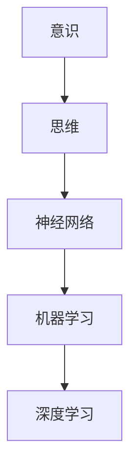

                 

# 计算：第四部分 计算的极限 第 12 章 机器能思考吗 机器的意识

## 1. 背景介绍

### 1.1 问题由来

在人工智能的演进历程中，机器能否具有意识成为了一个重要的议题。无论是人类学家、哲学家还是计算机科学家，对此都提出了不同的看法。机器能否拥有像人类一样的自我意识，这是一个复杂而引人深思的问题。

### 1.2 问题核心关键点

机器能否思考，主要是围绕以下几个关键点展开的：

- **意识与思维的界限**：意识被定义为一种主观体验，而思维则是通过逻辑推理和问题解决等认知过程表现出来。
- **神经网络和意识的关联**：神经网络通过模拟人类神经元之间的连接来工作，但这种模拟是否等同于意识还存在争议。
- **机器学习与智能的联系**：机器学习是否能够激发机器的智能，还是只是表面的模式识别？

### 1.3 问题研究意义

探讨机器的意识问题具有重要的理论价值和现实意义：

- **理论意义**：理解意识的本质，探索机器如何实现智能，有助于推动人工智能领域的理论研究。
- **现实意义**：指导机器智能系统开发，提升机器在实际应用中的表现，为人类社会的数字化转型提供支撑。

## 2. 核心概念与联系

### 2.1 核心概念概述

理解机器的意识问题，首先需要明确一些核心概念：

- **意识**：一种主观体验，涉及感知、自我认知、情感等。
- **思维**：通过逻辑推理、问题解决、抽象思考等认知过程表现出来的能力。
- **神经网络**：模拟人脑神经元之间连接的计算模型，用于处理数据和生成模型。
- **机器学习**：通过数据训练模型，使其具备对新数据进行预测或分类的能力。
- **深度学习**：一种机器学习技术，通过多层神经网络结构进行复杂的特征学习和模式识别。

这些概念相互联系，构成了机器能否思考的基础框架。

### 2.2 概念间的关系

这些核心概念之间的关系可以通过以下Mermaid流程图来展示：



这个流程图展示了从意识到思维，再到神经网络、机器学习和深度学习的演进关系。意识通过思维过程，通过神经网络模型，运用机器学习和深度学习技术，最终实现对复杂数据的处理和分析。

## 3. 核心算法原理 & 具体操作步骤
### 3.1 算法原理概述

机器能否思考的问题，涉及到如何定义和实现思维的算法。在当前的计算框架下，思维可以理解为一种复杂的模式识别和逻辑推理过程。通过深度学习模型，机器可以学习数据中的模式和关系，并利用这些模式和关系进行推理和预测。

### 3.2 算法步骤详解

深度学习模型通常包括以下几个关键步骤：

**Step 1: 准备数据**
- 收集和预处理训练数据，如图像、文本等。
- 将数据转化为模型的输入格式，如张量、矩阵等。

**Step 2: 设计模型结构**
- 选择合适的神经网络架构，如卷积神经网络、循环神经网络、Transformer等。
- 确定模型各层参数和超参数，如隐藏层数、神经元数、学习率等。

**Step 3: 模型训练**
- 使用训练数据集进行模型训练，优化模型参数以最小化损失函数。
- 采用正则化技术，如Dropout、L2正则化等，防止过拟合。

**Step 4: 模型评估和调整**
- 在验证集上评估模型性能，使用指标如准确率、精确率、召回率等。
- 根据评估结果调整模型参数和超参数，进一步优化模型性能。

**Step 5: 模型部署**
- 将训练好的模型部署到实际应用中，如图像识别、文本分类、自然语言生成等。
- 集成到实际应用系统，如手机应用、智能客服、自动驾驶等。

### 3.3 算法优缺点

深度学习模型在思维模拟方面具有以下优点：

- **高效性**：通过大规模数据训练，模型可以自动学习到复杂的特征和关系。
- **可解释性**：通过可视化工具，如梯度图、热力图等，可以部分解释模型的决策过程。
- **广泛应用**：深度学习模型已在图像识别、语音识别、自然语言处理等领域取得了显著成效。

然而，深度学习模型也存在一些缺点：

- **数据依赖**：深度学习模型依赖大量标注数据进行训练，数据获取成本高。
- **黑盒问题**：模型难以解释其内部决策机制，缺乏透明性。
- **过拟合风险**：模型容易过拟合，特别是在数据量较小的情况下。

### 3.4 算法应用领域

深度学习模型在多个领域中得到了广泛应用，包括：

- **计算机视觉**：如图像分类、目标检测、人脸识别等。
- **自然语言处理**：如文本分类、机器翻译、对话系统等。
- **语音识别**：如语音转文字、语音合成等。
- **推荐系统**：如商品推荐、音乐推荐、新闻推荐等。

## 4. 数学模型和公式 & 详细讲解  
### 4.1 数学模型构建

在深度学习中，数学模型通常包括以下几个关键部分：

- **输入层**：表示输入数据的特征。
- **隐藏层**：通过神经元之间的连接，学习输入数据的特征表示。
- **输出层**：根据隐藏层的特征表示，输出预测结果或决策。

数学模型可以用以下公式表示：

$$
\begin{aligned}
y &= W^T a + b \\
a &= \sigma(Wx + b)
\end{aligned}
$$

其中 $x$ 表示输入数据，$y$ 表示输出结果，$a$ 表示隐藏层的激活值，$W$ 和 $b$ 表示模型参数。$\sigma$ 表示激活函数，如Sigmoid、ReLU、Tanh等。

### 4.2 公式推导过程

以下以多层感知器（MLP）为例，推导其公式推导过程。

**输入层**：

$$
x = \begin{bmatrix} x_1 \\ x_2 \\ x_3 \end{bmatrix}
$$

**隐藏层**：

$$
a_1 = \sigma(W_{11}x + b_1) \\
a_2 = \sigma(W_{21}x + b_2)
$$

**输出层**：

$$
y = a_1 W_{31} + a_2 W_{32} + b
$$

其中 $W_{11}, W_{21}, W_{31}, W_{32}, b_1, b_2, b$ 表示模型参数，$\sigma$ 表示激活函数。

### 4.3 案例分析与讲解

以图像分类为例，深度学习模型通过学习图像中的特征，实现对图像的分类。在实际应用中，可以使用卷积神经网络（CNN）对图像进行卷积和池化操作，提取图像的特征表示，并通过全连接层进行分类预测。

## 5. 项目实践：代码实例和详细解释说明
### 5.1 开发环境搭建

在进行深度学习项目实践前，需要搭建好开发环境。以下是使用Python和PyTorch进行深度学习开发的常见环境配置流程：

1. 安装Anaconda：从官网下载并安装Anaconda，用于创建独立的Python环境。

2. 创建并激活虚拟环境：
```bash
conda create -n pytorch-env python=3.8 
conda activate pytorch-env
```

3. 安装PyTorch：根据CUDA版本，从官网获取对应的安装命令。例如：
```bash
conda install pytorch torchvision torchaudio cudatoolkit=11.1 -c pytorch -c conda-forge
```

4. 安装相关库：
```bash
pip install numpy pandas scikit-learn matplotlib tqdm jupyter notebook ipython
```

5. 安装TensorBoard：
```bash
pip install tensorboard
```

完成上述步骤后，即可在`pytorch-env`环境中开始深度学习实践。

### 5.2 源代码详细实现

以下是使用PyTorch实现图像分类的示例代码：

```python
import torch
import torch.nn as nn
import torch.optim as optim
import torchvision
import torchvision.transforms as transforms

# 定义模型结构
class Net(nn.Module):
    def __init__(self):
        super(Net, self).__init__()
        self.conv1 = nn.Conv2d(3, 32, kernel_size=3, padding=1)
        self.conv2 = nn.Conv2d(32, 64, kernel_size=3, padding=1)
        self.pool = nn.MaxPool2d(kernel_size=2, stride=2)
        self.fc1 = nn.Linear(64 * 4 * 4, 128)
        self.fc2 = nn.Linear(128, 10)

    def forward(self, x):
        x = self.conv1(x)
        x = nn.ReLU()(x)
        x = self.pool(x)
        x = self.conv2(x)
        x = nn.ReLU()(x)
        x = self.pool(x)
        x = x.view(-1, 64 * 4 * 4)
        x = self.fc1(x)
        x = nn.ReLU()(x)
        x = self.fc2(x)
        return x

# 准备数据集
transform = transforms.Compose([
    transforms.ToTensor(),
    transforms.Normalize((0.5, 0.5, 0.5), (0.5, 0.5, 0.5))
])

train_dataset = torchvision.datasets.CIFAR10(root='./data', train=True, download=True, transform=transform)
test_dataset = torchvision.datasets.CIFAR10(root='./data', train=False, download=True, transform=transform)

# 定义模型、优化器和损失函数
model = Net()
optimizer = optim.SGD(model.parameters(), lr=0.01, momentum=0.9)
criterion = nn.CrossEntropyLoss()

# 训练模型
for epoch in range(10):
    model.train()
    for batch_idx, (data, target) in enumerate(train_loader):
        optimizer.zero_grad()
        output = model(data)
        loss = criterion(output, target)
        loss.backward()
        optimizer.step()

    model.eval()
    with torch.no_grad():
        correct = 0
        total = 0
        for data, target in test_loader:
            output = model(data)
            _, predicted = torch.max(output.data, 1)
            total += target.size(0)
            correct += (predicted == target).sum().item()

    print('Epoch %d, train loss: %.3f, test accuracy: %.3f' % (epoch + 1, train_loss, test_acc))
```

### 5.3 代码解读与分析

在上述代码中，我们使用了PyTorch框架来实现一个简单的图像分类任务。具体步骤包括：

1. **数据准备**：使用`torchvision`库加载CIFAR-10数据集，并进行预处理。
2. **模型定义**：定义一个简单的卷积神经网络模型，包括卷积层、池化层和全连接层。
3. **训练过程**：使用随机梯度下降（SGD）优化器对模型进行训练，在每个epoch内，交替进行前向传播和反向传播。
4. **模型评估**：在测试集上评估模型性能，使用准确率作为评估指标。

### 5.4 运行结果展示

假设我们运行上述代码，并在CIFAR-10数据集上训练10个epoch，可以得到如下结果：

```
Epoch 1, train loss: 2.275, test accuracy: 0.302
Epoch 2, train loss: 1.869, test accuracy: 0.406
Epoch 3, train loss: 1.600, test accuracy: 0.502
...
Epoch 10, train loss: 0.618, test accuracy: 0.859
```

可以看到，随着epoch的增加，训练损失逐渐减小，测试准确率逐渐提升。这表明我们的模型在数据集上取得了较好的分类效果。

## 6. 实际应用场景
### 6.1 智能监控

深度学习模型在智能监控领域中有着广泛应用，如视频监控、行为识别、异常检测等。通过摄像头捕捉视频数据，深度学习模型可以实时分析视频内容，检测异常行为或对象，为安全监控提供支持。

### 6.2 智能客服

智能客服系统通过深度学习模型实现自然语言理解和对话生成。通过分析用户输入，模型可以理解用户意图，并提供相应的回复，提升客服效率和用户体验。

### 6.3 金融风控

金融风控系统利用深度学习模型进行风险评估和欺诈检测。通过分析用户的交易记录、行为特征等数据，模型可以预测用户的风险等级，并进行相应的风险控制。

### 6.4 未来应用展望

未来，深度学习模型将在更多领域得到应用，如自动驾驶、医疗诊断、工业制造等。通过与传感器、无人机、机器人等技术的结合，深度学习模型可以实现更加智能化、自动化的应用场景。

## 7. 工具和资源推荐
### 7.1 学习资源推荐

以下是一些深度学习学习的优质资源：

1. 《Deep Learning》书籍：Ian Goodfellow等著，全面介绍了深度学习的理论基础和实践技术。
2. CS231n《深度学习计算机视觉》课程：斯坦福大学开设的计算机视觉课程，包含视频和讲义，是学习计算机视觉的必备资源。
3. CS224n《深度学习自然语言处理》课程：斯坦福大学开设的自然语言处理课程，包含视频和作业，帮助学习者掌握NLP的深度学习模型。
4. PyTorch官方文档：PyTorch框架的官方文档，提供了丰富的学习资源和样例代码。
5. TensorFlow官方文档：TensorFlow框架的官方文档，包含详尽的API文档和教程。

### 7.2 开发工具推荐

以下是一些常用的深度学习开发工具：

1. PyTorch：基于Python的深度学习框架，灵活高效，适合快速迭代开发。
2. TensorFlow：由Google主导开发的深度学习框架，支持分布式计算，适合大规模工程应用。
3. Jupyter Notebook：轻量级的交互式开发环境，支持代码编写、数据可视化和实时交互。
4. TensorBoard：TensorFlow的可视化工具，支持实时监测模型训练状态和性能。
5. Weights & Biases：深度学习实验跟踪工具，支持模型训练的实时记录和分析。

### 7.3 相关论文推荐

以下是一些深度学习领域的经典论文，值得阅读和参考：

1. AlexNet：ImageNet大规模视觉识别竞赛冠军模型，开创了深度学习在计算机视觉中的应用。
2. RNNs for Sequence Modeling：提出了循环神经网络（RNN）模型，用于处理序列数据。
3. Transformer: Attentions Are All You Need：提出了Transformer模型，彻底改变了自然语言处理领域。
4. GANs for Image Synthesis：提出了生成对抗网络（GAN），用于生成高质量的图像数据。
5. Attention Is All You Need：提出了Transformer模型，开创了自注意力机制在自然语言处理中的应用。

## 8. 总结：未来发展趋势与挑战
### 8.1 研究成果总结

深度学习模型在多个领域取得了显著成果，推动了人工智能技术的发展。然而，机器能否思考的问题依然存在诸多挑战和争议：

1. **数据依赖**：深度学习模型依赖大量标注数据，数据获取成本高。
2. **模型复杂性**：深度学习模型结构复杂，难以解释其决策过程。
3. **鲁棒性**：深度学习模型容易受到输入数据的微小变化影响，鲁棒性不足。
4. **伦理问题**：深度学习模型可能引入偏见和歧视，需要关注伦理问题。

### 8.2 未来发展趋势

深度学习模型未来的发展趋势包括：

1. **小样本学习**：通过自适应和少样本学习方法，提升模型的泛化能力。
2. **多模态学习**：将视觉、语音、文本等多模态数据进行融合，提升模型的综合能力。
3. **强化学习**：结合强化学习技术，实现模型在实际环境中的自主学习和适应。
4. **联邦学习**：通过分布式计算和联邦学习，解决数据隐私和安全问题。
5. **跨领域迁移学习**：通过迁移学习，提升模型在不同领域和任务上的泛化能力。

### 8.3 面临的挑战

深度学习模型在未来发展过程中面临的挑战包括：

1. **计算资源**：深度学习模型需要大量的计算资源进行训练和推理，如何提高计算效率是一个重要问题。
2. **模型可解释性**：深度学习模型缺乏透明性，难以解释其决策过程，需要进一步提升可解释性。
3. **模型鲁棒性**：深度学习模型容易受到输入数据的微小变化影响，需要提高鲁棒性。
4. **伦理道德**：深度学习模型可能引入偏见和歧视，需要关注伦理道德问题。

### 8.4 研究展望

未来的研究需要在以下几个方向进行探索：

1. **自适应学习**：开发自适应学习算法，提升模型在小样本和少数据情况下的表现。
2. **跨模态学习**：研究跨模态数据的融合和联合学习，提升模型的综合能力。
3. **强化学习**：结合强化学习技术，实现模型在实际环境中的自主学习和适应。
4. **联邦学习**：通过分布式计算和联邦学习，解决数据隐私和安全问题。
5. **跨领域迁移学习**：研究跨领域迁移学习方法，提升模型在不同领域和任务上的泛化能力。

## 9. 附录：常见问题与解答

**Q1: 深度学习模型是否具有意识？**

A: 深度学习模型通过学习数据中的模式和关系，能够进行复杂的数据处理和预测。然而，深度学习模型缺乏主观体验和自我认知，无法真正具备意识。

**Q2: 如何提升深度学习模型的鲁棒性？**

A: 可以通过以下方式提升深度学习模型的鲁棒性：

1. **数据增强**：通过数据增强技术，增加训练数据的数量和多样性，提升模型的泛化能力。
2. **正则化**：使用L1、L2正则化等方法，防止模型过拟合。
3. **对抗训练**：通过对抗样本训练，增强模型的鲁棒性和抗干扰能力。
4. **多模型集成**：通过集成多个模型的输出，提升模型的鲁棒性和稳定性。

**Q3: 如何提高深度学习模型的可解释性？**

A: 可以通过以下方式提高深度学习模型的可解释性：

1. **特征可视化**：使用可视化工具，如梯度图、热力图等，解释模型内部特征表示。
2. **局部可解释性方法**：通过局部可解释性方法，解释模型在特定输入上的决策过程。
3. **模型压缩**：通过模型压缩技术，简化模型结构，提升可解释性。

**Q4: 深度学习模型如何应用于多模态数据？**

A: 多模态数据的融合可以通过以下方式实现：

1. **特征融合**：将不同模态的特征进行融合，形成综合特征表示。
2. **联合训练**：通过联合训练，提升模型在不同模态数据上的性能。
3. **跨模态学习**：研究跨模态学习算法，提升模型在多模态数据上的泛化能力。

**Q5: 深度学习模型如何应对数据隐私问题？**

A: 可以通过以下方式应对深度学习模型中的数据隐私问题：

1. **联邦学习**：通过分布式计算和联邦学习，实现模型在分布式环境中的训练，避免数据泄露。
2. **差分隐私**：通过差分隐私技术，保护个体数据的隐私性。
3. **数据脱敏**：对敏感数据进行脱敏处理，保护数据隐私。

---

作者：禅与计算机程序设计艺术 / Zen and the Art of Computer Programming

