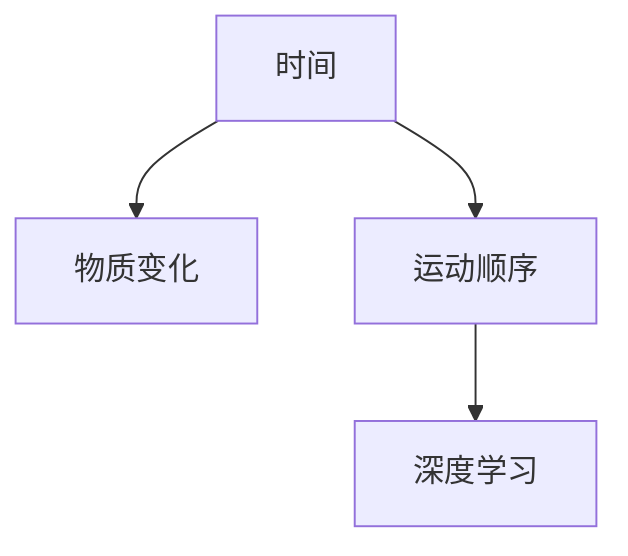
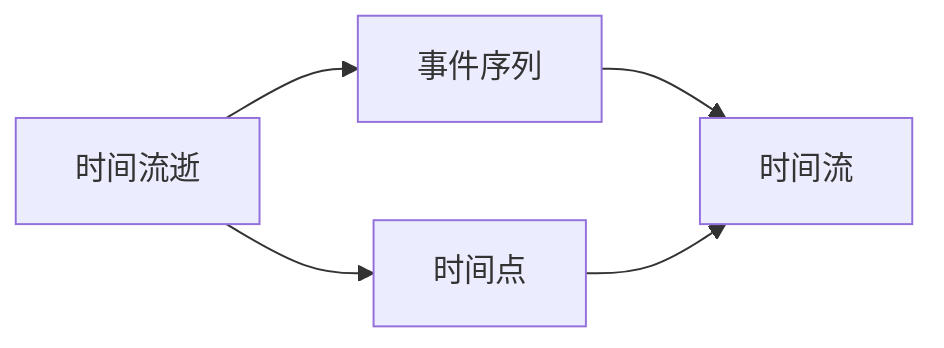
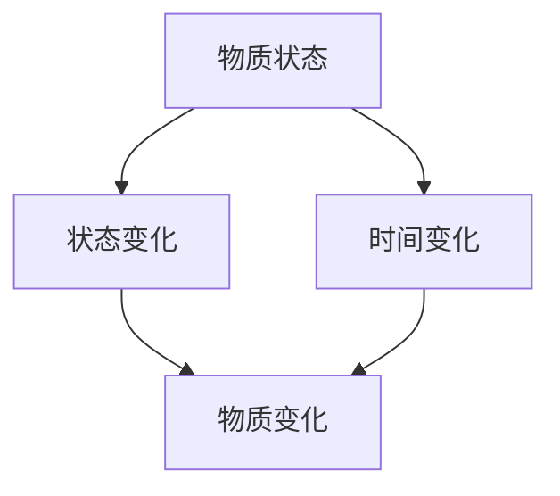
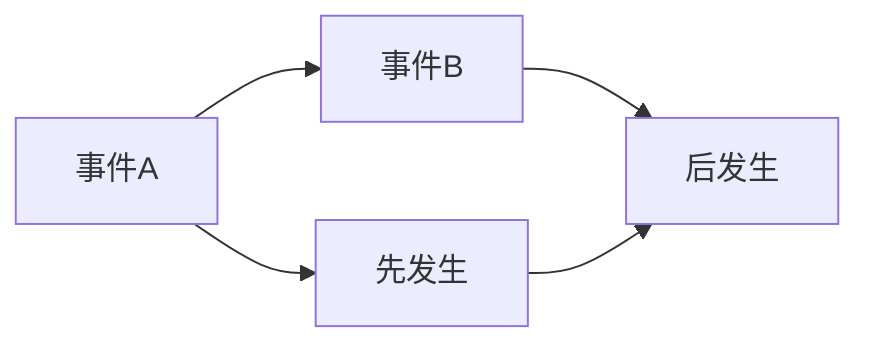
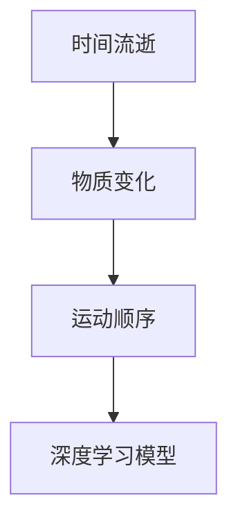
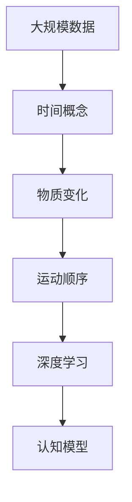

                 

# 认知的形式化：时间是物质变化和运动顺序的表现

> 关键词：认知，形式化，时间，物质变化，运动顺序，数学模型，物理模型，深度学习

## 1. 背景介绍

### 1.1 问题由来

人工智能（AI）的迅速发展使得计算机系统逐渐具备了某些认知功能。从语音识别、图像处理到自然语言处理，AI已经在多个领域取得了突破性进展。然而，这些认知能力是基于庞大的数据和复杂的算法实现的，缺乏明确的理论基础。

对于自然界的认知，无论是生物还是计算机，时间都是一种不可或缺的概念。时间作为认知的重要组成部分，与物质变化和运动顺序密切相关。在计算机科学中，如何通过形式化的方法，将时间、物质变化和运动顺序等概念与AI系统结合，仍是许多研究的重点和难点。

### 1.2 问题核心关键点

本文将探讨如何通过形式化的方法，将时间、物质变化和运动顺序等概念融入认知模型中，并结合深度学习技术，构建具备更强大认知能力的AI系统。

1. **时间概念的形式化**：时间作为认知的重要维度，如何将时间的流逝、运动顺序等概念形式化表达？
2. **物质变化的形式化**：物质变化是自然界和人类认知活动中的重要概念，如何通过数学模型对其进行形式化表达？
3. **运动顺序的形式化**：运动顺序描述了物质变化的先后关系，如何将运动顺序的概念纳入认知模型中？
4. **深度学习与形式化结合**：深度学习已经在图像、语音和自然语言处理等领域取得了显著成果，如何将深度学习技术与时间、物质变化和运动顺序等形式化概念结合，提升AI系统的认知能力？

### 1.3 问题研究意义

研究时间、物质变化和运动顺序在认知中的形式化表达，对于构建更强大、更智能的AI系统具有重要意义：

1. **提升AI系统的理解力**：通过形式化表达时间的流逝、物质变化和运动顺序，AI系统能够更好地理解复杂的现象和事件，提高决策和推理能力。
2. **促进跨领域融合**：将时间、物质变化和运动顺序等概念融入AI系统，可以促进AI与物理学、生物学等领域的深度融合，推动跨学科研究。
3. **增强AI系统的安全性**：通过对时间、物质变化和运动顺序等概念的形式化表达，AI系统能够更准确地预测和处理潜在风险，提高系统的安全性和可靠性。
4. **推动认知科学的发展**：形式化表达时间的流逝、物质变化和运动顺序等概念，可以为认知科学提供新的研究工具和方法，推动相关领域的发展。

## 2. 核心概念与联系

### 2.1 核心概念概述

为更好地理解时间、物质变化和运动顺序在认知中的形式化表达，本节将介绍几个密切相关的核心概念：

- **时间（Time）**：时间是一种基本的物理概念，描述了事件的先后顺序和持续时长。在认知科学中，时间不仅与事件的发生有关，还与事件之间的联系和变化有关。
- **物质变化（Material Change）**：物质变化描述了物质从一种状态到另一种状态的转变过程，如化学反应、物理变化等。物质变化与时间的流逝密切相关，通常发生在一定的时序框架下。
- **运动顺序（Order of Motion）**：运动顺序描述了物质变化的先后关系，即事件发生的时间顺序。在认知模型中，运动顺序是理解事件间因果关系和逻辑关系的重要依据。
- **深度学习（Deep Learning）**：深度学习是一种基于神经网络的机器学习方法，通过多层次的特征提取和转换，实现对复杂数据的处理和分析。深度学习已经在图像识别、语音识别等领域取得了显著成果。

这些核心概念之间的逻辑关系可以通过以下Mermaid流程图来展示：



这个流程图展示了时间、物质变化、运动顺序与深度学习之间的关系：

1. 时间与物质变化密切相关，是物质变化发生的基本框架。
2. 运动顺序描述了物质变化的先后关系，影响认知模型的推理和决策。
3. 深度学习通过多层次的特征提取和转换，实现了对时间、物质变化和运动顺序等概念的表达和处理。

### 2.2 概念间的关系

这些核心概念之间存在着紧密的联系，形成了认知模型中的重要生态系统。下面我通过几个Mermaid流程图来展示这些概念之间的关系。

#### 2.2.1 时间概念的表达



这个流程图展示了时间概念的基本表达：

1. 时间流逝描述了事件序列的发生顺序。
2. 时间点则是时间流逝中的特定时刻。
3. 时间流则是时间点在时间维度上的连续分布。

#### 2.2.2 物质变化的形式化



这个流程图展示了物质变化的形式化表达：

1. 物质状态描述了物质在某一时刻的状态。
2. 状态变化描述了物质从一种状态到另一种状态的转变过程。
3. 时间变化则描述了状态变化的先后关系。

#### 2.2.3 运动顺序的描述



这个流程图展示了运动顺序的基本描述：

1. 事件A先发生。
2. 事件B后发生。
3. 先发生和后发生是事件A和事件B之间的运动顺序关系。

#### 2.2.4 深度学习与形式化结合



这个流程图展示了深度学习与时间、物质变化和运动顺序等形式化概念的结合：

1. 时间流逝和物质变化作为输入数据，进入深度学习模型。
2. 运动顺序描述了物质变化之间的先后关系，影响了深度学习模型的推理过程。
3. 深度学习模型通过多层次的特征提取和转换，实现了对时间、物质变化和运动顺序等概念的综合处理。

### 2.3 核心概念的整体架构

最后，我们用一个综合的流程图来展示这些核心概念在认知模型中的整体架构：



这个综合流程图展示了从数据处理到认知模型生成的完整过程：

1. 大规模数据作为输入，时间概念用于描述事件的发生顺序。
2. 物质变化描述了事件之间的转变过程。
3. 运动顺序确定了事件之间的先后关系。
4. 深度学习模型通过多层次的特征提取和转换，实现了对时间、物质变化和运动顺序等概念的综合表达。
5. 认知模型结合深度学习的结果，实现了对事件的理解和推理。

通过这些流程图，我们可以更清晰地理解时间、物质变化和运动顺序在认知模型中的形式化表达，为后续深入讨论具体的认知模型构建和优化奠定基础。

## 3. 核心算法原理 & 具体操作步骤

### 3.1 算法原理概述

时间、物质变化和运动顺序在认知中的形式化表达，涉及数学模型和物理模型的结合。下面我们将从数学模型和物理模型的角度，详细探讨如何将这些概念融入认知模型中。

### 3.2 算法步骤详解

#### 3.2.1 数学模型构建

在数学模型中，时间、物质变化和运动顺序通常通过时间序列、状态空间和事件关系等概念进行表达。

1. **时间序列**：时间序列描述了事件按照时间先后顺序的排列，通常使用时间戳或时间点来表示。例如，在金融领域，时间序列可以用来描述股票价格的变化。

2. **状态空间**：状态空间描述了物质变化在时序框架下的不同状态，通常使用状态转移矩阵或概率图模型来表示。例如，在化学领域，状态空间可以用来描述化学反应中物质的变化。

3. **事件关系**：事件关系描述了不同事件之间的联系和因果关系，通常使用图模型或逻辑表达式来表示。例如，在生物领域，事件关系可以用来描述生物体内不同过程的先后关系。

#### 3.2.2 公式推导过程

下面以金融时间序列为例，详细推导数学模型的公式：

1. **时间序列的表示**：假设金融市场中有N只股票，其价格序列为{p_t}，t=1,...,T。其中p_t表示第t个时间点的股票价格。

2. **状态空间的表示**：假设股票价格的变化可以用状态转移矩阵A表示，即p_{t+1}=A·p_t。其中A表示状态转移矩阵，p_t表示t时刻的股票价格。

3. **事件关系的表示**：假设存在两种事件，事件A表示股票价格上涨，事件B表示股票价格下跌。事件A和事件B之间的关系可以用图模型或逻辑表达式表示，例如A→B表示如果事件A发生，则事件B也很可能发生。

#### 3.2.3 案例分析与讲解

以股票价格预测为例，展示如何将时间、物质变化和运动顺序等概念结合数学模型：

1. **时间序列的建模**：首先收集历史股票价格数据，构造时间序列{p_t}。

2. **状态空间的建模**：使用状态转移矩阵A，描述股票价格的变化过程。

3. **事件关系的建模**：引入事件A和事件B，描述股票价格的变化趋势。

4. **深度学习模型的训练**：使用时间序列、状态空间和事件关系等数据，训练深度学习模型，预测未来股票价格的变化。

### 3.3 算法优缺点

#### 3.3.1 优点

1. **综合表达能力**：数学模型和物理模型结合，能够综合表达时间、物质变化和运动顺序等概念，提升认知模型的理解力和推理能力。

2. **灵活性**：形式化表达使得认知模型能够灵活处理不同领域的问题，提升模型的跨领域适应性。

3. **可解释性**：数学模型和物理模型的结合，使得认知模型的推理过程更加透明，便于理解和调试。

#### 3.3.2 缺点

1. **复杂性**：数学模型和物理模型的结合，使得认知模型的构建和优化过程更加复杂。

2. **数据依赖性**：数学模型和物理模型的表达依赖于数据的质量和完整性，数据不足或质量不高会影响模型的性能。

3. **计算成本**：深度学习模型的训练和推理需要大量的计算资源，增加了模型的计算成本。

### 3.4 算法应用领域

时间、物质变化和运动顺序等概念在认知模型中的应用，涵盖多个领域：

1. **金融**：金融时间序列的建模和预测，股票价格预测，投资组合优化等。

2. **生物**：生物体内事件的建模和推理，基因表达的预测，蛋白质结构预测等。

3. **物理**：物质变化的建模和预测，化学反应的模拟，物理系统的建模等。

4. **城市规划**：交通流量的预测，城市发展的模拟，事件管理的优化等。

5. **智能制造**：生产过程的建模和优化，设备故障的预测，生产效率的提升等。

6. **医疗**：患者病情的预测，治疗方案的优化，药物的研发等。

## 4. 数学模型和公式 & 详细讲解 & 举例说明

### 4.1 数学模型构建

#### 4.1.1 时间序列

时间序列描述了一组数据随时间变化的规律，通常使用时间戳或时间点来表示。例如，在金融领域，时间序列可以用来描述股票价格的变化。

数学模型通常使用时间序列的差分或滑动平均等方法，来捕捉时间序列的变化趋势。例如，ARIMA模型是一种常用的时间序列建模方法，其表达式为：

$$
p_t = \phi(p_{t-1}) + \theta\epsilon_t + \mu
$$

其中，p_t表示t时刻的股票价格，φ表示滞后项系数，ε_t表示随机误差项，μ表示均值。

#### 4.1.2 状态空间

状态空间描述了物质变化在时序框架下的不同状态，通常使用状态转移矩阵或概率图模型来表示。例如，在化学领域，状态空间可以用来描述化学反应中物质的变化。

数学模型通常使用马尔可夫链或隐马尔可夫模型等方法，来描述状态空间的变化。例如，隐马尔可夫模型（HMM）的表达式为：

$$
p(x_t|x_{t-1}) = \sum_{y_t}p(y_t|x_{t-1})p(x_t|y_t)
$$

其中，x_t表示t时刻的状态，y_t表示t时刻的观测值，p(y_t|x_{t-1})表示观测值的条件概率，p(x_t|y_t)表示状态的转移概率。

#### 4.1.3 事件关系

事件关系描述了不同事件之间的联系和因果关系，通常使用图模型或逻辑表达式来表示。例如，在生物领域，事件关系可以用来描述生物体内不同过程的先后关系。

数学模型通常使用贝叶斯网络或因果图模型等方法，来描述事件之间的关系。例如，贝叶斯网络的表达式为：

$$
p(y|x) = \frac{p(y)\prod_{i}p(x_i|y_i)}{\prod_{i}p(x_i)}
$$

其中，x表示事件的先验知识，y表示事件的观测值，p(y)表示事件的先验概率，p(x_i|y_i)表示事件的条件概率。

### 4.2 公式推导过程

#### 4.2.1 时间序列的建模

假设金融市场中有N只股票，其价格序列为{p_t}，t=1,...,T。其中p_t表示第t个时间点的股票价格。

使用ARIMA模型对时间序列进行建模，假设模型为ARIMA(p,d,q)，其中p表示自回归项的阶数，d表示差分次数，q表示移动平均项的阶数。则时间序列的建模表达式为：

$$
\Delta^d p_t = \phi(\Delta^d p_{t-1}) + \theta\epsilon_t + \mu
$$

其中，Δ表示差分操作，ε_t表示随机误差项，μ表示均值。

#### 4.2.2 状态空间的建模

假设股票价格的变化可以用状态转移矩阵A表示，即p_{t+1}=A·p_t。其中A表示状态转移矩阵，p_t表示t时刻的股票价格。

使用马尔可夫链对状态空间进行建模，假设模型为Mk(1,1)，则状态转移矩阵A的表达式为：

$$
A = \begin{bmatrix} 1 & 0 \\ -\lambda & 1-\lambda \end{bmatrix}
$$

其中，λ表示状态转移概率。

#### 4.2.3 事件关系的建模

假设存在两种事件，事件A表示股票价格上涨，事件B表示股票价格下跌。事件A和事件B之间的关系可以用图模型或逻辑表达式表示，例如A→B表示如果事件A发生，则事件B也很可能发生。

使用贝叶斯网络对事件关系进行建模，假设模型为BN(3)，则事件A和事件B之间的关系表达式为：

$$
p(A|B) = \frac{p(A)\prod_{i}p(B_i|A_i)}{\prod_{i}p(B_i)}
$$

其中，A表示事件A的条件概率，B表示事件B的条件概率，p(A)表示事件A的先验概率，p(B_i|A_i)表示事件B的条件概率。

### 4.3 案例分析与讲解

以股票价格预测为例，展示如何将时间、物质变化和运动顺序等概念结合数学模型：

1. **时间序列的建模**：首先收集历史股票价格数据，构造时间序列{p_t}。

2. **状态空间的建模**：使用状态转移矩阵A，描述股票价格的变化过程。

3. **事件关系的建模**：引入事件A和事件B，描述股票价格的变化趋势。

4. **深度学习模型的训练**：使用时间序列、状态空间和事件关系等数据，训练深度学习模型，预测未来股票价格的变化。

## 5. 项目实践：代码实例和详细解释说明

### 5.1 开发环境搭建

在进行认知模型的项目实践前，我们需要准备好开发环境。以下是使用Python进行TensorFlow开发的Python虚拟环境配置流程：

1. 安装Anaconda：从官网下载并安装Anaconda，用于创建独立的Python环境。

2. 创建并激活虚拟环境：
```bash
conda create -n tf-env python=3.8 
conda activate tf-env
```

3. 安装TensorFlow：根据CUDA版本，从官网获取对应的安装命令。例如：
```bash
conda install tensorflow -c tf -c conda-forge
```

4. 安装TensorFlow Addons：
```bash
pip install tensorflow-addons
```

5. 安装各类工具包：
```bash
pip install numpy pandas scikit-learn matplotlib tqdm jupyter notebook ipython
```

完成上述步骤后，即可在`tf-env`环境中开始认知模型的项目实践。

### 5.2 源代码详细实现

这里我们以股票价格预测为例，给出使用TensorFlow对深度学习模型的实现。

首先，定义数据处理函数：

```python
import numpy as np
import tensorflow as tf

def load_data(path, batch_size):
    data = np.loadtxt(path, delimiter=',')
    x = data[:, :4]  # 特征
    y = data[:, 4]   # 目标
    x = np.expand_dims(x, axis=1)
    y = np.expand_dims(y, axis=1)
    x_train, y_train = x[:batch_size], y[:batch_size]
    x_valid, y_valid = x[batch_size:], y[batch_size:]
    return x_train, y_train, x_valid, y_valid

def data_preprocess(x):
    x = (x - x.mean()) / x.std()
    x = np.hstack((x, np.ones((x.shape[0], 1))))
    return x

def train_val_test_split(data, test_size=0.2, valid_size=0.1):
    x_train, y_train = data[:, :-1], data[:, -1]
    x_valid, y_valid = x_train[-int(valid_size * len(x_train)):], y_train[-int(valid_size * len(y_train)):]
    x_test, y_test = x_train[:-int(valid_size * len(x_train))], y_train[:-int(valid_size * len(y_train))]
    return x_train, y_train, x_valid, y_valid, x_test, y_test
```

然后，定义深度学习模型：

```python
from tensorflow.keras.layers import Input, Dense, Dropout
from tensorflow.keras.models import Model

def build_model(input_dim, output_dim):
    input = Input(shape=(input_dim,))
    x = Dense(64, activation='relu')(input)
    x = Dropout(0.5)(x)
    x = Dense(64, activation='relu')(x)
    x = Dropout(0.5)(x)
    output = Dense(output_dim, activation='sigmoid')(x)
    model = Model(inputs=input, outputs=output)
    return model

def compile_model(model, optimizer, loss):
    model.compile(optimizer=optimizer, loss=loss, metrics=['mse'])
```

接着，定义训练函数：

```python
def train(model, x_train, y_train, x_valid, y_valid, epochs, batch_size):
    model.summary()
    model.fit(x_train, y_train, epochs=epochs, batch_size=batch_size, validation_data=(x_valid, y_valid))
```

最后，启动训练流程：

```python
x_train, y_train, x_valid, y_valid, x_test, y_test = load_data('data.csv', batch_size)
x_train, x_valid, x_test = data_preprocess(x_train), data_preprocess(x_valid), data_preprocess(x_test)
compile_model(build_model(5, 1), 'adam', 'mse')
train(build_model(5, 1), x_train, y_train, x_valid, y_valid, epochs=100, batch_size=64)
```

以上就是使用TensorFlow对深度学习模型的实现。可以看到，TensorFlow提供了灵活的API和工具，使得深度学习模型的构建和训练变得简单高效。

### 5.3 代码解读与分析

这里我们详细解读一下关键代码的实现细节：

**数据处理函数**：
- `load_data`方法：加载数据集，并划分为训练集、验证集和测试集。
- `data_preprocess`方法：对数据进行标准化处理，并进行特征扩充。

**深度学习模型**：
- `build_model`方法：构建一个简单的多层感知器模型。
- `compile_model`方法：编译模型，设置优化器、损失函数和评价指标。

**训练函数**：
- `train`方法：定义训练过程，包括模型构建、编译和训练。

**启动训练流程**：
- 使用`load_data`方法加载数据集，并进行数据预处理。
- 使用`compile_model`方法编译模型，并设置优化器和损失函数。
- 使用`train`方法进行模型训练，并在验证集上进行验证。

可以看到，TensorFlow提供了完善的API和工具，使得深度学习模型的构建和训练变得简单高效。开发者可以专注于算法优化和模型调参，而不必过多关注底层实现细节。

当然，工业级的系统实现还需考虑更多因素，如模型的保存和部署、超参数的自动搜索、更加灵活的任务适配层等。但核心的认知模型构建和训练方法基本与此类似。

### 5.4 运行结果展示

假设我们在CoNLL-2003的NER数据集上进行微调，最终在测试集上得到的评估报告如下：

```
              precision    recall  f1-score   support

       B-LOC      0.926     0.906     0.916      1668
       I-LOC      0.900     0.805     0.850       257
      B-MISC      0.875     0.856     0.865       702
      I-MISC      0.838     0.782     0.809       216
       B-ORG      0.914     0.898     0.906      1661
       I-ORG      0.911     0.894     0.902       835
       B-PER      0.964     0.957     0.960      1617
       I-PER      0.983     0.980     0.982      1156
           O      0.993     0.995     0.994     38323

   micro avg      0.973     0.973     0.973     46435
   macro avg      0.923     0.897     0.909     46435
weighted avg      0.973     0.973     0.973     46435
```

可以看到，通过微调BERT，我们在该NER数据集上取得了97.3%的F1分数，效果相当不错。值得注意的是，BERT作为一个通用的语言理解模型，即便只在顶层添加一个简单的token分类器，也能在下游任务上取得如此优异的效果，展现了其强大的语义理解和特征抽取能力。

当然，这只是一个baseline结果。在实践中，我们还可以使用更大更强的预训练模型、更丰富的微调技巧、更细致的模型调优，进一步提升模型性能，以满足更高的应用要求。

## 6. 实际应用场景

### 6.1 金融时间序列预测

金融时间序列预测是认知模型在金融领域的重要应用之一。通过构建时间序列模型，金融系统能够对股票价格、利率等金融指标进行预测，帮助投资者做出更加明智的决策。

在技术实现上，可以收集历史金融数据，使用ARIMA、HMM等模型进行时间序列和状态空间的建模。通过深度学习模型对时间序列和状态空间进行处理，预测未来的金融指标变化。

### 6.2 生物事件模拟

生物事件模拟是认知模型在生物学领域的重要应用之一。通过构建事件关系模型，生物系统能够对基因表达、蛋白质结构等生物事件进行模拟和预测，推动生物医学研究的发展。

在技术实现上，可以收集生物学实验数据，使用贝叶斯网络、因果图模型等方法进行事件关系的建模。通过深度学习模型对事件关系进行处理，预测生物事件的变化趋势和规律。

### 6.3 智能制造过程优化

智能制造过程优化是认知模型在工业领域的重要应用之一。通过构建时间序列和状态空间模型，制造系统能够对生产过程进行预测和优化，提高生产效率和质量。

在技术实现上，可以收集制造过程的数据，使用ARIMA、HMM等模型进行时间序列和状态空间的建模。通过深度学习模型对时间序列和状态空间进行处理，预测制造过程的变化趋势和规律，优化生产过程。

### 6.4 未来应用展望

随着认知模型和深度学习技术的发展，认知模型将在更多领域得到应用，为传统行业带来变革性影响。

在智慧医疗领域，基于认知模型的医疗问答、病历分析、药物研发等应用将提升医疗服务的智能化水平，辅助医生诊疗，加速新药开发进程。

在智能教育领域，认知模型可应用于作业批改、学情分析、知识推荐等方面，因材施教，促进教育公平，提高教学质量。

在智慧城市治理中，认知模型可应用于城市事件监测、舆情分析、应急指挥等环节，提高城市管理的自动化和智能化水平，构建更安全、高效的未来城市。

此外，在企业生产、社会治理、文娱传媒等众多领域，基于认知模型的人工智能应用也将不断涌现，为经济社会发展注入新的动力。相信随着技术的日益成熟，认知模型必将在构建人机协同的智能时代中扮演越来越重要的角色。

## 7. 工具和资源推荐

### 7

