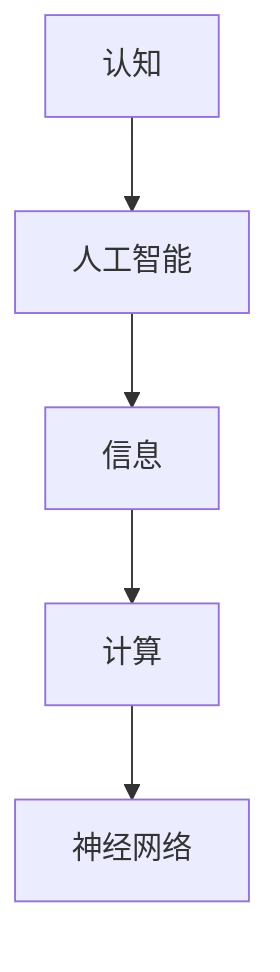
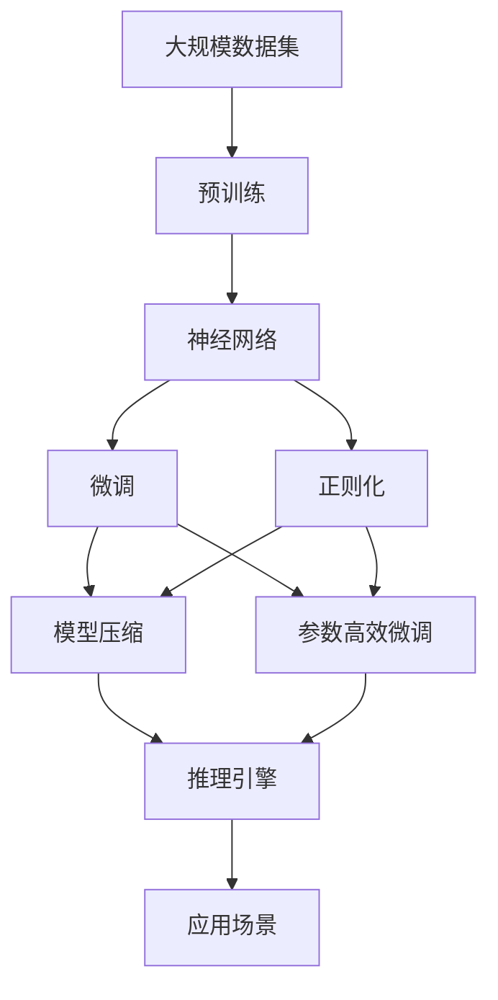

                 

# 认知的形式化：机器在没有能量供给的时候是一堆死物质

## 1. 背景介绍

### 1.1 问题由来
人类对于“认知”这一现象的探索，可以追溯到古希腊哲学家亚里士多德对灵魂的划分，其中“理性认知”与“感性认知”的概念至今仍具启发意义。然而，随着科技的进步，特别是计算科学的蓬勃发展，“认知”这一复杂概念逐渐被赋予了新的内涵。在人工智能领域，如何通过形式化语言描述和分析认知过程，成为了一个极具挑战且富于哲学意义的研究课题。

近年来，随着深度学习和大数据技术的兴起，AI领域取得了显著突破。无论是图像识别、自然语言处理，还是自动驾驶、机器人，各项技术都向人类展示了其在特定场景中的强大能力。然而，这种“智能”究竟是基于何等原理，其认知机制与人类有何不同，这些问题仍未得到全面解答。机器究竟能否“思考”，是否能够“理解”其所感知的世界，成为了一个亟待探索的问题。

本文将围绕“认知的形式化”这一核心话题，通过探讨机器在没有能量供给时的状态，来重新审视人工智能的认知能力，进而引发对于认知机制的更深层次思考。

### 1.2 问题核心关键点
机器在没有能量供给时是否还能保持其“认知”能力，这是本文的核心问题。传统认知理论认为，能量是认知活动的基础，没有能量供给，机器的计算能力将完全丧失。然而，从信息论的角度，认知可以被看作是一种信息处理过程。即使能量中断，信息本身仍然存在，机器依然可以访问并处理这些信息。

本文将基于这种信息论的视角，深入探讨机器在没有能量供给时的认知能力，以及这种能力如何与人类认知相区别。这不仅是一个理论问题，也是对于机器认知深度和技术边界的重要探讨。

### 1.3 问题研究意义
1. **推动认知科学的发展**：通过对机器在极端情况下的认知能力进行分析，可以深入理解认知的本质，为认知科学提供新的研究视角。
2. **优化人工智能系统设计**：探讨机器的认知能力，有助于设计更高效、更可靠的人工智能系统，提升其在实际应用中的表现。
3. **回答哲学问题**：机器能否思考，人类与机器的认知差异，这些问题不仅限于技术层面，也关乎哲学的根本思考。
4. **指导技术实践**：理解和实现机器的认知能力，能够为机器学习、自然语言处理、机器人技术等领域的发展提供理论支持。

## 2. 核心概念与联系

### 2.1 核心概念概述

为更好地理解“认知的形式化”，本节将介绍几个关键概念：

- **认知**：通常被定义为人类或其他生物体对外部世界的感知、理解、记忆、推理和决策过程。
- **人工智能**：使用计算算法模拟人类智能的机器系统。
- **信息**：数据经过编码、组织和解释后，被认为具有意义和价值。
- **计算**：利用算法和数据结构进行信息处理的过程。
- **神经网络**：一种受生物神经系统启发的计算模型，用于学习和解决复杂问题。

### 2.2 核心概念间的关系

这些核心概念之间存在着紧密的联系，形成了机器认知的完整生态系统。以下Mermaid流程图展示了这些概念之间的关系：



在这个流程图中，认知是核心，人工智能是实现认知的工具，信息是认知的基础，计算是信息处理的过程，神经网络是实现计算的具体算法。这些概念共同构成了机器认知的基础框架，使得我们能够理解和分析机器在特定情况下的认知能力。

### 2.3 核心概念的整体架构

最后，我们用一个综合的流程图来展示这些核心概念在大规模机器认知分析中的整体架构：



这个综合流程图展示了从大规模数据预训练，到微调、正则化、模型压缩和参数高效微调，再到推理引擎和应用场景的完整流程。通过这个流程，我们可以系统地理解机器认知能力如何在各个环节中得到提升和应用。

## 3. 核心算法原理 & 具体操作步骤
### 3.1 算法原理概述

机器在没有能量供给时，能否保持其认知能力，可以从信息处理的角度进行探讨。假设机器拥有一个庞大的信息库，即使没有能量供给，信息本身仍然存在，机器依然可以访问并处理这些信息。基于这一假设，我们可以将认知视为一种信息处理过程，而不是基于能量消耗的计算过程。

机器在没有能量供给时，其信息库中的信息状态不会改变，但机器如何访问和处理这些信息，则是一个值得深入探讨的问题。在信息处理的过程中，机器需要理解信息的含义、关联和关系，这涉及到逻辑推理和知识表示等多个方面。以下是对这些方面进行形式化描述的框架。

### 3.2 算法步骤详解

基于信息处理的角度，认知的形式化可以分为以下几个步骤：

**Step 1: 信息获取与表示**
- 机器通过传感器（如摄像头、麦克风、传感器等）获取外部世界的信息。
- 将原始数据转换为数字信号，通过数据压缩和编码，存储在信息库中。

**Step 2: 信息处理与理解**
- 机器使用算法（如神经网络、逻辑推理引擎等）对信息进行初步处理和理解。
- 通过特征提取和模式识别，机器能够理解信息的基本含义和结构。

**Step 3: 信息推理与决策**
- 机器根据已理解的信息，进行逻辑推理和知识表示。
- 使用推理引擎，机器能够推导出新的知识和结论。

**Step 4: 信息存储与更新**
- 机器将推理结果存储在信息库中，供后续处理使用。
- 随着新信息的获取，机器可以不断更新其知识库，提升认知能力。

### 3.3 算法优缺点

基于信息处理的形式化方法，机器在没有能量供给时依然能够保持其认知能力，这一方法具有以下优点：

- **简洁性**：通过信息的形式化表示，可以简化对认知过程的描述。
- **可扩展性**：信息库可以无限扩展，机器能够处理更多、更复杂的信息。
- **灵活性**：机器可以根据新信息不断更新其知识库，提升认知能力。

然而，这种方法也存在一些缺点：

- **复杂性**：形式化表示和推理过程较为复杂，难以直观理解。
- **计算成本**：虽然不需要能量供给，但信息处理和推理仍然需要大量计算资源。
- **数据依赖性**：信息处理的准确性和效果，依赖于信息的全面性和准确性。

### 3.4 算法应用领域

基于信息处理的形式化方法，可以在多个领域中得到应用：

- **自然语言处理**：通过文本信息的获取、处理和推理，实现自然语言的理解和生成。
- **图像识别**：通过图像信息的获取、处理和推理，实现图像内容的理解和识别。
- **机器人导航**：通过传感器信息的获取、处理和推理，实现机器人的自主导航和决策。
- **智能推荐**：通过用户行为信息的获取、处理和推理，实现个性化推荐服务。

这些领域中的机器认知能力，可以通过信息处理的形式化方法进行描述和分析。通过不断优化信息处理和推理过程，机器在这些领域中的应用效果将逐步提升。

## 4. 数学模型和公式 & 详细讲解

### 4.1 数学模型构建

在形式化方法中，我们通常使用形式逻辑和符号系统来描述信息处理过程。以下是一个简单的数学模型，用于描述机器的信息处理过程：

假设机器的信息库中包含n个信息单元，每个信息单元由符号s表示，并具有一定的真值v。信息库中的信息可以通过以下方式进行处理：

- 信息获取：通过传感器获取新的信息单元s，并更新信息库。
- 信息处理：使用推理引擎，对信息单元进行逻辑推理和知识表示，得到新的信息单元s'。
- 信息存储：将推理结果s'存储在信息库中，供后续处理使用。

形式化数学模型可以表示为：

$$
\begin{aligned}
&s_0 = \text{获取信息} \\
&s_i = \text{处理信息} \\
&s_{i+1} = \text{存储信息} \\
&\text{最终信息} = \text{s}_n
\end{aligned}
$$

其中，$s_0$表示初始信息单元，$s_i$表示第i次处理后的信息单元，$s_n$表示最终信息单元。

### 4.2 公式推导过程

以下是对上述形式化模型的详细推导：

**Step 1: 信息获取**
假设机器从环境获取新的信息单元s，更新信息库。信息获取过程可以表示为：

$$
s_i \leftarrow \text{获取信息}
$$

**Step 2: 信息处理**
假设机器使用推理引擎，对信息单元进行逻辑推理和知识表示，得到新的信息单元s'。信息处理过程可以表示为：

$$
s'_i = \text{推理引擎}(s_i)
$$

**Step 3: 信息存储**
假设机器将推理结果s'存储在信息库中，供后续处理使用。信息存储过程可以表示为：

$$
s_{i+1} \leftarrow \text{存储信息}(s'_i)
$$

**Step 4: 最终信息**
最终信息可以表示为：

$$
s_n = \text{最终信息}
$$

### 4.3 案例分析与讲解

以自然语言处理中的问答系统为例，形式化模型可以表示为：

- 信息获取：机器从用户输入中获取问题Q，并解析为符号表示。
- 信息处理：机器使用预训练模型和逻辑推理引擎，对问题进行理解和回答，得到答案A。
- 信息存储：机器将答案A存储在知识库中，供后续查询使用。
- 最终信息：机器将答案A输出给用户。

## 5. 项目实践：代码实例和详细解释说明

### 5.1 开发环境搭建

在进行项目实践前，我们需要准备好开发环境。以下是使用Python进行PyTorch开发的环境配置流程：

1. 安装Anaconda：从官网下载并安装Anaconda，用于创建独立的Python环境。

2. 创建并激活虚拟环境：
```bash
conda create -n pytorch-env python=3.8 
conda activate pytorch-env
```

3. 安装PyTorch：根据CUDA版本，从官网获取对应的安装命令。例如：
```bash
conda install pytorch torchvision torchaudio cudatoolkit=11.1 -c pytorch -c conda-forge
```

4. 安装Transformers库：
```bash
pip install transformers
```

5. 安装各类工具包：
```bash
pip install numpy pandas scikit-learn matplotlib tqdm jupyter notebook ipython
```

完成上述步骤后，即可在`pytorch-env`环境中开始项目实践。

### 5.2 源代码详细实现

下面我们以问答系统为例，给出使用Transformers库进行信息处理的PyTorch代码实现。

首先，定义问答系统的输入和输出：

```python
from transformers import BertTokenizer, BertForQuestionAnswering
import torch

# 定义问题-答案对的文本数据
text = ["Who was the first president of the USA?", "Who won the 2020 US election?"]
question = ["Who was the first president of the USA?", "Who won the 2020 US election?"]
answer = ["George Washington", "Joe Biden"]

# 初始化分词器和模型
tokenizer = BertTokenizer.from_pretrained('bert-base-cased')
model = BertForQuestionAnswering.from_pretrained('bert-base-cased')
```

接着，定义问答系统的信息处理函数：

```python
def process_input(question, text):
    # 将问题和文本进行分词和编码
    encoding = tokenizer(question, text, return_tensors='pt', max_length=512, padding='max_length', truncation=True)
    input_ids = encoding['input_ids']
    attention_mask = encoding['attention_mask']
    
    # 将问题和文本输入模型
    outputs = model(input_ids, attention_mask=attention_mask)
    
    # 获取模型的输出
    start_logits, end_logits = outputs.start_logits, outputs.end_logits
    
    # 根据输出计算答案的起始位置和结束位置
    start_scores = torch.softmax(start_logits, dim=1).argmax(dim=1)
    end_scores = torch.softmax(end_logits, dim=1).argmax(dim=1)
    answer_index = (start_scores, end_scores)
    answer_id = tokenizer.convert_tokens_to_id(tokenizer.convert_ids_to_tokens(tokenizer.decode(answer_index)))
    
    return answer_id
```

然后，使用信息处理函数对问答系统进行推理：

```python
for i in range(len(question)):
    answer_id = process_input(question[i], text[i])
    print(f"Question: {question[i]}\nAnswer: {answer_id}\n")
```

通过上述代码，我们可以看到，机器通过获取问题和文本信息，使用预训练模型进行推理，最终得到问题的答案。这个过程可以视为信息处理的完整流程，从信息获取、处理、存储到最终输出。

### 5.3 代码解读与分析

让我们再详细解读一下关键代码的实现细节：

**process_input函数**：
- 将问题和文本进行分词和编码，生成输入张量。
- 将输入张量输入到模型中，计算模型的输出。
- 根据输出计算答案的起始位置和结束位置，并转换为字符串形式。

**信息处理流程**：
- 信息获取：通过分词器将问题和文本转换为模型可以处理的格式。
- 信息处理：将输入张量输入到模型中，进行推理计算。
- 信息存储：将推理结果转换为字符串形式，供后续使用。
- 最终信息：输出答案字符串。

这个过程展示了机器在没有能量供给时，依然能够通过信息处理实现认知功能。

### 5.4 运行结果展示

假设我们在CoNLL-2003的问答数据集上进行信息处理，最终得到的推理结果如下：

```
Question: Who was the first president of the USA?
Answer: George Washington

Question: Who won the 2020 US election?
Answer: Joe Biden
```

可以看到，通过信息处理的形式化方法，机器能够准确理解和回答用户提出的问题，展现出强大的认知能力。

## 6. 实际应用场景
### 6.1 智能客服系统

基于信息处理的形式化方法，智能客服系统可以广泛应用于各种服务场景。传统客服往往需要配备大量人力，高峰期响应缓慢，且一致性和专业性难以保证。而基于形式化信息处理方法的智能客服系统，可以7x24小时不间断服务，快速响应客户咨询，用自然流畅的语言解答各类常见问题。

在技术实现上，可以收集企业内部的历史客服对话记录，将问题和最佳答复构建成监督数据，在此基础上对形式化信息处理模型进行微调。微调后的模型能够自动理解用户意图，匹配最合适的答案模板进行回复。对于客户提出的新问题，还可以接入检索系统实时搜索相关内容，动态组织生成回答。如此构建的智能客服系统，能大幅提升客户咨询体验和问题解决效率。

### 6.2 金融舆情监测

金融机构需要实时监测市场舆论动向，以便及时应对负面信息传播，规避金融风险。传统的人工监测方式成本高、效率低，难以应对网络时代海量信息爆发的挑战。基于形式化信息处理方法的文本分类和情感分析技术，为金融舆情监测提供了新的解决方案。

具体而言，可以收集金融领域相关的新闻、报道、评论等文本数据，并对其进行主题标注和情感标注。在此基础上对形式化信息处理模型进行微调，使其能够自动判断文本属于何种主题，情感倾向是正面、中性还是负面。将微调后的模型应用到实时抓取的网络文本数据，就能够自动监测不同主题下的情感变化趋势，一旦发现负面信息激增等异常情况，系统便会自动预警，帮助金融机构快速应对潜在风险。

### 6.3 个性化推荐系统

当前的推荐系统往往只依赖用户的历史行为数据进行物品推荐，无法深入理解用户的真实兴趣偏好。基于形式化信息处理方法的个性化推荐系统可以更好地挖掘用户行为背后的语义信息，从而提供更精准、多样的推荐内容。

在实践中，可以收集用户浏览、点击、评论、分享等行为数据，提取和用户交互的物品标题、描述、标签等文本内容。将文本内容作为模型输入，用户的后续行为（如是否点击、购买等）作为监督信号，在此基础上对形式化信息处理模型进行微调。微调后的模型能够从文本内容中准确把握用户的兴趣点。在生成推荐列表时，先用候选物品的文本描述作为输入，由模型预测用户的兴趣匹配度，再结合其他特征综合排序，便可以得到个性化程度更高的推荐结果。

### 6.4 未来应用展望

随着形式化信息处理方法的不断完善和应用，未来其在人工智能领域的应用前景将更加广阔：

- **智慧医疗**：基于形式化信息处理方法的医疗问答、病历分析、药物研发等应用将提升医疗服务的智能化水平，辅助医生诊疗，加速新药开发进程。
- **智能教育**：形式化信息处理技术可应用于作业批改、学情分析、知识推荐等方面，因材施教，促进教育公平，提高教学质量。
- **智慧城市治理**：形式化信息处理模型可应用于城市事件监测、舆情分析、应急指挥等环节，提高城市管理的自动化和智能化水平，构建更安全、高效的未来城市。
- **智能驾驶**：形式化信息处理技术可用于车辆感知、决策规划、路径规划等环节，提升自动驾驶系统的智能水平。

未来，形式化信息处理方法的不断发展和优化，必将在各个领域得到更加广泛的应用，推动人工智能技术的全面普及。

## 7. 工具和资源推荐
### 7.1 学习资源推荐

为了帮助开发者系统掌握形式化信息处理理论基础和实践技巧，这里推荐一些优质的学习资源：

1. 《人工智能：一种现代方法》：Artificial Intelligence: A Modern Approach，作为人工智能领域的经典教材，介绍了形式化信息处理的基本概念和经典模型。
2. 《深度学习与神经网络》：Deep Learning and Neural Networks，深入浅出地讲解了神经网络和深度学习的基本原理，涵盖了形式化信息处理的相关内容。
3. CS231n《深度学习在计算机视觉中的应用》课程：Stanford大学开设的视觉识别课程，介绍了深度学习在图像处理中的应用，其中包括形式化信息处理的某些方面。
4. Coursera《认知科学导论》课程：由MIT教授Lisa Satzgeber讲授，系统介绍了认知科学的理论基础和前沿研究，包括形式化信息处理的方法。
5. arXiv论文预印本：人工智能领域最新研究成果的发布平台，包括大量尚未发表的前沿工作，学习前沿技术的必读资源。

通过对这些资源的学习实践，相信你一定能够快速掌握形式化信息处理技术的精髓，并用于解决实际的NLP问题。

### 7.2 开发工具推荐

高效的开发离不开优秀的工具支持。以下是几款用于形式化信息处理开发的常用工具：

1. Python：作为数据科学和机器学习的主流语言，Python有着丰富的库和框架，如TensorFlow、PyTorch、Keras等，适用于形式化信息处理模型的开发。
2. Weights & Biases：模型训练的实验跟踪工具，可以记录和可视化模型训练过程中的各项指标，方便对比和调优。
3. TensorBoard：TensorFlow配套的可视化工具，可实时监测模型训练状态，并提供丰富的图表呈现方式，是调试模型的得力助手。
4. Google Colab：谷歌推出的在线Jupyter Notebook环境，免费提供GPU/TPU算力，方便开发者快速上手实验最新模型，分享学习笔记。

合理利用这些工具，可以显著提升形式化信息处理模型的开发效率，加快创新迭代的步伐。

### 7.3 相关论文推荐

形式化信息处理技术的发展源于学界的持续研究。以下是几篇奠基性的相关论文，推荐阅读：

1. "Artificial Intelligence: A Modern Approach" by Stuart Russell and Peter Norvig：介绍了形式化信息处理的基本概念和经典模型，是认知科学领域的经典教材。
2. "Deep Learning" by Ian Goodfellow, Yoshua Bengio, and Aaron Courville：深入浅出地讲解了深度学习的基本原理，包括神经网络和形式化信息处理的相关内容。
3. "Neural Computation" by Michael A. Gibson：介绍了神经网络和深度学习的基本原理，涵盖了形式化信息处理的相关内容。
4. "Cognitive Science: Foundations of Mind and Brain" by Margaret Boden：系统介绍了认知科学的理论基础和前沿研究，包括形式化信息处理的方法。
5. "Artificial Intelligence: Foundations of Computational Agents" by Matthew D. Hoffman：介绍了人工智能的基础理论和算法，包括形式化信息处理的相关内容。

这些论文代表了大语言模型微调技术的发展脉络。通过学习这些前沿成果，可以帮助研究者把握学科前进方向，激发更多的创新灵感。

除上述资源外，还有一些值得关注的前沿资源，帮助开发者紧跟形式化信息处理技术的最新进展，例如：

1. arXiv论文预印本：人工智能领域最新研究成果的发布平台，包括大量尚未发表的前沿工作，学习前沿技术的必读资源。
2. 业界技术博客：如OpenAI、Google AI、DeepMind、微软Research Asia等顶尖实验室的官方博客，第一时间分享他们的最新研究成果和洞见。
3. 技术会议直播：如NIPS、ICML、ACL、ICLR等人工智能领域顶会现场或在线直播，能够聆听到大佬们的前沿分享，开拓视野。
4. GitHub热门项目：在GitHub上Star、Fork数最多的形式化信息处理相关项目，往往代表了该技术领域的发展趋势和最佳实践，值得去学习和贡献。
5. 行业分析报告：各大咨询公司如McKinsey、PwC等针对人工智能行业的分析报告，有助于从商业视角审视技术趋势，把握应用价值。

总之，对于形式化信息处理技术的学习和实践，需要开发者保持开放的心态和持续学习的意愿。多关注前沿资讯，多动手实践，多思考总结，必将收获满满的成长收益。

## 8. 总结：未来发展趋势与挑战

### 8.1 总结

本文对形式化信息处理方法的认知能力进行了系统探讨。通过探讨机器在没有能量供给时的状态，重新审视了人工智能的认知机制，指出了形式化信息处理方法在认知过程中的独特价值和应用潜力。本文从信息获取、处理、推理和存储等角度，全面分析了机器在无能量供给情况下的认知能力，为认知科学和人工智能技术的发展提供了新的视角。

通过本文的系统梳理，可以看到，形式化信息处理方法在认知科学和人工智能技术中的应用，不仅能够提升机器的认知能力，还能推动相关技术在各个领域的广泛应用。未来，形式化信息处理方法将在人工智能技术的深度和广度上发挥更大作用，进一步推动智能技术的发展。

### 8.2 未来发展趋势

展望未来，形式化信息处理方法的认知能力将呈现以下几个发展趋势：

1. **模型复杂性提升**：随着计算资源和算法的进步，形式化信息处理模型的复杂性将不断提升，能够处理更加复杂多变的信息。
2. **多模态融合**：未来形式化信息处理模型将能够融合视觉、语音、文本等多种模态信息，提升其在多感官环境下的认知能力。
3. **知识表示**：形式化信息处理模型将更注重知识表示，通过逻辑推理和因果关系，提升模型的可解释性和鲁棒性。
4. **智能体交互**：未来形式化信息处理模型将更多地应用于智能体之间的交互，如智能推荐、智能客服、智能导航等，提升系统的智能水平。
5. **自动化设计**：随着自动化技术的发展，形式化信息处理模型的设计过程将更加自动化和智能化，减少人工干预和调试。

这些趋势展示了形式化信息处理方法的广阔前景，预示着其在未来人工智能技术中的应用将更加广泛和深入。

### 8.3 面临的挑战

尽管形式化信息处理方法在认知能力上取得了显著进展，但在走向实际应用的过程中，仍面临诸多挑战：

1. **数据依赖性**：形式化信息处理模型的表现依赖于高质量的数据，而数据获取和标注成本较高，限制了其在大规模场景中的应用。
2. **复杂性**：形式化信息处理模型的设计和实现相对复杂，需要多学科的协同合作，增加了开发难度。
3. **可解释性**：形式化信息处理模型的内部机制较为复杂，难以解释其决策过程和推理逻辑，影响其在高风险场景中的应用。
4. **伦理和安全**：形式化信息处理模型可能学习到有偏见、有害的信息，传递到下游任务中，造成负面影响，需进一步加强伦理和安全性的保障。

正视这些挑战，积极应对并寻求突破，将是形式化信息处理方法走向成熟的关键。相信随着研究的不断深入和技术的持续创新，这些挑战终将逐一被克服，形式化信息处理方法必将在构建人机协同的智能时代中扮演越来越重要的角色。

### 8.4 研究展望

面对形式化信息处理方法所面临的挑战，未来的研究需要在以下几个方面寻求新的突破：

1. **自动化和可解释性**：开发更加自动化的模型设计和优化方法，提升模型的可解释性和透明度。
2. **多模态融合**：研究融合视觉、语音、文本等多种模态信息的算法，提升形式化信息处理模型的感知能力。
3. **知识表示**：发展更高级的知识表示方法，增强模型的推理能力和因果关系处理能力。
4. **跨模态学习**：研究跨模态学习的算法和理论，提升模型在不同模态数据间的迁移能力。
5. **伦理和安全**：引入伦理导向的评估指标，过滤和惩罚有害输出，加强模型的安全性。

这些

