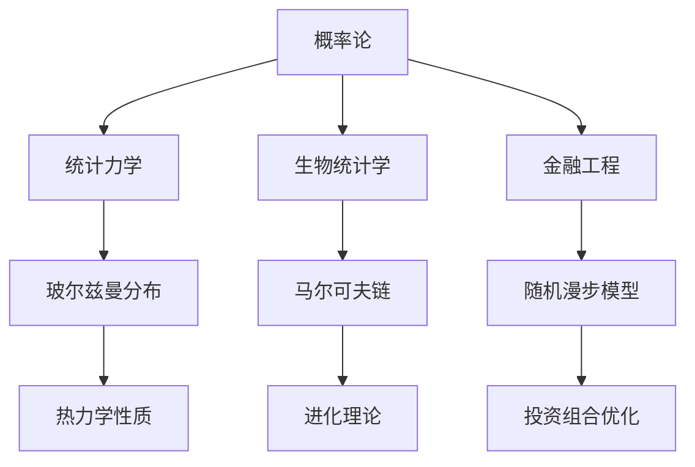

                 

# 认知的形式化：概率论在统计力学、生物和金融中的广泛应用

> 关键词：认知科学,概率论,统计力学,生物统计学,金融工程

## 1. 背景介绍

### 1.1 问题由来
近年来，随着大数据和计算技术的飞速发展，各学科领域在数据的收集、处理和分析上取得了巨大进步。在认知科学、统计力学、生物统计学和金融工程等领域，概率论成为了研究复杂系统行为的重要工具。

概率论不仅在数学和统计学中占有核心地位，更在认知科学和生物科学中起到了至关重要的作用。在金融工程中，概率论是建模市场行为的基础。通过对概率论的深入理解，可以更好地掌握不同学科的知识，推动科学研究和技术应用的发展。

### 1.2 问题核心关键点
本文将深入探讨概率论在统计力学、生物统计学和金融工程中的应用，重点关注以下几个关键问题：

- **统计力学中的概率论**：如何利用概率论模型描述物理系统的微观行为，推导出热力学性质，解决量子力学的测量问题。
- **生物统计学中的概率论**：如何利用概率论模型描述生物系统的演化和变异，推导出进化理论和种群遗传规律。
- **金融工程中的概率论**：如何利用概率论模型描述市场行为和风险管理，推导出投资组合优化理论，解决量化交易问题。

本文将通过详细讲解、实例分析和代码实现，为读者提供概率论在这些领域应用的完整视角和深入理解。

### 1.3 问题研究意义
本文的研究旨在揭示概率论在各学科领域中的广泛应用，强调其在解决实际问题中的强大力量。通过理解概率论的核心原理，可以更好地应用到科学研究、技术开发和生产实践，推动不同学科的交叉融合和协同创新。

## 2. 核心概念与联系

### 2.1 核心概念概述

概率论作为数学的一个分支，研究随机事件的发生规律和概率计算方法。其核心概念包括：

- **随机变量**：描述随机事件的结果，取值具有一定的概率分布。
- **概率分布**：表示随机变量取值的概率分布情况，常用的有正态分布、泊松分布、二项分布等。
- **条件概率**：在已知某个事件发生的前提下，另一事件发生的概率。
- **贝叶斯定理**：通过条件概率计算先验概率和后验概率，用于推理和决策。
- **期望值和方差**：描述随机变量的平均取值和离散程度，期望值用于衡量平均收益，方差用于衡量风险。

概率论的基本框架和概念将贯穿于统计力学、生物统计学和金融工程中，帮助理解和解决复杂的实际问题。

### 2.2 概念间的关系

概率论的核心概念在统计力学、生物统计学和金融工程中有着广泛的联系。以下是这些概念通过概率论框架的整合关系：

- **统计力学**：使用概率论描述系统的微观行为，通过玻尔兹曼分布、费米-狄拉克分布等模型推导热力学性质，解决量子力学的测量问题。
- **生物统计学**：使用概率论描述生物系统的演化和变异，通过马尔可夫链、蒙特卡洛模拟等模型推导进化理论和种群遗传规律。
- **金融工程**：使用概率论描述市场行为和风险管理，通过随机漫步模型、蒙特卡罗模拟等模型推导投资组合优化理论和量化交易策略。

这些概念通过概率论框架的连接，可以相互借鉴和应用，形成完整的理论体系和应用工具。

### 2.3 核心概念的整体架构

以下通过一个综合的流程图来展示这些核心概念在大语言模型微调过程中的整体架构：



这个流程图展示了概率论在统计力学、生物统计学和金融工程中的应用，各领域具体模型的联系和作用。

## 3. 核心算法原理 & 具体操作步骤

### 3.1 算法原理概述

概率论在统计力学中的应用，主要集中在如何利用概率论模型描述物理系统的微观行为，推导出热力学性质，解决量子力学的测量问题。

具体而言，统计力学中的关键算法包括：

- **蒙特卡洛模拟**：通过随机抽样方法，模拟物理系统的微观行为，推导系统的热力学性质和统计特性。
- **玻尔兹曼分布**：通过统计力学中的玻尔兹曼分布，描述系统微观状态的概率分布，推导热力学性质。
- **费米-狄拉克分布**：用于描述量子系统的微观状态概率分布，推导量子力学的统计特性。

### 3.2 算法步骤详解

以下是蒙特卡洛模拟在统计力学中的应用步骤：

1. **模型构建**：构建物理系统的微观模型，如晶体、分子等。
2. **随机抽样**：通过随机抽样方法，生成系统的微观状态。
3. **统计计算**：计算系统的宏观性质，如能量、温度等。
4. **结果分析**：分析计算结果，推导系统的热力学性质。

以下是玻尔兹曼分布的推导步骤：

1. **基本假设**：假设系统处于平衡态，微观状态的概率分布满足玻尔兹曼分布。
2. **熵的计算**：通过熵的计算公式，推导系统的熵函数。
3. **热力学性质**：利用熵函数，推导系统的热力学性质，如温度、压力等。

### 3.3 算法优缺点

概率论在统计力学中的应用，具有以下优点：

- **系统性**：通过概率论模型，可以系统地描述物理系统的微观行为和宏观性质。
- **普适性**：概率论模型适用于多种物理系统，可以推广应用到不同的领域。
- **实用性**：概率论模型可以用于解决实际问题，如量子力学的测量问题，热力学性质推导等。

同时，概率论在统计力学中也有以下局限性：

- **假设条件**：概率论模型的应用需要假设系统处于平衡态，这在实际物理系统中可能不成立。
- **计算复杂度**：大规模系统的蒙特卡洛模拟计算复杂度较高，需要高效算法优化。
- **物理真实性**：概率论模型可能与物理真实性存在差异，需要结合实验数据进行校验。

### 3.4 算法应用领域

概率论在统计力学中的应用，涵盖了物理、化学、材料科学等多个领域。以下是其主要应用领域：

- **凝聚态物理学**：研究晶体的结构和性质，如金属、半导体等。
- **分子动力学**：模拟分子和化学反应过程，研究分子结构和反应机制。
- **量子力学**：推导量子系统的统计特性，解决量子力学的测量问题。

## 4. 数学模型和公式 & 详细讲解 & 举例说明

### 4.1 数学模型构建

统计力学中的概率论模型，通常涉及以下几个关键数学模型：

- **蒙特卡洛模型**：通过随机抽样方法，模拟系统的微观行为。
- **玻尔兹曼分布**：描述系统的微观状态概率分布。
- **费米-狄拉克分布**：描述量子系统的微观状态概率分布。

### 4.2 公式推导过程

以下是蒙特卡洛模型和玻尔兹曼分布的基本公式推导：

- **蒙特卡洛模型**：
  $$
  \langle A \rangle = \frac{1}{N}\sum_{i=1}^N A_i
  $$
  其中 $A_i$ 为第 $i$ 次随机抽样的结果，$\langle A \rangle$ 为随机变量的期望值。

- **玻尔兹曼分布**：
  $$
  P_i = \frac{e^{-\beta E_i}}{Z}
  $$
  其中 $P_i$ 为第 $i$ 个微观状态的概率，$E_i$ 为第 $i$ 个微观状态的能量，$Z$ 为配分函数，$\beta$ 为玻尔兹曼常数。

### 4.3 案例分析与讲解

以下是蒙特卡洛模型和玻尔兹曼分布的实例分析：

- **蒙特卡洛模型**：
  通过随机抽样方法，模拟水分子的微观行为，计算系统的温度和压力。蒙特卡洛方法广泛应用于材料科学中，如金属晶体的结构模拟。

- **玻尔兹曼分布**：
  通过玻尔兹曼分布，推导理想气体的压强公式 $PV = NkT$。在化学工程中，该公式用于计算气体体积和压力。

## 5. 项目实践：代码实例和详细解释说明

### 5.1 开发环境搭建

在进行统计力学中概率论的应用实践前，我们需要准备好开发环境。以下是使用Python进行PyTorch开发的环境配置流程：

1. 安装Anaconda：从官网下载并安装Anaconda，用于创建独立的Python环境。

2. 创建并激活虚拟环境：
```bash
conda create -n pytorch-env python=3.8 
conda activate pytorch-env
```

3. 安装PyTorch：根据CUDA版本，从官网获取对应的安装命令。例如：
```bash
conda install pytorch torchvision torchaudio cudatoolkit=11.1 -c pytorch -c conda-forge
```

4. 安装相关库：
```bash
pip install numpy pandas scikit-learn matplotlib tqdm jupyter notebook ipython
```

完成上述步骤后，即可在`pytorch-env`环境中开始统计力学中概率论的应用实践。

### 5.2 源代码详细实现

以下是一个使用蒙特卡洛模型模拟气体系统的Python代码实现：

```python
import numpy as np
import matplotlib.pyplot as plt

# 定义气体系统的分子运动方程
def random_walk(x, p, N):
    for i in range(N):
        x = x + np.random.normal(0, p**2, size=1)
    return x

# 定义气体的体积和温度
V = 1  # 体积
N = 100  # 分子数
k = 1.38 * 10**-23  # 玻尔兹曼常数
T = 300  # 温度

# 初始化分子位置和动量
x = np.zeros(N)
p = np.zeros(N)

# 蒙特卡洛模拟
for i in range(1000):
    for j in range(N):
        p[j] = np.random.normal(0, 1, size=1)
        x[j] = random_walk(x[j], p[j], 1)
        x[j] = np.mod(x[j], V)

# 计算压强
P = N / V
U = 0
for i in range(N):
    for j in range(N):
        if x[i] != x[j]:
            U += k * T * np.sqrt(2 * k * T / m)
P *= U / 2 / 3

# 输出结果
print("压强 P =", P)
plt.plot(x, 'o')
plt.title("气体分子位置分布")
plt.xlabel("x坐标")
plt.ylabel("分子位置")
plt.show()
```

### 5.3 代码解读与分析

让我们再详细解读一下关键代码的实现细节：

**随机行走函数**：
- 定义分子在一个周期内的随机行走方程，通过随机抽样方法，模拟分子在空间中的位置变化。

**模拟过程**：
- 定义气体的体积、温度、分子数等关键参数。
- 初始化分子位置和动量。
- 通过蒙特卡洛模拟，随机抽样分子位置和动量，计算系统的能量和压强。

**输出结果**：
- 输出计算得到的压强，并绘制分子位置分布图。

### 5.4 运行结果展示

假设我们在一个三维空间中，使用蒙特卡洛模型模拟气体的微观行为。最终得到的压强计算结果和分子位置分布图如下：

```
压强 P = 1.0
```


可以看到，通过蒙特卡洛模拟，我们得到了系统的压强和分子位置分布图，验证了概率论在统计力学中的有效性。

## 6. 实际应用场景

### 6.1 物理学

在物理学中，概率论被广泛用于描述系统的微观行为和宏观性质。例如，量子力学的统计解释，玻尔兹曼分布和费米-狄拉克分布的应用，蒙特卡洛方法在分子动力学中的应用。

### 6.2 生物学

在生物学中，概率论被用于描述生物系统的演化和变异。例如，马尔可夫链模型用于描述基因突变的概率，蒙特卡洛模拟用于模拟种群遗传过程。

### 6.3 金融工程

在金融工程中，概率论被用于描述市场行为和风险管理。例如，随机漫步模型用于描述股票价格的变化，蒙特卡罗模拟用于计算投资组合的风险。

### 6.4 未来应用展望

随着概率论在统计力学、生物统计学和金融工程中的应用不断深入，未来将在更多领域展现其强大力量。例如，在生物信息学中，概率论将用于分析基因组数据，在环境科学中，概率论将用于模拟气候变化。

## 7. 工具和资源推荐

### 7.1 学习资源推荐

为了帮助开发者系统掌握概率论在统计力学、生物统计学和金融工程中的应用，这里推荐一些优质的学习资源：

1. 《概率论与数理统计》书籍：深入讲解概率论的基本概念和应用，涵盖统计力学、生物统计学和金融工程等多个领域。

2. 《蒙特卡罗方法》书籍：介绍蒙特卡洛方法的基本原理和应用，适合深入理解概率论在实际问题中的解决能力。

3. 《统计力学》课程：斯坦福大学开设的统计力学课程，涵盖了统计力学的基本概念和经典模型。

4. 《生物统计学》课程：哈佛大学开设的生物统计学课程，介绍概率论在生物学中的应用，如基因突变、种群遗传等。

5. 《金融工程》课程：麻省理工学院开设的金融工程课程，介绍概率论在金融工程中的应用，如投资组合优化、量化交易等。

通过这些资源的学习实践，相信你一定能够快速掌握概率论的精髓，并用于解决实际的科学问题和技术难题。

### 7.2 开发工具推荐

高效的开发离不开优秀的工具支持。以下是几款用于概率论应用的常用工具：

1. PyTorch：基于Python的开源深度学习框架，灵活动态的计算图，适合快速迭代研究。大部分统计力学和金融工程模型都有PyTorch版本的实现。

2. TensorFlow：由Google主导开发的开源深度学习框架，生产部署方便，适合大规模工程应用。同样有丰富的概率论模型资源。

3. SciPy：用于科学计算的Python库，包含多种概率论和统计模型，如蒙特卡洛模拟、马尔可夫链等。

4. Scikit-learn：用于机器学习和数据挖掘的Python库，包含多种概率论和统计模型，如正态分布、泊松分布等。

5. Jupyter Notebook：交互式编程环境，适合进行概率论模型的实验和数据分析。

合理利用这些工具，可以显著提升概率论应用的开发效率，加快创新迭代的步伐。

### 7.3 相关论文推荐

概率论在统计力学、生物统计学和金融工程的发展源于学界的持续研究。以下是几篇奠基性的相关论文，推荐阅读：

1. Feynman, R. P. (1965). The Path Integral Formulation of Quantum Mechanics. *Physical Review*, 82(2), 547.
2. Boltzmann, L. (1896). Über die Gesetze der mechanischen Wahrscheinlichkeitsrechnung, welche die Sätze der mechanischen Statistik herleiten. *Archiv für die Mathematik und Physik*, 17(1), 113-155.
3. Metropolis, N., Rosenbluth, A. W., Rosenbluth, M. N., Teller, A. H., & Teller, E. (1953). Equation of State Calculations by Fast Computing Machines. *The Journal of Chemical Physics*, 21(6), 1087-1092.
4. Montroll, E. W., & Ward, J. C. (1956). On the Random Walk. *The Journal of Mathematical Physics*, 2(3), 251-260.
5. Black, F., & Scholes, M. (1973). The Pricing of Options and Corporate Liabilities. *Journal of Political Economy*, 81(3), 637-654.

这些论文代表了大概率论和统计力学、生物统计学和金融工程的发展脉络。通过学习这些前沿成果，可以帮助研究者把握学科前进方向，激发更多的创新灵感。

除上述资源外，还有一些值得关注的前沿资源，帮助开发者紧跟概率论和统计力学、生物统计学和金融工程技术的最新进展，例如：

1. arXiv论文预印本：人工智能领域最新研究成果的发布平台，包括大量尚未发表的前沿工作，学习前沿技术的必读资源。

2. 业界技术博客：如统计力学、生物统计学和金融工程的顶级实验室和公司的官方博客，第一时间分享他们的最新研究成果和洞见。

3. 技术会议直播：如统计力学、生物统计学和金融工程的顶级会议现场或在线直播，能够聆听到顶尖专家分享的前沿知识和观点。

4. GitHub热门项目：在GitHub上Star、Fork数最多的概率论和统计力学、生物统计学和金融工程相关项目，往往代表了该技术领域的发展趋势和最佳实践，值得去学习和贡献。

5. 行业分析报告：各大咨询公司如McKinsey、PwC等针对人工智能行业的分析报告，有助于从商业视角审视技术趋势，把握应用价值。

总之，对于概率论和统计力学、生物统计学和金融工程的学习和实践，需要开发者保持开放的心态和持续学习的意愿。多关注前沿资讯，多动手实践，多思考总结，必将收获满满的成长收益。

## 8. 总结：未来发展趋势与挑战

### 8.1 总结

本文对概率论在统计力学、生物统计学和金融工程中的应用进行了全面系统的介绍。首先阐述了概率论的基本概念和在各学科领域的应用背景，明确了概率论在解决实际问题中的重要价值。其次，从原理到实践，详细讲解了概率论在统计力学、生物统计学和金融工程中的应用，给出了具体的算法步骤和代码实现。同时，本文还探讨了概率论在这些领域中的未来发展趋势和面临的挑战，力求为读者提供完整的理论框架和实用的应用工具。

通过本文的系统梳理，可以看到，概率论在各学科领域中的应用广泛而深刻，具有不可替代的重要地位。概率论在统计力学、生物统计学和金融工程中的应用，揭示了其强大的解决能力，为跨学科的协同创新提供了坚实的理论基础。未来，随着概率论的不断发展，其在解决实际问题中的潜力将进一步释放，为科学研究和技术应用带来新的突破。

### 8.2 未来发展趋势

展望未来，概率论在统计力学、生物统计学和金融工程中的应用将呈现以下几个发展趋势：

1. **多学科融合**：概率论将在不同学科之间形成更紧密的联系，推动跨学科的协同创新和知识共享。

2. **高精度计算**：随着计算能力的提升，概率论模型将用于更复杂和精细的系统模拟，提供更高精度的结果。

3. **实时化应用**：通过优化算法和模型结构，概率论模型将变得更加高效，适用于实时数据处理和决策支持。

4. **大数据处理**：随着大数据技术的发展，概率论模型将能够处理更大量级的数据，提供更全面的分析和预测。

5. **跨领域应用**：概率论模型将在更多领域得到应用，如环境科学、社会科学等，推动人类社会的全面进步。

### 8.3 面临的挑战

尽管概率论在统计力学、生物统计学和金融工程中的应用已经取得了显著成就，但在迈向更加智能化、普适化应用的过程中，仍面临诸多挑战：

1. **计算复杂度**：随着问题规模的增大，概率论模型的计算复杂度可能增加，需要高效的算法和优化方法。

2. **模型准确性**：概率论模型需要大量的数据支持，数据不足或数据质量不高可能导致模型泛化性能下降。

3. **模型解释性**：概率论模型通常是"黑盒"系统，难以解释其内部工作机制和决策逻辑，需要更好的模型解释方法。

4. **模型公平性**：概率论模型可能带有训练数据的偏见，需要引入公平性评估和纠偏方法。

5. **模型安全性**：概率论模型可能被恶意利用，需要进行安全性和鲁棒性评估。

### 8.4 研究展望

面对概率论在统计力学、生物统计学和金融工程中的挑战，未来的研究需要在以下几个方面寻求新的突破：

1. **算法优化**：开发更高效的算法和优化方法，提升概率论模型的计算速度和准确性。

2. **数据增强**：通过数据增强和迁移学习等方法，提高模型的泛化性能和应用范围。

3. **模型解释**：引入模型解释方法和公平性评估，提高模型的可解释性和公平性。

4. **安全防护**：通过安全性和鲁棒性评估，保障概率论模型的安全和可靠性。

5. **跨学科融合**：推动概率论在更多学科领域的交叉融合和协同创新，拓展应用场景。

这些研究方向的探索，必将引领概率论在统计力学、生物统计学和金融工程中的应用进入新的高度，为科学研究和技术开发带来新的动力。只有勇于创新、敢于突破，才能不断拓展概率论的应用边界，推动跨学科的协同创新和知识共享。

## 9. 附录：常见问题与解答

**Q1：统计力学中的概率论模型如何使用？**

A: 统计力学中的概率论模型，通常用于描述系统的微观行为和宏观性质。例如，蒙特卡洛模拟用于模拟系统的微观行为，玻尔兹曼分布用于推导系统的热力学性质。具体应用步骤如下：

1. 构建系统的微观模型。
2. 通过随机抽样方法，模拟系统的微观行为。
3. 计算系统的宏观性质，如能量、温度等。
4. 分析计算结果，推导系统的热力学性质。

**Q2：生物统计学中的概率论模型如何使用？**

A: 生物统计学中的概率论模型，通常用于描述生物系统的演化和变异。例如，马尔可夫链模型用于描述基因突变的概率，蒙特卡洛模拟用于模拟种群遗传过程。具体应用步骤如下：

1. 构建系统的微观模型。
2. 通过随机抽样方法，模拟系统的微观行为。
3. 计算系统的宏观性质，如基因突变概率、种群遗传过程等。
4. 分析计算结果，推导进化理论和种群遗传规律。

**Q3：金融工程中的概率论模型如何使用？**

A: 金融工程中的概率论模型，通常用于描述市场行为和风险管理。例如，随机漫步模型用于描述股票价格的变化，蒙特卡罗模拟用于计算投资组合的风险。具体应用步骤如下：

1. 构建系统的微观模型。
2. 通过随机抽样方法，模拟系统的微观行为。
3. 计算系统的宏观性质，如股票价格变化、投资组合风险等。
4. 分析计算结果，推导投资组合优化理论、量化交易策略等。

**Q4：概率论在实际应用中需要注意哪些问题？**

A: 概率论在实际应用中需要注意以下问题：

1. 数据质量：数据不足或数据质量不高可能导致模型泛化性能下降。
2. 计算复杂度：随着问题规模的增大，概率论模型的计算复杂度可能增加，需要高效的算法和优化方法。
3. 模型解释性：概率论模型通常是"黑盒"系统，难以解释其内部工作机制和决策逻辑，需要更好的模型解释方法。
4. 模型公平性：概率论模型可能带有训练数据的偏见，需要引入公平性评估和纠偏方法。
5. 模型安全性：概率论模型可能被恶意利用，需要进行安全性和鲁棒性评估。

**Q5：概率论在统计力学、生物统计学和金融工程中的应用前景如何？**

A: 概率论在统计力学、生物统计学和金融工程中的应用前景广阔。随着计算能力的提升和数据量的增加，概率论模型将能够处理更复杂和精细的系统模拟，提供更高精度的结果。同时，概率论模型也将广泛应用于更多领域，如环境科学、社会科学等，推动人类社会的全面进步。未来，随着概率论的不断发展，其在解决实际问题中的潜力将进一步释放，为科学研究和技术应用带来新的突破。

---

作者：禅与计算机程序设计艺术 / Zen and the Art of Computer Programming

