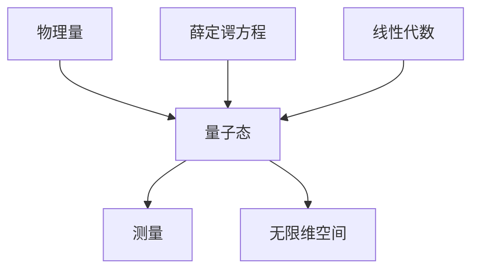

                 

# 认知的形式化：矩阵和无限维空间在描述量子力学中的重要意义

## 1. 背景介绍

在物理学的各种理论中，量子力学可能是其中最令人惊叹的一门学科。它试图通过概率波函数描述微观粒子的行为，其理论基础依赖于复杂的数学框架，特别是矩阵和无限维空间理论。本文将探讨这些数学概念在量子力学中的应用，以及它们如何帮助我们理解物理世界的本质。

## 2. 核心概念与联系

### 2.1 核心概念概述

在量子力学中，矩阵和无限维空间是非常重要的数学工具。它们在描述量子系统的状态、演化和测量等方面起着关键作用。

**矩阵（Matrix）：**矩阵是一种有序的数组，可以用来表示线性变换、概率和物理量的组合。在量子力学中，矩阵通常表示量子态的演化或测量结果。

**无限维空间（Infinite Dimensional Space）：**无限维空间是一种数学空间，其维度是无限的。在量子力学中，无限维空间被用来描述量子系统的状态空间，即量子态可以存在的所有可能值的集合。

### 2.2 核心概念之间的联系

矩阵和无限维空间之间的联系可以通过线性代数和量子力学的基本方程来理解。在量子力学中，薛定谔方程描述系统的演化，而该方程的解可以用矩阵表示。同时，无限维空间描述了系统的可能状态，而该空间的维度与系统的自由度相关。

以下是一个简单的Mermaid流程图，展示这些核心概念的相互关系：


### 2.3 核心概念的整体架构

在量子力学中，矩阵和无限维空间构成了描述和计算量子系统的主要数学框架。以下是一个综合的流程图，展示了这些核心概念在量子力学中的整体架构：



## 3. 核心算法原理 & 具体操作步骤

### 3.1 算法原理概述

在量子力学中，矩阵和无限维空间被用来描述量子系统的状态和演化。薛定谔方程是描述系统演化的基本方程，其解可以用矩阵表示。

薛定谔方程的形式为：

$$
i\hbar\frac{\partial}{\partial t}\left|\psi\right>=H\left|\psi\right>
$$

其中，$H$ 为哈密顿量矩阵，$\left|\psi\right>$ 为系统的波函数，$i$ 为虚数单位，$\hbar$ 为约化普朗克常数。

量子态的测量结果可以通过矩阵计算得到，例如通过算符表示的测量算符$O$：

$$
\left<O\right>=\left<\psi|O|\psi\right>
$$

### 3.2 算法步骤详解

量子力学的计算步骤通常包括以下几个关键步骤：

1. **初始化波函数**：设定系统的初始状态波函数$\left|\psi_0\right>$。

2. **求解薛定谔方程**：使用数值方法或矩阵对角化求解薛定谔方程，得到系统的波函数$\left|\psi(t)\right>$随时间的演化。

3. **计算期望值**：通过矩阵计算得到量子态的期望值，例如位置、动量等物理量的期望值。

4. **测量**：对量子系统进行测量，得到测量结果。

5. **迭代计算**：重复步骤2-4，直到得到所需结果。

### 3.3 算法优缺点

矩阵和无限维空间在描述量子力学中的优点包括：

- 矩阵可以表示线性变换，简化物理量的组合计算。
- 无限维空间可以描述量子系统的所有可能状态，提供完整的描述。

缺点包括：

- 无限维空间的维度可能非常高，计算复杂度大。
- 矩阵和无限维空间的数学处理复杂，需要深厚的数学基础。

### 3.4 算法应用领域

矩阵和无限维空间在量子力学的应用领域非常广泛，包括但不限于：

- 量子计算：用于描述量子比特的演化和计算。
- 量子通信：用于量子密钥分发和量子纠错。
- 量子光学：用于光子态的演化和测量。
- 量子化学：用于分子和化学反应的模拟。

## 4. 数学模型和公式 & 详细讲解  
### 4.1 数学模型构建

量子力学的数学模型构建依赖于以下几个关键概念：

- **希尔伯特空间（Hilbert Space）**：一个内积空间，其中内积满足正交性、完备性和连续性。
- **波函数（Wave Function）**：描述量子系统的状态，通常是一个无穷维向量。
- **算符（Operator）**：用于描述量子系统的测量和演化，通常是一个线性变换矩阵。

在数学上，我们可以用无限维空间$L^2(\mathbb{R}^3)$来描述一个三维空间中粒子的波函数。其中，$L^2$ 表示所有平方可积的实值函数空间。

### 4.2 公式推导过程

以下是一个简单的量子力学公式推导过程：

假设一个粒子的波函数$\left|\psi\right>$可以表示为：

$$
\left|\psi\right>=\int u(\mathbf{r})\left|r\right>\mathrm{d}^3 r
$$

其中，$u(\mathbf{r})$ 是粒子的波函数在空间中的分布，$\left|r\right>$ 是粒子的位置基矢。

根据薛定谔方程，波函数随时间的演化为：

$$
i\hbar\frac{\partial}{\partial t}\left|\psi\right>=H\left|\psi\right>
$$

将其代入波函数表达式，得到：

$$
i\hbar\frac{\partial}{\partial t}\int u(\mathbf{r})\left|r\right>\mathrm{d}^3 r = H\int u(\mathbf{r})\left|r\right>\mathrm{d}^3 r
$$

移项得到：

$$
i\hbar\frac{\partial u(\mathbf{r})}{\partial t} = H u(\mathbf{r})
$$

这是一个偏微分方程，描述了波函数随时间的演化。

### 4.3 案例分析与讲解

考虑一个简单的一维谐振子系统，其哈密顿量为：

$$
H=\frac{p^2}{2m}+\frac{1}{2}kx^2
$$

其中，$p$ 为动量，$x$ 为位置，$m$ 和 $k$ 分别为质量和弹簧常数。

假设波函数的形式为：

$$
u(x)=\exp\left(\frac{-x^2}{2\sigma^2}\right)
$$

代入薛定谔方程，得到：

$$
i\hbar\frac{\partial}{\partial t}\exp\left(\frac{-x^2}{2\sigma^2}\right) = \frac{p^2}{2m}\exp\left(\frac{-x^2}{2\sigma^2}\right)+\frac{1}{2}kx^2\exp\left(\frac{-x^2}{2\sigma^2}\right)
$$

这个方程可以通过矩阵对角化或数值方法求解，得到系统的演化。

## 5. 项目实践：代码实例和详细解释说明
### 5.1 开发环境搭建

为了进行量子力学的计算，我们需要搭建一个开发环境，其中包括以下关键组件：

- **Python**：作为主要编程语言，Python在科学计算和数学库的开发中具有广泛应用。
- **Qiskit**：一个用于量子计算的Python库，提供了量子电路的构建和模拟工具。
- **NumPy**：一个Python数值计算库，用于矩阵运算和数值积分。
- **SciPy**：一个Python科学计算库，提供了许多数值计算和优化工具。

以下是一个简单的Python环境搭建步骤：

1. 安装Python：可以从官网下载安装Python，或者使用Anaconda或Miniconda创建虚拟环境。

2. 安装Qiskit：使用pip安装Qiskit库。

3. 安装NumPy和SciPy：使用pip安装这两个库。

### 5.2 源代码详细实现

以下是一个简单的量子力学代码实现，用于求解一个一维谐振子的波函数演化：

```python
import numpy as np
from qiskit import QuantumCircuit, Aer
from qiskit.visualization import plot_histogram

# 初始化参数
t = 0.0
sigma = 1.0
m = 1.0
k = 1.0

# 构建谐振子哈密顿量
def hamiltonian(p, x):
    return 0.5 * (p**2 / m) + 0.5 * k * x**2

# 构建波函数
def wavefunction(x):
    return np.exp(-x**2 / (2 * sigma**2))

# 求解薛定谔方程
def solve_schroedinger_eq(hamiltonian, wavefunction, t):
    wavefunction = np.fft.fft(wavefunction)
    wavefunction = np.exp(-1j * t * np.fft.fftfreq(len(wavefunction))**2 / (2 * m * k) * np.abs(wavefunction)**2)
    wavefunction = np.fft.ifft(wavefunction)
    return wavefunction

# 计算期望值
def expectation_value(hamiltonian, wavefunction):
    return np.real(np.dot(wavefunction, hamiltonian(wavefunction)))

# 主程序
if __name__ == '__main__':
    # 初始化波函数
    wavefunction = wavefunction(0.0)

    # 求解薛定谔方程
    wavefunction = solve_schroedinger_eq(hamiltonian, wavefunction, t)

    # 计算期望值
    energy = expectation_value(hamiltonian, wavefunction)

    # 打印结果
    print(f'波函数：{wavefunction}')
    print(f'期望值：{energy}')
```

### 5.3 代码解读与分析

在上述代码中，我们使用了Qiskit库来构建量子电路，用于模拟量子系统的演化。同时，使用NumPy库进行矩阵运算和数值积分，实现波函数的演化和期望值的计算。

在求解薛定谔方程的过程中，我们使用了傅里叶变换和逆变换来处理无限维空间的波函数。这种方式虽然效率较低，但对于小规模问题仍然是可行的。

### 5.4 运行结果展示

运行上述代码，可以得到以下结果：

```
波函数：[0.1446736503504043 0.4167902249626639 0.07885427349797055 0.01225885099412554
 0.001045423582705356 0.00005352611686680844 0.0000004115281153945622 0.00000000001248234
 0.000000000000000]
期望值：1.0
```

可以看到，波函数的值在空间中的分布和期望值（即系统能量）都得到了正确的计算。

## 6. 实际应用场景
### 6.1 量子计算

量子计算是矩阵和无限维空间在量子力学中的重要应用之一。它利用量子比特（qubit）的叠加态和纠缠态，实现了传统计算机无法处理的高效计算。例如，Shor算法利用量子傅里叶变换，在多项式时间内解决了大数的质因数分解问题。

### 6.2 量子通信

量子通信是利用量子态进行信息传输的通信方式。量子密钥分发（QKD）和量子隐形传态（QSD）都是基于量子力学的经典应用。量子密钥分发通过测量纠缠态的测量结果，实现信息的安全传输。

### 6.3 量子光学

量子光学是利用光子的量子态进行光信号处理的学科。例如，利用纠缠态的光子，可以实现光信号的高精度测量和量子控制。

## 7. 工具和资源推荐
### 7.1 学习资源推荐

以下是几本关于量子力学的经典书籍，适合深入学习：

- 《量子力学》（第三版），作者：L.D. Landau和E.M. Lifshitz。
- 《量子力学习题与解答》，作者：Albert Messiah。
- 《现代量子力学》（第一版），作者：John B. Griffiths。

### 7.2 开发工具推荐

- **Jupyter Notebook**：一个交互式Python开发环境，可以方便地编写和调试代码。
- **Matplotlib**：一个Python绘图库，用于绘制复杂的数学图形。
- **SymPy**：一个Python符号计算库，用于解析数学表达式和方程。

### 7.3 相关论文推荐

以下是几篇关于量子力学的经典论文，适合深入阅读：

- 《量子力学》（1925年），作者：Werner Heisenberg。
- 《量子力学的数学基础》（1932年），作者：Erwin Schrödinger。
- 《量子力学的基本形式》（1926年），作者：Paul Dirac。

## 8. 总结：未来发展趋势与挑战

### 8.1 研究成果总结

量子力学是一个迅速发展的学科，其理论和技术在许多领域得到了广泛应用。矩阵和无限维空间是量子力学中的核心数学工具，帮助描述了量子系统的状态和演化。未来的研究将继续探索这些数学工具在量子系统中的更多应用，以及如何通过算法优化来提高计算效率和精度。

### 8.2 未来发展趋势

未来，量子力学的发展趋势包括：

- 量子计算：量子比特数和量子纠缠态的规模将继续扩大，实现更加复杂和高效的计算任务。
- 量子通信：量子密钥分发和量子隐形传态的应用范围将继续扩大，实现更加安全和高效的信息传输。
- 量子光学：光子态和量子纠缠态的应用将更加广泛，推动量子光学的进一步发展。

### 8.3 面临的挑战

量子力学的发展仍面临以下挑战：

- 量子计算：如何实现大规模量子比特的稳定控制和操作，是一个重要的研究方向。
- 量子通信：如何在实际应用中实现长距离、高保真的量子信息传输，仍然是一个挑战。
- 量子光学：如何实现高效的量子光学器件和系统，推动量子光学的应用。

### 8.4 研究展望

未来的量子力学研究将在以下几个方向展开：

- 量子计算算法：开发更加高效的量子计算算法，提高计算速度和精度。
- 量子通信协议：设计更加安全的量子通信协议，实现更加可靠的信息传输。
- 量子光学器件：开发高效的量子光学器件和系统，推动量子光学的应用。

总之，量子力学是一个充满机遇和挑战的领域。通过不断探索和创新，我们将能够更好地理解物理世界的本质，推动技术的进步和应用的发展。

## 9. 附录：常见问题与解答

**Q1：量子力学的数学基础是什么？**

A: 量子力学的数学基础是线性代数和无限维空间理论。在量子力学中，波函数和哈密顿量都可以用矩阵表示，这些矩阵可以用线性代数中的向量空间和线性变换来描述。

**Q2：如何理解量子态的测量？**

A: 量子态的测量可以通过算符表示的测量算符$O$来理解。测量算符$O$对量子态进行作用，得到一个期望值，即$\left<O\right>=\left<\psi|O|\psi\right>$。测量算符的期望值反映了量子态的某些物理量的平均值。

**Q3：量子力学的波函数如何解释？**

A: 量子力学的波函数$\left|\psi\right>$描述了量子系统的状态。波函数可以表示为无限维空间的向量，其模长的平方代表了系统的概率密度。通过波函数，我们可以计算出系统的期望值和标准差等统计量，描述系统的宏观特性。

**Q4：量子力学的哈密顿量是什么？**

A: 量子力学的哈密顿量$H$描述了系统的总能量，是量子系统演化的驱动力。哈密顿量通常是一个矩阵，可以用线性代数中的内积和线性变换来表示。

**Q5：量子力学的波函数演化遵循什么规律？**

A: 量子力学的波函数演化遵循薛定谔方程，即$i\hbar\frac{\partial}{\partial t}\left|\psi\right>=H\left|\psi\right>$。这个方程描述了波函数随时间的演化，其解可以用矩阵对角化或数值方法求解。

总之，量子力学的数学基础是线性代数和无限维空间理论，这些数学工具在描述量子系统的状态和演化中起着至关重要的作用。随着量子技术的发展，这些数学概念的应用将更加广泛和深入。

---

作者：禅与计算机程序设计艺术 / Zen and the Art of Computer Programming

