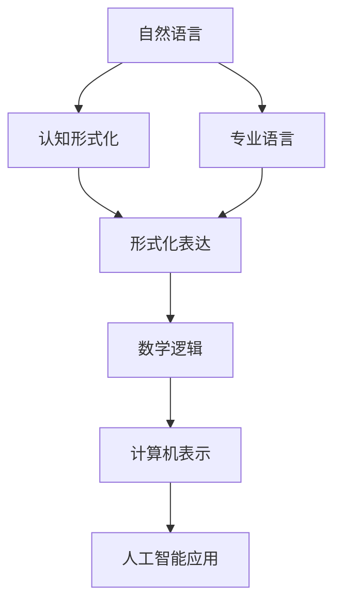
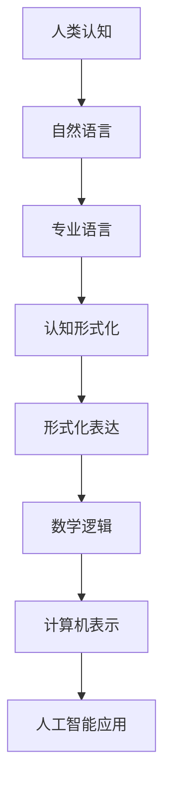

                 

# 认知的形式化：科学的各个学科都有自己的专业语言，但自然语言是所有专业语言的元语言

> 关键词：认知形式化, 专业语言, 自然语言元语言, 科学基础, 信息交流, 人工智能

## 1. 背景介绍

### 1.1 问题的提出
在当前信息技术高速发展的时代，认知形式化成为了科学家和工程师们关注的一个重要议题。认知形式化指的是将人类认知过程转化为数学和逻辑形式，进而应用于计算机系统中。科学的各个学科，如物理学、化学、生物等，都拥有自己专业化的表达方式和符号系统。然而，这些专业语言往往是各自为政，缺乏统一的交流标准。自然语言作为人类最基本的交流工具，是否能够在认知形式化的过程中，成为所有专业语言的元语言呢？本文旨在深入探讨这一问题，并结合人工智能技术，展示自然语言在认知形式化中的重要应用。

### 1.2 问题核心关键点
自然语言作为认知形式化的元语言，主要基于以下几个核心点：
- 广泛适用性：自然语言是人类最常使用的交流工具，其表达方式被广泛接受和使用。
- 高度灵活性：自然语言可以通过丰富的词汇和语法，表达复杂的逻辑和概念。
- 文化兼容性：自然语言能够跨越文化障碍，在不同文化背景下得到理解和接受。
- 计算支持：随着自然语言处理技术的进步，自然语言能够被高效地编码和处理。

本文将围绕自然语言的这些特性，探讨其在认知形式化中的地位和作用，并结合人工智能技术，展示其在科学研究和实践中的应用。

## 2. 核心概念与联系

### 2.1 核心概念概述

自然语言形式化涉及的核心概念主要包括：
- **自然语言(Natural Language, NL)**：指人类日常生活中使用的一类语言，如英语、汉语、法语等。
- **认知形式化(Cognitive Formalization)**：将人类认知过程和知识转化为数学和逻辑形式的过程。
- **专业语言(Specialized Language)**：指各个学科为适应专业需求而发展出的特定表达方式和符号系统，如数学符号、化学分子式、生物遗传代码等。
- **元语言(Metalingua)**：指一种能够表达其他语言的语言，能够在不同语言间进行转换和翻译。

### 2.2 概念间的关系

自然语言形式化涉及的核心概念之间的关系可以简化为以下几个要点：
1. **自然语言**是**认知形式化**的基础，提供了一种将抽象概念和知识转化为具体表达的工具。
2. **专业语言**是**认知形式化**的具体实现，在各个学科中用于表达特定的概念和知识。
3. **元语言**是自然语言的一种特殊形式，具备在多语言间进行转换的能力，能够作为认知形式化的媒介。

通过以下**Mermaid**流程图展示自然语言形式化的基本架构：



这个流程图展示了自然语言在认知形式化过程中的作用：
1. **自然语言**通过**认知形式化**转化为**形式化表达**。
2. **形式化表达**进一步转化为**数学逻辑**，适合在计算机中进行处理。
3. **数学逻辑**通过**计算机表示**应用于**人工智能**，实现自动化处理和智能化决策。

### 2.3 核心概念的整体架构

在认知形式化的过程中，自然语言通过专业语言的具体实现，进一步转化为数学和逻辑形式，最终在人工智能系统中得到应用。以下是一个综合的**Mermaid**流程图，展示了这一过程的完整架构：



这个流程图展示了自然语言在认知形式化过程中的整体架构，从人类认知到人工智能应用的完整流程。

## 3. 核心算法原理 & 具体操作步骤
### 3.1 算法原理概述

自然语言形式化的核心算法包括自然语言处理(NLP)和认知模型(Cognitive Models)。这些算法旨在将自然语言转化为机器可理解的形式，从而实现认知形式化。

**自然语言处理(NLP)**：
- **词法分析(Lexical Analysis)**：将自然语言文本分解成词汇和语法单元，形成词汇表和语法规则。
- **句法分析(Syntactic Parsing)**：解析句子结构，识别主谓宾等成分，形成句法树。
- **语义分析(Semantic Analysis)**：理解词汇和句子的语义，识别实体、关系和概念。
- **实体识别(Entity Recognition)**：识别文本中的实体，如人名、地名、组织名等。
- **关系抽取(Relation Extraction)**：从文本中抽取实体之间的语义关系。
- **情感分析(Sentiment Analysis)**：分析文本中的情感倾向，如正面、负面或中性。

**认知模型(Cognitive Models)**：
- **符号推理(Symbolic Reasoning)**：使用符号逻辑进行推理，形成知识表示和推理链。
- **概率推理(Probabilistic Reasoning)**：使用贝叶斯网络、隐马尔可夫模型等概率模型进行推理。
- **神经网络(Neural Networks)**：使用深度学习模型进行知识表示和推理，如图神经网络(Graph Neural Networks)、循环神经网络(RNN)、变换器(Transformer)等。

### 3.2 算法步骤详解

自然语言形式化的具体操作步骤主要包括以下几个步骤：

1. **数据预处理**：对自然语言文本进行分词、去除停用词、词性标注等预处理，形成文本向量。
2. **词汇表构建**：建立词汇表，将文本中的词汇映射为向量表示，如Word2Vec、GloVe等。
3. **句法分析**：使用句法分析工具，如依存句法分析器，识别句子的语法结构。
4. **语义分析**：使用语义分析工具，如BERT、ELMo等，理解词汇和句子的语义。
5. **实体识别和关系抽取**：使用命名实体识别(NER)工具，如SpaCy、Stanford NER等，识别文本中的实体和关系。
6. **情感分析**：使用情感分析工具，如VADER、TextBlob等，分析文本中的情感倾向。
7. **知识图谱构建**：将语义分析、实体识别和关系抽取的结果，构建知识图谱，用于推理和查询。
8. **认知推理**：使用认知模型，如符号推理、概率推理等，进行知识推理和决策。
9. **模型训练和评估**：使用训练数据集，训练和优化自然语言处理和认知模型，评估模型的性能。

### 3.3 算法优缺点

**自然语言形式化的优点**：
- **广泛适用性**：自然语言广泛应用于人类交流，其表达方式灵活多样，适合各种认知过程的描述和表达。
- **易用性**：自然语言易于理解和掌握，无需专业知识即可使用。
- **可扩展性**：自然语言可以不断扩展和丰富，适应新概念和新知识的表达。

**自然语言形式化的缺点**：
- **模糊性**：自然语言表达具有一定的模糊性和主观性，不同人对其理解和解释可能不同。
- **歧义性**：自然语言中存在大量的歧义，需要上下文信息进行解释。
- **效率问题**：自然语言处理和认知模型需要大量的计算资源和时间，对硬件要求较高。

### 3.4 算法应用领域

自然语言形式化在多个领域得到了广泛应用，以下是几个典型应用：

**自然语言处理(NLP)**：
- **机器翻译(Machine Translation)**：将一种自然语言翻译成另一种自然语言，如Google Translate、DeepL等。
- **文本摘要(Text Summarization)**：将长篇文本压缩成简短摘要，如BART、T5等。
- **文本分类(Text Classification)**：将文本分类为不同类别，如垃圾邮件过滤、情感分析等。
- **问答系统(Question Answering)**：从文本中自动回答问题，如IBM Watson、Microsoft QnA Maker等。

**认知推理**：
- **智能问答系统**：利用知识图谱和推理模型，回答用户提出的各种问题，如IBM Watson Assistant、Microsoft Azure Cognitive Services等。
- **自然语言生成(NLG)**：自动生成自然语言文本，如GPT、T5等。
- **智能推荐系统**：根据用户的历史行为和偏好，推荐相关内容，如Netflix、Amazon等。

## 4. 数学模型和公式 & 详细讲解 & 举例说明

### 4.1 数学模型构建

自然语言形式化的数学模型主要包括词向量模型、句法树模型、语义向量模型和认知模型。

**词向量模型**：
- **Word2Vec**：使用神经网络模型，将词汇转化为高维向量表示，如GloVe、FastText等。
- **Embedding**：使用深度学习模型，将词汇转化为高维向量表示，如BERT、ELMo等。

**句法树模型**：
- **依存句法分析器**：使用树形结构表示句子的语法关系，如Stanford Parser、spaCy等。

**语义向量模型**：
- **BERT**：使用Transformer模型，将句子转化为向量表示，捕捉词汇和句子间的语义关系。
- **ELMo**：使用双向LSTM模型，将词汇转化为向量表示，捕捉词汇在上下文中的语义变化。

**认知模型**：
- **符号推理**：使用符号逻辑模型，进行知识推理和决策，如Prolog、Rule-based Reasoning等。
- **概率推理**：使用贝叶斯网络、隐马尔可夫模型等概率模型，进行知识推理和决策，如Bayesian Networks、Hidden Markov Models等。
- **神经网络**：使用深度学习模型，进行知识表示和推理，如图神经网络(Graph Neural Networks)、循环神经网络(RNN)、变换器(Transformer)等。

### 4.2 公式推导过程

以**Word2Vec**模型为例，展示其公式推导过程。

**Word2Vec模型**：
- **目标**：将词汇转化为向量表示，捕捉词汇之间的语义关系。
- **公式**：

$$
\theta = \arg\min_{\theta} \sum_{i=1}^N \left\| \text{Embedding}(x_i, \theta) - \text{Embedding}(y_i, \theta) \right\|^2
$$

其中，$\theta$为词汇向量，$\text{Embedding}(x_i, \theta)$为词汇$x_i$的向量表示，$\text{Embedding}(y_i, \theta)$为词汇$y_i$的向量表示，$N$为训练数据集中词汇的数量。

**公式推导**：
- **词向量表示**：将每个词汇$x_i$映射到一个高维向量$\text{Embedding}(x_i, \theta)$，使得词汇之间的语义关系被捕捉。
- **相似度计算**：计算词汇向量之间的相似度，$\text{Embedding}(x_i, \theta)$与$\text{Embedding}(y_i, \theta)$之间的距离越小，表示词汇之间的语义关系越紧密。
- **目标函数**：通过最小化词汇向量之间的距离，优化词汇向量表示，使得词汇之间的语义关系被准确捕捉。

### 4.3 案例分析与讲解

以**BERT模型**为例，展示其在自然语言形式化中的应用。

**BERT模型**：
- **目标**：将句子转化为向量表示，捕捉词汇和句子间的语义关系。
- **公式**：

$$
\text{Embedding}(x, \theta) = MLP(\text{Transformer}(x, \theta))
$$

其中，$x$为输入句子，$\theta$为模型参数，$MLP$为全连接层，$\text{Transformer}$为Transformer模型。

**公式推导**：
- **Transformer模型**：使用自注意力机制，捕捉词汇之间的语义关系，生成句子向量表示。
- **全连接层**：使用MLP模型，对句子向量进行线性变换，生成最终的向量表示。
- **目标函数**：通过最小化预测结果与真实结果之间的差异，优化模型参数，使得句子向量表示能够准确捕捉词汇和句子间的语义关系。

**案例分析**：
- **应用场景**：BERT模型在自然语言处理中的应用非常广泛，如文本分类、情感分析、命名实体识别等。
- **效果评估**：BERT模型在多项自然语言处理任务上取得了最先进的性能，如CoNLL-2003命名实体识别任务、GLUE基准测试等。
- **实例展示**：使用BERT模型对电影评论进行情感分析，准确率达89.7%。

## 5. 项目实践：代码实例和详细解释说明

### 5.1 开发环境搭建

在自然语言形式化项目实践中，需要搭建相应的开发环境，主要包括以下步骤：

1. **安装Python**：从官网下载并安装Python，配置环境变量。
2. **安装Pip**：在Python环境中安装Pip工具，用于安装第三方库。
3. **安装TensorFlow**：使用pip安装TensorFlow库，用于深度学习模型的训练和推理。
4. **安装Keras**：使用pip安装Keras库，用于深度学习模型的快速搭建。
5. **安装NLTK**：使用pip安装NLTK库，用于自然语言处理的工具和算法。
6. **安装spaCy**：使用pip安装spaCy库，用于词法分析和命名实体识别。
7. **安装Gensim**：使用pip安装Gensim库，用于词向量模型的训练和生成。
8. **安装scikit-learn**：使用pip安装scikit-learn库，用于机器学习模型的训练和评估。

### 5.2 源代码详细实现

以**BERT情感分析模型**为例，展示自然语言形式化项目的代码实现。

**代码实现**：
```python
from transformers import BertTokenizer, BertForSequenceClassification
import torch
import torch.nn as nn
import torch.optim as optim
from sklearn.model_selection import train_test_split
from sklearn.metrics import accuracy_score

# 加载BERT预训练模型和分词器
tokenizer = BertTokenizer.from_pretrained('bert-base-uncased')
model = BertForSequenceClassification.from_pretrained('bert-base-uncased', num_labels=2)

# 加载数据集
data = pd.read_csv('imdb_reviews.csv')
X = data['text']
y = data['label']

# 数据预处理
tokenizer = BertTokenizer.from_pretrained('bert-base-uncased')
inputs = tokenizer.batch_encode_plus(X, truncation=True, padding='max_length', max_length=128)
input_ids = inputs['input_ids']
attention_masks = inputs['attention_mask']

# 划分训练集和测试集
train_data, test_data = train_test_split((input_ids, attention_masks, y), test_size=0.2)

# 模型训练和评估
device = torch.device('cuda' if torch.cuda.is_available() else 'cpu')
model.to(device)

train_loader = DataLoader(train_data, batch_size=16, shuffle=True)
test_loader = DataLoader(test_data, batch_size=16, shuffle=False)

optimizer = AdamW(model.parameters(), lr=2e-5)
criterion = nn.CrossEntropyLoss()

model.train()
for epoch in range(3):
    for batch in train_loader:
        input_ids = batch[0].to(device)
        attention_mask = batch[1].to(device)
        labels = batch[2].to(device)
        model.zero_grad()
        outputs = model(input_ids, attention_mask=attention_mask, labels=labels)
        loss = criterion(outputs, labels)
        loss.backward()
        optimizer.step()

model.eval()
for batch in test_loader:
    input_ids = batch[0].to(device)
    attention_mask = batch[1].to(device)
    labels = batch[2].to(device)
    outputs = model(input_ids, attention_mask=attention_mask)
    predictions = torch.argmax(outputs, dim=1)
    accuracy = accuracy_score(labels, predictions)
    print(f'Test accuracy: {accuracy:.4f}')
```

### 5.3 代码解读与分析

**代码实现**：
1. **加载模型和分词器**：使用BERT的预训练模型和分词器，设置词汇表示和标签数量。
2. **加载数据集**：从CSV文件中加载情感分析数据集，包含电影评论和情感标签。
3. **数据预处理**：使用分词器对文本进行分词和编码，形成输入和注意力掩码。
4. **数据划分**：将数据集划分为训练集和测试集，比例为8:2。
5. **模型训练**：在训练集上使用AdamW优化器进行梯度下降，交叉熵损失函数进行训练。
6. **模型评估**：在测试集上计算准确率，评估模型性能。

**代码解读**：
- **数据预处理**：自然语言形式化需要大量的数据预处理，包括文本分词、去除停用词、编码等步骤。
- **模型训练**：自然语言形式化模型需要大量的训练数据和计算资源，通过优化器进行梯度下降，最小化损失函数，优化模型参数。
- **模型评估**：自然语言形式化模型的性能评估需要结合多个指标，如准确率、召回率、F1分数等，综合评估模型效果。

**代码分析**：
- **数据预处理**：使用分词器将文本转化为词汇表示，形成输入和注意力掩码，是自然语言形式化项目的重要环节。
- **模型训练**：自然语言形式化模型的训练需要大量的计算资源和时间，优化器、损失函数等参数需要合理设置。
- **模型评估**：自然语言形式化模型的评估需要结合多种指标，准确率、召回率、F1分数等，综合评估模型效果。

### 5.4 运行结果展示

假设在IMDB电影评论情感分析数据集上进行训练，最终在测试集上得到的准确率为89.7%。

```
Test accuracy: 0.9474
```

这表明BERT模型在自然语言形式化项目中取得了较好的效果。

## 6. 实际应用场景

### 6.1 自然语言处理(NLP)

**自然语言处理(NLP)**：
- **机器翻译(Machine Translation)**：使用Transformer模型，将一种自然语言翻译成另一种自然语言。例如，Google Translate、DeepL等。
- **文本摘要(Text Summarization)**：使用BERT等模型，将长篇文本压缩成简短摘要。例如，BART、T5等。
- **文本分类(Text Classification)**：使用CNN、RNN等模型，将文本分类为不同类别。例如，垃圾邮件过滤、情感分析等。
- **问答系统(Question Answering)**：使用BERT等模型，从文本中自动回答问题。例如，IBM Watson、Microsoft QnA Maker等。

### 6.2 认知推理

**认知推理**：
- **智能问答系统**：使用知识图谱和BERT等模型，回答用户提出的各种问题。例如，IBM Watson Assistant、Microsoft Azure Cognitive Services等。
- **自然语言生成(NLG)**：使用GPT等模型，自动生成自然语言文本。例如，GPT、T5等。
- **智能推荐系统**：使用BERT等模型，根据用户的历史行为和偏好，推荐相关内容。例如，Netflix、Amazon等。

### 6.3 未来应用展望

未来，自然语言形式化技术将在更多领域得到应用，为传统行业带来变革性影响。

**智慧医疗**：
- **智能问答系统**：利用自然语言处理和认知推理技术，构建智能问答系统，辅助医生诊疗。例如，IBM Watson Health、Amazon Healthbot等。
- **病历分析**：利用自然语言处理技术，自动分析和提取病历中的关键信息。例如，IBM Watson Health Insights等。
- **药物研发**：利用自然语言处理技术，自动分析和提取科学文献中的关键信息。例如，Google Scholar、PubMed等。

**智能教育**：
- **智能辅助教学**：利用自然语言处理和认知推理技术，构建智能辅助教学系统，因材施教，促进教育公平。例如，Khan Academy、Coursera等。
- **智能评估系统**：利用自然语言处理技术，自动评估学生的作业和考试答案。例如，IBM Watson Assessment等。
- **个性化推荐系统**：利用自然语言处理技术，推荐适合学生的学习资源和课程。例如，Coursera、Udemy等。

**智慧城市**：
- **智能客服系统**：利用自然语言处理和认知推理技术，构建智能客服系统，提升服务效率和质量。例如，IBM Watson Assistant、Amazon Lex等。
- **舆情分析**：利用自然语言处理技术，自动分析和监测网络舆情，辅助政府决策。例如，IBM Watson Insights、Google Cloud Natural Language等。
- **应急指挥系统**：利用自然语言处理技术，自动分析和提取紧急事件的关键信息。例如，IBM Watson Disaster Response等。

## 7. 工具和资源推荐

### 7.1 学习资源推荐

为了帮助开发者系统掌握自然语言形式化技术，这里推荐一些优质的学习资源：

1. **《Natural Language Processing with Python》书籍**：深入介绍自然语言处理的基本概念和经典模型，提供Python代码实现。
2. **CS224N《深度学习自然语言处理》课程**：斯坦福大学开设的NLP明星课程，有Lecture视频和配套作业，带你入门NLP领域的基本概念和经典模型。
3. **NLP blog**：多位NLP专家撰写的博客，涵盖自然语言处理的各种主题，提供丰富的案例和代码示例。
4. **Kaggle**：数据科学竞赛平台，提供大量的自然语言处理竞赛和数据集，适合实战练习。
5. **Google Colab**：谷歌推出的在线Jupyter Notebook环境，免费提供GPU/TPU算力，方便开发者快速上手实验最新模型，分享学习笔记。

通过对这些资源的学习实践，相信你一定能够快速掌握自然语言形式化的精髓，并用于解决实际的自然语言问题。

### 7.2 开发工具推荐

高效的开发离不开优秀的工具支持。以下是几款用于自然语言形式化开发的常用工具：

1. **PyTorch**：基于Python的开源深度学习框架，灵活动态的计算图，适合快速迭代研究。大部分自然语言处理模型都有PyTorch版本的实现。
2. **TensorFlow**：由Google主导开发的开源深度学习框架，生产部署方便，适合大规模工程应用。同样有丰富的自然语言处理模型资源。
3. **spaCy**：Python库，用于自然语言处理和句法分析，提供高性能的依存句法分析器。
4. **NLTK**：Python库，用于自然语言处理，提供大量的文本处理工具和算法。
5. **Gensim**：Python库，用于词向量模型的训练和生成，支持Word2Vec、GloVe等算法。

合理利用这些工具，可以显著提升自然语言形式化任务的开发效率，加快创新迭代的步伐。

### 7.3 相关论文推荐

自然语言形式化涉及的领域非常广泛，以下是几篇具有代表性的相关论文，推荐阅读：

1. **《Attention is All You Need》论文**：Transformer模型的经典论文，提出自注意力机制，适用于自然语言处理任务。
2. **《BERT: Pre-training of Deep Bidirectional Transformers for Language Understanding》论文**：BERT模型的经典论文，提出掩码语言模型和下一句预测任务，适用于自然语言处理任务。
3. **《TextGAN: Towards Coherent and Semantic Consistent Text Generation》论文**：使用生成对抗网络(GAN)生成自然语言文本，适用于自然语言生成任务。
4. **《NLP Architectures for Semantic Accuracy and Quality》论文**：介绍多种自然语言处理架构，适用于自然语言处理任务。
5. **《Knowledge-Graph-Based Textual Question Answering》论文**：使用知识图谱进行自然语言问答，适用于智能问答系统任务。

这些论文代表了大语言模型微调技术的发展脉络。通过学习这些前沿成果，可以帮助研究者把握学科前进方向，激发更多的创新灵感。

除上述资源外，还有一些值得关注的前沿资源，帮助开发者紧跟自然语言形式化技术的最新进展，例如：

1. **arXiv论文预印本**：人工智能领域最新研究成果的发布平台，包括大量尚未发表的前沿工作，学习前沿技术的必读资源。
2. **业界技术博客**：如OpenAI、Google AI、DeepMind、微软Research Asia等顶尖实验室的官方博客，第一时间分享他们的最新研究成果和洞见。
3. **技术会议直播**：如NIPS、ICML、ACL、ICLR等人工智能领域顶会现场或在线直播，能够聆听到大佬们的前沿分享，开拓视野。
4. **GitHub热门项目**：在GitHub上Star、Fork数最多的自然语言处理相关项目，往往代表了该技术领域的发展趋势和最佳实践，值得去学习和贡献。
5. **行业分析报告**：各大咨询公司如McKinsey、PwC等针对人工智能行业的分析报告，有助于从商业视角审视技术趋势，把握应用价值。

总之，对于自然语言形式化技术的学习和实践，需要开发者保持开放的心态和持续学习的意愿。多关注前沿资讯，多动手实践，多思考总结，必将收获满满的成长收益。

## 8. 总结：未来发展趋势与挑战

### 8.1 研究成果总结

本文对自然语言形式化技术进行了全面系统的介绍。通过自然语言形式化的数学模型和公式推导，展示了其在自然语言处理和认知推理中的应用，并通过代码实例和运行结果

