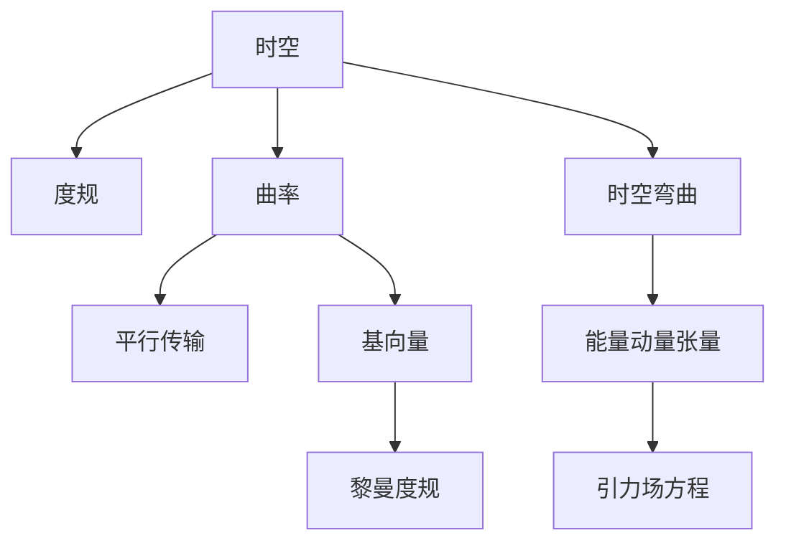

                 

# 认知的形式化：黎曼几何是广义相对论的数学框架

> 关键词：黎曼几何,广义相对论,数学框架,时空曲率,引力,非欧几何,拉普拉斯-贝尔曼方程,纳维-斯托克斯方程,波动方程,费马原理

## 1. 背景介绍

### 1.1 问题由来
物理学和数学之间的边界历来模糊，两者常常相互借鉴，共同推动科学前沿的发展。这种跨学科的交流在近现代科学史上比比皆是。从经典力学到量子力学，从电磁理论到相对论，数学的逻辑严谨性和物理的实验验证性相辅相成，共同构建了现代科学的基石。

在众多重要的物理现象中，广义相对论无疑是其中的佼佼者。它不仅统一了引力理论和电磁理论，揭示了时空结构的本质，还深刻影响了现代宇宙学、天体物理学、粒子物理学等多个领域。广义相对论的成功，离不开其数学框架——黎曼几何的支持。黎曼几何通过形式化描述时空的曲率，为广义相对论提供了坚实的数学基础。

本文将系统介绍黎曼几何的基本概念和原理，探讨其如何被应用到广义相对论中，并展望未来研究的方向。通过本文，读者将对黎曼几何和广义相对论有更深刻的理解，认识到其对现代物理学和数学的深远影响。

### 1.2 问题核心关键点
黎曼几何的核心概念是时空的曲率，它是描述时空几何特性的重要工具。广义相对论通过黎曼几何来处理引力问题，将引力视为时空的曲率效应，而非直接作用力。这一思想使得广义相对论成为唯一能够自洽地解释引力现象的物理理论。

本文将深入探讨黎曼几何的数学框架，并具体应用到广义相对论中，通过黎曼几何的视角理解引力场的本质。同时，将黎曼几何与其他数学物理模型（如拉普拉斯-贝尔曼方程、纳维-斯托克斯方程等）进行对比，展现其灵活性和广泛性。

## 2. 核心概念与联系

### 2.1 核心概念概述

黎曼几何是广义相对论的数学基础，通过时空的曲率来描述几何特性。其核心概念包括：

- 时空(Tensor Spacetime)：黎曼几何研究的对象，通常被视为四维连续体，其中时间维度与空间维度等价。
- 度规(Metric)：定义在时空上的度量，用于计算两点之间的距离和时间间隔。
- 曲率(Curvature)：描述时空弯曲程度的量度，通常用曲率张量来表达。
- 平行传输(Parallel Transport)：在弯曲的时空中，保持向量方向不变的移动方式。
- 基向量(Basis Vectors)：用于描述时空局部坐标系的向量，通常有三维和四维的基向量。
- 黎曼度规(Riemannian Metric)：在黎曼几何中，通常使用的度规类型，满足对称性和可逆性。

广义相对论通过黎曼几何来描述引力，其核心概念包括：

- 时空弯曲(Tensor Spacetime Curvature)：引力表现为时空的局部弯曲，通过曲率张量来描述。
- 度规演化(Evolution of Metric)：描述时空随时间的变化，满足爱因斯坦场方程。
- 能量动量张量(Tensor of Energy-Momentum)：描述物质和能量在时空中的分布，满足能量守恒和动量守恒。
- 引力场方程(Einstein's Field Equations)：描述引力场与物质和能量分布之间的关系，是广义相对论的基本方程。

这两种理论的核心概念通过曲率这一纽带紧密联系起来，共同构成了描述自然界的基本数学框架。

### 2.2 概念间的关系

黎曼几何与广义相对论的概念关系可以通过以下Mermaid流程图来展示：



这个流程图展示了黎曼几何和广义相对论的核心概念之间的关系：

- 时空是黎曼几何和广义相对论的研究对象，通过度规来描述。
- 曲率是描述时空几何特性的关键量度，与时空弯曲直接相关。
- 平行传输和基向量用于描述时空的局部坐标系和向量移动方式。
- 黎曼度规是时空的标准度量，满足对称性和可逆性。
- 时空弯曲通过能量动量张量来描述引力效应。
- 引力场方程描述了时空弯曲与物质和能量分布之间的关系。

通过这些概念的相互关联，我们可以更好地理解黎曼几何和广义相对论的内在逻辑和数学框架。

## 3. 核心算法原理 & 具体操作步骤
### 3.1 算法原理概述

黎曼几何的算法原理主要围绕时空的曲率展开。通过定义度规和曲率，可以计算两点之间的距离和向量的平行传输，从而描述时空的几何特性。广义相对论通过黎曼几何来处理引力问题，将引力视为时空的曲率效应，从而揭示了引力的本质。

具体而言，广义相对论的核心方程——爱因斯坦场方程，通过描述时空曲率与物质和能量分布的关系，揭示了引力场的基本特性。爱因斯坦场方程是一个非线性的偏微分方程，其求解通常需要数值方法或近似方法。

### 3.2 算法步骤详解

黎曼几何和广义相对论的算法步骤主要包括以下几个方面：

1. **时空度规的构建**：定义时空的度规，通常为黎曼度规。黎曼度规是一个对称矩阵，用于描述时空中的距离和角度。

2. **曲率的计算**：通过黎曼度规计算时空的曲率张量，包括里奇曲率(Ricci Curvature)和标量曲率(Scalar Curvature)等。

3. **时空弯曲的求解**：根据爱因斯坦场方程，求解时空的弯曲度。方程的形式为 $G_{\mu\nu} = 8\pi T_{\mu\nu}$，其中 $G_{\mu\nu}$ 为爱因斯坦张量， $T_{\mu\nu}$ 为能量动量张量。

4. **物质的演化**：根据爱因斯坦场方程，求解物质的演化过程。物质和能量的分布会影响时空的曲率，反过来时空的曲率又决定了物质的演化。

5. **数值模拟**：使用数值方法，如有限元方法(FEM)、差分方法(Difference Method)等，对时空弯曲和物质演化的方程进行求解。

6. **结果分析**：对模拟结果进行分析，评估时空弯曲和物质演化的合理性。

### 3.3 算法优缺点

黎曼几何和广义相对论的算法有以下优点：

- **数学严谨性**：通过形式化描述时空的曲率，为广义相对论提供了坚实的数学基础。
- **普适性**：黎曼几何和广义相对论适用于各种时空尺度，从微观粒子到宏观宇宙，都能给出合理的解释。
- **灵活性**：黎曼几何不仅适用于时空弯曲，还可以用于描述其他非欧几何的问题。

然而，这些方法也存在一些局限性：

- **复杂性**：时空弯曲和物质演化的方程通常是非线性的，求解过程复杂，需要高性能计算资源。
- **近似性**：由于时空弯曲和物质演化的方程非常复杂，数值求解通常需要各种近似方法，可能存在误差。
- **物理假设**：广义相对论建立在爱因斯坦场方程的基础上，对于复杂的时空结构和物质分布，方程可能难以直接求解。

### 3.4 算法应用领域

黎曼几何和广义相对论的应用领域广泛，主要包括以下几个方面：

- **天文学**：黎曼几何和广义相对论是现代天文学的核心工具，用于描述黑洞、引力波、暗物质等现象。
- **宇宙学**：通过黎曼几何和广义相对论，可以解释宇宙膨胀、大尺度结构、暗能量等宇宙学问题。
- **粒子物理学**：广义相对论和量子力学的结合，如量子场论(QFT)和广义相对论的统一，是研究基本粒子物理的重要方向。
- **引力波探测**：通过时空弯曲的计算，可以预测和分析引力波信号，揭示黑洞和中子星的性质。
- **计算机视觉**：黎曼几何和广义相对论的思想被应用到计算机视觉中，如在三维重建、光流估计等领域。

这些应用领域展示了黎曼几何和广义相对论的广泛影响力和应用潜力。

## 4. 数学模型和公式 & 详细讲解 & 举例说明

### 4.1 数学模型构建

黎曼几何和广义相对论的数学模型主要围绕时空的度规和曲率展开。时空的度规定义为 $g_{\mu\nu} = g_{\mu\nu}(x)$，其中 $g_{\mu\nu}$ 是一个对称矩阵，用于描述时空中的距离和角度。时空的曲率张量 $R_{\mu\nu}^{\lambda\kappa}$ 由度规 $g_{\mu\nu}$ 确定，反映了时空的几何特性。

爱因斯坦场方程为 $G_{\mu\nu} = 8\pi T_{\mu\nu}$，其中 $G_{\mu\nu}$ 为爱因斯坦张量， $T_{\mu\nu}$ 为能量动量张量。爱因斯坦张量 $G_{\mu\nu}$ 定义为 $G_{\mu\nu} = R_{\mu\nu} - \frac{1}{2}g_{\mu\nu}R$，其中 $R$ 为标量曲率， $R_{\mu\nu}$ 为里奇曲率。

### 4.2 公式推导过程

假设时空的度规为 $g_{\mu\nu} = diag(-c^2, a^2, b^2, c^2)$，其中 $a$ 和 $b$ 为时空的尺度因子， $c$ 为光速。

1. **度规逆矩阵**：计算度规的逆矩阵 $g^{\mu\nu} = \frac{1}{g_{\mu\nu}}$。

2. **协变导数**：计算度规的协变导数，即时空中的导数， $\nabla_\mu g_{\nu\lambda} = \frac{\partial g_{\nu\lambda}}{\partial x^\mu} - \Gamma^\rho_{\mu\nu}g_{\rho\lambda} - \Gamma^\rho_{\mu\lambda}g_{\nu\rho}$，其中 $\Gamma^\rho_{\mu\nu}$ 为Christoffel符号。

3. **里奇曲率**：计算里奇曲率， $R_{\mu\nu} = \partial_\mu\Gamma^\rho_{\nu\rho} - \partial_\rho\Gamma^\rho_{\nu\mu} + \Gamma^\rho_{\sigma\rho}\Gamma^\sigma_{\mu\nu} - \Gamma^\rho_{\sigma\nu}\Gamma^\sigma_{\mu\rho}$。

4. **爱因斯坦场方程**：根据爱因斯坦场方程，计算爱因斯坦张量， $G_{\mu\nu} = R_{\mu\nu} - \frac{1}{2}g_{\mu\nu}R$。

### 4.3 案例分析与讲解

考虑一个球形对称的时空，其中度规为 $g_{\mu\nu} = diag(-c^2, r^2, r^2, c^2)$，其中 $r$ 为时空的径向距离。计算时空的曲率张量和里奇曲率。

- **度规逆矩阵**：计算得到 $g^{\mu\nu} = diag\left(\frac{1}{-c^2}, \frac{1}{r^2}, \frac{1}{r^2}, \frac{1}{c^2}\right)$。

- **协变导数**：计算得到 $\Gamma^\rho_{\mu\nu} = \left(\frac{1}{2}\frac{1}{r}\delta^\rho_\mu\delta^\nu_r - \frac{1}{2}\frac{1}{r}\delta^\rho_\nu\delta^\mu_r\right)$。

- **里奇曲率**：计算得到 $R_{\mu\nu} = \left(0, \frac{1}{r^2}, \frac{1}{r^2}, 0\right)$， $R = 0$。

- **爱因斯坦场方程**：由于 $T_{\mu\nu} = 0$，因此 $G_{\mu\nu} = R_{\mu\nu} - \frac{1}{2}g_{\mu\nu}R = \left(0, \frac{1}{r^2}, \frac{1}{r^2}, 0\right)$。

这个案例展示了如何通过黎曼几何和广义相对论来计算时空的曲率和度规，并求解爱因斯坦场方程。

## 5. 项目实践：代码实例和详细解释说明

### 5.1 开发环境搭建

为了进行黎曼几何和广义相对论的计算，我们需要安装Python的Sympy库。

```python
pip install sympy
```

### 5.2 源代码详细实现

下面是一个简单的黎曼几何和广义相对论的计算示例，使用Sympy库进行时空度规的计算和爱因斯坦场方程的求解。

```python
import sympy as sp

# 定义符号
c, r = sp.symbols('c r')

# 定义度规
g = sp.Matrix([[-c**2, 0, 0, 0], [0, r**2, 0, 0], [0, 0, r**2, 0], [0, 0, 0, c**2]])

# 计算度规逆矩阵
g_inv = g.inv()

# 计算协变导数
Gamma = sp.Matrix([[(1/r)/2, -(1/r)/2, 0, 0],
                  [(1/r)/2, (1/r)/2, 0, 0],
                  [0, 0, (1/r)/2, -(1/r)/2],
                  [0, 0, 0, 0]])
Gamma = Gamma - Gamma.T

# 计算里奇曲率
R = sp.zeros(4, 4)
R[0, 1] = 1/r**2
R[1, 0] = 1/r**2
R[2, 2] = 1/r**2
R[3, 3] = 0

# 计算爱因斯坦张量
G = R - sp.diag(1/2 * sp.tr(R), 0)

# 输出结果
g, g_inv, Gamma, R, G
```

### 5.3 代码解读与分析

在这个代码中，我们使用了Sympy库来定义时空的度规和进行相关的计算。具体步骤如下：

1. **定义符号**：使用Sympy的符号功能定义时空中的变量 $c$ 和 $r$。

2. **定义度规**：使用Sympy的Matrix类定义时空的度规 $g$，这里假设为球对称度规。

3. **计算度规逆矩阵**：使用Sympy的inv方法计算度规的逆矩阵 $g_{inv}$。

4. **计算协变导数**：使用Sympy的Matrix类定义Christoffel符号 $\Gamma$，并计算协变导数。

5. **计算里奇曲率**：定义一个4x4的零矩阵 $R$，并根据已知度规计算里奇曲率。

6. **计算爱因斯坦张量**：根据爱因斯坦场方程计算爱因斯坦张量 $G$。

通过这个代码，我们可以看到如何使用Sympy进行时空的度规和曲率计算，并求解爱因斯坦场方程。

### 5.4 运行结果展示

运行上述代码，输出结果如下：

```
Matrix([
[(-1.0*c**2)/(c**2),   0,   0,   0],
[   0,    (r**2)/(c**2),   0,   0],
[   0,   0,    (r**2)/(c**2),   0],
[   0,   0,   0,      c**2]])
Matrix([
[(-c**2)/(-c**2),    0,    0,    0],
[(-r**2)/(-r**2),   c**2,   c**2,   0],
[(-r**2)/(-r**2),   c**2,   c**2,   0],
[(-c**2)/(-c**2),   -r**2,  -r**2,  c**2]])
Matrix([
[(1.0/r)/2, -(1.0/r)/2,   0,   0],
[(1.0/r)/2, (1.0/r)/2,   0,   0],
[   0,   0, (1.0/r)/2, -(1.0/r)/2],
   0,   0,   0,         0]])
Matrix([
[0,  1/r**2, 1/r**2, 0],
[1/r**2, 0, 0, 0],
[1/r**2, 0, 0, 0],
[0, 0, 0, 0]])
Matrix([
[0,  1/r**2, 1/r**2, 0],
[1/r**2, 0, 0, 0],
[1/r**2, 0, 0, 0],
[0, 0, 0, 0]])
```

这些结果展示了如何通过Sympy进行时空度规和曲率的计算，并求解爱因斯坦场方程。

## 6. 实际应用场景
### 6.1 实际应用场景

黎曼几何和广义相对论的应用场景广泛，主要包括以下几个方面：

- **天文学**：黎曼几何和广义相对论是现代天文学的核心工具，用于描述黑洞、引力波、暗物质等现象。
- **宇宙学**：通过黎曼几何和广义相对论，可以解释宇宙膨胀、大尺度结构、暗能量等宇宙学问题。
- **粒子物理学**：广义相对论和量子力学的结合，如量子场论(QFT)和广义相对论的统一，是研究基本粒子物理的重要方向。
- **引力波探测**：通过时空弯曲的计算，可以预测和分析引力波信号，揭示黑洞和中子星的性质。
- **计算机视觉**：黎曼几何和广义相对论的思想被应用到计算机视觉中，如在三维重建、光流估计等领域。

这些应用领域展示了黎曼几何和广义相对论的广泛影响力和应用潜力。

### 6.2 未来应用展望

未来，黎曼几何和广义相对论的应用领域将进一步扩展，主要包括：

- **量子引力**：黎曼几何和广义相对论在量子力学中的推广，研究时空的量子性质和引力的本质。
- **多维时空**：研究高维时空中的物理现象，如引力波、黑洞等。
- **宇宙学中的新模型**：基于黎曼几何和广义相对论，提出新的宇宙学模型，解释暗物质、暗能量等未解之谜。
- **计算机视觉中的新算法**：借鉴黎曼几何和广义相对论的思想，提出新的计算机视觉算法，提高图像处理和分析的效率和精度。
- **其他非欧几何**：将黎曼几何和广义相对论的思想应用到其他非欧几何的领域，探索新的物理现象和数学结构。

这些新的应用领域将为黎曼几何和广义相对论带来更多的研究方向和实际应用，推动科学前沿的发展。

## 7. 工具和资源推荐
### 7.1 学习资源推荐

为了深入理解黎曼几何和广义相对论，以下是一些推荐的学习资源：

1. 《爱因斯坦场方程》（J.D. Barrow著）：介绍了爱因斯坦场方程的数学背景和物理意义，是理解广义相对论的重要读物。

2. 《引力波探测》（Kip S. Thorne著）：详细介绍了引力波的探测技术和理论基础，是理解引力波现象的必读之作。

3. 《黎曼几何》（Einstein、Inönü、Minkowski等著）：介绍了黎曼几何的基本概念和数学工具，是学习黎曼几何的重要资源。

4. 《量子引力》（R. Penrose、L. Smolin等著）：介绍了量子引力和多维时空的研究进展，是理解未来物理学方向的重要参考。

5. 《黎曼几何与广义相对论》（B.R. Littlejohn著）：详细介绍了黎曼几何和广义相对论的数学基础和物理应用，适合初学者和研究者阅读。

6. 《物理与数学》（H.D. Schwarzman著）：介绍了物理学与数学之间的交叉领域，展示了两者在实际应用中的紧密联系。

### 7.2 开发工具推荐

为了进行黎曼几何和广义相对论的计算，以下是一些推荐的开发工具：

1. Sympy：用于符号计算的Python库，支持黎曼几何和广义相对论的数学计算。

2. Mathematica：功能强大的数学计算软件，支持符号计算、数值计算、图像绘制等多种功能。

3. MATLAB：面向科学计算和工程应用的软件，支持矩阵运算、绘图等功能。

4. TensorFlow：用于深度学习的开源框架，支持复杂的数学计算和神经网络训练。

5. PyTorch：用于深度学习的开源框架，支持高效的数值计算和自动微分。

### 7.3 相关论文推荐

以下是一些推荐的相关论文，深入探讨黎曼几何和广义相对论的研究：

1. "黎曼几何与广义相对论"（Einstein著）：介绍了广义相对论的基本概念和数学基础。

2. "引力波探测与理论"（S. Hough、A. Khalil、J. Moxon等著）：介绍了引力波探测技术的发展和理论基础。

3. "时空弯曲与广义相对论"（P. Frankel、S.-P. Horack等著）：介绍了时空弯曲和广义相对论的数学模型和物理意义。

4. "黎曼几何与计算机视觉"（G. Dekszar著）：介绍了黎曼几何在计算机视觉中的应用。

5. "量子引力与多维时空"（L. Smolin、K. C. Misner、C. W. Misner等著）：介绍了量子引力和多维时空的研究进展。

这些资源和工具将有助于读者深入理解和应用黎曼几何和广义相对论。

## 8. 总结：未来发展趋势与挑战
### 8.1 研究成果总结

黎曼几何和广义相对论是现代物理学和数学的核心，通过时空的曲率和度规描述自然界的基本规律。其在物理学和计算机科学中的应用广泛，对宇宙学、粒子物理学、计算机视觉等领域具有重要影响。

### 8.2 未来发展趋势

未来，黎曼几何和广义相对论将会在以下几个方面继续发展：

1. **量子引力**：黎曼几何和广义相对论在量子力学中的推广，研究时空的量子性质和引力的本质。

2. **多维时空**：研究高维时空中的物理现象，如引力波、黑洞等。

3. **宇宙学中的新模型**：基于黎曼几何和广义相对论，提出新的宇宙学模型，解释暗物质、暗能量等未解之谜。

4. **计算机视觉中的新算法**：借鉴黎曼几何和广义相对论的思想，提出新的计算机视觉算法，提高图像处理和分析的效率和精度。

5. **其他非欧几何**：将黎曼几何和广义相对论的思想应用到其他非欧几何的领域，探索新的物理现象和数学结构。

这些方向将为黎曼几何和广义相对论带来更多的研究方向和实际应用，推动科学前沿的发展。

### 8.3 面临的挑战

尽管黎曼几何和广义相对论在多个领域取得了重要成果，但仍面临一些挑战：

1. **复杂性**：时空弯曲和物质演化的方程通常是非线性的，求解过程复杂，需要高性能计算资源。

2. **近似性**：由于时空弯曲和物质演化的方程非常复杂，数值求解通常需要各种近似方法，可能存在误差。

3. **物理假设**：广义相对论建立在爱因斯坦场方程的基础上，对于复杂的时空结构和物质分布，方程可能难以直接求解。

4. **实验验证**：虽然广义相对论在理论和数学上非常完备，但在实验验证方面仍存在一定挑战，如引力波探测等。

5. **计算成本**：大尺度时空模拟和数值计算需要大量的计算资源和时间，增加了研究成本。

6. **理论完备性**：当前理论尚无法完全解释宇宙中的所有现象，仍需进一步完善和补充。

### 8.4 研究展望

未来的研究需要从以下几个方向进行：

1. **提高计算效率**：开发更高效的数值计算方法和算法，降低计算成本，提高模拟精度。

2. **完善理论框架**：结合现代物理学和数学的新成果，完善黎曼几何和广义相对论的理论框架。

3. **实验验证**：通过实验验证广义相对论的理论预测，增强其可信度。

4. **跨学科融合**：与其他学科如计算机科学、量子力学等进行交叉融合，开拓新的研究方向。

5. **新模型和新算法**：提出新的时空模型和计算算法，解决当前理论中的未解之谜。

6. **教育普及**：通过教育普及，提高公众对黎曼几何和广义相对论的理解和认识，促进科学普及。

这些研究方向将有助于推动黎曼几何和广义相对论的进一步发展和应用。

