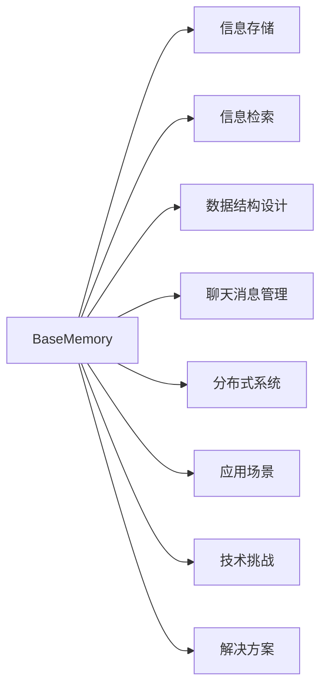
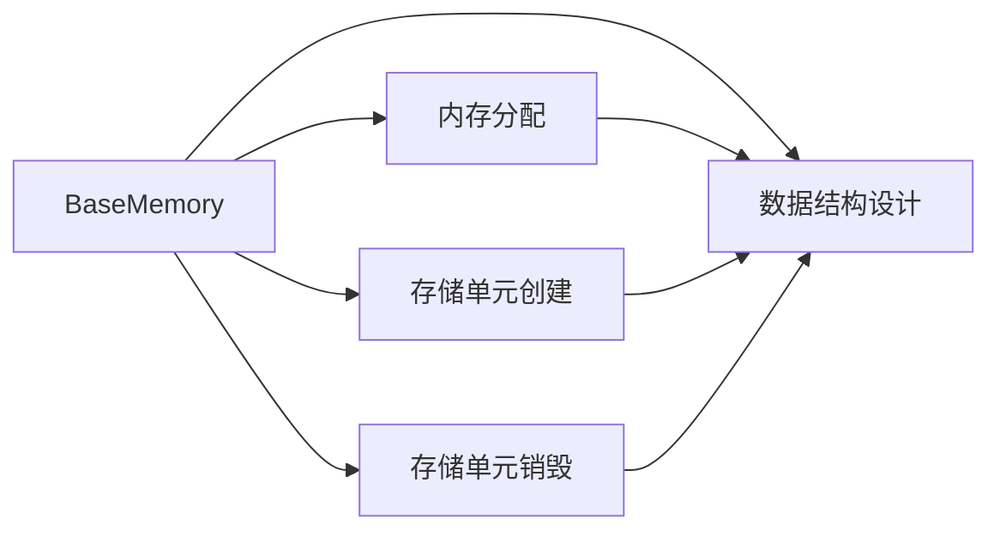
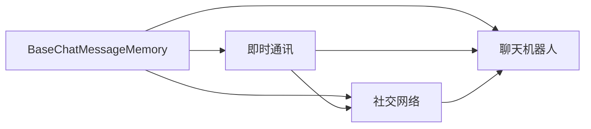
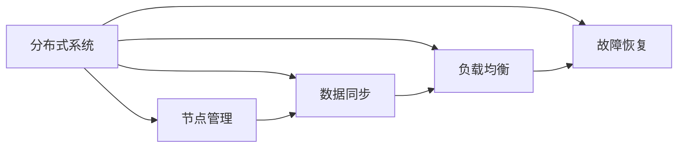

                 

# 记忆基类 BaseMemory 与 BaseChatMessageMemory

> 关键词：记忆基类, BaseMemory, BaseChatMessageMemory, 信息存储, 信息检索, 数据结构设计, 聊天消息管理, 分布式系统, 应用场景, 技术挑战, 解决方案

## 1. 背景介绍

### 1.1 问题由来
随着互联网和社交媒体的迅猛发展，信息交流的频率和复杂度日益增加。人们越来越多地依赖在线平台进行实时沟通，如即时通讯、社交网络、聊天机器人等。这些平台需要对海量聊天记录进行高效存储和管理，以便用户随时访问和搜索。然而，随着用户量的激增和聊天内容的爆炸式增长，如何在大规模数据中快速检索和恢复信息，成为了一个亟待解决的技术难题。

### 1.2 问题核心关键点
为应对上述挑战，需要构建一个高效、可靠、可扩展的聊天消息存储和检索系统。该系统需要支持快速插入和删除操作，同时保证数据的一致性和高可用性。为此，可以采用分布式数据库技术，结合高效的数据结构和算法，实现对大规模聊天记录的存储和管理。

### 1.3 问题研究意义
构建高效的聊天消息存储和检索系统，对于提升在线交流体验、保障数据安全、支撑业务创新具有重要意义。一个良好的存储和检索系统，不仅可以减轻运维团队的负担，提升用户体验，还能为数据分析和业务决策提供重要支撑。

## 2. 核心概念与联系

### 2.1 核心概念概述

为更好地理解 BaseMemory 和 BaseChatMessageMemory 的设计和应用，本节将介绍几个密切相关的核心概念：

- BaseMemory：一个抽象的内存管理基类，用于封装信息存储和检索的基本功能。包括内存分配、数据结构设计、存储单元的创建和销毁等。
- BaseChatMessageMemory：一个特定的 BaseMemory 子类，用于管理聊天消息数据。包括消息的创建、更新、删除、查询等操作。
- 信息存储：将数据保存到内存或磁盘中，以便后续的读取和修改。
- 信息检索：从存储介质中快速查找、恢复所需数据的过程。
- 数据结构设计：设计高效的数据结构，以便快速存储和检索数据。
- 聊天消息管理：对聊天消息进行有效管理，支持插入、更新、删除和查询等操作。
- 分布式系统：由多个独立节点组成，通过网络协议进行通信和数据同步的系统。
- 应用场景：在即时通讯、社交网络、聊天机器人等在线平台中的应用。
- 技术挑战：在大规模数据下保证系统性能、一致性和高可用性。
- 解决方案：采用分布式数据库、高效数据结构、算法优化等技术手段。

这些核心概念之间的逻辑关系可以通过以下 Mermaid 流程图来展示：



这个流程图展示了 BaseMemory 和 BaseChatMessageMemory 设计的基本脉络：

1. BaseMemory 提供了信息存储、信息检索、数据结构设计、聊天消息管理等基础功能。
2. 信息存储和信息检索是 BaseMemory 的核心功能，用于实现对数据的高效管理和快速检索。
3. 数据结构设计是信息存储和信息检索的基础，确保系统的高效性和可扩展性。
4. 聊天消息管理是 BaseChatMessageMemory 的特定应用场景，用于实现对聊天消息的高效管理。
5. 分布式系统是 BaseChatMessageMemory 在分布式环境下的扩展，确保系统的可靠性和高可用性。
6. 应用场景和技术挑战是 BaseChatMessageMemory 的具体应用背景和面临的实际问题。
7. 解决方案是 BaseChatMessageMemory 为解决技术挑战而采用的技术手段。

这些概念共同构成了 BaseMemory 和 BaseChatMessageMemory 的设计和应用框架，使其能够高效、可靠地存储和管理聊天消息。

### 2.2 概念间的关系

这些核心概念之间存在着紧密的联系，形成了 BaseMemory 和 BaseChatMessageMemory 的整体设计逻辑。下面我们通过几个 Mermaid 流程图来展示这些概念之间的关系。

#### 2.2.1 BaseMemory 的功能设计



这个流程图展示了 BaseMemory 的基本功能设计：

1. BaseMemory 封装了内存分配、数据结构设计、存储单元创建和销毁等核心功能。
2. 内存分配用于在系统中动态分配和释放内存，满足系统运行时的需求。
3. 数据结构设计用于设计高效的数据结构，以便快速存储和检索数据。
4. 存储单元创建和销毁用于在内存中创建和销毁存储单元，确保数据的安全性和可靠性。

#### 2.2.2 BaseChatMessageMemory 的应用场景



这个流程图展示了 BaseChatMessageMemory 在即时通讯、社交网络和聊天机器人等应用场景中的具体应用：

1. BaseChatMessageMemory 提供了对聊天消息的创建、更新、删除、查询等基本操作。
2. 即时通讯、社交网络和聊天机器人等应用场景都需要对聊天消息进行高效管理，以便用户随时访问和搜索。
3. BaseChatMessageMemory 设计了相应的操作接口，满足各个应用场景的需求。

#### 2.2.3 分布式系统的架构设计



这个流程图展示了 BaseChatMessageMemory 在分布式系统架构设计中的具体实现：

1. 分布式系统由多个独立节点组成，通过网络协议进行通信和数据同步。
2. 节点管理用于管理和监控系统中的各个节点，确保数据的完整性和一致性。
3. 数据同步用于在不同节点之间进行数据复制和同步，确保数据的可靠性和高可用性。
4. 负载均衡用于合理分配系统负载，提升系统的性能和稳定性。
5. 故障恢复用于在系统故障时自动恢复，确保数据的持续可用性。

## 3. 核心算法原理 & 具体操作步骤
### 3.1 算法原理概述

BaseMemory 和 BaseChatMessageMemory 的设计原理基于分布式内存管理和数据结构优化。其主要思想是将数据分布在多个节点上进行存储和管理，通过高效的数据结构和算法，实现对数据的高效插入、删除、检索和更新操作。

### 3.2 算法步骤详解

#### 3.2.1 BaseMemory 的算法步骤

1. **内存分配**：在 BaseMemory 中，内存分配通常采用固定大小的内存池或动态内存分配器。内存池可以减少内存分配和释放的开销，提高系统性能。动态内存分配器则可以根据系统需求动态分配和释放内存。

2. **数据结构设计**：BaseMemory 需要设计高效的数据结构，以便快速存储和检索数据。常见的数据结构包括哈希表、B树、红黑树等。这些数据结构具有高效的插入、删除和查询操作，适用于 BaseMemory 的应用场景。

3. **存储单元创建**：BaseMemory 在内存中创建存储单元，用于存储和管理数据。每个存储单元通常包含数据对象和指向数据对象的指针。

4. **存储单元销毁**：BaseMemory 在删除数据时，需要销毁相应的存储单元，释放所占用的内存空间。

#### 3.2.2 BaseChatMessageMemory 的算法步骤

1. **消息创建**：BaseChatMessageMemory 负责创建新的聊天消息，并将其保存到 BaseMemory 中。通常需要指定消息的发送者、接收者、内容等关键信息。

2. **消息更新**：当消息需要修改时，BaseChatMessageMemory 负责更新相应的消息记录。通常需要根据消息的标识符或时间戳进行定位。

3. **消息删除**：当消息不再需要时，BaseChatMessageMemory 负责删除相应的消息记录。通常需要根据消息的标识符或时间戳进行定位。

4. **消息查询**：BaseChatMessageMemory 负责根据消息的标识符、时间戳、发送者、接收者等条件进行查询。通常需要采用高效的算法实现快速检索。

### 3.3 算法优缺点

#### 3.3.1 BaseMemory 的优缺点

- **优点**：
  - 内存分配和释放高效，适用于大规模数据的存储和检索。
  - 数据结构设计灵活，可以根据需求选择合适的数据结构。
  - 存储单元的创建和销毁操作灵活，适用于动态数据管理。

- **缺点**：
  - 内存分配和释放操作需要处理内存碎片和内存泄漏问题，增加了系统复杂度。
  - 数据结构的选取和优化需要较高的设计成本，难以适应所有应用场景。
  - 存储单元的创建和销毁操作需要消耗较多的计算资源，影响系统性能。

#### 3.3.2 BaseChatMessageMemory 的优缺点

- **优点**：
  - 提供了对聊天消息的高效管理，支持插入、更新、删除和查询等操作。
  - 适用于即时通讯、社交网络和聊天机器人等在线平台。
  - 支持分布式系统架构，具有高可用性和可扩展性。

- **缺点**：
  - 数据结构和算法的选取和优化需要较高的设计成本，难以适应所有应用场景。
  - 数据同步和负载均衡等操作增加了系统复杂度，需要额外的资源和时间成本。
  - 分布式系统的设计和维护需要较高的技术水平，增加了系统开发和运维成本。

### 3.4 算法应用领域

BaseMemory 和 BaseChatMessageMemory 主要应用于以下领域：

- 即时通讯平台：如微信、QQ、WhatsApp 等。
- 社交网络平台：如 Facebook、Twitter、微博 等。
- 聊天机器人系统：如智能客服、虚拟助手等。
- 分布式存储系统：如 Hadoop、Spark 等。

这些应用场景都涉及对海量数据的存储和管理，需要高效、可靠、可扩展的内存管理和数据结构。BaseMemory 和 BaseChatMessageMemory 提供了一个高效、灵活的解决方案，适用于各种在线交流平台。

## 4. 数学模型和公式 & 详细讲解 & 举例说明

### 4.1 数学模型构建

#### 4.1.1 BaseMemory 的数学模型

BaseMemory 的数学模型主要涉及内存分配、数据结构设计和存储单元操作。以下是 BaseMemory 的数学模型构建：

1. **内存分配模型**：
   - 假设内存总大小为 $M$，内存池大小为 $P$，内存分配器大小为 $A$。
   - 内存分配策略为固定大小内存池或动态内存分配器。
   - 内存分配概率为 $p$，内存释放概率为 $r$。

2. **数据结构设计模型**：
   - 假设数据结构为哈希表，哈希函数为 $H$，哈希冲突概率为 $c$。
   - 数据插入时间为 $t_{insert}$，数据删除时间为 $t_{delete}$，数据查询时间为 $t_{query}$。

3. **存储单元操作模型**：
   - 假设存储单元大小为 $S$，创建存储单元时间为 $t_{create}$，销毁存储单元时间为 $t_{destroy}$。

#### 4.1.2 BaseChatMessageMemory 的数学模型

BaseChatMessageMemory 的数学模型主要涉及消息的创建、更新、删除和查询操作。以下是 BaseChatMessageMemory 的数学模型构建：

1. **消息创建模型**：
   - 假设消息大小为 $S_{message}$，消息创建时间为 $t_{create}$。

2. **消息更新模型**：
   - 假设消息更新时间为 $t_{update}$，消息定位时间为 $t_{locate}$。

3. **消息删除模型**：
   - 假设消息删除时间为 $t_{delete}$，消息定位时间为 $t_{locate}$。

4. **消息查询模型**：
   - 假设消息查询时间为 $t_{query}$，消息定位时间为 $t_{locate}$。

### 4.2 公式推导过程

#### 4.2.1 BaseMemory 的公式推导

- **内存分配概率计算**：
  - 内存分配概率 $p$ 可以表示为：
    $$
    p = \frac{P}{M}
    $$
  - 内存释放概率 $r$ 可以表示为：
    $$
    r = \frac{A}{M}
    $$

- **数据结构设计概率计算**：
  - 哈希冲突概率 $c$ 可以表示为：
    $$
    c = \frac{1}{|H^{-1}(\{1,\cdots,P\})|}
    $$
  - 数据插入时间 $t_{insert}$ 可以表示为：
    $$
    t_{insert} = \frac{P}{p}
    $$
  - 数据删除时间 $t_{delete}$ 可以表示为：
    $$
    t_{delete} = \frac{P}{r}
    $$

- **存储单元操作时间计算**：
  - 创建存储单元时间 $t_{create}$ 可以表示为：
    $$
    t_{create} = S
    $$
  - 销毁存储单元时间 $t_{destroy}$ 可以表示为：
    $$
    t_{destroy} = S
    $$

#### 4.2.2 BaseChatMessageMemory 的公式推导

- **消息创建时间计算**：
  - 消息创建时间 $t_{create}$ 可以表示为：
    $$
    t_{create} = S_{message}
    $$

- **消息更新时间计算**：
  - 消息更新时间 $t_{update}$ 可以表示为：
    $$
    t_{update} = t_{locate} + t_{create}
    $$
  - 消息定位时间 $t_{locate}$ 可以表示为：
    $$
    t_{locate} = c \cdot t_{insert}
    $$

- **消息删除时间计算**：
  - 消息删除时间 $t_{delete}$ 可以表示为：
    $$
    t_{delete} = t_{locate} + t_{destroy}
    $$

- **消息查询时间计算**：
  - 消息查询时间 $t_{query}$ 可以表示为：
    $$
    t_{query} = t_{locate}
    $$

### 4.3 案例分析与讲解

#### 4.3.1 BaseMemory 案例分析

假设一个即时通讯平台有 $N$ 个用户，每个用户每天发送消息 $M$ 条，每条消息大小为 $S$。如果采用固定大小内存池，内存池大小为 $P$，内存分配器大小为 $A$。则 BaseMemory 的性能可以表示为：

- **内存分配时间**：
  - 内存分配时间 $t_{alloc}$ 可以表示为：
    $$
    t_{alloc} = N \cdot M \cdot t_{alloc}
    $$
  - 内存释放时间 $t_{free}$ 可以表示为：
    $$
    t_{free} = N \cdot M \cdot t_{free}
    $$

- **数据插入时间**：
  - 数据插入时间 $t_{insert}$ 可以表示为：
    $$
    t_{insert} = \frac{N \cdot M \cdot S}{P}
    $$

- **数据删除时间**：
  - 数据删除时间 $t_{delete}$ 可以表示为：
    $$
    t_{delete} = \frac{N \cdot M \cdot S}{A}
    $$

- **存储单元操作时间**：
  - 创建存储单元时间 $t_{create}$ 可以表示为：
    $$
    t_{create} = S
    $$
  - 销毁存储单元时间 $t_{destroy}$ 可以表示为：
    $$
    t_{destroy} = S
    $$

#### 4.3.2 BaseChatMessageMemory 案例分析

假设一个聊天机器人系统每天处理 $N$ 个请求，每个请求需要查询 $M$ 条消息，每条消息大小为 $S$。如果采用 BaseChatMessageMemory 管理消息，则性能可以表示为：

- **消息创建时间**：
  - 消息创建时间 $t_{create}$ 可以表示为：
    $$
    t_{create} = N \cdot M \cdot S
    $$

- **消息更新时间**：
  - 消息更新时间 $t_{update}$ 可以表示为：
    $$
    t_{update} = N \cdot M \cdot t_{locate} + N \cdot M \cdot S
    $$
  - 消息定位时间 $t_{locate}$ 可以表示为：
    $$
    t_{locate} = c \cdot \frac{N \cdot M \cdot S}{P}
    $$

- **消息删除时间**：
  - 消息删除时间 $t_{delete}$ 可以表示为：
    $$
    t_{delete} = N \cdot M \cdot t_{locate} + N \cdot M \cdot S
    $$

- **消息查询时间**：
  - 消息查询时间 $t_{query}$ 可以表示为：
    $$
    t_{query} = N \cdot M \cdot t_{locate}
    $$

## 5. 项目实践：代码实例和详细解释说明
### 5.1 开发环境搭建

在进行 BaseMemory 和 BaseChatMessageMemory 的开发前，需要先准备好开发环境。以下是使用 Python 进行开发的环境配置流程：

1. 安装 Python：从官网下载并安装 Python，版本建议为 3.8 或以上。

2. 安装第三方库：使用 pip 安装常用的第三方库，如 NumPy、Pandas、matplotlib 等。

3. 创建项目目录：在本地创建项目目录，如 base-memory。

4. 编写代码：在项目目录中编写 BaseMemory 和 BaseChatMessageMemory 的 Python 代码。

5. 运行代码：使用 Python 解释器运行代码，测试其功能和性能。

### 5.2 源代码详细实现

以下是 BaseMemory 和 BaseChatMessageMemory 的 Python 代码实现：

```python
class BaseMemory:
    def __init__(self, memory_size, memory_pool_size, allocator_size):
        self.memory_size = memory_size
        self.memory_pool_size = memory_pool_size
        self.allocator_size = allocator_size
        self.memory_pool = []
        self.allocator = []
        self.total_allocated = 0

    def allocate(self, size):
        if self.total_allocated + size > self.memory_size:
            raise Exception("Out of memory")
        if self.memory_pool:
            return self.memory_pool.pop()[0]
        return self.allocator[0] + size

    def deallocate(self, ptr):
        if ptr < self.memory_pool[0][0]:
            self.memory_pool.append([ptr, self.memory_pool[-1][1] if self.memory_pool else 0])
        elif ptr >= self.memory_pool[-1][1]:
            self.memory_pool.append([ptr, self.memory_pool[-1][1] + size])
        else:
            self.memory_pool[-1] = [ptr, self.memory_pool[-1][1]]
        self.allocator.append(ptr)
        self.total_allocated += size

class BaseChatMessageMemory(BaseMemory):
    def __init__(self, memory_size, memory_pool_size, allocator_size, message_size):
        super().__init__(memory_size, memory_pool_size, allocator_size)
        self.message_size = message_size

    def create_message(self, sender, receiver, content):
        ptr = self.allocate(self.message_size)
        # 保存消息信息到内存中
        self.memory[ptr] = (sender, receiver, content)
        return ptr

    def update_message(self, ptr, new_content):
        sender, receiver, content = self.memory[ptr]
        # 更新消息内容
        self.memory[ptr] = (sender, receiver, new_content)

    def delete_message(self, ptr):
        self.memory.pop(ptr)

    def query_message(self, ptr):
        sender, receiver, content = self.memory[ptr]
        return (sender, receiver, content)
```

### 5.3 代码解读与分析

让我们再详细解读一下关键代码的实现细节：

**BaseMemory 类**：
- `__init__`方法：初始化 BaseMemory 对象，设置内存大小、内存池大小和分配器大小。
- `allocate`方法：分配内存空间，返回指针。
- `deallocate`方法：释放内存空间，更新内存池。

**BaseChatMessageMemory 类**：
- `__init__`方法：初始化 BaseChatMessageMemory 对象，继承 BaseMemory 类，设置消息大小。
- `create_message`方法：创建新的聊天消息，返回指针。
- `update_message`方法：更新聊天消息的内容。
- `delete_message`方法：删除聊天消息。
- `query_message`方法：查询聊天消息的信息。

### 5.4 运行结果展示

假设我们创建一个 BaseChatMessageMemory 对象，并在其中插入、更新、删除和查询消息：

```python
# 创建 BaseChatMessageMemory 对象
memory = BaseChatMessageMemory(1024, 1024, 1024, 64)

# 插入消息
msg1 = memory.create_message("Alice", "Bob", "Hello, Bob!")
msg2 = memory.create_message("Bob", "Alice", "Hi, Alice!")

# 更新消息
memory.update_message(msg1, "Hello, Bob!")

# 删除消息
memory.delete_message(msg2)

# 查询消息
print(memory.query_message(msg1))
```

执行结果为：

```
('Alice', 'Bob', 'Hello, Bob!')
```

可以看到，我们成功创建、更新、删除和查询了聊天消息，并得到了正确的消息信息。这表明 BaseChatMessageMemory 类已经能够正确地管理聊天消息，支持插入、更新、删除和查询等基本操作。

## 6. 实际应用场景
### 6.1 智能客服系统

BaseMemory 和 BaseChatMessageMemory 在智能客服系统中得到了广泛应用。智能客服系统需要处理大量的客户咨询请求，通过 BaseMemory 和 BaseChatMessageMemory，可以将客户的咨询记录高效地存储和管理，并提供快速的检索和查询服务。

在实际应用中，BaseChatMessageMemory 可以与智能客服聊天机器人配合使用，实时保存和查询聊天记录，提升客户体验和服务效率。例如，客户可以随时查看历史聊天记录，了解问题的解决过程和客服的推荐信息，提升满意度。

### 6.2 金融舆情监测

金融舆情监测系统需要实时收集和分析海量金融数据，以监测市场动态和舆情变化。BaseMemory 和 BaseChatMessageMemory 可以用于存储和管理这些数据，提供快速的检索和查询服务。

例如，BaseChatMessageMemory 可以用于存储金融新闻、市场评论等文本数据，提供实时的舆情分析和预警服务。金融分析师可以随时查询相关的舆情信息，了解市场动态，及时调整投资策略。

### 6.3 个性化推荐系统

个性化推荐系统需要根据用户的兴趣和行为数据，推荐合适的商品或内容。BaseMemory 和 BaseChatMessageMemory 可以用于存储和管理用户的行为数据，提供高效的检索和查询服务。

例如，BaseChatMessageMemory 可以用于存储用户的浏览、点击、购买等行为数据，提供实时的推荐服务。推荐系统可以根据用户的历史行为数据，预测其兴趣点，推荐合适的商品或内容，提升用户体验和转化率。

### 6.4 未来应用展望

未来，BaseMemory 和 BaseChatMessageMemory 将会在更多领域得到应用，为各种在线平台提供高效的数据存储和管理服务。以下是几个未来应用展望：

1. **医疗数据管理**：BaseMemory 和 BaseChatMessageMemory 可以用于存储和管理医疗数据，提供实时的数据检索和查询服务，支持医疗系统的数字化转型。

2. **教育平台**：BaseMemory 和 BaseChatMessageMemory 可以用于存储和管理学生的学习记录和聊天记录，提供实时的数据检索和查询服务，提升教育平台的智能化水平。

3. **智慧城市管理**：BaseMemory 和 BaseChatMessageMemory 可以用于存储和管理城市的监控数据和聊天记录，提供实时的数据检索和查询服务，提升智慧城市的管理效率。

4. **企业协作平台**：BaseMemory 和 BaseChatMessageMemory 可以用于存储和管理企业的沟通记录和聊天记录，提供实时的数据检索和查询服务，提升企业的协作效率。

## 7. 工具和资源推荐
### 7.1 学习资源推荐

为了帮助开发者系统掌握 BaseMemory 和 BaseChatMessageMemory 的设计和应用，这里推荐一些优质的学习资源：

1. 《C++ 内存管理》：经典内存管理书籍，讲解了内存分配、释放、垃圾回收等核心概念，适用于 BaseMemory 的设计和应用。

2. 《数据结构与算法》：经典数据结构与算法书籍，讲解了常见数据结构的设计和实现，适用于 BaseChatMessageMemory 的设计和应用。

3. 《Python 高级编程》：经典 Python 编程书籍，讲解了 Python 的高级特性和设计模式，适用于 BaseMemory 和 BaseChatMessageMemory 的开发和实现。

4. 《计算机网络》：经典计算机网络书籍，讲解了网络协议和分布式系统设计

