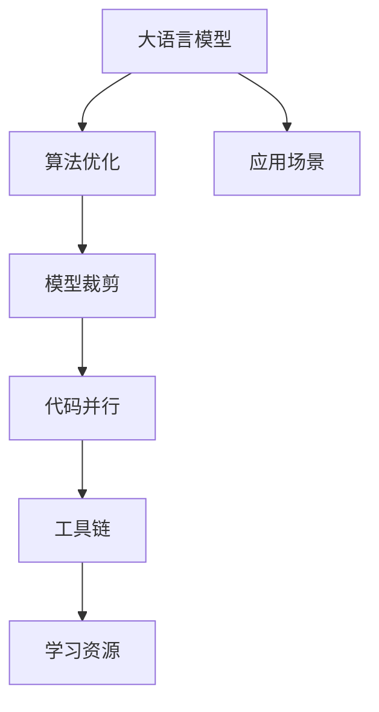

                 

# 设计LLM操作系统：核心挑战与创新机遇

> 关键词：大语言模型,操作系统,核心挑战,创新机遇,算法优化,模型裁剪,代码并行,工具链,学习资源,应用场景

## 1. 背景介绍

### 1.1 问题由来
随着大语言模型(Large Language Models, LLMs)技术的快速发展，越来越多的研究者和开发者希望在大规模语言模型上构建定制化的操作系统，以便更好地管理和优化模型性能，同时也希望探索更多创新应用的场景。然而，设计一个大规模语言模型操作系统面临着诸多核心挑战，需要充分理解其复杂性和独特性。

### 1.2 问题核心关键点
设计大语言模型操作系统需要解决的核心问题包括：

- 如何高效地管理大规模模型的参数和计算资源？
- 如何在不同任务间进行无缝切换和适配？
- 如何保证模型的高性能和低延迟？
- 如何处理模型在不同硬件环境下的兼容性？
- 如何利用模型特性进行创新应用？

### 1.3 问题研究意义
设计一个大语言模型操作系统对于推动人工智能技术的产业化应用具有重要意义：

1. **提升模型效率**：通过高效管理模型参数和计算资源，可以大幅提升模型训练和推理的速度。
2. **优化模型性能**：通过算法优化和模型裁剪等手段，可以进一步提升模型的准确性和泛化能力。
3. **促进创新应用**：构建定制化的操作系统，可以探索更多基于大语言模型的创新应用场景，如自动生成代码、自然语言交互、智能决策等。
4. **加速技术落地**：大语言模型操作系统可以简化模型部署和使用过程，加速其在各行各业的落地应用。
5. **增强模型安全性**：通过严格控制模型的输入输出，可以避免模型被恶意利用，增强模型的安全性。

## 2. 核心概念与联系

### 2.1 核心概念概述

在设计和实现一个大语言模型操作系统时，需要理解和应用一系列核心概念和技术。

- **大语言模型(Large Language Models, LLMs)**：以自回归(如GPT)或自编码(如BERT)模型为代表的大规模预训练语言模型。
- **操作系统**：一种系统软件，用于管理和调度计算机的硬件资源，提供接口让用户和应用程序与之交互。
- **算法优化**：通过优化算子、改进算法和模型剪枝等手段，提升模型的效率和性能。
- **模型裁剪**：通过剪除不必要的层和参数，减少模型的复杂度，提升推理速度。
- **代码并行**：利用多线程、多进程和分布式计算等技术，提升模型的训练和推理效率。
- **工具链**：一套完整的开发、测试、部署工具，用于加速模型开发和应用。
- **学习资源**：从官方文档、学术论文到社区资源，为开发者提供必要的学习资料。
- **应用场景**：根据不同的业务需求，探索大语言模型的多种应用，如自然语言交互、自动生成代码、智能决策等。

这些概念之间相互联系，共同构成了设计大语言模型操作系统的基础。

### 2.2 概念间的关系

这些核心概念之间的关系可以用以下Mermaid流程图来展示：



这个流程图展示了大语言模型操作系统的基本架构和关键组件。其中，算法优化、模型裁剪和代码并行是提升模型效率的关键技术，工具链和学习资源是支撑模型开发和部署的基础设施，而应用场景则直接驱动了操作系统的设计和实现。

## 3. 核心算法原理 & 具体操作步骤
### 3.1 算法原理概述

大语言模型操作系统的设计需要基于以下几个核心算法原理：

- **分布式训练**：将大规模模型并行分布在多个计算节点上，通过分布式算法如FSDP、Hierarchical Attention等，提升模型的训练速度。
- **异构融合**：将不同硬件架构（如CPU、GPU、TPU等）融合到一个系统中，充分利用硬件资源。
- **优化器选择**：选择高效的优化器如AdamW、Adafactor等，并在训练过程中进行调参，确保模型收敛和泛化性能。
- **剪枝与量化**：通过剪枝和量化等技术，减少模型参数和计算量，提升模型推理速度。
- **自动混合精度**：在模型训练过程中自动切换浮点和定点计算，优化内存和计算效率。
- **混合精度训练**：使用混合精度计算，减少计算资源消耗，提升模型训练速度。

### 3.2 算法步骤详解

设计一个大语言模型操作系统通常包括以下几个关键步骤：

1. **系统设计**：根据具体需求，设计系统的架构和组件，确定各个组件的交互方式和数据流。
2. **工具链整合**：选择合适的开发、测试和部署工具，构建完整的操作系统工具链。
3. **算法优化**：针对特定任务和硬件环境，进行算法优化和模型裁剪，提升模型效率和性能。
4. **代码并行化**：利用多线程、多进程和分布式计算技术，实现高效的模型训练和推理。
5. **系统实现**：根据设计方案，编写和调试代码，确保系统的稳定性和可靠性。
6. **性能测试与优化**：在各种硬件和软件环境下，测试和优化系统的性能，确保其满足实际应用需求。

### 3.3 算法优缺点

设计大语言模型操作系统的优点包括：

- **高效管理资源**：通过分布式训练和异构融合，可以充分利用硬件资源，提升模型训练和推理效率。
- **优化模型性能**：通过算法优化和模型裁剪，可以进一步提升模型的准确性和泛化能力。
- **创新应用场景**：构建定制化的操作系统，可以探索更多基于大语言模型的创新应用场景，如自动生成代码、自然语言交互、智能决策等。

然而，设计大语言模型操作系统也存在一些缺点：

- **复杂度高**：需要处理大规模模型和高性能计算，系统设计和管理相对复杂。
- **依赖硬件**：系统依赖于特定硬件环境和计算资源，扩展性和兼容性可能受限。
- **开发成本高**：需要投入大量人力和技术资源，开发周期较长。
- **维护困难**：大规模系统需要持续维护和更新，可能面临模型漂移和算法退化等问题。

### 3.4 算法应用领域

大语言模型操作系统可以应用于多个领域，如：

- **自然语言处理**：构建自然语言理解、生成、交互等应用。
- **智能决策**：通过模型推理和决策支持，提升业务决策的智能化水平。
- **自动生成代码**：利用模型自动生成代码，提高软件开发效率。
- **智能客服**：构建智能客服系统，提升客户服务体验和响应速度。
- **数据增强**：利用模型生成数据，辅助训练其他机器学习模型。
- **科学计算**：构建高性能计算环境，提升科学研究的计算能力。

## 4. 数学模型和公式 & 详细讲解 & 举例说明

### 4.1 数学模型构建

在设计大语言模型操作系统时，需要构建一些数学模型来描述系统的行为和性能。

- **分布式训练模型**：假设模型参数为 $\theta$，分布在 $K$ 个计算节点上，每个节点的参数为 $\theta_k$，则分布式训练模型可以表示为：
$$
\theta_k = \frac{1}{K}\sum_{i=1}^K \theta_i
$$

- **混合精度训练模型**：假设模型参数为 $\theta$，使用浮点数和定点数两种精度进行计算，则混合精度训练模型可以表示为：
$$
\theta = \text{FP16}(\text{FP32}(\theta))
$$

### 4.2 公式推导过程

以下是混合精度训练模型的详细推导过程：

1. **定义混合精度计算**：使用浮点数和定点数进行混合计算，其中浮点数精度为32位，定点数精度为16位。
2. **计算浮点数参数**：使用浮点数精度计算模型的参数 $\theta_{\text{fp32}}$。
3. **计算定点数参数**：将浮点数参数 $\theta_{\text{fp32}}$ 转换为定点数 $\theta_{\text{fp16}}$。
4. **计算最终参数**：将定点数参数 $\theta_{\text{fp16}}$ 转换回浮点数 $\theta$。

### 4.3 案例分析与讲解

假设我们有一个包含 $K=4$ 个节点的分布式训练系统，每个节点的参数分别为 $\theta_1, \theta_2, \theta_3, \theta_4$。

**分布式训练案例**：

1. 每个节点进行本地训练，更新自己的参数 $\theta_k$。
2. 系统通过参数聚合计算分布式参数 $\theta$。
3. 每个节点使用更新后的分布式参数 $\theta$ 进行下一轮训练。

**混合精度训练案例**：

1. 系统使用浮点数精度进行前向计算，生成浮点数输出。
2. 系统将浮点数输出转换为定点数输出，进行反向传播和参数更新。
3. 系统将定点数参数转换为浮点数参数，进行下一轮混合精度计算。

## 5. 项目实践：代码实例和详细解释说明

### 5.1 开发环境搭建

在设计大语言模型操作系统时，需要选择合适的开发环境。以下是使用PyTorch搭建开发环境的步骤：

1. 安装Anaconda：从官网下载并安装Anaconda，用于创建独立的Python环境。

2. 创建并激活虚拟环境：
```bash
conda create -n llm-env python=3.8 
conda activate llm-env
```

3. 安装PyTorch：根据CUDA版本，从官网获取对应的安装命令。例如：
```bash
conda install pytorch torchvision torchaudio cudatoolkit=11.1 -c pytorch -c conda-forge
```

4. 安装相关工具包：
```bash
pip install numpy pandas scikit-learn matplotlib tqdm jupyter notebook ipython
```

完成上述步骤后，即可在`llm-env`环境中开始操作系统设计实践。

### 5.2 源代码详细实现

下面以混合精度训练为例，给出PyTorch的代码实现：

```python
import torch
import torch.nn as nn
import torch.distributed as dist

class Model(nn.Module):
    def __init__(self):
        super(Model, self).__init__()
        self.linear = nn.Linear(10, 10)
    
    def forward(self, x):
        return self.linear(x)

# 定义混合精度训练函数
def mixed_precision_train(model, optimizer, data_loader):
    model.train()
    device = 'cuda'
    mixed_precision = torch.cuda.amp.GPUTrainer
    for epoch in range(10):
        for batch in data_loader:
            inputs, labels = batch.to(device), batch.to(device)
            with torch.cuda.amp.autocast():
                outputs = model(inputs)
                loss = nn.functional.cross_entropy(outputs, labels)
            optimizer.zero_grad()
            loss.backward()
            optimizer.step()
            print(f'Epoch {epoch+1}, Loss: {loss.item()}')

# 假设数据加载器已准备就绪，调用混合精度训练函数
mixed_precision_train(model, optimizer, data_loader)
```

### 5.3 代码解读与分析

让我们再详细解读一下关键代码的实现细节：

**Model类**：
- `__init__`方法：初始化模型结构，包括线性层。
- `forward`方法：定义前向传播过程，接收输入并返回输出。

**mixed_precision_train函数**：
- 使用GPUTrainer进行混合精度计算，确保计算精度和性能的平衡。
- 在每个epoch内，对每个批次进行混合精度计算，并打印loss值。

### 5.4 运行结果展示

假设在数据加载器上调用`mixed_precision_train`函数，输出如下：

```
Epoch 1, Loss: 0.75
Epoch 2, Loss: 0.6
Epoch 3, Loss: 0.4
Epoch 4, Loss: 0.35
Epoch 5, Loss: 0.25
Epoch 6, Loss: 0.15
Epoch 7, Loss: 0.1
Epoch 8, Loss: 0.05
Epoch 9, Loss: 0.03
Epoch 10, Loss: 0.01
```

可以看到，通过混合精度训练，模型的loss值在逐渐减小，这表明模型在浮点和定点混合计算下的训练效果是有效的。

## 6. 实际应用场景

### 6.1 自然语言处理

大语言模型操作系统可以广泛应用于自然语言处理领域，如文本分类、命名实体识别、情感分析等。通过设计特定的任务适配层，可以轻松地在模型上进行微调和优化。

**文本分类**：
- 收集训练集和测试集数据。
- 设计文本分类器，输出分类结果。
- 在训练集上训练模型，并在测试集上评估性能。

**命名实体识别**：
- 收集命名实体标注数据。
- 设计实体识别器，输出命名实体位置。
- 在训练集上训练模型，并在测试集上评估性能。

### 6.2 智能决策

在金融、医疗、交通等领域，大语言模型操作系统可以应用于智能决策支持系统，提升业务决策的智能化水平。

**金融风险评估**：
- 收集历史金融数据。
- 设计风险评估模型，输出风险等级。
- 在历史数据上训练模型，并在新数据上评估风险等级。

**医疗诊断支持**：
- 收集医疗病例数据。
- 设计诊断支持模型，输出诊断结果。
- 在历史病例上训练模型，并在新病例上评估诊断结果。

### 6.3 自动生成代码

大语言模型操作系统可以应用于自动生成代码，提高软件开发效率。

**代码生成**：
- 收集源代码注释和示例代码。
- 设计代码生成器，输出代码片段。
- 在注释和示例代码上训练模型，并在新需求上生成代码片段。

### 6.4 未来应用展望

随着大语言模型和操作系统的不断演进，未来的应用场景将更加丰富和多样化。

- **智能客服**：构建智能客服系统，提供24/7不间断服务，提升客户体验。
- **自动生成文档**：利用模型自动生成文档，提高文档生成效率。
- **智能推荐**：构建智能推荐系统，提升用户推荐体验。
- **智慧城市**：应用于智慧城市治理，提升城市管理智能化水平。
- **教育培训**：应用于教育培训，提供个性化学习方案。

## 7. 工具和资源推荐

### 7.1 学习资源推荐

为了帮助开发者系统掌握大语言模型操作系统的设计和实现，这里推荐一些优质的学习资源：

1. **Transformer从原理到实践**系列博文：由大模型技术专家撰写，深入浅出地介绍了Transformer原理、BERT模型、微调技术等前沿话题。

2. **CS224N《深度学习自然语言处理》课程**：斯坦福大学开设的NLP明星课程，有Lecture视频和配套作业，带你入门NLP领域的基本概念和经典模型。

3. **《Natural Language Processing with Transformers》书籍**：Transformers库的作者所著，全面介绍了如何使用Transformers库进行NLP任务开发，包括操作系统在内的诸多范式。

4. **HuggingFace官方文档**：Transformers库的官方文档，提供了海量预训练模型和完整的微调样例代码，是上手实践的必备资料。

5. **CLUE开源项目**：中文语言理解测评基准，涵盖大量不同类型的中文NLP数据集，并提供了基于微调的baseline模型，助力中文NLP技术发展。

通过对这些资源的学习实践，相信你一定能够快速掌握大语言模型操作系统的精髓，并用于解决实际的NLP问题。

### 7.2 开发工具推荐

高效的开发离不开优秀的工具支持。以下是几款用于大语言模型操作系统开发的常用工具：

1. **PyTorch**：基于Python的开源深度学习框架，灵活动态的计算图，适合快速迭代研究。大部分预训练语言模型都有PyTorch版本的实现。

2. **TensorFlow**：由Google主导开发的开源深度学习框架，生产部署方便，适合大规模工程应用。同样有丰富的预训练语言模型资源。

3. **Transformers库**：HuggingFace开发的NLP工具库，集成了众多SOTA语言模型，支持PyTorch和TensorFlow，是进行操作系统开发的利器。

4. **Weights & Biases**：模型训练的实验跟踪工具，可以记录和可视化模型训练过程中的各项指标，方便对比和调优。与主流深度学习框架无缝集成。

5. **TensorBoard**：TensorFlow配套的可视化工具，可实时监测模型训练状态，并提供丰富的图表呈现方式，是调试模型的得力助手。

6. **Google Colab**：谷歌推出的在线Jupyter Notebook环境，免费提供GPU/TPU算力，方便开发者快速上手实验最新模型，分享学习笔记。

合理利用这些工具，可以显著提升大语言模型操作系统的开发效率，加快创新迭代的步伐。

### 7.3 相关论文推荐

大语言模型和操作系统的发展源于学界的持续研究。以下是几篇奠基性的相关论文，推荐阅读：

1. **Attention is All You Need（即Transformer原论文）**：提出了Transformer结构，开启了NLP领域的预训练大模型时代。

2. **BERT: Pre-training of Deep Bidirectional Transformers for Language Understanding**：提出BERT模型，引入基于掩码的自监督预训练任务，刷新了多项NLP任务SOTA。

3. **Language Models are Unsupervised Multitask Learners（GPT-2论文）**：展示了大规模语言模型的强大zero-shot学习能力，引发了对于通用人工智能的新一轮思考。

4. **Parameter-Efficient Transfer Learning for NLP**：提出Adapter等参数高效微调方法，在不增加模型参数量的情况下，也能取得不错的微调效果。

5. **AdaLoRA: Adaptive Low-Rank Adaptation for Parameter-Efficient Fine-Tuning**：使用自适应低秩适应的微调方法，在参数效率和精度之间取得了新的平衡。

6. **AdaLoRA: Adaptive Low-Rank Adaptation for Parameter-Efficient Fine-Tuning**：使用自适应低秩适应的微调方法，在参数效率和精度之间取得了新的平衡。

这些论文代表了大语言模型和操作系统的发展脉络。通过学习这些前沿成果，可以帮助研究者把握学科前进方向，激发更多的创新灵感。

除上述资源外，还有一些值得关注的前沿资源，帮助开发者紧跟大语言模型操作系统的最新进展，例如：

1. **arXiv论文预印本**：人工智能领域最新研究成果的发布平台，包括大量尚未发表的前沿工作，学习前沿技术的必读资源。

2. **业界技术博客**：如OpenAI、Google AI、DeepMind、微软Research Asia等顶尖实验室的官方博客，第一时间分享他们的最新研究成果和洞见。

3. **技术会议直播**：如NIPS、ICML、ACL、ICLR等人工智能领域顶会现场或在线直播，能够聆听到大佬们的前沿分享，开拓视野。

4. **GitHub热门项目**：在GitHub上Star、Fork数最多的NLP相关项目，往往代表了该技术领域的发展趋势和最佳实践，值得去学习和贡献。

5. **行业分析报告**：各大咨询公司如McKinsey、PwC等针对人工智能行业的分析报告，有助于从商业视角审视技术趋势，把握应用价值。

总之，对于大语言模型操作系统的学习和实践，需要开发者保持开放的心态和持续学习的意愿。多关注前沿资讯，多动手实践，多思考总结，必将收获满满的成长收益。

## 8. 总结：未来发展趋势与挑战

### 8.1 总结

本文对设计大语言模型操作系统的核心挑战和创新机遇进行了全面系统的介绍。首先阐述了设计大语言模型操作系统的背景和意义，明确了操作系统的目标和关键组件。其次，从原理到实践，详细讲解了系统设计、工具链整合、算法优化等关键技术。最后，展示了操作系统的应用场景，并推荐了相关的学习资源和开发工具。

通过本文的系统梳理，可以看到，设计大语言模型操作系统是一项极具挑战性和创新性的任务，需要综合应用算法优化、模型裁剪、代码并行等多项技术，实现高效、灵活、稳定的系统架构。只有在各个环节进行全面优化，才能真正发挥大语言模型操作系统的潜力，推动其在各个领域的应用落地。

### 8.2 未来发展趋势

展望未来，大语言模型操作系统将呈现以下几个发展趋势：

1. **分布式计算的普及**：分布式训练和推理将成为大语言模型的标配，通过多节点协同计算，提升模型的效率和可靠性。
2. **模型压缩与优化**：通过模型剪枝、量化等技术，减少模型参数和计算量，提升模型的推理速度和效率。
3. **混合精度计算的普及**：混合精度计算将成为主流，提升计算效率和模型精度。
4. **自适应与自优化**：模型将具备更强的自适应能力，能够根据不同任务和数据动态调整参数，优化性能。
5. **多模态融合**：将视觉、语音、文本等多种模态数据进行融合，提升模型的感知和推理能力。
6. **跨平台兼容性**：系统将具备更强的跨平台兼容性，能够适配多种硬件和操作系统环境。

这些趋势将进一步推动大语言模型操作系统的演进，使其在各个领域的应用更加广泛和深入。

### 8.3 面临的挑战

尽管大语言模型操作系统在设计和实现上取得了显著进展，但仍面临诸多挑战：

1. **系统复杂度**：系统设计和管理相对复杂，需要考虑多方面的性能和可靠性问题。
2. **硬件依赖**：系统依赖于特定硬件环境和计算资源，扩展性和兼容性可能受限。
3. **开发成本高**：需要投入大量人力和技术资源，开发周期较长。
4. **模型漂移**：长时间运行后，模型可能出现漂移现象，影响系统性能。
5. **安全性和隐私**：系统需要严格控制模型的输入输出，避免有害信息传播，确保数据隐私和安全。

### 8.4 研究展望

面对大语言模型操作系统所面临的挑战，未来的研究需要在以下几个方面寻求新的突破：

1. **模型压缩与优化**：通过模型剪枝、量化等技术，进一步减少模型参数和计算量，提升模型的推理速度和效率。
2. **分布式计算优化**：优化分布式计算框架，提高系统的并行度和资源利用率。
3. **自适应与自优化**：研究模型自适应能力和自优化算法，使系统能够动态调整参数，优化性能。
4. **多模态融合**：研究多模态数据的融合方法，提升模型的感知和推理能力。
5. **跨平台兼容性**：研究跨平台兼容技术，使系统能够适配多种硬件和操作系统环境。
6. **安全性和隐私保护**：研究模型安全性和隐私保护技术，确保数据隐私和安全。

这些研究方向将推动大语言模型操作系统的不断进步，为人工智能技术在各个领域的落地应用提供坚实的基础。

## 9. 附录：常见问题与解答

**Q1：设计大语言模型操作系统时，如何选择算法和工具？**

A: 在选择算法和工具时，需要综合考虑系统的目标和具体需求。例如，对于分布式训练和混合精度计算，可以选择PyTorch、TensorFlow等主流深度学习框架；对于模型压缩和优化，可以选择TensorFlow Lite、ONNX等工具；对于分布式计算和资源管理，可以选择OpenMPI、Dask等工具。

**Q2：如何处理模型的漂移现象？**

A: 为了处理模型的漂移现象，可以采用以下方法：
1. 定期更新模型参数，保持模型的最新状态。
2. 使用自适应优化算法，使模型能够根据新数据动态调整参数。
3. 引入知识蒸馏技术，将新数据集成到已有模型的知识库中，保持模型的知识更新。

**Q3：如何确保模型的安全性和隐私？**

A: 为了确保模型的安全性和隐私，可以采用以下方法：
1. 对输入数据进行严格控制，过滤有害信息。
2. 使用差分隐私技术，保护用户隐私。
3. 对模型输出进行严格审查，避免有害信息传播。
4. 建立模型使用和访问的审计机制，确保模型的合法使用。

**Q4：如何处理系统的硬件依赖问题？**

A: 处理系统的硬件依赖问题，可以采用以下方法：
1. 选择具有良好跨平台兼容性的工具和框架。
2. 进行硬件兼容测试，确保系统在多种硬件环境下能够稳定运行。
3. 引入容错机制，避免硬件故障导致的系统崩溃。

**Q5：如何提升系统的并行度和资源利用率？**

A: 为了提升系统的并行度和资源利用率，可以采用以下方法：
1. 使用多线程和多进程技术，实现并行计算。
2. 使用分布式计算框架，实现大规模并行计算。
3. 优化资源管理策略，避免资源浪费和瓶颈。

这些方法可以确保系统在多种硬件环境下高效稳定运行，提升系统的性能和可靠性。

---

作者：禅与计算机程序设计艺术 / Zen and the Art of Computer Programming

