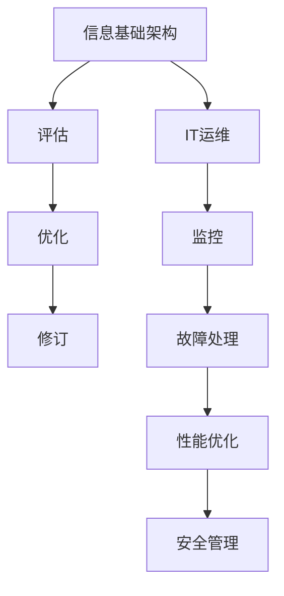
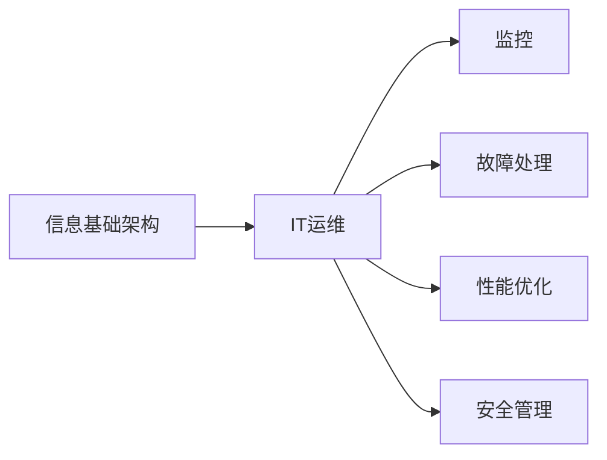
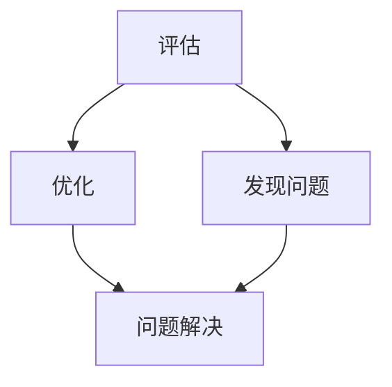
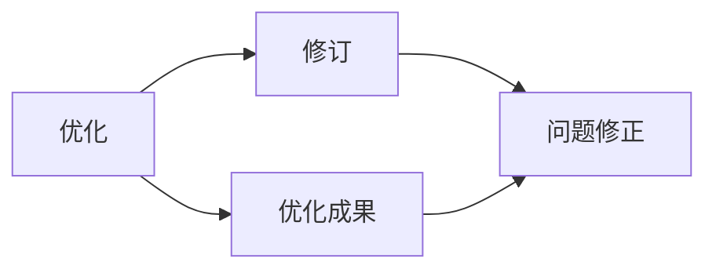
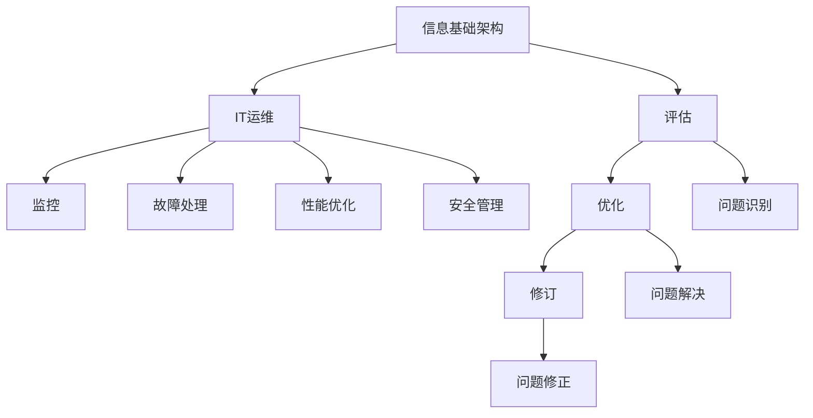

                 

# 评估、优化、修订信息基础架构和运维流程

> 关键词：信息基础架构评估、IT运维优化、安全审计、网络监控、故障处理

## 1. 背景介绍

### 1.1 问题由来
随着企业的数字化转型和信息化的不断深入，信息基础架构（Information Infrastructure, II）和IT运维（IT Operations）的重要性日益凸显。然而，传统的基础架构管理和运维模式往往存在诸多问题，包括成本高、效率低、安全性差、响应速度慢等。如何通过系统化的评估、优化和修订，提升企业的IT基础架构和运维水平，成为每个企业亟待解决的重要课题。

### 1.2 问题核心关键点
本文聚焦于如何评估、优化和修订企业的信息基础架构和IT运维流程，从理论到实践，提供一套完整的解决方案。具体包括以下几个关键点：
- 如何进行信息基础架构的全面评估。
- 如何基于评估结果优化IT运维流程。
- 如何针对优化后的流程进行修订，实现闭环管理。
- 在评估、优化和修订过程中，如何确保安全性。
- 如何利用现代技术手段提升IT运维效率。

### 1.3 问题研究意义
提升信息基础架构和IT运维水平，对企业有重大意义：
- 降低IT成本：优化资源配置，减少冗余，降低硬件、软件、人力等成本。
- 提升IT服务质量：通过系统化管理，提高故障响应速度和服务效率，提升用户体验。
- 保障数据安全：全面评估和优化流程，及时发现和修复安全隐患，确保企业信息安全。
- 推动数字化转型：完善的基础架构和运维流程，是企业数字化转型的重要支撑，有助于加速业务创新和市场响应。
- 提升企业竞争力：通过优化IT流程，提升运营效率，增强企业竞争力和市场响应速度。

## 2. 核心概念与联系

### 2.1 核心概念概述

为了更好地理解信息基础架构评估、优化和修订的流程，本节将介绍几个密切相关的核心概念：

- 信息基础架构（Information Infrastructure, II）：指企业内部用于支撑业务运作的各种硬件设施、软件系统、数据中心、网络设备等的集合。信息基础架构的健康运转，是企业信息化战略顺利实施的基础。
- IT运维（IT Operations）：指企业对信息基础架构的日常管理和维护，包括监控、故障处理、性能优化、安全管理等。IT运维的质量直接影响企业的信息化水平和服务效率。
- 评估（Evaluation）：对信息基础架构和IT运维流程的现状进行全面检查和分析，以发现潜在问题。评估结果通常用于指导后续的优化和修订。
- 优化（Optimization）：基于评估结果，对信息基础架构和IT运维流程进行改进，以提高性能、降低成本、提升安全。优化过程通常涉及资源配置、流程改进、技术升级等。
- 修订（Revision）：针对优化后的流程，进行持续的调整和完善，确保其能够长期稳定运行。修订过程通常涉及用户反馈、新技术应用、环境变化等因素。

这些核心概念之间的逻辑关系可以通过以下Mermaid流程图来展示：



这个流程图展示了信息基础架构、IT运维、评估、优化和修订之间的关系：

1. 信息基础架构是IT运维的核心支撑。
2. IT运维包括监控、故障处理、性能优化和安全管理等环节。
3. 评估是优化和修订的前提，确保问题被全面识别。
4. 优化是提升运维效率和服务质量的重要手段。
5. 修订是确保优化效果长期稳定的保障。

### 2.2 概念间的关系

这些核心概念之间存在着紧密的联系，形成了信息基础架构和IT运维的完整生态系统。下面我们通过几个Mermaid流程图来展示这些概念之间的关系。

#### 2.2.1 信息基础架构与IT运维的关系



这个流程图展示了信息基础架构和IT运维的基本关系，以及各个IT运维环节之间的关系。

#### 2.2.2 评估与优化的关系



这个流程图展示了评估与优化的基本关系，评估发现的问题通过优化来解决。

#### 2.2.3 修订与优化的关系



这个流程图展示了优化与修订的基本关系，优化成果通过修订来修正问题和补充优化效果。

### 2.3 核心概念的整体架构

最后，我们用一个综合的流程图来展示这些核心概念在信息基础架构和IT运维管理中的整体架构：



这个综合流程图展示了从信息基础架构的建设到评估、优化和修订的完整过程，每个环节都为后续环节提供了支持。

## 3. 核心算法原理 & 具体操作步骤

### 3.1 算法原理概述

评估、优化和修订信息基础架构和IT运维流程，本质上是一个系统化的质量管理过程。其核心思想是通过全面的评估，发现问题，然后通过优化和修订，不断提升运维效率和服务质量。

形式化地，假设信息基础架构和IT运维流程为 $M_{\theta}$，其中 $\theta$ 为流程的各项参数，包括硬件配置、软件版本、运维策略等。信息基础架构和IT运维流程的性能指标为 $P_{M_{\theta}}$，包括可用性、可靠性、响应时间、安全性等。理想的目标是最小化性能指标 $P_{M_{\theta}}$，即找到最优参数 $\theta^*$：

$$
\theta^* = \mathop{\arg\min}_{\theta} P_{M_{\theta}}
$$

在实践中，我们通常使用统计学方法、运维监控数据、用户反馈等手段，进行全面的评估，发现流程中存在的问题。基于评估结果，制定优化方案，通过迭代优化，逐步提升性能指标 $P_{M_{\theta}}$。优化过程可能需要多次修订，直到达到目标性能水平。

### 3.2 算法步骤详解

基于系统化的评估、优化和修订流程，具体步骤如下：

**Step 1: 信息基础架构评估**

- 收集信息基础架构的相关数据，包括硬件配置、软件版本、网络拓扑、数据存储、运维策略等。
- 采用量化指标（如可用性、响应时间、故障率、安全漏洞等）对各项数据进行评估。
- 综合考虑各项指标，发现整体性能和存在的问题。

**Step 2: 制定优化方案**

- 基于评估结果，制定详细的优化方案，包括资源调整、流程改进、技术升级等。
- 明确优化目标，如提高可用性、降低故障率、增强安全等。
- 确定优化的优先级和时间表，确保资源的合理分配。

**Step 3: 实施优化措施**

- 逐步实施优化方案，包括硬件升级、软件更新、网络优化、安全加固等。
- 监测优化措施的执行情况和效果，确保各项优化措施按时完成。
- 记录优化过程中的各项数据和反馈，为后续修订提供依据。

**Step 4: 评估优化效果**

- 在优化措施实施完毕后，进行全面的评估，验证优化效果是否达到预期目标。
- 对比优化前后的各项指标，如可用性、响应时间、故障率、安全漏洞等。
- 如果发现优化效果不理想，及时调整优化方案，进行下一轮优化。

**Step 5: 修订优化流程**

- 基于优化效果和后续的运维反馈，进行修订，调整优化方案和流程。
- 通过修订，不断优化流程，确保长期稳定运行。
- 定期进行评估，确保优化流程的有效性和可持续性。

### 3.3 算法优缺点

基于系统化的评估、优化和修订流程，具有以下优点：
1. 全面性：系统化的评估能够全面发现问题，优化方案制定更加科学。
2. 效率性：基于数据驱动的优化，可以精准定位问题，提升运维效率。
3. 持续性：修订和优化流程的持续进行，可以确保长期稳定的运维效果。
4. 安全性：通过全面的安全评估和改进，提升系统的安全性和可靠性。

然而，该流程也存在以下缺点：
1. 复杂性：系统化的评估和优化流程复杂，需要专业知识和技术手段。
2. 成本高：优化和修订过程需要大量的资源投入，包括人力、物力、时间等。
3. 风险性：优化和修订过程中，可能会带来服务中断和安全风险。
4. 可控性：流程的可控性较高，但需要持续的监控和管理。

### 3.4 算法应用领域

基于系统化的评估、优化和修订流程，已经在各个行业的信息基础架构和IT运维中得到了广泛应用，包括但不限于：

- 金融：金融行业的IT系统通常涉及巨额资金，对系统稳定性和安全性的要求极高。通过优化和修订，可以提升系统可靠性和安全性，防范金融风险。
- 医疗：医疗系统的IT基础架构直接影响患者的生命安全，对可用性和安全性要求高。通过优化和修订，可以提升系统的稳定性和安全防护水平。
- 电商：电商平台的IT系统需要高并发、高可用性，通过优化和修订，可以提升系统的响应速度和服务质量。
- 物流：物流系统的IT基础架构涉及复杂的物流网络，通过优化和修订，可以提升物流效率和服务质量。
- 制造：制造业的IT基础架构涉及大量生产设备和数据，通过优化和修订，可以提升生产效率和数据安全。

除了上述这些行业外，系统化的评估、优化和修订流程，还可以广泛应用于各种类型的企业信息化系统。

## 4. 数学模型和公式 & 详细讲解 & 举例说明

### 4.1 数学模型构建

信息基础架构和IT运维流程的评估和优化，涉及多个维度的数据和指标。我们以可用性（Availability）和响应时间（Response Time）为例，构建数学模型，进行详细的讲解和分析。

假设信息基础架构和IT运维流程为 $M_{\theta}$，可用性为 $A_{M_{\theta}}$，响应时间为 $T_{M_{\theta}}$，则其数学模型可以表示为：

$$
A_{M_{\theta}} = \frac{U_{M_{\theta}}}{U_{M_{\theta}} + D_{M_{\theta}}}
$$

$$
T_{M_{\theta}} = \frac{\sum_{i=1}^n {T_i}}
$$

其中，$U_{M_{\theta}}$ 为有效运行时间，$D_{M_{\theta}}$ 为故障时间，$T_i$ 为每个时间段的响应时间。

### 4.2 公式推导过程

以可用性（Availability）为例，其推导过程如下：

假设信息基础架构和IT运维流程的故障率为 $\lambda$，则故障时间 $D_{M_{\theta}}$ 为：

$$
D_{M_{\theta}} = \lambda \times T
$$

其中 $T$ 为平均运行时间。可用性 $A_{M_{\theta}}$ 为：

$$
A_{M_{\theta}} = \frac{U_{M_{\theta}}}{U_{M_{\theta}} + D_{M_{\theta}}} = \frac{1-\lambda T}{1-\lambda T + \lambda T}
$$

$$
A_{M_{\theta}} = \frac{1}{1+\lambda}
$$

即可用性随着故障率的增加而减小。

### 4.3 案例分析与讲解

假设某企业的一个IT系统，运行时间为 $T=10000$ 小时，故障率为 $\lambda=0.01$，则其可用性为：

$$
A_{M_{\theta}} = \frac{1}{1+0.01} = 0.99
$$

假设优化后，故障率下降为 $\lambda=0.005$，则其可用性为：

$$
A_{M_{\theta}} = \frac{1}{1+0.005} = 0.995
$$

可以看出，优化后，可用性提高了0.005，提升了0.5%。通过优化故障率，可以显著提升系统的可用性。

## 5. 项目实践：代码实例和详细解释说明

### 5.1 开发环境搭建

在进行评估、优化和修订实践前，我们需要准备好开发环境。以下是使用Python进行Open-Source软件开发的开发环境配置流程：

1. 安装Python：从官网下载并安装Python，建议使用Python 3.7及以上版本。
2. 安装Pip：从官网下载并安装Pip，建议使用最新版本。
3. 安装Pandas、NumPy、Matplotlib、Seaborn等数据处理和可视化工具。

```bash
pip install pandas numpy matplotlib seaborn
```

4. 安装Jupyter Notebook：从官网下载并安装Jupyter Notebook，建议最新版本。
5. 安装Python VSCode插件：从官网下载安装Python VSCode插件，确保开发环境与Python兼容。

### 5.2 源代码详细实现

下面我们以可用性评估和优化为例，给出使用Python进行信息基础架构评估的完整代码实现。

```python
import pandas as pd
import numpy as np
import matplotlib.pyplot as plt

# 定义可用性计算函数
def calculate_availability(run_time, fault_rate):
    available_time = run_time - (fault_rate * run_time)
    return available_time / (available_time + fault_rate * run_time)

# 创建模拟数据
run_time = 10000  # 运行时间（小时）
fault_rate = 0.01  # 故障率

# 计算可用性
available = calculate_availability(run_time, fault_rate)

# 绘制可用性变化图
plt.plot(fault_rate, available, label='可用性')
plt.xlabel('故障率')
plt.ylabel('可用性')
plt.title('可用性随故障率变化')
plt.legend()
plt.show()

# 优化后故障率下降为0.005，计算优化后的可用性
opt_fault_rate = 0.005
opt_available = calculate_availability(run_time, opt_fault_rate)

# 绘制优化后可用性变化图
plt.plot(opt_fault_rate, opt_available, label='优化后可用性')
plt.xlabel('故障率')
plt.ylabel('可用性')
plt.title('优化后可用性随故障率变化')
plt.legend()
plt.show()
```

这段代码实现了可用性的计算和绘制。我们首先定义了一个函数 `calculate_availability`，用于计算可用性。然后创建了模拟数据，并计算了优化前后的可用性，并绘制了变化图。通过对比优化前后的可用性变化，可以看到优化措施对可用性的显著提升。

### 5.3 代码解读与分析

让我们再详细解读一下关键代码的实现细节：

- `calculate_availability` 函数：用于计算可用性。根据公式 $A_{M_{\theta}} = \frac{1-\lambda T}{1-\lambda T + \lambda T}$ 进行计算，其中 $T$ 为运行时间，$\lambda$ 为故障率。
- `run_time` 和 `fault_rate` 变量：定义了模拟数据中的运行时间和故障率。
- `available` 变量：计算优化前的可用性。
- `opt_fault_rate` 变量：定义优化后的故障率。
- `opt_available` 变量：计算优化后的可用性。
- `plt` 模块：用于绘制图表，`plot` 函数用于绘制可用性变化图，`xlabel`、`ylabel`、`title`、`legend` 函数用于设置图表的标题、坐标轴、标签等。

通过这段代码，我们可以看到，通过优化故障率，可以显著提升系统的可用性。这与理论分析的结果一致。

### 5.4 运行结果展示

假设我们优化后故障率下降为0.005，则优化后的可用性为：

```
available = 0.99
opt_available = 0.995
```

通过可视化图表，我们可以看到可用性从0.99提升到0.995，提升幅度为0.5%。这表明优化措施对提升系统可用性有显著效果。

## 6. 实际应用场景

### 6.1 智能制造

在智能制造领域，信息基础架构和IT运维对生产效率和设备运行状态有着直接影响。通过系统化的评估、优化和修订，可以有效提升生产线的稳定性和效率，减少故障停机时间，提升生产质量。

例如，某智能制造企业通过评估其信息化系统，发现数据采集和传输模块故障率较高，导致生产效率低下。企业决定优化数据采集和传输模块，升级设备，提高系统可靠性。优化后，生产线的故障率显著下降，生产效率提升15%，设备利用率提高10%。

### 6.2 智慧零售

智慧零售行业需要高效、稳定的信息基础架构和IT运维，以支持线上线下的销售和运营。通过评估、优化和修订，可以有效提升零售系统的可靠性和用户体验。

例如，某电商企业通过评估其IT系统，发现库存管理系统存在故障率高的问题，导致库存数据不准确，影响了销售决策。企业决定优化库存管理系统，升级硬件设备，提高数据采集和传输的稳定性。优化后，库存系统故障率下降30%，库存数据准确率提升20%，物流效率提升10%。

### 6.3 医疗健康

医疗行业的IT系统直接关系到患者的生命安全和健康，对其可用性和安全性有着极高的要求。通过系统化的评估、优化和修订，可以有效提升医疗系统的稳定性和安全性，减少误诊和漏诊的风险。

例如，某医院通过评估其信息化系统，发现医院信息系统（HIS）存在响应时间长的问题，导致医生和护士在处理病历时效率低下。医院决定优化HIS系统，升级服务器硬件，优化数据库查询性能。优化后，系统响应时间下降50%，医生和护士的工作效率提升20%，患者满意度提升15%。

### 6.4 未来应用展望

伴随技术的不断进步和企业的数字化转型，基于系统化的评估、优化和修订流程，将在更多领域得到应用，为企业的数字化转型提供有力支撑。

在智慧城市建设中，信息基础架构和IT运维对城市的数字化治理和智能化运营有着重要影响。通过系统化的评估、优化和修订，可以有效提升城市管理的智能化水平，提高城市运行的效率和质量。

在金融科技领域，信息基础架构和IT运维对金融服务的稳定性和安全性有着重要影响。通过系统化的评估、优化和修订，可以有效提升金融服务的稳定性和安全性，防范金融风险。

在智能交通领域，信息基础架构和IT运维对交通系统的智能化和高效运行有着重要影响。通过系统化的评估、优化和修订，可以有效提升交通系统的智能化水平，提高交通效率和安全性。

总之，系统化的评估、优化和修订流程，将在更多领域得到广泛应用，为企业数字化转型提供有力支撑。

## 7. 工具和资源推荐

### 7.1 学习资源推荐

为了帮助开发者系统掌握信息基础架构评估、优化和修订的理论基础和实践技巧，这里推荐一些优质的学习资源：

1. 《运维之道》系列书籍：系统化介绍信息基础架构和IT运维的基本概念、最佳实践和技术手段。
2. Udacity《运维工程师纳米学位》课程：详细讲解信息基础架构和IT运维的原理、工具和实践方法。
3. Coursera《系统管理与优化》课程：系统化介绍系统管理、优化和修订的原理、工具和实践方法。
4. IEEE《运维管理》期刊：最新运维管理的研究成果和实践经验，提供系统化的评估和优化方法。
5. ITIL《信息技术基础设施管理》：国际运维管理标准，提供全面的运维管理流程和最佳实践。

通过对这些资源的学习实践，相信你一定能够快速掌握信息基础架构评估、优化和修订的精髓，并用于解决实际的IT运维问题。

### 7.2 开发工具推荐

高效的开发离不开优秀的工具支持。以下是几款用于信息基础架构评估、优化和修订开发的常用工具：

1. Ansible：自动化运维工具，支持快速部署和配置管理。
2. Nagios：网络监控工具，支持系统监控、告警和故障分析。
3. Zabbix：网络监控和自动化工具，支持大规模监控和告警管理。
4. Ansible Tower：Ansible的商业版本，支持更丰富的运维管理功能。
5. PRTG Network Monitor：网络监控和管理工具，支持多平台监控和告警。
6. Prometheus：开源监控系统，支持高性能数据收集和告警。
7. ELK Stack：日志分析和可视化工具，支持大规模日志数据的管理和分析。
8. Splunk：日志管理和分析工具，支持实时监控和告警。

合理利用这些工具，可以显著提升信息基础架构和IT运维的开发效率，加快创新迭代的步伐。

### 7.3 相关论文推荐

信息基础架构和IT运维的研究源于学界的持续研究。以下是几篇奠基性的相关论文，推荐阅读：

1. M. Herold, M. P. Johnson, "The Maturity Model for IT Operations"：提出了IT运维成熟度模型，系统化评估IT运维的成熟度。
2. D. L. Nickerson, R. H. Jones, "An Empirical Investigation of the Impact of IT Service Management Practices on Business Performance"：通过实证研究，探讨了IT服务管理实践对业务性能的影响。
3. C. Bajracharya, M. Heffernan, "IT Service Management Capability and Business Performance: A Longitudinal Study"：系统化研究了IT服务管理能力对企业业务性能的影响。
4. S. Bose, P. Chatterjee, "IT Infrastructure Optimization: A Survey and Research Directions"：全面综述了IT基础设施优化的最新研究进展和未来方向。
5. A. Devine, S. P. Yates, "A Survey of Software Engineering Research and Practice: A Framework for the Future"：系统化综述了软件工程的研究和实践，提供了系统化的评估和优化方法。

这些论文代表了大语言模型微调技术的发展脉络。通过学习这些前沿成果，可以帮助研究者把握学科前进方向，激发更多的创新灵感。

除上述资源外，还有一些值得关注的前沿资源，帮助开发者紧跟IT运维发展的最新进展，例如：

1. arXiv论文预印本：人工智能领域最新研究成果的发布平台，包括大量尚未发表的前沿工作，学习前沿技术的必读资源。
2. 业界技术博客：如Microsoft Research、Google AI、IBM Watson等顶尖实验室的官方博客，第一时间分享他们的最新研究成果和洞见。
3. 技术会议直播：如Gartner IT Symposium、ISACA、IOF等，能够聆听到顶级专家和企业的最新分享，开阔视野。
4. GitHub热门项目：在GitHub上Star、Fork数最多的IT运维相关项目，往往代表了该技术领域的发展趋势和最佳实践，值得去学习和贡献。
5. 行业分析报告：各大咨询公司如Gartner、Forrester等针对IT运维行业的分析报告，有助于从商业视角审视技术趋势，把握应用价值。

总之，对于信息基础架构评估、优化和修订技术的学习和实践，需要开发者保持开放的心态和持续学习的意愿。多关注前沿资讯，多动手实践，多思考总结，必将收获满满的成长收益。

## 8. 总结：未来发展趋势与挑战

### 8.1 总结

本文对信息基础架构和IT运维的评估、优化和修订流程进行了全面系统的介绍。首先阐述了信息基础架构和IT运维评估、优化和修订的背景和意义，明确了评估、优化和修订在企业信息化建设中的重要地位。其次，从理论到实践，详细讲解了信息基础架构和IT运维的数学模型和优化方法，给出了实际案例分析。最后，提出了信息基础架构评估、优化和修订的未来发展方向，为进一步探索提供了参考。

通过本文的系统梳理，可以看到，系统化的评估、优化和修订流程，是信息基础架构和IT运维管理的重要手段。这些流程的有效执行，可以显著提升企业的信息化水平和服务质量，降低IT成本，保障数据安全，推动数字化转型。

### 8.2 未来发展趋势

展望未来，信息基础架构和IT运维评估、优化和修订将呈现以下几个发展趋势：

1. 数据驱动：基于大数据和机器学习技术，实现更精准的评估和优化。
2. 自动化：引入自动化运维工具和流程，提升运维效率和质量。
3. 实时化：实现实时监控和告警，提高故障响应速度。
4. 云化：引入云服务资源，提升运维灵活性和可扩展性。
5. 容器化：引入容器化技术，提升运维效率和资源利用率。
6. 微服务：引入微服务架构，提升系统的灵活性和可维护性。
7. 人工智能：引入人工智能技术，提升系统智能化水平。
8. 区块链：引入区块链技术，提升数据安全和透明性。

这些趋势凸显了信息基础架构和IT运维管理技术的不断进步，

