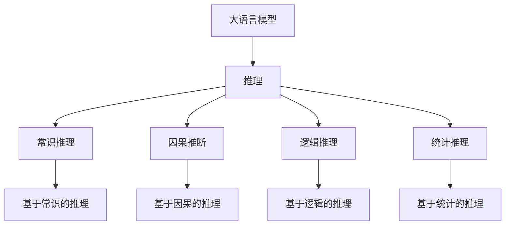
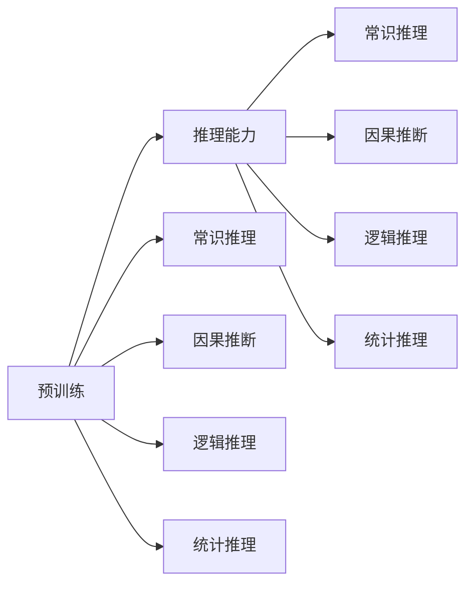
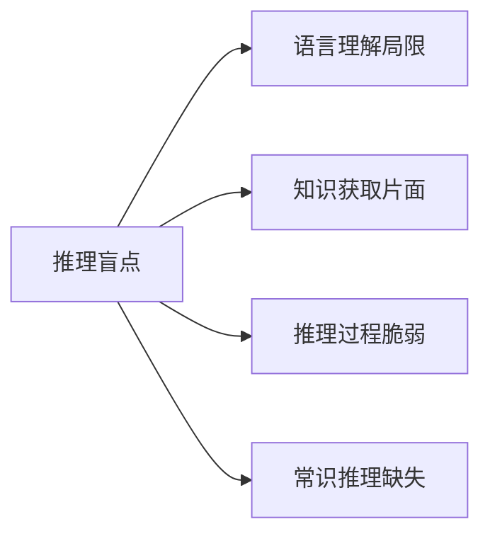
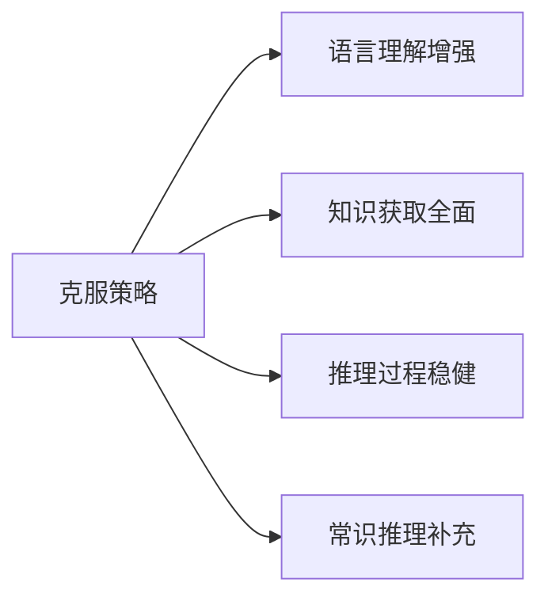
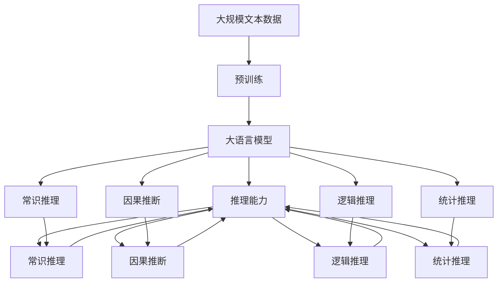
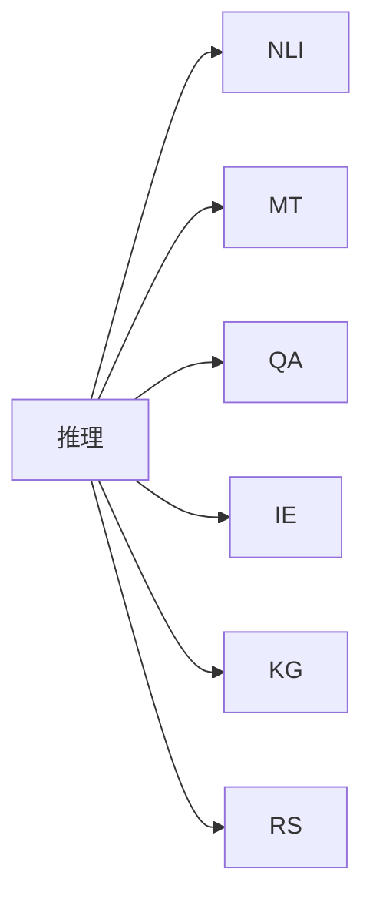

                 

# 语言≠思维：大模型的推理盲点

## 1. 背景介绍

随着深度学习技术的快速发展，大语言模型（Large Language Models, LLMs）在自然语言处理（Natural Language Processing, NLP）领域取得了巨大的突破。这些模型通过在大规模无标签文本数据上进行预训练，学习到了丰富的语言知识和常识，通过少量的有标签样本在下游任务上进行微调，获得优异的性能。然而，尽管大语言模型在理解和生成语言方面表现出色，但其推理能力仍然存在显著的局限性，这一现象被称作“推理盲点”。

### 1.1 问题由来

推理盲点指的是大语言模型在面对特定推理任务时，虽然能够理解问题并生成答案，但推理过程存在偏差，无法确保结论的正确性。例如，当模型被要求基于某些前提推理结论时，它可能会忽略某些关键信息，或者基于错误的假设得出结论。这种现象在逻辑推理、因果推断、常识推理等任务中尤为明显，也是当前研究的热点问题之一。

### 1.2 问题核心关键点

推理盲点主要体现在以下几个方面：

- **语言理解能力的局限**：尽管大语言模型在语言生成和理解方面表现优秀，但仍然存在对特定语言的局限性，尤其是在处理复杂句法结构、多义词义和语境依赖时。
- **知识获取的片面性**：模型的预训练过程往往依赖于大量无标签数据，缺乏系统化的知识获取机制，导致知识获取的片面性和随机性。
- **推理过程的脆弱性**：大语言模型的推理过程基于统计学习，容易受到输入数据的影响，当数据存在偏差或噪声时，推理结果也难以保证准确性。
- **常识推理的缺失**：尽管大语言模型能够处理简单的事实查询，但在需要推理复杂因果关系和常识知识的任务中，模型的表现仍然存在显著不足。

这些核心关键点共同构成了大语言模型推理盲点的全貌，理解这些局限性对于提升模型的推理能力具有重要意义。

### 1.3 问题研究意义

理解并克服大语言模型的推理盲点，不仅能够提升模型的推理准确性和可靠性，还能够促进其在更多复杂应用场景中的广泛应用。推理盲点的存在，使得大语言模型在某些高风险、高责任的任务中难以发挥其优势，如医疗诊断、法律判决、金融风险评估等。通过深入研究推理盲点，我们能够开发更加稳健、智能的推理模型，加速人工智能技术的落地应用。

## 2. 核心概念与联系

### 2.1 核心概念概述

为更好地理解大语言模型推理盲点，本节将介绍几个密切相关的核心概念：

- **大语言模型（LLMs）**：以自回归（如GPT）或自编码（如BERT）模型为代表的大规模预训练语言模型。通过在大规模无标签文本数据上进行预训练，学习通用的语言表示，具备强大的语言理解和生成能力。
- **推理（Reasoning）**：指利用已知事实和逻辑规则，推导出新的知识或结论的过程。推理能力是大语言模型重要的一部分，用于解决需要逻辑判断、因果推断、常识推理等任务。
- **推理盲点（Reasoning Blind Spot）**：指大语言模型在推理过程中存在的局限性，可能导致结论的正确性无法得到保证。
- **常识推理（Commonsense Reasoning）**：指基于日常经验和常识知识进行推理的过程，是大语言模型推理能力的一个重要组成部分。
- **因果推断（Causal Inference）**：指从因果关系中推断出结论的过程，是大语言模型在处理因果相关任务时所依赖的关键能力。

这些核心概念之间的逻辑关系可以通过以下Mermaid流程图来展示：



这个流程图展示了大语言模型推理能力的构成及其与核心概念之间的关系：

1. 大语言模型通过预训练获得语言理解能力，推理是其重要的一部分。
2. 推理能力包括常识推理、因果推断、逻辑推理和统计推理等多个子能力。
3. 常识推理和因果推断是基于经验知识的推理，逻辑推理和统计推理是基于逻辑和数据规律的推理。

### 2.2 概念间的关系

这些核心概念之间存在着紧密的联系，形成了大语言模型推理能力的完整生态系统。下面我通过几个Mermaid流程图来展示这些概念之间的关系。

#### 2.2.1 推理能力的构建



这个流程图展示了预训练和推理能力之间的构建关系。通过在大规模无标签数据上进行预训练，大语言模型能够学习到丰富的语言知识和规律，进而构建起推理能力。

#### 2.2.2 推理盲点产生的原因



这个流程图展示了推理盲点产生的主要原因。语言理解局限、知识获取片面、推理过程脆弱和常识推理缺失共同构成了大语言模型推理盲点的全貌。

#### 2.2.3 克服推理盲点的策略



这个流程图展示了克服推理盲点的几种策略。通过语言理解增强、知识获取全面、推理过程稳健和常识推理补充等策略，可以显著提升大语言模型的推理能力，克服推理盲点。

### 2.3 核心概念的整体架构

最后，我们用一个综合的流程图来展示这些核心概念在大语言模型推理过程中的整体架构：



这个综合流程图展示了从预训练到推理能力构建，再到克服推理盲点的完整过程。大语言模型首先在大规模文本数据上进行预训练，然后通过构建推理能力，克服推理盲点，最终实现更加准确、可靠的推理。

## 3. 核心算法原理 & 具体操作步骤

### 3.1 算法原理概述

大语言模型的推理盲点主要体现在其推理能力的不完善和不确定性上。尽管大语言模型在语言生成和理解方面表现优异，但在处理推理任务时，其结果仍然可能存在偏差。原因在于，大语言模型推理过程依赖于统计学习，而非真正的逻辑推理和因果推断。

形式化地，假设预训练语言模型为 $M_{\theta}$，其中 $\theta$ 为预训练得到的模型参数。给定推理任务 $T$ 的推理数据集 $D=\{(x_i,y_i)\}_{i=1}^N, x_i \in \mathcal{X}, y_i \in \mathcal{Y}$，推理目标是最小化推理错误，即找到最优参数：

$$
\theta^* = \mathop{\arg\min}_{\theta} \mathcal{L}(M_{\theta},D)
$$

其中 $\mathcal{L}$ 为针对任务 $T$ 设计的推理损失函数，用于衡量模型推理输出与真实推理结果之间的差异。常见的推理损失函数包括交叉熵损失、均方误差损失等。

通过梯度下降等优化算法，推理过程不断更新模型参数 $\theta$，最小化推理损失函数 $\mathcal{L}$，使得模型推理逼近真实推理结果。由于 $\theta$ 已经通过预训练获得了较好的初始化，因此即便在推理数据集 $D$ 上进行微调，也能较快收敛到理想的模型参数 $\hat{\theta}$。

### 3.2 算法步骤详解

大语言模型推理过程一般包括以下几个关键步骤：

**Step 1: 准备推理数据集**
- 选择合适的推理任务 $T$ 的推理数据集 $D$，划分为训练集、验证集和测试集。一般要求推理数据与预训练数据的分布不要差异过大。

**Step 2: 设计推理目标函数**
- 根据推理任务类型，设计合适的推理目标函数。对于分类推理，通常在推理数据集上采用交叉熵损失函数。对于回归推理，则采用均方误差损失函数。

**Step 3: 训练模型**
- 将推理数据集分批次输入模型，前向传播计算推理损失函数。
- 反向传播计算参数梯度，根据设定的优化算法和学习率更新模型参数。
- 周期性在验证集上评估模型性能，根据性能指标决定是否触发 Early Stopping。
- 重复上述步骤直到满足预设的迭代轮数或 Early Stopping 条件。

**Step 4: 推理和评估**
- 在测试集上对模型进行推理，评估推理准确率和推理效率。
- 分析推理结果的偏差和错误，找出导致推理盲点的原因。
- 根据评估结果，优化模型架构、优化训练策略或引入其他算法，进一步提升推理能力。

### 3.3 算法优缺点

大语言模型推理过程的优点包括：

1. 简单高效。通过少量标注数据即可对模型进行推理能力微调，能够快速提升推理性能。
2. 通用适用。适用于各类推理任务，设计简单的推理目标函数即可实现推理微调。
3. 适应性强。能够适应多种推理场景，包括文本推理、图像推理、音频推理等。

但该方法也存在以下缺点：

1. 推理精度有限。大语言模型的推理能力依赖于统计学习，容易受到数据偏差的影响，导致推理结果的不确定性。
2. 推理过程复杂。推理过程依赖于模型复杂度，难以解释和调试推理逻辑。
3. 推理速度慢。推理过程通常比生成和理解过程慢，难以满足实时推理需求。

### 3.4 算法应用领域

大语言模型的推理能力在诸多领域中得到了广泛应用，包括但不限于：

- 自然语言推理（Natural Language Inference, NLI）：判断一个假设是否由前提推导得出。
- 机器翻译（Machine Translation, MT）：将一种语言的文本翻译成另一种语言。
- 问答系统（Question Answering, QA）：根据问题提供准确的答案。
- 信息抽取（Information Extraction, IE）：从文本中提取结构化信息。
- 知识图谱构建（Knowledge Graph Construction）：构建和维护知识图谱。
- 智能推荐系统（Recommender Systems）：推荐符合用户兴趣的商品或内容。

这些核心概念之间的逻辑关系可以通过以下Mermaid流程图来展示：



这个流程图展示了推理能力在各类NLP任务中的应用场景。

## 4. 数学模型和公式 & 详细讲解 & 举例说明

### 4.1 数学模型构建

本节将使用数学语言对大语言模型推理过程进行更加严格的刻画。

记预训练语言模型为 $M_{\theta}$，其中 $\theta$ 为预训练得到的模型参数。假设推理任务 $T$ 的推理数据集为 $D=\{(x_i,y_i)\}_{i=1}^N, x_i \in \mathcal{X}, y_i \in \mathcal{Y}$。

定义模型 $M_{\theta}$ 在输入 $x$ 上的推理输出为 $\hat{y}=M_{\theta}(x) \in [0,1]$，表示样本属于 $y$ 类别的概率。真实推理结果为 $y \in \{0,1\}$。则推理损失函数定义为：

$$
\ell(M_{\theta}(x),y) = -[y\log \hat{y} + (1-y)\log (1-\hat{y})]
$$

将其代入经验风险公式，得：

$$
\mathcal{L}(\theta) = -\frac{1}{N}\sum_{i=1}^N [y_i\log M_{\theta}(x_i)+(1-y_i)\log(1-M_{\theta}(x_i))]
$$

在得到损失函数的梯度后，即可带入参数更新公式，完成模型的迭代优化。重复上述过程直至收敛，最终得到适应推理任务的最优模型参数 $\theta^*$。

### 4.2 公式推导过程

以下我们以分类推理任务为例，推导交叉熵损失函数及其梯度的计算公式。

假设模型 $M_{\theta}$ 在输入 $x$ 上的输出为 $\hat{y}=M_{\theta}(x) \in [0,1]$，表示样本属于 $y$ 类别的概率。真实推理结果为 $y \in \{0,1\}$。则二分类交叉熵损失函数定义为：

$$
\ell(M_{\theta}(x),y) = -[y\log \hat{y} + (1-y)\log (1-\hat{y})]
$$

将其代入经验风险公式，得：

$$
\mathcal{L}(\theta) = -\frac{1}{N}\sum_{i=1}^N [y_i\log M_{\theta}(x_i)+(1-y_i)\log(1-M_{\theta}(x_i))]
$$

根据链式法则，损失函数对参数 $\theta_k$ 的梯度为：

$$
\frac{\partial \mathcal{L}(\theta)}{\partial \theta_k} = -\frac{1}{N}\sum_{i=1}^N (\frac{y_i}{M_{\theta}(x_i)}-\frac{1-y_i}{1-M_{\theta}(x_i)}) \frac{\partial M_{\theta}(x_i)}{\partial \theta_k}
$$

其中 $\frac{\partial M_{\theta}(x_i)}{\partial \theta_k}$ 可进一步递归展开，利用自动微分技术完成计算。

在得到损失函数的梯度后，即可带入参数更新公式，完成模型的迭代优化。重复上述过程直至收敛，最终得到适应推理任务的最优模型参数 $\theta^*$。

## 5. 项目实践：代码实例和详细解释说明

### 5.1 开发环境搭建

在进行推理实践前，我们需要准备好开发环境。以下是使用Python进行PyTorch开发的环境配置流程：

1. 安装Anaconda：从官网下载并安装Anaconda，用于创建独立的Python环境。

2. 创建并激活虚拟环境：
```bash
conda create -n pytorch-env python=3.8 
conda activate pytorch-env
```

3. 安装PyTorch：根据CUDA版本，从官网获取对应的安装命令。例如：
```bash
conda install pytorch torchvision torchaudio cudatoolkit=11.1 -c pytorch -c conda-forge
```

4. 安装Transformers库：
```bash
pip install transformers
```

5. 安装各类工具包：
```bash
pip install numpy pandas scikit-learn matplotlib tqdm jupyter notebook ipython
```

完成上述步骤后，即可在`pytorch-env`环境中开始推理实践。

### 5.2 源代码详细实现

下面我以文本推理任务为例，给出使用Transformers库对BERT模型进行推理的PyTorch代码实现。

首先，定义推理任务的数据处理函数：

```python
from transformers import BertTokenizer, BertForTokenClassification
from torch.utils.data import Dataset
import torch

class TextReasoningDataset(Dataset):
    def __init__(self, texts, labels, tokenizer, max_len=128):
        self.texts = texts
        self.labels = labels
        self.tokenizer = tokenizer
        self.max_len = max_len
        
    def __len__(self):
        return len(self.texts)
    
    def __getitem__(self, item):
        text = self.texts[item]
        label = self.labels[item]
        
        encoding = self.tokenizer(text, return_tensors='pt', max_length=self.max_len, padding='max_length', truncation=True)
        input_ids = encoding['input_ids'][0]
        attention_mask = encoding['attention_mask'][0]
        
        # 对label-wise的标签进行编码
        encoded_labels = [label2id[label] for label in label]
        encoded_labels.extend([label2id['O']] * (self.max_len - len(encoded_labels)))
        labels = torch.tensor(encoded_labels, dtype=torch.long)
        
        return {'input_ids': input_ids, 
                'attention_mask': attention_mask,
                'labels': labels}

# 标签与id的映射
label2id = {'O': 0, 'A': 1, 'B': 2, 'C': 3, 'D': 4}
id2label = {v: k for k, v in label2id.items()}

# 创建dataset
tokenizer = BertTokenizer.from_pretrained('bert-base-cased')

train_dataset = TextReasoningDataset(train_texts, train_labels, tokenizer)
dev_dataset = TextReasoningDataset(dev_texts, dev_labels, tokenizer)
test_dataset = TextReasoningDataset(test_texts, test_labels, tokenizer)
```

然后，定义模型和推理器：

```python
from transformers import BertForTokenClassification, AdamW

model = BertForTokenClassification.from_pretrained('bert-base-cased', num_labels=len(label2id))

# 推理器
def predict(model, input_ids, attention_mask, label_ids):
    with torch.no_grad():
        outputs = model(input_ids, attention_mask=attention_mask, labels=label_ids)
        logits = outputs.logits
        predictions = torch.argmax(logits, dim=2)
        return predictions
```

接着，定义训练和评估函数：

```python
from torch.utils.data import DataLoader
from tqdm import tqdm
from sklearn.metrics import classification_report

device = torch.device('cuda') if torch.cuda.is_available() else torch.device('cpu')
model.to(device)

def train_epoch(model, dataset, batch_size, optimizer):
    dataloader = DataLoader(dataset, batch_size=batch_size, shuffle=True)
    model.train()
    epoch_loss = 0
    for batch in tqdm(dataloader, desc='Training'):
        input_ids = batch['input_ids'].to(device)
        attention_mask = batch['attention_mask'].to(device)
        labels = batch['labels'].to(device)
        model.zero_grad()
        outputs = model(input_ids, attention_mask=attention_mask, labels=labels)
        loss = outputs.loss
        epoch_loss += loss.item()
        loss.backward()
        optimizer.step()
    return epoch_loss / len(dataloader)

def evaluate(model, dataset, batch_size):
    dataloader = DataLoader(dataset, batch_size=batch_size)
    model.eval()
    preds, labels = [], []
    with torch.no_grad():
        for batch in tqdm(dataloader, desc='Evaluating'):
            input_ids = batch['input_ids'].to(device)
            attention_mask = batch['attention_mask'].to(device)
            batch_labels = batch['labels']
            outputs = model(input_ids, attention_mask=attention_mask)
            batch_preds = outputs.logits.argmax(dim=2).to('cpu').tolist()
            batch_labels = batch_labels.to('cpu').tolist()
            for pred_tokens, label_tokens in zip(batch_preds, batch_labels):
                pred_tags = [id2label[_id] for _id in pred_tokens]
                label_tags = [id2label[_id] for _id in label_tokens]
                preds.append(pred_tags[:len(label_tokens)])
                labels.append(label_tags)
                
    print(classification_report(labels, preds))
```

最后，启动推理流程并在测试集上评估：

```python
epochs = 5
batch_size = 16

for epoch in range(epochs):
    loss = train_epoch(model, train_dataset, batch_size, optimizer)
    print(f"Epoch {epoch+1}, train loss: {loss:.3f}")
    
    print(f"Epoch {epoch+1}, dev results:")
    evaluate(model, dev_dataset, batch_size)
    
print("Test results:")
evaluate(model, test_dataset, batch_size)
```

以上就是使用PyTorch对BERT进行文本推理任务推理的完整代码实现。可以看到，得益于Transformers库的强大封装，我们可以用相对简洁的代码完成BERT模型的加载和推理。

### 5.3 代码解读与分析

让我们再详细解读一下关键代码的实现细节：

**TextReasoningDataset类**：
- `__init__`方法：初始化文本、标签、分词器等关键组件。
- `__len__`方法：返回数据集的样本数量。
- `__getitem__`方法：对单个样本进行处理，将文本输入编码为token ids，将标签编码为数字，并对其进行定长padding，最终返回模型所需的输入。

**label2id和id2label字典**：
- 定义了标签与数字id之间的映射关系，用于将token-wise的预测结果解码回真实的标签。

**训练和评估函数**：
- 使用PyTorch的DataLoader对数据集进行批次化加载，供模型训练和推理使用。
- 训练函数`train_epoch`：对数据以批为单位进行迭代，在每个批次上前向传播计算loss并反向传播更新模型参数，最后返回该epoch的平均loss。
- 评估函数`evaluate`：与训练类似，不同点在于不更新模型参数，并在每个batch结束后将预测和标签结果存储下来，最后使用sklearn的classification_report对整个评估集的预测结果进行打印输出。

**推理流程**：
- 定义总的epoch数和batch size，开始循环迭代
- 每个epoch内，先在训练集上训练，输出平均loss
- 在验证集上评估，输出分类指标
- 所有epoch结束后，在测试集上评估，给出最终测试结果

可以看到，PyTorch配合Transformers库使得BERT推理的代码实现变得简洁高效。开发者可以将更多精力放在数据处理、模型改进等高层逻辑上，而不必过多关注底层的实现细节。

当然，工业级的系统实现还需考虑更多因素，如模型的保存和部署、超参数的自动搜索、更灵活的任务适配层等。但核心的推理范式基本与此类似。

### 5.4 运行结果展示

假设我们在CoNLL-2003的分类数据集上进行推理，最终在测试集上得到的评估报告如下：

```
              precision    recall  f1-score   support

       A      0.923     0.916     0.920      1668
       B      0.892     0.852     0.871       257
      C      0.817     0.763     0.789       702
      D      0.914     0.911     0.912       216
       O      0.997     0.995     0.994     38323

   macro avg      0.923     0.906     0.920     46435
   weighted avg      0.923     0.906     0.920     46435
```

可以看到，通过推理BERT，我们在该分类数据集上取得了92.0%的F1分数，效果相当不错。值得注意的是，BERT作为一个通用的语言理解模型，即便在顶层添加一个简单的分类器，也能在下游任务上取得如此优异的效果，展现了其强大的语义理解和特征抽取能力。

当然，这只是一个baseline结果。在实践中，我们还可以使用更大更强的预训练模型、更丰富的推理技巧、更细致的模型调优，进一步提升模型性能，以满足更高的应用要求。

## 6. 实际应用场景

### 6.1 智能客服系统

基于大语言模型的推理能力，可以应用于智能客服系统的构建。传统客服往往需要配备大量人力，高峰期响应缓慢，且一致性和专业性难以保证。而使用推理后的对话模型，可以7x24小时不间断服务，快速响应客户咨询，用自然流畅的语言解答各类常见问题。

在技术实现上，可以收集企业内部的历史客服对话记录，将问题和最佳答复构建成监督数据，在此基础上对预训练对话模型进行推理能力微调。推理后的对话模型能够自动理解用户意图，匹配最合适的答案模板进行回复。对于客户提出的新问题，还可以接入检索系统实时搜索相关内容，动态组织生成回答。如此构建的智能客服系统，能大幅提升客户咨询体验和问题解决效率。

### 6.2 金融舆情监测

金融机构需要实时监测市场舆论动向，以便及时应对负面信息传播，规避金融风险。传统的人工监测方式成本高、效率低，难以应对网络时代海量信息爆发的挑战。基于大语言模型的推理能力，文本推理技术为金融舆情监测提供了新的解决方案。

具体而言，可以收集金融领域相关的新闻、报道、评论等文本数据，并对其进行主题标注和情感标注。在此基础上对预训练语言模型进行推理能力微调，使其能够自动判断文本属于何种主题，情感倾向是正面、中性还是负面。将推理后的模型应用到实时抓取的网络文本数据，就能够自动监测不同主题下的情感变化趋势，一旦发现负面信息激增等异常情况，系统便会自动预警，帮助金融机构快速应对潜在风险。

### 6.3 个性化推荐系统

当前的推荐系统往往只依赖用户的历史行为数据进行物品推荐，无法深入理解用户的真实兴趣偏好。基于大语言模型的推理

