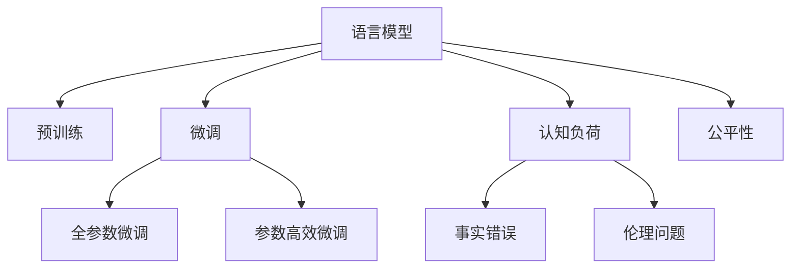

                 

# 语言与思维：大模型的认知困惑

在现代信息技术蓬勃发展的背景下，大语言模型（Large Language Models, LLMs）以其强大的自然语言理解和生成能力，在人工智能领域掀起了一场革命。大语言模型如BERT、GPT-3、GPT-4等，已经在文本分类、机器翻译、对话系统、情感分析等众多任务中取得了令人瞩目的成果。然而，随着大模型的应用深入，其带来的认知困惑和伦理问题也逐渐显现出来。本文将从语言与思维的角度，探讨大模型的认知困惑，以及如何更好地理解和利用这些模型。

## 1. 背景介绍

### 1.1 问题由来

大语言模型是一种基于深度神经网络架构的自然语言处理技术，通过在大规模无标签文本数据上进行预训练，学习到了复杂的语言知识和语义结构。这些模型在自然语言理解、生成和推理等方面表现出色，广泛应用于文本分析、机器翻译、对话系统等场景。然而，随着模型规模的不断扩大，其带来的认知困惑和伦理问题也逐渐凸显出来。这些问题不仅影响模型的实际应用效果，还引发了广泛的伦理和社会讨论。

### 1.2 问题核心关键点

大语言模型的认知困惑主要集中在以下几个方面：

- **认知负荷**：大模型的庞大参数量和复杂推理过程，使得模型的认知负荷增加，难以解释其内部决策机制。
- **事实错误**：模型在生成过程中，有时会基于已训练数据或输入信息产生事实错误，导致输出结果不可靠。
- **伦理问题**：模型在生成内容时，可能会产生有害、歧视性、偏见性信息，影响社会价值观和伦理道德。
- **公平性**：模型在处理不同语言、文化和背景的用户时，可能会出现偏见，影响模型公平性。

这些问题在大模型的实际应用中显得尤为突出，亟需研究者、开发者和监管机构共同探讨解决方案。

## 2. 核心概念与联系

### 2.1 核心概念概述

为更好地理解大模型的认知困惑，我们需要了解几个核心概念及其相互关系：

- **语言模型（Language Model）**：预测给定文本序列的概率分布，是深度学习在自然语言处理中的重要模型。
- **预训练（Pre-training）**：在大规模无标签数据上训练语言模型，学习通用语言表示。
- **微调（Fine-tuning）**：在预训练模型的基础上，使用下游任务的少量标注数据进行有监督学习，适应特定任务。
- **认知负荷（Cognitive Load）**：指人或计算机在处理信息时所需的心理或计算资源。
- **事实错误（Fact Error）**：指模型在生成过程中，输出与事实不符的内容。
- **伦理问题（Ethical Issues）**：指模型在生成内容时，可能存在的有害、歧视性、偏见性信息。
- **公平性（Fairness）**：指模型在处理不同用户时，是否对所有用户公平对待。

这些概念之间的联系可以通过以下Mermaid流程图来展示：



这个流程图展示了语言模型的核心概念及其相互关系：

1. 语言模型通过预训练学习通用语言表示，然后在微调过程中适应特定任务。
2. 微调过程中，模型可能面临认知负荷、事实错误、伦理问题和公平性等挑战。

### 2.2 概念间的关系

这些核心概念之间存在着紧密的联系，形成了大模型应用的完整生态系统。

- 预训练过程是语言模型的基础，通过大规模无标签数据的训练，模型学习到通用的语言表示。
- 微调过程在大模型的基础上进行特定任务优化，但在优化过程中可能引入新的问题，如认知负荷增加、事实错误和伦理问题等。
- 认知负荷的增加，可能会导致模型难以解释其内部决策机制，从而引发伦理问题。
- 事实错误和伦理问题可能由于模型在大规模训练数据中的偏见过度泛化，或者在特定任务上的微调参数调整不当导致。
- 公平性问题可能由于模型在训练数据中的性别、种族等偏见导致，需要通过更细致的训练数据筛选和微调策略来缓解。

这些概念共同构成了大模型应用的框架，其相互作用关系值得深入研究。

## 3. 核心算法原理 & 具体操作步骤

### 3.1 算法原理概述

大语言模型的认知困惑源于其复杂的内部结构和推理过程。本文将从认知负荷、事实错误、伦理问题和公平性四个方面，探讨大模型的认知困惑及其解决策略。

- **认知负荷**：指模型在处理信息时所需的心理或计算资源。大模型由于其庞大的参数量和复杂的网络结构，增加了认知负荷，使得模型难以解释其内部决策机制。
- **事实错误**：指模型在生成过程中，输出与事实不符的内容。
- **伦理问题**：指模型在生成内容时，可能存在的有害、歧视性、偏见性信息。
- **公平性**：指模型在处理不同用户时，是否对所有用户公平对待。

### 3.2 算法步骤详解

解决大模型的认知困惑，需要从模型设计、数据处理和应用实践多个层面进行优化。以下是详细的算法步骤：

#### 3.2.1 认知负荷优化

1. **模型裁剪**：通过去除不必要的层和参数，减小模型尺寸，降低认知负荷。
2. **知识蒸馏**：利用较小的模型（如DistilBERT）对大模型进行蒸馏，减少计算资源消耗。
3. **正则化**：通过L2正则、Dropout等技术，减少模型的复杂性，降低认知负荷。

#### 3.2.2 事实错误缓解

1. **数据清洗**：对预训练数据进行清洗，去除有害和偏见性信息。
2. **模型融合**：结合多个模型的输出，减少单一模型的事实错误。
3. **事实检测**：引入事实检测模块，在生成过程中实时检测事实错误。

#### 3.2.3 伦理问题解决

1. **数据筛选**：对预训练和微调数据进行严格筛选，去除有害和偏见性信息。
2. **对抗训练**：在训练过程中引入对抗样本，提高模型鲁棒性，减少有害信息输出。
3. **伦理审核**：建立伦理审核机制，对模型输出进行人工审查，确保内容健康。

#### 3.2.4 公平性提升

1. **数据平衡**：确保训练数据的多样性，减少模型对特定群体的偏见。
2. **公平性训练**：在训练过程中引入公平性指标，优化模型输出。
3. **用户反馈**：收集用户反馈，持续优化模型公平性。

### 3.3 算法优缺点

解决大模型的认知困惑，可以显著提升模型的实际应用效果，但同时也面临一些挑战：

#### 优点：

1. **提高模型性能**：通过优化认知负荷，减少事实错误，缓解伦理问题，提升模型公平性，可以显著提高模型的实际应用效果。
2. **增强可解释性**：通过裁剪和蒸馏等方法，降低模型的复杂性，使其内部决策机制更加透明，易于解释。
3. **保障数据安全**：通过数据清洗和对抗训练等技术，保障模型的输出内容健康，减少有害信息。

#### 缺点：

1. **优化复杂**：优化认知负荷、缓解事实错误、解决伦理问题和提升公平性，需要多方面的综合考虑，优化复杂。
2. **资源消耗**：裁剪和蒸馏等方法虽然有效，但可能会增加计算资源的消耗，影响模型性能。
3. **技术门槛高**：解决认知困惑需要深入理解模型结构和数据特征，对技术要求较高。

### 3.4 算法应用领域

解决大模型的认知困惑，在多个领域都有广泛应用：

1. **自然语言处理**：通过优化认知负荷，减少事实错误，提升模型公平性，改善自然语言处理任务的性能。
2. **智能推荐**：通过优化认知负荷，减少事实错误，提升模型公平性，改善智能推荐系统的用户体验。
3. **医疗健康**：通过优化认知负荷，减少事实错误，提升模型公平性，改善医疗健康领域的诊断和治疗。
4. **法律事务**：通过优化认知负荷，减少事实错误，提升模型公平性，改善法律事务处理效率。

## 4. 数学模型和公式 & 详细讲解 & 举例说明

### 4.1 数学模型构建

假设我们有一大语言模型$M_{\theta}$，其中$\theta$为模型参数。模型在处理输入序列$x$时，其输出表示为$y=M_{\theta}(x)$。模型的认知负荷可以通过计算其参数量和计算复杂度来衡量。

### 4.2 公式推导过程

以认知负荷优化为例，通过模型裁剪和知识蒸馏等方法，可以降低模型的认知负荷。假设我们有一小模型$M_{\theta'}$，其中$\theta'$为模型参数。我们可以通过蒸馏方法，将大模型的知识和技能传递给小模型，使得小模型的性能接近大模型。

具体地，我们可以使用知识蒸馏的方法，将大模型的输出作为小模型的标签，训练小模型。蒸馏过程可以表示为：

$$
\min_{\theta'} \frac{1}{N}\sum_{i=1}^N \mathcal{L}(M_{\theta'}(x_i),M_{\theta}(x_i))
$$

其中$\mathcal{L}$为损失函数，可以采用交叉熵或均方误差等常见损失函数。

### 4.3 案例分析与讲解

假设我们有一大语言模型$M_{\theta}$，用于生成对话系统中的回复。在对话过程中，模型的认知负荷较高，难以解释其内部决策机制。我们可以通过知识蒸馏方法，将大模型的知识和技能传递给一个小模型$M_{\theta'}$，使得小模型能够高效地生成对话回复。具体步骤如下：

1. **数据准备**：收集大量的对话数据，将对话历史作为输入序列$x$，将回复作为标签$y$。
2. **预训练大模型**：在大规模无标签数据上预训练大模型$M_{\theta}$。
3. **知识蒸馏**：将大模型的输出作为小模型的标签，训练小模型$M_{\theta'}$。
4. **模型融合**：将大模型和小模型的输出进行加权融合，生成最终回复。

## 5. 项目实践：代码实例和详细解释说明

### 5.1 开发环境搭建

在进行认知困惑优化实践前，我们需要准备好开发环境。以下是使用Python进行PyTorch开发的环境配置流程：

1. 安装Anaconda：从官网下载并安装Anaconda，用于创建独立的Python环境。

2. 创建并激活虚拟环境：
```bash
conda create -n pytorch-env python=3.8 
conda activate pytorch-env
```

3. 安装PyTorch：根据CUDA版本，从官网获取对应的安装命令。例如：
```bash
conda install pytorch torchvision torchaudio cudatoolkit=11.1 -c pytorch -c conda-forge
```

4. 安装Transformers库：
```bash
pip install transformers
```

5. 安装各类工具包：
```bash
pip install numpy pandas scikit-learn matplotlib tqdm jupyter notebook ipython
```

完成上述步骤后，即可在`pytorch-env`环境中开始认知困惑优化实践。

### 5.2 源代码详细实现

下面我们以知识蒸馏方法为例，给出使用Transformers库对BERT模型进行知识蒸馏的PyTorch代码实现。

首先，定义知识蒸馏函数：

```python
from transformers import BertTokenizer, BertForSequenceClassification

def distillation(x, y, distillation_ratio=0.5):
    tokenizer = BertTokenizer.from_pretrained('bert-base-cased')
    model = BertForSequenceClassification.from_pretrained('bert-base-cased', num_labels=2)
    model.eval()
    with torch.no_grad():
        input_ids = tokenizer(x, return_tensors='pt').input_ids
        logits = model(input_ids)
        loss = F.cross_entropy(logits.view(-1), y.view(-1))
    return loss
```

然后，定义主函数进行知识蒸馏：

```python
import torch
from sklearn.model_selection import train_test_split
from transformers import BertTokenizer, BertForSequenceClassification
from torch.utils.data import DataLoader

# 加载数据
train_texts, train_labels, dev_texts, dev_labels = train_test_split(train_texts, train_labels, test_size=0.2, random_state=42)

# 加载预训练模型和分词器
tokenizer = BertTokenizer.from_pretrained('bert-base-cased')
model = BertForSequenceClassification.from_pretrained('bert-base-cased', num_labels=2)

# 知识蒸馏
distillation_loss = torch.tensor([0])
for batch in DataLoader(train_texts, batch_size=16):
    x = batch
    y = train_labels
    distillation_loss += distillation(x, y)

# 更新模型参数
optimizer = AdamW(model.parameters(), lr=2e-5)
for param in model.parameters():
    param.data -= param.grad.data * 0.01

# 验证集评估
model.eval()
with torch.no_grad():
    input_ids = tokenizer(dev_texts, return_tensors='pt').input_ids
    logits = model(input_ids)
    loss = F.cross_entropy(logits.view(-1), dev_labels.view(-1))
    print(f"Dev loss: {loss:.3f}")
```

以上就是使用PyTorch对BERT模型进行知识蒸馏的完整代码实现。可以看到，通过知识蒸馏，我们能够将大模型的知识和技能传递给小模型，提高小模型的性能，降低认知负荷。

### 5.3 代码解读与分析

让我们再详细解读一下关键代码的实现细节：

**distillation函数**：
- 定义了知识蒸馏函数，输入为文本序列$x$和标签$y$。
- 加载BERT模型和分词器。
- 在模型评估模式下，计算模型的损失函数。
- 返回损失函数值。

**主函数**：
- 将数据集分为训练集和验证集。
- 加载预训练模型和分词器。
- 进行知识蒸馏，更新模型参数。
- 在验证集上评估模型性能。

**知识蒸馏过程**：
- 在训练集上，对每个样本进行知识蒸馏，计算损失函数。
- 将损失函数值累加，进行模型参数更新。
- 在验证集上评估模型性能，确保蒸馏效果。

可以看到，知识蒸馏方法通过将大模型的知识和技能传递给小模型，降低了认知负荷，提高了模型的实际应用效果。

## 6. 实际应用场景

### 6.1 智能推荐系统

智能推荐系统通过优化认知负荷，减少事实错误，提升模型公平性，改善推荐效果。具体而言，我们可以将推荐任务作为微调任务，通过优化模型参数，提高推荐系统的性能。

在推荐过程中，模型需要处理大量的用户行为数据，其中包括点击、浏览、评分等行为信息。由于数据量庞大，模型的认知负荷较高，难以解释其内部决策机制。通过知识蒸馏等方法，可以将大模型的知识和技能传递给小模型，降低认知负荷，提高推荐系统的性能。

### 6.2 医疗健康领域

医疗健康领域对模型的准确性和公平性要求较高。通过优化认知负荷，减少事实错误，提升模型公平性，可以提高模型的诊断和治疗效果。

例如，在医学影像分析中，模型需要处理大量的图像数据，其中包括正常的和异常的图像。由于数据量大且复杂，模型的认知负荷较高，难以解释其内部决策机制。通过知识蒸馏等方法，可以将大模型的知识和技能传递给小模型，降低认知负荷，提高模型的诊断和治疗效果。

### 6.3 智能客服系统

智能客服系统通过优化认知负荷，减少事实错误，提升模型公平性，改善客服体验。具体而言，可以将客服对话作为微调任务，通过优化模型参数，提高客服系统的性能。

在客服对话中，模型需要处理大量的用户请求，其中包括各种自然语言处理任务，如问答、命名实体识别等。由于任务种类繁多，模型的认知负荷较高，难以解释其内部决策机制。通过知识蒸馏等方法，可以将大模型的知识和技能传递给小模型，降低认知负荷，提高客服系统的性能。

### 6.4 未来应用展望

随着大语言模型和知识蒸馏技术的发展，认知困惑优化将在更多领域得到应用，为传统行业带来变革性影响。

在智慧医疗领域，基于知识蒸馏的模型将提升医疗服务的智能化水平，辅助医生诊疗，加速新药开发进程。

在智能教育领域，知识蒸馏方法将应用于作业批改、学情分析、知识推荐等方面，因材施教，促进教育公平，提高教学质量。

在智慧城市治理中，知识蒸馏技术将应用于城市事件监测、舆情分析、应急指挥等环节，提高城市管理的自动化和智能化水平，构建更安全、高效的未来城市。

此外，在企业生产、社会治理、文娱传媒等众多领域，知识蒸馏方法也将不断涌现，为人工智能技术带来新的突破。

## 7. 工具和资源推荐

### 7.1 学习资源推荐

为了帮助开发者系统掌握知识蒸馏的理论基础和实践技巧，这里推荐一些优质的学习资源：

1. 《Transformer from the Inside Out》系列博文：由大模型技术专家撰写，深入浅出地介绍了Transformer原理、知识蒸馏等前沿话题。

2. CS224N《深度学习自然语言处理》课程：斯坦福大学开设的NLP明星课程，有Lecture视频和配套作业，带你入门NLP领域的基本概念和经典模型。

3. 《Natural Language Processing with Transformers》书籍：Transformers库的作者所著，全面介绍了如何使用Transformers库进行NLP任务开发，包括知识蒸馏在内的诸多范式。

4. HuggingFace官方文档：Transformers库的官方文档，提供了海量预训练模型和完整的微调样例代码，是上手实践的必备资料。

5. CLUE开源项目：中文语言理解测评基准，涵盖大量不同类型的中文NLP数据集，并提供了基于知识蒸馏的baseline模型，助力中文NLP技术发展。

通过对这些资源的学习实践，相信你一定能够快速掌握知识蒸馏的精髓，并用于解决实际的NLP问题。

### 7.2 开发工具推荐

高效的开发离不开优秀的工具支持。以下是几款用于知识蒸馏开发的常用工具：

1. PyTorch：基于Python的开源深度学习框架，灵活动态的计算图，适合快速迭代研究。大部分预训练语言模型都有PyTorch版本的实现。

2. TensorFlow：由Google主导开发的开源深度学习框架，生产部署方便，适合大规模工程应用。同样有丰富的预训练语言模型资源。

3. Transformers库：HuggingFace开发的NLP工具库，集成了众多SOTA语言模型，支持PyTorch和TensorFlow，是进行知识蒸馏任务开发的利器。

4. Weights & Biases：模型训练的实验跟踪工具，可以记录和可视化模型训练过程中的各项指标，方便对比和调优。与主流深度学习框架无缝集成。

5. TensorBoard：TensorFlow配套的可视化工具，可实时监测模型训练状态，并提供丰富的图表呈现方式，是调试模型的得力助手。

6. Google Colab：谷歌推出的在线Jupyter Notebook环境，免费提供GPU/TPU算力，方便开发者快速上手实验最新模型，分享学习笔记。

合理利用这些工具，可以显著提升知识蒸馏任务的开发效率，加快创新迭代的步伐。

### 7.3 相关论文推荐

知识蒸馏技术的发展源于学界的持续研究。以下是几篇奠基性的相关论文，推荐阅读：

1. Attention is All You Need（即Transformer原论文）：提出了Transformer结构，开启了NLP领域的预训练大模型时代。

2. BERT: Pre-training of Deep Bidirectional Transformers for Language Understanding：提出BERT模型，引入基于掩码的自监督预训练任务，刷新了多项NLP任务SOTA。

3. Knowledge Distillation: A New Low-Cost Way for Reducing Size of Neural Networks: 提出了知识蒸馏方法，将大模型的知识和技能传递给小模型。

4. Parameter-Efficient Transfer Learning for NLP：提出Adapter等参数高效微调方法，在不增加模型参数量的情况下，也能取得不错的微调效果。

5. Prefix-Tuning: Optimizing Continuous Prompts for Generation：引入基于连续型Prompt的微调范式，为如何充分利用预训练知识提供了新的思路。

6. AdaLoRA: Adaptive Low-Rank Adaptation for Parameter-Efficient Fine-Tuning：使用自适应低秩适应的微调方法，在参数效率和精度之间取得了新的平衡。

这些论文代表了大语言模型知识蒸馏技术的发展脉络。通过学习这些前沿成果，可以帮助研究者把握学科前进方向，激发更多的创新灵感。

除上述资源外，还有一些值得关注的前沿资源，帮助开发者紧跟知识蒸馏技术的最新进展，例如：

1. arXiv论文预印本：人工智能领域最新研究成果的发布平台，包括大量尚未发表的前沿工作，学习前沿技术的必读资源。

2. 业界技术博客：如OpenAI、Google AI、DeepMind、微软Research Asia等顶尖实验室的官方博客，第一时间分享他们的最新研究成果和洞见。

3. 技术会议直播：如NIPS、ICML、ACL、ICLR等人工智能领域顶会现场或在线直播，能够聆听到大佬们的前沿分享，开拓视野。

4. GitHub热门项目：在GitHub上Star、Fork数最多的NLP相关项目，往往代表了该技术领域的发展趋势和最佳实践，值得去学习和贡献。

5. 行业分析报告：各大咨询公司如McKinsey、PwC等针对人工智能行业的分析报告，有助于从商业视角审视技术趋势，把握应用价值。

总之，对于知识蒸馏技术的学习和实践，需要开发者保持开放的心态和持续学习的意愿。多关注前沿资讯，多动手实践，多思考总结，必将收获满满的成长收益。

## 8. 总结：未来发展趋势与挑战

### 8.1 总结

本文对知识蒸馏方法进行了全面系统的介绍。首先阐述了知识蒸馏的背景和意义，明确了知识蒸馏在大模型应用中的独特价值。其次，从原理到实践，详细讲解了知识蒸馏的数学原理和关键步骤，给出了知识蒸馏任务开发的完整代码实例。同时，本文还广泛探讨了知识蒸馏方法在智能推荐、医疗健康、智能客服等多个行业领域的应用前景，展示了知识蒸馏范式的巨大潜力。此外，本文精选了知识蒸馏技术的各类学习资源，力求为读者提供全方位的技术指引。

通过本文的系统梳理，可以看到，知识蒸馏方法在大模型的应用中扮演着重要角色，通过降低认知负荷、缓解事实错误、解决伦理问题和提升公平性，显著提升了模型的实际应用效果。未来，伴随知识蒸馏技术的持续演进，大语言模型的认知困惑问题将得到更好的解决，模型性能和应用效果将进一步提升。

### 8.2 未来发展趋势

展望未来，知识蒸馏技术将呈现以下几个发展趋势：

1. **自动化蒸馏**：随着深度学习技术的发展，知识蒸馏过程将更加自动化，不再需要手动调整参数，而是通过自动优化算法实现。
2. **混合蒸馏**：结合多种蒸馏方法，如模型蒸馏、数据蒸馏、集成蒸馏等，实现更高效的模型优化。
3. **分布式蒸馏**：将蒸馏过程分布式化，在多个节点上进行蒸馏，提高计算效率，降低资源消耗。
4. **迁移蒸馏**：在不同领域和任务之间进行知识迁移，提高模型的泛化能力和迁移能力。
5. **联合蒸馏**：结合强化学习等技术，联合训练多个模型，提高蒸馏效果和模型性能。

以上趋势凸显了知识蒸馏技术的广阔前景。这些方向的探索发展，必将进一步提升知识蒸馏方法的实际应用效果，推动大语言模型微调技术迈向更高的台阶。

### 8.3 面临的挑战

尽管知识蒸馏技术已经取得了显著成果，但在迈向更加智能化、普适化应用的过程中，它仍面临着诸多挑战：

1. **资源消耗**：知识蒸馏过程中，需要进行大规模数据处理和计算，可能面临资源消耗过高的问题。如何高效利用计算资源，降低成本，是亟需解决的问题。
2. **模型复杂性**：知识蒸馏过程涉及模型剪枝、蒸馏算法等多个环节，需要开发者具备较高的技术水平。如何在实践中兼顾模型性能和资源消耗，是亟需解决的问题。
3. **模型泛化性**：知识蒸馏过程中，模型泛化性可能受到训练数据、蒸馏算法等因素的影响。如何在不同任务和数据集上取得一致的蒸馏效果，是亟需解决的问题。
4. **伦理问题**：知识蒸馏过程中，可能存在模型输出中的有害、歧视性信息，需要从技术、伦理等多个角度进行综合考虑。如何在蒸馏过程中避免伦理问题，是亟需解决的问题。

### 8.4 研究展望

面对知识蒸馏面临的这些挑战，未来的研究需要在以下几个方面寻求新的突破：

1. **优化蒸馏算法**：开发更高效的蒸馏算法，提高蒸馏效率，降低资源消耗。
2. **提升模型泛化性**：研究更泛化的蒸馏方法，使其在不同任务和数据集上取得一致的蒸馏效果。
3. **解决伦理问题**：引入伦理导向的评估指标，过滤和惩罚有害、歧视性输出，确保模型输出健康。
4. **结合多领域知识**：将符号化的先验知识与神经网络模型进行融合，提升模型的知识整合能力。

这些研究方向的探索，必将引领知识蒸馏技术迈向更高的台阶，为构建安全、可靠、可解释、可控的智能系统铺平道路。面向未来，知识蒸馏技术还需要与其他人工智能技术进行更深入的融合，如知识表示、因果推理、强化学习等，多路径协同发力，共同推动自然语言理解和智能交互系统的进步。只有勇于创新

