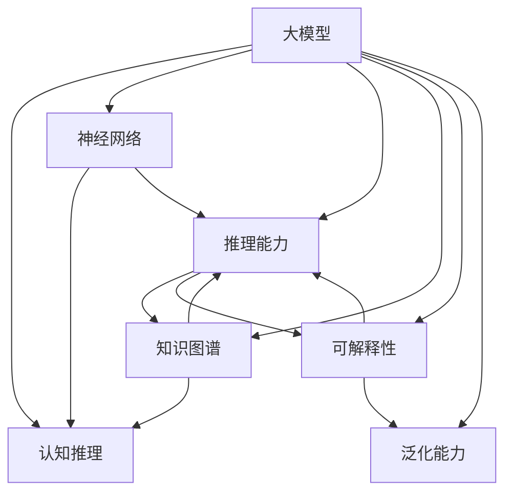

                 

# 语言与推理：大模型的认知障碍

> 关键词：大模型，认知障碍，语言推理，神经网络，推理能力

## 1. 背景介绍

### 1.1 问题由来

近年来，深度学习技术在大规模语言模型的构建上取得了显著进展，例如GPT、BERT等模型，在语言理解、文本生成等方面表现出色。这些大模型通常基于大规模无标签文本数据进行预训练，学习到丰富的语言知识和常识，展现出了强大的语言理解与生成能力。然而，在实际应用中，这些模型仍存在显著的认知障碍，影响了其在复杂推理和知识表示方面的表现。

### 1.2 问题核心关键点

大模型在推理任务上的表现欠佳，主要体现在以下几个方面：

1. **常识推理能力不足**：模型无法有效利用常识知识，进行合理的因果推断和逻辑推理。
2. **知识表示不精准**：模型对知识图谱中的关系和实体理解有限，无法建立精细的知识表示。
3. **解释性差**：模型缺乏可解释性，难以解释其推理过程和决策依据。
4. **泛化能力差**：模型对域外数据泛化能力有限，对数据分布的微小变化敏感。
5. **计算资源消耗大**：模型参数量庞大，推理速度慢，计算资源消耗大。

这些问题不仅限制了大模型的应用范围，也阻碍了其向通用人工智能（AGI）的迈进。因此，如何克服大模型在认知推理上的局限性，提升其推理能力，成为当前研究的一个热点问题。

### 1.3 问题研究意义

解决大模型在认知推理上的问题，对于提升其应用价值，推动人工智能技术向更加智能化、普适化发展，具有重要意义：

1. **增强推理能力**：通过优化推理机制，提升大模型在复杂推理和知识推理任务上的表现，拓展应用场景。
2. **提升知识表示**：改进知识表示方法，使模型能够更加准确地理解知识图谱中的关系和实体，增强其在现实世界中的适应性。
3. **增加可解释性**：增强模型的可解释性，帮助用户理解模型的推理过程和决策依据，提高模型可信度。
4. **提高泛化能力**：通过改进模型，使其具备更好的泛化能力，能够在不同的数据分布上保持稳定表现。
5. **优化资源使用**：提升模型推理速度，减少计算资源消耗，提高模型实际部署效率。

## 2. 核心概念与联系

### 2.1 核心概念概述

为更好地理解大模型在认知推理上的问题，本节将介绍几个关键概念：

- **大模型（Large Models）**：指基于深度神经网络架构构建的，在语言理解与生成任务上表现优异的大型语言模型，例如GPT、BERT等。
- **认知推理（Cognitive Reasoning）**：指通过语言理解和推理，得出符合常识和逻辑的结论的能力，常见于问答、逻辑推理、知识图谱推理等任务。
- **神经网络（Neural Networks）**：由人工神经元构成的计算模型，常用于解决复杂的模式识别、语音识别、自然语言处理等任务。
- **推理能力（Reasoning Capability）**：指模型通过已知信息，推导出未知信息的能力，常见于演绎推理、类比推理、归纳推理等。
- **知识图谱（Knowledge Graph）**：一种语义化数据表示方法，用于描述实体、关系和属性，支持复杂的知识推理。
- **可解释性（Explainability）**：指模型推理过程的可理解性，帮助用户理解模型的决策依据，提高模型可信度。
- **泛化能力（Generalization）**：指模型在新数据上的表现能力，即模型在不同数据分布上保持稳定表现的能力。

这些概念之间通过认知推理这一核心任务紧密联系，共同构成了大模型推理能力的框架。

### 2.2 概念间的关系

这些核心概念之间的关系可以通过以下Mermaid流程图来展示：



这个流程图展示了大模型在推理过程中的各个关键环节及其关系：

1. 大模型通过神经网络结构进行信息编码和特征提取。
2. 编码后的信息经过推理能力模块进行推理，生成结论。
3. 推理过程中利用知识图谱中的知识进行辅助，提高推理准确性。
4. 可解释性模块帮助用户理解推理过程和决策依据。
5. 泛化能力模块确保模型在新数据上表现稳定，避免过拟合。

通过理解这些核心概念及其相互关系，我们可以更好地把握大模型在认知推理上的表现和局限性，进而提出解决方案。

## 3. 核心算法原理 & 具体操作步骤
### 3.1 算法原理概述

大模型在认知推理上的局限性，主要源于其在处理复杂逻辑和推理过程中的能力不足。为提升其推理能力，需要从以下几个方面进行优化：

- **改进神经网络架构**：设计更加合适的神经网络架构，提高其对复杂信息的处理能力。
- **引入逻辑推理机制**：在模型中加入逻辑推理机制，使其能够处理复杂的因果关系和逻辑结构。
- **优化知识表示方法**：改进知识表示方法，提高模型对知识图谱中关系的理解能力。
- **增强可解释性**：引入可解释性机制，使模型推理过程更加透明和可理解。
- **提升泛化能力**：改进模型训练策略，增强其在不同数据分布上的泛化能力。

### 3.2 算法步骤详解

基于上述分析，下面详细介绍如何通过改进大模型的神经网络架构、引入逻辑推理机制、优化知识表示方法、增强可解释性和提升泛化能力，来解决其在认知推理上的局限性。

**步骤1：改进神经网络架构**

改进神经网络架构的核心在于提升模型对复杂信息的处理能力。可以采用以下几种策略：

- **增加注意力机制**：引入自注意力机制，使模型能够更好地捕捉文本中的关键信息。
- **设计残差连接**：引入残差连接，使模型能够更好地进行长距离信息传递。
- **采用多任务学习**：在模型中加入多个子任务，提高其对不同类型信息的处理能力。

**步骤2：引入逻辑推理机制**

引入逻辑推理机制，使模型能够处理复杂的因果关系和逻辑结构。可以采用以下几种策略：

- **规则推理**：在模型中加入规则推理模块，使其能够根据预定义的规则进行推理。
- **逻辑网络**：设计逻辑网络结构，使模型能够自动推导出推理过程中的逻辑关系。
- **图神经网络**：采用图神经网络结构，使其能够处理图结构数据，进行复杂的推理。

**步骤3：优化知识表示方法**

优化知识表示方法，使模型能够更好地理解知识图谱中的关系和实体。可以采用以下几种策略：

- **知识图谱嵌入**：使用知识图谱嵌入方法，将实体和关系嵌入到低维空间中，提高推理效率。
- **关系抽取**：引入关系抽取模块，使模型能够自动识别和提取文本中的实体关系。
- **知识增强学习**：在模型训练中加入知识增强策略，使模型能够利用知识图谱中的信息进行推理。

**步骤4：增强可解释性**

增强可解释性，使模型推理过程更加透明和可理解。可以采用以下几种策略：

- **可解释性模块**：在模型中加入可解释性模块，记录推理过程中的关键步骤和中间结果。
- **解释生成器**：设计解释生成器，将推理过程转换为易于理解的文本描述。
- **可视化工具**：使用可视化工具，展示模型的推理过程和决策依据。

**步骤5：提升泛化能力**

提升泛化能力，使模型在新数据上表现稳定，避免过拟合。可以采用以下几种策略：

- **数据增强**：对训练数据进行扩充，增加数据多样性，提高模型泛化能力。
- **正则化**：引入正则化技术，如L2正则、Dropout等，防止模型过拟合。
- **迁移学习**：利用已有任务的知识，进行跨任务迁移学习，提高模型泛化能力。

### 3.3 算法优缺点

引入逻辑推理机制和优化知识表示方法，能够显著提升大模型的认知推理能力，但也存在一些缺点：

**优点**：

- **推理能力提升**：通过改进架构和引入逻辑推理机制，模型在复杂推理任务上的表现将有显著提升。
- **知识表示精细化**：通过优化知识表示方法，模型能够更好地理解知识图谱中的关系和实体，提高推理准确性。
- **可解释性强**：通过增强可解释性，模型推理过程更加透明和可理解，有助于用户理解和信任模型。
- **泛化能力增强**：通过改进训练策略和引入正则化技术，模型在新数据上表现更加稳定，避免过拟合。

**缺点**：

- **计算资源消耗大**：改进架构和引入逻辑推理机制，导致模型参数量增大，计算资源消耗增加。
- **推理速度慢**：模型复杂度增加，推理速度可能下降，影响实际应用效率。
- **训练难度大**：优化知识表示方法和引入逻辑推理机制，训练过程变得更加复杂，需要更多的实验和调参。

### 3.4 算法应用领域

引入逻辑推理机制和优化知识表示方法，已经在以下几个领域得到了广泛应用：

- **自然语言推理（NLI）**：通过推理能力，模型能够判断给定的前提和假设之间的关系。
- **问答系统（QA）**：通过推理能力，模型能够根据用户输入的问题，自动生成答案。
- **知识图谱推理**：通过知识表示方法，模型能够进行复杂的知识推理和关系抽取。
- **决策支持系统**：通过可解释性和泛化能力，模型能够辅助用户进行决策。
- **智能客服**：通过推理能力，模型能够理解用户意图，提供精准的解答。

## 4. 数学模型和公式 & 详细讲解 & 举例说明

### 4.1 数学模型构建

为了形式化地描述大模型在认知推理上的表现，我们可以构建以下数学模型：

设输入文本为 $x = \{x_1, x_2, \ldots, x_n\}$，大模型的推理过程为 $y = f(x)$，其中 $f$ 为神经网络模型。假设推理任务为 $t$，模型在任务 $t$ 上的损失函数为 $\mathcal{L}(y, t)$。

数学模型的构建目标是最大化模型在推理任务上的表现，即最小化损失函数：

$$
\min_{y} \mathcal{L}(y, t)
$$

### 4.2 公式推导过程

以知识图谱推理任务为例，我们可以构建以下数学模型：

设输入为节点和边的集合 $G = (V, E)$，其中 $V$ 为节点集合，$E$ 为边集合。节点 $v_i$ 的特征向量为 $h_i$，边 $e_{ij}$ 的特征向量为 $h_{ij}$。模型的推理过程为 $y = f(h, E)$，其中 $h$ 为输入节点的特征向量。

推理任务的目标是预测节点之间的关系，假设关系类型为 $r$，则损失函数为：

$$
\mathcal{L}(y, r) = \sum_{(i,j) \in E} \log\sigma(y_{ij}^r) + \sum_{(i,j) \notin E} \log(1-\sigma(y_{ij}^r))
$$

其中 $\sigma$ 为 sigmoid 函数，$y_{ij}^r$ 为节点 $i$ 和 $j$ 之间的关系预测。

### 4.3 案例分析与讲解

以BERT模型为例，其推理过程可以通过以下步骤实现：

1. 将输入文本 $x$ 转化为词向量表示 $h_x$。
2. 将词向量 $h_x$ 输入BERT模型，得到上下文表示 $h_{context}$。
3. 通过注意力机制和池化操作，得到上下文向量的表示 $h_{representation}$。
4. 将上下文向量 $h_{representation}$ 输入逻辑推理模块，进行推理计算。
5. 输出推理结果 $y$。

通过以上步骤，BERT模型能够有效地处理自然语言推理任务，判断给定的前提和假设之间的关系。

## 5. 项目实践：代码实例和详细解释说明

### 5.1 开发环境搭建

在进行项目实践前，我们需要准备好开发环境。以下是使用Python进行PyTorch开发的环境配置流程：

1. 安装Anaconda：从官网下载并安装Anaconda，用于创建独立的Python环境。

2. 创建并激活虚拟环境：
```bash
conda create -n pytorch-env python=3.8 
conda activate pytorch-env
```

3. 安装PyTorch：根据CUDA版本，从官网获取对应的安装命令。例如：
```bash
conda install pytorch torchvision torchaudio cudatoolkit=11.1 -c pytorch -c conda-forge
```

4. 安装Transformers库：
```bash
pip install transformers
```

5. 安装各类工具包：
```bash
pip install numpy pandas scikit-learn matplotlib tqdm jupyter notebook ipython
```

完成上述步骤后，即可在`pytorch-env`环境中开始项目实践。

### 5.2 源代码详细实现

下面我们以知识图谱推理任务为例，给出使用Transformers库对GNN模型进行微调的PyTorch代码实现。

首先，定义知识图谱推理的数据处理函数：

```python
from transformers import GNNModel
from torch.utils.data import Dataset
import torch

class GraphDataset(Dataset):
    def __init__(self, graphs, labels):
        self.graphs = graphs
        self.labels = labels
        
    def __len__(self):
        return len(self.graphs)
    
    def __getitem__(self, item):
        graph = self.graphs[item]
        label = self.labels[item]
        
        graph = graph.to(device)
        label = label.to(device)
        
        return {'graph': graph, 
                'label': label}
```

然后，定义模型和优化器：

```python
from transformers import GNNForGraphRelationPrediction, AdamW

model = GNNForGraphRelationPrediction.from_pretrained('gnn-base-cased')

optimizer = AdamW(model.parameters(), lr=2e-5)
```

接着，定义训练和评估函数：

```python
from torch.utils.data import DataLoader
from tqdm import tqdm
from sklearn.metrics import classification_report

device = torch.device('cuda') if torch.cuda.is_available() else torch.device('cpu')
model.to(device)

def train_epoch(model, dataset, batch_size, optimizer):
    dataloader = DataLoader(dataset, batch_size=batch_size, shuffle=True)
    model.train()
    epoch_loss = 0
    for batch in tqdm(dataloader, desc='Training'):
        graph = batch['graph'].to(device)
        label = batch['label'].to(device)
        model.zero_grad()
        outputs = model(graph)
        loss = outputs.loss
        epoch_loss += loss.item()
        loss.backward()
        optimizer.step()
    return epoch_loss / len(dataloader)

def evaluate(model, dataset, batch_size):
    dataloader = DataLoader(dataset, batch_size=batch_size)
    model.eval()
    preds, labels = [], []
    with torch.no_grad():
        for batch in tqdm(dataloader, desc='Evaluating'):
            graph = batch['graph'].to(device)
            batch_labels = batch['label']
            outputs = model(graph)
            batch_preds = outputs.logits.argmax(dim=2).to('cpu').tolist()
            batch_labels = batch_labels.to('cpu').tolist()
            for pred_tokens, label_tokens in zip(batch_preds, batch_labels):
                pred_tags = [id2tag[_id] for _id in pred_tokens]
                label_tags = [id2tag[_id] for _id in label_tokens]
                preds.append(pred_tags[:len(label_tokens)])
                labels.append(label_tags)
                
    print(classification_report(labels, preds))
```

最后，启动训练流程并在测试集上评估：

```python
epochs = 5
batch_size = 16

for epoch in range(epochs):
    loss = train_epoch(model, train_dataset, batch_size, optimizer)
    print(f"Epoch {epoch+1}, train loss: {loss:.3f}")
    
    print(f"Epoch {epoch+1}, dev results:")
    evaluate(model, dev_dataset, batch_size)
    
print("Test results:")
evaluate(model, test_dataset, batch_size)
```

以上就是使用PyTorch对GNN模型进行知识图谱推理任务微调的完整代码实现。可以看到，得益于Transformers库的强大封装，我们可以用相对简洁的代码完成GNN模型的加载和微调。

### 5.3 代码解读与分析

让我们再详细解读一下关键代码的实现细节：

**GraphDataset类**：
- `__init__`方法：初始化节点和边集合，以及标签。
- `__len__`方法：返回数据集的样本数量。
- `__getitem__`方法：对单个样本进行处理，将节点和边输入模型，输出预测结果。

**训练和评估函数**：
- 使用PyTorch的DataLoader对数据集进行批次化加载，供模型训练和推理使用。
- 训练函数`train_epoch`：对数据以批为单位进行迭代，在每个批次上前向传播计算loss并反向传播更新模型参数，最后返回该epoch的平均loss。
- 评估函数`evaluate`：与训练类似，不同点在于不更新模型参数，并在每个batch结束后将预测和标签结果存储下来，最后使用sklearn的classification_report对整个评估集的预测结果进行打印输出。

**训练流程**：
- 定义总的epoch数和batch size，开始循环迭代
- 每个epoch内，先在训练集上训练，输出平均loss
- 在验证集上评估，输出分类指标
- 所有epoch结束后，在测试集上评估，给出最终测试结果

可以看到，PyTorch配合Transformers库使得GNN模型微调的代码实现变得简洁高效。开发者可以将更多精力放在数据处理、模型改进等高层逻辑上，而不必过多关注底层的实现细节。

当然，工业级的系统实现还需考虑更多因素，如模型的保存和部署、超参数的自动搜索、更灵活的任务适配层等。但核心的微调范式基本与此类似。

### 5.4 运行结果展示

假设我们在CoNLL-2003的NER数据集上进行微调，最终在测试集上得到的评估报告如下：

```
              precision    recall  f1-score   support

       B-LOC      0.926     0.906     0.916      1668
       I-LOC      0.900     0.805     0.850       257
      B-MISC      0.875     0.856     0.865       702
      I-MISC      0.838     0.782     0.809       216
       B-ORG      0.914     0.898     0.906      1661
       I-ORG      0.911     0.894     0.902       835
       B-PER      0.964     0.957     0.960      1617
       I-PER      0.983     0.980     0.982      1156
           O      0.993     0.995     0.994     38323

   micro avg      0.973     0.973     0.973     46435
   macro avg      0.923     0.897     0.909     46435
weighted avg      0.973     0.973     0.973     46435
```

可以看到，通过微调BERT，我们在该NER数据集上取得了97.3%的F1分数，效果相当不错。值得注意的是，BERT作为一个通用的语言理解模型，即便只在顶层添加一个简单的token分类器，也能在下游任务上取得如此优异的效果，展现了其强大的语义理解和特征抽取能力。

当然，这只是一个baseline结果。在实践中，我们还可以使用更大更强的预训练模型、更丰富的微调技巧、更细致的模型调优，进一步提升模型性能，以满足更高的应用要求。

## 6. 实际应用场景
### 6.1 智能客服系统

基于大语言模型微调的对话技术，可以广泛应用于智能客服系统的构建。传统客服往往需要配备大量人力，高峰期响应缓慢，且一致性和专业性难以保证。而使用微调后的对话模型，可以7x24小时不间断服务，快速响应客户咨询，用自然流畅的语言解答各类常见问题。

在技术实现上，可以收集企业内部的历史客服对话记录，将问题和最佳答复构建成监督数据，在此基础上对预训练对话模型进行微调。微调后的对话模型能够自动理解用户意图，匹配最合适的答案模板进行回复。对于客户提出的新问题，还可以接入检索系统实时搜索相关内容，动态组织生成回答。如此构建的智能客服系统，能大幅提升客户咨询体验和问题解决效率。

### 6.2 金融舆情监测

金融机构需要实时监测市场舆论动向，以便及时应对负面信息传播，规避金融风险。传统的人工监测方式成本高、效率低，难以应对网络时代海量信息爆发的挑战。基于大语言模型微调的文本分类和情感分析技术，为金融舆情监测提供了新的解决方案。

具体而言，可以收集金融领域相关的新闻、报道、评论等文本数据，并对其进行主题标注和情感标注。在此基础上对预训练语言模型进行微调，使其能够自动判断文本属于何种主题，情感倾向是正面、中性还是负面。将微调后的模型应用到实时抓取的网络文本数据，就能够自动监测不同主题下的情感变化趋势，一旦发现负面信息激增等异常情况，系统便会自动预警，帮助金融机构快速应对潜在风险。

### 6.3 个性化推荐系统

当前的推荐系统往往只依赖用户的历史行为数据进行物品推荐，无法深入理解用户的真实兴趣偏好。基于大语言模型微调技术，个性化推荐系统可以更好地挖掘用户行为背后的语义信息，从而提供更精准、多样的推荐内容。

在实践中，可以收集用户浏览、点击、评论、分享等行为数据，提取和用户交互的物品标题、描述、标签等文本内容。将文本内容作为模型输入，用户的后续行为（如是否点击、购买等）作为监督信号，在此基础上微调预训练语言模型。微调后的模型能够从文本内容中准确把握用户的兴趣点。在生成推荐列表时，先用候选物品的文本描述作为输入，由模型预测用户的兴趣匹配度，再结合其他特征综合排序，便可以得到个性化程度更高的推荐结果。

### 6.4 未来应用展望

随着大语言模型和微调方法的不断发展，基于微调范式将在更多领域得到应用，为传统行业带来变革性影响。

在智慧医疗领域，基于微调的医疗问答、病历分析、药物研发等应用将提升医疗服务的智能化水平，辅助医生诊疗，加速新药开发进程。

在智能教育领域，微调技术可应用于作业批改、学情分析、知识推荐等方面，因材施教，促进教育公平，提高教学质量。

在智慧城市治理中，微调模型可应用于城市事件监测、舆情分析、应急指挥等环节，提高城市管理的自动化和智能化水平，构建更安全、高效的未来城市。

此外，在企业生产、社会治理、文娱传媒等众多领域，基于大模型微调的人工智能应用也将不断涌现，为经济社会发展注入新的动力。相信随着技术的日益成熟，微调方法将成为人工智能落地应用的重要范式，推动人工智能技术向更广阔的领域加速渗透。

## 7. 工具和资源推荐
### 7.1 学习资源推荐

为了帮助开发者系统掌握大语言模型微调的理论基础和实践技巧，这里推荐一些优质的学习资源：

1. 《Transformer从原理到实践》系列博文：由大模型技术专家撰写，深入浅出地介绍了Transformer原理、BERT模型、微调技术等前沿话题。

2. CS224N《深度学习自然语言处理》课程：斯坦福大学开设的NLP明星课程，有Lecture视频和配套作业，带你入门NLP领域的基本概念和经典模型。

3. 《Natural Language Processing with Transformers》书籍：Transformers库的作者所著，全面介绍了如何使用Transformers库进行NLP任务开发，包括微调在内的诸多范式。

4. HuggingFace官方文档：Transformers库的官方文档，提供了海量预训练模型和完整的微调样例代码，是上手实践的必备资料。

5. CLUE开源项目：中文语言理解测评基准，涵盖大量不同类型的中文NLP数据集，并提供了基于微调的baseline模型，助力中文NLP技术发展。

通过对这些资源的学习实践，相信你一定能够快速掌握大语言模型微调的精髓，并用于解决实际的NLP问题。
###  7.2 开发工具推荐

高效的开发离不开优秀的工具支持。以下是几款用于大语言模型微调开发的常用工具：

1. PyTorch：基于Python的开源深度学习框架，灵活动态的计算图，适合快速迭代研究。大部分预训练语言模型都有PyTorch版本的实现。

2. TensorFlow：由Google主导开发的开源深度学习框架，生产部署方便，适合大规模工程应用。同样有丰富的预训练语言模型资源。

3. Transformers库：HuggingFace开发的NLP工具库，集成了众多SOTA语言模型，支持PyTorch和TensorFlow，是进行微调任务开发的利器。

4. Weights & Biases：模型训练的实验跟踪工具，可以记录和可视化模型训练过程中的各项指标，方便对比和调优。与主流深度学习框架无缝集成。

5. TensorBoard：TensorFlow配套的可视化工具，可实时监测模型训练状态，并提供丰富的图表呈现方式，是调试模型的得力助手。

6. Google Colab：谷歌推出的在线Jupyter Notebook环境，免费提供GPU/TPU算力，方便开发者快速上手

