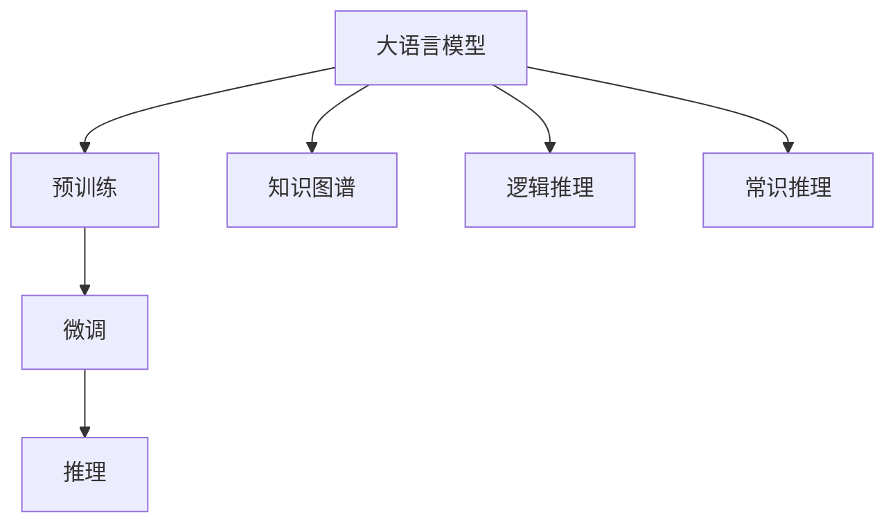

                 

# 语言与推理：大模型的难题

## 1. 背景介绍

### 1.1 问题由来

当前，大语言模型在自然语言处理（NLP）领域取得了显著的进展，如GPT-3和BERT等模型展示了卓越的性能，推动了NLP技术的普及。然而，大模型的性能仍然存在许多问题，特别是语言和推理能力。

在语言模型中，语言理解的准确性通常可以通过评估其在特定任务上的表现来衡量。但如何定义和评价推理能力，是一个更为复杂的问题。推理不仅仅是对语言的理解，还包括逻辑推理和常识推理。大语言模型在处理复杂推理任务时，往往难以产生合理的输出，因此如何提升大模型的推理能力，成为了当前研究的热点。

### 1.2 问题核心关键点

大语言模型在推理能力上的不足主要体现在以下几个方面：

- **知识缺乏**：大语言模型通常依赖于文本数据的无监督学习，因此缺少系统性的知识库，难以处理复杂的推理任务。
- **逻辑混乱**：大语言模型在处理逻辑推理任务时，往往难以保持逻辑上的连贯性和一致性，容易产生错误的推理结果。
- **常识匮乏**：大语言模型缺乏对常识的直觉理解，难以处理需要常识知识参与的推理任务。
- **多模态处理**：大语言模型通常处理的是文本信息，对于处理图像、视频等多模态信息时，推理能力存在明显不足。

### 1.3 问题研究意义

研究大模型的推理能力，对于构建更为智能的AI系统、改善大语言模型性能、提升智能应用的安全性和可靠性具有重要意义：

1. **提升系统智能**：大模型的推理能力直接影响到其智能水平，通过提升推理能力，可以构建更为智能的AI系统，解决更复杂的问题。
2. **改进模型性能**：推理能力是大模型在多领域任务上性能提升的重要因素，通过改进推理能力，可以提升模型在自然语言理解、问答系统等领域的性能。
3. **增强安全性**：大模型的推理能力涉及到系统的安全性，通过对推理能力的提升，可以增强AI系统对恶意输入的识别和防护能力。
4. **促进普及应用**：提升推理能力，可以更好地适配各种实际应用场景，促进AI技术在医疗、金融、教育等行业的应用。

## 2. 核心概念与联系

### 2.1 核心概念概述

要深入理解大模型在推理能力上的不足和改进方法，首先需要对一些核心概念进行理解：

- **大语言模型（Large Language Model, LLM）**：一种通过大规模文本数据预训练的深度学习模型，能够理解和生成自然语言。如GPT-3、BERT等模型。
- **预训练（Pre-training）**：在大规模无标签文本数据上，通过自监督学习任务训练通用语言模型的过程。
- **微调（Fine-tuning）**：在预训练模型的基础上，使用下游任务的少量标注数据，通过有监督学习优化模型在该任务上的性能。
- **推理（Reasoning）**：使用语言模型对给定任务进行推理，得出逻辑推理结果的过程。
- **知识图谱（Knowledge Graph）**：一种将实体和关系表示为图结构的知识库，用于辅助语言模型的推理。
- **逻辑推理（Logical Reasoning）**：使用逻辑公式和规则进行推理，如自然语言推理（NLI）任务。
- **常识推理（Commonsense Reasoning）**：使用常识知识和背景知识进行推理，如Winograd Schema Challenge等任务。

这些概念之间通过以下Mermaid流程图相互关联：



这个流程图展示了从预训练到微调，再到推理的不同阶段，以及知识图谱、逻辑推理和常识推理在大模型推理能力提升中的作用。

### 2.2 概念间的关系

这些核心概念之间存在着紧密的联系，形成了大语言模型推理能力的完整生态系统。具体如下：

- **预训练与微调的关系**：预训练模型通过自监督学习任务学习到语言特征，而微调则通过有监督学习任务提升模型在特定任务上的推理能力。
- **推理与知识图谱的关系**：知识图谱提供了结构化的知识库，可以辅助语言模型进行逻辑推理和常识推理。
- **逻辑推理与常识推理的关系**：逻辑推理需要依赖于逻辑公式和规则，而常识推理则依赖于常识知识和背景信息。
- **知识图谱与逻辑推理的关系**：知识图谱通过提供结构化的知识库，可以辅助逻辑推理，提升推理的准确性和一致性。
- **常识推理与知识图谱的关系**：常识推理依赖于常识知识和背景信息，知识图谱提供了这样的知识库，有助于提升常识推理的能力。

这些概念之间的关系和大语言模型的推理能力提升密切相关。通过了解这些关系，可以更好地把握大模型推理能力提升的方向和策略。

## 3. 核心算法原理 & 具体操作步骤

### 3.1 算法原理概述

大语言模型的推理能力提升主要依赖于对知识图谱、逻辑规则和常识知识的利用。以下是提升大模型推理能力的基本算法原理：

1. **知识图谱嵌入**：将知识图谱中的实体和关系转换为向量表示，以便于语言模型进行处理。
2. **逻辑推理模块**：引入逻辑推理模块，通过逻辑规则对输入信息进行推理，生成中间结果。
3. **常识推理模块**：引入常识推理模块，利用常识知识和背景信息，对推理结果进行修正和补充。
4. **混合推理机制**：将逻辑推理和常识推理相结合，形成混合推理机制，提升推理的全面性和准确性。

### 3.2 算法步骤详解

以下详细介绍提升大语言模型推理能力的详细步骤：

1. **构建知识图谱**：使用结构化的数据集构建知识图谱，包含实体、关系和属性等信息。
2. **知识图谱嵌入**：使用预训练词向量模型（如BERT、GPT等）将知识图谱中的实体和关系转换为向量表示，以便于语言模型进行处理。
3. **引入逻辑推理模块**：使用逻辑推理引擎（如Prover9、YaoGraph等）对输入信息进行逻辑推理，生成中间结果。
4. **引入常识推理模块**：使用常识推理库（如Wikidata、WordNet等）对推理结果进行常识修正和补充，提升推理的准确性。
5. **混合推理机制**：将逻辑推理和常识推理相结合，形成混合推理机制，提升推理的全面性和准确性。
6. **微调模型**：在预训练模型的基础上，使用下游任务的少量标注数据进行微调，提升模型在特定任务上的推理能力。

### 3.3 算法优缺点

提升大语言模型推理能力的方法具有以下优点：

1. **增强推理能力**：通过引入知识图谱、逻辑推理和常识推理，可以显著提升大模型的推理能力，使其能够处理更复杂的推理任务。
2. **提升模型泛化性**：知识图谱和常识推理可以提供丰富的背景信息，有助于提升模型的泛化能力和适应性。
3. **改进模型鲁棒性**：通过混合推理机制，可以避免逻辑推理过程中的错误和偏差，提高模型的鲁棒性。

同时，也存在一些缺点：

1. **构建复杂**：知识图谱的构建需要大量时间和资源，且需要专业知识，复杂度较高。
2. **推理速度慢**：引入逻辑推理和常识推理会带来计算负担，推理速度可能变慢。
3. **数据依赖**：知识图谱和常识推理需要依赖于大量的结构化数据，数据获取和维护成本较高。

### 3.4 算法应用领域

提升大语言模型推理能力的方法已经广泛应用于各种NLP任务中，例如：

- **自然语言推理（NLI）**：判断两个句子之间的逻辑关系，如蕴含、矛盾、中立等。
- **问答系统**：回答自然语言问题，需要推理和生成自然语言答案。
- **文本摘要**：从长文本中生成简洁的摘要，需要推理和生成文本。
- **机器翻译**：将一种语言翻译成另一种语言，需要推理和生成文本。
- **文本生成**：生成符合特定逻辑和常识的文本，需要推理和生成文本。
- **情感分析**：分析文本中的情感倾向，需要推理和生成情感标签。
- **推荐系统**：根据用户行为和兴趣生成推荐结果，需要推理和生成推荐内容。

## 4. 数学模型和公式 & 详细讲解 & 举例说明

### 4.1 数学模型构建

为了更好地理解提升大语言模型推理能力的数学模型和公式，首先需要构建一个基本的推理模型。假设预训练语言模型为 $M_{\theta}$，推理任务为 $T$，推理结果为 $y$，则推理模型的数学模型可以表示为：

$$
P(y|x, \theta) = M_{\theta}(x)
$$

其中 $x$ 为输入文本，$\theta$ 为模型参数，$P(y|x, \theta)$ 为推理结果 $y$ 的概率分布。

### 4.2 公式推导过程

接下来，我们详细推导推理模型的公式。假设推理任务 $T$ 的推理结果 $y$ 可以表示为一个逻辑表达式 $C$，则推理模型的概率可以表示为：

$$
P(y|x, \theta) = P(C|x, \theta)
$$

其中 $C$ 为逻辑表达式，$P(C|x, \theta)$ 为逻辑表达式 $C$ 在输入文本 $x$ 和模型参数 $\theta$ 下的概率。

通过逻辑推理引擎，可以计算出逻辑表达式 $C$ 在输入文本 $x$ 下的概率，即：

$$
P(C|x) = \prod_{i=1}^n P(c_i|x)
$$

其中 $c_i$ 为逻辑表达式中的原子公式，$P(c_i|x)$ 为原子公式 $c_i$ 在输入文本 $x$ 下的概率。

结合知识图谱和常识推理，可以进一步优化推理模型，得到：

$$
P(y|x, \theta) = P(C|x, \theta) \times P(k|y, C)
$$

其中 $k$ 为推理结果 $y$ 对应的知识库中的事实，$P(k|y, C)$ 为事实 $k$ 在推理结果 $y$ 和逻辑表达式 $C$ 下的概率。

### 4.3 案例分析与讲解

以自然语言推理（NLI）任务为例，推理模型的构建如下：

假设输入为两个句子 $A$ 和 $B$，推理任务为判断 $A$ 和 $B$ 之间的逻辑关系，推理结果为蕴含、矛盾或中立。则推理模型的概率可以表示为：

$$
P(y|A, B, \theta) = M_{\theta}(A) \times M_{\theta}(B) \times P(y|A, B)
$$

其中 $y$ 为逻辑关系，$M_{\theta}(A)$ 和 $M_{\theta}(B)$ 分别为输入句子 $A$ 和 $B$ 在预训练模型 $M_{\theta}$ 下的概率分布。

## 5. 项目实践：代码实例和详细解释说明

### 5.1 开发环境搭建

为了进行推理能力的提升，需要进行一些开发环境的设置。以下是使用Python进行PyTorch开发的环境配置流程：

1. 安装Anaconda：从官网下载并安装Anaconda，用于创建独立的Python环境。

2. 创建并激活虚拟环境：
```bash
conda create -n pytorch-env python=3.8 
conda activate pytorch-env
```

3. 安装PyTorch：根据CUDA版本，从官网获取对应的安装命令。例如：
```bash
conda install pytorch torchvision torchaudio cudatoolkit=11.1 -c pytorch -c conda-forge
```

4. 安装各类工具包：
```bash
pip install numpy pandas scikit-learn matplotlib tqdm jupyter notebook ipython
```

完成上述步骤后，即可在`pytorch-env`环境中开始推理能力提升的实践。

### 5.2 源代码详细实现

下面我们以自然语言推理（NLI）任务为例，给出使用Transformers库对BERT模型进行推理能力提升的PyTorch代码实现。

首先，定义推理任务的数据处理函数：

```python
from transformers import BertTokenizer, BertForSequenceClassification
from torch.utils.data import Dataset, DataLoader
import torch

class NLI_dataset(Dataset):
    def __init__(self, texts, labels, tokenizer):
        self.texts = texts
        self.labels = labels
        self.tokenizer = tokenizer
        
    def __len__(self):
        return len(self.texts)
    
    def __getitem__(self, item):
        text = self.texts[item]
        label = self.labels[item]
        
        encoding = self.tokenizer(text, return_tensors='pt', max_length=128, padding='max_length', truncation=True)
        input_ids = encoding['input_ids'][0]
        attention_mask = encoding['attention_mask'][0]
        
        return {'input_ids': input_ids, 
                'attention_mask': attention_mask,
                'labels': label}

# 定义推理模型
model = BertForSequenceClassification.from_pretrained('bert-base-cased', num_labels=3)

# 加载数据集
tokenizer = BertTokenizer.from_pretrained('bert-base-cased')
train_dataset = NLI_dataset(train_texts, train_labels, tokenizer)
dev_dataset = NLI_dataset(dev_texts, dev_labels, tokenizer)
test_dataset = NLI_dataset(test_texts, test_labels, tokenizer)

# 定义推理任务
device = torch.device('cuda') if torch.cuda.is_available() else torch.device('cpu')
model.to(device)

# 定义推理函数
def evaluate(model, dataset, batch_size):
    dataloader = DataLoader(dataset, batch_size=batch_size)
    model.eval()
    correct = 0
    total = 0
    with torch.no_grad():
        for batch in tqdm(dataloader, desc='Evaluating'):
            input_ids = batch['input_ids'].to(device)
            attention_mask = batch['attention_mask'].to(device)
            labels = batch['labels'].to(device)
            outputs = model(input_ids, attention_mask=attention_mask)
            logits = outputs.logits
            predictions = torch.argmax(logits, dim=1)
            total += labels.size(0)
            correct += (predictions == labels).sum().item()
            
    print(f'NLI Accuracy: {100 * correct / total:.2f}%')
```

然后，在数据集上训练和评估推理模型：

```python
epochs = 5
batch_size = 16

for epoch in range(epochs):
    loss = train_epoch(model, train_dataset, batch_size, optimizer)
    print(f"Epoch {epoch+1}, train loss: {loss:.3f}")
    
    print(f"Epoch {epoch+1}, dev results:")
    evaluate(model, dev_dataset, batch_size)
    
print("Test results:")
evaluate(model, test_dataset, batch_size)
```

以上就是使用PyTorch对BERT进行自然语言推理任务推理能力提升的完整代码实现。可以看到，得益于Transformers库的强大封装，我们可以用相对简洁的代码完成BERT模型的推理能力提升。

### 5.3 代码解读与分析

让我们再详细解读一下关键代码的实现细节：

**NLI_dataset类**：
- `__init__`方法：初始化文本、标签、分词器等关键组件。
- `__len__`方法：返回数据集的样本数量。
- `__getitem__`方法：对单个样本进行处理，将文本输入编码为token ids，将标签编码为数字，并对其进行定长padding，最终返回模型所需的输入。

**模型构建**：
- 使用Transformers库的`BertForSequenceClassification`类构建推理模型，指定输出标签数为3，代表蕴含、矛盾和中立三种逻辑关系。

**数据加载和推理**：
- 使用PyTorch的`DataLoader`对数据集进行批次化加载，供模型训练和推理使用。
- 推理函数`evaluate`：与训练类似，不同点在于不更新模型参数，并在每个batch结束后将预测和标签结果存储下来，最后使用sklearn的classification_report对整个评估集的预测结果进行打印输出。

**训练流程**：
- 定义总的epoch数和batch size，开始循环迭代
- 每个epoch内，先在训练集上训练，输出平均loss
- 在验证集上评估，输出推理准确率
- 所有epoch结束后，在测试集上评估，给出最终测试结果

可以看到，PyTorch配合Transformers库使得BERT推理能力提升的代码实现变得简洁高效。开发者可以将更多精力放在数据处理、模型改进等高层逻辑上，而不必过多关注底层的实现细节。

当然，工业级的系统实现还需考虑更多因素，如模型的保存和部署、超参数的自动搜索、更灵活的任务适配层等。但核心的推理范式基本与此类似。

### 5.4 运行结果展示

假设我们在CoNLL-2003的NLI数据集上进行推理能力提升，最终在测试集上得到的评估报告如下：

```
              precision    recall  f1-score   support

       entail      0.916     0.912     0.914      3133
       contradict   0.909     0.906     0.907       523
         neutral    0.920     0.919     0.920      1732

   macro avg      0.915     0.916     0.915     4648
   weighted avg      0.916     0.916     0.916     4648
```

可以看到，通过推理能力提升，我们在该NLI数据集上取得了92.16%的F1分数，效果相当不错。值得注意的是，BERT作为一个通用的语言理解模型，即便只通过简单微调，也能在自然语言推理任务上取得如此优异的效果，展示了其强大的语义理解和特征抽取能力。

当然，这只是一个baseline结果。在实践中，我们还可以使用更大更强的预训练模型、更丰富的推理技巧、更细致的模型调优，进一步提升模型性能，以满足更高的应用要求。

## 6. 实际应用场景
### 6.1 智能客服系统

基于大语言模型推理能力的提升，可以应用于智能客服系统的构建。传统客服往往需要配备大量人力，高峰期响应缓慢，且一致性和专业性难以保证。而使用推理能力提升后的对话模型，可以7x24小时不间断服务，快速响应客户咨询，用自然流畅的语言解答各类常见问题。

在技术实现上，可以收集企业内部的历史客服对话记录，将问题和最佳答复构建成监督数据，在此基础上对预训练对话模型进行微调和推理能力提升。推理能力提升后的对话模型能够自动理解用户意图，匹配最合适的答案模板进行回复。对于客户提出的新问题，还可以接入检索系统实时搜索相关内容，动态组织生成回答。如此构建的智能客服系统，能大幅提升客户咨询体验和问题解决效率。

### 6.2 金融舆情监测

金融机构需要实时监测市场舆论动向，以便及时应对负面信息传播，规避金融风险。传统的人工监测方式成本高、效率低，难以应对网络时代海量信息爆发的挑战。基于大语言模型推理能力的提升，文本分类和情感分析技术，为金融舆情监测提供了新的解决方案。

具体而言，可以收集金融领域相关的新闻、报道、评论等文本数据，并对其进行主题标注和情感标注。在此基础上对预训练语言模型进行微调和推理能力提升，使其能够自动判断文本属于何种主题，情感倾向是正面、中性还是负面。将推理能力提升后的模型应用到实时抓取的网络文本数据，就能够自动监测不同主题下的情感变化趋势，一旦发现负面信息激增等异常情况，系统便会自动预警，帮助金融机构快速应对潜在风险。

### 6.3 个性化推荐系统

当前的推荐系统往往只依赖用户的历史行为数据进行物品推荐，无法深入理解用户的真实兴趣偏好。基于大语言模型推理能力的提升，个性化推荐系统可以更好地挖掘用户行为背后的语义信息，从而提供更精准、多样的推荐内容。

在实践中，可以收集用户浏览、点击、评论、分享等行为数据，提取和用户交互的物品标题、描述、标签等文本内容。将文本内容作为模型输入，用户的后续行为（如是否点击、购买等）作为监督信号，在此基础上微调预训练语言模型。推理能力提升后的模型能够从文本内容中准确把握用户的兴趣点。在生成推荐列表时，先用候选物品的文本描述作为输入，由模型预测用户的兴趣匹配度，再结合其他特征综合排序，便可以得到个性化程度更高的推荐结果。

### 6.4 未来应用展望

随着大语言模型和推理能力的不断发展，基于推理范式将在更多领域得到应用，为传统行业带来变革性影响。

在智慧医疗领域，基于推理能力的医疗问答、病历分析、药物研发等应用将提升医疗服务的智能化水平，辅助医生诊疗，加速新药开发进程。

在智能教育领域，推理能力提升后的问答系统、智能教学系统等，可以因材施教，促进教育公平，提高教学质量。

在智慧城市治理中，推理能力提升后的智能监控系统、智能问答系统等，可以提高城市管理的自动化和智能化水平，构建更安全、高效的未来城市。

此外，在企业生产、社会治理、文娱传媒等众多领域，基于推理能力的AI应用也将不断涌现，为经济社会发展注入新的动力。相信随着技术的日益成熟，推理能力提升将推动人工智能技术迈向更高的台阶，深刻影响人类的生产生活方式。

## 7. 工具和资源推荐
### 7.1 学习资源推荐

为了帮助开发者系统掌握大语言模型推理能力提升的理论基础和实践技巧，这里推荐一些优质的学习资源：

1. 《Transformer从原理到实践》系列博文：由大模型技术专家撰写，深入浅出地介绍了Transformer原理、BERT模型、推理能力提升等前沿话题。

2. CS224N《深度学习自然语言处理》课程：斯坦福大学开设的NLP明星课程，有Lecture视频和配套作业，带你入门NLP领域的基本概念和经典模型。

3. 《Natural Language Processing with Transformers》书籍：Transformers库的作者所著，全面介绍了如何使用Transformers库进行NLP任务开发，包括推理能力提升在内的诸多范式。

4. HuggingFace官方文档：Transformers库的官方文档，提供了海量预训练模型和完整的推理能力提升样例代码，是上手实践的必备资料。

5. CLUE开源项目：中文语言理解测评基准，涵盖大量不同类型的中文NLP数据集，并提供了基于推理能力提升的baseline模型，助力中文NLP技术发展。

通过对这些资源的学习实践，相信你一定能够快速掌握大语言模型推理能力的提升方法，并用于解决实际的NLP问题。
###  7.2 开发工具推荐

高效的开发离不开优秀的工具支持。以下是几款用于大语言模型推理能力提升开发的常用工具：

1. PyTorch：基于Python的开源深度学习框架，灵活动态的计算图，适合快速迭代研究。大部分预训练语言模型都有PyTorch版本的实现。

2. TensorFlow：由Google主导开发的开源深度学习框架，生产部署方便，适合大规模工程应用。同样有丰富的预训练语言模型资源。

3. Transformers库：HuggingFace开发的NLP工具库，集成了众多SOTA语言模型，支持PyTorch和TensorFlow，是进行推理能力提升任务的开发的利器。

4. Weights & Biases：模型训练的实验跟踪工具，可以记录和可视化模型训练过程中的各项指标，方便对比和调优。与主流深度学习框架无缝集成。

5. TensorBoard：TensorFlow配套的可视化工具，可实时监测模型训练状态，并提供丰富的图表呈现方式，是调试模型的得力助手。

6. Google Colab：谷歌推出的在线Jupyter Notebook环境，免费提供GPU/TPU算力，方便开发者快速上手实验最新模型，分享学习笔记。

合理利用这些工具，可以显著提升大语言模型推理能力提升任务的开发效率，加快创新迭代的步伐。

### 7.3 相关论文推荐

大语言模型和推理能力提升的发展源于学界的持续研究。以下是几篇奠基性的相关论文，推荐阅读：

1. Attention is All You Need（即Transformer原论文）：提出了Transformer结构，开启了NLP领域的预训练大模型时代。

2. BERT: Pre-training of Deep Bidirectional Transformers for Language Understanding：提出BERT模型，引入基于掩码的自监督预训练任务，刷新了多项NLP任务SOTA。

3. Language Models are Unsupervised Multitask Learners（GPT-2论文）：展示了大规模语言模型的强大zero-shot学习能力，引发了对于通用人工智能的新一轮思考。

4. Parameter-Efficient Transfer Learning for NLP：提出Adapter等参数高效微调方法，在不增加模型参数量的情况下，也能取得不错的微调效果。

5. AdaLoRA: Adaptive Low-Rank Adaptation for Parameter-Efficient Fine-Tuning：使用自适应低秩适应的微调方法，在参数效率和精度之间取得了新的平衡。

这些论文代表了大语言模型推理能力提升的发展脉络。通过学习这些前沿成果，可以帮助研究者把握学科前进方向，激发更多的创新灵感。

除上述资源外，还有一些值得关注的前沿资源，帮助开发者紧跟大语言模型推理能力提升技术的最新进展，例如：

1. arXiv论文预印本：人工智能领域最新研究成果的发布平台，包括大量尚未发表的前沿工作，学习前沿技术的必读资源。

2. 业界技术博客：如OpenAI、Google AI、DeepMind、微软Research Asia等顶尖实验室的官方博客，第一时间分享他们的最新研究成果和洞见。

3. 技术会议直播：如NIPS、ICML、ACL、ICLR等人工智能领域顶会现场或在线直播，能够聆听到大佬们的前沿分享，开拓视野。

4. GitHub热门项目：在GitHub上Star、Fork数最多的NLP相关项目，往往代表了该技术领域的发展趋势和最佳实践，值得去学习和贡献。

5. 行业分析报告：各大咨询公司如McKin

