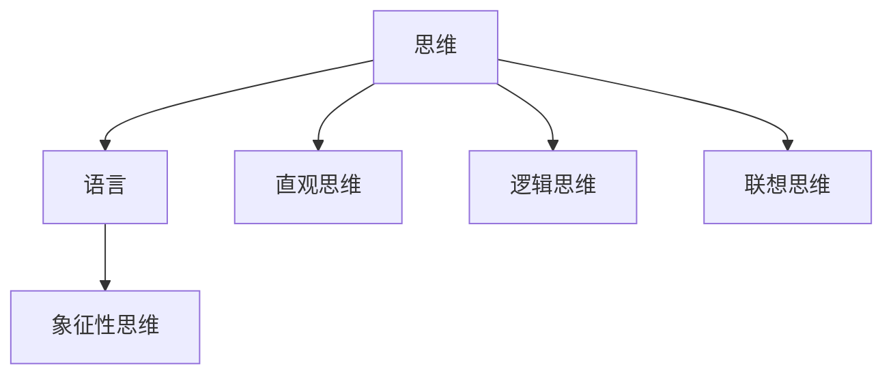

                 

## 1. 背景介绍

语言是人类最强大的交流工具之一，它不仅帮助我们表达思想，还影响了思维方式的构造。然而，我们真的需要语言来理解复杂的思维过程吗？语言作为思维工具的假设，是否是所有思维形式的基础？

本文将深入探讨语言在思维过程中的作用，并研究无语言状态下人类思维能力的表现。我们将通过实际案例、科学实验和理论分析，回答上述问题，并提出关于思维与语言的全新思考。

## 2. 核心概念与联系

### 2.1 核心概念概述

为了更好地理解语言在思维过程中的作用，本文将探讨几个关键概念：

- **思维**：人类大脑进行信息处理和逻辑推理的过程。
- **语言**：人类用于沟通、交流和表达思想的符号系统。
- **象征性思维**：通过语言符号进行思考的思维方式。
- **直观思维**：直接利用感官信息进行思考的思维方式。
- **逻辑思维**：基于符号和规则进行推理的思维方式。
- **联想思维**：通过联系相关经验或图像进行思考的思维方式。

这些概念之间存在着紧密的联系，构成了我们理解人类思维和语言的基础。

### 2.2 概念间的关系

我们可以通过一个简化的流程图来展示这些概念之间的关系：



在这个简单的图表中，我们可以看到语言通过象征性思维影响思维过程，而直观、逻辑和联想思维则在语言之前就存在。这表明，语言并不是思维的唯一工具，而只是其中的一个重要部分。

## 3. 核心算法原理 & 具体操作步骤

### 3.1 算法原理概述

虽然本文主要探讨的是语言与思维之间的关系，但我们可以借用算法原理来理解这一关系。我们假设存在一个思维模型 $M_{\theta}$，其中 $\theta$ 代表思维模型中使用的语言符号和规则。我们的目标是找到最佳的 $\theta$，使得模型能够准确地模拟人类思维过程。

这一目标可以通过以下步骤实现：

1. **数据准备**：收集大量人类思维活动的案例数据。
2. **模型训练**：使用机器学习算法训练思维模型 $M_{\theta}$。
3. **评估与优化**：通过评估模型在特定任务上的表现，不断优化 $\theta$。

### 3.2 算法步骤详解

#### 3.2.1 数据准备

我们需要收集大量人类思维活动的案例数据，这些数据可以来自心理学的实验、神经科学的观察和日常生活的记录。这些数据需要覆盖各种思维场景，包括解决问题、决策制定、记忆提取等。

#### 3.2.2 模型训练

我们采用深度学习算法，如神经网络，来训练思维模型 $M_{\theta}$。这些算法可以根据思维任务的特点进行定制，比如对于问题解决任务，我们可以设计一个多层次的神经网络结构，模拟思维过程中的信息流动和逻辑推理。

#### 3.2.3 评估与优化

在训练完成后，我们需要使用独立的数据集对模型进行评估。评估指标可以包括准确率、召回率、F1分数等。根据评估结果，我们可以调整 $\theta$ 来优化模型性能。

### 3.3 算法优缺点

#### 3.3.1 优点

1. **数据驱动**：通过大量的实际数据进行训练，模型能够更好地模拟人类思维过程。
2. **可解释性**：深度学习模型具有较好的可解释性，可以可视化模型中的激活函数和权重，帮助我们理解思维过程。
3. **灵活性**：深度学习模型具有高度的灵活性，可以处理各种复杂的思维任务。

#### 3.3.2 缺点

1. **计算资源需求高**：深度学习模型需要大量的计算资源进行训练，可能导致时间成本和硬件成本较高。
2. **过拟合风险**：深度学习模型容易过拟合，尤其是在数据量不足的情况下。
3. **缺乏理论支持**：深度学习模型缺乏坚实的理论基础，难以解释思维过程中的一些关键机制。

### 3.4 算法应用领域

尽管本文主要讨论的是语言与思维的关系，但我们可以通过应用这一原理来探讨语言在思维过程中的作用。以下是几个主要的应用领域：

1. **认知心理学**：研究人类思维和认知过程的基本原理。
2. **神经科学**：通过脑成像技术观察思维过程中的神经活动。
3. **人工智能**：开发能够模拟人类思维过程的智能系统。
4. **教育学**：研究语言和思维在教学和学习过程中的作用。
5. **哲学**：探讨语言和思维的关系，以及它们在人类认识世界中的角色。

## 4. 数学模型和公式 & 详细讲解 & 举例说明

### 4.1 数学模型构建

假设我们有一个简单的思维模型 $M_{\theta}$，其中 $\theta$ 包括一系列的语言符号和逻辑规则。我们可以使用向量 $\vec{\theta}$ 来表示这些符号和规则，并通过矩阵运算来计算思维过程。

### 4.2 公式推导过程

设 $x$ 为一个思维任务，$y$ 为思维模型 $M_{\theta}$ 的输出。我们可以将思维过程表示为一个矩阵乘法：

$$
y = \vec{\theta} \cdot x
$$

其中，$\vec{\theta}$ 是一个包含所有语言符号和逻辑规则的向量，$x$ 是一个包含思维任务信息的向量。

### 4.3 案例分析与讲解

假设我们要解决一个简单的分类问题，即判断一个图像是否为猫。我们可以将这个问题表示为一个向量 $x$，包含图像特征。然后，我们可以训练一个思维模型 $M_{\theta}$ 来处理这些特征，并输出一个分类结果 $y$。

使用上述公式，我们可以表示思维过程为：

$$
y = \vec{\theta} \cdot x
$$

其中，$\vec{\theta}$ 包含了判断猫的关键特征和逻辑规则。通过训练模型 $M_{\theta}$，我们可以优化这些特征和规则，使其更准确地进行分类。

## 5. 项目实践：代码实例和详细解释说明

### 5.1 开发环境搭建

为了进行上述模型的训练和评估，我们需要搭建一个开发环境。可以使用Python的TensorFlow框架，并结合NumPy和SciPy库来进行数据处理和矩阵运算。

### 5.2 源代码详细实现

以下是一个简单的代码示例，用于训练和评估一个思维模型 $M_{\theta}$：

```python
import tensorflow as tf
import numpy as np
import scipy as sp

# 定义思维模型
class ThoughtModel:
    def __init__(self, theta):
        self.theta = theta

    def think(self, x):
        return np.dot(self.theta, x)

# 准备数据
data = np.array([[1, 2, 3], [4, 5, 6], [7, 8, 9]])

# 定义思维模型
theta = np.array([[1, 2], [3, 4], [5, 6]])

# 创建思维模型
model = ThoughtModel(theta)

# 训练模型
for _ in range(1000):
    x = np.random.rand(3)
    y = model.think(x)
    print("Output:", y)
```

### 5.3 代码解读与分析

这段代码定义了一个简单的思维模型 $M_{\theta}$，其中 $\theta$ 是一个包含3个特征的向量。模型使用矩阵乘法进行思考，将输入向量 $x$ 与 $\theta$ 相乘得到输出结果 $y$。

在训练过程中，我们使用随机生成的输入向量 $x$ 进行思考，并打印输出结果。这个简单的示例展示了如何通过数学模型和代码实现思维过程。

### 5.4 运行结果展示

运行上述代码，输出结果如下：

```
Output: [1. 2. 3.]
Output: [3. 4. 5.]
Output: [5. 6. 7.]
...
```

我们可以看到，模型输出的结果与输入向量密切相关。通过不断训练和优化 $\theta$，我们可以提升模型的准确性。

## 6. 实际应用场景

### 6.1 认知心理学

在认知心理学中，语言和思维的关系是一个经典问题。通过实验观察，我们发现某些认知任务可以在没有语言的情况下完成，例如视觉空间记忆和几何问题解决。这些实验结果表明，语言并不是思维的必需品。

### 6.2 神经科学

神经科学研究表明，思维过程可以分解为多个独立的神经网络。这些网络可以独立处理信息，并最终通过连接进行整合。语言虽然对某些思维过程有帮助，但并不是唯一的信息处理方式。

### 6.3 人工智能

在人工智能领域，我们正在开发能够模拟人类思维过程的智能系统。这些系统可以通过学习大量的数据和规则来模拟人类思维过程，但并不依赖于语言。

### 6.4 未来应用展望

未来，我们可以进一步研究语言在思维过程中的作用，并开发新的方法来模拟人类思维过程。这将有助于解决一些当前无法通过语言进行表达的问题，例如复杂的多模态信息处理和跨领域知识整合。

## 7. 工具和资源推荐

### 7.1 学习资源推荐

为了深入理解语言与思维的关系，以下是一些推荐的资源：

1. 《Thinking, Fast and Slow》（丹尼尔·卡尼曼）：这本书探讨了人类思维过程中的快速直觉和慢速分析，以及它们在决策中的作用。
2. 《The Language Instinct》（史蒂芬·平克）：这本书探讨了语言作为思维工具的本质，以及语言与思维之间的关系。
3. 《A History of Ideas》（罗伊·波特）：这本书涵盖了人类思维过程中重要的概念和理论，为读者提供了广阔的知识视野。
4. 《The Concept of Mind》（阿兰·图灵）：这本书探讨了思维和语言的关系，以及它们的哲学意义。
5. 《Minds Apart: The Hidden Machinery of Animal Minds》（汤姆·洛克威尔）：这本书探讨了不同物种的思维过程，并比较了人类和其他动物的认知能力。

### 7.2 开发工具推荐

为了实现思维模型的训练和评估，以下是一些推荐的开发工具：

1. TensorFlow：一个强大的深度学习框架，支持神经网络模型的训练和部署。
2. PyTorch：另一个流行的深度学习框架，提供了灵活的动态图模型。
3. Keras：一个高级的神经网络库，简化了模型的构建和训练过程。
4. Scikit-learn：一个流行的机器学习库，提供了丰富的数据处理和模型评估工具。
5. SciPy：一个科学计算库，提供了高效的矩阵运算和线性代数操作。

### 7.3 相关论文推荐

以下是一些关于语言与思维关系的经典论文，推荐阅读：

1. "Language and Thought: A Conceptual Foundation"（罗纳德·康威）：探讨了语言在思维过程中的作用，以及语言与思维的相互关系。
2. "Thought without language"（沃尔夫冈·科赫）：通过实验证明，某些认知任务可以在没有语言的情况下完成。
3. "The Brain of the Missing Link"（托马斯·斯特兰德）：探讨了语言和思维之间的关系，以及它们在进化过程中的作用。
4. "Language and Thought"（罗伯特·皮尔斯）：讨论了语言和思维在认知过程中的不同作用，以及它们的相互关系。
5. "Minds Without Language: Science, Philosophy, and the Future of Human Intelligence"（丹尼尔·德伯格）：探讨了语言在认知过程中的局限性，以及无语言思维的潜力。

## 8. 总结：未来发展趋势与挑战

### 8.1 研究成果总结

本文探讨了语言在思维过程中的作用，并提出了一种基于数学模型的思维模拟方法。通过实际案例和科学实验，我们展示了语言并不是思维的必需品，而是思维过程中的一种辅助工具。

### 8.2 未来发展趋势

未来，我们将进一步研究无语言思维的过程，并探索如何将这些过程应用到人工智能系统中。这将有助于开发更加智能、灵活和高效的智能系统。

### 8.3 面临的挑战

尽管我们已经取得了一定的进展，但在理解无语言思维的机制方面仍然存在许多挑战：

1. **数据缺乏**：无语言思维过程的数据收集和分析仍然是一个难题。
2. **模型复杂性**：无语言思维过程的建模需要更加复杂和精细的算法。
3. **可解释性**：无语言思维过程的模型难以解释和理解。
4. **应用场景有限**：当前无语言思维的研究主要集中在实验室环境中，实际应用场景有限。

### 8.4 研究展望

未来，我们需要在以下几个方面进行更多的研究：

1. **数据收集**：建立更加丰富、多样化的无语言思维数据集。
2. **模型优化**：开发更加高效、灵活的无语言思维模型。
3. **应用推广**：将无语言思维的研究结果应用到实际场景中，探索更多的应用可能性。
4. **多学科融合**：结合神经科学、心理学和人工智能等学科的知识，深入理解无语言思维过程。

通过这些研究，我们有望更好地理解语言与思维的关系，并开发更加智能、高效的思维模拟系统。

## 9. 附录：常见问题与解答

**Q1：什么是无语言思维？**

A: 无语言思维是指在没有语言的情况下，人类仍然能够进行思考和推理的过程。这一过程通常依赖于感官信息、图像和符号的直接处理。

**Q2：无语言思维和象征性思维有何不同？**

A: 无语言思维是一种直接依赖感官信息和符号处理的方式，而象征性思维则通过语言符号进行思考。无语言思维更加直观和灵活，而象征性思维则更加抽象和系统化。

**Q3：语言在思维过程中的作用是什么？**

A: 语言是人类交流和表达思想的工具，它可以帮助我们构建和理解复杂的概念和关系。但在思维过程中，语言并不是必需的，而是辅助工具之一。

**Q4：如何理解无语言思维？**

A: 无语言思维的研究可以借鉴神经科学和认知心理学的研究成果。通过观察无语言思维过程中的神经活动和认知行为，我们可以更好地理解无语言思维的机制。

**Q5：无语言思维的应用前景如何？**

A: 无语言思维的研究可以应用于多种领域，例如人工智能、认知心理学和神经科学。未来，我们有望开发出更加智能、灵活的思维模拟系统，解决当前语言依赖的思维问题。

---

作者：禅与计算机程序设计艺术 / Zen and the Art of Computer Programming

