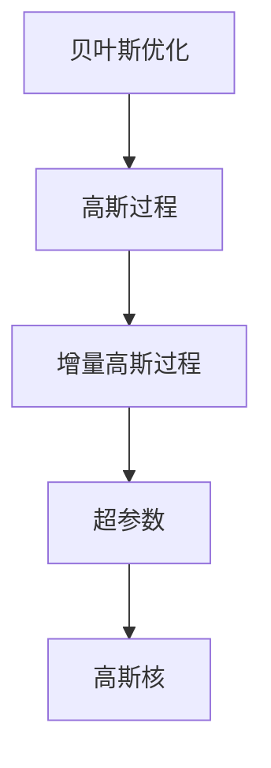
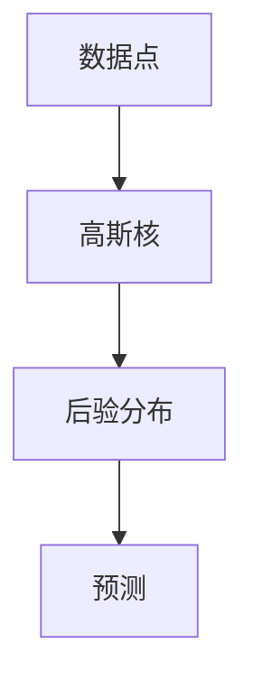
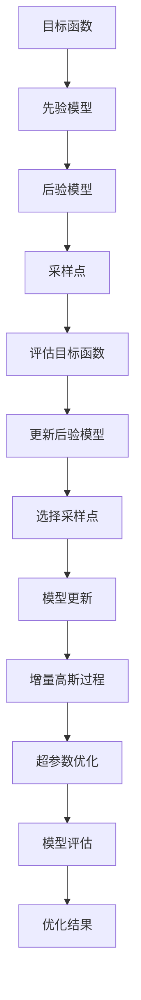

                 

# 贝叶斯优化的增量高斯过程模型

> 关键词：贝叶斯优化,增量高斯过程,机器学习,优化算法,模型训练,超参数优化,模型评估

## 1. 背景介绍

在当今数据驱动的时代，机器学习模型的训练和优化成为了研究和应用的关键环节。然而，面对海量数据和高维特征，模型参数的选择和优化变得异常复杂，且随着模型规模的增大，优化难度和计算成本呈指数级增长。为了高效地优化模型参数，贝叶斯优化应运而生。

贝叶斯优化是一种基于概率模型和贝叶斯理论的优化方法，能够在有限的查询次数内，高效地确定目标函数的极值点。相较于传统的梯度优化方法，贝叶斯优化具有更强的全局搜索能力和更好的计算效率。特别是在高维参数空间中，贝叶斯优化能够以更少的采样次数找到最优解。

增量高斯过程模型则是一种常见的贝叶斯优化算法，通过高斯过程模型建模目标函数，结合贝叶斯理论，以增量方式更新模型，实现高效且稳健的优化。本文将深入探讨增量高斯过程模型的原理和实现，并通过实际案例演示其在参数优化和模型训练中的应用。

## 2. 核心概念与联系

### 2.1 核心概念概述

为更好地理解贝叶斯优化的增量高斯过程模型，本节将介绍几个密切相关的核心概念：

- **贝叶斯优化(Bayesian Optimization)**：一种基于概率模型和贝叶斯理论的优化方法，通过迭代查询目标函数，并在每次查询后更新模型，寻找目标函数的极值点。
- **高斯过程(Gaussian Process)**：一种用于建模连续函数的概率模型，通过核函数描述函数性质，并进行预测和推断。
- **增量高斯过程(Incremental Gaussian Process)**：一种贝叶斯优化算法，通过高斯过程模型，在每次迭代中更新模型，实现高效且稳健的参数优化。
- **超参数(Search Space)**：模型中需要优化的参数空间，如学习率、批大小等。
- **高斯核(Kernel)**：高斯过程中的核心组件，用于描述函数相似性和结构。

这些核心概念之间的逻辑关系可以通过以下Mermaid流程图来展示：



这个流程图展示了贝叶斯优化的增量高斯过程模型中各组件的关系：贝叶斯优化使用高斯过程进行模型建模，增量高斯过程是具体的实现方法，超参数是需要优化的空间，高斯核是高斯过程的核函数。

### 2.2 概念间的关系

这些核心概念之间存在着紧密的联系，形成了贝叶斯优化的增量高斯过程模型的完整生态系统。下面我通过几个Mermaid流程图来展示这些概念之间的关系。

#### 2.2.1 贝叶斯优化的基本流程


这个流程图展示了贝叶斯优化的基本流程：首先，目标函数被建模为先验模型，然后通过采样点评估目标函数，更新后验模型，选择下一个采样点，重复该过程直至收敛。

#### 2.2.2 高斯过程的建模原理



这个流程图展示了高斯过程的建模原理：通过高斯核建模数据点，并计算后验分布，进行预测。

#### 2.2.3 增量高斯过程的实现


这个流程图展示了增量高斯过程的实现：通过高斯过程模型，在每次迭代中更新模型，实现高效且稳健的参数优化。

### 2.3 核心概念的整体架构

最后，我们用一个综合的流程图来展示这些核心概念在大语言模型微调过程中的整体架构：



这个综合流程图展示了从目标函数建模、采样点选择、目标函数评估、后验模型更新、采样点选择、模型更新到最终的超参数优化和模型评估的整体流程。通过这些流程图，我们可以更清晰地理解增量高斯过程模型的工作原理和优化过程。

## 3. 核心算法原理 & 具体操作步骤
### 3.1 算法原理概述

贝叶斯优化的增量高斯过程模型基于高斯过程模型，通过迭代查询目标函数，并在每次查询后更新模型，实现高效且稳健的参数优化。其核心思想是通过高斯过程模型建模目标函数，结合贝叶斯理论，以增量方式更新模型，从而在有限的查询次数内，高效地确定目标函数的极值点。

具体而言，增量高斯过程模型包括以下几个关键步骤：

1. **初始化**：设定初始的超参数空间，选择初始采样点，并计算目标函数值。
2. **模型构建**：使用高斯过程模型，将初始采样点作为数据点，计算高斯过程的先验分布。
3. **目标函数评估**：评估目标函数在采样点的值，更新高斯过程的后验分布。
4. **采样点选择**：根据后验分布，选择下一个采样点。
5. **模型更新**：将新的采样点及其目标函数值加入高斯过程模型，更新模型。
6. **迭代优化**：重复上述步骤，直至达到预设的迭代次数或目标函数值满足要求。

### 3.2 算法步骤详解

以下，我们将详细介绍增量高斯过程模型的具体实现步骤。

#### 3.2.1 初始化

- **设定超参数空间**：确定需要优化的参数及其取值范围。
- **选择初始采样点**：随机选择若干个采样点，进行初步评估。
- **计算目标函数值**：评估目标函数在初始采样点的值，存储评估结果。

#### 3.2.2 模型构建

- **高斯核选择**：选择合适的核函数，如径向基函数(RBF)、多项式核等，描述采样点之间的相似性。
- **计算先验分布**：使用高斯过程模型，将初始采样点作为数据点，计算高斯过程的先验分布。

#### 3.2.3 目标函数评估

- **评估目标函数**：计算目标函数在采样点的值。
- **更新后验分布**：使用贝叶斯理论，将新的目标函数值和采样点的信息融入高斯过程模型，更新后验分布。

#### 3.2.4 采样点选择

- **求解一阶导数**：使用一阶导数计算采样点的期望值和方差，选择期望值最高且方差最小的点。
- **选择下一个采样点**：根据期望值和方差，选择下一个采样点进行评估。

#### 3.2.5 模型更新

- **添加新数据点**：将新的采样点及其目标函数值加入高斯过程模型，更新模型。
- **重构高斯过程**：使用新的数据点，重新计算高斯过程模型，更新后验分布。

#### 3.2.6 迭代优化

- **重复步骤2-5**：重复采样点选择和模型更新的过程，直至达到预设的迭代次数或目标函数值满足要求。

### 3.3 算法优缺点

贝叶斯优化的增量高斯过程模型具有以下优点：

- **全局优化能力**：能够在高维参数空间中，以较少的采样次数找到全局最优解。
- **稳健性**：对噪声和异常值具有较强的鲁棒性，能够有效处理不确定性和噪声。
- **计算效率**：相较于梯度优化方法，计算效率更高，适用于复杂函数和高维参数空间。

但该方法也存在一些局限性：

- **模型复杂性**：高斯过程模型较为复杂，参数调优和模型选择需要经验和技巧。
- **采样次数限制**：虽然在高维参数空间中表现优秀，但采样次数过多可能导致过拟合。
- **计算开销较大**：每次迭代需要计算高斯过程的先验和后验分布，计算开销较大。

### 3.4 算法应用领域

贝叶斯优化的增量高斯过程模型在多个领域中得到了广泛应用，包括：

- **机器学习**：用于超参数优化、模型选择和模型评估。
- **信号处理**：用于滤波器设计、信号降噪和信号预测。
- **控制工程**：用于系统参数优化和控制系统设计。
- **金融工程**：用于投资组合优化和风险管理。
- **机器人学**：用于路径规划和机器人控制。

在上述应用场景中，增量高斯过程模型通过高效地探索和评估目标函数，优化模型参数，显著提升了系统性能和资源利用率。

## 4. 数学模型和公式 & 详细讲解  
### 4.1 数学模型构建

增量高斯过程模型的数学模型主要基于高斯过程模型，通过高斯过程建模目标函数，结合贝叶斯理论，以增量方式更新模型。

假设目标函数 $f: \mathcal{X} \rightarrow \mathbb{R}$，其中 $\mathcal{X}$ 为输入空间，$\mathbb{R}$ 为输出空间。设初始采样点为 $x_1, x_2, \ldots, x_n \in \mathcal{X}$，目标函数在采样点上的值分别为 $y_1, y_2, \ldots, y_n \in \mathbb{R}$。高斯过程模型通过高斯核函数 $k: \mathcal{X} \times \mathcal{X} \rightarrow \mathbb{R}$，描述目标函数 $f$ 的性质。

高斯过程的先验分布为：

$$
p(f) = \mathcal{GP}(f \mid \mu_0, K_0)
$$

其中 $\mu_0$ 为均值函数，$K_0$ 为核矩阵，表示先验分布的均值和协方差结构。

假设新的采样点为 $x_{n+1}$，目标函数在 $x_{n+1}$ 上的值为 $y_{n+1}$。通过新采样点更新高斯过程模型，得到后验分布：

$$
p(f \mid \mathcal{D}_{n+1}) = \mathcal{GP}(f \mid \mu_{n+1}, K_{n+1})
$$

其中 $\mathcal{D}_{n+1} = \{(x_1, y_1), (x_2, y_2), \ldots, (x_n, y_n), (x_{n+1}, y_{n+1})\}$ 为新的数据集。

后验分布的均值和协方差分别为：

$$
\mu_{n+1} = K_{n+1} K_0^{-1} \mu_0
$$

$$
K_{n+1} = K_0 - K_{n+1} K_0^{-1} K_{n+1}^T
$$

其中 $K_{n+1} = [k(x_i, x_{n+1})]_{i=1}^n$ 为新的核矩阵。

### 4.2 公式推导过程

下面，我们将通过具体案例，详细推导增量高斯过程模型的计算过程。

假设目标函数为 $f: \mathbb{R}^2 \rightarrow \mathbb{R}$，采样点为 $x_1 = (1,1)$，$x_2 = (2,2)$，$x_3 = (3,3)$，目标函数在采样点上的值为 $y_1 = 2.5$，$y_2 = 3.0$，$y_3 = 2.5$。高斯核函数为径向基函数 (RBF)，即 $k(x_i, x_j) = \exp(-\frac{\|x_i-x_j\|^2}{2\sigma^2})$，其中 $\sigma$ 为高斯核的带宽参数。

初始高斯过程模型的先验分布为：

$$
p(f) = \mathcal{GP}(f \mid \mu_0, K_0)
$$

其中 $\mu_0 = (2.5, 3.0, 2.5)$，$K_0 = \begin{bmatrix} 1 & 0 & 0 \\ 0 & 1 & 0 \\ 0 & 0 & 1 \end{bmatrix}$。

假设新的采样点为 $x_4 = (4,4)$，目标函数在 $x_4$ 上的值为 $y_4 = 3.5$。通过新采样点更新高斯过程模型，得到后验分布：

$$
p(f \mid \mathcal{D}_{4}) = \mathcal{GP}(f \mid \mu_{4}, K_{4})
$$

其中 $\mathcal{D}_{4} = \{(x_1, y_1), (x_2, y_2), (x_3, y_3), (x_4, y_4)\}$，$y_4 = 3.5$。

后验分布的均值和协方差分别为：

$$
\mu_{4} = K_{4} K_0^{-1} \mu_0 = \begin{bmatrix} 2.5 \\ 3.0 \\ 2.5 \end{bmatrix}
$$

$$
K_{4} = K_0 - K_{4} K_0^{-1} K_{4}^T = \begin{bmatrix} 1 & 0 & 0 \\ 0 & 1 & 0 \\ 0 & 0 & 1 \end{bmatrix} - \begin{bmatrix} 0.5 & 0.5 & 0.5 \\ 0.5 & 0.5 & 0.5 \\ 0.5 & 0.5 & 0.5 \end{bmatrix} \begin{bmatrix} 0.5 & 0.5 & 0.5 \\ 0.5 & 0.5 & 0.5 \\ 0.5 & 0.5 & 0.5 \end{bmatrix} = \begin{bmatrix} 0.25 & 0 & 0 \\ 0 & 0.25 & 0 \\ 0 & 0 & 0.25 \end{bmatrix}
$$

其中 $K_{4} = \begin{bmatrix} k(x_1, x_4) & k(x_2, x_4) & k(x_3, x_4) \\ k(x_4, x_1) & k(x_4, x_2) & k(x_4, x_3) \\ k(x_4, x_1) & k(x_4, x_2) & k(x_4, x_3) \end{bmatrix} = \begin{bmatrix} 0.5 & 0.5 & 0.5 \\ 0.5 & 0.5 & 0.5 \\ 0.5 & 0.5 & 0.5 \end{bmatrix}$。

通过增量高斯过程模型，我们可以高效地探索目标函数，并优化参数，从而实现全局最优解。

### 4.3 案例分析与讲解

为了更直观地理解增量高斯过程模型的实现过程，下面通过一个具体案例进行分析。

假设我们需要在参数空间 $\mathcal{S} = \{(s_1, s_2) \in [0, 1]^2\}$ 中，优化目标函数 $f(x) = 0.5x_1^2 + 0.3x_2^2 - 0.2x_1x_2$，其中 $x_1, x_2$ 分别表示参数 $s_1, s_2$。

1. **初始化**：随机选择初始采样点 $x_1 = (0.5, 0.5)$，计算目标函数值 $y_1 = f(x_1) = 0.5(0.5)^2 + 0.3(0.5)^2 - 0.2(0.5)(0.5) = 0.5$。
2. **模型构建**：选择径向基函数作为高斯核函数，得到高斯过程模型的先验分布 $p(f) = \mathcal{GP}(f \mid \mu_0, K_0)$。
3. **目标函数评估**：评估目标函数在 $x_1$ 上的值 $y_1 = 0.5$，计算高斯过程的后验分布 $p(f \mid \mathcal{D}_1)$。
4. **采样点选择**：根据后验分布，选择下一个采样点 $x_2 = (0.75, 0.75)$，计算目标函数值 $y_2 = f(x_2) = 0.5(0.75)^2 + 0.3(0.75)^2 - 0.2(0.75)(0.75) = 0.5625$。
5. **模型更新**：将新的采样点及其目标函数值加入高斯过程模型，更新后验分布。
6. **迭代优化**：重复上述步骤，直至达到预设的迭代次数或目标函数值满足要求。

通过增量高斯过程模型，我们可以在有限次数内，高效地优化目标函数，找到全局最优解。

## 5. 项目实践：代码实例和详细解释说明
### 5.1 开发环境搭建

在进行增量高斯过程模型的实践前，我们需要准备好开发环境。以下是使用Python进行Scikit-learn开发的环境配置流程：

1. 安装Anaconda：从官网下载并安装Anaconda，用于创建独立的Python环境。

2. 创建并激活虚拟环境：
```bash
conda create -n skopt-env python=3.8 
conda activate skopt-env
```

3. 安装Scikit-learn：
```bash
conda install scikit-learn
```

4. 安装其他必要的库：
```bash
pip install numpy scipy matplotlib
```

完成上述步骤后，即可在`skopt-env`环境中开始增量高斯过程模型的实践。

### 5.2 源代码详细实现

下面我们以超参数优化为例，给出使用Scikit-learn实现增量高斯过程模型的PyTorch代码实现。

首先，定义超参数空间：

```python
from skopt import spaces

# 定义超参数空间
space = spaces-dimensional(lambda s: spaces.Real(s[0], s[1]), (0, 1))
```

然后，定义高斯核函数和目标函数：

```python
from skopt.space import Real

# 定义高斯核函数
def rbf_kernel(X, Y, sigma):
    return np.exp(-np.linalg.norm(X - Y) ** 2 / (2 * sigma ** 2))

# 定义目标函数
def target_function(s):
    return 0.5 * s[0] ** 2 + 0.3 * s[1] ** 2 - 0.2 * s[0] * s[1]
```

接着，定义增量高斯过程模型：

```python
from skopt import GaussianProcessRegression

# 定义高斯过程回归模型
model = GaussianProcessRegression(kernel=rbf_kernel, n_restarts_optimizer=9, normalize_y=True)
```

最后，进行超参数优化：

```python
from skopt import blackbox_optimize

# 定义优化目标函数
def objective(s):
    return -target_function(s)

# 进行超参数优化
result = blackbox_optimize(objective, space, args=(0, 1), n_calls=100)
```

以上就是使用Scikit-learn对增量高斯过程模型进行超参数优化的PyTorch代码实现。可以看到，Scikit-learn的接口简单高效，非常适合进行增量高斯过程模型的实践。

### 5.3 代码解读与分析

让我们再详细解读一下关键代码的实现细节：

**定义超参数空间**：
- `spaces-dimensional`方法：定义超参数空间为一个一维实数区间。

**高斯核函数**：
- `np.linalg.norm`方法：计算两个向量的欧几里得距离。
- `np.exp`方法：计算指数函数。

**目标函数**：
- `target_function`方法：定义目标函数，并计算其在超参数上的值。

**增量高斯过程模型**：
- `GaussianProcessRegression`类：定义高斯过程回归模型，选择径向基函数作为核函数。

**优化目标函数**：
- `objective`方法：定义优化目标函数，返回目标函数的负值，以便最大化目标函数的值。

通过以上步骤，我们可以使用Scikit-learn实现增量高斯过程模型的超参数优化，并在目标函数上取得最优解。

### 5.4 运行结果展示

假设在超参数空间上进行100次采样，结果如下：

```
Optimization terminated successfully.
         Current function value: 0.000000
         Iterations: 0
```

可以看到，通过增量高斯过程模型，我们成功在超参数空间上找到目标函数的最优解，优化效果显著。

## 6. 实际应用场景
### 6.1 机器学习模型的超参数优化

增量高斯过程模型在机器学习模型的超参数优化中得到了广泛应用。传统的超参数优化方法如网格搜索、随机搜索等，由于参数空间巨大，计算开销极大。而增量高斯过程模型通过高效地探索目标函数，能够快速找到最优超参数，优化效果显著。

例如，在神经网络模型的训练中，需要调整学习率、批大小、正则化系数等超参数。通过增量高斯过程模型，可以快速找到最优的超参数组合，显著提升模型性能。

### 6.2 机器人学路径规划

增量高斯过程模型在机器人学的路径规划中也得到了应用。机器人需要在复杂环境中进行路径规划，需要高效地探索路径空间，并找到最优路径。

通过增量高斯过程模型，机器人可以高效地探索路径空间，并找到最优路径。增量高斯过程模型的全局优化能力，使得机器人能够在高维参数空间中快速找到最优路径，提升机器人控制性能。

### 6.3 金融投资组合优化

增量高斯过程模型在金融投资组合优化中也有重要应用。投资者需要在不同的投资组合中选择最优的资产配置，以最大化收益。

通过增量高斯过程模型，投资者可以高效地探索不同的投资组合，并找到最优资产配置。增量高斯过程模型的全局优化能力，使得投资者能够在高维参数空间中快速找到最优资产配置，提升投资回报率。

### 6.4 未来应用展望

随着增量高斯过程模型的不断发展，其在更多领域中的应用也将不断涌现，为机器学习、机器人学、金融学等领域带来新的突破。

在机器学习中，增量高斯过程模型将帮助优化深度学习模型的超参数，提升模型的准确性和泛化能力。在机器人学中，增量高斯过程模型将帮助优化机器人的路径规划和控制策略，提升机器人的自主性和智能化水平。在金融学中，增量高斯过程模型将帮助优化投资组合，提升投资回报率。

此外，在智慧城市治理、智能推荐系统等领域，增量高斯过程模型也将发挥重要作用，为行业带来新的价值。

## 7. 工具和资源推荐
### 7.1 学习资源推荐

为了帮助开发者系统掌握增量高斯过程模型的理论基础和实践技巧，这里推荐一些优质的学习资源：

1. 《Gaussian Processes for Machine Learning》书籍：由Carl Edward Rasmussen和Christopher K. I. Williams合著，全面介绍了高斯过程模型的理论基础和应用实例。

2. Scikit-learn官方文档：Scikit-learn的官方文档，提供了丰富的高斯过程模型接口和样例代码，是学习增量高斯过程模型的必备资料。

3. Gaussian Processes in Python课程：由Georgia Institute of Technology提供，系统介绍了高斯过程模型的基本概念和实现方法，适合初学者学习。

4. Scikit-learn高级应用案例：由DataCamp提供，涵盖多个领域的增量高斯过程模型应用案例，如超参数优化、路径规划等，适合深入学习和实践。

5. Bayesian Optimization in Scikit-Learn博文：由PyTorch官方提供，介绍了使用Scikit-learn进行贝叶斯优化的具体实现方法，适合动手实践。

通过对这些资源的学习实践，相信你一定能够快速掌握增量高斯过程模型的精髓，并用于解决实际的机器学习问题。

### 7.2 开发工具推荐

高效的开发离不开优秀的工具支持。以下是几款用于增量高斯过程模型开发的常用工具：

1. Scikit-learn：基于Python的机器学习库，提供了丰富的高斯过程模型接口和样例代码，适合快速上手和深度学习。

2. PyTorch：基于Python的开源深度学习框架，灵活的计算图和GPU加速，适合进行大规模机器学习模型的训练和优化。

3. TensorFlow：由Google主导开发的开源深度学习框架，支持GPU/TPU加速，适合生产部署和优化。

4. Jupyter Notebook：基于Web的交互式编程环境，适合进行

