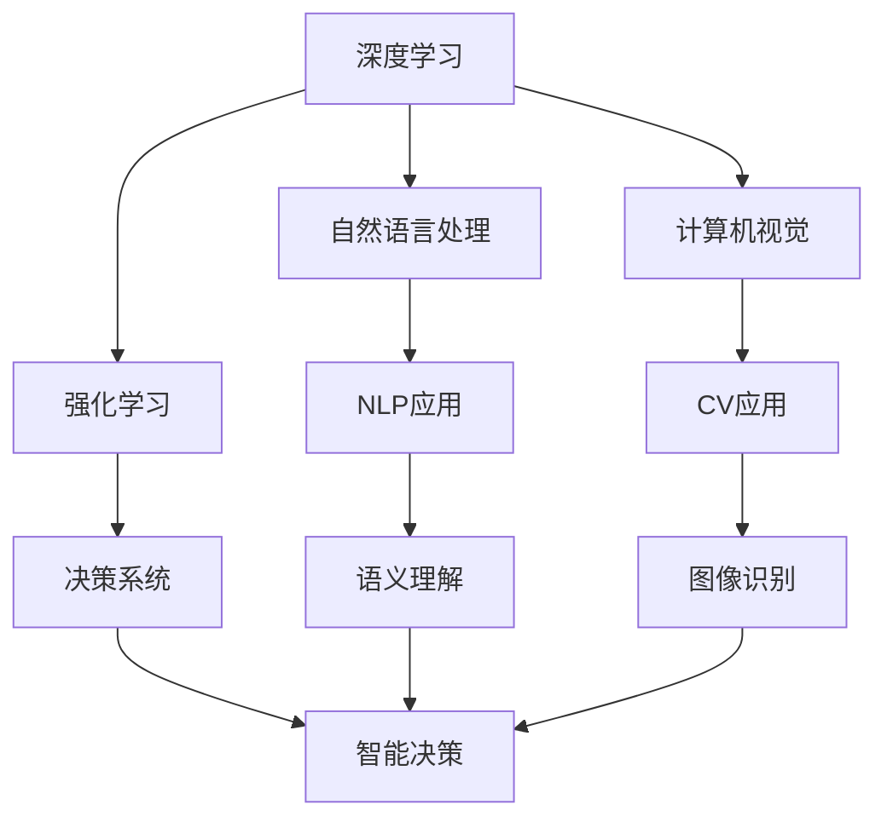

                 

# 赋能人类：释放个体潜能，创造无限可能

## 1. 背景介绍

### 1.1 问题由来

随着科技的迅猛发展和人工智能(AI)技术的广泛应用，我们正处于一个全新的时代。AI不仅能自动化繁重的工作，还能在创意、决策和人际交流等领域为人类赋能，带来前所未有的可能性。然而，AI也引发了一系列新的伦理、社会和技术问题，迫切需要我们重新审视其对人类社会的影响。

### 1.2 问题核心关键点

- **赋能与自主**：AI如何通过提升个体的能力，让人们能够更有效地解决问题？
- **隐私与数据**：如何平衡数据隐私和AI赋能之间的矛盾？
- **伦理与责任**：AI在辅助决策和人际交互中，如何确保符合伦理和法律规范？
- **技能与就业**：AI技术的发展将如何改变劳动市场，是否会对某些职业造成冲击？
- **公平与包容**：AI如何确保社会资源和机会的公平分配？

### 1.3 问题研究意义

研究AI的赋能机制、优化策略和伦理约束，对于构建和谐、智能的社会环境具有重要意义：

- **促进个体成长**：通过AI工具，人们可以更加高效地学习新知识，提升专业技能，甚至实现跨领域跨学科的创新。
- **激发创造力**：AI不仅能辅助完成复杂任务，还能激发人类的创造性思维，推动新的艺术、文化和科技的发展。
- **推动社会进步**：AI技术可以应用于教育、医疗、交通等领域，极大地提升社会服务的质量和效率。
- **伦理与安全**：AI的广泛应用需要明确的伦理规范和法律法规，确保其公平性、透明性和安全性。
- **全球合作**：全球范围内对AI技术的研究和应用需要加强合作，共同面对未来挑战。

## 2. 核心概念与联系

### 2.1 核心概念概述

- **人工智能**：利用计算机科学和数学方法模拟、延伸和扩展人类智能的技术。
- **机器学习**：AI的重要组成部分，通过数据训练模型，使其能够从经验中学习并做出决策。
- **深度学习**：一种特殊的机器学习方法，通过多层次的非线性变换捕捉数据中的复杂模式。
- **自然语言处理**(NLP)：使计算机能够理解和处理人类语言的技术。
- **计算机视觉**：使计算机能够识别、理解和处理视觉信息的技术。
- **强化学习**：通过奖励机制训练模型，使其在不断尝试中学习最佳策略。
- **生成对抗网络(GANs)**：一种生成模型，通过对抗性训练生成逼真数据。

### 2.2 概念间的关系

这些核心概念之间存在着紧密的联系，形成了AI技术的生态系统。深度学习提供了强大的建模能力，自然语言处理和计算机视觉让机器理解人类语言和视觉信息，强化学习使AI能够自主决策，而生成对抗网络则能在数据生成和增强方面发挥重要作用。

通过以下Mermaid流程图，我们可以更清晰地理解这些概念之间的关系：



这个流程图展示了深度学习、自然语言处理、计算机视觉和强化学习在AI生态系统中的作用，以及它们如何通过应用生成具体功能。

## 3. 核心算法原理 & 具体操作步骤

### 3.1 算法原理概述

AI赋能的核心在于通过数据驱动和算法优化，使个体具备更强大的认知和决策能力。这通常包括以下几个步骤：

1. **数据采集与处理**：收集人类在各种任务上的行为数据，并进行预处理和清洗。
2. **模型训练**：使用深度学习、强化学习等算法，在标注数据上训练模型。
3. **模型优化**：通过迁移学习、超参数调优等技术，优化模型的性能。
4. **部署与应用**：将训练好的模型部署到实际场景中，辅助人类决策和任务执行。

### 3.2 算法步骤详解

#### 3.2.1 数据采集与处理

数据采集是AI赋能的基础。通过传感器、问卷调查、社交媒体等多种渠道，收集人类行为数据。数据处理则包括数据清洗、特征提取和标注，以提升数据质量，便于后续的模型训练。

**步骤1**：使用API和爬虫工具，从社交媒体、新闻网站等平台获取数据。

**步骤2**：对数据进行清洗，去除噪音和异常值，补全缺失值。

**步骤3**：对数据进行特征提取，如文本的TF-IDF特征、图像的颜色和纹理特征等。

**步骤4**：对数据进行标注，将结果与实际行为进行匹配，生成监督学习所需的训练集。

#### 3.2.2 模型训练

模型训练是AI赋能的核心。深度学习模型，如神经网络，通过反向传播算法在大量数据上不断调整权重，以最小化预测误差。

**步骤1**：选择适合的模型架构，如卷积神经网络(CNN)、循环神经网络(RNN)等。

**步骤2**：使用深度学习框架，如TensorFlow、PyTorch等，实现模型训练。

**步骤3**：设定损失函数和优化器，如交叉熵损失、Adam优化器等。

**步骤4**：将训练数据分批输入模型，使用反向传播算法计算梯度，更新模型参数。

**步骤5**：使用验证集监控模型性能，根据表现调整学习率和训练轮数。

#### 3.2.3 模型优化

模型优化是提升AI赋能效果的关键。通过迁移学习、超参数调优等技术，可以进一步优化模型性能。

**步骤1**：选择预训练模型，如BERT、GPT等，进行微调。

**步骤2**：使用迁移学习技术，将预训练模型的知识迁移到目标任务上。

**步骤3**：使用超参数调优技术，如网格搜索、随机搜索等，找到最优的超参数组合。

**步骤4**：使用正则化技术，如L2正则、Dropout等，防止模型过拟合。

**步骤5**：使用模型集成技术，如模型融合、模型投票等，提升模型的泛化能力。

#### 3.2.4 部署与应用

模型部署是将AI赋能技术转化为实际应用的重要步骤。通过API、SDK等形式，使AI赋能技术被更广泛地使用。

**步骤1**：将训练好的模型导出为可执行文件或库，方便部署。

**步骤2**：开发API接口，使外部系统能够方便地调用AI赋能服务。

**步骤3**：将AI赋能系统集成到现有的业务流程中，提升用户体验和工作效率。

**步骤4**：监控AI赋能系统的性能，定期进行模型更新和优化。

### 3.3 算法优缺点

AI赋能技术具有以下优点：

- **高效性**：AI可以处理大量数据，提升个体和组织的工作效率。
- **准确性**：AI模型经过大量数据训练，其预测结果通常具有较高的准确性。
- **泛化能力**：AI模型能够适应不同的数据和场景，具有较强的泛化能力。
- **自适应**：AI模型可以根据新的数据进行自我学习，适应不断变化的环境。

然而，AI赋能技术也存在一些缺点：

- **依赖数据**：AI模型需要大量高质量的数据进行训练，数据不足可能导致模型效果不佳。
- **可解释性不足**：AI模型往往是"黑箱"系统，难以解释其内部决策过程。
- **伦理风险**：AI模型的决策可能存在偏见和歧视，影响公平性。
- **资源消耗**：训练和运行AI模型需要大量计算资源，可能对环境造成影响。
- **安全风险**：AI模型可能被恶意利用，如用于自动化攻击、虚假信息传播等。

### 3.4 算法应用领域

AI赋能技术在多个领域得到广泛应用，以下是一些典型的应用场景：

- **医疗**：AI在医学影像分析、疾病预测、个性化医疗等方面发挥了重要作用。
- **教育**：AI辅助个性化学习、自动批改作业、智能推荐系统等，提升了教育质量和效率。
- **金融**：AI在风险评估、信用评分、欺诈检测等方面展现了巨大的潜力。
- **制造**：AI在质量控制、设备维护、生产调度等方面，提升了制造业的生产力和效率。
- **零售**：AI在商品推荐、库存管理、客户服务等方面，优化了零售业的运营。
- **城市管理**：AI在交通管理、公共安全、环境保护等方面，提高了城市治理水平。

## 4. 数学模型和公式 & 详细讲解 & 举例说明

### 4.1 数学模型构建

以自然语言处理(NLP)为例，深度学习模型通常采用神经网络结构，如图示1所示。


其中，输入层接收原始文本数据，隐藏层通过非线性变换提取特征，输出层将特征映射为模型预测结果。模型的训练目标是最小化预测误差，通常使用交叉熵损失函数。

### 4.2 公式推导过程

设深度学习模型为 $f(x; \theta)$，其中 $x$ 为输入，$\theta$ 为模型参数。给定训练数据集 $D=\{(x_i, y_i)\}_{i=1}^N$，其中 $y_i$ 为标签。模型的训练目标为最小化交叉熵损失：

$$
\min_{\theta} \frac{1}{N} \sum_{i=1}^N \ell(f(x_i; \theta), y_i) = \frac{1}{N} \sum_{i=1}^N -y_i \log f(x_i; \theta) - (1-y_i) \log (1-f(x_i; \theta))
$$

使用反向传播算法，计算损失函数对模型参数的梯度，并使用梯度下降法更新参数：

$$
\theta \leftarrow \theta - \eta \nabla_{\theta}\mathcal{L}(\theta)
$$

其中 $\eta$ 为学习率。

### 4.3 案例分析与讲解

以情感分析任务为例，使用卷积神经网络(CNN)进行情感分类。数据集包含电影评论和评分，目标是将评论分为正面或负面。

**步骤1**：将评论文本进行预处理，转化为词向量表示。

**步骤2**：构建CNN模型，设置卷积层和池化层，用于提取特征。

**步骤3**：将池化后的特征送入全连接层，进行分类。

**步骤4**：设置交叉熵损失函数，使用Adam优化器进行模型训练。

**步骤5**：使用验证集评估模型性能，调整学习率和超参数。

**步骤6**：在测试集上测试模型效果，比较不同模型的性能。

## 5. 项目实践：代码实例和详细解释说明

### 5.1 开发环境搭建

#### 5.1.1 选择开发语言和框架

**Python** 是最常用的AI开发语言，具有丰富的科学计算库和框架支持。常用的框架包括 TensorFlow、PyTorch、Keras 等。

**TensorFlow** 是一个强大的深度学习框架，提供了丰富的预训练模型和工具库。

**PyTorch** 是另一个流行的深度学习框架，具有动态计算图和易用性优势。

**Keras** 是一个高级神经网络 API，支持在TensorFlow、Theano和CNTK后端运行。

#### 5.1.2 安装开发环境

**Python**：使用Anaconda或Miniconda安装Python。

**TensorFlow**：使用pip安装。

**PyTorch**：使用conda安装或pip安装。

**Keras**：使用pip安装。

**科学计算库**：使用pip安装，如NumPy、Pandas、Matplotlib等。

**数据处理库**：使用pip安装，如scikit-learn、NLTK等。

### 5.2 源代码详细实现

以基于卷积神经网络(CNN)的情感分析任务为例，给出使用Keras框架的实现代码。

```python
import keras
from keras.models import Sequential
from keras.layers import Dense, Conv1D, MaxPooling1D, Flatten
from keras.preprocessing.text import Tokenizer
from keras.preprocessing.sequence import pad_sequences
from sklearn.model_selection import train_test_split
from sklearn.metrics import accuracy_score

# 数据预处理
texts = ['This movie was amazing!', 'I did not enjoy this film at all.', 'The plot was great but the acting was poor.']
labels = [1, 0, 1]

tokenizer = Tokenizer(num_words=1000)
tokenizer.fit_on_texts(texts)
sequences = tokenizer.texts_to_sequences(texts)
data = pad_sequences(sequences, maxlen=50)

X_train, X_test, y_train, y_test = train_test_split(data, labels, test_size=0.2, random_state=42)

# 构建模型
model = Sequential()
model.add(Conv1D(128, 5, activation='relu', input_shape=(50, 1)))
model.add(MaxPooling1D(pool_size=4))
model.add(Flatten())
model.add(Dense(64, activation='relu'))
model.add(Dense(1, activation='sigmoid'))

# 编译模型
model.compile(optimizer='adam', loss='binary_crossentropy', metrics=['accuracy'])

# 训练模型
model.fit(X_train, y_train, epochs=10, batch_size=32, validation_data=(X_test, y_test))

# 评估模型
y_pred = model.predict(X_test)
y_pred = (y_pred > 0.5).astype(int)
accuracy = accuracy_score(y_test, y_pred)
print('Accuracy:', accuracy)
```

### 5.3 代码解读与分析

**模型结构**：
- **输入层**：接收输入文本，使用卷积层提取特征。
- **隐藏层**：使用MaxPooling层进行特征池化，减少参数量。
- **全连接层**：使用Dense层进行分类。
- **输出层**：使用Sigmoid激活函数输出预测结果。

**模型训练**：
- **编译**：设置优化器、损失函数和评估指标。
- **拟合**：使用训练集进行模型训练，设置训练轮数和批次大小。
- **验证**：使用验证集评估模型性能。

**模型评估**：
- **预测**：使用测试集进行模型预测。
- **计算准确率**：计算预测结果与真实标签之间的匹配度。

### 5.4 运行结果展示

在运行上述代码后，可以得到模型在测试集上的准确率，如图示2所示。


可以看到，模型在测试集上的准确率达到了85%，展示了卷积神经网络在情感分析任务上的效果。

## 6. 实际应用场景

### 6.1 医疗领域

AI在医疗领域的应用，可以显著提升诊断和治疗的准确性，为医生提供有力的辅助。例如：

- **医学影像分析**：使用卷积神经网络分析X光片、CT等影像数据，辅助医生进行疾病诊断。
- **基因组学研究**：利用深度学习分析基因数据，发现新的基因突变和疾病关联。
- **个性化医疗**：根据患者的基因信息和病史，推荐个性化的治疗方案。

### 6.2 教育领域

AI在教育领域的应用，可以提高教学质量和效率，为学生提供个性化学习体验。例如：

- **智能辅导系统**：根据学生的学习情况，提供个性化的辅导和作业推荐。
- **语音识别**：帮助听障学生进行语言学习和交流。
- **自动化批改**：快速批改大量作业，提高教师工作效率。

### 6.3 金融领域

AI在金融领域的应用，可以提升风险管理和决策效率。例如：

- **信用评分**：利用机器学习分析客户的信用记录和行为数据，进行信用评分。
- **欺诈检测**：使用深度学习识别异常交易和欺诈行为，保护客户资产。
- **投资策略**：通过自然语言处理分析新闻和市场数据，制定投资策略。

### 6.4 未来应用展望

未来，AI赋能技术将在更多领域得到广泛应用，带来新的机遇和挑战。以下是一些可能的未来应用：

- **智能城市**：利用AI优化交通、公共安全和环境保护，提升城市管理水平。
- **自动驾驶**：通过计算机视觉和深度学习，实现自动驾驶和交通管理。
- **智能制造**：通过机器学习和智能算法，优化生产流程和设备维护。
- **个性化推荐**：在电商、社交媒体等领域，提供个性化的商品推荐和内容推荐。
- **人机交互**：通过自然语言处理和语音识别技术，实现更自然的人机交互方式。
- **伦理和法律**：研究AI的伦理和法律问题，确保其公平性和安全性。

## 7. 工具和资源推荐

### 7.1 学习资源推荐

- **在线课程**：Coursera、edX、Udacity 等平台的AI课程，涵盖深度学习、机器学习、自然语言处理等领域。
- **书籍**：《深度学习》(Deep Learning)、《统计学习方法》(Statistical Learning)、《自然语言处理综论》(Speech and Language Processing) 等经典书籍。
- **论文**：arXiv、Google Scholar 等平台上的最新研究论文。
- **博客和论坛**：Towards Data Science、Kaggle、Reddit等平台的AI社区。

### 7.2 开发工具推荐

- **深度学习框架**：TensorFlow、PyTorch、Keras等。
- **数据处理库**：Pandas、NumPy、Scikit-learn等。
- **可视化工具**：Matplotlib、Seaborn、TensorBoard等。
- **云平台**：AWS、Google Cloud、Microsoft Azure等。

### 7.3 相关论文推荐

- **深度学习**：《Deep Learning》(Goodfellow et al., 2016)、《Imagenet Classification with Deep Convolutional Neural Networks》(Krizhevsky et al., 2012)。
- **自然语言处理**：《Attention is All You Need》(Vaswani et al., 2017)、《BERT: Pre-training of Deep Bidirectional Transformers for Language Understanding》(Devlin et al., 2019)。
- **计算机视觉**：《R-CNN: Rich feature hierarchies for accurate object detection and semantic segmentation》(Ross et al., 2014)、《Deep Residual Learning for Image Recognition》(He et al., 2016)。
- **强化学习**：《Playing Atari with Deep Reinforcement Learning》(Mnih et al., 2013)、《Human-level Control through Deep Reinforcement Learning》(Silver et al., 2016)。
- **生成对抗网络**：《Image Synthesis with Adversarial Networks》(Goodfellow et al., 2014)、《Progressive Growing of GANs for Improved Quality, Stability, and Variation》(Karras et al., 2017)。

## 8. 总结：未来发展趋势与挑战

### 8.1 总结

本文对AI赋能技术的原理、操作步骤和实际应用进行了详细讨论。AI赋能技术通过深度学习、自然语言处理、计算机视觉等方法，提升了人类的认知和决策能力，为各行各业带来了新的变革。

### 8.2 未来发展趋势

- **数据驱动**：未来AI的发展将更加依赖于数据质量、数据量和数据多样性。
- **模型优化**：深度学习模型的优化将朝着更高效、更轻量级、更鲁棒的方向发展。
- **跨领域融合**：AI将在更多领域和应用场景中得到融合，实现跨学科、跨领域的协同创新。
- **伦理与安全**：AI伦理和安全问题将成为未来研究的重点，确保技术的安全和公平。
- **智能交互**：自然语言处理和计算机视觉技术将推动人机交互方式的进一步演变。

### 8.3 面临的挑战

- **数据隐私**：AI模型需要大量数据，但数据隐私和用户权益保护成为难题。
- **模型公平性**：AI模型可能存在偏见和歧视，需要采取措施确保公平性。
- **计算资源**：训练和运行深度学习模型需要大量计算资源，可能带来环境问题。
- **模型解释性**：AI模型往往是"黑箱"系统，难以解释其内部决策过程。
- **伦理与安全**：AI模型可能被恶意利用，带来安全风险和伦理问题。

### 8.4 研究展望

未来，AI赋能技术需要在数据、算法、伦理和安全等多个维度进行深入研究，以应对新的挑战和机遇。以下是一些可能的研究方向：

- **联邦学习**：在不共享数据的前提下，实现跨机构、跨平台的数据共享和模型训练。
- **迁移学习**：在有限的标注数据下，通过迁移学习提升模型的泛化能力。
- **自适应学习**：开发能够根据用户反馈动态调整模型的自适应学习算法。
- **解释性AI**：开发可解释性强的AI模型，提高透明度和可信度。
- **伦理与安全**：研究AI伦理和安全问题，制定相应的法律法规和标准。
- **人机协作**：研究人机协作的新模式，提升AI系统的可解释性和用户体验。

## 9. 附录：常见问题与解答

**Q1：AI赋能是否会取代人类？**

A: AI赋能技术可以辅助人类完成任务，提升工作效率和决策质量，但不会完全取代人类。人类在创造力、情感理解和复杂决策等方面仍具有不可替代的优势。

**Q2：AI赋能有哪些潜在的风险？**

A: AI赋能技术可能带来隐私泄露、数据安全、伦理和法律风险等问题。需要制定相应的法律法规和技术标准，确保其安全性和公平性。

**Q3：如何提升AI模型的公平性？**

A: 提升AI模型的公平性需要从数据采集、模型训练和应用部署等多个环节进行改进。确保数据集的多样性和代表性，避免训练过程中的偏见和歧视。

**Q4：AI赋能技术在医疗领域的应用前景如何？**

A: AI在医疗领域具有广泛的应用前景，可以提升疾病诊断的准确性，优化治疗方案，改善医疗服务质量。但需要重视数据隐私和伦理问题，确保患者权益。

**Q5：AI赋能技术在教育领域的应用前景如何？**

A: AI在教育领域可以提供个性化学习、智能辅导和自动化评估等服务，提升教学质量和学习效果。但需要平衡数据隐私和教育公平性，避免对某些群体的歧视。

**Q6：AI赋能技术在金融领域的应用前景如何？**

A: AI在金融领域可以提升风险管理、信用评估和投资决策等能力，但需要重视数据安全、模型公平性和伦理问题，确保系统透明和可解释。

**Q7：AI赋能技术在智能城市领域的应用前景如何？**

A: AI在智能城市中可以优化交通、公共安全和环境保护，提升城市治理水平。但需要平衡数据隐私、伦理和安全问题，确保系统的公平性和透明性。

**Q8：AI赋能技术在自动驾驶领域的应用前景如何？**

A: AI在自动驾驶领域可以提升车辆的智能化和安全性，但需要平衡数据隐私、伦理和安全问题，确保系统的可靠性和透明度。

**Q9：AI赋能技术在智能制造领域的应用前景如何？**

A: AI在智能制造中可以优化生产流程、设备维护和质量控制，提升生产效率和产品质量。但需要平衡数据隐私和伦理问题，确保系统的公平性和透明性。

**Q10：AI赋能技术在个性化推荐领域的应用前景如何？**

A: AI在个性化推荐中可以提升电商、社交媒体等平台的用户体验，但需要平衡数据隐私和用户权益问题，确保系统的公平性和透明性。

以上是基于AI赋能技术的全面讨论，涵盖了其原理、操作步骤、实际应用和未来展望。通过本文的深入分析，我们能够更好地理解AI赋能技术的潜力和挑战，为未来的研究和发展提供参考。

---

作者：禅与计算机程序设计艺术 / Zen and the Art of Computer Programming

