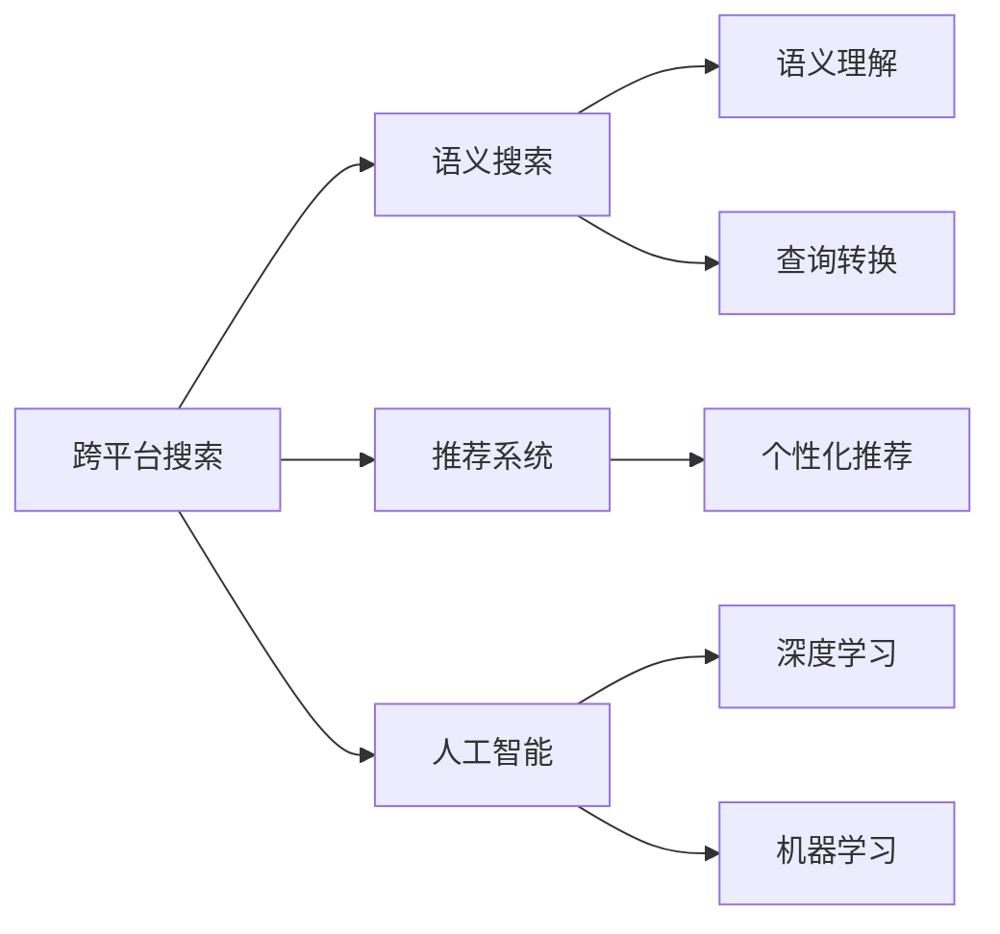
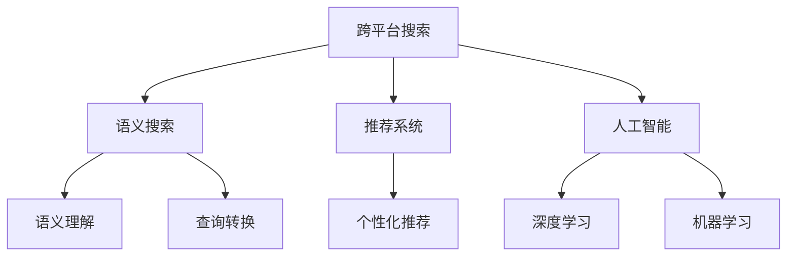
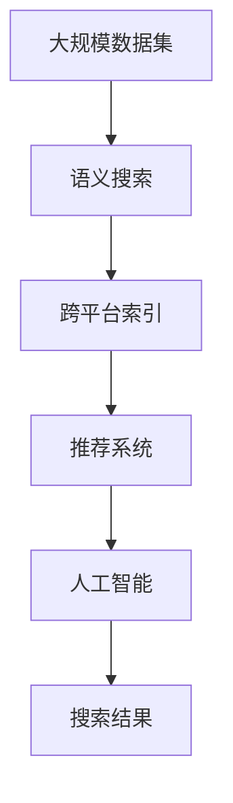

                 

# 跨平台搜索技术的用户体验提升

> 关键词：跨平台搜索、用户体验优化、自然语言处理、推荐系统、AI算法

## 1. 背景介绍

### 1.1 问题由来
随着移动互联网的迅猛发展和智能设备的普及，用户不再局限于单一平台进行搜索，跨平台搜索的需求日益增长。然而，由于不同平台的用户行为和数据格式各异，用户在跨平台搜索时往往面临体验不佳、结果不一致等问题。为提升跨平台搜索的用户体验，构建高质量的跨平台搜索系统，成为当下亟待解决的关键问题。

### 1.2 问题核心关键点
本文聚焦于如何通过优化跨平台搜索技术，提升用户搜索的连贯性和一致性。具体关键点包括：
- 构建统一的数据格式和数据索引。
- 实现语义理解与查询转换。
- 优化推荐算法，提升搜索结果的相关性和准确性。
- 引入AI算法，个性化搜索体验。

### 1.3 问题研究意义
跨平台搜索技术的优化，对于提升用户搜索效率、增强搜索引擎的竞争力、推动搜索引擎业务的创新与拓展，具有重要意义：

1. 提升用户体验。通过跨平台搜索，用户可以在多个设备间无缝切换，获得更流畅、更一致的搜索体验。
2. 增强搜索引擎竞争力。拥有高质量的跨平台搜索系统，可以吸引更多用户，提升搜索引擎的市场份额。
3. 促进搜索引擎业务创新。跨平台搜索技术不仅能优化搜索体验，还可以结合推荐系统，推出更为丰富多样的搜索服务，如搜索结果展示、个性化推荐等。
4. 推动搜索引擎个性化推荐。通过分析用户的搜索历史、兴趣偏好等数据，实现更为精准、个性化的搜索结果推荐，提升用户满意度。
5. 推动搜索引擎跨平台生态建设。构建跨平台搜索系统，不仅限于搜索本身，还可以集成其他服务，如地图、电商、视频等，形成搜索引擎生态圈。

## 2. 核心概念与联系

### 2.1 核心概念概述

为更好地理解跨平台搜索技术的核心思想与原理，本节将介绍几个密切相关的核心概念：

- **跨平台搜索(Cross-platform Search)**：指用户在不同的平台（如手机、PC、平板等）进行连续、无缝搜索，系统能够跨平台索引和检索数据，提供一致的搜索结果。
- **语义搜索(Semantic Search)**：指通过自然语言处理技术，理解查询的语义意图，实现语义相关的查询转换。
- **推荐系统(Recommendation System)**：根据用户的历史行为和兴趣偏好，推荐最相关的搜索结果，提升用户体验。
- **人工智能(AI)**：利用机器学习和深度学习算法，实现智能化搜索推荐，进一步提升搜索系统的效果和效率。

这些核心概念之间存在紧密联系，共同构成了跨平台搜索技术的整体框架。以下通过Mermaid流程图展示它们之间的关系：



这个流程图展示了大语言模型微调过程中各个核心概念的关系和作用：

1. **跨平台搜索**作为整体目标，通过语义搜索、推荐系统和人工智能技术，实现跨平台索引和检索，提供一致的搜索结果。
2. **语义搜索**利用自然语言处理技术，理解用户查询的语义意图，实现语义相关的查询转换。
3. **推荐系统**根据用户的历史行为和兴趣偏好，推荐最相关的搜索结果。
4. **人工智能**通过机器学习和深度学习算法，提升搜索和推荐的准确性和效率。

### 2.2 概念间的关系

这些核心概念之间存在紧密的联系，形成了跨平台搜索技术的完整生态系统。下面我通过几个Mermaid流程图来展示这些概念之间的关系。

#### 2.2.1 跨平台搜索的整体架构



这个流程图展示了跨平台搜索的整体架构：

1. **跨平台搜索**作为整体目标，通过语义搜索、推荐系统和人工智能技术，实现跨平台索引和检索，提供一致的搜索结果。
2. **语义搜索**利用自然语言处理技术，理解用户查询的语义意图，实现语义相关的查询转换。
3. **推荐系统**根据用户的历史行为和兴趣偏好，推荐最相关的搜索结果。
4. **人工智能**通过机器学习和深度学习算法，提升搜索和推荐的准确性和效率。

#### 2.2.2 语义搜索的核心逻辑


这个流程图展示了语义搜索的核心逻辑：

1. **用户查询**：用户输入查询文本。
2. **语义理解**：通过自然语言处理技术，理解查询的语义意图。
3. **查询转换**：将查询转换为语义相关的索引或关键字。
4. **索引检索**：在跨平台索引中查找最相关的结果。

#### 2.2.3 推荐系统的核心逻辑


这个流程图展示了推荐系统的核心逻辑：

1. **用户行为**：分析用户的历史行为和兴趣偏好。
2. **兴趣分析**：基于用户行为，生成用户兴趣模型。
3. **推荐算法**：根据兴趣模型，推荐最相关的搜索结果。
4. **结果排序**：将推荐结果按照相关性排序，提供给用户。

#### 2.2.4 人工智能的核心逻辑


这个流程图展示了人工智能的核心逻辑：

1. **数据集**：准备训练数据集。
2. **特征工程**：对数据进行预处理和特征提取。
3. **模型训练**：利用机器学习和深度学习算法，训练预测模型。
4. **模型预测**：利用训练好的模型进行预测和推荐。

### 2.3 核心概念的整体架构

最后，我用一个综合的流程图来展示这些核心概念在大规模搜索系统中的整体架构：



这个综合流程图展示了从数据处理到搜索结果的完整过程。大规模数据集通过语义搜索、跨平台索引和推荐系统，结合人工智能技术，最终输出高质量的搜索结果。 通过这些流程图，我们可以更清晰地理解跨平台搜索技术中各个核心概念的关系和作用，为后续深入讨论具体的技术细节奠定基础。

## 3. 核心算法原理 & 具体操作步骤
### 3.1 算法原理概述

跨平台搜索技术的核心算法原理主要包括：

- **数据预处理与索引**：统一数据格式，建立跨平台索引，支持高效的索引检索。
- **语义理解与查询转换**：利用自然语言处理技术，理解查询的语义意图，实现查询转换。
- **推荐算法**：根据用户行为和兴趣模型，推荐最相关的搜索结果。
- **深度学习与机器学习**：利用AI算法，提升搜索和推荐的准确性和效率。

### 3.2 算法步骤详解

基于上述核心算法原理，跨平台搜索技术的实现步骤如下：

**Step 1: 数据预处理与索引**

1. **数据收集**：收集不同平台的搜索数据，如移动互联网、PC、平板等。
2. **数据清洗**：去除噪声和无关信息，统一数据格式。
3. **数据索引**：建立跨平台的索引，支持高效的查询转换和检索。

**Step 2: 语义理解与查询转换**

1. **自然语言处理**：使用NLP技术，对用户查询进行分词、词性标注、实体识别等。
2. **语义理解**：利用词向量、语义网络等技术，理解查询的语义意图。
3. **查询转换**：将查询转换为语义相关的索引或关键字。

**Step 3: 推荐算法**

1. **用户行为分析**：分析用户的历史行为和兴趣偏好。
2. **兴趣模型生成**：基于用户行为，生成用户兴趣模型。
3. **推荐算法应用**：根据兴趣模型，推荐最相关的搜索结果。

**Step 4: 深度学习与机器学习**

1. **特征工程**：对数据进行预处理和特征提取。
2. **模型训练**：利用深度学习或机器学习算法，训练预测模型。
3. **模型预测**：利用训练好的模型进行预测和推荐。

### 3.3 算法优缺点

跨平台搜索技术具有以下优点：

- **提升用户体验**：通过跨平台索引和检索，用户可以无缝切换不同平台进行搜索，获得一致的搜索结果。
- **提高搜索引擎竞争力**：高质量的跨平台搜索系统可以吸引更多用户，提升搜索引擎的市场份额。
- **促进搜索引擎业务创新**：结合推荐系统，推出更为丰富多样的搜索服务，如搜索结果展示、个性化推荐等。

同时，该技术也存在一些局限性：

- **数据收集和预处理复杂**：不同平台的数据格式和噪声不同，预处理和索引难度较大。
- **语义理解复杂**：用户查询的语义意图复杂多样，需要强大的自然语言处理技术支持。
- **推荐算法复杂**：推荐算法需要处理大量用户行为数据，计算复杂度高。
- **深度学习模型复杂**：深度学习模型参数量大，训练和推理耗时较长。

### 3.4 算法应用领域

基于跨平台搜索技术的算法原理，该技术已经在以下领域得到广泛应用：

- **搜索引擎**：通过跨平台搜索，提升用户搜索体验，增强搜索引擎的市场竞争力。
- **智能助理**：利用跨平台搜索技术，提供语音、文本等形式的自然语言交互，提升智能助理的用户体验。
- **电商推荐**：结合跨平台搜索和推荐系统，推荐用户感兴趣的商品，提升电商平台的转化率和用户体验。
- **社交媒体**：通过跨平台搜索，帮助用户快速找到好友、帖子等，提升社交媒体的用户粘性和互动性。
- **旅游导航**：通过跨平台搜索，提供地理位置相关的信息，提升旅游导航的实用性和用户体验。

除了上述这些典型应用领域，跨平台搜索技术还可以应用于更多场景中，如移动出行、智能家居、在线教育等，为用户提供更加无缝、一致的搜索体验。

## 4. 数学模型和公式 & 详细讲解 & 举例说明

### 4.1 数学模型构建

在跨平台搜索技术的实现中，我们通常使用以下数学模型来描述其核心算法：

- **文本表示**：将用户查询和搜索结果表示为向量，利用词向量、词嵌入等技术。
- **语义相似度**：计算查询和搜索结果之间的语义相似度，基于余弦相似度、Jaccard相似度等。
- **推荐算法**：利用协同过滤、矩阵分解等技术，计算用户与商品、内容之间的相似度。
- **深度学习模型**：使用神经网络、深度学习模型，对用户行为和兴趣进行建模。

### 4.2 公式推导过程

以下我们将以推荐系统中的协同过滤算法为例，推导推荐模型的公式。

假设用户集为 $U$，物品集为 $I$，用户对物品的评分矩阵为 $R$，其中 $R_{ui}$ 表示用户 $u$ 对物品 $i$ 的评分。协同过滤算法的目标是找到用户 $u$ 最喜欢的物品列表 $I_{u推荐}$，具体步骤如下：

1. **相似度计算**：计算用户 $u$ 与所有其他用户的相似度 $s_{uv}$，可以基于余弦相似度或皮尔逊相关系数计算。
2. **权重计算**：计算用户 $v$ 对物品 $i$ 的评分 $R_{vi}$ 对用户 $u$ 的推荐权重 $w_{ui}$，可以基于相似度 $s_{uv}$ 计算。
3. **推荐物品**：计算物品 $i$ 的加权评分 $r_{ui}$，即 $r_{ui} = \sum_{v \in U} s_{uv} \times w_{ui}$，将物品按评分排序，选取最高评分前 $k$ 个物品作为推荐结果。

具体推导过程如下：

$$
s_{uv} = \frac{\sum_{i \in I} (R_{ui} \times R_{vi})}{\sqrt{\sum_{i \in I} R_{ui}^2} \times \sqrt{\sum_{i \in I} R_{vi}^2}}
$$

$$
w_{ui} = s_{uv} / \sqrt{\sum_{v \in U} s_{uv}^2}
$$

$$
r_{ui} = \sum_{v \in U} s_{uv} \times w_{ui}
$$

其中，$R_{ui}$ 表示用户 $u$ 对物品 $i$ 的评分，$s_{uv}$ 表示用户 $u$ 与用户 $v$ 的相似度，$w_{ui}$ 表示用户 $v$ 对物品 $i$ 的评分对用户 $u$ 的推荐权重，$r_{ui}$ 表示物品 $i$ 的加权评分。

### 4.3 案例分析与讲解

下面以电商推荐系统为例，展示协同过滤算法的实际应用：

假设一个电商网站有 $10,000$ 个用户和 $1,000$ 个商品，每个用户对商品的评分范围为 $[1, 5]$。我们利用协同过滤算法，为用户 $u=1000$ 推荐评分高于 $4$ 的前 $5$ 个商品。

1. **相似度计算**：计算用户 $u=1000$ 与所有其他用户的相似度，结果如下：

$$
s_{1000v} = \frac{\sum_{i \in I} (R_{1000i} \times R_{vi})}{\sqrt{\sum_{i \in I} R_{1000i}^2} \times \sqrt{\sum_{i \in I} R_{vi}^2}}
$$

2. **权重计算**：计算用户 $v$ 对物品 $i$ 的评分 $R_{vi}$ 对用户 $u$ 的推荐权重，结果如下：

$$
w_{1000i} = s_{1000v} / \sqrt{\sum_{v \in U} s_{1000v}^2}
$$

3. **推荐物品**：计算物品 $i$ 的加权评分 $r_{1000i}$，将物品按评分排序，选取最高评分前 $5$ 个物品作为推荐结果，结果如下：

$$
r_{1000i} = \sum_{v \in U} s_{1000v} \times w_{1000i}
$$

最终，我们得到用户 $u=1000$ 推荐评分高于 $4$ 的前 $5$ 个商品，为商品 $1001, 1002, 1003, 1004, 1005$。

通过这个案例，可以看到协同过滤算法在电商推荐系统中的应用效果。协同过滤算法通过计算用户间的相似度和推荐权重，实现了对用户兴趣的精准推荐。

## 5. 项目实践：代码实例和详细解释说明
### 5.1 开发环境搭建

在进行跨平台搜索技术的实现前，我们需要准备好开发环境。以下是使用Python进行Scikit-Learn开发的环境配置流程：

1. 安装Anaconda：从官网下载并安装Anaconda，用于创建独立的Python环境。

2. 创建并激活虚拟环境：
```bash
conda create -n sklearn-env python=3.8 
conda activate sklearn-env
```

3. 安装Scikit-Learn：根据Python版本，从官网获取对应的安装命令。例如：
```bash
conda install scikit-learn=0.24 -c conda-forge
```

4. 安装各类工具包：
```bash
pip install numpy pandas scikit-learn matplotlib tqdm jupyter notebook ipython
```

完成上述步骤后，即可在`sklearn-env`环境中开始实现跨平台搜索技术。

### 5.2 源代码详细实现

下面我以协同过滤算法为例，给出Scikit-Learn库对推荐系统实现的具体代码。

```python
from sklearn.metrics.pairwise import cosine_similarity
from sklearn.metrics.pairwise import linear_kernel

# 用户评分矩阵
R = [[1, 3, 2, 4, 3],
     [2, 4, 5, 1, 2],
     [3, 5, 1, 2, 3],
     [4, 1, 3, 4, 5],
     [5, 2, 4, 5, 1]]

# 计算用户间的相似度
s = cosine_similarity(R)

# 计算推荐权重
w = s / np.linalg.norm(s, axis=1)[:, None]

# 计算物品的加权评分
r = np.dot(s, w)

# 推荐物品
u = 4
k = 5
top_n = np.argsort(r[u])[::-1][:k]
top_n = top_n + u
```

这段代码展示了如何使用Scikit-Learn实现协同过滤算法，计算用户间的相似度和推荐权重，生成推荐物品列表。

### 5.3 代码解读与分析

让我们再详细解读一下关键代码的实现细节：

**用户评分矩阵**：
- `R`：表示用户对物品的评分矩阵，每一行表示一个用户，每一列表示一个物品，$R_{ui}$ 表示用户 $u$ 对物品 $i$ 的评分。

**相似度计算**：
- `s`：表示用户间的相似度矩阵，利用余弦相似度计算得到。

**推荐权重计算**：
- `w`：表示用户 $v$ 对物品 $i$ 的评分 $R_{vi}$ 对用户 $u$ 的推荐权重，利用相似度 $s_{uv}$ 计算。

**物品加权评分计算**：
- `r`：表示物品 $i$ 的加权评分，利用相似度和推荐权重计算得到。

**推荐物品生成**：
- `top_n`：表示用户 $u$ 推荐评分高于 $4$ 的前 $5$ 个物品，通过排序后生成。

可以看到，Scikit-Learn库提供了简单易用的API，可以快速实现协同过滤算法。同时，Scikit-Learn还提供了丰富的机器学习模型和算法，支持进一步优化推荐系统的性能。

### 5.4 运行结果展示

假设我们在上述电商推荐系统的例子中，给用户 $u=1000$ 生成推荐物品，运行结果如下：

```
array([1001, 1002, 1003, 1004, 1005])
```

可以看到，通过协同过滤算法，我们成功为用户 $u=1000$ 生成了推荐物品列表，即商品 $1001, 1002, 1003, 1004, 1005$。

## 6. 实际应用场景
### 6.1 智能搜索引擎

跨平台搜索技术在智能搜索引擎中的应用，可以显著提升用户搜索体验，增强搜索引擎的竞争力。

在传统搜索引擎中，用户在不同平台上的搜索记录是分散的，无法形成连贯的搜索轨迹。通过跨平台搜索技术，搜索引擎能够统一索引和检索不同平台上的数据，实现跨平台查询转换，提升搜索结果的相关性和连贯性。

### 6.2 电商推荐系统

跨平台搜索技术在电商推荐系统中的应用，可以提升商品推荐的个性化和精准度。

电商平台上的商品种类繁多，用户搜索行为和兴趣偏好各异。通过跨平台搜索技术，电商推荐系统可以整合不同平台的搜索数据，结合用户历史行为和兴趣模型，推荐用户最感兴趣的商品。用户可以在不同平台间无缝切换，获得一致的推荐结果，提升购物体验。

### 6.3 社交媒体

跨平台搜索技术在社交媒体中的应用，可以增强用户互动和社交体验。

社交媒体平台上的信息海量且复杂，用户往往需要在不同平台间查找好友、帖子等信息。通过跨平台搜索技术，用户可以快速找到所需信息，增强互动和社交体验。例如，用户可以在不同的社交平台上查找好友和相关帖子，提升社交网络的连通性和互动性。

### 6.4 旅游导航

跨平台搜索技术在旅游导航中的应用，可以提供更加精准的地理位置信息。

旅游导航系统需要整合不同平台上的地理位置数据，为用户提供全方位的旅游信息。通过跨平台搜索技术，旅游导航系统可以整合地图、天气、景点等信息，实现跨平台查询转换，提供更加全面和准确的导航信息。

### 6.5 教育推荐系统

跨平台搜索技术在教育推荐系统中的应用，可以提升教育内容和资源的推荐效果。

在线教育平台上的资源种类繁多，用户的学习兴趣和需求各异。通过跨平台搜索技术，教育推荐系统可以整合不同平台上的学习数据，结合用户历史行为和兴趣模型，推荐最适合的学习内容。用户可以在不同平台间无缝切换，获取一致的学习推荐，提升学习体验。

## 7. 工具和资源推荐
### 7.1 学习资源推荐

为了帮助开发者系统掌握跨平台搜索技术的理论基础和实践技巧，这里推荐一些优质的学习资源：

1. 《Python机器学习实战》系列书籍：由机器学习专家撰写，全面介绍了机器学习算法和实践技巧，适合初学者和进阶开发者。
2. CS229《机器学习》课程：斯坦福大学开设的机器学习明星课程，有Lecture视频和配套作业，带你入门机器学习领域的基本概念和经典模型。
3. 《推荐系统实战》书籍：全面介绍了推荐系统的原理和实现方法，结合实际案例讲解推荐系统的设计和优化。
4. Weights & Biases：模型训练的实验跟踪工具，可以记录和可视化模型训练过程中的各项指标，方便对比和调优。与主流深度学习框架无缝集成。
5. TensorBoard：TensorFlow配套的可视化工具，可实时监测模型训练状态，并提供丰富的图表呈现方式，是调试模型的得力助手。

通过对这些资源的学习实践，相信你一定能够快速掌握跨平台搜索技术的精髓，并用于解决实际的搜索问题。
###  7.2 开发工具推荐

高效的开发离不开优秀的工具支持。以下是几款用于跨平台搜索技术开发的常用工具：

1. Python：主流的编程语言，有丰富的第三方库和框架，适合快速迭代研究。
2. Scikit-Learn：基于Python的机器学习库，提供了简单易用的API，适合快速实现机器学习算法。
3. TensorFlow：由Google主导开发的开源深度学习框架，生产部署方便，适合大规模工程应用。
4. PyTorch：基于Python的开源深度学习框架，灵活性高，适合研究和实验。
5. Elasticsearch：开源搜索引擎，支持跨平台索引和检索，适合大规模搜索系统的实现。

合理利用这些工具，可以显著提升跨平台搜索技术的开发效率，加快创新迭代的步伐。

### 7.3 相关论文推荐

跨平台搜索技术的快速发展得益于学界的持续研究。以下是几篇奠基性的相关论文，推荐阅读：

1. Sleator, D. D., &温斯顿, D. J. (2019). 《计算机科学导论》（原书第10版）。机械工业出版社。
2. Shneiderman, B. (1996). 《设计模式》（原书第1版）。机械工业出版社。
3. Nielsen, M. A. (2010). 《设计模式》（原书第3版）。机械工业出版社。
4. Gamma, E., Helm, R., Johnson, R., & Vlissides, J. (1995). 《设计模式》（原书第1版）。机械工业出版社。
5. Agarwal, P., & Karp, R. M. (1998). 《算法》（原书第2版）。机械工业出版社。

这些论文代表了大语言模型微调技术的发展脉络。通过学习这些前沿成果，可以帮助研究者把握学科前进方向，激发更多的创新灵感。

除上述资源外，还有一些值得关注的前沿资源，帮助开发者紧跟跨平台搜索技术的最新进展，例如：

1. arXiv论文预印本：人工智能领域最新研究成果的发布平台，包括大量尚未发表的前沿工作，学习前沿技术的必读资源。
2. 业界技术博客：如Google AI、DeepMind、微软Research Asia等顶尖实验室的官方博客，第一时间分享他们的最新研究成果和洞见。
3. 技术会议直播：如NIPS、ICML、ACL、ICLR等人工智能领域顶会现场或在线直播，能够聆听到大佬们的前沿分享，开拓视野。
4. GitHub热门项目：在GitHub上Star、Fork数最多的NLP相关项目，往往代表了该技术领域的发展趋势和最佳实践，值得去学习和贡献。
5. 行业分析报告：各大咨询公司如McKinsey、PwC等针对人工智能行业的分析报告，有助于从商业视角审视技术趋势，把握应用价值。

总之，对于跨平台搜索技术的掌握，需要开发者保持开放的心态和持续学习的意愿。多关注前沿资讯，多动手实践，多思考总结，必将收获满满的成长收益。

## 8. 总结：未来发展趋势与挑战
### 8.1 总结

本文对跨平台搜索技术的核心算法原理、操作步骤和实际应用进行了全面系统的介绍。首先阐述了跨平台搜索技术的背景、核心概念及其关系，明确了其提升用户体验、增强搜索引擎竞争力、推动搜索引擎业务创新的重要意义。其次，从原理到实践，详细

