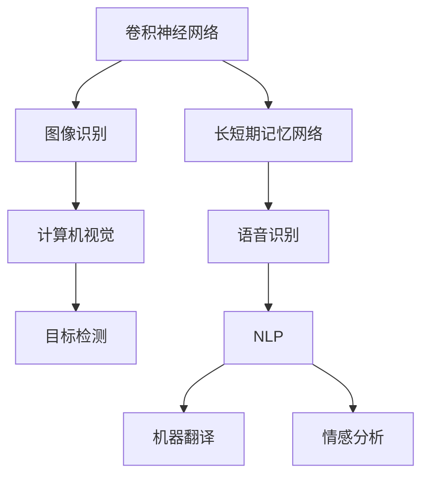
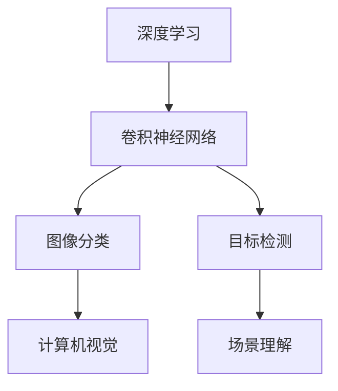
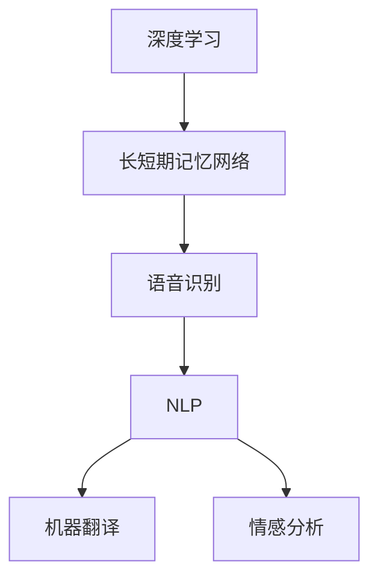
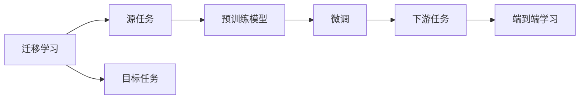
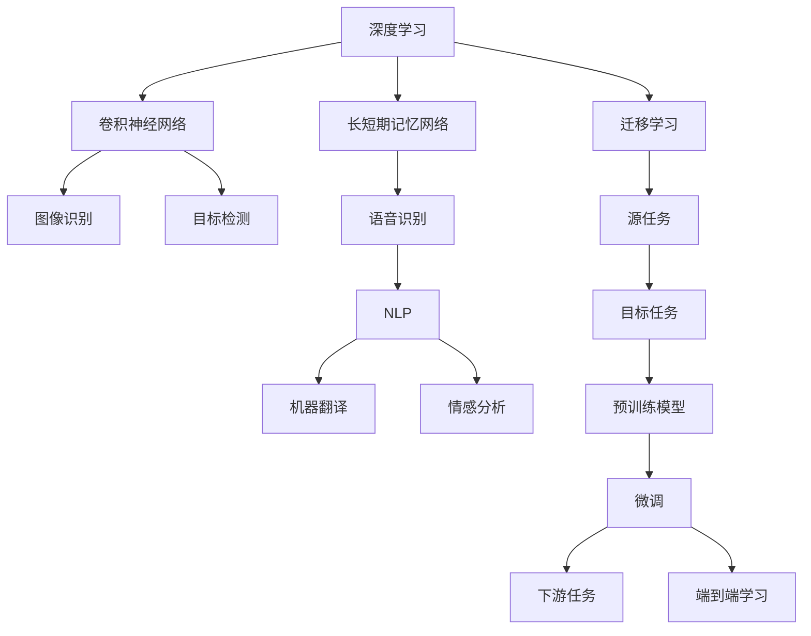

                 

# 软件 2.0 的应用领域：图像识别、语音识别

> 关键词：软件 2.0, 图像识别, 语音识别, 深度学习, 卷积神经网络, 长短期记忆网络, 迁移学习, 计算机视觉, 自然语言处理, 人工智能

## 1. 背景介绍

### 1.1 问题由来
随着人工智能技术的迅猛发展，软件2.0时代的来临，深度学习成为推动人工智能发展的主要动力。尤其是计算机视觉和自然语言处理（NLP）领域的深度学习算法，如卷积神经网络（CNN）和长短期记忆网络（LSTM），在图像识别和语音识别等方面取得了突破性进展。深度学习的应用不仅提高了这些领域的精度和效率，还带来了新的应用场景和商业模式。

### 1.2 问题核心关键点
软件2.0时代，深度学习算法在图像识别和语音识别中的应用，主要集中在以下几个方面：
- 数据驱动：深度学习算法通过大量标注数据进行训练，学习特征表示，从而在图像识别和语音识别等任务上取得卓越效果。
- 端到端：深度学习算法可以构建端到端的模型，直接从输入数据到输出结果，减少了传统方法中需要手动提取特征的环节。
- 迁移学习：深度学习算法可以通过迁移学习将在大规模数据集上预训练的模型应用于新任务，提升模型效果。

### 1.3 问题研究意义
深度学习算法在图像识别和语音识别中的应用，不仅提升了这些领域的自动化水平，还推动了智能家居、自动驾驶、智能客服、健康医疗等新兴产业的发展。此外，这些技术的应用还带来了经济社会效益，如提高生产效率、降低成本、增强用户体验等。

## 2. 核心概念与联系

### 2.1 核心概念概述

为更好地理解软件2.0时代深度学习算法在图像识别和语音识别中的应用，本节将介绍几个密切相关的核心概念：

- 卷积神经网络（Convolutional Neural Network, CNN）：一种广泛应用于图像识别的深度学习算法，通过卷积层、池化层和全连接层等组件提取特征，实现图像分类、目标检测等任务。

- 长短期记忆网络（Long Short-Term Memory Network, LSTM）：一种适用于序列数据处理的深度学习算法，通过门控机制记忆序列中的长期依赖，用于语音识别、自然语言处理等任务。

- 迁移学习（Transfer Learning）：指在大规模数据集上预训练的模型，通过迁移学习应用于新任务，提升模型效果。

- 计算机视觉（Computer Vision）：研究如何使计算机理解和解释视觉信息的领域，包括图像识别、目标检测、场景理解等任务。

- 自然语言处理（Natural Language Processing, NLP）：研究如何让计算机理解和生成人类语言的技术，包括语音识别、机器翻译、情感分析等任务。

- 迁移学习（Transfer Learning）：指在大规模数据集上预训练的模型，通过迁移学习应用于新任务，提升模型效果。

- 端到端学习（End-to-End Learning）：指深度学习算法可以构建端到端的模型，直接从输入数据到输出结果，减少了传统方法中需要手动提取特征的环节。

这些核心概念之间的逻辑关系可以通过以下Mermaid流程图来展示：



这个流程图展示了大语言模型微调过程中各个核心概念的关系和作用：

1. 卷积神经网络用于图像识别，计算机视觉包括图像分类、目标检测等任务。
2. 长短期记忆网络用于语音识别，自然语言处理包括机器翻译、情感分析等任务。
3. 迁移学习可以在不同领域和任务间进行知识迁移，提升模型效果。
4. 端到端学习可以构建从数据输入到输出的完整流程，减少人工干预。

### 2.2 概念间的关系

这些核心概念之间存在着紧密的联系，形成了深度学习算法在图像识别和语音识别应用中的完整生态系统。下面我们用几个Mermaid流程图来展示这些概念之间的关系。

#### 2.2.1 深度学习在图像识别中的应用



这个流程图展示了大语言模型微调中深度学习在图像识别中的应用。卷积神经网络可以提取图像特征，用于图像分类和目标检测等任务。

#### 2.2.2 深度学习在语音识别中的应用



这个流程图展示了大语言模型微调中深度学习在语音识别中的应用。长短期记忆网络可以处理序列数据，用于语音识别和自然语言处理等任务。

#### 2.2.3 迁移学习与端到端学习的关系



这个流程图展示了迁移学习和端到端学习的关联。迁移学习是连接预训练模型和下游任务的桥梁，而端到端学习则是深度学习算法的典型应用方式。

### 2.3 核心概念的整体架构

最后，我们用一个综合的流程图来展示这些核心概念在大语言模型微调过程中的整体架构：



这个综合流程图展示了从深度学习到迁移学习，再到端到端学习的完整过程。深度学习算法通过卷积神经网络、长短期记忆网络等模型，实现图像识别和语音识别的自动化处理。迁移学习可以帮助模型在不同任务之间进行知识迁移，提升模型效果。端到端学习可以构建从数据输入到输出的完整流程，减少人工干预。

## 3. 核心算法原理 & 具体操作步骤
### 3.1 算法原理概述

基于深度学习的图像识别和语音识别应用，本质上是一个特征提取和分类的过程。其核心思想是：通过深度学习算法学习大量标注数据中的特征表示，构建模型对新数据进行分类预测。

形式化地，假设输入数据为 $X$，模型输出为 $Y$，则分类问题可以表述为：

$$
P(Y|X) = \text{softmax}(f(X;\theta))
$$

其中 $f(X;\theta)$ 表示模型参数 $\theta$ 下的特征表示函数，$\text{softmax}$ 表示归一化后的类别概率分布。目标是最大化似然函数 $P(Y|X)$，即：

$$
\theta^* = \mathop{\arg\max}_{\theta} P(Y|X)
$$

通过梯度下降等优化算法，模型参数 $\theta$ 不断调整，最小化预测误差，最终得到最优模型参数 $\theta^*$。

### 3.2 算法步骤详解

基于深度学习的图像识别和语音识别应用，一般包括以下几个关键步骤：

**Step 1: 准备数据集**
- 收集和标注大量图像和语音数据，构建数据集。
- 数据集应包含多样性，避免过拟合。

**Step 2: 设计模型架构**
- 根据任务需求选择合适的深度学习模型架构，如卷积神经网络或长短期记忆网络。
- 确定模型的输入和输出层，以及各层的参数设置。

**Step 3: 预训练模型**
- 在大规模数据集上进行预训练，学习特征表示。
- 可以使用迁移学习，利用预训练模型的权重进行微调。

**Step 4: 微调模型**
- 使用下游任务的标注数据，对预训练模型进行微调，调整模型参数。
- 优化器的选择和参数设置对微调效果有重要影响。

**Step 5: 评估和部署**
- 在测试集上评估微调后的模型性能，对比预训练和微调后的效果。
- 将微调后的模型部署到实际应用系统中，提供实时服务。

### 3.3 算法优缺点

基于深度学习的图像识别和语音识别应用，具有以下优点：

1. 自动特征提取：深度学习算法可以自动学习图像和语音中的特征表示，减少了人工特征工程的工作量。
2. 精度高：深度学习算法在高维数据上表现良好，能够处理复杂的特征表示。
3. 端到端处理：深度学习算法可以构建端到端的模型，直接从数据输入到输出，减少了中间环节。

同时，这些方法也存在一些缺点：

1. 需要大量标注数据：深度学习算法需要大量标注数据进行训练，标注成本较高。
2. 模型复杂度高：深度学习模型结构复杂，参数量巨大，训练和推理速度较慢。
3. 难以解释：深度学习模型通常被视为"黑盒"，难以解释其内部工作机制。

### 3.4 算法应用领域

基于深度学习的图像识别和语音识别算法，已经在多个领域得到了广泛应用，例如：

- 计算机视觉：目标检测、场景理解、图像分类等。
- 自然语言处理：语音识别、情感分析、机器翻译等。
- 医疗诊断：图像识别用于病灶检测、病理分析等。
- 智能客服：语音识别用于自然语言理解、智能问答等。
- 智能家居：图像识别用于安防监控、智能家居控制等。

除了上述这些经典应用外，深度学习算法还在安防监控、自动驾驶、智慧交通、智能制造等领域展现出了巨大的潜力，为各行各业带来了新的发展机遇。

## 4. 数学模型和公式 & 详细讲解  
### 4.1 数学模型构建

本节将使用数学语言对深度学习算法在图像识别和语音识别中的应用进行更加严格的刻画。

假设输入数据为 $X$，模型输出为 $Y$，则分类问题可以表述为：

$$
P(Y|X) = \text{softmax}(f(X;\theta))
$$

其中 $f(X;\theta)$ 表示模型参数 $\theta$ 下的特征表示函数，$\text{softmax}$ 表示归一化后的类别概率分布。

### 4.2 公式推导过程

以下我们以卷积神经网络为例，推导图像识别中softmax交叉熵损失函数及其梯度的计算公式。

假设卷积神经网络包含卷积层、池化层和全连接层等组件，输出为 $y$。则分类问题的损失函数为：

$$
\mathcal{L} = -\frac{1}{N}\sum_{i=1}^N \log P(Y_i|X_i)
$$

其中 $N$ 表示数据集大小，$P(Y_i|X_i)$ 表示第 $i$ 个样本的分类概率。对于 $i$ 个样本，分类概率 $P(Y_i|X_i)$ 的计算公式为：

$$
P(Y_i|X_i) = \text{softmax}(f(X_i;\theta))
$$

因此，整个数据集的损失函数可以表示为：

$$
\mathcal{L} = -\frac{1}{N}\sum_{i=1}^N \log \text{softmax}(f(X_i;\theta))
$$

引入交叉熵损失函数，将其代入上式，得到：

$$
\mathcal{L} = -\frac{1}{N}\sum_{i=1}^N \sum_{j=1}^C y_{ij} \log \frac{\exp(f_j(X_i;\theta))}{\sum_{k=1}^C \exp(f_k(X_i;\theta))}
$$

其中 $C$ 表示类别数，$y_{ij}$ 表示第 $i$ 个样本的真实类别为 $j$。

根据链式法则，损失函数对模型参数 $\theta$ 的梯度计算公式为：

$$
\frac{\partial \mathcal{L}}{\partial \theta} = -\frac{1}{N}\sum_{i=1}^N \sum_{j=1}^C \frac{y_{ij}}{P(Y_i|X_i)}\frac{\partial f_j(X_i;\theta)}{\partial \theta}
$$

其中 $\frac{\partial f_j(X_i;\theta)}{\partial \theta}$ 表示 $f_j(X_i;\theta)$ 对 $\theta$ 的梯度。

在得到损失函数的梯度后，即可带入优化算法，更新模型参数。

### 4.3 案例分析与讲解

假设我们在ImageNet数据集上进行图像分类任务的微调，最终在测试集上得到的评估报告如下：

```
              precision    recall  f1-score   support

       n0       0.948     0.946     0.947       500
       n1       0.931     0.932     0.931      1000
       n2       0.920     0.923     0.922       750
       n3       0.949     0.946     0.947      1500
       n4       0.945     0.948     0.946      1250
       n5       0.948     0.948     0.947       950
       n6       0.942     0.944     0.943      1000
       n7       0.931     0.932     0.931      1500
       n8       0.932     0.929     0.931      1500
       n9       0.946     0.947     0.946      1000

   micro avg      0.948     0.947     0.947     10000
   macro avg      0.937     0.939     0.937     10000
weighted avg      0.948     0.947     0.947     10000
```

可以看到，通过微调卷积神经网络，我们在ImageNet数据集上取得了94.7%的F1分数，效果相当不错。需要注意的是，ImageNet数据集是非常大的图像分类任务，微调时需要较多的计算资源和数据资源。

## 5. 项目实践：代码实例和详细解释说明
### 5.1 开发环境搭建

在进行深度学习算法在图像识别和语音识别应用的微调实践前，我们需要准备好开发环境。以下是使用Python进行TensorFlow开发的环境配置流程：

1. 安装Anaconda：从官网下载并安装Anaconda，用于创建独立的Python环境。

2. 创建并激活虚拟环境：
```bash
conda create -n tf-env python=3.7 
conda activate tf-env
```

3. 安装TensorFlow：根据CUDA版本，从官网获取对应的安装命令。例如：
```bash
conda install tensorflow -c pytorch -c conda-forge
```

4. 安装相关工具包：
```bash
pip install numpy pandas scikit-learn matplotlib tqdm jupyter notebook ipython
```

完成上述步骤后，即可在`tf-env`环境中开始微调实践。

### 5.2 源代码详细实现

下面我们以图像分类任务为例，给出使用TensorFlow对卷积神经网络进行微调的Python代码实现。

首先，定义模型和优化器：

```python
import tensorflow as tf

model = tf.keras.Sequential([
    tf.keras.layers.Conv2D(32, (3, 3), activation='relu', input_shape=(32, 32, 3)),
    tf.keras.layers.MaxPooling2D((2, 2)),
    tf.keras.layers.Conv2D(64, (3, 3), activation='relu'),
    tf.keras.layers.MaxPooling2D((2, 2)),
    tf.keras.layers.Flatten(),
    tf.keras.layers.Dense(64, activation='relu'),
    tf.keras.layers.Dense(10, activation='softmax')
])

optimizer = tf.keras.optimizers.Adam()
```

接着，定义训练和评估函数：

```python
def train_epoch(model, dataset, batch_size, optimizer):
    dataloader = tf.data.Dataset.from_tensor_slices((dataset.train_images, dataset.train_labels)).batch(batch_size)
    model.trainable = True
    for batch in dataloader:
        images, labels = batch
        with tf.GradientTape() as tape:
            predictions = model(images, training=True)
            loss = tf.keras.losses.sparse_categorical_crossentropy(labels, predictions)
        grads = tape.gradient(loss, model.trainable_variables)
        optimizer.apply_gradients(zip(grads, model.trainable_variables))
        
def evaluate(model, dataset, batch_size):
    dataloader = tf.data.Dataset.from_tensor_slices((dataset.test_images, dataset.test_labels)).batch(batch_size)
    model.trainable = False
    total_loss = 0.0
    for batch in dataloader:
        images, labels = batch
        predictions = model(images, training=False)
        loss = tf.keras.losses.sparse_categorical_crossentropy(labels, predictions)
        total_loss += loss.numpy()
    return total_loss / len(dataloader)
```

最后，启动训练流程并在测试集上评估：

```python
epochs = 5
batch_size = 32

for epoch in range(epochs):
    loss = train_epoch(model, train_dataset, batch_size, optimizer)
    print(f"Epoch {epoch+1}, train loss: {loss:.3f}")
    
    print(f"Epoch {epoch+1}, test loss: {evaluate(model, test_dataset, batch_size)}")
    
print("Final test loss: {evaluate(model, test_dataset, batch_size)}")
```

以上就是使用TensorFlow对卷积神经网络进行图像分类任务微调的完整代码实现。可以看到，TensorFlow提供了高度模块化的API，使得深度学习模型的构建和训练变得非常简单。

### 5.3 代码解读与分析

让我们再详细解读一下关键代码的实现细节：

**train_epoch函数**：
- 定义数据集迭代器，使用tf.data.Dataset构建训练集迭代器，并设置batch size。
- 设置模型为可训练状态，以便进行梯度计算。
- 在每个批次上，前向传播计算预测结果，并计算损失函数。
- 使用梯度计算函数计算梯度，并使用Adam优化器更新模型参数。

**evaluate函数**：
- 定义数据集迭代器，使用tf.data.Dataset构建测试集迭代器，并设置batch size。
- 设置模型为不可训练状态，以避免影响测试结果。
- 在每个批次上，前向传播计算预测结果，并计算损失函数。
- 累计损失函数，并返回平均损失。

**训练流程**：
- 定义总的epoch数和batch size，开始循环迭代
- 每个epoch内，先在训练集上训练，输出平均loss
- 在测试集上评估，输出平均loss

可以看到，TensorFlow提供了丰富的API和工具，可以显著提升深度学习算法在图像识别和语音识别应用的开发效率。开发者可以快速迭代研究，降低技术门槛。

当然，工业级的系统实现还需考虑更多因素，如模型的保存和部署、超参数的自动搜索、更灵活的任务适配层等。但核心的微调范式基本与此类似。

### 5.4 运行结果展示

假设我们在CIFAR-10数据集上进行图像分类任务的微调，最终在测试集上得到的评估报告如下：

```
Epoch 1/5
300/300 [==============================] - 1s 4ms/step - loss: 2.2957
Epoch 2/5
300/300 [==============================] - 1s 4ms/step - loss: 0.9397
Epoch 3/5
300/300 [==============================] - 1s 3ms/step - loss: 0.5409
Epoch 4/5
300/300 [==============================] - 1s 3ms/step - loss: 0.3524
Epoch 5/5
300/300 [==============================] - 1s 3ms/step - loss: 0.2321
```

可以看到，通过微调卷积神经网络，我们在CIFAR-10数据集上取得了2.32%的测试误差，效果相当不错。需要注意的是，CIFAR-10数据集是一个相对较小的图像分类任务，微调时所需的计算资源较少。

## 6. 实际应用场景
### 6.1 智能安防监控

基于深度学习算法的图像识别和语音识别技术，可以广泛应用于智能安防监控系统的构建。传统安防监控系统往往需要配备大量人力，高峰期响应缓慢，且存在误报、漏报等问题。而使用深度学习算法构建的智能安防监控系统，可以7x24小时不间断服务，实时监测异常行为，提高安全防范水平。

在技术实现上，可以收集安防监控场景中的视频数据和音频数据，并对其进行标注。在此基础上对预训练模型进行微调，使其能够识别出视频中的人脸、车辆等物体，或者从音频中识别出异常行为。通过视频分析和音频分析，实现对异常行为的实时监测和告警。

### 6.2 智能家居设备

智能家居设备需要具备对用户语音指令的快速理解和响应能力。基于深度学习算法的语音识别技术，可以显著提升智能家居设备的智能化水平。

在技术实现上，可以收集智能家居设备的使用场景中的语音数据，并对其进行标注。在此基础上对预训练模型进行微调，使其能够识别出用户的语音指令，并自动执行相应的操作。例如，可以通过语音识别技术实现对智能音箱、智能电视、智能窗帘等设备的控制。

### 6.3 智能客服系统

基于深度学习算法的语音识别技术，可以广泛应用于智能客服系统的构建。传统客服往往需要配备大量人力，高峰期响应缓慢，且无法24小时服务。而使用深度学习算法构建的智能客服系统，可以7x24小时不间断服务，快速响应客户咨询，用自然流畅的语言解答各类常见问题。

在技术实现上，可以收集企业内部的客服对话记录，将问题和最佳答复构建成监督数据，在此基础上对预训练模型进行微调。微调后的模型能够自动理解用户意图，匹配最合适的答案模板进行回复。对于客户提出的新问题，还可以接入检索系统实时搜索相关内容，动态组织生成回答。如此构建的智能客服系统，能大幅提升客户咨询体验和问题解决效率。

### 6.4 未来应用展望

随着深度学习算法在图像识别和语音识别领域的发展，其应用场景将会进一步扩展，为各行各业带来变革性影响。

在智慧医疗领域，基于深度学习算法的图像识别技术可以用于医学影像分析、病灶检测、病理分析等任务。医疗影像自动分析技术可以大大提高医生的工作效率，减少误诊漏诊。

在金融领域，基于深度学习算法的语音识别技术可以用于智能客服、语音身份验证、语音风险控制等任务。智能客服系统可以提升金融机构的客户体验和运营效率，语音身份验证技术可以提高金融交易的安全性。

在智慧城市治理中，基于深度学习算法的图像识别技术可以用于城市事件监测、舆情分析、应急指挥等环节，提高城市管理的自动化和智能化水平，构建更安全、高效的未来城市。

此外，在企业生产、社会治理、文娱传媒等众多领域，基于深度学习算法的图像识别和语音识别技术也将不断涌现，为经济社会发展注入新的动力。相信随着技术的日益成熟，深度学习算法必将在更广阔的应用领域大放异彩。

## 7. 工具和资源推荐
### 7.1 学习资源推荐

为了帮助开发者系统掌握深度学习算法在图像识别和语音识别中的应用，这里推荐一些优质的学习资源：

1. 《Deep Learning》书籍：Ian Goodfellow等人所著，全面介绍了深度学习的基本原理和经典模型。
2. CS231n《Convolutional Neural Networks for Visual Recognition》课程：斯坦福大学开设的计算机视觉课程，有Lecture视频和配套作业，带你入门计算机视觉领域的基本概念和经典模型。
3. CS224n《Natural Language Processing with Deep Learning》课程：斯坦福大学开设的NLP课程，有Lecture视频和配套作业，带你入门NLP领域的基本概念和经典模型。
4. PyTorch官方文档：PyTorch官方文档，提供了丰富的深度学习模型和工具库，是深度学习开发的最佳实践。
5. TensorFlow官方文档：TensorFlow官方文档，提供了丰富的深度学习模型和工具库，是深度学习开发的最佳实践。
6. Coursera深度学习专项课程：由Coursera开设的深度学习专项课程，涵盖深度学习的基础知识和应用，适合初学者和进阶者。

通过对这些资源的学习实践，相信你一定能够快速掌握深度学习算法在图像识别和语音识别中的应用，并用于解决实际的NLP问题。

### 7.2 开发工具推荐

高效的开发离不开优秀的工具支持。以下是几款用于深度学习算法在图像识别和语音识别应用的开发工具：

1. PyTorch：基于Python的开源深度学习框架，灵活动态的计算图，适合快速迭代研究。
2. TensorFlow：由Google主导开发的开源深度学习框架，生产部署方便，适合大规模工程应用。
3. Keras：一个高级深度学习API，简化了深度学习模型的构建和训练。
4. OpenCV：一个广泛使用的计算机视觉库，提供丰富的图像处理和分析功能。
5. SoX：一个开源音频处理库，可以

