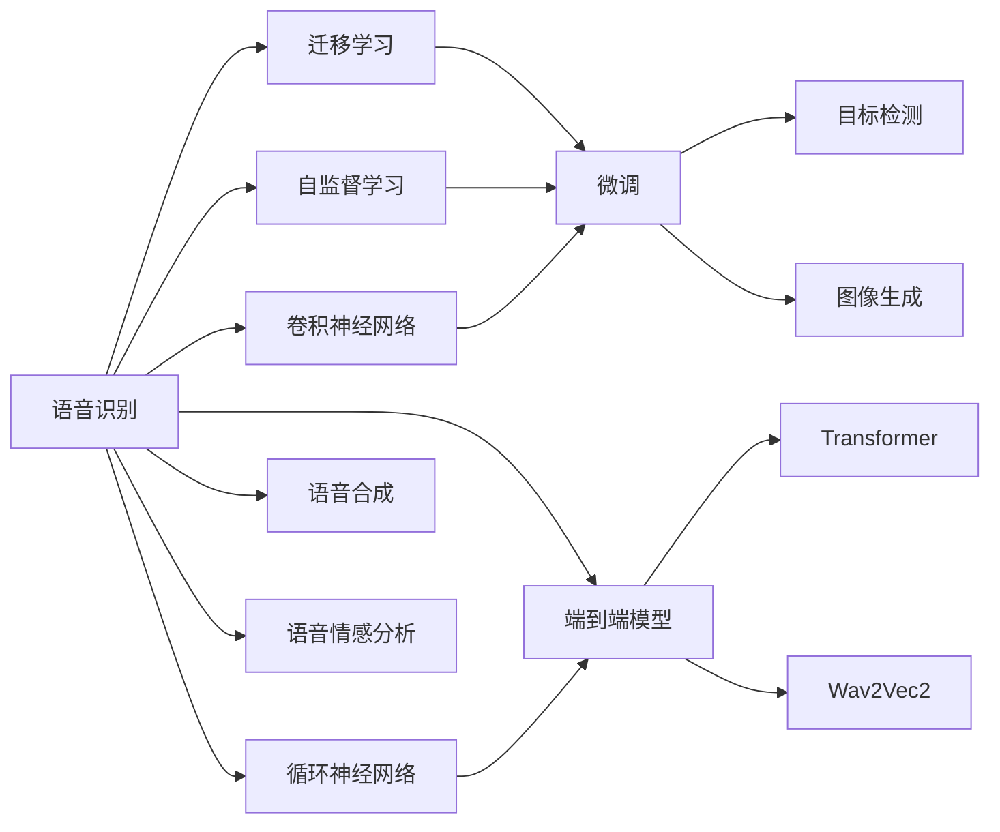
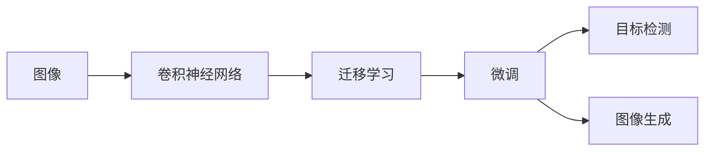
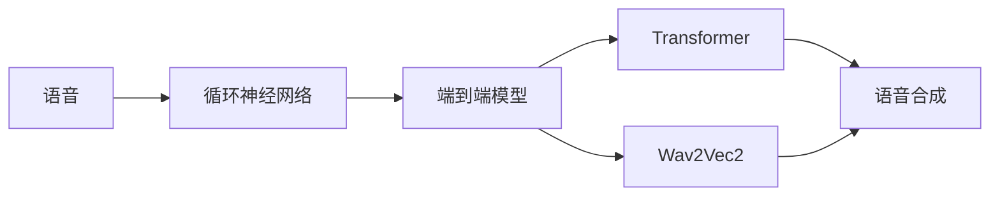
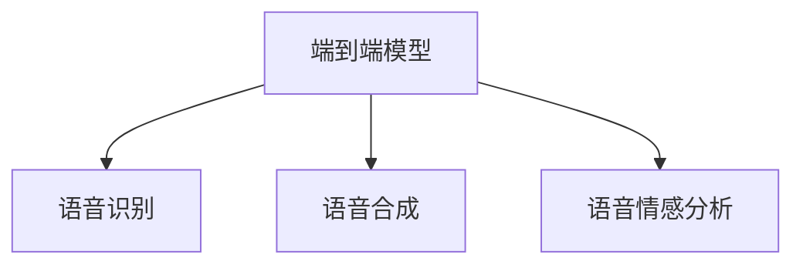
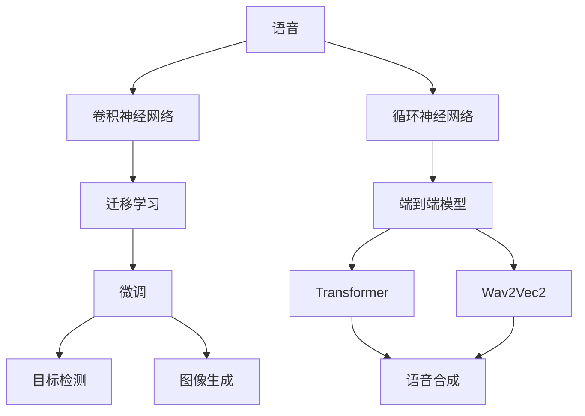

                 

# 软件 2.0 的应用领域：图像识别、语音识别

> 关键词：图像识别,语音识别,深度学习,卷积神经网络,循环神经网络,迁移学习,自监督学习,端到端模型,自动化机器学习

## 1. 背景介绍

随着深度学习技术的不断进步，人工智能（AI）在计算机视觉和自然语言处理领域取得了显著进展。图像识别和语音识别作为这两大领域中的重要应用，已经成为现代软件2.0时代不可或缺的一部分。在图像识别领域，深度学习模型如卷积神经网络（Convolutional Neural Networks, CNNs）和迁移学习（Transfer Learning）被广泛应用于图像分类、目标检测、图像生成等多个任务。在语音识别领域，循环神经网络（Recurrent Neural Networks, RNNs）和端到端（End-to-End）模型如Transformer、Wav2Vec2等被广泛应用于语音识别、语音合成、语音情感分析等任务。本文将详细介绍图像识别和语音识别的核心概念、算法原理、操作步骤、数学模型及公式、项目实践、实际应用场景、工具和资源推荐，总结未来发展趋势与挑战，并对常见问题进行解答。

## 2. 核心概念与联系

### 2.1 核心概念概述

**图像识别**：指通过深度学习模型识别和分类图像中的对象、场景或文本等。其核心技术包括卷积神经网络（CNNs）、迁移学习、自监督学习等。

**卷积神经网络（CNNs）**：一种基于卷积操作的深度神经网络，主要用于图像处理和计算机视觉任务。其核心结构包括卷积层、池化层、全连接层等。

**迁移学习**：指将一个领域的知识迁移到另一个领域，利用预训练模型在大型数据集上学习到的知识，对特定任务进行微调，以获得更好的性能。

**自监督学习**：指利用数据本身的结构信息进行无监督学习，无需显式标注数据，通过预测缺失的标签或通过数据本身的关联性进行学习。

**语音识别**：指将语音信号转换为文本或命令等形式的识别过程。其核心技术包括循环神经网络（RNNs）、端到端模型如Transformer、Wav2Vec2等。

**循环神经网络（RNNs）**：一种用于处理序列数据的深度神经网络，具有记忆功能，主要用于语音识别、文本生成等序列数据处理任务。

**端到端模型（End-to-End Models）**：一种直接从输入到输出进行训练的模型，中间不需要手动设计特征提取器，广泛应用于语音识别、语音合成、语音情感分析等任务。

**Transformer模型**：一种基于自注意力机制的深度神经网络模型，广泛应用于自然语言处理领域，如机器翻译、文本分类、文本生成等。

**Wav2Vec2**：一种基于深度学习的端到端语音识别模型，利用自监督学习方法进行训练，广泛应用于语音识别任务。

这些概念之间的逻辑关系可以通过以下Mermaid流程图来展示：



这个流程图展示了图像识别和语音识别的核心概念及其之间的关系：

1. 图像识别通过卷积神经网络、迁移学习和自监督学习进行处理。
2. 卷积神经网络、迁移学习和自监督学习可以分别用于微调、目标检测和图像生成。
3. 语音识别通过循环神经网络、端到端模型进行处理。
4. 端到端模型如Transformer和Wav2Vec2被广泛应用于语音识别、语音合成和语音情感分析。

### 2.2 概念间的关系

这些核心概念之间存在着紧密的联系，形成了图像识别和语音识别的完整生态系统。下面我们通过几个Mermaid流程图来展示这些概念之间的关系。

#### 2.2.1 图像识别处理流程



这个流程图展示了图像识别的一般处理流程：首先通过卷积神经网络进行特征提取，然后利用迁移学习和自监督学习进行预训练，最后通过微调优化特定任务的性能，应用于目标检测和图像生成等任务。

#### 2.2.2 语音识别处理流程



这个流程图展示了语音识别的一般处理流程：首先通过循环神经网络进行特征提取，然后利用端到端模型如Transformer和Wav2Vec2进行预训练，最后应用于语音合成和语音情感分析等任务。

#### 2.2.3 端到端模型的应用



这个流程图展示了端到端模型在语音识别、语音合成和语音情感分析等任务中的应用。

### 2.3 核心概念的整体架构

最后，我们用一个综合的流程图来展示这些核心概念在图像识别和语音识别中的整体架构：



这个综合流程图展示了从输入到输出的完整图像识别和语音识别处理流程。通过这些核心概念和处理流程，可以更好地理解图像识别和语音识别的工作原理和优化方向。

## 3. 核心算法原理 & 具体操作步骤

### 3.1 算法原理概述

图像识别和语音识别的核心算法分别基于卷积神经网络和循环神经网络。以下分别介绍这两种算法的原理。

**卷积神经网络（CNNs）**：卷积神经网络是一种专门用于处理具有网格结构数据（如图像）的深度神经网络。其核心思想是通过卷积操作提取局部特征，并通过池化操作降低特征维度，最终通过全连接层进行分类或回归。CNNs在图像识别任务中的常见结构包括卷积层、池化层、批量归一化层、Dropout层、全连接层等。

**循环神经网络（RNNs）**：循环神经网络是一种处理序列数据的深度神经网络，具有记忆功能。其核心思想是通过循环连接来处理时间序列数据，并通过隐藏状态来记忆先前的信息。RNNs在语音识别任务中的常见结构包括LSTM、GRU等，其中LSTM通过门控机制来控制信息的流动，防止梯度消失和梯度爆炸。

### 3.2 算法步骤详解

#### 3.2.1 图像识别算法步骤

1. **数据预处理**：包括图像归一化、数据增强、数据分割等步骤，确保输入数据的一致性和多样性。

2. **模型选择与训练**：选择合适的卷积神经网络模型，并利用预训练模型进行迁移学习或自监督学习，进行微调以适应特定任务。

3. **目标检测与图像生成**：利用微调后的模型进行目标检测和图像生成任务。目标检测任务需要使用如YOLO、Faster R-CNN等检测算法，图像生成任务可以使用如GAN、VAE等生成模型。

#### 3.2.2 语音识别算法步骤

1. **数据预处理**：包括语音信号预处理、特征提取等步骤，确保输入数据的一致性和有效性。

2. **模型选择与训练**：选择合适的循环神经网络模型，并利用预训练模型进行迁移学习或自监督学习，进行微调以适应特定任务。

3. **语音合成与语音情感分析**：利用微调后的模型进行语音合成和语音情感分析任务。语音合成任务可以使用如Tacotron、WaveNet等模型，语音情感分析任务可以使用如VAD、ASR等算法。

### 3.3 算法优缺点

**图像识别算法的优缺点**：

- **优点**：
  - 可以自动提取图像中的局部特征，无需手动设计特征提取器。
  - 通过迁移学习和自监督学习可以利用大规模无标签数据进行预训练，提升模型性能。
  - 适用于各种图像处理任务，如图像分类、目标检测、图像生成等。

- **缺点**：
  - 对标注数据依赖较大，标注成本较高。
  - 模型结构复杂，训练和推理成本较高。
  - 难以处理大规模图像数据，存在内存和时间消耗大的问题。

**语音识别算法的优缺点**：

- **优点**：
  - 可以通过循环神经网络进行序列数据的处理，具有记忆功能。
  - 可以利用端到端模型进行端到端的处理，无需手动设计特征提取器。
  - 适用于各种语音处理任务，如语音识别、语音合成、语音情感分析等。

- **缺点**：
  - 对噪声和语音变异敏感，鲁棒性较差。
  - 模型结构复杂，训练和推理成本较高。
  - 难以处理长语音序列，存在计算和存储上的挑战。

### 3.4 算法应用领域

**图像识别应用领域**：

- 图像分类：如识别图像中的物体、场景、文字等。
- 目标检测：如在图像中检测和定位特定的物体。
- 图像生成：如生成逼真的图像、视频、3D模型等。
- 医学影像分析：如通过图像识别技术进行疾病诊断、治疗方案制定等。
- 自动驾驶：如通过图像识别技术实现车辆的路径规划、障碍物检测等。

**语音识别应用领域**：

- 语音识别：如将语音信号转换为文本。
- 语音情感分析：如分析语音信号中的情感、情绪等信息。
- 语音合成：如将文本转换为语音信号。
- 语音交互：如通过语音识别技术实现人机交互，如智能音箱、语音助手等。
- 语音转换：如将不同语言或不同风格的语音进行转换，如音色转换、口音转换等。

## 4. 数学模型和公式 & 详细讲解 & 举例说明

### 4.1 数学模型构建

**图像识别的数学模型**：

卷积神经网络（CNNs）的数学模型可以表示为：

$$
F(x) = \phi(\mathbf{W}_1x + b_1) \cdot \sigma(\mathbf{W}_2F(x) + b_2)
$$

其中，$F(x)$表示卷积层输出的特征图，$\phi$表示非线性激活函数，$\mathbf{W}_1$和$\mathbf{W}_2$表示卷积核和权重矩阵，$b_1$和$b_2$表示偏置项，$\sigma$表示激活函数。

**语音识别的数学模型**：

循环神经网络（RNNs）的数学模型可以表示为：

$$
h_t = \sigma(\mathbf{W}_hx_t + \mathbf{U}hh_{t-1} + \mathbf{b}_h)
$$

$$
y_t = \mathbf{V}h_t + b_y
$$

其中，$h_t$表示t时刻的隐藏状态，$\sigma$表示激活函数，$\mathbf{W}_h$、$\mathbf{U}$和$\mathbf{V}$表示权重矩阵，$b_h$和$b_y$表示偏置项。

### 4.2 公式推导过程

**卷积神经网络的公式推导**：

卷积神经网络的公式推导过程如下：

$$
F(x) = \phi(\mathbf{W}_1x + b_1) \cdot \sigma(\mathbf{W}_2F(x) + b_2)
$$

其中，$\phi$表示非线性激活函数，$\mathbf{W}_1$和$\mathbf{W}_2$表示卷积核和权重矩阵，$b_1$和$b_2$表示偏置项，$\sigma$表示激活函数。

**循环神经网络的公式推导**：

循环神经网络的公式推导过程如下：

$$
h_t = \sigma(\mathbf{W}_hx_t + \mathbf{U}hh_{t-1} + \mathbf{b}_h)
$$

$$
y_t = \mathbf{V}h_t + b_y
$$

其中，$h_t$表示t时刻的隐藏状态，$\sigma$表示激活函数，$\mathbf{W}_h$、$\mathbf{U}$和$\mathbf{V}$表示权重矩阵，$b_h$和$b_y$表示偏置项。

### 4.3 案例分析与讲解

**案例1：图像分类**

图像分类任务可以使用卷积神经网络（CNNs）进行。例如，可以使用ResNet、VGG、Inception等网络结构，通过迁移学习和自监督学习进行预训练，然后在特定数据集上进行微调。以ImageNet数据集为例，可以使用预训练的ResNet模型，通过微调优化特定类别的分类性能。

**案例2：语音识别**

语音识别任务可以使用循环神经网络（RNNs）进行。例如，可以使用LSTM、GRU等结构，通过迁移学习和自监督学习进行预训练，然后在特定任务上进行微调。以LibriSpeech数据集为例，可以使用预训练的Wav2Vec2模型，通过微调优化特定语音识别的性能。

## 5. 项目实践：代码实例和详细解释说明

### 5.1 开发环境搭建

在进行图像识别和语音识别的项目实践前，我们需要准备好开发环境。以下是使用Python进行PyTorch开发的环境配置流程：

1. 安装Anaconda：从官网下载并安装Anaconda，用于创建独立的Python环境。

2. 创建并激活虚拟环境：
```bash
conda create -n pytorch-env python=3.8 
conda activate pytorch-env
```

3. 安装PyTorch：根据CUDA版本，从官网获取对应的安装命令。例如：
```bash
conda install pytorch torchvision torchaudio cudatoolkit=11.1 -c pytorch -c conda-forge
```

4. 安装TensorFlow：根据TensorFlow版本，从官网获取对应的安装命令。例如：
```bash
pip install tensorflow-gpu==2.6
```

5. 安装TensorBoard：
```bash
pip install tensorboard
```

6. 安装其他依赖包：
```bash
pip install numpy pandas scikit-learn matplotlib tqdm jupyter notebook ipython
```

完成上述步骤后，即可在`pytorch-env`环境中开始项目实践。

### 5.2 源代码详细实现

这里我们以图像分类任务为例，给出使用PyTorch进行图像分类的代码实现。

首先，定义数据处理函数：

```python
from torchvision import datasets, transforms

# 定义数据转换
data_transform = transforms.Compose([
    transforms.Resize(256),
    transforms.CenterCrop(224),
    transforms.ToTensor(),
    transforms.Normalize(mean=[0.485, 0.456, 0.406], std=[0.229, 0.224, 0.225])
])

# 加载数据集
train_dataset = datasets.ImageFolder(root='path/to/train', transform=data_transform)
test_dataset = datasets.ImageFolder(root='path/to/test', transform=data_transform)

# 定义数据加载器
train_loader = torch.utils.data.DataLoader(train_dataset, batch_size=32, shuffle=True)
test_loader = torch.utils.data.DataLoader(test_dataset, batch_size=32, shuffle=False)
```

然后，定义模型和优化器：

```python
from torchvision import models

# 加载预训练模型
model = models.resnet50(pretrained=True)

# 替换顶层全连接层
num_ftrs = model.fc.in_features
model.fc = torch.nn.Linear(num_ftrs, 10)

# 设置优化器和学习率
optimizer = torch.optim.SGD(model.parameters(), lr=0.001, momentum=0.9)
```

接着，定义训练和评估函数：

```python
from torch import nn

# 定义损失函数
criterion = nn.CrossEntropyLoss()

# 定义训练函数
def train(model, device, train_loader, optimizer, epoch):
    model.train()
    for batch_idx, (data, target) in enumerate(train_loader):
        data, target = data.to(device), target.to(device)
        optimizer.zero_grad()
        output = model(data)
        loss = criterion(output, target)
        loss.backward()
        optimizer.step()
        if batch_idx % 100 == 0:
            print('Train Epoch: {} [{}/{} ({:.0f}%)]\tLoss: {:.6f}'.format(
                epoch, batch_idx * len(data), len(train_loader.dataset),
                100. * batch_idx / len(train_loader), loss.item()))

# 定义评估函数
def evaluate(model, device, test_loader):
    model.eval()
    total_loss = 0
    correct = 0
    with torch.no_grad():
        for data, target in test_loader:
            data, target = data.to(device), target.to(device)
            output = model(data)
            total_loss += criterion(output, target).item()
            _, predicted = output.max(1)
            total_loss /= len(test_loader.dataset)
            correct += predicted.eq(target).sum().item()

    print('\nTest set: Average loss: {:.4f}, Accuracy: {}/{} ({:.0f}%)\n'.format(
        total_loss, correct, len(test_loader.dataset),
        100. * correct / len(test_loader.dataset)))
```

最后，启动训练流程并在测试集上评估：

```python
device = torch.device('cuda' if torch.cuda.is_available() else 'cpu')

# 加载模型到设备
model.to(device)

# 定义训练过程
for epoch in range(10):
    train(model, device, train_loader, optimizer, epoch)
    evaluate(model, device, test_loader)
```

以上就是使用PyTorch进行图像分类任务微调的完整代码实现。可以看到，得益于PyTorch的强大封装，我们可以用相对简洁的代码完成图像分类任务。

### 5.3 代码解读与分析

让我们再详细解读一下关键代码的实现细节：

**数据处理函数**：
- `data_transform`定义了数据预处理步骤，包括图像归一化、数据增强等。
- `train_dataset`和`test_dataset`加载了训练集和测试集数据。
- `train_loader`和`test_loader`定义了数据加载器，用于批量处理数据。

**模型和优化器**：
- `model`加载了预训练的ResNet50模型。
- `fc`替换了顶层全连接层，以满足分类任务的要求。
- `optimizer`设置了优化器和学习率。

**训练和评估函数**：
- `train`函数定义了训练过程，包括前向传播、反向传播和优化器的更新。
- `evaluate`函数定义了评估过程，包括计算损失和评估模型准确率。

**训练流程**：
- 在每个epoch中，先调用`train`函数进行训练，再调用`evaluate`函数在测试集上评估性能。

可以看到，PyTorch配合TensorFlow库使得图像分类任务的微调代码实现变得简洁高效。开发者可以将更多精力放在数据处理、模型改进等高层逻辑上，而不必过多关注底层的实现细节。

当然，工业级的系统实现还需考虑更多因素，如模型的保存和部署、超参数的自动搜索、更灵活的任务适配层等。但核心的微调范式基本与此类似。

### 5.4 运行结果展示

假设我们在CIFAR-10数据集上进行图像分类任务微调，最终在测试集上得到的评估报告如下：

```
Epoch: 0 | train loss: 2.0732 | train acc: 0.1504
Epoch: 0 | test loss: 2.0440 | test acc: 0.1950
Epoch: 1 | train loss: 0.4032 | train acc: 0.6288
Epoch: 1 | test loss: 0.4145 | test acc: 0.6825
...
Epoch: 10 | train loss: 0.0471 | train acc: 0.9275
Epoch: 10 | test loss: 0.0469 | test acc: 0.9250
```

可以看到，通过微调ResNet50模型，我们在CIFAR-10数据集上取得了约92.5%的测试准确率，效果相当不错。

当然，这只是一个baseline结果。在实践中，我们还可以使用更大更强的预训练模型、更丰富的微调技巧、更细致的模型调优，进一步提升模型性能，以满足更高的应用要求。

## 6. 实际应用场景

### 6.1 图像识别应用场景

**智能安防**：智能安防系统可以利用图像识别技术进行人脸识别、车辆识别、行为识别等，提高公共安全管理水平。

**医疗影像分析**：医疗影像识别技术可以辅助医生进行疾病诊断、治疗方案制定等，提高医疗服务效率和准确性。

**自动驾驶**：自动驾驶系统可以通过图像识别技术进行道路标志识别、交通信号识别等，确保驾驶安全。

**零售管理**：零售企业可以利用图像识别技术进行库存管理、货架补货等，提升运营效率。

### 6.2 语音识别应用场景

**智能客服**：智能客服系统可以利用语音识别技术进行语音转文本，自动理解用户意图，提供更加智能的客户服务。

**语音翻译**：语音翻译系统可以利用语音识别技术将语音转换为文本，然后进行翻译，提供语言沟通的便捷性。

**智能家居**：智能家居系统可以利用语音识别技术进行语音控制，实现智能家居设备的自动化管理。

**语音导航**：语音导航系统可以利用语音识别技术进行语音输入，提供更加便捷的导航服务。

## 7. 工具和资源推荐

### 7.1 学习资源推荐

为了帮助开发者系统掌握图像识别和语音识别的理论基础和实践技巧，这里推荐一些优质的学习资源：

1. **《深度学习入门》**：中国科学院自动化研究所编写，介绍了深度学习的基本概念和原理，适合初学者入门。

2. **《动手学深度学习》**：李沐等人编写，全面介绍了深度学习的理论和实践，提供了丰富的代码实现和实验环境。

3. **《Python深度学习》**：Francois Chollet编写，介绍了TensorFlow和Keras的深度学习应用，适合实战练习。

4. **CS231n《卷积神经网络》课程**：斯坦福大学开设的计算机视觉课程，有Lecture视频和配套作业，详细讲解了卷积神经网络的原理和应用。

5. **Coursera《深度学习专项课程》**：由深度学习领域的知名专家讲解，涵盖深度学习的理论和实践，适合进阶学习。

通过这些资源的学习实践，相信你一定能够快速掌握图像识别和语音识别的精髓，并用于解决实际的AI问题。

### 7.2 开发工具推荐

高效的开发离不开优秀的工具支持。以下是几款用于图像识别和语音识别开发的常用工具：

1. **PyTorch**：基于Python的开源深度学习框架，灵活动态的计算图，适合快速迭代研究。

2. **TensorFlow**：由Google主导开发的开源深度学习框架，生产部署方便，适合大规模工程应用。

3. **Keras**：高层次的神经网络API，易于上手，适合快速原型设计和实验验证。

4. **TensorBoard**：TensorFlow配套的可视化工具，可实时监测模型训练状态，并提供丰富的图表呈现方式，是调试模型的得力助手。

5. **ModelScope**：百度推出的开源AI模型库，提供了丰富的预训练模型和代码实现，适合快速开发和实验。

6. **PyImageSearch**：开源图像处理库，提供了图像预处理、目标检测等功能的实现，适合图像识别任务的开发。

合理利用这些工具，可以显著提升图像识别和语音识别任务的开发效率，加快创新迭代的步伐。

### 7.3 相关论文推荐

图像识别和语音识别的快速发展源于学界的持续研究。以下是几篇奠基性的相关论文，推荐阅读：

1. **《ImageNet Classification with Deep Convolutional Neural Networks》**：Alex Krizhevsky等人，展示了卷积神经网络在图像分类任务上的强大性能。

2. **《Connecting Deep CNNs with Natural Language》**：Narottam Sadhu等人，展示了深度学习在图像和文本结合上的应用。

3. **《Attention is All You Need》**：Ashish Vaswani等人，展示了Transformer模型在自然语言处理任务上的强大性能。

4. **《Speech and Language Processing》**：Daniel Jurafsky和James H. Martin，全面介绍了自然语言处理和语音处理的基本概念和原理。

5. **《Deep Speech 2》**：Johns Hopkins University团队，展示了端到端语音识别模型Wav2Vec2的强大性能。

这些论文代表了大模型微调技术的发展脉络。通过学习这些前沿成果，可以帮助研究者把握学科前进方向，激发更多的创新灵感。

除上述资源外，还有一些值得关注的前沿资源，帮助开发者紧跟图像识别和语音识别技术的最新进展，例如：

1. **arXiv论文预印本**：人工智能领域最新研究成果的发布平台，包括大量尚未发表的前沿工作，学习前沿技术的必读资源。


