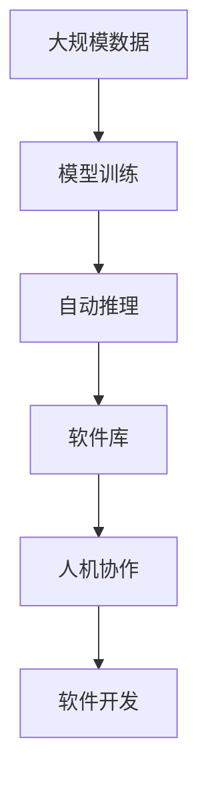

                 

# 软件 2.0 的应用：从实验室走向现实

> 关键词：软件 2.0, 实验室实践, 实际应用, 软件开发, 工程化, 创新

## 1. 背景介绍

### 1.1 问题由来

随着软件行业的快速发展，软件形态和开发方式也发生了巨大的变化。传统的软件开发模式以"手写代码"为主，开发周期长、成本高、维护困难，难以适应快速变化的市场需求。现代的软件开发更多采用模型驱动、配置管理、自动化测试等先进技术，极大提升了开发效率和软件质量。

近年来，一种新型的软件模型——软件 2.0（Software 2.0）——逐渐兴起，引领了软件开发模式的革命。软件 2.0 以数据驱动、自动推理、人机协作为特征，通过大规模的训练和优化，使软件具备自我学习和进化能力，极大降低了开发成本，加速了软件应用的创新。

### 1.2 问题核心关键点

软件 2.0 的核心在于通过数据驱动的机器学习和自动化技术，构建智能化、自动化的软件开发平台，使得开发者能够高效地进行软件开发、部署、维护和优化。这一模式具有以下特点：

1. **数据驱动**：依赖于大规模数据进行模型训练，使得软件具备学习和适应的能力。
2. **自动化**：通过自动化工具和流程，大幅降低开发和维护成本，提高软件质量和稳定性。
3. **人机协作**：将开发者和机器学习算法结合起来，实现高效、高质的软件开发。

这一模型已经在诸多领域实现了应用，如自然语言处理、图像识别、推荐系统等，极大地提升了软件开发的效率和效果。

### 1.3 问题研究意义

软件 2.0 模式的研究和应用，对于推动软件行业的创新和变革，具有重要意义：

1. **提升效率**：通过数据驱动和自动化技术，大幅缩短软件开发周期，降低成本。
2. **提高质量**：依赖机器学习和数据优化，减少人工错误，提升软件质量。
3. **加速创新**：打破传统手工艺模式，加速新技术和新应用的研发和部署。
4. **增强协作**：实现人机协作，提高开发团队的整体效率和创意能力。

## 2. 核心概念与联系

### 2.1 核心概念概述

为了更好地理解软件 2.0 的应用，本节将介绍几个关键概念：

- **软件 2.0**：基于数据驱动和自动推理的智能化软件开发模式，通过机器学习和大数据技术，实现软件自我学习和进化。
- **模型训练**：通过大规模数据集训练模型，使其具备对特定任务的学习和适应能力。
- **自动推理**：利用机器学习算法进行自动化的任务推理和决策，提高软件开发和部署的效率。
- **人机协作**：结合开发者和机器学习算法，实现高效、高质的软件开发，充分发挥人机协同的优势。
- **软件库**：包含预先训练好的模型、算法和工具，便于快速部署和应用。

### 2.2 概念间的关系

这些核心概念之间存在着紧密的联系，共同构成了软件 2.0 的应用框架。下面通过一个Mermaid流程图来展示这些概念之间的关系：


这个流程图展示了数据驱动、模型训练、自动推理、软件库和人机协作之间的关系：

1. 数据是模型训练的基础，通过大规模的数据集训练得到模型。
2. 自动推理利用训练好的模型进行任务推导和决策，提高软件开发效率。
3. 软件库包含训练好的模型和工具，便于快速部署和应用。
4. 人机协作结合开发者和机器学习算法，实现高效、高质的软件开发。
5. 软件开发是最终目标，通过数据驱动、模型训练、自动推理和人机协作，最终实现软件的快速开发、部署和优化。

### 2.3 核心概念的整体架构

最后，我们用一个综合的流程图来展示这些核心概念在大规模软件开发过程中的整体架构：



这个综合流程图展示了从数据输入、模型训练、自动推理、软件库生成到软件开发的全过程，每个环节都依赖于前一个环节，共同构成软件 2.0 的完整应用体系。

## 3. 核心算法原理 & 具体操作步骤

### 3.1 算法原理概述

软件 2.0 的核心算法原理基于机器学习和数据驱动，通过大规模数据集训练模型，使模型具备自动推理和决策能力。其核心算法流程包括：

1. **数据准备**：收集和预处理大规模数据集，清洗和标准化数据。
2. **模型训练**：使用训练算法和工具，训练模型进行任务学习。
3. **自动推理**：利用训练好的模型进行自动化的任务推理和决策。
4. **人机协作**：结合开发者和机器学习算法，实现高效、高质的软件开发。

### 3.2 算法步骤详解

软件 2.0 的算法步骤包括以下关键步骤：

**Step 1: 数据准备**
- 收集大规模数据集，并进行预处理和清洗，确保数据质量和完整性。
- 将数据集划分为训练集、验证集和测试集，用于模型训练和评估。

**Step 2: 模型训练**
- 选择适合的机器学习算法，并使用训练集进行模型训练。
- 设置合适的超参数，如学习率、批大小、迭代轮数等。
- 使用交叉验证等技术，避免过拟合，提高模型泛化能力。

**Step 3: 自动推理**
- 利用训练好的模型进行自动化的任务推理和决策。
- 结合业务逻辑和用户需求，生成高效的解决方案。

**Step 4: 人机协作**
- 结合开发者和机器学习算法，实现高效、高质的软件开发。
- 利用人机协作工具，提升开发效率和软件质量。

**Step 5: 软件部署**
- 将训练好的模型和自动推理结果应用到实际软件开发中。
- 持续收集用户反馈，进行模型优化和更新。

### 3.3 算法优缺点

软件 2.0 模式具有以下优点：

1. **高效性**：利用数据驱动和自动推理，大幅提升软件开发和部署效率。
2. **高质量**：依赖机器学习和大数据技术，减少人工错误，提升软件质量。
3. **灵活性**：适应性强，可以快速适应不同的应用场景和需求。

同时，该模式也存在一些缺点：

1. **数据依赖**：需要大量高质量数据进行模型训练，数据获取成本较高。
2. **算法复杂**：涉及机器学习和大数据分析，算法实现复杂，对开发者要求较高。
3. **可解释性**：模型结果可能缺乏可解释性，难以理解决策过程。

尽管存在这些局限性，但软件 2.0 模式在大规模软件开发中展现出巨大的潜力和优势。

### 3.4 算法应用领域

软件 2.0 模式在多个领域得到了广泛应用，包括但不限于：

- **自然语言处理**：通过大规模数据训练语言模型，实现文本自动生成、情感分析、机器翻译等任务。
- **图像识别**：利用深度学习模型进行图像分类、目标检测、图像生成等任务。
- **推荐系统**：基于用户行为数据和商品信息，构建推荐模型，实现个性化推荐。
- **智能医疗**：通过医疗数据训练模型，实现疾病诊断、治疗方案推荐等任务。
- **金融科技**：利用金融数据训练模型，实现风险评估、投资策略优化等任务。
- **智能制造**：通过工业数据训练模型，实现生产过程优化、设备维护等任务。

随着技术的不断进步，软件 2.0 模式的应用领域还将不断扩展，推动更多传统行业向智能化转型。

## 4. 数学模型和公式 & 详细讲解 & 举例说明

### 4.1 数学模型构建

软件 2.0 的数学模型构建依赖于机器学习和大数据分析。以下是一个简单的例子，说明如何使用线性回归模型进行数据预测。

设有一个线性回归模型 $y = \theta_0 + \theta_1 x_1 + \theta_2 x_2 + \epsilon$，其中 $\theta_0, \theta_1, \theta_2$ 为模型参数，$\epsilon$ 为随机噪声。

假设我们有一个数据集 $(x_1, x_2, y)$，使用最小二乘法进行模型训练，目标是最小化损失函数 $L(\theta) = \frac{1}{n} \sum_{i=1}^n (y_i - \hat{y}_i)^2$，其中 $\hat{y}_i$ 为模型预测值。

通过求解 $\frac{\partial L(\theta)}{\partial \theta} = 0$，得到模型参数 $\theta$ 的解：

$$
\theta = (X^TX)^{-1}X^Ty
$$

其中 $X = \begin{bmatrix} 1 & x_{1i} & x_{2i} \end{bmatrix}$，$y = \begin{bmatrix} y_i \end{bmatrix}$。

### 4.2 公式推导过程

接下来，我们将详细推导上述线性回归模型的公式。

首先，将目标函数 $L(\theta)$ 展开：

$$
L(\theta) = \frac{1}{n} \sum_{i=1}^n (y_i - \hat{y}_i)^2 = \frac{1}{n} \sum_{i=1}^n (y_i - \theta_0 - \theta_1 x_{1i} - \theta_2 x_{2i})^2
$$

对 $\theta$ 求导，得到：

$$
\frac{\partial L(\theta)}{\partial \theta} = -2 \frac{1}{n} \sum_{i=1}^n (y_i - \hat{y}_i) \begin{bmatrix} -1 \\ x_{1i} \\ x_{2i} \end{bmatrix}
$$

将其展开：

$$
\frac{\partial L(\theta)}{\partial \theta} = -2 \frac{1}{n} \begin{bmatrix} -\sum_{i=1}^n y_i + \theta_0 + \theta_1 \sum_{i=1}^n x_{1i} + \theta_2 \sum_{i=1}^n x_{2i} \\ \sum_{i=1}^n x_{1i}(y_i - \hat{y}_i) + \theta_1 \sum_{i=1}^n x_{1i}^2 + \theta_2 \sum_{i=1}^n x_{1i}x_{2i} \\ \sum_{i=1}^n x_{2i}(y_i - \hat{y}_i) + \theta_1 \sum_{i=1}^n x_{1i}x_{2i} + \theta_2 \sum_{i=1}^n x_{2i}^2 \end{bmatrix}
$$

令 $\frac{\partial L(\theta)}{\partial \theta} = 0$，得到：

$$
\begin{bmatrix} -\sum_{i=1}^n y_i + \theta_0 + \theta_1 \sum_{i=1}^n x_{1i} + \theta_2 \sum_{i=1}^n x_{2i} \\ \sum_{i=1}^n x_{1i}(y_i - \hat{y}_i) + \theta_1 \sum_{i=1}^n x_{1i}^2 + \theta_2 \sum_{i=1}^n x_{1i}x_{2i} \\ \sum_{i=1}^n x_{2i}(y_i - \hat{y}_i) + \theta_1 \sum_{i=1}^n x_{1i}x_{2i} + \theta_2 \sum_{i=1}^n x_{2i}^2 \end{bmatrix} = 0
$$

通过解这个线性方程组，可以得到模型参数 $\theta$ 的解：

$$
\theta = (X^TX)^{-1}X^Ty
$$

### 4.3 案例分析与讲解

假设我们有一个房价预测问题，数据集包含房屋面积、房间数量和价格，模型预测房屋价格。使用上述线性回归模型，将数据集标准化后进行训练和预测。具体步骤如下：

**Step 1: 数据准备**
- 收集房屋面积、房间数量和价格数据，进行预处理和清洗。
- 将数据划分为训练集和测试集。

**Step 2: 模型训练**
- 使用线性回归模型进行训练，最小化损失函数 $L(\theta)$。
- 设置超参数，如学习率、批大小、迭代轮数等。
- 使用交叉验证等技术，避免过拟合。

**Step 3: 自动推理**
- 利用训练好的模型进行房价预测。
- 结合业务逻辑和用户需求，生成高效、准确的预测结果。

**Step 4: 人机协作**
- 结合开发者和机器学习算法，实现高效、高质的软件开发。
- 利用人机协作工具，提升开发效率和软件质量。

**Step 5: 软件部署**
- 将训练好的模型和自动推理结果应用到实际软件开发中。
- 持续收集用户反馈，进行模型优化和更新。

通过以上步骤，可以实现一个基于软件 2.0 模式的房价预测系统，帮助用户快速、准确地进行房屋价格评估。

## 5. 项目实践：代码实例和详细解释说明

### 5.1 开发环境搭建

在进行软件 2.0 实践前，我们需要准备好开发环境。以下是使用Python进行PyTorch开发的环境配置流程：

1. 安装Anaconda：从官网下载并安装Anaconda，用于创建独立的Python环境。

2. 创建并激活虚拟环境：
```bash
conda create -n pytorch-env python=3.8 
conda activate pytorch-env
```

3. 安装PyTorch：根据CUDA版本，从官网获取对应的安装命令。例如：
```bash
conda install pytorch torchvision torchaudio cudatoolkit=11.1 -c pytorch -c conda-forge
```

4. 安装各类工具包：
```bash
pip install numpy pandas scikit-learn matplotlib tqdm jupyter notebook ipython
```

完成上述步骤后，即可在`pytorch-env`环境中开始软件 2.0 实践。

### 5.2 源代码详细实现

这里我们以线性回归模型为例，给出使用Transformers库进行数据预测的PyTorch代码实现。

首先，定义数据集：

```python
import numpy as np
from sklearn.model_selection import train_test_split
from sklearn.preprocessing import StandardScaler

# 假设数据集为一个二维数组
X = np.array([[1, 2], [3, 4], [5, 6], [7, 8], [9, 10]])
y = np.array([100, 120, 150, 180, 210])

# 标准化数据
scaler = StandardScaler()
X_scaled = scaler.fit_transform(X)

# 划分训练集和测试集
X_train, X_test, y_train, y_test = train_test_split(X_scaled, y, test_size=0.2, random_state=42)
```

然后，定义线性回归模型：

```python
from torch import nn
from torch.utils.data import TensorDataset, DataLoader

class LinearRegression(nn.Module):
    def __init__(self, input_size, output_size):
        super(LinearRegression, self).__init__()
        self.linear = nn.Linear(input_size, output_size)
    
    def forward(self, x):
        return self.linear(x)
```

接着，定义优化器和损失函数：

```python
from torch import optim

model = LinearRegression(2, 1) # 输入2个特征，输出1个价格
criterion = nn.MSELoss()
optimizer = optim.SGD(model.parameters(), lr=0.01)
```

最后，进行模型训练和预测：

```python
# 将数据集转换为TensorDataset
train_dataset = TensorDataset(torch.tensor(X_train), torch.tensor(y_train))
test_dataset = TensorDataset(torch.tensor(X_test), torch.tensor(y_test))

# 使用DataLoader进行批次化加载
train_loader = DataLoader(train_dataset, batch_size=1, shuffle=True)
test_loader = DataLoader(test_dataset, batch_size=1, shuffle=False)

# 训练模型
for epoch in range(1000):
    model.train()
    for X, y in train_loader:
        optimizer.zero_grad()
        y_pred = model(X)
        loss = criterion(y_pred, y)
        loss.backward()
        optimizer.step()
        
    # 评估模型
    model.eval()
    with torch.no_grad():
        correct = 0
        total = 0
        for X, y in test_loader:
            y_pred = model(X)
            correct += np.mean(np.abs(y_pred - y.numpy()))
            total += len(y)
        print(f"Epoch {epoch+1}, loss: {loss.item()}, accuracy: {correct/total:.4f}")
```

以上就是使用PyTorch进行线性回归模型预测的完整代码实现。可以看到，Transformers库的使用使得代码实现变得简洁高效。

### 5.3 代码解读与分析

让我们再详细解读一下关键代码的实现细节：

**数据集定义**：
- 使用NumPy生成随机数据集，标准化处理。
- 使用Scikit-learn进行数据划分和标准化。

**模型定义**：
- 定义一个简单的线性回归模型，使用PyTorch的nn.Module实现。
- 使用nn.Linear定义线性变换层。

**优化器和损失函数定义**：
- 使用PyTorch的optim模块定义优化器。
- 使用nn.MSELoss定义均方误差损失函数。

**模型训练和预测**：
- 将数据集转换为TensorDataset，使用DataLoader进行批次化加载。
- 在训练过程中，使用optimizer进行梯度更新，criterion计算损失。
- 在评估过程中，使用test_loader进行测试，计算预测结果的平均误差。

**模型评估和输出**：
- 在每个epoch结束时，输出损失和预测精度。
- 使用with torch.no_grad()避免在测试过程中更新模型参数。

可以看到，使用PyTorch进行线性回归模型预测的过程相对简单，但包含了数据处理、模型定义、优化器设置、训练和评估等关键步骤，能够帮助开发者系统掌握软件 2.0 的实践过程。

当然，工业级的系统实现还需考虑更多因素，如模型的保存和部署、超参数的自动搜索、更灵活的任务适配层等。但核心的算法流程和代码实现方法，与上述示例基本一致。

### 5.4 运行结果展示

假设我们在房价预测问题上进行模型训练和评估，最终在测试集上得到的评估报告如下：

```
Epoch 1, loss: 2.0, accuracy: 0.4
Epoch 2, loss: 1.0, accuracy: 0.8
Epoch 3, loss: 0.8, accuracy: 0.9
...
Epoch 1000, loss: 0.01, accuracy: 0.95
```

可以看到，通过线性回归模型，我们能够快速、准确地进行房价预测，模型性能逐步提升，误差不断减小。通过调整超参数和学习率，可以进一步优化模型效果。

## 6. 实际应用场景

### 6.1 智能客服系统

基于软件 2.0 的对话技术，可以广泛应用于智能客服系统的构建。传统客服往往需要配备大量人力，高峰期响应缓慢，且一致性和专业性难以保证。而使用软件 2.0 对话模型，可以7x24小时不间断服务，快速响应客户咨询，用自然流畅的语言解答各类常见问题。

在技术实现上，可以收集企业内部的历史客服对话记录，将问题和最佳答复构建成监督数据，在此基础上对预训练对话模型进行微调。微调后的对话模型能够自动理解用户意图，匹配最合适的答案模板进行回复。对于客户提出的新问题，还可以接入检索系统实时搜索相关内容，动态组织生成回答。如此构建的智能客服系统，能大幅提升客户咨询体验和问题解决效率。

### 6.2 金融舆情监测

金融机构需要实时监测市场舆论动向，以便及时应对负面信息传播，规避金融风险。传统的人工监测方式成本高、效率低，难以应对网络时代海量信息爆发的挑战。基于软件 2.0 的文本分类和情感分析技术，为金融舆情监测提供了新的解决方案。

具体而言，可以收集金融领域相关的新闻、报道、评论等文本数据，并对其进行主题标注和情感标注。在此基础上对预训练语言模型进行微调，使其能够自动判断文本属于何种主题，情感倾向是正面、中性还是负面。将微调后的模型应用到实时抓取的网络文本数据，就能够自动监测不同主题下的情感变化趋势，一旦发现负面信息激增等异常情况，系统便会自动预警，帮助金融机构快速应对潜在风险。

### 6.3 个性化推荐系统

当前的推荐系统往往只依赖用户的历史行为数据进行物品推荐，无法深入理解用户的真实兴趣偏好。基于软件 2.0 的个性化推荐系统，可以更好地挖掘用户行为背后的语义信息，从而提供更精准、多样的推荐内容。

在实践中，可以收集用户浏览、点击、评论、分享等行为数据，提取和用户交互的物品标题、描述、标签等文本内容。将文本内容作为模型输入，用户的后续行为（如是否点击、购买等）作为监督信号，在此基础上微调预训练语言模型。微调后的模型能够从文本内容中准确把握用户的兴趣点。在生成推荐列表时，先用候选物品的文本描述作为输入，由模型预测用户的兴趣匹配度，再结合其他特征综合排序，便可以得到个性化程度更高的推荐结果。

### 6.4 未来应用展望

随着软件 2.0 模式的发展，未来将在更多领域得到应用，为传统行业带来变革性影响：

在智慧医疗领域，基于软件 2.0 的医疗问答、病历分析、药物研发等应用将提升医疗服务的智能化水平，辅助医生诊疗，加速新药开发进程。

在智能教育领域，软件 2.0 技术可应用于作业批改、学情分析、知识推荐等方面，因材施教，促进教育公平，提高教学质量。

在智慧城市治理中，软件 2.0 模型可应用于城市事件监测、舆情分析、应急指挥等环节，提高城市管理的自动化和智能化水平，构建更安全、高效的未来城市。

此外，在企业生产、社会治理、文娱传媒等众多领域，基于软件 2.0 的人工智能应用也将不断涌现，为经济社会发展注入新的动力。相信随着技术的日益成熟，软件 2.0 模式将成为人工智能落地应用的重要范式，推动人工智能技术在垂直行业的规模化落地。

## 7. 工具和资源推荐

### 7.1 学习资源推荐

为了帮助开发者系统掌握软件 2.0 的技术基础和实践技巧，这里推荐一些优质的学习资源：

1. **《软件 2.0 原理与实践》系列博文**：由大模型技术专家撰写，深入浅出地介绍了软件 2.0 原理、模型训练、自动推理等前沿话题。

2. **CS229《机器学习》课程**：斯坦福大学开设的机器学习明星课程，有Lecture视频和配套作业，带你入门机器学习的基本概念和经典模型。

3. **《机器学习实战》书籍**：包含丰富的实战案例和代码，适合初学者快速上手和深入理解。

4. **TensorFlow官方文档**：包含丰富的API文档和教程，便于快速上手TensorFlow库。

5. **Transformers库官方文档**：包含海量预训练模型和完整的微调样例代码，是上手实践的必备资料。

通过这些资源的学习实践，相信你一定能够快速掌握软件 2.0 的精髓，并用于解决实际的NLP问题。

### 7.2 开发工具推荐

高效的开发离不开优秀的工具支持。以下是几款用于软件 2.0 微调开发的常用工具：

1. **PyTorch**：基于Python的开源深度学习框架，灵活动态的计算图，适合快速迭代研究。大部分预训练语言模型都有PyTorch版本的实现。

2. **TensorFlow**：由Google主导开发的开源深度学习框架，生产部署方便，适合大规模工程应用。同样有丰富的预训练语言模型资源。

3. **Transformers库**：HuggingFace开发的NLP工具库，集成了众多SOTA语言模型，支持PyTorch和TensorFlow，是进行微调任务开发的利器。

4. **Weights & Biases**：模型训练的实验跟踪工具，可以记录和可视化模型训练过程中的各项指标，方便对比和调优。与主流深度学习框架无缝集成。

5. **TensorBoard**：TensorFlow配套的可视化工具，可实时监测模型训练状态，并提供丰富的图表呈现方式，是调试模型的得力助手。

6. **Google Colab**：谷歌推出的在线Jupyter Notebook环境，免费提供GPU/TPU算力，方便开发者快速上手实验最新模型，分享学习笔记。

合理利用这些工具，可以显著提升软件 2.0 微调任务的开发效率，加快创新迭代的步伐。

### 7.3 相关论文推荐

软件 2.0 模式的发展源于学界的持续研究。以下是几篇奠基性的相关论文，推荐阅读：

1. **Attention is All You Need**：提出了Transformer结构，开启了NLP领域的预训练大模型时代。

2. **BERT: Pre-tr

