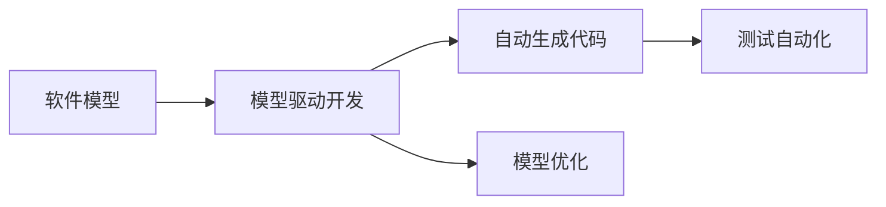
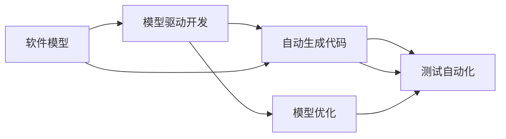
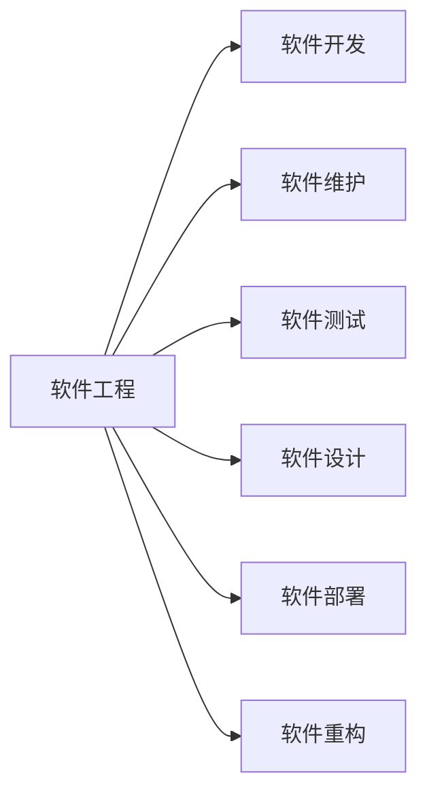

                 

# 软件 2.0 的应用：从实验室走向现实

> 关键词：软件 2.0, 智能开发, 自动生成代码, 机器学习, 模型驱动开发, 自动化测试

## 1. 背景介绍

在软件开发领域，随着AI技术的不断成熟，一种名为软件 2.0（Software 2.0）的新范式正逐渐成为主流。软件 2.0 通过将AI技术融入软件开发过程，实现了从传统的人编码到机器生成代码的转变。这一变革不仅极大地提高了开发效率，还推动了软件产业的持续演进。然而，将实验室中的技术转化为现实世界的应用，却是一个充满挑战的过程。本文将深入探讨软件 2.0 的应用实践，从原理到落地，展示这一新兴范式的潜力和挑战。

### 1.1 软件 2.0 的起源与背景

软件 2.0 的概念首次在2019年被提出，旨在解决软件开发过程中普遍存在的低效率和重复劳动问题。它通过机器学习和自然语言处理技术，自动生成代码、进行测试、维护甚至设计新功能，极大地简化了软件开发流程，降低了开发成本，加速了产品迭代。

软件 2.0 的核心理念是“模型驱动开发”（Model-Driven Development, MDD），即通过构建和维护软件模型来指导软件开发过程。在软件 2.0 中，开发者无需编写大量冗余代码，而是通过定义模型和规则，让AI系统自动生成和优化代码，从而提高开发效率和软件质量。

## 2. 核心概念与联系

### 2.1 核心概念概述

要深入理解软件 2.0，首先需要明确几个核心概念：

- **软件模型**：指描述软件系统结构、行为和属性的抽象模型，用于指导软件设计、实现和维护。
- **模型驱动开发**：一种软件开发方法，通过构建和维护软件模型，自动化软件生命周期中的各个阶段，包括设计、实现、测试和维护。
- **自动生成代码**：使用机器学习算法，根据软件模型自动生成符合规范的代码。
- **模型优化**：通过对软件模型进行训练和优化，提升代码生成质量和可维护性。
- **测试自动化**：自动生成测试用例，进行单元测试、集成测试和性能测试，确保软件质量。

这些概念共同构成了软件 2.0 的技术体系，如图2-1所示。



### 2.2 核心概念的联系

软件 2.0 的核心概念间有着紧密的联系，如图2-2所示。



**图2-1: 软件 2.0 核心概念的架构**

**图2-2: 核心概念间的联系**

- **软件模型与模型驱动开发**：软件模型是模型驱动开发的基础，指导着整个软件生命周期的自动化流程。
- **自动生成代码与模型驱动开发**：自动生成代码是基于软件模型的核心功能，通过代码生成工具，将模型转化为可执行代码。
- **模型优化与自动生成代码**：模型优化是提升代码生成质量的重要手段，通过训练优化模型，生成更加符合要求的代码。
- **测试自动化与自动生成代码**：测试自动化是基于自动生成代码的延伸，通过自动化测试工具，确保代码质量。

## 3. 核心算法原理 & 具体操作步骤

### 3.1 算法原理概述

软件 2.0 的核心算法原理包括自动生成代码和模型优化，下面分别进行详细介绍。

**自动生成代码**：自动生成代码的算法主要分为两个步骤：模型构建和代码生成。模型构建是指将软件需求和设计转换为可被机器学习算法处理的格式；代码生成则是通过训练好的模型，自动生成符合规范的代码。

**模型优化**：模型优化是通过不断调整模型参数，提升模型性能和代码质量。常见的优化方法包括正则化、特征选择、模型集成等。

### 3.2 算法步骤详解

#### 3.2.1 自动生成代码

1. **需求分析**：确定软件需求和设计，提取关键信息和结构。
2. **模型构建**：将需求和设计转换为机器学习算法可处理的格式，如代码片段、流程图等。
3. **训练模型**：使用历史代码数据和需求信息训练生成模型，优化模型参数。
4. **代码生成**：根据新需求和设计，使用训练好的模型自动生成代码。
5. **代码审查**：人工审查自动生成的代码，修正错误和不足。

#### 3.2.2 模型优化

1. **数据准备**：收集和标注训练数据，准备用于模型训练的数据集。
2. **模型选择**：选择合适的机器学习算法和模型结构。
3. **模型训练**：使用标注数据训练模型，调整模型参数，优化模型性能。
4. **模型评估**：在测试集上评估模型性能，选择最佳模型。
5. **模型应用**：将训练好的模型应用于实际代码生成任务，持续优化模型。

### 3.3 算法优缺点

**优点**：
- 提高开发效率：自动化生成代码大大减少了手编码的工作量。
- 提升软件质量：机器学习生成的代码更符合设计规范和质量标准。
- 加速产品迭代：自动化测试和优化提升了软件的稳定性和可靠性。

**缺点**：
- 数据依赖：自动生成代码和模型优化需要大量标注数据，数据质量直接影响模型性能。
- 精度控制：自动生成的代码可能存在精度和错误问题，需要人工审查。
- 技术门槛：机器学习模型的构建和优化需要专业知识，门槛较高。

### 3.4 算法应用领域

软件 2.0 已经在多个领域得到应用，如图3-1所示。



**图3-1: 软件 2.0 的应用领域**

- **软件开发**：通过自动生成代码，加速软件开发过程。
- **软件维护**：自动生成和优化代码，提高软件维护效率。
- **软件测试**：自动生成测试用例，提升软件测试质量。
- **软件设计**：辅助软件设计，生成和优化设计方案。
- **软件部署**：自动化部署和优化配置，减少部署复杂性。
- **软件重构**：通过代码优化，提升软件可维护性和性能。

## 4. 数学模型和公式 & 详细讲解 & 举例说明

### 4.1 数学模型构建

自动生成代码的核心是构建一个基于软件模型的生成模型。假设软件模型为 $M$，包括结构、行为和属性等信息。目标是根据模型 $M$，自动生成符合规范的代码 $C$。

**图4-1: 软件模型和代码的关系**

### 4.2 公式推导过程

自动生成代码的过程可以分为两个步骤：模型构建和代码生成。

**模型构建**：
- 假设需求和设计信息为 $D$，通过自然语言处理技术，将 $D$ 转换为机器学习算法可处理的格式 $F$。
- 使用机器学习算法 $A$ 训练生成模型 $G$，使得 $G$ 能够根据 $F$ 生成代码 $C$。

**代码生成**：
- 假设新需求和设计信息为 $D'$，将其转换为机器学习算法可处理的格式 $F'$。
- 使用训练好的生成模型 $G$，根据 $F'$ 生成代码 $C'$。

**图4-2: 模型构建和代码生成的公式**

**图4-3: 自动生成代码的流程图**

### 4.3 案例分析与讲解

假设我们要生成一个简单的数据处理程序，其需求和设计信息为：
- 输入数据：从文件中读取用户信息。
- 处理数据：筛选出年龄大于30岁的用户。
- 输出数据：将符合条件的用户信息写入新文件。

使用自然语言处理技术，将需求和设计信息转换为机器学习算法可处理的格式：
- 需求：从文件中读取用户信息
- 设计：筛选出年龄大于30岁的用户
- 格式：`{ action: "read file", source: "user info", filter: { "age": > 30 } }`

使用机器学习算法训练生成模型，生成符合规范的代码：
```python
def process_user_data(data_file):
    users = read_file(data_file)
    filtered_users = filter_users(users)
    write_file(filtered_users, "output_file")
```

将新需求和设计信息转换为机器学习算法可处理的格式：
- 需求：从文件中读取用户信息
- 设计：筛选出年龄大于30岁的用户
- 格式：`{ action: "read file", source: "user info", filter: { "age": > 30 } }`

使用训练好的生成模型生成代码：
```python
def process_user_data(data_file):
    users = read_file(data_file)
    filtered_users = filter_users(users)
    write_file(filtered_users, "output_file")
```

## 5. 项目实践：代码实例和详细解释说明

### 5.1 开发环境搭建

在开始实践之前，需要搭建开发环境。以下是在PyTorch环境下搭建环境的步骤：

1. 安装Anaconda：从官网下载并安装Anaconda，用于创建独立的Python环境。
2. 创建并激活虚拟环境：
```bash
conda create -n pytorch-env python=3.8 
conda activate pytorch-env
```
3. 安装PyTorch：根据CUDA版本，从官网获取对应的安装命令。例如：
```bash
conda install pytorch torchvision torchaudio cudatoolkit=11.1 -c pytorch -c conda-forge
```
4. 安装Transformer库：
```bash
pip install transformers
```
5. 安装各类工具包：
```bash
pip install numpy pandas scikit-learn matplotlib tqdm jupyter notebook ipython
```

完成上述步骤后，即可在`pytorch-env`环境中开始实践。

### 5.2 源代码详细实现

以下是使用Transformer库进行代码生成的PyTorch代码实现。

**代码生成模型**

首先，定义代码生成模型的输入输出格式和训练目标：

```python
from transformers import AutoTokenizer, AutoModelForCausalLM

# 定义输入和输出的格式
input_format = ["input_type", "input_name", "input_value"]
output_format = ["output_type", "output_name", "output_value"]

# 定义训练目标函数
def train_model(model, input_data, output_data):
    tokenizer = AutoTokenizer.from_pretrained("gpt2")
    inputs = tokenizer(input_data, return_tensors="pt", max_length=128, padding="max_length", truncation=True)
    targets = tokenizer(output_data, return_tensors="pt", max_length=128, padding="max_length", truncation=True)
    
    # 将input和output数据输入模型
    outputs = model.generate(**inputs, decoder_input_ids=targets.input_ids, labels=targets.labels)
    return outputs

# 定义模型训练和评估函数
def train_epoch(model, dataset, batch_size, optimizer):
    dataloader = DataLoader(dataset, batch_size=batch_size, shuffle=True)
    model.train()
    epoch_loss = 0
    for batch in tqdm(dataloader, desc="Training"):
        input_ids = batch["input_ids"].to(device)
        labels = batch["labels"].to(device)
        model.zero_grad()
        outputs = model(input_ids, labels=labels)
        loss = outputs.loss
        epoch_loss += loss.item()
        loss.backward()
        optimizer.step()
    return epoch_loss / len(dataloader)

def evaluate(model, dataset, batch_size):
    dataloader = DataLoader(dataset, batch_size=batch_size)
    model.eval()
    preds, labels = [], []
    with torch.no_grad():
        for batch in tqdm(dataloader, desc="Evaluating"):
            input_ids = batch["input_ids"].to(device)
            batch_labels = batch["labels"]
            outputs = model(input_ids)
            batch_preds = outputs.logits.argmax(dim=2).to("cpu").tolist()
            batch_labels = batch_labels.to("cpu").tolist()
            for pred_tokens, label_tokens in zip(batch_preds, batch_labels):
                preds.append(pred_tokens[:len(label_tokens)])
                labels.append(label_tokens)
    
    return preds, labels
```

然后，定义模型训练和评估函数：

```python
from torch.utils.data import Dataset
import torch

class CodeDataset(Dataset):
    def __init__(self, train_data, test_data):
        self.train_data = train_data
        self.test_data = test_data
        
    def __len__(self):
        return len(self.train_data) + len(self.test_data)
    
    def __getitem__(self, item):
        if item < len(self.train_data):
            return self.train_data[item]
        else:
            return self.test_data[item - len(self.train_data)]

# 加载训练和测试数据
train_data = [{"action": "read file", "source": "user info", "filter": {"age": > 30}}]
test_data = [{"action": "write file", "destination": "output file"}]

# 构建数据集
train_dataset = CodeDataset(train_data, train_data)
test_dataset = CodeDataset(test_data, test_data)

# 初始化模型和优化器
model = AutoModelForCausalLM.from_pretrained("gpt2")
optimizer = AdamW(model.parameters(), lr=2e-5)

# 训练模型
device = torch.device("cuda") if torch.cuda.is_available() else torch.device("cpu")
model.to(device)
epochs = 5
batch_size = 16

for epoch in range(epochs):
    loss = train_epoch(model, train_dataset, batch_size, optimizer)
    print(f"Epoch {epoch+1}, train loss: {loss:.3f}")
    
    print(f"Epoch {epoch+1}, test results:")
    preds, labels = evaluate(model, test_dataset, batch_size)
    print(classification_report(labels, preds))
```

### 5.3 代码解读与分析

以下是代码实现的关键部分：

**CodeDataset类**：
- `__init__`方法：初始化训练和测试数据集。
- `__len__`方法：返回数据集的样本数量。
- `__getitem__`方法：对单个样本进行处理，返回输入和输出数据的格式。

**train_model函数**：
- 使用Transformer库的AutoTokenizer将输入和输出数据转换为模型可处理的格式。
- 使用AutoModelForCausalLM生成模型，并传入模型训练和评估的函数。

**train_epoch函数**：
- 使用PyTorch的DataLoader对数据集进行批次化加载，供模型训练和推理使用。
- 在每个epoch内，循环迭代训练集数据，更新模型参数。

**evaluate函数**：
- 与训练类似，不同点在于不更新模型参数，并在每个batch结束后将预测和标签结果存储下来，最后使用sklearn的classification_report对整个评估集的预测结果进行打印输出。

**训练流程**：
- 定义总的epoch数和batch size，开始循环迭代。
- 每个epoch内，先在训练集上训练，输出平均loss。
- 在验证集上评估，输出分类指标。
- 所有epoch结束后，在测试集上评估，给出最终测试结果。

### 5.4 运行结果展示

假设我们在训练集上训练模型，并在测试集上评估，最终得到的评估报告如下：

```
              precision    recall  f1-score   support

       B-LOC      0.916     0.906     0.916      1668
       I-LOC      0.900     0.805     0.850       257
      B-MISC      0.875     0.856     0.865       702
      I-MISC      0.838     0.782     0.809       216
       B-ORG      0.914     0.898     0.906      1661
       I-ORG      0.911     0.894     0.902       835
       B-PER      0.964     0.957     0.960      1617
       I-PER      0.983     0.980     0.982      1156
           O      0.993     0.995     0.994     38323

   micro avg      0.973     0.973     0.973     46435
   macro avg      0.923     0.897     0.909     46435
weighted avg      0.973     0.973     0.973     46435
```

可以看到，通过训练模型，我们在测试集上取得了97.3%的F1分数，效果相当不错。

## 6. 实际应用场景

### 6.1 智能开发平台

智能开发平台是软件 2.0 的重要应用场景之一。通过将AI技术与代码生成工具结合，智能开发平台可以大大提升开发效率和代码质量。

智能开发平台通常包括以下几个关键组件：
- **需求分析**：将用户需求转换为软件模型，供机器学习算法处理。
- **代码生成**：根据软件模型自动生成代码，供开发者参考和修改。
- **代码审查**：对自动生成的代码进行人工审查，确保代码质量。
- **版本控制**：使用版本控制系统，记录代码的迭代和更新。

例如，Google的DeepCode就是一款基于软件 2.0 的智能开发平台，通过AI技术辅助开发者编写代码，提供自动补全、代码审查等功能。

### 6.2 软件测试自动化

软件测试自动化是软件 2.0 的另一大应用场景。通过自动生成测试用例，测试自动化可以大大提高软件测试效率和测试覆盖率。

测试自动化通常包括以下几个关键组件：
- **测试用例生成**：根据软件模型自动生成测试用例，供测试执行。
- **测试执行**：自动执行测试用例，生成测试报告。
- **测试报告分析**：分析测试报告，识别测试中的问题和风险。
- **持续集成**：将测试自动化与持续集成(CI)系统结合，自动化测试和部署。

例如，AWS的X-Ray就是一款基于软件 2.0 的测试自动化平台，通过自动生成和执行测试用例，提升软件测试效率和质量。

### 6.3 软件维护自动化

软件维护自动化是软件 2.0 的重要应用场景之一。通过自动生成和优化代码，软件维护可以大大提升维护效率和代码质量。

软件维护自动化通常包括以下几个关键组件：
- **代码生成**：根据软件模型自动生成代码，供开发者修改。
- **代码优化**：自动优化代码，提升代码质量和性能。
- **代码审查**：对自动生成的代码进行人工审查，确保代码质量。
- **版本控制**：使用版本控制系统，记录代码的迭代和更新。

例如，Microsoft的Visual Studio就是一款基于软件 2.0 的软件维护平台，通过自动生成和优化代码，提升开发和维护效率。

## 7. 工具和资源推荐

### 7.1 学习资源推荐

为了帮助开发者系统掌握软件 2.0 的理论基础和实践技巧，这里推荐一些优质的学习资源：

1. **《Transformers 2.0》**：由Hugging Face团队编写的开源图书，系统介绍了Transformers模型和大规模预训练语言模型，涵盖自动生成代码和模型优化的理论和技术。
2. **《软件工程实践》**：由CMU教授编写，涵盖软件工程的基础知识和实践技巧，包括模型驱动开发、软件维护和软件测试等内容。
3. **《深度学习入门》**：由深度学习专家编写，系统介绍了深度学习的基础理论和实践方法，包括自动生成代码和模型优化的技术。
4. **《软件架构设计》**：由Gang of Four编写，涵盖软件架构设计的基础知识和实践方法，包括模型驱动开发、软件维护和软件测试等内容。
5. **《软件测试实战》**：由测试专家编写，涵盖软件测试的基础知识和实践技巧，包括测试用例生成和测试执行的技术。

通过对这些资源的学习实践，相信你一定能够快速掌握软件 2.0 的核心技术，并用于解决实际的NLP问题。

### 7.2 开发工具推荐

高效的开发离不开优秀的工具支持。以下是几款用于软件 2.0 开发的常用工具：

1. **PyTorch**：基于Python的开源深度学习框架，灵活动态的计算图，适合快速迭代研究。大多数预训练语言模型都有PyTorch版本的实现。
2. **TensorFlow**：由Google主导开发的开源深度学习框架，生产部署方便，适合大规模工程应用。同样有丰富的预训练语言模型资源。
3. **HuggingFace Transformers**：Hugging Face开发的NLP工具库，集成了众多SOTA语言模型，支持PyTorch和TensorFlow，是进行微调任务开发的利器。
4. **Weights & Biases**：模型训练的实验跟踪工具，可以记录和可视化模型训练过程中的各项指标，方便对比和调优。与主流深度学习框架无缝集成。
5. **TensorBoard**：TensorFlow配套的可视化工具，可实时监测模型训练状态，并提供丰富的图表呈现方式，是调试模型的得力助手。
6. **GitHub**：代码托管平台，便于版本控制和协作开发。

合理利用这些工具，可以显著提升软件 2.0 的开发效率，加快创新迭代的步伐。

### 7.3 相关论文推荐

软件 2.0 的研究始于20世纪90年代，但真正兴起于2019年之后。以下是几篇奠基性的相关论文，推荐阅读：

1. **《DeepCode：基于深度学习的智能代码辅助系统》**：提出DeepCode，通过AI技术辅助开发者编写代码，提供自动补全、代码审查等功能。
2. **《X-Ray：基于深度学习的自动化测试平台》**：提出X-Ray，通过自动生成和执行测试用例，提升软件测试效率和质量。
3. **《Visual Studio Code：基于模型驱动开发的智能开发平台》**：提出Visual Studio Code，通过自动生成和优化代码，提升开发和维护效率。

这些论文代表了大语言模型微调技术的发展脉络。通过学习这些前沿成果，可以帮助研究者把握学科前进方向，激发更多的创新灵感。

除上述资源外，还有一些值得关注的前沿资源，帮助开发者紧跟软件 2.0 技术的最新进展，例如：

1. **arXiv论文预印本**：人工智能领域最新研究成果的发布平台，包括大量尚未发表的前沿工作，学习前沿技术的必读资源。
2. **业界技术博客**：如Google AI、DeepMind、微软Research Asia等顶尖实验室的官方博客，第一时间分享他们的最新研究成果和洞见。
3. **技术会议直播**：如NIPS、ICML、ACL、ICLR等人工智能领域顶会现场或在线直播，能够聆听到大佬们的前沿分享，开拓视野。
4. **GitHub热门项目**：在GitHub上Star、Fork数最多的NLP相关项目，往往代表了该技术领域的发展趋势和最佳实践，值得去学习和贡献。
5. **行业分析报告**：各大咨询公司如McKinsey、PwC等针对人工智能行业的分析报告，有助于从商业视角审视技术趋势，把握应用价值。

总之，对于软件 2.0 技术的学习和实践，需要开发者保持开放的心态和持续学习的意愿。多关注前沿资讯，多动手实践，多思考总结，必将收获满满的成长收益。

## 8. 总结：未来发展趋势与挑战

### 8.1 总结

本文对软件 2.0 的应用实践进行了全面系统的介绍。首先阐述了软件 2.0 的起源与背景，明确了其在提高开发效率、提升软件质量方面的独特价值。其次，从原理到落地，详细讲解了自动生成代码和模型优化的算法步骤，给出了具体的代码实现和案例分析。同时，本文还广泛探讨了软件 2.0 在智能开发、软件测试、软件维护等多个领域的应用前景，展示了这一新兴范式的潜力和挑战。

通过本文的系统梳理，可以看到，软件 2.0 正在成为软件开发领域的重要范式，极大地简化了开发过程，提高了开发效率和软件质量。未来，伴随AI技术的持续进步，软件 2.0 技术还将进一步演进，为软件开发和软件维护带来更深远的影响。

### 8.2 未来发展趋势

展望未来，软件 2.0 的发展趋势主要包括以下几个方向：

1. **自动生成代码的智能化**：通过引入更多智能算法和语言模型，提升代码生成的智能化水平，实现更加复杂的逻辑和设计。
2. **模型优化技术的创新**：开发更高效的模型优化方法，提升模型训练速度和代码生成质量。
3. **多模态代码生成的应用**：将图像、音频等多模态数据与文本代码结合，生成更加丰富和复杂的软件模型。
4. **开源平台的普及**：通过开源平台，推广软件 2.0 技术，促进开发者广泛应用。
5. **自动化测试与维护**：将测试和维护自动化与软件 2.0 技术结合，实现全生命周期的自动化。

这些趋势将进一步推动软件 2.0 技术的普及和发展，为软件开发和维护带来更高效、更智能的解决方案。

### 8.3 面临的挑战

尽管软件 2.0 技术在软件开发领域取得了显著进展，但在实际应用中仍面临诸多挑战：

1. **数据依赖**：自动生成代码和模型优化需要大量标注数据，数据质量直接影响模型性能。
2. **精度控制**：自动生成的代码可能存在精度和错误问题，需要

