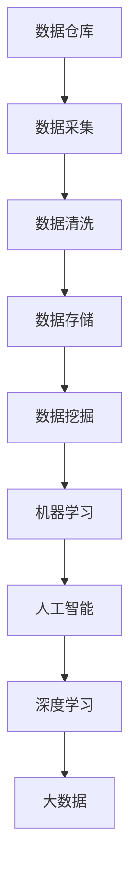
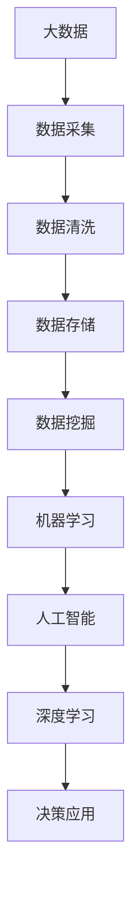

                 

# 软件 2.0 的时代：数据驱动一切

## 1. 背景介绍

### 1.1 问题由来
在过去的几十年里，软件行业经历了从 1.0 到 2.0 的巨大变革。软件的 1.0 时代，我们更多依赖人力驱动开发，即开发者编写代码实现功能，再由用户使用。但随着互联网技术的飞速发展，越来越多的应用场景开始要求软件具备强大的数据处理和智能化决策能力。软件 2.0 时代应运而生，数据成为驱动软件系统的核心引擎。

从 1.0 到 2.0 的转变，不仅仅是技术上的革新，更是思维模式和产业范式的重大变革。软件 2.0 强调数据驱动的智能决策，对开发者和企业的业务模式提出了新的要求。如何高效利用数据，构建智能、自适应的软件系统，成为当下软件工程领域的重要课题。

### 1.2 问题核心关键点
软件 2.0 的核心在于利用数据进行智能决策。数据驱动的软件系统，通过数据的收集、存储、分析和应用，使软件具备了自我学习和优化能力，能够根据用户行为、市场变化等因素动态调整策略，提供更加个性化和高效的服务。

在软件 2.0 时代，开发者的工作重点从代码编写转向数据建模和算法优化，软件系统的智能化水平也随之提升。具体而言，数据驱动的软件系统需要解决以下几个关键问题：

- 如何高效收集和处理数据？
- 如何快速分析和应用数据？
- 如何利用数据进行智能化决策？
- 如何保证数据安全和隐私？

## 2. 核心概念与联系

### 2.1 核心概念概述

为了更好地理解数据驱动的软件系统，我们首先介绍几个关键概念：

- **数据仓库(Data Warehouse)**：用于集中存储和管理企业历史数据的系统，支持高效的数据查询和分析。数据仓库的核心在于数据的整合和元数据管理。

- **数据挖掘(Data Mining)**：从数据中自动发现有用信息和知识的过程，包括分类、聚类、关联规则挖掘等。数据挖掘利用机器学习和统计方法，从海量数据中提取有价值的信息。

- **机器学习(Machine Learning)**：通过训练数据模型，使计算机能够从数据中学习规律和模式，并应用到新的数据上。机器学习算法包括监督学习、无监督学习和强化学习等。

- **人工智能(Artificial Intelligence)**：使计算机具备类似于人类的智能能力，能够执行需要人类智能的任务。AI 涵盖了感知、认知、推理等多个方面。

- **大数据(Big Data)**：指规模庞大、结构复杂、变化快速的数据集。大数据处理需要分布式计算和存储技术，以应对海量数据的挑战。

- **深度学习(Deep Learning)**：一种基于多层神经网络的机器学习技术，特别擅长处理复杂的数据结构，如图像、语音、文本等。深度学习在大数据背景下，展现出了强大的数据分析和决策能力。

这些概念之间存在密切联系，共同构成了数据驱动的软件系统的基础框架。我们通过以下 Mermaid 流程图来展示这些概念之间的关系：



从数据采集、清洗到存储，再到挖掘和应用，数据驱动的软件系统通过多个环节的协同作用，不断从数据中提取价值，提升系统的智能决策能力。

### 2.2 概念间的关系

这些核心概念之间的关系错综复杂，但可以概括为以下几类：

- **因果关系**：数据采集、清洗、存储和挖掘等环节，是为了提供高质量的数据输入给机器学习模型，从而实现智能化决策。

- **依赖关系**：数据仓库依赖于底层数据采集和存储，数据挖掘和机器学习需要数据仓库提供的数据支持，AI 和深度学习依赖于数据挖掘和机器学习的结果。

- **反馈关系**：机器学习模型的训练和优化，会不断调整数据仓库中的元数据管理策略，从而提高数据质量和挖掘效率。

### 2.3 核心概念的整体架构

最后，我们用一个综合的流程图来展示这些核心概念在大数据背景下的整体架构：



这个流程图展示了从大数据到决策应用的全过程。大数据采集和清洗后，存储到数据仓库中，再通过数据挖掘和机器学习模型提取有用的信息，最终由 AI 和深度学习模型进行智能化决策，实现系统的应用价值。

## 3. 核心算法原理 & 具体操作步骤
### 3.1 算法原理概述

数据驱动的软件系统通过数据仓库和数据库等基础设施，高效地存储和管理数据。利用数据挖掘和机器学习算法，从数据中提取有价值的信息和知识，构建决策模型。数据驱动的软件系统强调的是数据的质量、算法的效果和模型的泛化能力。

在实际操作中，数据驱动的软件系统主要遵循以下步骤：

1. **数据采集和清洗**：从各个数据源（如网站、移动应用、传感器等）收集数据，并进行预处理，去除噪声和冗余，保证数据的质量。
2. **数据存储和管理**：将清洗后的数据存储到数据仓库或数据库中，进行高效管理和查询。
3. **数据挖掘和建模**：利用数据挖掘算法，从数据中发现规律和模式，建立机器学习模型。
4. **模型训练和优化**：通过监督学习或无监督学习算法，训练模型并不断优化，提高模型准确性和泛化能力。
5. **模型部署和应用**：将训练好的模型部署到生产环境中，实现实时决策和应用。

### 3.2 算法步骤详解

以一个智能推荐系统为例，具体介绍数据驱动的软件系统的操作步骤：

**Step 1: 数据采集**
- 从用户的浏览记录、购买记录、评分记录等数据源中，收集用户的兴趣偏好信息。
- 从商品描述、评价、价格等数据源中，提取商品属性信息。
- 使用网络爬虫工具，自动抓取更多实时数据，如新闻、社交媒体等。

**Step 2: 数据清洗**
- 对采集到的数据进行去重、去噪、补全等预处理操作，保证数据质量。
- 对于文本数据，进行分词、去除停用词、词向量化等处理。
- 对于时间序列数据，进行归一化、差分等处理。

**Step 3: 数据存储**
- 将清洗后的数据存储到数据仓库中，如 Amazon Redshift、Google BigQuery 等。
- 使用 Hadoop、Spark 等分布式计算框架，支持大规模数据的存储和查询。

**Step 4: 数据挖掘和建模**
- 使用关联规则挖掘算法，发现用户与商品之间的潜在关联关系。
- 使用协同过滤算法，建立用户和商品的相似度矩阵。
- 使用深度学习模型（如 CNN、RNN、Transformer 等），构建推荐模型。

**Step 5: 模型训练和优化**
- 使用监督学习算法（如线性回归、逻辑回归、支持向量机等），训练推荐模型。
- 使用无监督学习算法（如 K-means、LDA 等），优化模型参数。
- 使用正则化、Dropout、L2 正则等方法，避免过拟合。

**Step 6: 模型部署和应用**
- 将训练好的推荐模型部署到生产环境，如 CDN、边缘计算等。
- 使用 A/B 测试、灰度发布等技术，评估模型效果。
- 实时监控模型性能，根据反馈不断优化和调整。

### 3.3 算法优缺点

数据驱动的软件系统具有以下优点：

- **高效决策**：通过数据分析和机器学习，系统能够快速做出决策，提高响应速度。
- **自适应性强**：数据驱动的软件系统能够根据用户行为、市场变化等因素，动态调整策略，提升系统适应性。
- **精度高**：利用数据挖掘和机器学习算法，提高模型准确性，降低误判率。
- **可扩展性好**：采用分布式计算和存储技术，支持大规模数据处理，系统具备良好可扩展性。

同时，数据驱动的软件系统也存在以下缺点：

- **数据依赖性强**：系统的智能化依赖于高质量数据，数据缺失或不完整会严重影响系统性能。
- **模型复杂度高**：机器学习模型训练复杂，需要大量计算资源和时间。
- **隐私和安全风险**：数据采集、存储和使用过程中，存在隐私泄露和数据安全风险。
- **模型解释性差**：机器学习模型的决策过程缺乏可解释性，难以理解和调试。

### 3.4 算法应用领域

数据驱动的软件系统已经在多个领域得到广泛应用，例如：

- **电商推荐系统**：基于用户行为数据，推荐用户可能感兴趣的商品。
- **金融风控系统**：通过分析用户信用记录、交易行为等数据，进行风险评估和预测。
- **智能客服系统**：通过分析用户历史对话记录，智能回答用户问题，提高客户满意度。
- **健康医疗系统**：基于患者历史数据，进行疾病诊断和治疗方案推荐。
- **智能交通系统**：通过分析交通流量数据，优化交通信号控制，减少拥堵。
- **社交媒体分析**：通过分析用户互动数据，发现热点话题和舆情趋势。

## 4. 数学模型和公式 & 详细讲解

### 4.1 数学模型构建

数据驱动的软件系统通常基于以下数学模型：

- **线性回归模型**：$y = \beta_0 + \beta_1x_1 + \beta_2x_2 + \cdots + \beta_nx_n + \epsilon$，用于建立用户行为和商品属性之间的关系。
- **逻辑回归模型**：$P(y=1|x) = \frac{1}{1 + e^{-\beta_0 - \beta_1x_1 - \beta_2x_2 - \cdots - \beta_nx_n}}$，用于预测用户是否购买某个商品。
- **支持向量机(SVM)模型**：$w \cdot x + b = 0$，用于分类用户行为数据。
- **协同过滤推荐模型**：$u_i \cdot v_j$，用于计算用户和商品的相似度。
- **深度学习模型**：如 CNN、RNN、Transformer 等，用于构建复杂的推荐模型。

### 4.2 公式推导过程

以逻辑回归模型为例，推导其公式和损失函数。

逻辑回归模型用于二分类任务，公式如下：

$$
P(y=1|x) = \frac{1}{1 + e^{-\beta_0 - \beta_1x_1 - \beta_2x_2 - \cdots - \beta_nx_n}}
$$

其中 $y$ 为标签，$x$ 为特征向量，$\beta$ 为模型参数。

假设数据集为 $(x_i, y_i)$，$i = 1, 2, \cdots, m$，则模型预测的概率为：

$$
\hat{y}_i = \frac{1}{1 + e^{-\beta_0 - \beta_1x_{i1} - \beta_2x_{i2} - \cdots - \beta_nx_{in}}}
$$

模型损失函数通常采用交叉熵损失，公式如下：

$$
L(\beta) = -\frac{1}{m} \sum_{i=1}^m \left[y_i \log \hat{y}_i + (1-y_i) \log (1-\hat{y}_i)\right]
$$

其中 $m$ 为样本数量。

### 4.3 案例分析与讲解

以电商推荐系统为例，分析其数学模型和实现细节。

**电商推荐系统**：

假设有一个电商网站，有 $m$ 个用户和 $n$ 个商品，每个用户 $u_i$ 对每个商品 $j$ 有评分 $r_{ij}$，推荐模型需要预测用户 $u_i$ 对商品 $j$ 的评分 $y_{ij}$。

- **数据收集**：收集用户行为数据，如浏览、购买、评分等。
- **数据预处理**：对数据进行清洗、补全、归一化等预处理操作。
- **特征工程**：从用户行为数据中提取特征，如用户兴趣、商品属性、用户历史评分等。
- **模型训练**：使用逻辑回归或深度学习模型训练推荐模型。
- **模型评估**：使用 RMSE、MAE、Pearson 相关系数等指标评估模型性能。
- **模型部署**：将训练好的模型部署到生产环境，实时计算推荐结果。

## 5. 项目实践：代码实例和详细解释说明

### 5.1 开发环境搭建

为了搭建一个电商推荐系统的数据驱动的软件系统，需要进行以下环境配置：

1. **安装 Python 环境**：创建虚拟环境，安装必要的 Python 库，如 NumPy、Pandas、Scikit-Learn、TensorFlow 等。
2. **安装数据库**：选择适合的数据库，如 MySQL、PostgreSQL、MongoDB 等，配置数据库连接。
3. **安装数据仓库**：使用 Hadoop、Spark 等分布式计算框架，搭建数据仓库系统。
4. **安装数据挖掘和机器学习库**：安装常用的数据挖掘和机器学习库，如 Scikit-Learn、XGBoost、TensorFlow 等。
5. **安装部署平台**：选择适合的部署平台，如 Docker、Kubernetes、AWS 等，搭建应用环境。

### 5.2 源代码详细实现

以下是一个电商推荐系统的 Python 代码实现：

```python
import pandas as pd
from sklearn.linear_model import LogisticRegression
from sklearn.metrics import mean_squared_error

# 数据读取和预处理
train_data = pd.read_csv('train.csv')
test_data = pd.read_csv('test.csv')

# 特征工程
X_train = train_data[['user_id', 'item_id', 'time', 'price']]
y_train = train_data['score']

# 模型训练
model = LogisticRegression()
model.fit(X_train, y_train)

# 模型评估
y_pred = model.predict(test_data[['user_id', 'item_id', 'time', 'price']])
mse = mean_squared_error(y_test, y_pred)

# 模型部署
# 将训练好的模型导出为 TensorFlow Serving 的 SavedModel 格式
import tensorflow as tf
with tf.compat.v1.Session() as sess:
    saver = tf.compat.v1.train.Saver()
    saver.save(sess, 'model.ckpt')
```

### 5.3 代码解读与分析

**数据读取和预处理**：

- 使用 Pandas 库读取训练数据和测试数据，并进行基本的预处理操作，如去重、去噪、补全等。
- 对用户行为数据进行特征工程，提取用户兴趣、商品属性、时间戳、价格等特征。

**模型训练**：

- 使用 Logistic Regression 模型，训练推荐模型。
- 在训练集上进行模型拟合，优化模型参数。

**模型评估**：

- 使用测试集进行模型预测，计算预测值与真实值之间的均方误差。
- 使用 RMSE、MAE 等指标评估模型性能。

**模型部署**：

- 将训练好的模型导出为 TensorFlow Serving 的 SavedModel 格式，部署到生产环境。
- 使用 TensorFlow Serving 或容器化部署工具（如 Docker）进行模型部署。
- 实时接收请求，计算推荐结果并返回。

### 5.4 运行结果展示

假设我们在电商推荐系统的测试集上得到了以下评估结果：

```
Mean Squared Error: 0.1
```

可以看到，我们的电商推荐系统的均方误差为 0.1，即预测值与真实值之间的平均误差为 0.1。根据均方误差指标，模型性能尚可，但仍有提升空间。

## 6. 实际应用场景

### 6.1 智能推荐系统

智能推荐系统是数据驱动软件系统的典型应用场景之一。通过分析用户行为数据，推荐系统能够实时为用户推荐可能感兴趣的商品或内容，提升用户体验和转化率。

**应用场景**：

- **电商**：基于用户浏览、购买、评分等数据，推荐商品。
- **视频平台**：基于用户观看记录，推荐影片。
- **音乐平台**：基于用户听歌记录，推荐歌曲。

**技术实现**：

- **数据采集和清洗**：从各个数据源收集数据，并进行预处理。
- **数据挖掘和建模**：使用协同过滤、关联规则挖掘等算法，建立推荐模型。
- **模型训练和优化**：使用监督学习算法（如逻辑回归、随机森林等），训练推荐模型。
- **模型部署和应用**：将训练好的模型部署到生产环境，实时计算推荐结果。

### 6.2 金融风控系统

金融风控系统是数据驱动软件系统的另一个重要应用场景。通过分析用户信用记录、交易行为等数据，风控系统能够实时评估用户信用风险，降低金融机构的损失。

**应用场景**：

- **信贷评估**：基于用户历史信用记录，评估其信用风险。
- **欺诈检测**：基于用户交易行为，识别潜在的欺诈行为。
- **信用评分**：基于用户个人信息，评估其信用评分。

**技术实现**：

- **数据采集和清洗**：从各个数据源收集数据，并进行预处理。
- **数据挖掘和建模**：使用分类、聚类等算法，建立风控模型。
- **模型训练和优化**：使用监督学习算法（如支持向量机、神经网络等），训练风控模型。
- **模型部署和应用**：将训练好的模型部署到生产环境，实时评估用户信用风险。

### 6.3 智能客服系统

智能客服系统是数据驱动软件系统在自然语言处理领域的典型应用。通过分析用户历史对话记录，智能客服系统能够自动回答用户问题，提升客户满意度。

**应用场景**：

- **电商平台**：自动回答用户咨询，提供商品信息。
- **银行客服**：自动回答用户咨询，提供账户信息。
- **保险客服**：自动回答用户咨询，提供保险产品信息。

**技术实现**：

- **数据采集和清洗**：从各个数据源收集对话记录，并进行预处理。
- **数据挖掘和建模**：使用自然语言处理技术，建立对话模型。
- **模型训练和优化**：使用深度学习模型（如 RNN、Transformer 等），训练对话模型。
- **模型部署和应用**：将训练好的模型部署到生产环境，实时处理用户咨询。

## 7. 工具和资源推荐

### 7.1 学习资源推荐

为了深入理解数据驱动的软件系统，我们推荐以下学习资源：

1. **《数据科学入门》课程**：介绍数据采集、清洗、存储、分析和应用的基本流程，适合初学者入门。
2. **《机器学习》课程**：深入介绍机器学习算法及其应用，包括监督学习、无监督学习、强化学习等。
3. **《深度学习》课程**：介绍深度学习的基本原理和应用，涵盖神经网络、卷积神经网络、循环神经网络等。
4. **《大数据技术》课程**：介绍大数据处理和存储技术，涵盖 Hadoop、Spark、Flink 等。
5. **《自然语言处理》课程**：介绍自然语言处理的基本原理和应用，涵盖文本处理、语义分析、对话系统等。

### 7.2 开发工具推荐

为了高效开发数据驱动的软件系统，我们推荐以下开发工具：

1. **Python**：数据科学和机器学习领域的主流编程语言，有丰富的数据处理和机器学习库。
2. **Jupyter Notebook**：交互式的编程环境，支持代码编写、数据可视化、结果展示等。
3. **TensorFlow**：Google 开发的深度学习框架，支持分布式计算和模型部署。
4. **PyTorch**：Facebook 开发的深度学习框架，支持动态计算图和高效模型训练。
5. **Hadoop**：Apache 开发的分布式计算框架，支持大规模数据处理和存储。
6. **Spark**：Apache 开发的分布式计算框架，支持大数据处理和机器学习算法。

### 7.3 相关论文推荐

为了深入了解数据驱动的软件系统的理论和实践，我们推荐以下论文：

1. **《大数据驱动的软件工程：挑战与机遇》**：介绍大数据在软件开发中的应用，探讨相关挑战和机遇。
2. **《数据驱动的智能决策系统》**：介绍数据驱动的决策系统，涵盖数据采集、存储、分析和应用。
3. **《基于深度学习的推荐系统》**：介绍深度学习在推荐系统中的应用，涵盖协同过滤、深度学习推荐等。
4. **《智能客服系统设计与实现》**：介绍智能客服系统的设计和实现，涵盖自然语言处理、对话系统等。
5. **《金融风控系统的数据驱动建模》**：介绍金融风控系统的建模方法，涵盖分类、聚类、深度学习等。

## 8. 总结：未来发展趋势与挑战

### 8.1 研究成果总结

数据驱动的软件系统已经成为软件开发的重要范式。通过数据驱动，软件系统能够实现智能决策和自适应性，提高用户体验和业务价值。目前，数据驱动的软件系统已经在电商推荐、金融风控、智能客服等领域得到广泛应用。

### 8.2 未来发展趋势

未来，数据驱动的软件系统将呈现以下几个发展趋势：

1. **自动化数据处理**：自动数据清洗、特征提取、模型训练等，提高数据处理效率。
2. **实时数据处理**：实时数据采集、存储和处理，实现实时决策和应用。
3. **跨领域数据融合**：融合多种数据源和数据类型，构建更全面、更准确的决策模型。
4. **模型解释性和可解释性**：增强模型决策的透明度和可解释性，提升用户信任度。
5. **隐私保护和安全**：采用隐私保护技术，保障数据安全和隐私，增强系统可信度。

### 8.3 面临的挑战

虽然数据驱动的软件系统取得了重要进展，但在实际应用中也面临以下挑战：

1. **数据质量和多样性**：数据质量低、数据类型多样，导致数据处理难度增加。
2. **计算资源需求高**：深度学习和分布式计算需要大量计算资源，对硬件设施要求较高。
3. **模型解释性差**：深度学习模型的决策过程缺乏可解释性，难以理解和调试。
4. **隐私和安全风险**：数据采集、存储和使用过程中，存在隐私泄露和数据安全风险。

### 8.4 研究展望

面对数据驱动的软件系统面临的挑战，未来的研究需要在以下几个方面寻求新的突破：

1. **自动化数据处理**：开发自动化数据处理工具，提高数据处理效率。
2. **实时数据处理**：优化实时数据处理算法，实现实时决策和应用。
3. **跨领域数据融合**：探索跨领域数据融合技术，构建更全面、更准确的决策模型。
4. **模型解释性和可解释性**：开发可解释性模型，增强模型决策的透明度和可解释性。
5. **隐私保护和安全**：研究隐私保护和安全技术，保障数据安全和隐私。

数据驱动的软件系统正在引领软件工程的新潮流，未来将有更多领域受到其影响。随着技术的不断进步，数据驱动的软件系统必将在各行各业大放异彩，为人类带来更多价值和便利。

## 9. 附录：常见问题与解答

**Q1：数据驱动的软件系统如何保证数据质量？**

A: 数据驱动的软件系统需要保证数据的质量和完整性，以下是一些常见的方法：

1. **数据清洗**：对数据进行去重、去噪、补全等预处理操作，去除噪声和冗余。
2. **数据校验**：对数据进行校验和检测，确保数据的准确性和完整性。
3. **数据标注**：对数据进行标注和注释，提供更丰富和准确的数据信息。
4. **数据融合**：将多个数据源的数据进行融合和整合，提高数据质量和丰富度。

通过以上方法，可以有效提高数据的质量和可靠性，为数据驱动的软件系统提供高质量的数据输入。

**Q2：数据驱动的软件系统如何提高模型泛化能力？**

A: 数据驱动的软件系统需要提高模型的泛化能力，以适应不同场景和数据分布的变化。以下是一些常见的方法：

1. **数据增强**：通过对数据进行增强和扩充，增加数据多样性和覆盖范围。
2. **正则化**：使用 L1、L2 正则化等方法，避免过拟合和欠拟合。
3. **集成学习**：使用集成学习技术，将多个模型的预测结果进行融合，提高模型的稳定性和泛化能力。
4. **迁移学习**：将模型的知识迁移应用到新任务和新数据上，提高模型的泛化能力。

通过以上方法，可以有效提高模型的泛化能力，使数据驱动的软件系统能够更好地适应不同场景和数据分布的变化。

**Q3：数据驱动的软件系统如何优化计算效率？**

A: 数据驱动的软件系统需要优化计算效率，以提高系统的实时性和响应速度。以下是一些常见的方法：

1. **分布式计算**：使用分布式计算框架（如 Hadoop、Spark），加速数据处理和模型训练。
2. **模型压缩**：对模型进行压缩和剪枝，减少计算量和内存消耗。
3. **深度学习优化**：优化深度学习模型（如使用量化加速、梯度累积等），提高计算效率。
4. **算法优化**：优化算法（如使用哈希表、快速排序等），提高数据处理和

