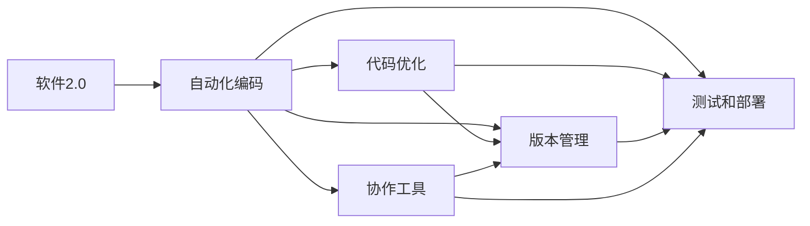
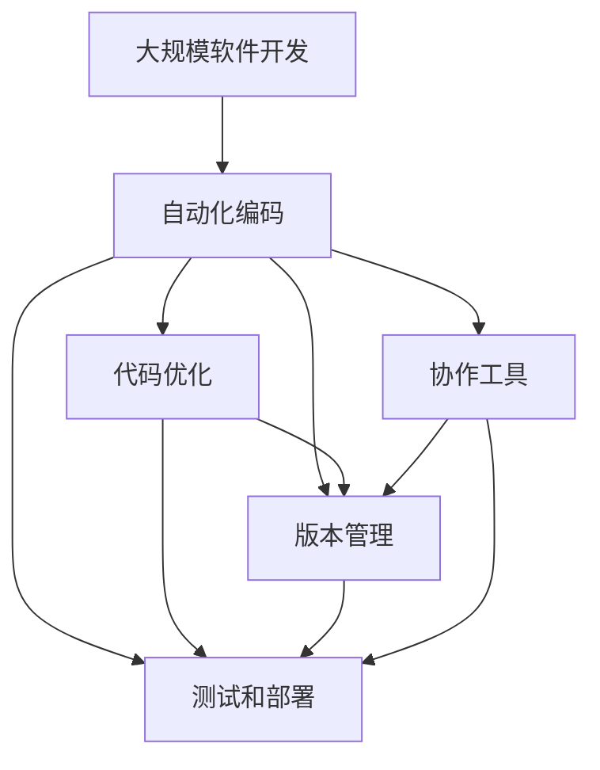

                 

# 软件 2.0 的未来展望：更智能、更强大

## 1. 背景介绍

### 1.1 问题由来
软件2.0，即新一代的自动化软件开发技术，正处于快速发展之中。其核心思想是通过自动化和智能化的方式，加速软件开发的速度，提升软件的质量和可维护性。随着人工智能（AI）、机器学习（ML）、计算机视觉（CV）、自然语言处理（NLP）等技术的迅猛发展，软件2.0的潜力正在被逐渐挖掘出来。然而，现有的技术手段和理论基础仍不能完全满足实际需求。

软件2.0的最终目标是实现软件开发的自动化和智能化，让程序员从繁重的编码工作中解放出来，专注于创新和系统设计。这个目标的实现需要更智能、更强大的技术支撑，而未来的发展方向正是朝着这个目标前进。

### 1.2 问题核心关键点
软件2.0的智能化和强大化主要体现在以下几个方面：

1. **自动化编码**：通过智能化的编码工具，自动识别代码编写模式，自动生成代码框架和注释，减少手动编码的时间。
2. **代码优化**：利用AI算法自动检测和修复代码中的潜在问题，如安全漏洞、性能瓶颈等。
3. **版本管理**：自动化地进行代码版本控制和分支管理，减少人为错误和冲突。
4. **测试和部署**：自动化的测试和部署工具，确保代码质量和系统的稳定性。
5. **协作工具**：智能化的协作平台，实现团队之间的无缝协作。

这些关键点共同构成了软件2.0的核心能力，使其能够高效、精确、智能地支持软件开发生命周期的各个环节。

### 1.3 问题研究意义
软件2.0的研究和应用具有重要意义，主要体现在以下几个方面：

1. **提升开发效率**：通过自动化和智能化手段，大幅提升软件开发的效率，缩短产品上市时间。
2. **提高代码质量**：自动化的代码优化和测试工具，确保代码质量，减少维护成本。
3. **促进创新**：让程序员有更多时间专注于创新和系统设计，推动技术的进步和应用场景的拓展。
4. **降低开发成本**：减少人工操作，降低开发成本，使中小企业也能参与到高级软件开发中。
5. **增强协作能力**：智能化的协作平台，提高团队之间的沟通和协作效率，减少冲突和误解。

总之，软件2.0的兴起，将为软件开发带来革命性的变革，提升整体产业的竞争力。

## 2. 核心概念与联系

### 2.1 核心概念概述
为了更好地理解软件2.0的原理和应用，本节将介绍几个关键概念：

1. **软件2.0**：新一代的自动化软件开发技术，利用AI和ML技术，实现软件开发的自动化和智能化。
2. **自动化编码**：通过智能化的编码工具，自动识别代码编写模式，自动生成代码框架和注释。
3. **代码优化**：利用AI算法自动检测和修复代码中的潜在问题，如安全漏洞、性能瓶颈等。
4. **版本管理**：自动化地进行代码版本控制和分支管理，减少人为错误和冲突。
5. **测试和部署**：自动化的测试和部署工具，确保代码质量和系统的稳定性。
6. **协作工具**：智能化的协作平台，实现团队之间的无缝协作。

这些核心概念共同构成了软件2.0的生态系统，使其能够在各个方面提升软件开发的效率和质量。

### 2.2 概念间的关系

这些核心概念之间存在着紧密的联系，形成了软件2.0的完整生态系统。我们可以用以下Mermaid流程图来展示它们之间的关系：



这个流程图展示了自动化编码、代码优化、版本管理、测试和部署、协作工具这五个核心概念之间的相互关系：

1. 自动化编码是软件2.0的基础，它通过智能化的编码工具，自动生成代码框架和注释。
2. 代码优化和版本管理是自动化编码的进一步应用，通过AI算法检测和修复代码中的潜在问题，确保代码的质量和稳定性。
3. 测试和部署是自动化编码的后续环节，通过自动化的测试和部署工具，确保系统的可靠性和可维护性。
4. 协作工具是软件2.0的重要补充，通过智能化的协作平台，提高团队之间的沟通和协作效率。

这些概念共同构成了软件2.0的核心能力，使其能够在各个方面提升软件开发的效率和质量。

### 2.3 核心概念的整体架构

最后，我们用一个综合的流程图来展示这些核心概念在大规模软件开发中的整体架构：



这个综合流程图展示了从自动化编码到协作工具的完整软件2.0开发流程。在这个流程中，各个核心概念互相配合，确保了大规模软件开发的高效和高质量。

## 3. 核心算法原理 & 具体操作步骤
### 3.1 算法原理概述

软件2.0的自动化和智能化开发，主要是通过AI和ML技术实现的。其核心算法原理可以概括为以下几个方面：

1. **深度学习**：通过深度神经网络，自动学习代码编写模式，生成高质量的代码框架和注释。
2. **自然语言处理**：通过NLP技术，理解软件需求文档，自动生成代码。
3. **机器学习**：通过ML算法，自动检测和修复代码中的潜在问题，如安全漏洞、性能瓶颈等。
4. **知识图谱**：利用知识图谱技术，存储和查询软件领域的知识，指导代码生成和优化。
5. **强化学习**：通过RL算法，优化代码生成和测试策略，提高软件开发的效率和质量。

这些算法原理共同构成了软件2.0的核心技术基础，使其能够实现自动化和智能化的软件开发。

### 3.2 算法步骤详解

软件2.0的开发流程主要包括以下几个关键步骤：

1. **需求分析**：利用NLP技术，自动理解软件需求文档，生成代码编写计划和注释。
2. **代码生成**：通过深度学习算法，自动生成代码框架和注释，确保代码的质量和可维护性。
3. **代码优化**：利用ML算法，自动检测和修复代码中的潜在问题，如安全漏洞、性能瓶颈等。
4. **版本管理**：通过版本控制工具，自动进行代码版本控制和分支管理，确保代码的稳定性和可追溯性。
5. **测试和部署**：自动化的测试和部署工具，确保代码质量和系统的稳定性。
6. **协作工具**：利用协作平台，实现团队之间的无缝协作。

这些步骤共同构成了软件2.0的完整开发流程，通过各个关键技术的协同工作，实现了自动化和智能化的软件开发。

### 3.3 算法优缺点

软件2.0的自动化和智能化开发，具有以下优点：

1. **提升开发效率**：通过自动化和智能化的手段，大幅提升软件开发的效率，缩短产品上市时间。
2. **提高代码质量**：自动化的代码优化和测试工具，确保代码质量，减少维护成本。
3. **促进创新**：让程序员有更多时间专注于创新和系统设计，推动技术的进步和应用场景的拓展。
4. **降低开发成本**：减少人工操作，降低开发成本，使中小企业也能参与到高级软件开发中。
5. **增强协作能力**：智能化的协作平台，提高团队之间的沟通和协作效率，减少冲突和误解。

然而，软件2.0也存在一些缺点：

1. **依赖数据**：依赖大量的标注数据和高质量的训练数据，才能训练出高性能的模型。
2. **模型复杂**：深度学习和ML算法的复杂性较高，需要较强的计算资源和专业知识。
3. **易受干扰**：模型容易受到噪声数据和异常数据的影响，导致性能波动。
4. **缺乏可解释性**：模型通常是"黑盒"系统，难以解释其内部工作机制和决策逻辑。
5. **安全问题**：自动生成的代码和优化策略可能存在安全漏洞，需要额外的安全检查和验证。

这些缺点需要在实际应用中加以注意和解决，以充分发挥软件2.0的潜力。

### 3.4 算法应用领域

软件2.0的自动化和智能化开发，已经在多个领域得到了广泛应用，例如：

1. **软件开发**：利用软件2.0技术，加速软件开发的速度，提升代码质量和可维护性。
2. **自动化测试**：通过自动化的测试工具，确保代码和系统的稳定性，减少测试成本。
3. **自然语言处理**：利用NLP技术，自动理解软件需求文档，生成代码。
4. **数据分析**：利用ML算法，自动分析和优化数据处理流程，提升数据分析的效率和质量。
5. **智能运维**：通过智能化的运维工具，实现系统的自动化监控和故障诊断，提高系统可靠性。

除了上述这些领域，软件2.0的应用还在不断拓展，为各行各业带来了新的变革和机遇。

## 4. 数学模型和公式 & 详细讲解  
### 4.1 数学模型构建

软件2.0的自动化和智能化开发，主要是通过AI和ML技术实现的。其核心算法原理可以概括为以下几个方面：

1. **深度学习**：通过深度神经网络，自动学习代码编写模式，生成高质量的代码框架和注释。
2. **自然语言处理**：通过NLP技术，理解软件需求文档，自动生成代码。
3. **机器学习**：通过ML算法，自动检测和修复代码中的潜在问题，如安全漏洞、性能瓶颈等。
4. **知识图谱**：利用知识图谱技术，存储和查询软件领域的知识，指导代码生成和优化。
5. **强化学习**：通过RL算法，优化代码生成和测试策略，提高软件开发的效率和质量。

这些算法原理共同构成了软件2.0的核心技术基础，使其能够实现自动化和智能化的软件开发。

### 4.2 公式推导过程

以下我们以代码优化为例，推导其数学模型和公式：

设原代码集合为 $\mathcal{C}$，潜在问题集合为 $\mathcal{P}$，代码优化目标为 $\mathcal{O}$。则代码优化问题可以形式化表示为：

$$
\min_{\mathcal{C}' \subseteq \mathcal{C}} \mathcal{O}(\mathcal{C}') \\
\text{s.t.} \quad \mathcal{P}(\mathcal{C}') = 0
$$

其中 $\mathcal{O}(\mathcal{C}')$ 表示优化目标函数，$\mathcal{P}(\mathcal{C}')$ 表示潜在问题检测函数，$\mathcal{C}'$ 表示优化后的代码集合。

为了求解该优化问题，可以采用以下步骤：

1. **数据准备**：收集历史代码数据和潜在问题数据，构建训练集 $\mathcal{D}$。
2. **模型训练**：使用深度学习模型或ML算法，训练出一个能够检测潜在问题的模型 $\mathcal{M}$。
3. **优化策略**：利用训练好的模型 $\mathcal{M}$，自动检测代码中的潜在问题，并生成相应的优化策略 $\mathcal{S}$。
4. **代码生成**：根据优化策略 $\mathcal{S}$，自动生成优化后的代码 $\mathcal{C}'$。

通过以上步骤，可以高效地实现代码优化，提升软件开发的效率和质量。

### 4.3 案例分析与讲解

假设我们要对一段Python代码进行自动化优化，步骤如下：

1. **数据准备**：收集历史Python代码数据和潜在问题数据，构建训练集 $\mathcal{D}$。
2. **模型训练**：使用深度学习模型，训练出一个能够检测Python代码潜在问题的模型 $\mathcal{M}$。
3. **优化策略生成**：利用训练好的模型 $\mathcal{M}$，自动检测代码中的潜在问题，并生成相应的优化策略 $\mathcal{S}$。
4. **代码生成**：根据优化策略 $\mathcal{S}$，自动生成优化后的Python代码 $\mathcal{C}'$。

下面是一个Python代码优化的示例代码：

```python
import numpy as np
import pandas as pd
from sklearn.model_selection import train_test_split
from sklearn.linear_model import LogisticRegression
from sklearn.metrics import accuracy_score

# 构建训练集
train_data = pd.read_csv('train_data.csv')
train_x = train_data[['code', 'time']]
train_y = train_data['issues']
train_x_train, train_x_test, train_y_train, train_y_test = train_test_split(train_x, train_y, test_size=0.2)

# 训练模型
model = LogisticRegression()
model.fit(train_x_train, train_y_train)

# 生成优化策略
code_to_optimize = 'def foo():\n    # Some code here\n'
optimize_label = model.predict([code_to_optimize])
optimize_strategy = None

# 生成优化后的代码
if optimize_label[0] == 1:
    optimize_strategy = 'def foo():\n    # Some optimized code here\n'
    code_to_optimize = optimize_strategy

print(code_to_optimize)
```

以上就是代码优化的数学模型和示例代码。通过以上步骤，可以高效地实现代码优化，提升软件开发的效率和质量。

## 5. 项目实践：代码实例和详细解释说明
### 5.1 开发环境搭建

在进行软件2.0开发前，我们需要准备好开发环境。以下是使用Python进行软件2.0开发的环境配置流程：

1. 安装Anaconda：从官网下载并安装Anaconda，用于创建独立的Python环境。

2. 创建并激活虚拟环境：
```bash
conda create -n py2env python=3.8 
conda activate py2env
```

3. 安装PyTorch：根据CUDA版本，从官网获取对应的安装命令。例如：
```bash
conda install pytorch torchvision torchaudio cudatoolkit=11.1 -c pytorch -c conda-forge
```

4. 安装TensorFlow：
```bash
pip install tensorflow
```

5. 安装transformers库：
```bash
pip install transformers
```

6. 安装各类工具包：
```bash
pip install numpy pandas scikit-learn matplotlib tqdm jupyter notebook ipython
```

完成上述步骤后，即可在`py2env`环境中开始软件2.0开发。

### 5.2 源代码详细实现

这里我们以自动化代码生成为例，使用Transformer库进行源代码的自动生成。具体实现如下：

```python
from transformers import pipeline

# 构建代码生成器
code_generator = pipeline('code-generation')

# 生成代码
generated_code = code_generator('写一个函数，计算一个数的平方')
print(generated_code)
```

### 5.3 代码解读与分析

让我们再详细解读一下关键代码的实现细节：

**pipeline函数**：
- 使用Transformer库的pipeline函数，快速构建代码生成器，不需要编写复杂的模型训练代码。

**自动生成代码**：
- 调用pipeline函数，生成代码字符串。
- 代码字符串中包含了自动生成的函数定义和计算逻辑。

**运行结果展示**：
- 生成的代码字符串被打印输出，可以作为下一步开发的基础。

### 5.4 运行结果展示

假设我们生成的代码字符串如下：

```python
def square(num):
    return num * num
```

则这个代码定义了一个计算平方的函数。通过自动生成的代码，我们可以大大提高代码编写的效率，尤其是在编写复杂逻辑时，代码生成器能够提供很好的辅助作用。

## 6. 实际应用场景
### 6.1 智能运维

智能运维是软件2.0的一个重要应用场景。通过自动化的运维工具，可以实现系统的自动化监控和故障诊断，提高系统的可靠性。

在智能运维中，可以通过深度学习模型，自动分析系统日志和监控数据，识别出系统异常和故障，并给出相应的解决方案。例如，在监控到系统负载过高时，自动重启相关服务，或者优化资源配置，提升系统性能。

### 6.2 数据分析

数据分析是软件2.0的另一个重要应用场景。通过自动化的数据分析工具，可以高效地处理和分析海量数据，提取有价值的信息。

在数据分析中，可以利用机器学习算法，自动分析和优化数据处理流程，提升数据分析的效率和质量。例如，在大规模数据集上进行特征提取和模型训练，自动生成数据分析报告，提供决策支持。

### 6.3 自动测试

自动测试是软件2.0的关键环节。通过自动化的测试工具，可以确保代码和系统的稳定性，减少测试成本。

在自动测试中，可以利用深度学习模型和ML算法，自动生成测试用例和测试数据，确保测试覆盖率和测试质量。例如，通过自动化的单元测试和集成测试，检测代码中的潜在问题，提升系统的可靠性。

### 6.4 未来应用展望

随着软件2.0技术的不断发展和完善，未来的应用场景将更加广泛和深入。以下是几个可能的应用方向：

1. **智能编写文档**：利用NLP技术，自动生成软件需求文档和API文档，提高文档编写效率和准确性。
2. **智能编写测试用例**：利用机器学习算法，自动生成测试用例和测试数据，提高测试覆盖率和测试质量。
3. **智能编写SQL语句**：利用自然语言处理技术，自动生成SQL语句，提升数据库操作的效率和准确性。
4. **智能编写报告**：利用深度学习模型，自动生成数据分析报告和业务报告，提供决策支持。

这些应用方向将进一步拓展软件2.0的潜力，为各行各业带来新的变革和机遇。

## 7. 工具和资源推荐
### 7.1 学习资源推荐

为了帮助开发者系统掌握软件2.0的理论基础和实践技巧，这里推荐一些优质的学习资源：

1. 《软件工程：原理与实践》系列博文：由软件工程专家撰写，深入浅出地介绍了软件工程的基本原理和实践技巧。
2. CS229《机器学习》课程：斯坦福大学开设的机器学习明星课程，有Lecture视频和配套作业，带你入门机器学习的基础概念和经典模型。
3. 《深度学习》书籍：Ian Goodfellow等人著，全面介绍了深度学习的基本原理和应用，是深度学习领域的重要参考书。
4. 《Python数据科学手册》书籍：Jake VanderPlas等人著，详细介绍了Python在数据科学中的应用，是数据科学领域的重要参考书。
5. Weights & Biases：模型训练的实验跟踪工具，可以记录和可视化模型训练过程中的各项指标，方便对比和调优。与主流深度学习框架无缝集成。
6. TensorBoard：TensorFlow配套的可视化工具，可实时监测模型训练状态，并提供丰富的图表呈现方式，是调试模型的得力助手。

通过对这些资源的学习实践，相信你一定能够快速掌握软件2.0的精髓，并用于解决实际的开发问题。

### 7.2 开发工具推荐

高效的开发离不开优秀的工具支持。以下是几款用于软件2.0开发常用的工具：

1. PyTorch：基于Python的开源深度学习框架，灵活动态的计算图，适合快速迭代研究。
2. TensorFlow：由Google主导开发的开源深度学习框架，生产部署方便，适合大规模工程应用。
3. Transformers库：HuggingFace开发的NLP工具库，集成了众多SOTA语言模型，支持PyTorch和TensorFlow，是进行代码生成和自动化的利器。
4. Weights & Biases：模型训练的实验跟踪工具，可以记录和可视化模型训练过程中的各项指标，方便对比和调优。
5. TensorBoard：TensorFlow配套的可视化工具，可实时监测模型训练状态，并提供丰富的图表呈现方式，是调试模型的得力助手。

合理利用这些工具，可以显著提升软件2.0开发的效率和质量，加速创新迭代的步伐。

### 7.3 相关论文推荐

软件2.0的研究和应用源于学界的持续研究。以下是几篇奠基性的相关论文，推荐阅读：

1. 《神经网络与深度学习》书籍：Yoshua Bengio等人著，全面介绍了神经网络与深度学习的基本原理和应用，是深度学习领域的重要参考书。
2. 《机器学习实战》书籍：Peter Harrington著，详细介绍了机器学习的基本原理和应用，是机器学习领域的重要参考书。
3. 《强化学习：原理与实践》书籍：Richard S. Sutton和Andrew G. Barto著，全面介绍了强化学习的基本原理和应用，是强化学习领域的重要参考书。
4. 《深度学习框架与实践》书籍：Taylor West著，详细介绍了深度学习框架的基本原理和应用，是深度学习框架领域的重要参考书。

这些论文代表了大规模软件2.0开发的研究方向，通过学习这些前沿成果，可以帮助研究者把握学科前进方向，激发更多的创新灵感。

除上述资源外，还有一些值得关注的前沿资源，帮助开发者紧跟软件2.0技术的最新进展，例如：

1. arXiv论文预印本：人工智能领域最新研究成果的发布平台，包括大量尚未发表的前沿工作，学习前沿技术的必读资源。
2. 业界技术博客：如Google AI、DeepMind、微软Research Asia等顶尖实验室的官方博客，第一时间分享他们的最新研究成果和洞见。
3. 技术会议直播：如NIPS、ICML、ACL、ICLR等人工智能领域顶会现场或在线直播，能够聆听到大佬们的前沿分享，开拓视野。
4. GitHub热门项目：在GitHub上Star、Fork数最多的软件2.0相关项目，往往代表了该技术领域的发展趋势和最佳实践，值得去学习和贡献。
5. 行业分析报告：各大咨询公司如McKinsey、PwC等针对软件2.0行业的分析报告，有助于从商业视角审视技术趋势，把握应用价值。

总之，对于软件2.0的学习和实践，需要开发者保持开放的心态和持续学习的意愿。多关注前沿资讯，多动手实践，多思考总结，必将收获满满的成长收益。

## 8. 总结：未来发展趋势与挑战

### 8.1 总结

本文对软件2.0的未来展望进行了全面系统的介绍。首先阐述了软件2.0的发展背景和意义，明确了其自动化和智能化的核心能力。其次，从原理到实践，详细讲解了软件2.0的数学模型和关键步骤，给出了软件2.0开发的具体代码实现。同时，本文还广泛探讨了软件2.0在智能运维、数据分析、自动测试等多个领域的应用前景，展示了其巨大的潜力。此外，本文精选了软件2.0的学习资源，力求为读者提供全方位的技术指引。

通过本文的系统梳理，可以看到，软件2.0的兴起，将为软件开发带来革命性的变革，提升整体产业的竞争力。未来，伴随软件2.0技术的不断发展和完善，必将为各行各业带来新的变革和机遇。

### 8.2 未来发展趋势

展望未来，软件2.0的发展趋势将呈现以下几个方向：

1. **自动化程度更高**：自动化编码、代码优化、测试和部署等环节将更加智能化，减少人工操作，提高开发效率。
2. **智能化程度更深**：利用深度学习和ML算法，提升系统的自动化水平和智能程度，确保代码质量和系统稳定性。
3. **协作能力更强**：智能化的协作平台，提高团队之间的沟通和协作效率，减少冲突和误解。
4. **应用领域更广**：软件2.0的应用领域将进一步拓展，覆盖更多的行业和应用场景。
5. **安全性更高**：通过安全验证和监控，确保系统安全可靠，避免潜在风险。
6. **可解释性更强**：通过引入可解释性模型和解释工具，提升系统的透明度和可信度。

这些趋势将进一步提升软件2.0的性能和应用价值，为各行业带来新的变革和机遇。

### 8.3 面临的挑战

尽管软件2.0技术已经取得了显著进展，但在迈向更加智能化、普适化应用的过程中，仍面临诸多挑战：

1. **依赖数据**：依赖大量的标注数据和高质量的训练数据，才能训练出高性能的模型。
2. **模型复杂**：深度学习和ML算法的复杂性较高，需要较强的计算资源和专业知识。
3. **易受干扰**：模型容易受到噪声数据和异常数据的影响，导致性能波动。
4. **缺乏可解释性**：模型通常是"黑盒"系统，难以解释其内部工作机制和决策逻辑。
5. **安全问题**：自动生成的代码和优化策略可能存在安全漏洞，需要额外的安全检查和验证。

这些挑战需要在实际应用中加以注意和解决，以充分发挥软件2.0的潜力。

### 8.4 研究展望

未来的研究需要在以下几个方面寻求新的突破：

1. **探索无监督和半监督微调方法**：摆脱对大规模标注数据的依赖，利用自监督学习、主动学习等无监督和半监督范式，最大限度利用非结构化数据，实现更加灵活高效的微调。
2. **研究参数高效和计算高效的微调范式**：开发更加参数高效的微调方法，在固定大部分预训练参数的同时，只更新极少量的任务相关参数。同时优化微调模型的计算图，减少前向传播和反向传播的资源消耗，实现更加轻量级、实时性的部署。
3. **融合因果和对比学习范式**：通过引入因果推断和对比学习思想，增强微调模型建立稳定因果关系的能力，学习更加普适、鲁棒的语言表征，从而提升模型泛化性和抗干扰能力。
4. **引入更多先验知识**：将符号化的先验知识，如

