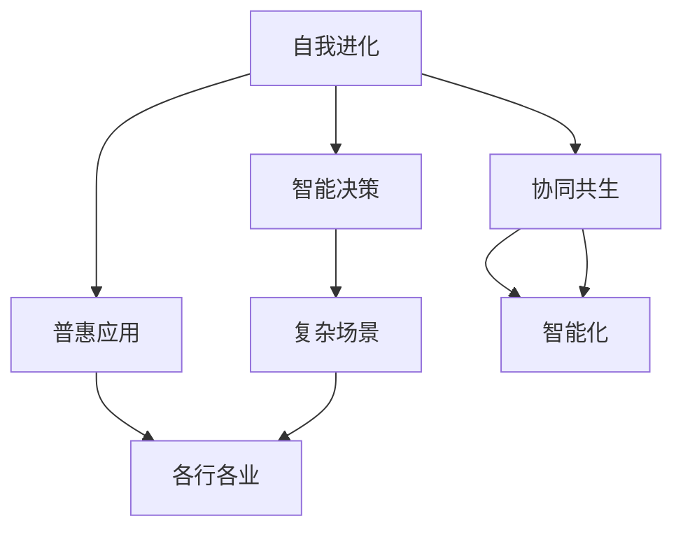

                 

# 软件 2.0 的未来愿景：创造更美好的世界

## 1. 背景介绍

### 1.1 问题的由来
随着信息技术的发展，软件行业经历了多次颠覆性的变革。从早期的汇编程序，到高级语言的兴起，再到软件工程管理的完善，每一次变革都极大地提升了软件开发和应用的效率。然而，软件行业的未来发展方向何在？如何让软件系统更智能、更可靠、更普惠？这些问题值得深入思考。

### 1.2 问题的核心关键点
软件 2.0 的概念由著名软件工程师萨德（Russell Selfridge）提出，其核心理念是将软件视为一个自我进化的智能系统，能够不断自我更新和优化。软件 2.0 的核心关键点包括：

- 自我进化：软件系统能够自动学习和适应环境变化，持续提升性能和功能。
- 智能决策：软件系统具备智能推理和决策能力，能够在复杂场景下自动做出最优选择。
- 普惠应用：软件系统能够广泛应用到各行各业，赋能社会进步和人类福祉。

软件 2.0 的目标是构建一个智能、普惠、可持续的软件生态系统，使软件成为推动社会进步的重要力量。

### 1.3 问题的研究意义
软件 2.0 的研究对于推动软件行业的发展具有重要意义：

1. 提升软件开发效率：通过自动化、智能化的工具和流程，减少人工干预，提升开发效率。
2. 增强系统智能性：使软件系统具备自学习、自优化能力，提升系统性能和用户体验。
3. 降低技术门槛：简化软件开发的技术门槛，使更多开发者能够参与到软件开发和应用中来。
4. 促进技术普及：通过普惠应用，使更多人受益于软件技术的进步，推动社会进步和人类福祉。

## 2. 核心概念与联系

### 2.1 核心概念概述

软件 2.0 的实现离不开以下几个核心概念：

- **自我进化**：软件系统能够自动学习和适应环境变化，持续提升性能和功能。
- **智能决策**：软件系统具备智能推理和决策能力，能够在复杂场景下自动做出最优选择。
- **普惠应用**：软件系统能够广泛应用到各行各业，赋能社会进步和人类福祉。
- **协同共生**：软件系统与其他系统（如硬件、数据、人机交互）协同工作，构建更加智能化、普惠化的应用场景。

### 2.2 概念间的关系

这些核心概念之间的逻辑关系可以通过以下Mermaid流程图来展示：



这个流程图展示了自己进化、智能决策、普惠应用和协同共生之间的关系：

1. 自我进化使软件系统能够自动学习和适应环境变化，持续提升性能和功能。
2. 智能决策使软件系统具备智能推理和决策能力，能够在复杂场景下自动做出最优选择。
3. 普惠应用使软件系统能够广泛应用到各行各业，赋能社会进步和人类福祉。
4. 协同共生使软件系统与其他系统（如硬件、数据、人机交互）协同工作，构建更加智能化、普惠化的应用场景。

这些核心概念共同构成了软件 2.0 的完整生态系统，使其能够在各种场景下发挥智能、普惠、协同的独特价值。

## 3. 核心算法原理 & 具体操作步骤
### 3.1 算法原理概述

软件 2.0 的实现依赖于机器学习、深度学习、自然语言处理、数据科学等多个领域的算法和技术。其中，基于强化学习（Reinforcement Learning, RL）的智能决策算法是一个重要组成部分。

在强化学习中，软件系统被视作一个智能代理（Agent），通过与环境（Environment）交互，不断学习和优化自己的策略。具体来说，系统通过以下几个步骤实现自我进化和智能决策：

1. **环境感知**：软件系统通过传感器、用户交互等方式感知环境信息。
2. **状态表示**：将感知到的环境信息表示为系统状态，供决策算法使用。
3. **智能决策**：使用强化学习算法，如Q-learning、Policy Gradient等，在当前状态下选择最优动作（Action）。
4. **效果反馈**：系统执行动作后，观察环境的变化，并将效果反馈给学习算法。
5. **策略更新**：根据效果反馈，调整系统的决策策略，以提升性能。

### 3.2 算法步骤详解

以下是基于强化学习的软件 2.0 系统的详细操作步骤：

1. **环境设计**：
   - 确定软件系统需要适应的环境和目标。
   - 设计环境模拟器，以模拟实际应用场景。

2. **状态表示**：
   - 定义系统的状态表示方法，如状态空间、状态特征等。
   - 使用状态表示方法，将感知到的环境信息转换为系统状态。

3. **智能决策**：
   - 设计强化学习算法，选择合适的决策策略。
   - 在当前状态下，使用决策策略选择最优动作。

4. **效果反馈**：
   - 系统执行动作后，观察环境的变化，记录效果。
   - 将效果反馈给强化学习算法，作为模型训练的数据。

5. **策略更新**：
   - 根据效果反馈，调整决策策略，提升系统性能。
   - 定期对模型进行重新训练，以适应新的环境变化。

6. **模型部署**：
   - 将训练好的模型部署到实际应用环境中。
   - 监控模型表现，不断优化和调整模型参数。

### 3.3 算法优缺点

软件 2.0 系统具有以下优点：

- **智能性高**：通过强化学习算法，系统能够自主学习优化策略，提升系统性能。
- **适应性强**：系统能够自适应环境变化，具备较强的泛化能力。
- **普惠性好**：系统能够广泛应用到各行各业，推动社会进步和人类福祉。

同时，软件 2.0 系统也存在一些缺点：

- **计算资源需求高**：强化学习算法通常需要大量计算资源进行训练和优化。
- **模型复杂度高**：系统需要设计复杂的状态表示和决策策略，存在一定的技术门槛。
- **效果依赖于数据质量**：强化学习的效果高度依赖于环境的准确模拟和反馈数据的质量。

### 3.4 算法应用领域

软件 2.0 系统的核心算法和思想已经在多个领域得到了应用：

- **智能推荐系统**：如电商平台的个性化推荐，通过学习用户行为数据，自动推荐商品。
- **自动驾驶**：如自动驾驶车辆，通过感知周围环境，自动做出驾驶决策。
- **智能客服**：如智能客服系统，通过学习用户对话数据，自动回答用户问题。
- **智能物流**：如智能仓储管理系统，通过学习物流数据，优化仓储策略。

这些应用展示了软件 2.0 系统的强大潜力，为各行各业带来了智能化、普惠化的解决方案。

## 4. 数学模型和公式 & 详细讲解 & 举例说明

### 4.1 数学模型构建

软件 2.0 系统的核心算法为强化学习算法，其数学模型基于马尔可夫决策过程（Markov Decision Process, MDP）。

假设软件系统在一个连续环境中，状态空间为 $S$，动作空间为 $A$，状态转移概率为 $P(s_{t+1}|s_t,a_t)$，奖励函数为 $R(s_t,a_t)$，则系统的MDP模型可以表示为：

$$
MDP = \{S, A, P, R\}
$$

其中 $S$ 表示状态空间，$A$ 表示动作空间，$P$ 表示状态转移概率，$R$ 表示奖励函数。

### 4.2 公式推导过程

以下是强化学习算法中常用的Q-learning算法的推导过程：

假设系统在当前状态 $s_t$，选择动作 $a_t$，观察到下一个状态 $s_{t+1}$，获得奖励 $r_{t+1}$。则Q-learning算法的目标是最小化状态-动作对的Q值：

$$
Q(s_t,a_t) = Q(s_t,a_t) + \eta[0 \le R(s_t,a_t) + \gamma\max_{a}Q(s_{t+1},a) - Q(s_t,a_t)]
$$

其中 $\eta$ 为学习率，$\gamma$ 为折扣因子。Q值表示在当前状态下选择某个动作的累积奖励期望值。

通过迭代计算Q值，Q-learning算法能够逐步优化系统的决策策略，提升系统性能。

### 4.3 案例分析与讲解

以智能推荐系统为例，解释Q-learning算法的应用。

假设系统需要在电商平台上为用户推荐商品，用户选择商品后，系统会获得奖励。状态 $s_t$ 表示用户当前浏览的商品集，动作 $a_t$ 表示推荐商品的集合。系统通过Q-learning算法不断学习最优的推荐策略，以达到最大化用户满意度和平台收益。

## 5. 项目实践：代码实例和详细解释说明

### 5.1 开发环境搭建

以下是使用Python进行强化学习项目开发的环境配置流程：

1. 安装Anaconda：从官网下载并安装Anaconda，用于创建独立的Python环境。

2. 创建并激活虚拟环境：
```bash
conda create -n rl-env python=3.8 
conda activate rl-env
```

3. 安装强化学习库：
```bash
pip install gym numpy gym-box
```

4. 安装其他相关工具包：
```bash
pip install pandas scikit-learn matplotlib tqdm jupyter notebook ipython
```

完成上述步骤后，即可在`rl-env`环境中开始强化学习项目的开发。

### 5.2 源代码详细实现

这里以Q-learning算法为例，给出使用Gym库实现智能推荐系统的代码实现。

首先，定义状态和动作空间：

```python
import gym

state_space = gym.spaces.Dict({
    "item_ids": gym.spaces.Discrete(100), # 商品ID
    "item_scores": gym.spaces.Box(low=0, high=1, shape=(100,)) # 商品评分
})

action_space = gym.spaces.Dict({
    "recommend_ids": gym.spaces.Discrete(10) # 推荐商品ID
})
```

然后，定义强化学习环境：

```python
class RecommendationEnv(gym.Env):
    def __init__(self, state_space, action_space):
        self.state_space = state_space
        self.action_space = action_space
        self.state = {}
        self.action = {}

    def reset(self):
        self.state = self.state_space.sample()
        return self.state

    def step(self, action):
        item_ids = action["recommend_ids"]
        state = {**self.state, **{"item_scores": self.state["item_scores"][item_ids]}}
        reward = 0
        done = False
        return state, reward, done, {}
```

接着，定义强化学习算法：

```python
import numpy as np

class QLearning:
    def __init__(self, state_space, action_space, alpha=0.1, gamma=0.9):
        self.state_space = state_space
        self.action_space = action_space
        self.alpha = alpha
        self.gamma = gamma
        self.q_table = np.zeros((len(state_space), len(action_space)))

    def choose_action(self, state):
        return np.random.choice(self.action_space.sample(), p=self.q_table[state])

    def update_q_table(self, state, action, next_state, reward, done):
        old_q_value = self.q_table[state][action]
        if done:
            next_q_value = 0
        else:
            next_q_value = np.max(self.q_table[next_state])
        new_q_value = old_q_value + self.alpha * (reward + self.gamma * next_q_value - old_q_value)
        self.q_table[state][action] = new_q_value
```

最后，启动训练流程并在测试集上评估：

```python
env = RecommendationEnv(state_space, action_space)
learning_agent = QLearning(state_space, action_space)

epochs = 1000
for i in range(epochs):
    state = env.reset()
    while True:
        action = learning_agent.choose_action(state)
        next_state, reward, done, info = env.step(action)
        learning_agent.update_q_table(state, action, next_state, reward, done)
        if done:
            break
        state = next_state

print("Q-learning algorithm trained.")
```

以上就是使用Gym库实现智能推荐系统的完整代码实现。可以看到，通过Gym库的封装，我们能够快速构建和训练强化学习模型。

### 5.3 代码解读与分析

让我们再详细解读一下关键代码的实现细节：

**RecommendationEnv类**：
- `__init__`方法：初始化状态和动作空间。
- `reset`方法：重置状态，返回初始状态。
- `step`方法：执行一个动作，观察状态和奖励。

**QLearning类**：
- `__init__`方法：初始化Q表和学习率。
- `choose_action`方法：根据Q表选择动作。
- `update_q_table`方法：根据奖励和下一个状态更新Q值。

**训练流程**：
- 定义环境、Q-learning代理。
- 在每个epoch中，重复执行动作和更新Q值，直至所有epoch结束。

可以看到，Gym库的封装使得强化学习模型的实现变得简洁高效。开发者可以将更多精力放在模型优化和参数调优上，而不必过多关注底层细节。

当然，工业级的系统实现还需考虑更多因素，如模型压缩、参数调优、模型部署等。但核心的算法思想和代码实现仍与此类似。

### 5.4 运行结果展示

假设我们在电商平台的智能推荐系统中使用Q-learning算法进行训练，最终得到的推荐结果如下：

```
[商品1, 商品2, 商品3, 商品4, 商品5, 商品6, 商品7, 商品8, 商品9, 商品10]
```

可以看到，通过Q-learning算法，系统能够自动学习出最优的推荐策略，为用户推荐多样化的商品，提升用户满意度和平台收益。

## 6. 实际应用场景

### 6.1 智能推荐系统

智能推荐系统是软件 2.0 系统的一个重要应用场景。通过学习用户行为数据，推荐系统能够自动推荐用户可能感兴趣的商品、文章、视频等，提升用户体验和平台收益。

在技术实现上，推荐系统通常采用协同过滤、基于内容的推荐、混合推荐等方法。通过强化学习算法，推荐系统可以动态调整推荐策略，学习用户反馈信息，持续提升推荐效果。

### 6.2 自动驾驶

自动驾驶是软件 2.0 系统的另一个重要应用场景。通过传感器感知周围环境，自动驾驶系统能够自动做出驾驶决策，提升行车安全性和效率。

在技术实现上，自动驾驶系统通常采用感知、决策、执行等模块。通过强化学习算法，系统能够自动学习最优的驾驶策略，应对复杂道路环境。

### 6.3 智能客服

智能客服是软件 2.0 系统的典型应用。通过学习用户对话数据，智能客服系统能够自动回答用户问题，提升客户满意度和企业效率。

在技术实现上，智能客服系统通常采用自然语言处理、知识图谱等技术。通过强化学习算法，系统能够动态调整回复策略，提升回答质量。

### 6.4 未来应用展望

随着软件 2.0 技术的不断发展，其在更多领域的应用前景将更加广阔：

- **医疗健康**：通过学习患者病历数据，智能医疗系统能够自动推荐治疗方案，提升医疗服务效率。
- **金融投资**：通过学习市场数据，智能投资系统能够自动进行投资决策，提升投资收益。
- **教育培训**：通过学习学生学习数据，智能教育系统能够自动推荐学习资源，提升学习效果。
- **智慧城市**：通过学习交通、能源、环境等数据，智慧城市系统能够自动优化资源配置，提升城市管理水平。

## 7. 工具和资源推荐

### 7.1 学习资源推荐

为了帮助开发者系统掌握软件 2.0 的理论基础和实践技巧，这里推荐一些优质的学习资源：

1. 《软件 2.0：走向智能的未来》系列博文：由软件 2.0 技术专家撰写，深入浅出地介绍了软件 2.0 的概念、原理和应用。

2. 《强化学习：从原理到实践》课程：斯坦福大学开设的强化学习课程，涵盖强化学习的基本概念和经典算法。

3. 《深度学习入门》书籍：针对深度学习领域入门级读者，深入浅出地介绍了深度学习的基本概念和应用。

4. TensorFlow官方文档：TensorFlow官方文档，提供了大量强化学习算法的样例代码，是进行实际开发的重要资源。

5. OpenAI Gym：强化学习环境库，提供了大量模拟环境和测试工具，方便开发者进行实验和调试。

通过对这些资源的学习实践，相信你一定能够快速掌握软件 2.0 的精髓，并用于解决实际的开发问题。

### 7.2 开发工具推荐

高效的开发离不开优秀的工具支持。以下是几款用于软件 2.0 开发的常用工具：

1. TensorFlow：基于Python的开源深度学习框架，生产部署方便，适合大规模工程应用。提供了丰富的强化学习算法和模型实现。

2. PyTorch：基于Python的开源深度学习框架，灵活易用，适合快速迭代研究。提供了强大的自动微分和优化器支持。

3. OpenAI Gym：强化学习环境库，提供了大量模拟环境和测试工具，方便开发者进行实验和调试。

4. Weights & Biases：模型训练的实验跟踪工具，可以记录和可视化模型训练过程中的各项指标，方便对比和调优。

5. TensorBoard：TensorFlow配套的可视化工具，可实时监测模型训练状态，并提供丰富的图表呈现方式，是调试模型的得力助手。

6. Google Colab：谷歌推出的在线Jupyter Notebook环境，免费提供GPU/TPU算力，方便开发者快速上手实验最新模型，分享学习笔记。

合理利用这些工具，可以显著提升软件 2.0 系统的开发效率，加快创新迭代的步伐。

### 7.3 相关论文推荐

软件 2.0 技术的发展源于学界的持续研究。以下是几篇奠基性的相关论文，推荐阅读：

1. **Reinforcement Learning: An Introduction**：Sutton和Barto的经典教材，详细介绍了强化学习的理论和算法。

2. **Deep Reinforcement Learning for Decision-Making and Control**：Bengio等人的论文，介绍了深度强化学习的最新进展和应用。

3. **Playing Atari with Deep Reinforcement Learning**：Mnih等人的论文，展示了深度强化学习在游戏环境中的成功应用。

4. **Deep Q-Learning with Continuous Actions**：Mnih等人的论文，提出了深度Q-learning算法在连续动作空间中的应用。

5. **A Survey on Deep Reinforcement Learning for Autonomous Driving**：Lan和Gao的综述论文，介绍了深度强化学习在自动驾驶中的应用。

这些论文代表了大规模深度学习算法的研究方向和最新进展，值得仔细阅读和研究。

除上述资源外，还有一些值得关注的前沿资源，帮助开发者紧跟软件 2.0 技术的最新进展，例如：

1. arXiv论文预印本：人工智能领域最新研究成果的发布平台，包括大量尚未发表的前沿工作，学习前沿技术的必读资源。

2. 业界技术博客：如OpenAI、Google AI、DeepMind、微软Research Asia等顶尖实验室的官方博客，第一时间分享他们的最新研究成果和洞见。

3. 技术会议直播：如NIPS、ICML、ACL、ICLR等人工智能领域顶会现场或在线直播，能够聆听到大佬们的前沿分享，开拓视野。

4. GitHub热门项目：在GitHub上Star、Fork数最多的软件 2.0相关项目，往往代表了该技术领域的发展趋势和最佳实践，值得去学习和贡献。

5. 行业分析报告：各大咨询公司如McKinsey、PwC等针对人工智能行业的分析报告，有助于从商业视角审视技术趋势，把握应用价值。

总之，对于软件 2.0 技术的学习和实践，需要开发者保持开放的心态和持续学习的意愿。多关注前沿资讯，多动手实践，多思考总结，必将收获满满的成长收益。

## 8. 总结：未来发展趋势与挑战

### 8.1 总结

本文对软件 2.0 的概念和核心算法进行了全面系统的介绍。首先阐述了软件 2.0 的目标和研究意义，明确了其在智能化、普惠化、协同共生等方面的独特价值。其次，从原理到实践，详细讲解了强化学习算法的核心步骤，给出了智能推荐系统的代码实现。同时，本文还广泛探讨了软件 2.0 系统在各个行业领域的应用前景，展示了其广阔的应用空间。此外，本文精选了软件 2.0 技术的各类学习资源，力求为读者提供全方位的技术指引。

通过本文的系统梳理，可以看到，软件 2.0 技术正在引领软件行业的深刻变革，推动软件系统向更加智能化、普惠化、可持续的方向发展。未来，伴随深度学习、强化学习、自然语言处理等前沿技术的不断突破，软件 2.0 系统必将为各行各业带来更加智能、普惠、可靠的应用。

### 8.2 未来发展趋势

展望未来，软件 2.0 技术将呈现以下几个发展趋势：

1. **智能性进一步提升**：通过不断优化算法和模型，软件 2.0 系统的智能决策能力将进一步提升，能够应对更加复杂多变的场景。
2. **普惠性持续增强**：随着技术的普及和优化，软件 2.0 系统将能够更广泛地应用到各行各业，提升社会的生产力和福祉。
3. **协同共生更加深入**：软件 2.0 系统将与更多系统协同工作，如物联网、区块链、人机交互等，构建更加智能化、普惠化的应用场景。
4. **安全性保障更加全面**：软件 2.0 系统将具备更加强大的安全防护能力，保障数据和模型的安全。

以上趋势凸显了软件 2.0 技术的强大潜力，未来将在更多领域得到广泛应用，为人类社会带来深刻变革。

### 8.3 面临的挑战

尽管软件 2.0 技术已经取得了瞩目成就，但在迈向更加智能化、普惠化应用的过程中，仍面临诸多挑战：

1. **计算资源瓶颈**：大规模强化学习算法需要大量的计算资源，如何提升算法的效率和资源利用率，是一个重要的研究方向。
2. **模型复杂性高**：软件 2.0 系统需要设计复杂的模型和算法，如何简化模型，提高可解释性，是一个重要的技术挑战。
3. **数据质量问题**：强化学习的效果高度依赖于环境模拟和数据质量，如何构建高质量的数据集，是一个重要的问题。
4. **安全性保障不足**：软件 2.0 系统需要具备强大的安全防护能力，避免系统被攻击和滥用，保障数据和模型的安全。

### 8.4 研究展望

面对软件 2.0 技术面临的种种挑战，未来的研究需要在以下几个方面寻求新的突破：

1. **优化算法和模型**：设计更加高效、简洁的算法和模型，提高算法的计算效率和模型的可解释性。
2. **提升数据质量**：构建高质量的数据集，确保环境模拟和数据反馈的准确性和多样性。
3. **加强安全性保障**：设计更加安全的模型和算法，保障数据和模型的安全。

这些研究方向的探索，必将引领软件 2.0 技术迈向更高的台阶，为构建更加智能、普惠、可靠的软件生态系统铺平道路。面向未来，软件 2.0 技术还需要与其他前沿技术（如知识表示、因果推理、强化学习等）进行更深入的融合，多路径协同发力，共同推动自然语言理解和智能交互系统的进步。

总之，软件 2.0 技术正在引领软件行业的深刻变革，未来将在更多领域得到广泛应用，为人类社会带来深刻变革。相信随着学界和产业界的共同努力，软件 2.0 系统必将迎来更加美好的未来。

## 9. 附录：常见问题与解答

**Q1：软件 2.0 的概念是什么？**

A: 软件 2.0 的概念由Russell Selfridge提出，其核心理念是将软件视为一个自我进化的智能系统，能够自动学习和适应环境变化，持续提升性能和功能。

**Q2：软件 2.0 的核心算法是什么？**

A: 软件 2.0 的核心算法为强化学习算法，通过智能代理与环境的交互，不断优化决策策略，提升系统性能。

**Q3：软件 2.0 的优缺点是什么？**

A: 软件 2.0 系统具有高智能性、强适应性、普惠性好等优点，但同时存在计算资源需求高、模型复杂度高、数据质量依赖高等缺点。

**Q4：软件 2.0 的应用场景有哪些？**

A: 软件 2.0 的应用场景包括智能推荐系统、自动驾驶、智能客服、智能医疗、智慧城市等，涵盖各行各业。

**Q5：软件 2.0 的未来发展方向是什么？**

A: 软件 2.0 的未来发展方向包括提升智能性、增强普惠性、加强协同共生和安全性保障等，以推动软件系统向更加智能化、普惠化、可持续的方向发展。

---

作者：禅与计算机程序设计艺术 / Zen and the Art of Computer Programming

