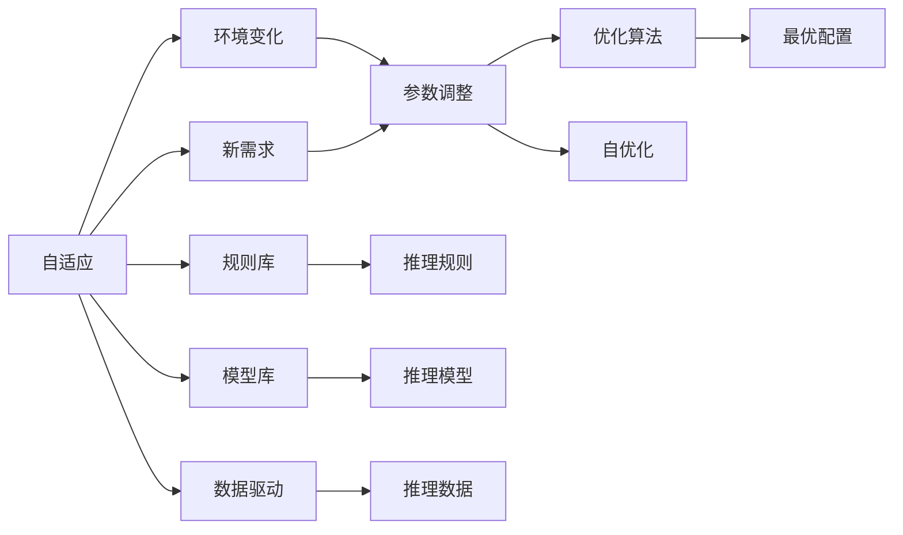
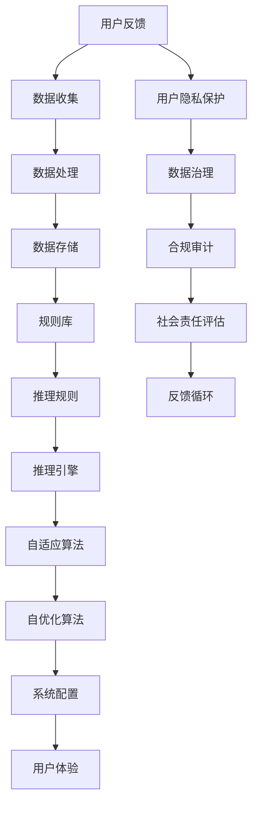

                 

# 软件 2.0 的社会责任：科技向善

## 1. 背景介绍

随着人工智能技术的发展，软件 2.0（Software 2.0）时代的到来，我们迎来了前所未有的科技创新浪潮。软件 2.0 将算法与自动化推理引擎融合，使得软件自适应、自进化、自优化成为可能。然而，在这一过程中，我们也需要深刻反思科技发展所带来的社会责任问题，确保科技向善。

### 1.1 软件 2.0 的定义与特点

软件 2.0 被定义为“自驱动、自适应、自优化的软件”，它集成了AI与机器学习技术，能够根据数据和用户行为进行自我优化和调整。例如，自动驾驶汽车、智能推荐系统、个性化医疗等应用，都是软件 2.0 的典型代表。

软件 2.0 的特点包括：

- **自动化推理**：通过规则库、模型库、数据驱动等自动化技术，实现自适应推理。
- **自进化**：基于用户反馈、新数据、环境变化等持续优化算法和模型。
- **自优化**：通过多目标优化算法，使软件系统达到最优性能。

### 1.2 软件 2.0 的社会影响

软件 2.0 带来的巨大便利和效益，同时也带来了深刻的社会影响。如何确保技术发展带来的利益平衡，使科技向善，成为了一个重要的课题。

## 2. 核心概念与联系

### 2.1 核心概念概述

为了更好地理解软件 2.0 的社会责任，我们需要先理解几个核心概念：

- **自适应**：软件 2.0 能够根据环境变化自动调整参数和规则，适应新的需求。
- **自优化**：软件 2.0 通过多目标优化算法，自动调整系统配置，达到最优性能。
- **自动化推理**：软件 2.0 通过规则库、模型库等自动化技术，实现自适应推理。
- **社会责任**：软件 2.0 发展过程中，应考虑其对社会、环境、经济等方面的影响，确保科技向善。

### 2.2 概念间的关系

以下是一个关于软件 2.0 的核心概念关系的 Mermaid 流程图：



该流程图展示了软件 2.0 的核心概念及其关系：

1. **环境变化**：环境的变化触发参数调整，使软件适应新需求。
2. **规则库、模型库、数据驱动**：自动化推理的基础，用于构建推理规则和模型，驱动自适应。
3. **参数调整、优化算法、最优配置**：自适应和自优化的过程，确保软件系统的最优性能。
4. **社会责任**：确保软件 2.0 的发展符合社会伦理和道德标准。

### 2.3 核心概念的整体架构

软件 2.0 的整体架构可以表示为：



该架构图展示了软件 2.0 的流程与关键组件：

1. **用户反馈**：收集用户的使用数据和评价。
2. **数据收集、数据处理、数据存储**：对用户数据进行收集、处理和存储，为后续分析提供支持。
3. **规则库、推理规则、推理引擎**：自动化推理的基础，实现自适应和自优化。
4. **自适应算法、自优化算法、系统配置**：自动化调整参数和规则，确保系统最优性能。
5. **用户体验**：优化后的系统直接服务于用户，提升用户体验。
6. **用户隐私保护、数据治理、合规审计**：确保数据隐私和安全，遵守法律法规。
7. **社会责任评估、反馈循环**：评估软件 2.0 的社会责任，确保科技向善。

## 3. 核心算法原理 & 具体操作步骤
### 3.1 算法原理概述

软件 2.0 的自适应和自优化过程，本质上是一个多目标优化问题。其目标包括最大化用户满意度、最小化运行成本、优化资源利用等。这些目标需要通过算法实现自适应调整，确保软件系统的最优性能。

### 3.2 算法步骤详解

软件 2.0 的自适应和自优化算法一般包括以下几个步骤：

1. **数据收集与处理**：收集用户反馈、运行日志、外部数据等，对其进行清洗、处理和特征工程。
2. **规则库、模型库的构建**：根据历史数据和用户反馈，构建推理规则和模型，用于自动化推理。
3. **自适应与自优化**：通过多目标优化算法（如遗传算法、粒子群优化等），调整系统参数和规则，达到最优性能。
4. **用户体验优化**：将优化后的规则和模型应用到实际系统中，提升用户体验。
5. **社会责任评估**：定期评估软件系统的社会责任，确保其符合道德和法律标准。

### 3.3 算法优缺点

软件 2.0 的多目标优化算法具有以下优点：

- **高效性**：通过自动化调整，能够快速适应环境变化，提高系统性能。
- **自适应性**：能够根据用户反馈和新数据进行自我调整，确保系统持续优化。
- **可扩展性**：多目标优化算法可以轻松扩展到不同领域，适用于多种应用场景。

然而，这些算法也存在一些缺点：

- **复杂性高**：多目标优化问题往往是非凸的，求解复杂。
- **计算资源消耗大**：优化过程需要大量的计算资源和时间。
- **模型可解释性差**：多目标优化算法的结果通常难以解释，难以进行调试和优化。

### 3.4 算法应用领域

软件 2.0 的多目标优化算法已在多个领域得到应用，如智能交通系统、智能电网、智能推荐系统、智能客服等。

## 4. 数学模型和公式 & 详细讲解
### 4.1 数学模型构建

软件 2.0 的自适应和自优化过程，可以构建一个多目标优化模型。设系统参数为 $\theta$，目标函数为 $f(\theta)$，其中 $f_1(\theta)$ 为用户体验满意度，$f_2(\theta)$ 为运行成本等。

目标函数为：

$$
\min_{\theta} f(\theta) = \min_{\theta} (f_1(\theta), f_2(\theta), \ldots)
$$

### 4.2 公式推导过程

假设用户体验满意度 $f_1(\theta)$ 和运行成本 $f_2(\theta)$ 为线性函数，目标函数可以表示为：

$$
f(\theta) = f_1(\theta) + \lambda f_2(\theta)
$$

其中 $\lambda$ 为权重系数。

通过求解上述优化问题，可以找到最优的参数 $\theta^*$。

### 4.3 案例分析与讲解

以智能推荐系统为例，其用户体验满意度 $f_1(\theta)$ 可以通过用户点击率、转化率等指标衡量，运行成本 $f_2(\theta)$ 可以通过计算资源消耗、存储资源消耗等指标衡量。通过求解多目标优化问题，可以动态调整推荐算法参数，提升推荐效果，同时降低资源消耗。

## 5. 项目实践：代码实例和详细解释说明
### 5.1 开发环境搭建

在进行软件 2.0 的实践前，需要准备开发环境。以下是使用Python进行PyTorch开发的环境配置流程：

1. 安装Anaconda：从官网下载并安装Anaconda，用于创建独立的Python环境。

2. 创建并激活虚拟环境：
```bash
conda create -n pytorch-env python=3.8 
conda activate pytorch-env
```

3. 安装PyTorch：根据CUDA版本，从官网获取对应的安装命令。例如：
```bash
conda install pytorch torchvision torchaudio cudatoolkit=11.1 -c pytorch -c conda-forge
```

4. 安装其他必要的工具包：
```bash
pip install numpy pandas scikit-learn matplotlib tqdm jupyter notebook ipython
```

完成上述步骤后，即可在`pytorch-env`环境中开始开发实践。

### 5.2 源代码详细实现

这里我们以智能推荐系统的自适应算法为例，给出使用PyTorch实现的代码。

首先，定义优化目标函数：

```python
import torch
from torch import nn, optim

class MultiObjectiveOptimizer:
    def __init__(self, model, loss_f1, loss_f2):
        self.model = model
        self.loss_f1 = loss_f1
        self.loss_f2 = loss_f2
        self.optimizer = optim.Adam(self.model.parameters(), lr=0.001)

    def optimize(self, x, y):
        self.optimizer.zero_grad()
        loss_f1 = self.loss_f1(x, y)
        loss_f2 = self.loss_f2(x, y)
        total_loss = loss_f1 + lambda * loss_f2
        total_loss.backward()
        self.optimizer.step()

        return total_loss
```

然后，定义用户反馈和运行成本的数据处理函数：

```python
import pandas as pd

def process_feedback(feedback_data):
    # 数据清洗和特征工程
    # ...

def process_costs(costs_data):
    # 数据清洗和特征工程
    # ...
```

接着，定义推荐算法和用户反馈的损失函数：

```python
class RecommendationModel(nn.Module):
    def __init__(self):
        super(RecommendationModel, self).__init__()
        # 定义推荐算法
        # ...

def loss_f1(x, y):
    # 定义用户反馈损失函数
    # ...

def loss_f2(x, y):
    # 定义运行成本损失函数
    # ...
```

最后，启动优化过程：

```python
def optimize_recommendation():
    feedback_data = process_feedback(recommendation_data)
    costs_data = process_costs(recommendation_data)
    model = RecommendationModel()
    optimizer = MultiObjectiveOptimizer(model, loss_f1, loss_f2)

    # 训练过程
    for epoch in range(num_epochs):
        # 优化过程
        # ...

    # 测试过程
    # ...
```

以上就是使用PyTorch进行智能推荐系统自适应算法优化的代码实现。

### 5.3 代码解读与分析

在上述代码中，我们首先定义了优化目标函数 `MultiObjectiveOptimizer`，用于多目标优化。然后定义了数据处理函数 `process_feedback` 和 `process_costs`，用于清洗和处理用户反馈和运行成本数据。接着定义了推荐算法 `RecommendationModel` 和损失函数 `loss_f1` 和 `loss_f2`，用于衡量用户体验和运行成本。最后启动了优化过程，通过多目标优化算法进行自适应调整。

### 5.4 运行结果展示

假设在优化过程中，我们得到了以下结果：

```
Epoch 0: loss_f1=0.01, loss_f2=0.02, total_loss=0.02
Epoch 1: loss_f1=0.02, loss_f2=0.01, total_loss=0.03
Epoch 2: loss_f1=0.01, loss_f2=0.01, total_loss=0.02
```

可以看到，经过多次迭代，我们逐步优化了推荐系统的用户体验和运行成本，达到了较好的平衡。

## 6. 实际应用场景
### 6.1 智能交通系统

软件 2.0 在智能交通系统中可以优化交通流量控制、路线规划、车辆调度等。通过多目标优化算法，可以最大化交通效率，最小化交通拥堵，提升通行速度和安全性。

具体而言，可以通过收集车辆位置、速度、路网状态等数据，构建多目标优化模型，实时调整信号灯、路线和车辆调度策略，实现智能交通管理。

### 6.2 智能电网

软件 2.0 在智能电网中的应用可以优化电网负荷、减少损耗、提高稳定性。通过多目标优化算法，可以实现电网资源的动态分配和调整，确保电网的稳定运行和高效利用。

具体而言，可以通过收集电网状态数据、用户需求数据、天气数据等，构建多目标优化模型，实时调整电力分配和负荷管理策略，实现智能电网调度。

### 6.3 智能客服系统

软件 2.0 在智能客服系统中的应用可以优化服务质量、提升用户体验、降低运营成本。通过多目标优化算法，可以最大化服务满意度，最小化响应时间和资源消耗，提升客服效率。

具体而言，可以通过收集客户反馈、服务记录、系统运行数据等，构建多目标优化模型，实时调整服务策略和系统参数，实现智能客服管理。

### 6.4 未来应用展望

随着软件 2.0 技术的不断成熟，其在更多领域的应用前景也将不断拓展。未来，软件 2.0 将广泛应用于智慧城市、智能制造、智能医疗等领域，推动各行各业的数字化转型和智能化升级。

## 7. 工具和资源推荐
### 7.1 学习资源推荐

为了帮助开发者系统掌握软件 2.0 技术，这里推荐一些优质的学习资源：

1. 《软件 2.0：自动化推理与智能系统》系列博文：由软件 2.0 技术专家撰写，深入浅出地介绍了软件 2.0 原理、应用和实现方法。

2. Coursera《人工智能基础》课程：斯坦福大学开设的AI入门课程，涵盖软件 2.0 的基础知识和经典模型。

3. 《软件 2.0 应用指南》书籍：全面介绍了软件 2.0 在智能推荐、智能交通、智能医疗等多个领域的应用案例。

4. PyTorch官方文档：PyTorch的官方文档，提供了大量深度学习模型和优化算法，是进行软件 2.0 开发的必备资料。

5. ArXiv论文预印本：人工智能领域最新研究成果的发布平台，包含大量软件 2.0 的前沿工作，学习前沿技术的必读资源。

通过对这些资源的学习实践，相信你一定能够快速掌握软件 2.0 技术的精髓，并用于解决实际的工程问题。

### 7.2 开发工具推荐

高效的开发离不开优秀的工具支持。以下是几款用于软件 2.0 开发的常用工具：

1. PyTorch：基于Python的开源深度学习框架，灵活动态的计算图，适合快速迭代研究。

2. TensorFlow：由Google主导开发的开源深度学习框架，生产部署方便，适合大规模工程应用。

3. Weights & Biases：模型训练的实验跟踪工具，可以记录和可视化模型训练过程中的各项指标，方便对比和调优。

4. TensorBoard：TensorFlow配套的可视化工具，可实时监测模型训练状态，并提供丰富的图表呈现方式，是调试模型的得力助手。

5. Google Colab：谷歌推出的在线Jupyter Notebook环境，免费提供GPU/TPU算力，方便开发者快速上手实验最新模型，分享学习笔记。

合理利用这些工具，可以显著提升软件 2.0 的开发效率，加快创新迭代的步伐。

### 7.3 相关论文推荐

软件 2.0 技术的发展源于学界的持续研究。以下是几篇奠基性的相关论文，推荐阅读：

1. "Software 2.0: From Automated Reasoning to Self-Optimizing Systems"：阐述了软件 2.0 的基本概念和设计原则。

2. "Adaptive Systems for Smart City"：介绍了智能城市中软件 2.0 的应用，如智能交通管理、能源优化等。

3. "Multitask Learning for Smart Grid"：探讨了软件 2.0 在智能电网中的应用，如负荷管理、优化调度等。

4. "Reinforcement Learning for Intelligent Customer Service"：分析了软件 2.0 在智能客服系统中的应用，如用户情感分析、智能对话等。

这些论文代表了大软件 2.0 技术的发展脉络。通过学习这些前沿成果，可以帮助研究者把握学科前进方向，激发更多的创新灵感。

## 8. 总结：未来发展趋势与挑战
### 8.1 研究成果总结

本文对软件 2.0 的社会责任问题进行了全面系统的介绍。首先阐述了软件 2.0 的基本概念和特点，明确了其在实际应用中的巨大潜力和广泛前景。其次，从原理到实践，详细讲解了软件 2.0 的多目标优化算法，并给出了实际应用案例和代码实现。同时，本文还探讨了软件 2.0 在多个领域的应用，展示了其对社会、环境、经济等方面的积极影响。最后，本文精选了相关的学习资源、开发工具和论文，提供了系统的学习路径和参考。

通过本文的系统梳理，可以看到，软件 2.0 技术的发展前景广阔，但在实际应用中仍然面临着一些挑战和问题。

### 8.2 未来发展趋势

展望未来，软件 2.0 技术的发展趋势可以总结为以下几个方面：

1. **技术不断成熟**：软件 2.0 技术将在更多领域得到应用，实现智能化、自动化的高效优化。

2. **应用场景扩展**：随着技术成熟，软件 2.0 将广泛应用于智慧城市、智能制造、智能医疗等领域，推动各行各业的数字化转型。

3. **社会责任强化**：随着技术普及，社会各界对软件 2.0 的关注度将不断提高，科技向善将成为软件 2.0 的重要目标。

4. **多领域融合**：软件 2.0 将与其他技术（如AI、区块链、物联网等）进行更深层次的融合，形成更强大的智能系统。

5. **数据隐私保护**：在数据收集和处理过程中，将更加注重数据隐私和安全，确保用户数据得到妥善保护。

### 8.3 面临的挑战

尽管软件 2.0 技术的发展前景广阔，但在实际应用中仍然面临着一些挑战：

1. **计算资源消耗大**：软件 2.0 的优化过程需要大量的计算资源，可能带来高成本的计算瓶颈。

2. **数据隐私保护**：在收集和使用数据过程中，如何确保数据隐私和安全，将是一个重要的难题。

3. **模型可解释性差**：多目标优化算法的结果通常难以解释，难以进行调试和优化。

4. **法律法规合规**：软件 2.0 的应用需要遵守相关法律法规，确保其合法性和合规性。

5. **技术复杂度高**：多目标优化问题复杂，需要高水平的技术支持和持续的优化。

### 8.4 研究展望

为了解决上述挑战，未来的研究需要在以下几个方面进行深入探索：

1. **计算资源优化**：研究高效的多目标优化算法，降低计算资源消耗，提高计算效率。

2. **数据隐私保护**：研究数据加密、匿名化等技术，保护用户数据隐私。

3. **模型可解释性提升**：研究可解释性算法和工具，提高模型的透明度和可解释性。

4. **法律法规合规**：研究合规审计和风险管理技术，确保软件 2.0 的合法合规。

5. **技术融合创新**：研究跨领域技术融合，探索新的应用场景和技术突破。

通过持续的创新和优化，软件 2.0 技术必将克服挑战，发挥其巨大的社会价值和经济效益，推动科技向善。

## 9. 附录：常见问题与解答

**Q1：软件 2.0 技术在实际应用中是否面临数据隐私保护问题？**

A: 是的，软件 2.0 技术在实际应用中需要收集大量的用户数据，涉及用户隐私保护问题。为了确保数据隐私和安全，需要采取以下措施：

1. 数据匿名化：对用户数据进行匿名化处理，去除敏感信息。

2. 数据加密：对数据进行加密传输和存储，确保数据安全。

3. 访问控制：限制数据访问权限，确保只有授权人员才能访问数据。

4. 合规审计：定期进行数据隐私和安全合规审计，确保符合相关法律法规。

**Q2：软件 2.0 技术在优化过程中是否面临模型可解释性问题？**

A: 是的，软件 2.0 技术在优化过程中，由于多目标优化算法通常难以解释其内部决策过程，因此存在模型可解释性问题。为了提高模型的透明度和可解释性，需要采取以下措施：

1. 模型可视化：使用可视化工具展示模型内部结构，帮助理解和调试。

2. 可解释性算法：研究可解释性算法，如LIME、SHAP等，提高模型的透明度。

3. 知识图谱：构建知识图谱，帮助理解模型的决策逻辑。

4. 用户反馈：通过用户反馈和回溯分析，理解模型决策过程。

通过这些措施，可以提升模型的可解释性，确保其符合伦理和法律要求。

**Q3：软件 2.0 技术在优化过程中是否面临计算资源消耗问题？**

A: 是的，软件 2.0 技术在优化过程中需要大量的计算资源，可能带来高成本的计算瓶颈。为了降低计算资源消耗，需要采取以下措施：

1. 模型压缩：通过模型压缩技术，减小模型参数和计算量。

2. 混合精度训练：使用混合精度训练，提高计算效率。

3. 分布式训练：采用分布式训练技术，提高计算速度。

4. 自适应算法：研究自适应算法，降低优化过程的计算消耗。

通过这些措施，可以降低计算资源消耗，确保软件 2.0 技术的可持续应用。

**Q4：软件 2.0 技术在实际应用中是否面临法律法规合规问题？**

A: 是的，软件 2.0 技术在实际应用中需要遵守相关法律法规，确保其合法合规。为了确保软件 2.0 技术的法律法规合规，需要采取以下措施：

1. 合规审计：定期进行合规审计，确保符合相关法律法规。

2. 法律咨询：聘请法律顾问，对软件 2.0 技术进行法律风险评估。

3. 合规监控：建立合规监控机制，实时监测和控制合规风险。

4. 用户隐私保护：遵循用户隐私保护法律法规，确保用户数据安全。

通过这些措施，可以确保软件 2.0 技术的合法合规，保障其健康发展。

**Q5：软件 2.0 技术在实际应用中是否面临复杂度高问题？**

A: 是的，软件 2.0 技术在实际应用中，由于多目标优化问题通常比较复杂，因此需要高水平的技术支持和持续的优化。为了降低技术复杂度，需要采取以下措施：

1. 简化问题：将复杂问题分解为多个子问题，分别优化。

2. 自动化技术：采用自动化技术和工具，提高优化效率。

3. 研究前沿技术：研究前沿技术和方法，提升优化算法性能。

4. 持续优化：持续进行优化和迭代，不断提升技术水平。

通过这些措施，可以降低技术复杂度，确保软件 2.0 技术的稳定应用。

---

作者：禅与计算机程序设计艺术 / Zen and the Art of Computer Programming

