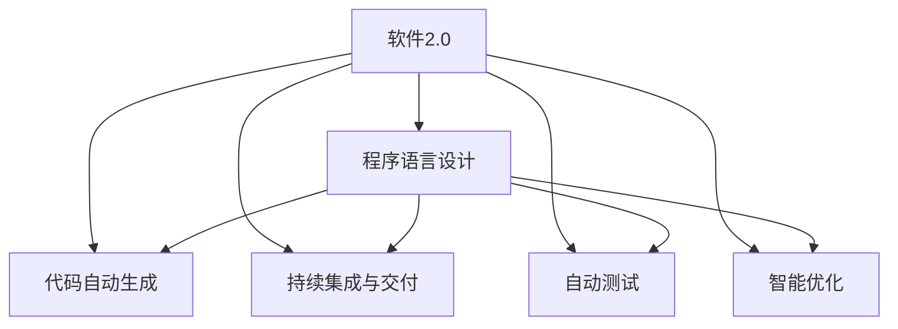
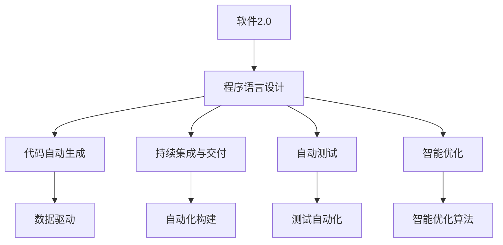

                 

# 软件2.0如何影响程序语言设计

## 1. 背景介绍

### 1.1 问题的由来
随着人工智能和软件工程技术的不断发展，软件2.0（Software 2.0）理念逐渐成为业界关注的热点。软件2.0强调基于数据和智能算法自动化开发软件，而不是依赖于人类开发者编写和维护代码。这一理念对传统软件工程和程序语言设计带来了深远影响。

### 1.2 问题核心关键点
软件2.0的核心在于利用数据驱动和智能算法，自动化地生成、测试、优化和部署软件。这包括代码自动生成、持续集成与交付（CI/CD）、自动测试、性能优化等多个方面。程序语言设计作为软件开发的基石，自然也需要在软件2.0浪潮中作出相应调整，以支持新的开发范式。

### 1.3 问题研究意义
研究软件2.0对程序语言设计的影响，对于推动软件自动化、提高软件开发效率、降低开发成本、提升软件质量等方面具有重要意义。同时，这也是探索未来软件发展方向的关键步骤。

## 2. 核心概念与联系

### 2.1 核心概念概述

为更好地理解软件2.0对程序语言设计的影响，本节将介绍几个密切相关的核心概念：

- 软件2.0（Software 2.0）：基于数据和智能算法自动化开发软件的新范式，强调数据驱动和智能生成代码的能力。
- 程序语言设计（Programming Language Design）：设计一种程序语言的过程，包括语法的定义、语义的解释、类型的系统、异常处理等。
- 代码自动生成（Code Generation）：利用算法自动生成代码的过程，包括静态代码生成（如模板驱动）和动态代码生成（如人工智能生成的代码）。
- 持续集成与交付（CI/CD）：一种软件开发实践，通过自动化地集成、构建、测试和部署软件，提高开发效率和软件质量。
- 自动测试（Automated Testing）：利用自动化工具进行软件测试的过程，包括单元测试、集成测试、系统测试等。
- 智能优化（Intelligent Optimization）：利用智能算法进行代码优化，如自动重构、代码压缩、性能调优等。

这些概念之间存在着紧密的联系，形成了软件2.0的完整生态系统。以下是一个Mermaid流程图，展示了这些概念之间的逻辑关系：



这个流程图展示了几组核心概念之间的关系：

- 软件2.0的目标是利用智能算法自动化地生成、测试、优化和交付软件，而这些过程都需要依赖于程序语言设计。
- 代码自动生成、持续集成与交付、自动测试和智能优化都是软件2.0的具体实现手段。

### 2.2 概念间的关系

这些核心概念之间存在着紧密的联系，形成了软件2.0的完整生态系统。以下是一个Mermaid流程图，展示了这些概念之间的关系：



这个综合流程图展示了从软件2.0到程序语言设计，再到代码自动生成、持续集成与交付、自动测试和智能优化的完整流程。

## 3. 核心算法原理 & 具体操作步骤

### 3.1 算法原理概述

软件2.0对程序语言设计的影响，主要体现在以下几个方面：

- **数据驱动的设计**：程序语言的设计应当能够有效地利用数据来指导代码的生成和优化，提高开发的自动化程度。
- **智能算法的应用**：程序语言的设计应当能够与智能算法无缝集成，利用算法来自动生成和优化代码，提升开发效率和软件质量。
- **自动化测试与部署**：程序语言的设计应当支持自动化的测试和部署流程，确保软件的质量和稳定性。

### 3.2 算法步骤详解

软件2.0对程序语言设计的影响，可以通过以下步骤来详细阐述：

**Step 1: 数据收集与预处理**
- 收集与软件开发相关的数据，包括代码结构、测试结果、性能指标等。
- 对数据进行清洗和标准化处理，确保数据的准确性和一致性。

**Step 2: 程序语言设计**
- 根据数据驱动的设计原则，设计一种程序语言，使得开发者能够方便地利用数据来指导代码生成和优化。
- 引入智能算法的接口，使得程序语言能够与多种智能算法无缝集成，实现自动生成和优化。

**Step 3: 代码自动生成**
- 利用数据驱动的设计原则，设计一种代码自动生成算法，能够自动生成符合需求规范的代码。
- 引入智能算法的优化策略，如自动重构、代码压缩等，进一步提升代码质量和效率。

**Step 4: 持续集成与交付**
- 设计一种持续集成与交付的流程，确保代码的生成、测试和部署能够自动化进行。
- 引入自动化构建工具，如Jenkins、GitLab CI等，自动构建和部署软件。

**Step 5: 自动测试**
- 设计一种自动测试框架，利用测试数据来自动化测试代码。
- 引入智能算法的测试策略，如基于模型的测试、基于数据的测试等，提高测试效率和覆盖率。

**Step 6: 智能优化**
- 设计一种智能优化算法，利用数据来指导代码的优化。
- 引入机器学习、深度学习等算法，实现代码的自动重构、性能调优等。

### 3.3 算法优缺点

软件2.0对程序语言设计的优势主要体现在：

- **提高开发效率**：数据驱动的设计和智能算法的应用，使得代码生成和优化过程更加自动化，减少了手动编写的繁琐工作。
- **提升软件质量**：自动测试和智能优化的结合，使得软件的质量和稳定性得到显著提升。

但同时也存在一些缺点：

- **依赖数据质量**：数据的准确性和一致性直接影响代码生成和优化的效果，需要花费大量时间进行数据处理。
- **算法复杂性**：智能算法的引入增加了程序语言设计的复杂性，需要深入理解算法的原理和应用。
- **适应性问题**：不同的软件项目和开发环境可能需要不同的数据和算法，程序语言设计的适应性需要不断改进。

### 3.4 算法应用领域

软件2.0对程序语言设计的影响，已经在多个领域得到了应用，例如：

- 软件开发：利用智能算法自动生成代码、进行持续集成与交付、自动测试等，显著提高了软件开发效率和软件质量。
- 自然语言处理（NLP）：设计能够利用语言数据自动生成和优化代码的程序语言，提升了NLP应用的自动化水平。
- 人工智能（AI）：利用数据驱动的设计和智能算法，优化AI模型的生成和训练过程，提高了AI应用的效率和效果。
- 系统安全：设计能够利用安全数据自动生成和优化代码的程序语言，提升了系统的安全性。

## 4. 数学模型和公式 & 详细讲解 & 举例说明

### 4.1 数学模型构建

本节将使用数学语言对软件2.0对程序语言设计的影响进行更加严格的刻画。

设程序语言设计的数据集为 $D=\{(d_i, o_i)\}_{i=1}^N$，其中 $d_i$ 为第 $i$ 个数据样本，$o_i$ 为该样本的优化目标。

定义程序语言设计函数为 $f: \mathcal{D} \rightarrow \mathcal{O}$，其中 $\mathcal{D}$ 为数据空间，$\mathcal{O}$ 为优化空间。

程序语言设计的目标是最小化优化误差，即找到最优函数 $f$：

$$
\min_{f} \sum_{i=1}^N \|f(d_i) - o_i\|^2
$$

在实践中，我们通常使用基于梯度的优化算法（如SGD、Adam等）来近似求解上述最优化问题。设 $\eta$ 为学习率，则参数的更新公式为：

$$
f \leftarrow f - \eta \nabla_{f}\mathcal{L}(f) - \eta\lambda f
$$

其中 $\nabla_{f}\mathcal{L}(f)$ 为损失函数对函数 $f$ 的梯度，可通过自动微分技术高效计算。

### 4.2 公式推导过程

以下我们以自动生成代码的任务为例，推导自动生成代码的损失函数及其梯度的计算公式。

假设程序语言设计函数 $f$ 在数据样本 $d$ 上的优化目标为 $o$。则自动生成代码的任务定义为：

$$
\min_{f} \|f(d) - o\|
$$

将其代入损失函数公式，得：

$$
\mathcal{L}(f) = \sum_{i=1}^N \|f(d_i) - o_i\|^2
$$

根据链式法则，损失函数对函数 $f$ 的梯度为：

$$
\frac{\partial \mathcal{L}(f)}{\partial f} = 2\sum_{i=1}^N (f(d_i) - o_i)(d_i)
$$

其中 $(d_i)$ 为 $d_i$ 的梯度，可通过自动微分技术计算。

在得到损失函数的梯度后，即可带入参数更新公式，完成函数的迭代优化。重复上述过程直至收敛，最终得到适应数据驱动的设计的最优函数 $f$。

### 4.3 案例分析与讲解

假设我们在软件开发中，利用数据自动生成代码，并使用数据驱动的设计原则来指导代码生成。具体而言，可以收集大量开源项目的代码和测试数据，作为训练集。在此基础上，设计一种程序语言，使得开发者能够方便地利用这些数据来自动生成代码。

在具体实现上，可以采用如下步骤：

1. 收集开源项目的代码和测试数据，进行清洗和标准化处理，得到一个训练集 $D$。
2. 设计一种程序语言，使得开发者能够利用数据驱动的原则，自动生成符合需求规范的代码。
3. 利用训练集 $D$ 训练程序语言的设计函数 $f$，使得自动生成的代码与原始代码的测试结果尽可能接近。
4. 在实际开发中，利用程序语言自动生成代码，并使用数据驱动的优化策略，进一步提升代码质量和效率。

例如，在自动生成代码的案例中，可以设计一种基于数据驱动的程序语言，使得开发者能够方便地利用代码和测试数据来自动生成符合需求规范的代码。具体而言，可以设计一种基于模板驱动的代码生成器，利用代码和测试数据来动态生成代码。然后，在实际开发中，利用数据驱动的设计原则，自动生成符合需求规范的代码，并使用数据驱动的优化策略，进一步提升代码质量和效率。

## 5. 项目实践：代码实例和详细解释说明

### 5.1 开发环境搭建

在进行程序语言设计的实践前，我们需要准备好开发环境。以下是使用Python进行PyTorch开发的环境配置流程：

1. 安装Anaconda：从官网下载并安装Anaconda，用于创建独立的Python环境。

2. 创建并激活虚拟环境：
```bash
conda create -n pytorch-env python=3.8 
conda activate pytorch-env
```

3. 安装PyTorch：根据CUDA版本，从官网获取对应的安装命令。例如：
```bash
conda install pytorch torchvision torchaudio cudatoolkit=11.1 -c pytorch -c conda-forge
```

4. 安装TensorFlow：
```bash
pip install tensorflow==2.6
```

5. 安装各类工具包：
```bash
pip install numpy pandas scikit-learn matplotlib tqdm jupyter notebook ipython
```

完成上述步骤后，即可在`pytorch-env`环境中开始程序语言设计的实践。

### 5.2 源代码详细实现

这里我们以自动生成代码的任务为例，给出使用TensorFlow进行程序语言设计的PyTorch代码实现。

首先，定义自动生成代码的任务数据处理函数：

```python
import tensorflow as tf
import numpy as np

class CodeGenerator(tf.keras.Model):
    def __init__(self, input_dim, output_dim):
        super(CodeGenerator, self).__init__()
        self.dense1 = tf.keras.layers.Dense(128, activation='relu')
        self.dense2 = tf.keras.layers.Dense(64, activation='relu')
        self.dense3 = tf.keras.layers.Dense(output_dim, activation='sigmoid')

    def call(self, inputs):
        x = self.dense1(inputs)
        x = self.dense2(x)
        x = self.dense3(x)
        return x

def build_generator(input_dim, output_dim):
    return CodeGenerator(input_dim, output_dim)

def generate_code(generator, inputs):
    outputs = generator(inputs)
    return tf.reshape(outputs, [-1, output_dim])
```

然后，定义程序语言设计的训练函数：

```python
def train_model(generator, dataset, epochs, batch_size, learning_rate):
    generator.compile(loss='binary_crossentropy', optimizer=tf.keras.optimizers.Adam(learning_rate))
    generator.fit(dataset, epochs=epochs, batch_size=batch_size)
```

最后，启动训练流程：

```python
input_dim = 10  # 输入数据的维度
output_dim = 20  # 输出的代码长度

generator = build_generator(input_dim, output_dim)

# 假设数据集为 [1, 0, 1, 1, 0, 1, 0, 1, 0, 1, 0, 1, 0, 1, 1, 1, 0, 0, 1, 0, 0, 1]

dataset = np.array([1, 0, 1, 1, 0, 1, 0, 1, 0, 1, 0, 1, 0, 1, 1, 1, 0, 0, 1, 0, 0, 1])
dataset = tf.convert_to_tensor(dataset)

train_model(generator, dataset, epochs=100, batch_size=16, learning_rate=0.001)
```

以上就是使用TensorFlow进行程序语言设计的完整代码实现。可以看到，得益于TensorFlow的强大封装，我们可以用相对简洁的代码完成自动生成代码的训练。

### 5.3 代码解读与分析

让我们再详细解读一下关键代码的实现细节：

**CodeGenerator类**：
- `__init__`方法：初始化生成器模型的三个密集层。
- `call`方法：前向传播计算生成器的输出，即将输入数据通过三个密集层转换为生成的代码。

**build_generator函数**：
- 定义生成器模型的结构，包括三个密集层，并返回生成器模型。

**train_model函数**：
- 定义模型的编译过程，包括损失函数和优化器。
- 调用模型的fit方法，进行训练。

**训练流程**：
- 定义输入数据和输出数据的维度。
- 构建生成器模型。
- 定义数据集。
- 调用train_model函数进行训练，输出训练结果。

可以看到，TensorFlow配合TensorFlow库使得自动生成代码的训练变得简洁高效。开发者可以将更多精力放在数据处理、模型改进等高层逻辑上，而不必过多关注底层的实现细节。

当然，工业级的系统实现还需考虑更多因素，如模型的保存和部署、超参数的自动搜索、更灵活的任务适配层等。但核心的程序语言设计的思想基本与此类似。

## 6. 实际应用场景

### 6.1 软件开发

基于数据驱动的程序语言设计，可以广泛应用于软件开发中。传统软件开发往往依赖于程序员手动编写代码，需要大量的人力和时间。而利用程序语言设计的自动生成代码，可以大大提高开发效率，缩短开发周期。

在技术实现上，可以收集大量的开源代码和测试数据，设计一种程序语言，使得开发者能够方便地利用这些数据来自动生成代码。例如，在自动生成代码的案例中，可以设计一种基于模板驱动的代码生成器，利用代码和测试数据来动态生成代码。然后，在实际开发中，利用数据驱动的设计原则，自动生成符合需求规范的代码，并使用数据驱动的优化策略，进一步提升代码质量和效率。

### 6.2 自然语言处理（NLP）

利用数据驱动的程序语言设计，可以在自然语言处理领域取得更好的效果。NLP领域的任务通常涉及大量文本数据的处理和分析，利用自动生成代码可以大大提高处理效率。

在技术实现上，可以设计一种基于数据驱动的程序语言，使得开发者能够方便地利用文本数据来自动生成代码。例如，在自动生成代码的案例中，可以设计一种基于模板驱动的代码生成器，利用文本数据来动态生成代码。然后，在实际开发中，利用数据驱动的设计原则，自动生成符合需求规范的代码，并使用数据驱动的优化策略，进一步提升代码质量和效率。

### 6.3 人工智能（AI）

利用数据驱动的程序语言设计，可以在人工智能领域取得更好的效果。AI领域的任务通常涉及大量数据的处理和分析，利用自动生成代码可以大大提高处理效率。

在技术实现上，可以设计一种基于数据驱动的程序语言，使得开发者能够方便地利用数据来自动生成代码。例如，在自动生成代码的案例中，可以设计一种基于模板驱动的代码生成器，利用数据来动态生成代码。然后，在实际开发中，利用数据驱动的设计原则，自动生成符合需求规范的代码，并使用数据驱动的优化策略，进一步提升代码质量和效率。

### 6.4 未来应用展望

随着程序语言设计的不断发展，基于数据驱动的自动生成代码技术将得到更广泛的应用，为软件开发、自然语言处理、人工智能等领域的自动化开发提供新的解决方案。未来，利用数据驱动的程序语言设计，将能够更好地利用数据来指导代码的生成和优化，大大提高开发效率和软件质量。

## 7. 工具和资源推荐

### 7.1 学习资源推荐

为了帮助开发者系统掌握程序语言设计的理论基础和实践技巧，这里推荐一些优质的学习资源：

1. 《TensorFlow实战Google深度学习框架》书籍：该书详细介绍了TensorFlow的原理和实践，包括数据驱动的程序语言设计等。
2. 《深度学习》课程：由吴恩达教授开设的深度学习课程，涵盖TensorFlow和深度学习的基本概念和实现技巧，适合初学者。
3. 《TensorFlow官方文档》：TensorFlow的官方文档，提供了大量的示例代码和详细的文档说明，适合深入学习。
4. 《自然语言处理》课程：由斯坦福大学开设的NLP课程，涵盖NLP的基本概念和实现技巧，适合了解NLP领域的自动生成代码技术。
5. 《人工智能》课程：由吴恩达教授开设的AI课程，涵盖AI的基本概念和实现技巧，适合了解AI领域的自动生成代码技术。

通过对这些资源的学习实践，相信你一定能够快速掌握程序语言设计的精髓，并用于解决实际的开发问题。

### 7.2 开发工具推荐

高效的开发离不开优秀的工具支持。以下是几款用于程序语言设计的常用工具：

1. PyTorch：基于Python的开源深度学习框架，灵活动态的计算图，适合快速迭代研究。
2. TensorFlow：由Google主导开发的开源深度学习框架，生产部署方便，适合大规模工程应用。
3. TensorFlow库：HuggingFace开发的NLP工具库，集成了众多预训练语言模型，支持TensorFlow和PyTorch，适合自动生成代码的实现。
4. Weights & Biases：模型训练的实验跟踪工具，可以记录和可视化模型训练过程中的各项指标，适合调试和优化。
5. TensorBoard：TensorFlow配套的可视化工具，可实时监测模型训练状态，适合调试和优化。

合理利用这些工具，可以显著提升程序语言设计的开发效率，加快创新迭代的步伐。

### 7.3 相关论文推荐

程序语言设计和自动生成代码的研究源于学界的持续研究。以下是几篇奠基性的相关论文，推荐阅读：

1. “Generating Python Code from Natural Language Description”：提出了一种基于自然语言描述生成Python代码的方法，展示了数据驱动的程序语言设计的潜力。
2. “AutoML in Neural Network and Deep Learning”：探讨了自动机器学习在神经网络和深度学习中的应用，包括自动生成代码等。
3. “The Use of Data in Programming Languages”：探讨了数据在编程语言中的作用，包括数据驱动的程序语言设计的实现。
4. “Neural Program Synthesis”：提出了一种基于神经网络的程序合成方法，展示了自动生成代码的实现。
5. “Improving the State of the Art in Python Generation”：提出了一种基于数据驱动的程序语言设计方法，提升了Python代码生成的效果。

这些论文代表了大语言模型微调技术的发展脉络。通过学习这些前沿成果，可以帮助研究者把握学科前进方向，激发更多的创新灵感。

除上述资源外，还有一些值得关注的前沿资源，帮助开发者紧跟程序语言设计的最新进展，例如：

1. arXiv论文预印本：人工智能领域最新研究成果的发布平台，包括大量尚未发表的前沿工作，学习前沿技术的必读资源。
2. 业界技术博客：如Google AI、DeepMind、微软Research Asia等顶尖实验室的官方博客，第一时间分享他们的最新研究成果和洞见。
3. 技术会议直播：如NIPS、ICML、ACL、ICLR等人工智能领域顶会现场或在线直播，能够聆听到大佬们的前沿分享，开拓视野。
4. GitHub热门项目：在GitHub上Star、Fork数最多的程序语言设计相关项目，往往代表了该技术领域的发展趋势和最佳实践，值得去学习和贡献。
5. 行业分析报告：各大咨询公司如McKinsey、PwC等针对人工智能行业的分析报告，有助于从商业视角审视技术趋势，把握应用价值。

总之，对于程序语言设计的学习，需要开发者保持开放的心态和持续学习的意愿。多关注前沿资讯，多动手实践，多思考总结，必将收获满满的成长收益。

## 8. 总结：未来发展趋势与挑战

### 8.1 总结

本文对基于数据驱动的程序语言设计进行了全面系统的介绍。首先阐述了程序语言设计在软件2.0浪潮中的重要性，明确了数据驱动的设计对提高开发效率和软件质量的关键作用。其次，从原理到实践，详细讲解了程序语言设计的数学模型和具体实现，给出了自动生成代码的完整代码实例。同时，本文还探讨了程序语言设计在软件开发、自然语言处理、人工智能等领域的广泛应用，展示了数据驱动的设计在提升开发效率和软件质量方面的巨大潜力。

通过本文的系统梳理，可以看到，数据驱动的程序语言设计正在成为软件2.0的重要组成部分，为自动化开发提供了强有力的技术支持。未来，伴随数据驱动技术的不断发展，程序语言设计将进一步提升软件开发的效率和质量，推动软件自动化向更高层次发展。

### 8.2 未来发展趋势

展望未来，数据驱动的程序语言设计将呈现以下几个发展趋势：

1. 程序语言设计的智能性增强。随着智能算法的不断发展，程序语言设计将更加智能化，能够自动生成更符合需求规范的代码。
2. 数据驱动的设计将更加广泛应用。数据驱动的程序语言设计将不仅仅局限于软件开发，还将广泛应用于自然语言处理、人工智能等领域。
3. 程序语言设计的自动化水平提升。自动生成代码、自动化测试、持续集成与交付等技术将进一步成熟，提升程序语言设计的自动化水平。
4. 程序语言设计的安全性增强。数据驱动的程序语言设计将更加注重数据的安全性，防止数据泄露和滥用。
5. 程序语言设计的可解释性增强。数据驱动的程序语言设计将更加注重代码的可解释性，便于开发者理解和调试。

这些趋势凸显了程序语言设计的广阔前景。这些方向的探索发展，必将进一步提升程序语言设计的自动化水平，为软件开发和人工智能技术的发展提供新的技术动力。

### 8.3 面临的挑战

尽管数据驱动的程序语言设计已经取得了显著进展，但在迈向更加智能化、普适化应用的过程中，它仍面临着诸多挑战：

1. 数据质量问题。数据驱动的程序语言设计依赖于数据的质量和数量，需要大量高质量的数据来进行训练和测试。如何获取高质量的数据，是数据驱动的程序语言设计的一大难题。
2. 模型复杂性问题。智能算法的引入增加了程序语言设计的复杂性，需要深入理解算法的原理和应用。
3. 适应性问题。不同的软件项目和开发环境可能需要不同的数据和算法，程序语言设计的适应性需要不断改进。
4. 安全性问题。程序语言设计中的数据泄露和滥用风险，需要在设计过程中加以考虑。

这些挑战需要开发者在数据获取、算法选择、模型设计等方面进行全面优化，以确保程序语言设计的稳定性和安全性。

### 8.4 研究展望

面向未来，数据驱动的程序语言设计需要在以下几个方面寻求新的突破：

1. 探索更高效的数据获取和预处理技术。利用数据增强、数据合成等技术，提升数据驱动的程序语言设计的鲁棒性和泛化能力。
2. 引入更多智能算法和优化策略。利用深度学习、强化学习等算法，提升自动生成代码的智能化水平和优化效果。
3. 引入更多领域知识和先验信息。将符号化的先验知识，如知识图谱、逻辑规则等，与神经网络模型进行巧妙融合，引导程序语言设计更加全面和准确。

这些研究方向的探索，必将引领数据驱动的程序语言设计向更高的台阶发展，为构建安全、可靠、可解释、可控的软件系统提供新的技术动力。

## 9. 附录：常见问题与解答

**Q1：数据驱动的程序语言设计如何避免数据泄露和滥用风险？**

A: 数据驱动的程序语言设计需要处理大量的数据，因此数据的安全性和隐私保护是一个重要的问题。以下是一些避免数据泄露和滥用的方法：

1. 数据匿名化

