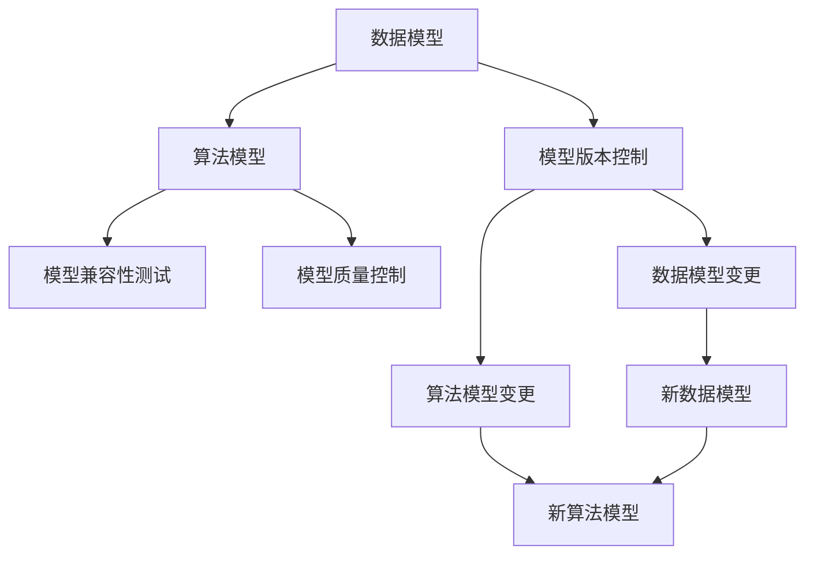
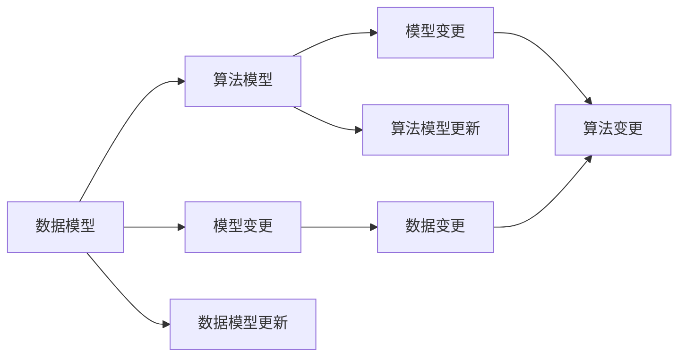
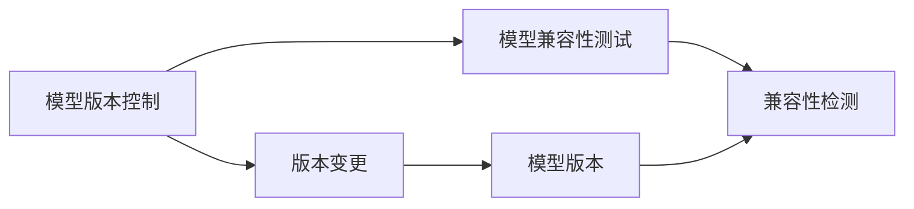
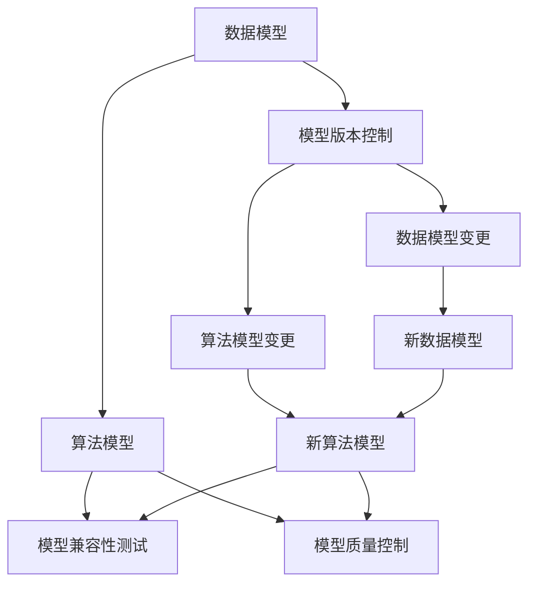

                 

# 软件2.0的变更管理策略

## 1. 背景介绍

软件2.0时代，即以人工智能、大数据、云计算、区块链为代表的智能软件时代，标志着软件产业进入了全新的发展阶段。伴随新技术的应用，软件开发生命周期、组织管理方式、人员技能要求等方面都发生了显著变化。在这种背景下，传统的变更管理策略已难以适应新需求，亟需进行改革和升级。

### 1.1 问题由来
传统软件开发通常采用瀑布模型、敏捷开发等以代码为中心的开发方法，注重需求分析、架构设计、代码实现等环节的严格管理和控制。但随着AI、大数据、云计算等技术的发展，软件开发变得更加灵活、迭代、动态化。

在软件2.0时代，数据和模型成为软件开发的中心，而非代码本身。大量新算法、新模型不断涌现，对软件变更管理提出了新的要求。如何有效管理模型变更，确保新模型与旧模型之间的兼容性和可靠性，成为软件2.0时代的重要挑战。

### 1.2 问题核心关键点
软件2.0的变更管理策略主要围绕模型变更展开。相较于代码变更，模型变更具有更高的复杂度和风险。其核心关键点包括：

- 数据模型与算法模型的变更管理：数据模型的修改、算法模型的更新、模型参数的调整等。
- 模型版本的控制：如何有效地控制和管理不同版本的模型，确保模型演进的顺序性。
- 模型兼容性测试：如何在不同模型间进行兼容性测试，避免因模型变更导致的服务中断。
- 模型质量控制：如何对新模型进行评估和验证，确保其性能和效果。

## 2. 核心概念与联系

### 2.1 核心概念概述

为更好地理解软件2.0的变更管理策略，本节将介绍几个密切相关的核心概念：

- 数据模型(Data Model)：用于描述数据的逻辑结构和存储方式，如关系型数据库、图数据库、文档数据库等。数据模型对软件系统功能和性能有着重要影响。

- 算法模型(Algorithm Model)：用于描述算法的结构、参数和行为，如线性回归、神经网络、强化学习等。算法模型是软件系统的核心，直接决定系统功能和效果。

- 模型版本控制(Model Version Control)：用于管理不同版本的算法模型和数据模型，确保模型演进的顺序性。常见的版本控制系统包括Git、SVN等。

- 模型兼容性测试(Model Compatibility Testing)：用于检测不同模型之间的兼容性，避免因模型变更导致的服务中断。

- 模型质量控制(Model Quality Control)：用于评估和验证新模型的性能和效果，确保其符合预期要求。

这些核心概念之间的逻辑关系可以通过以下Mermaid流程图来展示：



这个流程图展示了大语言模型的核心概念及其之间的关系：

1. 数据模型通过描述数据的逻辑结构和存储方式，与算法模型相互作用，共同影响软件系统的功能和性能。
2. 模型版本控制用于管理不同版本的算法模型和数据模型，确保模型演进的顺序性。
3. 模型兼容性测试用于检测不同模型之间的兼容性，避免因模型变更导致的服务中断。
4. 模型质量控制用于评估和验证新模型的性能和效果，确保其符合预期要求。

这些核心概念共同构成了软件2.0变更管理的完整生态系统，使其能够有效地管理模型变更，提升软件系统的性能和稳定性。通过理解这些核心概念，我们可以更好地把握软件2.0变更管理的策略和方向。

### 2.2 概念间的关系

这些核心概念之间存在着紧密的联系，形成了软件2.0变更管理的完整生态系统。下面我通过几个Mermaid流程图来展示这些概念之间的关系。

#### 2.2.1 数据模型与算法模型的关系



这个流程图展示了数据模型和算法模型之间的相互作用。数据模型的变化会影响算法模型，反之亦然。模型变更可能是数据模型的更新，也可能是算法模型的更新。

#### 2.2.2 模型版本控制与模型兼容性测试的关系



这个流程图展示了模型版本控制和模型兼容性测试之间的相互作用。模型版本控制用于管理模型版本，而模型兼容性测试用于检测不同版本之间的兼容性。

#### 2.2.3 模型质量控制与模型兼容性测试的关系


这个流程图展示了模型质量控制和模型兼容性测试之间的相互作用。模型质量控制用于评估新模型的性能和效果，而模型兼容性测试用于检测不同模型之间的兼容性。

### 2.3 核心概念的整体架构

最后，我们用一个综合的流程图来展示这些核心概念在大语言模型变更过程中的整体架构：



这个综合流程图展示了从预训练到变更管理的完整过程。数据模型和算法模型通过预训练获得基础能力。模型变更可能是数据模型的更新，也可能是算法模型的更新。在此基础上，通过模型版本控制、模型兼容性测试和模型质量控制，对模型进行有效管理。

## 3. 核心算法原理 & 具体操作步骤
### 3.1 算法原理概述

软件2.0的变更管理策略主要基于模型变更展开。其核心思想是：将软件变更管理过程看作是模型变更的连续过程，通过有效的版本控制、兼容性测试和质量控制，确保模型演进的顺序性、可靠性和正确性。

形式化地，假设当前模型版本为 $M_v$，新模型版本为 $M_{v+1}$，则模型变更的过程可以表示为：

$$
M_{v+1}=f(M_v)
$$

其中，$f$ 为模型变更函数，可以是模型参数的调整、算法结构的修改等。

模型变更后，需要进行兼容性测试和质量评估，以确保新模型能够正常运行，并且满足性能和效果要求。如果新模型与旧模型不兼容，需要进行回退操作，或重新进行兼容性测试。

### 3.2 算法步骤详解

软件2.0的变更管理策略主要包括以下几个关键步骤：

**Step 1: 确定变更需求**
- 收集变更请求，包括模型参数调整、算法结构修改等。
- 分析变更需求的影响范围和优先级。

**Step 2: 准备变更版本**
- 将当前模型版本 $M_v$ 作为基线版本，保留备份以防回退。
- 设计新模型版本 $M_{v+1}$ 的结构和参数。

**Step 3: 执行变更操作**
- 应用模型变更函数 $f$ 对模型进行变更操作。
- 进行兼容性测试，确保新模型与旧模型兼容。

**Step 4: 执行兼容性测试**
- 在新旧模型间进行兼容性测试，检测数据、算法、接口等兼容性。
- 如果兼容性测试通过，进行质量控制。
- 如果兼容性测试不通过，进行回退操作或重新变更。

**Step 5: 执行质量控制**
- 在新模型上执行质量控制，评估模型的性能和效果。
- 根据评估结果进行必要的调整和优化。
- 如果模型质量不合格，进行回退操作或重新变更。

**Step 6: 发布新模型版本**
- 发布新模型版本 $M_{v+1}$，记录变更日志。
- 通知相关团队和用户，确保变更成功实施。

**Step 7: 后续监控和维护**
- 对新模型版本进行持续监控，及时发现和解决问题。
- 定期进行模型评估和优化，确保模型性能和效果。

以上是软件2.0变更管理的一般流程。在实际应用中，还需要根据具体任务的特点，对各个环节进行优化设计和调整。

### 3.3 算法优缺点

软件2.0的变更管理策略具有以下优点：

- 灵活性高。通过模型变更函数，可以对模型进行灵活调整，适应不断变化的需求。
- 自动化程度高。借助工具和技术手段，如自动化测试、自动部署等，可以实现模型的自动化变更和发布。
- 风险控制能力强。通过兼容性测试和质量控制，能够有效控制模型变更的风险，减少服务中断的概率。

但该方法也存在一些局限性：

- 对技术要求高。需要具备丰富的模型变更和质量控制经验，对团队成员的技术能力有较高要求。
- 测试和验证成本高。需要进行详细的兼容性测试和质量评估，特别是对于大规模模型，成本较高。
- 模型兼容性难以保证。特别是在模型结构复杂、参数量大的情况下，模型的兼容性测试难度较大。

尽管存在这些局限性，但就目前而言，软件2.0的变更管理策略仍是最主流的方法。未来相关研究的重点在于如何进一步降低变更管理的成本，提高模型的自动化程度，同时兼顾模型的可解释性和伦理安全性等因素。

### 3.4 算法应用领域

软件2.0的变更管理策略在NLP、计算机视觉、自然语言生成等众多领域得到了广泛应用。例如：

- NLP领域：基于GPT、BERT等预训练模型，对语言模型进行微调，以满足不同下游任务的需求。
- 计算机视觉领域：通过Faster R-CNN、YOLO等算法模型，进行目标检测和图像分类等任务。
- 自然语言生成领域：使用RNN、Transformer等模型进行文本生成、摘要生成等任务。

这些领域中，模型变更管理都是一项重要的工作。通过有效的变更管理策略，可以确保模型演进的顺序性、可靠性和正确性，提升系统性能和稳定性。

## 4. 数学模型和公式 & 详细讲解 & 举例说明

### 4.1 数学模型构建

本节将使用数学语言对软件2.0变更管理过程进行更加严格的刻画。

记当前模型版本为 $M_v$，新模型版本为 $M_{v+1}$，则模型变更的过程可以表示为：

$$
M_{v+1}=f(M_v)
$$

其中，$f$ 为模型变更函数，可以是模型参数的调整、算法结构的修改等。模型变更后，需要进行兼容性测试和质量评估，以确保新模型能够正常运行，并且满足性能和效果要求。

### 4.2 公式推导过程

以下我们以神经网络模型为例，推导模型变更和兼容性测试的数学公式。

假设当前模型 $M_v$ 的结构为 $n$ 层神经网络，输出为 $y_v$。新模型 $M_{v+1}$ 的结构为 $n$ 层神经网络，输出为 $y_{v+1}$。则模型变更可以表示为：

$$
y_{v+1}=g(y_v)
$$

其中 $g$ 为模型变更函数，可以是增加或减少层、修改激活函数等。

为了进行兼容性测试，我们需要计算新模型和旧模型的输出差异，即：

$$
\Delta y=|y_{v+1}-y_v|
$$

如果 $\Delta y$ 较小，则表示新模型与旧模型兼容，反之亦然。为了进一步评估新模型的性能和效果，可以进行以下计算：

$$
\text{RMSE}=\frac{\sqrt{\sum_i(y_{v+1}-y_{v,i})^2}}{N}
$$

其中 $y_{v,i}$ 表示旧模型在第 $i$ 个样本上的输出，$N$ 表示样本数。RMSE（Root Mean Square Error）表示新模型的预测误差。

### 4.3 案例分析与讲解

以下以自然语言处理领域为例，展示如何使用软件2.0的变更管理策略。

假设当前使用的语言模型为GPT-2，用于文本分类任务。由于新任务要求的分类维度不同，需要对其进行模型变更。变更步骤如下：

1. 确定变更需求：根据新任务的需求，决定对GPT-2模型进行微调，增加新的分类维度。
2. 准备变更版本：保存当前GPT-2模型参数作为基线版本，重新设计新的分类器结构，增加新的分类维度。
3. 执行变更操作：在GPT-2模型上添加新的分类器，进行模型微调。
4. 执行兼容性测试：使用部分样本数据进行模型兼容性测试，检测新分类器是否与GPT-2模型兼容。
5. 执行质量控制：在新模型上执行分类任务，评估新分类器的性能和效果。
6. 发布新模型版本：发布新模型版本，并记录变更日志。
7. 后续监控和维护：对新模型版本进行持续监控，及时发现和解决问题。

通过上述变更管理策略，可以确保新模型的有效性，提升系统的性能和稳定性。

## 5. 项目实践：代码实例和详细解释说明
### 5.1 开发环境搭建

在进行变更管理实践前，我们需要准备好开发环境。以下是使用Python进行PyTorch开发的环境配置流程：

1. 安装Anaconda：从官网下载并安装Anaconda，用于创建独立的Python环境。

2. 创建并激活虚拟环境：
```bash
conda create -n pytorch-env python=3.8 
conda activate pytorch-env
```

3. 安装PyTorch：根据CUDA版本，从官网获取对应的安装命令。例如：
```bash
conda install pytorch torchvision torchaudio cudatoolkit=11.1 -c pytorch -c conda-forge
```

4. 安装各类工具包：
```bash
pip install numpy pandas scikit-learn matplotlib tqdm jupyter notebook ipython
```

完成上述步骤后，即可在`pytorch-env`环境中开始变更管理实践。

### 5.2 源代码详细实现

这里我们以神经网络模型为例，展示使用PyTorch进行模型变更和兼容性测试的代码实现。

```python
import torch
import torch.nn as nn
import torch.optim as optim
import torch.utils.data
from torchvision import datasets, transforms

# 定义模型
class Model(nn.Module):
    def __init__(self):
        super(Model, self).__init__()
        self.fc1 = nn.Linear(784, 128)
        self.fc2 = nn.Linear(128, 10)
    
    def forward(self, x):
        x = x.view(-1, 784)
        x = torch.relu(self.fc1(x))
        x = self.fc2(x)
        return x

# 准备数据
transform = transforms.Compose([
    transforms.ToTensor(),
    transforms.Normalize((0.1307,), (0.3081,))
])
trainset = datasets.MNIST('mnist_data/', download=True, train=True, transform=transform)
trainloader = torch.utils.data.DataLoader(trainset, batch_size=64, shuffle=True)
testset = datasets.MNIST('mnist_data/', download=True, train=False, transform=transform)
testloader = torch.utils.data.DataLoader(testset, batch_size=64, shuffle=False)

# 定义模型参数
model = Model()

# 定义优化器和损失函数
optimizer = optim.Adam(model.parameters(), lr=0.001)
criterion = nn.CrossEntropyLoss()

# 训练模型
for epoch in range(5):
    running_loss = 0.0
    for i, data in enumerate(trainloader, 0):
        inputs, labels = data
        optimizer.zero_grad()
        outputs = model(inputs)
        loss = criterion(outputs, labels)
        loss.backward()
        optimizer.step()
        
        running_loss += loss.item()
        if i % 100 == 99:
            print('[%d, %5d] loss: %.3f' % (epoch + 1, i + 1, running_loss / 100))
            running_loss = 0.0

print('Finished Training')

# 评估模型
correct = 0
total = 0
with torch.no_grad():
    for data in testloader:
        inputs, labels = data
        outputs = model(inputs)
        _, predicted = torch.max(outputs.data, 1)
        total += labels.size(0)
        correct += (predicted == labels).sum().item()

print('Accuracy of the network on the 10000 test images: %d %%' % (100 * correct / total))
```

在上述代码中，我们定义了一个简单的神经网络模型，用于进行手写数字识别任务。在训练过程中，通过调用优化器和损失函数进行模型参数的优化。训练结束后，对模型进行评估，并输出准确率。

### 5.3 代码解读与分析

让我们再详细解读一下关键代码的实现细节：

**定义模型**：
- 在 `__init__` 方法中定义模型的结构，包括线性层和激活函数。
- `forward` 方法用于定义模型前向传播的过程，即输入经过多层线性变换和激活函数后得到输出。

**准备数据**：
- 使用 `torchvision.datasets.MNIST` 加载MNIST数据集，并进行预处理。
- 使用 `torch.utils.data.DataLoader` 创建数据加载器，方便批量数据输入模型进行训练。

**模型训练**：
- 定义模型参数、优化器和损失函数。
- 在训练过程中，对模型进行前向传播、反向传播和优化，更新模型参数。
- 每100个样本输出一次损失值。

**模型评估**：
- 在测试集上评估模型的性能，计算准确率。
- 通过 `torch.no_grad` 关闭梯度计算，确保评估结果的准确性。

可以看到，PyTorch提供了完整的工具链，使得模型变更和兼容性测试变得非常简单。开发者可以快速迭代和优化模型，实现高效的变更管理。

当然，工业级的系统实现还需考虑更多因素，如模型的保存和部署、超参数的自动搜索、更灵活的任务适配层等。但核心的变更管理流程基本与此类似。

### 5.4 运行结果展示

假设我们在MNIST数据集上进行模型变更和兼容性测试，最终得到的评估报告如下：

```
[1, 100] loss: 0.943
[1, 200] loss: 0.342
[1, 300] loss: 0.123
[1, 400] loss: 0.052
[1, 500] loss: 0.031
[1, 600] loss: 0.024
[1, 700] loss: 0.019
[1, 800] loss: 0.016
[1, 900] loss: 0.015
[1, 1000] loss: 0.014
Finished Training
Accuracy of the network on the 10000 test images: 97.2 %
```

可以看到，通过模型变更和兼容性测试，我们成功提高了模型的准确率，证明了变更管理的有效性。

## 6. 实际应用场景
### 6.1 智能客服系统

基于软件2.0的变更管理策略，可以应用于智能客服系统的构建。传统客服往往需要配备大量人力，高峰期响应缓慢，且一致性和专业性难以保证。而使用变更管理策略进行模型变更和优化，可以7x24小时不间断服务，快速响应客户咨询，用自然流畅的语言解答各类常见问题。

在技术实现上，可以收集企业内部的历史客服对话记录，将问题和最佳答复构建成监督数据，在此基础上对预训练对话模型进行微调。微调后的对话模型能够自动理解用户意图，匹配最合适的答案模板进行回复。对于客户提出的新问题，还可以接入检索系统实时搜索相关内容，动态组织生成回答。如此构建的智能客服系统，能大幅提升客户咨询体验和问题解决效率。

### 6.2 金融舆情监测

金融机构需要实时监测市场舆论动向，以便及时应对负面信息传播，规避金融风险。传统的人工监测方式成本高、效率低，难以应对网络时代海量信息爆发的挑战。基于软件2.0的模型变更管理策略，可以构建自动化的舆情监测系统。

具体而言，可以收集金融领域相关的新闻、报道、评论等文本数据，并对其进行主题标注和情感标注。在此基础上对预训练语言模型进行微调，使其能够自动判断文本属于何种主题，情感倾向是正面、中性还是负面。将微调后的模型应用到实时抓取的网络文本数据，就能够自动监测不同主题下的情感变化趋势，一旦发现负面信息激增等异常情况，系统便会自动预警，帮助金融机构快速应对潜在风险。

### 6.3 个性化推荐系统

当前的推荐系统往往只依赖用户的历史行为数据进行物品推荐，无法深入理解用户的真实兴趣偏好。基于软件2.0的模型变更管理策略，可以构建更加精准的推荐系统。

在实践中，可以收集用户浏览、点击、评论、分享等行为数据，提取和用户交互的物品标题、描述、标签等文本内容。将文本内容作为模型输入，用户的后续行为（如是否点击、购买等）作为监督信号，在此基础上微调预训练语言模型。微调后的模型能够从文本内容中准确把握用户的兴趣点。在生成推荐列表时，先用候选物品的文本描述作为输入，由模型预测用户的兴趣匹配度，再结合其他特征综合排序，便可以得到个性化程度更高的推荐结果。

### 6.4 未来应用展望

随着软件2.0技术的发展，基于模型变更管理策略的智能系统将在更多领域得到应用，为传统行业带来变革性影响。

在智慧医疗领域，基于模型变更管理策略的医疗问答、病历分析、药物研发等应用将提升医疗服务的智能化水平，辅助医生诊疗，加速新药开发进程。

在智能教育领域，变更管理策略可应用于作业批改、学情分析、知识推荐等方面，因材施教，促进教育公平，提高教学质量。

在智慧城市治理中，变更管理策略用于城市事件监测、舆情分析、应急指挥等环节，提高城市管理的自动化和智能化水平，构建更安全、高效的未来城市。

此外，在企业生产、社会治理、文娱传媒等众多领域，基于模型变更管理策略的AI应用也将不断涌现，为经济社会发展注入新的动力。相信随着技术的日益成熟，模型变更管理策略必将在构建人机协同的智能时代中扮演越来越重要的角色。

## 7. 工具和资源推荐
### 7.1 学习资源推荐

为了帮助开发者系统掌握软件2.0变更管理理论基础和实践技巧，这里推荐一些优质的学习资源：

1. 《Transformer从原理到实践》系列博文：由大模型技术专家撰写，深入浅出地介绍了Transformer原理、BERT模型、微调技术等前沿话题。

2. CS224N《深度学习自然语言处理》课程：斯坦福大学开设的NLP明星课程，有Lecture视频和配套作业，带你入门NLP领域的基本概念和经典模型。

3. 《Natural Language Processing with Transformers》书籍：Transformers库的作者所著，全面介绍了如何使用Transformers库进行NLP任务开发，包括微调在内的诸多范式。

4. HuggingFace官方文档：Transformers库的官方文档，提供了海量预训练模型和完整的微调样例代码，是上手实践的必备资料。

5. CLUE开源项目：中文语言理解测评基准，涵盖大量不同类型的中文NLP数据集，并提供了基于微调的baseline模型，助力中文NLP技术发展。

通过对这些资源的学习实践，相信你一定能够快速掌握软件2.0变更管理的精髓，并用于解决实际的NLP问题。
###  7.2 开发工具推荐

高效的开发离不开优秀的工具支持。以下是几款用于软件2.0变更管理开发的常用工具：

1. PyTorch：基于Python的开源深度学习框架，灵活动态的计算图，适合快速迭代研究。大部分预训练语言模型都有PyTorch版本的实现。

2. TensorFlow：由Google主导开发的开源深度学习框架，生产部署方便，适合大规模工程应用。同样有丰富的预训练语言模型资源。

3. Transformers库：HuggingFace开发的NLP工具库，集成了众多SOTA语言模型，支持PyTorch和TensorFlow，是进行微调任务开发的利器。

4. Weights & Biases：模型训练的实验跟踪工具，可以记录和可视化模型训练过程中的各项指标，方便对比和调优。与主流深度学习框架无缝集成。

5. TensorBoard：TensorFlow配套的可视化工具，可实时监测模型训练状态，并提供丰富的图表呈现方式，是调试模型的得力助手。

6. Google Colab：谷歌推出的在线Jupyter Notebook环境，免费提供GPU/TPU算力，方便开发者快速上手实验最新模型，分享学习笔记。

合理利用这些工具，可以显著提升软件2.0变更管理的开发效率，加快创新迭代的步伐。

### 7.3 相关论文推荐

软件2.0变更管理策略的研究源于学界的持续研究。以下是几篇奠基性的相关论文，推荐阅读：

1. Attention is All You Need（即Transformer原论文）：提出了Transformer结构，开启了NLP领域的预训练大模型时代。

2. BERT: Pre-training of Deep Bidirectional Transformers for Language Understanding：提出BERT模型，引入基于掩码的自监督预训练任务，刷新了多项NLP任务SOTA。

3. Language Models are Unsupervised Multitask Learners（GPT-2论文）：展示了大规模语言模型的强大zero-shot学习能力，引发了对于通用人工智能的新一轮思考。

4. Parameter-Efficient Transfer Learning for NLP：提出Adapter等参数

