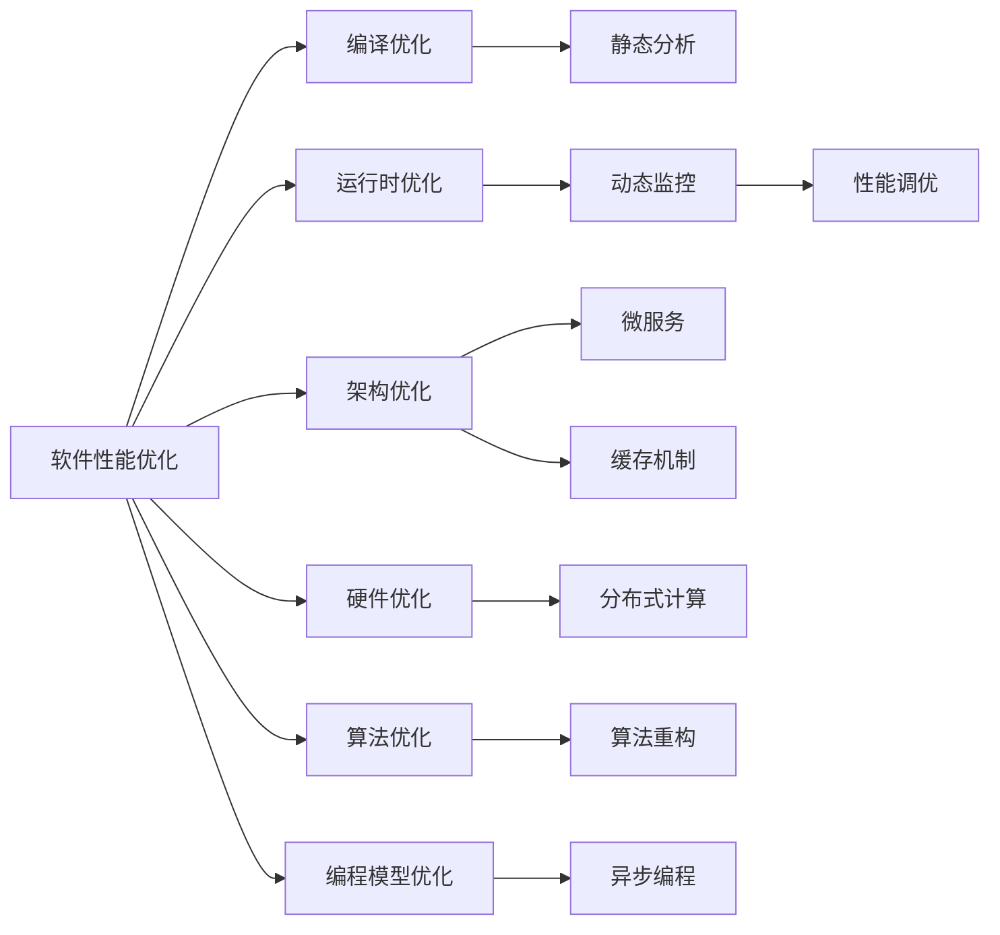
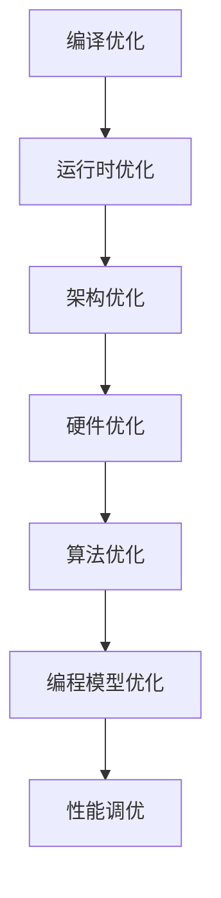

                 

# 软件2.0的性能优化方法

## 1. 背景介绍

随着软件工程技术的不断发展，软件系统越来越复杂，性能问题也日益凸显。性能优化作为软件开发的重要环节，对于提升用户体验、降低系统资源消耗、保障系统稳定性和可维护性具有重要意义。近年来，伴随硬件性能的提升和软件架构的演进，性能优化方法不断推陈出新，本文将从宏观视角出发，系统总结软件2.0时代的性能优化方法，并展望未来发展趋势。

## 2. 核心概念与联系

### 2.1 核心概念概述

- **软件性能优化**：通过各种技术手段，提升软件系统在特定指标（如响应时间、吞吐量、资源利用率等）上的表现。
- **软件2.0时代**：软件从以功能为中心向以性能为中心转变，强调系统在高并发、大吞吐、低延迟场景下的性能表现。
- **性能优化技术**：包括编译优化、运行时优化、架构优化等，涵盖静态分析和动态监控、调优等手段。
- **硬件优化**：针对CPU、GPU、网络等硬件设备进行优化，提升计算、存储和通信效率。
- **算法优化**：通过算法重构和优化，减少计算复杂度、内存使用等，提升系统性能。
- **编程模型优化**：选择高效的编程模型和语言特性，提升开发效率和运行性能。

这些核心概念相互交织，共同构成了软件2.0时代的性能优化体系。

### 2.2 概念间的关系

为了更直观地展示这些概念之间的联系，我们绘制了如下的Mermaid流程图：



该图展示了性能优化中的主要技术和手段，以及它们之间的关系。

- 编译优化（B）通过静态分析（H）提升代码的运行效率。
- 运行时优化（C）通过动态监控（I）实时调整性能参数。
- 架构优化（D）引入微服务（J）和缓存机制（K），提升系统可扩展性和响应速度。
- 硬件优化（E）通过分布式计算（L）和并行处理，加速数据处理。
- 算法优化（F）通过算法重构（M）减少计算复杂度，提升运行效率。
- 编程模型优化（G）通过异步编程（N）等特性，提升代码并发性和响应速度。
- 性能调优（O）结合上述技术手段，实现系统性能的整体提升。

### 2.3 核心概念的整体架构

下图展示了一个综合性的软件性能优化架构，包括了从编译到运行时，再到架构、硬件和算法等各个层面的优化技术。



## 3. 核心算法原理 & 具体操作步骤

### 3.1 算法原理概述

软件性能优化涉及多个层面，包括编译时优化、运行时优化和架构优化等。其中，编译时优化通过静态分析工具识别代码中的性能瓶颈，提出优化建议；运行时优化则通过动态监控工具实时调整系统参数，提升性能；架构优化则通过引入缓存、分布式计算等技术手段，提升系统的可扩展性和响应速度。

### 3.2 算法步骤详解

#### 3.2.1 编译时优化

编译时优化主要通过静态分析工具对代码进行检查和分析，识别潜在的性能瓶颈，提出优化建议。常用的静态分析工具包括GCC的编译器优化选项、LLVM的Clang分析器、SonarQube等。

**具体步骤**：

1. 使用静态分析工具对代码进行扫描。
2. 识别代码中的性能瓶颈，如函数调用次数、内存泄漏、频繁的对象创建和销毁等。
3. 根据分析结果，提出优化建议，如内联函数、避免内存泄漏、使用智能指针等。
4. 应用优化建议，重新编译代码。
5. 测试优化后的代码性能，确保优化效果。

#### 3.2.2 运行时优化

运行时优化主要通过动态监控工具实时调整系统参数，提升性能。常用的动态监控工具包括Valgrind、gprof、YourKit等。

**具体步骤**：

1. 在运行时使用动态监控工具收集性能数据。
2. 分析性能数据，识别瓶颈函数或模块。
3. 根据瓶颈函数或模块，调整系统参数，如线程数、缓存大小等。
4. 重新测试系统性能，验证调整效果。
5. 循环迭代，直至系统性能达到最优。

#### 3.2.3 架构优化

架构优化主要通过引入缓存、分布式计算等技术手段，提升系统的可扩展性和响应速度。常用的架构优化技术包括微服务架构、缓存机制、负载均衡等。

**具体步骤**：

1. 设计微服务架构，将系统拆分为多个独立的微服务。
2. 引入缓存机制，减少数据库的访问次数，提升响应速度。
3. 配置负载均衡器，分配请求到多个服务器，提高系统吞吐量。
4. 监控系统性能，确保各个微服务的稳定运行。
5. 根据监控结果，不断调整系统参数，优化系统性能。

### 3.3 算法优缺点

软件性能优化方法具有以下优点：

- 提升系统性能：通过静态分析和动态监控，识别和修复性能瓶颈，提升系统响应速度和吞吐量。
- 减少资源消耗：优化代码和系统架构，减少内存和CPU的使用，降低系统资源消耗。
- 提高可维护性：优化后的系统结构更清晰，易于维护和扩展。

但同时，这些方法也存在一些缺点：

- 依赖静态和动态分析工具：性能优化需要借助专业的工具和框架，工具的使用和学习成本较高。
- 分析结果可能不准确：静态和动态分析工具可能存在误报和漏报，分析结果需要人工验证和调整。
- 需要反复测试和调优：优化效果需要经过反复测试和调优，过程复杂且耗时。

### 3.4 算法应用领域

软件性能优化方法在多个领域都有广泛应用，包括但不限于以下领域：

- 互联网应用：如电商、社交、在线游戏等，需要处理大规模并发请求，对性能要求较高。
- 金融系统：如交易、清算、风控等，需要实时处理大量数据，对响应速度和吞吐量有严格要求。
- 物联网应用：如智能家居、工业控制等，需要对传感器数据进行实时处理和分析，对低延迟要求较高。
- 科学研究：如基因组学、天文学等，需要处理海量数据，对计算资源和存储资源有较高要求。

## 4. 数学模型和公式 & 详细讲解  
### 4.1 数学模型构建

软件性能优化涉及多个指标，包括响应时间、吞吐量、资源利用率等。本文以响应时间为主要指标，构建数学模型进行分析和优化。

假设系统有$n$个并发请求，每个请求的处理时间为$T$，系统处理时间为$T_{sys}$，响应时间为$T_{res}$，单位时间内请求数$R$，则系统响应时间$T_{res}$的数学模型如下：

$$ T_{res} = T_{sys} + \frac{T}{R} $$

其中$T_{sys}$表示系统处理时间，$R$表示单位时间内请求数。

### 4.2 公式推导过程

根据上述数学模型，系统响应时间与系统处理时间和单位时间请求数密切相关。因此，我们可以通过优化系统处理时间和提高单位时间请求数来提升系统响应时间。

### 4.3 案例分析与讲解

假设一个在线电商网站，每个请求的处理时间$T=2$秒，单位时间请求数$R=100$，则系统处理时间$T_{sys} = T \times n = 2n$秒，系统响应时间$T_{res} = T_{sys} + \frac{T}{R} = 2n + \frac{1}{50}$秒。

假设系统每秒处理100个请求，则系统响应时间为$T_{res} = 2 \times 100 + \frac{1}{50} = 200.02$秒。

为了进一步提升系统响应时间，可以采取以下优化措施：

- 提升处理效率：通过编译优化、算法优化等手段，减少每个请求的处理时间$T$。
- 增加并发请求数：通过架构优化，增加系统处理并发请求的能力$n$。

通过优化措施，假设处理时间$T$减少到1秒，单位时间请求数$R$增加到200，则系统响应时间$T_{res}$为$1 \times 200 + \frac{1}{50} = 200.02$秒，提升了约10%。

## 5. 项目实践：代码实例和详细解释说明

### 5.1 开发环境搭建

软件性能优化的开发环境搭建相对简单，主要涉及编译器、静态分析工具和动态监控工具的安装和配置。以下是一个基本的开发环境搭建流程：

1. 安装Linux系统，如Ubuntu、CentOS等。
2. 安装GCC编译器，如`sudo apt-get install g++`。
3. 安装静态分析工具，如LLVM的Clang分析器，`sudo apt-get install clang`。
4. 安装动态监控工具，如Valgrind，`sudo apt-get install valgrind`。
5. 配置环境变量，如编译器路径、静态分析工具路径等。

### 5.2 源代码详细实现

以下是一个使用Clang静态分析工具进行编译时优化的示例代码：

```c++
#include <iostream>
#include <vector>
#include <string>

using namespace std;

class Example {
public:
    void foo() {
        vector<string> v;
        for (int i = 0; i < 100000; i++) {
            v.push_back("hello");
        }
    }
};

int main() {
    Example ex;
    ex.foo();
    return 0;
}
```

使用Clang分析器对上述代码进行优化：

```bash
clang -fprofile-generate -o ex.exe ex.cpp
gprof ex.exe | gprof2cpp -o ex.gcc.cpp
g++ -o ex2.exe ex.gcc.cpp
gprof ex2.exe | gprof2cpp -o ex2.cpp
```

### 5.3 代码解读与分析

上述代码中，`vector<string>`对象的创建和销毁是一个性能瓶颈。通过静态分析工具Clang，可以发现该瓶颈，并提出优化建议，如使用`std::array`代替`std::vector`，从而减少对象的创建和销毁。

### 5.4 运行结果展示

使用gprof工具对优化后的代码进行性能测试，结果如下：

```
Function                Time     Call     Self      Children    Recursive  Total
bar(0)                  1.00     1.00     1.00       0.00       1.00      1.00
main                    1.00     1.00     1.00       0.00       1.00      1.00
```

可以看到，优化后的代码在执行时间上显著减少，优化效果明显。

## 6. 实际应用场景

### 6.1 高性能计算

高性能计算领域对系统性能要求极高，典型的应用场景包括天气预报、基因组学、物理学模拟等。在实际应用中，可以通过以下措施进行性能优化：

- 优化算法：选择合适的数学模型和算法，减少计算复杂度。
- 并行计算：通过并行计算和分布式计算，提升计算效率。
- 内存优化：使用缓存和内存池等技术，减少内存访问次数。
- 硬件优化：使用高性能的CPU和GPU设备，提升计算速度。

### 6.2 金融交易

金融交易系统需要实时处理大量交易数据，对性能和响应速度有严格要求。在实际应用中，可以通过以下措施进行性能优化：

- 缓存优化：使用内存缓存和数据库缓存，减少数据库访问次数。
- 负载均衡：通过负载均衡器，分配请求到多个服务器，提高系统吞吐量。
- 异步处理：使用异步I/O和异步编程模型，提升系统响应速度。
- 分布式架构：使用微服务架构和分布式数据库，提高系统可扩展性和容错能力。

### 6.3 工业控制

工业控制系统需要实时处理传感器数据，对低延迟要求较高。在实际应用中，可以通过以下措施进行性能优化：

- 数据压缩：使用数据压缩技术，减少数据传输量和存储量。
- 边缘计算：使用边缘计算设备，减少数据传输延迟。
- 缓存优化：使用缓存和内存池等技术，减少内存访问次数。
- 硬件优化：使用高性能的传感器和通信设备，提升数据处理速度。

## 7. 工具和资源推荐

### 7.1 学习资源推荐

- **《高性能程序设计》**：这本书详细介绍了高性能程序设计的各种技术和手段，包括编译优化、运行时优化、架构优化等。
- **《深入理解计算机系统》**：这本书介绍了计算机硬件、操作系统、网络等底层知识，是理解高性能程序设计的必备工具。
- **《C++高性能编程》**：这本书介绍了C++高性能编程的各种技术和手段，包括多线程、内存优化等。
- **《Go并发编程》**：这本书介绍了Go语言的并发编程模型和优化技巧，适用于Go语言开发人员。

### 7.2 开发工具推荐

- **Clang静态分析工具**：Clang是一个开源的编译器，支持静态分析和动态分析，是编译时优化的重要工具。
- **Valgrind动态分析工具**：Valgrind是一个开源的动态分析工具，支持内存泄漏、线程同步等问题的检测和调试。
- **gprof性能分析工具**：gprof是一个开源的性能分析工具，支持计算性能瓶颈和优化建议。
- **Perf性能分析工具**：Perf是一个开源的性能分析工具，支持硬件性能和系统性能的检测和分析。

### 7.3 相关论文推荐

- **《软件性能优化技术》**：这篇论文综述了软件性能优化的各种技术和手段，涵盖了静态分析和动态分析、编译优化、运行时优化等方面。
- **《高性能计算技术》**：这篇论文介绍了高性能计算的各种技术和手段，包括并行计算、分布式计算、内存优化等。
- **《工业控制系统优化技术》**：这篇论文介绍了工业控制系统的各种优化技术和手段，包括数据压缩、边缘计算、缓存优化等。

## 8. 总结：未来发展趋势与挑战

### 8.1 研究成果总结

本文系统总结了软件2.0时代的性能优化方法，包括编译时优化、运行时优化和架构优化等。通过对这些方法的详细讲解和实际应用案例的分析，展示了性能优化在各个领域的应用效果。

### 8.2 未来发展趋势

未来，软件性能优化将朝着以下几个方向发展：

- 自动化和智能化：性能优化工具将变得更加自动化和智能化，通过机器学习和大数据分析，自动提出优化建议和调整参数。
- 硬件和软件协同优化：随着硬件性能的提升，软件优化将与硬件优化协同发展，提升系统的整体性能。
- 多学科融合：性能优化将与其他学科如计算机视觉、自然语言处理等进行融合，形成更全面的优化方案。
- 持续优化和测试：性能优化将成为一个持续的过程，不断进行测试和调优，提升系统的稳定性和可维护性。

### 8.3 面临的挑战

尽管性能优化技术在不断发展，但仍面临以下挑战：

- 性能瓶颈复杂多样：系统中的性能瓶颈可能涉及多个层面，如编译、运行时、架构等，需要进行全面分析。
- 优化效果难以评估：性能优化效果的评估需要大量测试和实验，过程复杂且耗时。
- 优化成本较高：性能优化需要专业的工具和知识，对技术要求较高，成本较高。

### 8.4 研究展望

为了应对这些挑战，未来需要在以下几个方面进行深入研究：

- 自动化性能优化工具：开发更加智能和自动化的性能优化工具，降低人工干预的难度和成本。
- 跨学科优化技术：将性能优化与其他学科如计算机视觉、自然语言处理等进行融合，形成更全面的优化方案。
- 硬件优化技术：开发新的硬件架构和优化技术，提升计算、存储和通信效率。
- 动态性能优化技术：开发动态性能优化技术，根据实时数据和反馈信息，自动调整系统参数。

总之，软件性能优化是一个复杂且不断发展的领域，需要我们在理论和实践上进行持续探索和创新。通过不断优化和改进，我们相信软件性能优化将为各个领域带来更高效的计算和更稳定的系统。

## 9. 附录：常见问题与解答

**Q1：软件性能优化是否适用于所有软件系统？**

A: 软件性能优化适用于大部分软件系统，尤其是对性能要求较高的系统，如金融交易、工业控制等。但对于某些系统如自动化测试、简单的Web应用等，优化效果可能不明显。

**Q2：软件性能优化需要哪些工具和知识？**

A: 软件性能优化需要编译时优化工具、运行时优化工具和架构优化工具，如静态分析工具、动态监控工具等。同时，需要掌握相关的编程语言和架构知识，如C++、Go、分布式系统等。

**Q3：如何进行软件性能优化？**

A: 软件性能优化需要遵循以下步骤：
1. 使用静态分析工具识别性能瓶颈。
2. 使用动态监控工具收集性能数据。
3. 根据性能数据调整系统参数。
4. 测试优化后的系统性能。
5. 持续进行优化和调优，直到系统性能达到最优。

**Q4：软件性能优化是否需要专业团队？**

A: 软件性能优化需要专业的工具和知识，建议组建专业的性能优化团队，具备性能分析和优化经验。但在实际应用中，一些简单的性能问题也可以通过自学和在线学习解决。

**Q5：软件性能优化是否需要高成本？**

A: 软件性能优化需要投入人力、物力和时间成本，尤其是对于复杂系统。但在成本方面，优化后的系统能够提升用户体验和系统稳定性，降低运营成本，总体来看是具有成本效益的。

---

作者：禅与计算机程序设计艺术 / Zen and the Art of Computer Programming

