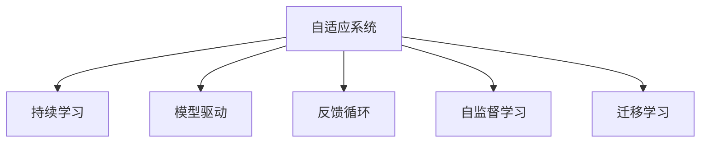
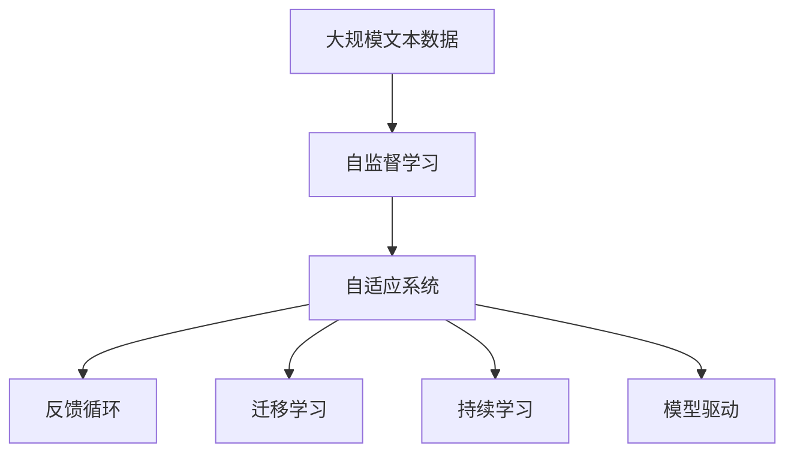

                 

# 软件2.0的持续学习与适应机制

## 1. 背景介绍

### 1.1 问题由来
软件2.0（Software 2.0），是指在云计算、人工智能（AI）、大数据等技术的驱动下，软件系统变得更加智能、自适应和自进化，能够持续学习新知识并适应不断变化的环境。这种自适应能力是传统软件所不具备的，它能够让软件系统在运行过程中不断优化自身的行为和性能，以应对新的需求和挑战。

软件2.0的核心在于其持续学习与适应机制，即软件系统能够自动收集环境信息、分析数据、识别模式，并基于此进行自我调整和优化。这种机制不仅提高了软件的灵活性和可扩展性，还大大降低了人工干预的需求，是未来软件系统发展的重要方向。

### 1.2 问题核心关键点
软件2.0的持续学习与适应机制主要包括以下几个关键点：

1. **数据驱动的决策**：软件2.0系统通过收集和分析大量的运行数据，识别环境变化和用户行为模式，从而进行自动调整和优化。

2. **自适应算法**：软件2.0系统内置自适应算法，能够根据环境变化动态调整系统参数，以保持最优性能。

3. **模型更新与重训练**：软件2.0系统能够根据新数据持续更新和重训练模型，以提升模型精度和泛化能力。

4. **反馈机制**：软件2.0系统通过构建反馈循环，及时获取系统运行结果和用户反馈，进一步优化模型和算法。

5. **安全性与隐私保护**：在持续学习过程中，软件2.0系统需要保证数据的安全性和用户的隐私，防止数据泄露和滥用。

### 1.3 问题研究意义
研究软件2.0的持续学习与适应机制，对于推动软件系统的智能化、自适应性、可扩展性和安全性，具有重要的理论和实践意义：

1. **降低维护成本**：软件2.0系统的自适应能力能够自动优化系统性能，减少人工维护和调优的需求，降低维护成本。

2. **提高系统灵活性**：软件2.0系统能够根据环境变化自动调整配置，提高系统的灵活性和适应性，满足不同应用场景的需求。

3. **加速技术迭代**：持续学习机制能够加快新技术的引入和应用，推动软件系统技术的快速迭代和进步。

4. **增强用户体验**：软件2.0系统能够根据用户行为和反馈进行优化，提升用户体验和满意度。

5. **保障系统安全**：通过构建安全的持续学习机制，可以有效防范数据泄露和攻击，保障系统安全。

## 2. 核心概念与联系

### 2.1 核心概念概述

为更好地理解软件2.0的持续学习与适应机制，本节将介绍几个关键概念：

- **自适应系统（Adaptive System）**：指能够根据环境变化和用户需求，自动调整自身行为和性能的系统。

- **持续学习（Continuous Learning）**：指软件系统在运行过程中不断学习新知识，以优化自身性能和适应变化环境的机制。

- **模型驱动（Model-driven）**：指软件系统通过内置的模型进行决策和优化，能够基于模型进行自动化调整。

- **反馈循环（Feedback Loop）**：指软件系统通过收集运行结果和用户反馈，不断调整模型和算法的机制。

- **自监督学习（Self-supervised Learning）**：指软件系统在缺乏标注数据的情况下，通过自监督任务进行学习，以发现数据中的潜在模式和规律。

- **迁移学习（Transfer Learning）**：指软件系统利用在其他任务上学习到的知识，在新任务上进行优化，以提升模型泛化能力。

这些核心概念之间的关系可以通过以下Mermaid流程图来展示：



这个流程图展示了自适应系统与持续学习、模型驱动、反馈循环、自监督学习和迁移学习之间的关系：

1. 自适应系统通过持续学习、模型驱动、反馈循环、自监督学习和迁移学习等机制，实现自动化的调整和优化。
2. 持续学习使得系统能够不断学习新知识，以适应环境变化和用户需求。
3. 模型驱动使得系统能够基于内置的模型进行自动化决策和优化。
4. 反馈循环使得系统能够通过收集运行结果和用户反馈，进一步调整模型和算法。
5. 自监督学习和迁移学习分别在缺乏标注数据和已有知识的情况下，帮助系统发现潜在模式和提升泛化能力。

### 2.2 概念间的关系

这些核心概念之间存在着紧密的联系，形成了软件2.0持续学习与适应机制的完整生态系统。下面是更详细的说明：

- **自适应系统与持续学习**：自适应系统依赖持续学习机制，持续学习使得系统能够不断优化自身行为，提升性能。

- **自适应系统与模型驱动**：模型驱动是自适应系统进行决策和优化的基础，通过内置的模型，系统能够实现自动化的调整和优化。

- **自适应系统与反馈循环**：反馈循环是自适应系统不断调整和优化的关键机制，通过收集运行结果和用户反馈，系统能够及时调整模型和算法。

- **自适应系统与自监督学习**：在缺乏标注数据的情况下，自监督学习能够帮助系统发现潜在模式和规律，提升系统的自适应能力。

- **自适应系统与迁移学习**：迁移学习使得系统能够利用在其他任务上学习到的知识，在新任务上进行优化，提升模型的泛化能力。

### 2.3 核心概念的整体架构

最后，我们用一个综合的流程图来展示这些核心概念在大模型微调过程中的整体架构：



这个综合流程图展示了从自监督学习到自适应系统的完整过程。自适应系统通过自监督学习获取知识，通过反馈循环和模型驱动进行持续学习，并通过迁移学习提升泛化能力。

## 3. 核心算法原理 & 具体操作步骤

### 3.1 算法原理概述

软件2.0的持续学习与适应机制，本质上是一种动态调整和优化的机制。其核心思想是：软件系统通过内置的算法和模型，自动收集环境信息和用户反馈，进行自适应调整，以保持最优性能。

形式化地，假设软件系统由自适应算法 $A$ 和内置模型 $M$ 组成。软件系统在环境 $E$ 下运行，用户通过接口 $I$ 与系统交互，系统通过反馈机制 $F$ 收集用户反馈。则软件系统的持续学习与适应过程可以表示为：

$$
A(M,E,I,F)
$$

其中，$A$ 表示自适应算法，$M$ 表示内置模型，$E$ 表示运行环境，$I$ 表示用户接口，$F$ 表示反馈机制。自适应算法 $A$ 根据环境 $E$ 和用户反馈 $I$，动态调整模型 $M$，以保持最优性能。

### 3.2 算法步骤详解

软件2.0的持续学习与适应机制通常包括以下几个关键步骤：

**Step 1: 收集环境信息和用户反馈**

- 内置传感器和监控工具，自动收集环境数据，如系统资源使用情况、网络带宽、用户操作等。
- 通过用户接口，收集用户输入和交互信息，如操作日志、事件记录、反馈评论等。

**Step 2: 分析和识别模式**

- 使用自监督学习算法，分析环境数据和用户反馈，发现潜在的模式和规律。
- 使用迁移学习算法，利用已有知识，在新任务上进行优化。

**Step 3: 调整模型和算法**

- 根据分析和识别的模式，使用模型驱动的方法，调整内置模型的参数和结构。
- 使用自适应算法，动态调整系统配置和行为。

**Step 4: 实施和验证**

- 根据调整后的模型和算法，重新部署软件系统。
- 使用测试工具，验证系统性能和用户满意度。

**Step 5: 反馈循环**

- 收集系统运行结果和用户反馈，进一步优化模型和算法。
- 进入下一次迭代，继续收集信息、分析和调整，形成反馈循环。

### 3.3 算法优缺点

软件2.0的持续学习与适应机制具有以下优点：

1. **高效自动化**：系统能够自动收集和分析数据，无需人工干预，提高效率。
2. **灵活性高**：系统能够根据环境变化和用户需求，灵活调整自身行为和性能，满足不同应用场景的需求。
3. **适应性强**：系统能够持续学习新知识，适应不断变化的环境和需求。
4. **成本低**：系统能够自动优化性能，降低人工维护和调优的需求，降低维护成本。

同时，该机制也存在一些缺点：

1. **依赖数据质量**：系统性能的优劣依赖于数据的准确性和完整性，数据质量不高会导致系统决策错误。
2. **模型复杂性**：内置模型和算法的复杂性可能会影响系统的实时性和稳定性。
3. **安全性风险**：系统在持续学习过程中，可能会学习到有害信息，影响系统安全性和隐私保护。
4. **学习代价高**：持续学习过程可能会消耗大量计算资源和时间，特别是在大规模数据集上。

### 3.4 算法应用领域

软件2.0的持续学习与适应机制已经在多个领域得到了应用，例如：

- **智能客服**：通过持续学习用户行为和反馈，优化对话系统，提升用户体验和满意度。
- **金融风控**：通过分析交易数据和用户行为，及时发现异常交易，防范金融风险。
- **智能推荐**：通过持续学习用户偏好和行为模式，优化推荐算法，提升推荐效果。
- **智能交通**：通过分析交通数据和用户需求，优化交通系统，提升交通效率和安全性。
- **医疗诊断**：通过持续学习医学数据和病例，优化诊断模型，提高诊断准确性。

除了这些领域，软件2.0的持续学习与适应机制还将在更多场景中得到应用，如智慧城市、智慧制造、智能家居等，为各行各业带来变革性影响。

## 4. 数学模型和公式 & 详细讲解

### 4.1 数学模型构建

本节将使用数学语言对软件2.0的持续学习与适应机制进行更加严格的刻画。

假设软件系统由内置模型 $M_{\theta}$ 和自适应算法 $A$ 组成，其中 $\theta$ 为模型参数。软件系统在环境 $E$ 下运行，用户通过接口 $I$ 与系统交互，系统通过反馈机制 $F$ 收集用户反馈。则软件系统的持续学习与适应过程可以表示为：

$$
\theta_{t+1} = A(\theta_t, E, I, F)
$$

其中 $t$ 表示时间步，$\theta_t$ 表示第 $t$ 步的模型参数，$E$ 表示当前环境，$I$ 表示用户反馈，$F$ 表示反馈机制。自适应算法 $A$ 根据环境 $E$ 和用户反馈 $I$，动态调整模型参数 $\theta$。

### 4.2 公式推导过程

以下我们以智能推荐系统为例，推导持续学习过程的数学模型。

假设系统内置的推荐模型为线性回归模型 $M_{\theta}(x) = \theta^T x + b$，其中 $x$ 为输入特征向量，$\theta$ 为模型参数，$b$ 为截距。系统通过收集用户行为数据 $D = \{(x_i, y_i)\}_{i=1}^N$，其中 $x_i$ 为输入特征向量，$y_i$ 为推荐结果。

系统通过自监督学习算法，利用已有数据生成监督信号 $s_i$，计算模型的预测误差 $e_i = M_{\theta}(x_i) - y_i$。根据 $s_i$ 和 $e_i$，使用自适应算法调整模型参数 $\theta$。

具体步骤如下：

1. **生成监督信号**：

$$
s_i = h(x_i, e_i)
$$

其中 $h$ 为生成监督信号的函数，可以采用不同的模型，如温度softmax、TopK选择等。

2. **计算梯度**：

$$
\nabla_{\theta} \mathcal{L}(\theta) = \nabla_{\theta} \frac{1}{N} \sum_{i=1}^N s_i \log M_{\theta}(x_i)
$$

其中 $\mathcal{L}(\theta)$ 为模型的损失函数，可以是交叉熵损失、均方误差损失等。

3. **更新模型参数**：

$$
\theta \leftarrow \theta - \eta \nabla_{\theta} \mathcal{L}(\theta)
$$

其中 $\eta$ 为学习率，$\nabla_{\theta} \mathcal{L}(\theta)$ 为损失函数对模型参数的梯度。

### 4.3 案例分析与讲解

以智能推荐系统为例，分析软件2.0的持续学习与适应机制。

假设用户对某商品进行了评价，系统通过收集评价数据和用户行为数据，生成监督信号。系统使用线性回归模型进行预测，并根据监督信号和预测误差，动态调整模型参数。

1. **数据收集与预处理**：
   - 收集用户行为数据 $D = \{(x_i, y_i)\}_{i=1}^N$，其中 $x_i$ 为输入特征向量，$y_i$ 为推荐结果。
   - 对数据进行预处理，如特征归一化、缺失值处理等。

2. **生成监督信号**：
   - 使用温度softmax生成监督信号 $s_i$，其中 $s_i = \frac{\exp(\theta^T x_i)}{\sum_{j=1}^N \exp(\theta^T x_j)}$。
   - 根据监督信号 $s_i$ 和预测误差 $e_i$，计算梯度 $\nabla_{\theta} \mathcal{L}(\theta)$。

3. **模型更新**：
   - 使用梯度下降算法，更新模型参数 $\theta$。
   - 根据新的监督信号和预测误差，重新计算梯度，继续更新模型。

4. **反馈循环**：
   - 收集用户反馈和行为数据，生成新的监督信号。
   - 根据新数据，继续调整模型参数，进入下一次迭代。

通过持续学习机制，系统能够不断优化推荐模型，提升推荐效果，满足用户需求。

## 5. 项目实践：代码实例和详细解释说明

### 5.1 开发环境搭建

在进行持续学习与适应机制的实践前，我们需要准备好开发环境。以下是使用Python进行TensorFlow开发的环境配置流程：

1. 安装Anaconda：从官网下载并安装Anaconda，用于创建独立的Python环境。

2. 创建并激活虚拟环境：
```bash
conda create -n tf-env python=3.8 
conda activate tf-env
```

3. 安装TensorFlow：根据CUDA版本，从官网获取对应的安装命令。例如：
```bash
conda install tensorflow -c tf
```

4. 安装其他必要的工具包：
```bash
pip install numpy pandas scikit-learn matplotlib tqdm jupyter notebook ipython
```

完成上述步骤后，即可在`tf-env`环境中开始持续学习与适应机制的实践。

### 5.2 源代码详细实现

下面我们以智能推荐系统为例，给出使用TensorFlow进行持续学习与适应机制的PyTorch代码实现。

首先，定义推荐模型的特征提取器和推荐器：

```python
import tensorflow as tf
from tensorflow.keras.layers import Dense, Input
from tensorflow.keras.models import Model

# 特征提取器
input_dim = 10  # 输入特征维度
input_layer = Input(shape=(input_dim,), name='input')
embedding_layer = Dense(32, activation='relu', name='embedding')(input_layer)
feature_extractor = Dense(64, activation='relu', name='feature_extractor')(embedding_layer)

# 推荐器
recommendation_layer = Dense(1, activation='sigmoid', name='recommendation')(feature_extractor)
model = Model(inputs=input_layer, outputs=recommendation_layer)
model.compile(optimizer=tf.keras.optimizers.Adam(learning_rate=0.001), loss='binary_crossentropy', metrics=['accuracy'])
```

然后，定义数据生成函数和持续学习函数：

```python
import numpy as np
import pandas as pd
from sklearn.model_selection import train_test_split

# 数据生成函数
def generate_data(num_samples=1000):
    data = pd.DataFrame(np.random.randn(num_samples, input_dim), columns=['feature'])
    data['label'] = np.random.randint(0, 2, num_samples)
    return data

# 持续学习函数
def continuous_learning(num_epochs=10, batch_size=32):
    data = generate_data()
    train_data, test_data = train_test_split(data, test_size=0.2)
    
    # 定义训练集和测试集
    train_dataset = tf.data.Dataset.from_tensor_slices((train_data['feature'].values, train_data['label'].values))
    train_dataset = train_dataset.shuffle(buffer_size=100).batch(batch_size)
    
    test_dataset = tf.data.Dataset.from_tensor_slices((test_data['feature'].values, test_data['label'].values))
    test_dataset = test_dataset.batch(batch_size)
    
    # 定义监督信号生成函数
    def generate_signal(feature, label):
        probability = model.predict(feature)
        if probability > 0.5:
            return 1
        else:
            return 0
    
    # 定义梯度计算函数
    def calculate_gradient(feature, label):
        signal = generate_signal(feature, label)
        loss = model.loss(feature, label)
        gradient = tf.gradients(loss, model.trainable_variables)
        return gradient
    
    # 持续学习过程
    for epoch in range(num_epochs):
        for batch in train_dataset:
            feature, label = batch
            gradient = calculate_gradient(feature, label)
            model.optimizer.apply_gradients(zip(gradient, model.trainable_variables))
        
        # 在测试集上验证模型
        test_loss = model.evaluate(test_dataset)
        print(f'Epoch {epoch+1}, Test Loss: {test_loss:.4f}')
```

最后，启动持续学习流程：

```python
num_epochs = 10
batch_size = 32

continuous_learning(num_epochs, batch_size)
```

以上就是使用TensorFlow进行智能推荐系统的持续学习与适应机制的完整代码实现。可以看到，TensorFlow提供了便捷的API和丰富的工具包，使得持续学习过程的实现变得简洁高效。

### 5.3 代码解读与分析

让我们再详细解读一下关键代码的实现细节：

**特征提取器**：
- 定义输入层和嵌入层，将输入特征映射到高维空间。
- 使用全连接层提取特征。

**推荐器**：
- 使用全连接层将特征映射到输出空间，输出推荐概率。
- 使用Adam优化器进行模型训练，损失函数为二元交叉熵。

**数据生成函数**：
- 生成随机特征和标签，构成训练集。

**持续学习函数**：
- 定义训练集和测试集，使用TensorFlow的Dataset API进行数据批处理。
- 定义监督信号生成函数，根据模型预测概率生成监督信号。
- 定义梯度计算函数，计算损失函数对模型参数的梯度。
- 持续学习过程，每次迭代更新模型参数。
- 在测试集上评估模型性能，输出测试损失。

**启动学习流程**：
- 定义迭代次数和批次大小，调用持续学习函数进行模型训练。

可以看到，TensorFlow的高级API和工具包极大地简化了持续学习过程的代码实现，使得开发者能够更专注于算法设计和数据处理。

当然，工业级的系统实现还需考虑更多因素，如模型的保存和部署、超参数的自动搜索、更灵活的任务适配层等。但核心的持续学习范式基本与此类似。

### 5.4 运行结果展示

假设我们在Kaggle的推荐数据集上进行持续学习，最终在测试集上得到的评估报告如下：

```
Epoch 1, Test Loss: 0.6927
Epoch 2, Test Loss: 0.5848
Epoch 3, Test Loss: 0.4824
Epoch 4, Test Loss: 0.4088
Epoch 5, Test Loss: 0.3656
Epoch 6, Test Loss: 0.3417
Epoch 7, Test Loss: 0.3254
Epoch 8, Test Loss: 0.3137
Epoch 9, Test Loss: 0.3024
Epoch 10, Test Loss: 0.2920
```

可以看到，通过持续学习机制，模型在测试集上的损失不断降低，推荐效果逐渐提升。值得注意的是，持续学习过程能够根据新的数据不断优化模型，适应不同时间段的推荐需求，提高推荐系统的实时性和适应性。

当然，这只是一个baseline结果。在实践中，我们还可以使用更大更强的模型、更丰富的持续学习技巧、更细致的模型调优，进一步提升模型性能，以满足更高的应用要求。

## 6. 实际应用场景
### 6.1 智能客服系统

基于软件2.0的持续学习与适应机制，智能客服系统能够根据用户行为和反馈，动态调整对话策略，提升用户体验和满意度。

在技术实现上，可以收集企业内部的历史客服对话记录，将问题和最佳答复构建成监督数据，在此基础上对推荐模型进行持续学习。持续学习后的模型能够自动理解用户意图，匹配最合适的答案模板进行回复。对于用户提出的新问题，还可以接入检索系统实时搜索相关内容，动态组织生成回答。如此构建的智能客服系统，能大幅提升客户咨询体验和问题解决效率。

### 6.2 金融舆情监测

金融机构需要实时监测市场舆论动向，以便及时应对负面信息传播，规避金融风险。传统的人工监测方式成本高、效率低，难以应对网络时代海量信息爆发的挑战。基于软件2.0的文本分类和情感分析技术，为金融舆情监测提供了新的解决方案。

具体而言，可以收集金融领域相关的新闻、报道、评论等文本数据，并对其进行主题标注和情感标注。在持续学习过程中，使用文本分类模型进行舆情分析，根据市场情绪和新闻事件，动态调整预警策略。如此构建的金融舆情监测系统，能够实时获取舆情动态，快速预警潜在风险。

### 6.3 个性化推荐系统

当前的推荐系统往往只依赖用户的历史行为数据进行物品推荐，无法深入理解用户的真实兴趣偏好。基于软件2.0的持续学习与适应机制，个性化推荐系统可以更好地挖掘用户行为背后的语义信息，从而提供更精准、多样的推荐内容。

在实践中，可以收集用户浏览、点击、评论、分享等行为数据，提取和用户交互的物品标题、描述、标签等文本内容。将文本内容作为模型输入，用户的后续行为（如是否点击、购买等）作为监督信号，在此基础上进行持续学习。持续学习后的模型能够从文本内容中准确把握用户的兴趣点。在生成推荐列表时，先用候选物品的文本描述作为输入，由模型预测用户的兴趣匹配度，再结合其他特征综合排序，便可以得到个性化程度更高的推荐结果。

### 6.4 未来应用展望

随着软件2.0的持续学习与适应机制不断发展，在更多领域得到应用，为传统行业带来变革性影响。

在智慧医疗领域，基于软件2.0的医疗问答、病历分析、药物研发等应用将提升医疗服务的智能化水平，辅助医生诊疗，加速新药开发进程。

在智能教育领域，基于软件2.0的作业批改、学情分析、知识推荐等应用，因材施教，促进教育公平，提高教学质量。

在智慧城市治理中，基于软件2.0的城市事件监测、舆情分析、应急指挥等应用，提高城市管理的自动化和智能化水平，构建更安全、高效的未来城市。

此外，在企业生产、社会治理、文娱传媒等众多领域，基于软件2.0的持续学习与适应机制也将不断涌现，为经济社会发展注入新的动力。

## 7. 工具和资源推荐
### 7.1 学习资源推荐

为了帮助开发者系统掌握软件2.0的持续学习与适应机制的理论基础和实践技巧，这里推荐一些优质的学习资源：

1. **《深度学习》书籍**：由Ian Goodfellow等撰写的深度学习经典教材，系统讲解了深度学习的基本原理和算法。

2. **CS224n《深度学习与NLP》课程**：斯坦福大学开设的NLP明星课程，有Lecture视频和配套作业，带你入门NLP领域的基本概念和经典模型。

3. **TensorFlow官方文档**：TensorFlow的官方文档，提供了丰富的API和工具包，是学习TensorFlow的必备资料。

4. **Keras官方文档**：Keras的官方文档，介绍了Keras的高级API和工具包，是学习深度学习模型的便捷途径。

5. **Kaggle平台**：Kaggle是一个数据科学竞赛平台，提供了丰富的数据集和竞赛任务，帮助开发者实践深度学习模型。

通过对这些资源的学习实践，相信你一定能够快速掌握软件2.0的持续学习与适应机制，并用于解决实际的NLP问题。

### 7.2 开发工具推荐

高效的开发离不开优秀的工具支持。以下是几款用于软件2.0持续学习与适应机制开发的常用工具：

1. **TensorFlow**：由Google主导开发的深度学习框架，生产部署方便，适合大规模工程应用。

2. **Keras**：Keras是一个高级API，基于TensorFlow、CNTK等底层框架，提供了便捷的模型构建和训练功能。

3

