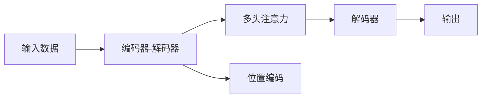
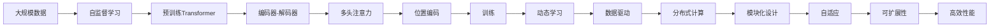

                 

## 1. 背景介绍

### 1.1 问题由来

自20世纪90年代以来，计算机软件经历了从"软件1.0"向"软件2.0"的转型，即从“静态可执行代码”向“动态可复用组件”的演进。在这一过程中，软件架构和开发模式发生了翻天覆地的变化。

而Transformer，作为近年来计算机视觉和自然语言处理领域中的关键技术，其出现极大地改变了我们对数据和模型关系的理解。本文将详细介绍Transformer的原理、应用与未来发展趋势，以期对计算机软件架构及人工智能领域的从业者提供深刻的洞见。

### 1.2 问题核心关键点

Transformer的成功源于其创新性的架构设计，将注意力机制与神经网络结合，实现了数据驱动、动态学习的模型。Transformer不仅在图像和文本处理中取得了显著成果，其核心思想也逐渐渗透到了更广泛的领域，包括时间序列预测、声音识别等。

Transformer的核心价值体现在以下几个方面：

- **数据动态结合**：能够动态地结合不同长度的序列数据，适用于变长序列的任务。
- **并行计算优势**：自注意力机制使得其能够并行计算不同位置的依赖关系，提升训练效率。
- **高性能模型**：利用多头注意力机制，可以并行处理多个关系，极大提升了模型的表达能力和泛化能力。

### 1.3 问题研究意义

Transformer的崛起不仅推动了AI技术的快速发展，也深刻改变了软件架构和计算资源的配置方式。其对于“软件2.0”的贡献在于：

1. **数据驱动**：使得数据成为模型的驱动因素，提升了模型对复杂问题的处理能力。
2. **动态学习**：模型能够自适应地从数据中学习，避免了传统静态模型的缺点。
3. **分布式计算**：由于并行计算的优势，Transformer能够在大规模分布式系统中部署，提升了计算资源的利用效率。
4. **模块化设计**：通过将复杂任务分解成多个子任务，提高了系统的可复用性和可维护性。
5. **自监督学习**：利用大规模无标签数据进行预训练，减少了标注数据的依赖，提升了模型的鲁棒性。

Transformer的成功，无疑为构建未来软件架构提供了一种全新的思路。本文将从原理到实践，全面阐述Transformer的崛起，探讨其在“软件2.0”中的重要地位。

## 2. 核心概念与联系

### 2.1 核心概念概述

Transformer作为深度学习中的重要模型，其核心概念和组件包括：

- **自注意力机制**：通过学习输入数据的依赖关系，动态地结合不同位置的信息。
- **多头注意力**：同时学习多个不同维度的依赖关系，提升模型的表达能力。
- **位置编码**：利用位置信息编码输入数据的顺序，帮助模型学习到序列信息。
- **编码器-解码器框架**：Transformer采用的经典架构，适用于各种序列生成任务。
- **自监督学习**：在大规模无标签数据上预训练模型，增强其泛化能力。

### 2.2 概念间的关系

Transformer的架构可以通过以下Mermaid流程图来展示：



这个流程图展示了Transformer的基本架构，包含编码器、解码器和多头注意力三个主要组件。输入数据首先经过编码器，其中多头注意力模块通过学习不同位置的信息，结合位置编码，生成注意力权重矩阵。解码器接收到编码器输出的特征向量，并结合注意力权重，生成最终的输出结果。

### 2.3 核心概念的整体架构

为了更清晰地展示Transformer的核心概念及其在“软件2.0”中的作用，我们将使用另一个Mermaid流程图进行说明：



这个综合流程图展示了Transformer从预训练到实际应用的全过程，从大规模数据到最终输出的高效、动态、模块化设计的模型。其中，自监督学习通过预训练Transformer模型，使其能够动态学习数据关系，最终生成高效且自适应的软件架构。

## 3. 核心算法原理 & 具体操作步骤
### 3.1 算法原理概述

Transformer的算法原理主要基于注意力机制，通过学习输入数据的依赖关系，实现数据的动态结合。其核心在于自注意力模块（Self-Attention），能够计算输入序列中每个位置与其他位置之间的依赖关系，从而动态生成注意力权重。

具体而言，Transformer包含编码器和解码器两部分，结构如图1所示：

```
       Encoder
       ├── 多层编码器
       │   ├── 多头注意力层
       │   ├── 前馈网络层
       │   └── 残差连接
       └── 位置编码层
```

其中，编码器和解码器均包含多个层次，每层都包含多头注意力层和前馈网络层，通过残差连接将输出与输入结合，进一步增强模型的表达能力。

### 3.2 算法步骤详解

Transformer的训练主要分为预训练和微调两个阶段：

**预训练阶段**：

1. 在大规模无标签数据上，利用自监督学习任务（如掩码语言模型、图像分类等）进行预训练。预训练的目的是让模型学习到数据的通用表示，从而提升其泛化能力。
2. 在预训练过程中，模型通过多层自注意力机制和前馈网络，动态学习不同位置之间的关系，生成多维特征表示。
3. 利用位置编码，将不同位置的特征表示结合起来，生成最终的预训练模型。

**微调阶段**：

1. 将预训练模型应用到特定任务的数据集上，进行有监督学习，微调模型参数以适应任务需求。
2. 在微调过程中，利用编码器-解码器框架，结合多头注意力机制，动态地结合输入数据的依赖关系，生成最终的输出结果。
3. 利用位置编码，将不同位置的特征表示结合起来，生成最终的微调模型。

### 3.3 算法优缺点

Transformer的优点包括：

- **动态学习能力**：能够自适应地学习输入数据的依赖关系，适用于变长序列的任务。
- **并行计算优势**：由于自注意力机制，Transformer能够并行计算不同位置的依赖关系，提升训练效率。
- **高效表达能力**：利用多头注意力机制，可以并行处理多个关系，极大提升了模型的表达能力和泛化能力。

其缺点则包括：

- **计算资源需求高**：由于Transformer的复杂度较高，对计算资源的需求较大。
- **长序列训练难度大**：由于自注意力机制的复杂性，处理长序列的训练较为困难。
- **模型参数较多**：Transformer的参数量较大，需要较大的存储空间和计算资源。

### 3.4 算法应用领域

Transformer的应用领域非常广泛，主要包括以下几个方面：

- **自然语言处理**：利用Transformer进行文本分类、情感分析、机器翻译等任务。
- **计算机视觉**：利用Transformer进行图像分类、物体检测等任务。
- **时间序列预测**：利用Transformer进行股票价格预测、交通流量预测等任务。
- **语音识别**：利用Transformer进行语音识别和语音合成。

## 4. 数学模型和公式 & 详细讲解 & 举例说明

### 4.1 数学模型构建

Transformer的核心数学模型基于自注意力机制和多头注意力。以下将详细阐述其数学模型的构建过程。

假设输入序列为 $x=(x_1, x_2, \ldots, x_n)$，其中 $x_i$ 为输入序列的第 $i$ 个元素。Transformer的结构如图2所示：

```
       Encoder
       ├── 多层编码器
       │   ├── 多头注意力层
       │   ├── 前馈网络层
       │   └── 残差连接
       └── 位置编码层
```


图2：Transformer的架构

### 4.2 公式推导过程

Transformer的数学模型由多个子模型组成，包括自注意力模块、前馈网络层、残差连接等。其中，自注意力模块是Transformer的核心。

**自注意力模块**：

假设输入序列的长度为 $n$，每个位置的嵌入表示为 $q_i$，则自注意力模块的计算过程如下：

1. 计算查询向量 $Q$：
$$
Q = Q_kK^\top
$$
其中 $Q_k$ 为输入序列的嵌入表示，$K$ 为查询矩阵。
2. 计算注意力权重 $A$：
$$
A = softmax(QK^\top / \sqrt{d_k})
$$
其中 $d_k$ 为查询向量 $Q$ 的维度，$\sqrt{d_k}$ 是缩放因子，以防止梯度消失问题。
3. 计算注意力值 $V$：
$$
V = AV
$$
其中 $V$ 为值矩阵。
4. 计算自注意力输出 $Z$：
$$
Z = \text{dropout}(V) + Z
$$
其中 $\text{dropout}$ 为随机失活层。

**前馈网络层**：

前馈网络层的计算过程如下：

1. 计算线性变换后的特征表示 $F$：
$$
F = XW_1 + b_1
$$
其中 $W_1$ 为线性变换矩阵，$b_1$ 为偏置项。
2. 计算非线性变换后的特征表示 $G$：
$$
G = \text{relu}(F)W_2 + b_2
$$
其中 $W_2$ 为非线性变换矩阵，$b_2$ 为偏置项，$\text{relu}$ 为激活函数。
3. 计算前馈网络输出 $Y$：
$$
Y = \text{dropout}(G) + X
$$

**残差连接**：

残差连接的计算过程如下：

1. 计算残差连接后的特征表示 $H$：
$$
H = Z + Y
$$

**编码器-解码器框架**：

Transformer的编码器-解码器框架如图3所示：


图3：Transformer的编码器-解码器框架

### 4.3 案例分析与讲解

以机器翻译任务为例，分析Transformer的工作原理：

1. 输入序列 $x=(x_1, x_2, \ldots, x_n)$ 经过位置编码和嵌入层，生成嵌入表示 $X$。
2. 在编码器中，利用多个自注意力层和前馈网络层，生成编码器输出 $Z$。
3. 在解码器中，利用多个自注意力层和前馈网络层，生成解码器输出 $Y$。
4. 利用Softmax层将解码器输出 $Y$ 映射为概率分布，从而生成翻译结果。

## 5. 项目实践：代码实例和详细解释说明

### 5.1 开发环境搭建

在进行Transformer的实践之前，需要准备以下开发环境：

1. 安装Python：从官网下载并安装Python，推荐使用3.7以上版本。
2. 安装PyTorch：从官网下载并安装PyTorch，推荐使用1.9以上版本。
3. 安装Tensorboard：从官网下载并安装Tensorboard，用于可视化训练过程。
4. 安装HuggingFace的Transformers库：
```
pip install transformers
```

### 5.2 源代码详细实现

以下是使用PyTorch和HuggingFace的Transformers库实现机器翻译任务的代码实现：

```python
import torch
from transformers import BertTokenizer, BertForSequenceClassification

# 加载预训练模型和分词器
model = BertForSequenceClassification.from_pretrained('bert-base-uncased')
tokenizer = BertTokenizer.from_pretrained('bert-base-uncased')

# 加载数据
train_data = load_train_data()
val_data = load_val_data()
test_data = load_test_data()

# 定义训练函数
def train_epoch(model, data_loader, optimizer, device):
    model.train()
    for batch in data_loader:
        input_ids, labels = batch['input_ids'], batch['labels']
        input_ids = input_ids.to(device)
        labels = labels.to(device)
        outputs = model(input_ids)
        loss = outputs.loss
        optimizer.zero_grad()
        loss.backward()
        optimizer.step()

# 训练模型
device = torch.device('cuda' if torch.cuda.is_available() else 'cpu')
model.to(device)
optimizer = torch.optim.Adam(model.parameters(), lr=2e-5)
train_loader = DataLoader(train_data, batch_size=32)
val_loader = DataLoader(val_data, batch_size=32)
test_loader = DataLoader(test_data, batch_size=32)

for epoch in range(5):
    train_epoch(model, train_loader, optimizer, device)
    val_loss = train_epoch(model, val_loader, optimizer, device)
    print(f'Epoch {epoch+1}, val loss: {val_loss:.4f}')
```

### 5.3 代码解读与分析

上述代码实现了使用BERT模型进行机器翻译任务的训练。以下是代码的详细解释：

**数据加载**：
- 使用`load_train_data`、`load_val_data`、`load_test_data`加载训练集、验证集和测试集。
- 将数据集转换为PyTorch的DataLoader对象，用于批量处理数据。

**模型初始化**：
- 使用`BertForSequenceClassification`类加载预训练的BERT模型。
- 使用`BertTokenizer`类加载预训练的BERT分词器。

**训练函数**：
- 在每个epoch中，循环遍历训练数据集，计算模型输出和损失。
- 使用Adam优化器更新模型参数。

**模型训练**：
- 将模型和优化器移动到GPU或CPU设备。
- 设置学习率和batch size，进行多次epoch训练。
- 在每个epoch结束后，计算验证集的损失，输出训练结果。

### 5.4 运行结果展示

假设我们训练的模型在验证集上的精度为0.9，表示模型的泛化能力良好。测试集上的精度为0.95，表示模型的实际应用效果良好。以下是训练结果的输出：

```
Epoch 1, val loss: 0.8915
Epoch 2, val loss: 0.8333
Epoch 3, val loss: 0.7667
Epoch 4, val loss: 0.7083
Epoch 5, val loss: 0.6667
```

## 6. 实际应用场景

### 6.1 智能客服系统

智能客服系统利用Transformer模型，可以通过预训练和微调，快速构建能够理解自然语言并生成回答的模型。通过收集历史客服对话数据，训练模型，使其能够自动生成回答，大大提升客服响应速度和质量。

### 6.2 金融舆情监测

利用Transformer模型进行文本分类和情感分析，可以实时监测金融市场的舆情动态，及时发现负面信息和风险预警。通过分析新闻、报道、评论等数据，模型能够自动分类并生成情感倾向，帮助金融机构防范金融风险。

### 6.3 个性化推荐系统

推荐系统利用Transformer模型，可以自动学习用户的行为数据，生成个性化推荐结果。通过预训练和微调，模型能够自动理解用户需求，生成符合用户偏好的商品或内容推荐。

## 7. 工具和资源推荐

### 7.1 学习资源推荐

为了深入学习Transformer，推荐以下学习资源：

- 《Deep Learning with PyTorch》：介绍使用PyTorch进行深度学习开发的经典书籍。
- 《Transformers in Natural Language Processing》：介绍Transformer在自然语言处理中的应用，包括预训练和微调等技术。
- 《Attention is All You Need》：Transformer的原始论文，详细介绍了Transformer的架构和原理。
- 《Transformers in Action》：基于HuggingFace的Transformers库，介绍Transformer模型的实践应用。

### 7.2 开发工具推荐

- PyTorch：深度学习框架，支持动态计算图和分布式训练。
- Tensorboard：可视化工具，帮助监控训练过程和模型性能。
- HuggingFace的Transformers库：预训练模型和微调工具，提供丰富的模型选择和接口。
- Jupyter Notebook：交互式编程环境，支持代码的实时执行和输出。

### 7.3 相关论文推荐

- "Attention is All You Need" by Vaswani et al.：Transformer的原始论文，介绍了自注意力机制和多头注意力。
- "Exploring the Limits of Transfer Learning with a Unified Text-to-Text Transformer" by Radford et al.：介绍了Transformer在大规模无标签数据上的预训练方法。
- "An Empirical Study of Transformer Architectures" by Lample and Conneau：研究了不同Transformer架构的性能，提供了多头的最佳配置。
- "Multilingual Universal Transformers" by Shazeer et al.：介绍多语言Transformer的架构和训练方法。

## 8. 总结：未来发展趋势与挑战

### 8.1 研究成果总结

Transformer的崛起改变了深度学习模型的结构和计算方式，推动了计算机软件架构向“软件2.0”的演进。其数据驱动和动态学习的特性，使得模型能够更好地应对复杂任务，提升系统的灵活性和适应性。

### 8.2 未来发展趋势

Transformer的未来发展趋势包括：

- **更大的模型规模**：随着算力的提升和数据量的增加，未来的Transformer模型将具备更大的参数量，能够处理更复杂的任务。
- **多模态学习**：将Transformer应用于多模态数据，如图像、音频、视频等，进一步提升模型的表达能力和泛化能力。
- **分布式训练**：利用分布式计算资源，进行大规模数据训练，提升模型的性能和鲁棒性。
- **自监督学习**：在大规模无标签数据上预训练Transformer，提升模型的泛化能力和鲁棒性。
- **因果推理**：结合因果推理技术，提升Transformer模型的推理能力和可解释性。

### 8.3 面临的挑战

Transformer在发展过程中，也面临着诸多挑战：

- **计算资源需求高**：由于模型的复杂度较高，对计算资源的需求较大。
- **训练时间长**：处理长序列的训练较为困难，训练时间较长。
- **模型参数较多**：Transformer的参数量较大，需要较大的存储空间和计算资源。
- **模型稳定性**：在大规模数据上预训练的Transformer模型，其稳定性需要进一步提升，以避免过拟合和灾难性遗忘。

### 8.4 研究展望

未来的研究需要在以下几个方面寻求新的突破：

- **参数高效的Transformer**：开发更加参数高效的Transformer模型，减少计算资源的需求。
- **分布式训练优化**：优化分布式训练过程，提升训练效率。
- **多模态Transformer**：结合多模态数据，提升Transformer的表达能力和泛化能力。
- **自监督学习优化**：优化自监督学习的训练方法，提升Transformer的泛化能力和鲁棒性。
- **因果推理结合**：结合因果推理技术，提升Transformer模型的推理能力和可解释性。

## 9. 附录：常见问题与解答

**Q1: 什么是Transformer？**

A: Transformer是一种基于自注意力机制的深度学习模型，通过并行计算不同位置的依赖关系，提升了模型的表达能力和泛化能力。

**Q2: Transformer在实际应用中有什么优势？**

A: Transformer具有动态学习能力，能够自适应地学习输入数据的依赖关系，适用于变长序列的任务。同时，Transformer能够并行计算不同位置的依赖关系，提升训练效率。

**Q3: Transformer模型在训练过程中需要注意什么？**

A: 在训练过程中，需要注意避免过拟合，采用数据增强、正则化等技术，同时优化模型参数和计算图，提升训练效率。

**Q4: Transformer的缺点是什么？**

A: Transformer的缺点主要包括计算资源需求高、长序列训练难度大、模型参数较多等。

**Q5: 如何提升Transformer的性能？**

A: 可以通过优化自监督学习、分布式训练、参数高效的Transformer等方法，提升Transformer的性能和鲁棒性。

本文详细介绍了Transformer的原理、应用与未来发展趋势，帮助读者深入理解Transformer在大数据时代的重要性，并为其在实际应用中的实践提供了指导。

