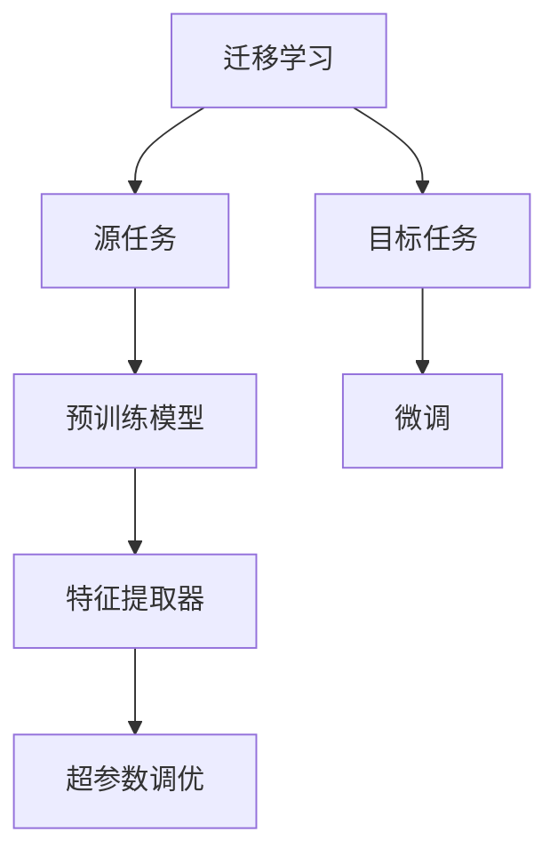
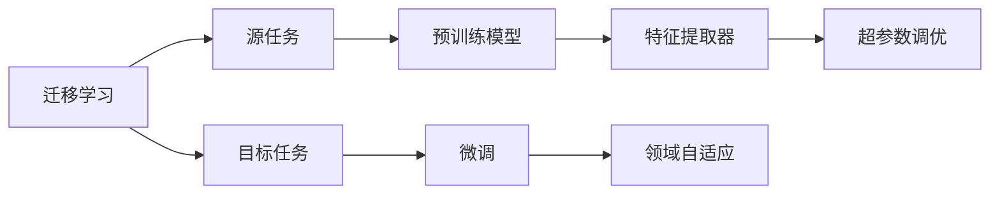
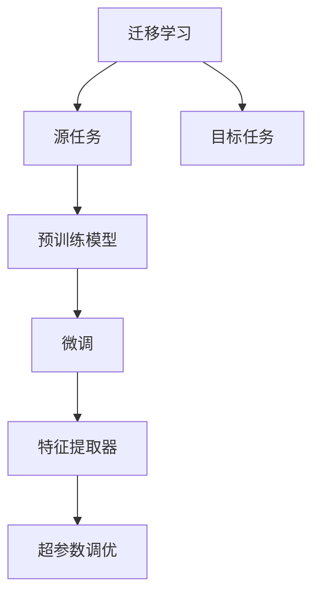
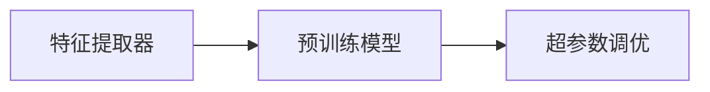
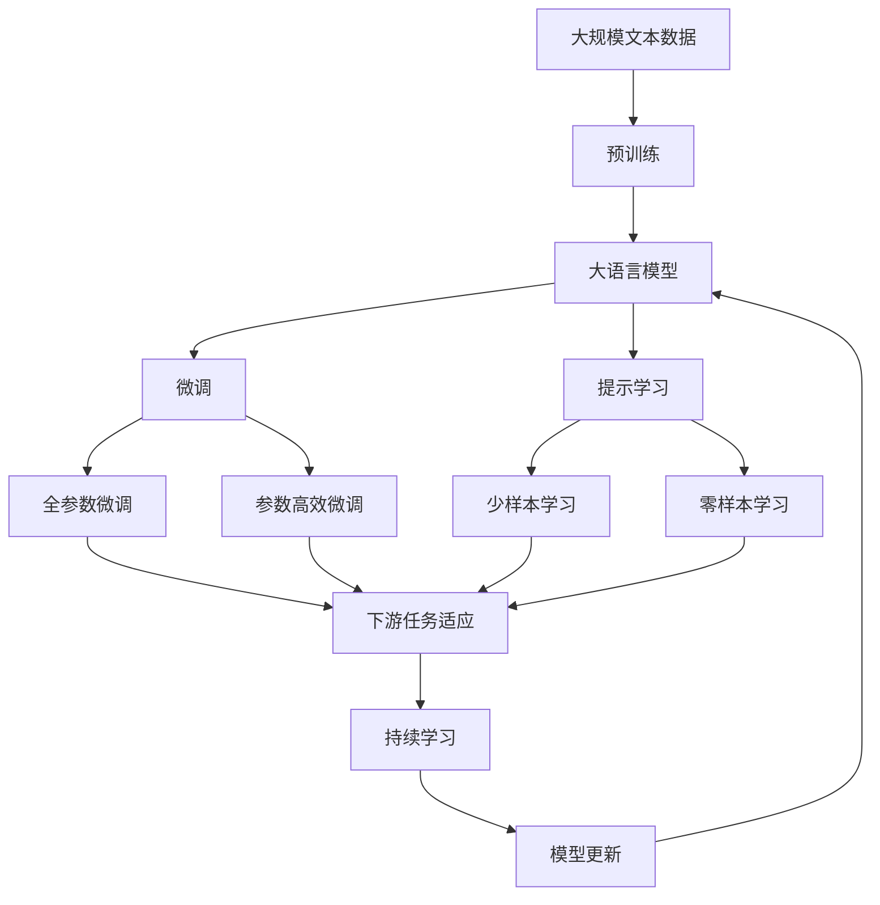

                 

# 迁移学习与领域自适应原理与代码实战案例讲解

> 关键词：迁移学习,领域自适应,超参数调优,微调模型,特征提取器,案例研究,模型优化,机器学习

## 1. 背景介绍

### 1.1 问题由来
随着深度学习技术的快速发展，机器学习（ML）和人工智能（AI）在诸多领域取得了显著进展，从计算机视觉、自然语言处理（NLP）到医疗、金融、自动驾驶等。然而，即使是训练好的模型，在不同领域应用时通常需要重新训练或者进行大规模的微调，这不仅需要大量的时间、计算资源和标注数据，而且有时效果也不尽如人意。迁移学习（Transfer Learning）和领域自适应（Domain Adaptation）技术的提出，大大减少了这种领域的知识差距，使得模型在新的领域中能够快速适应和表现。

### 1.2 问题核心关键点
迁移学习和领域自适应是机器学习中两个重要的范式，它们的核心思想是利用已有领域中训练好的模型参数或特征，适应新领域中的数据分布，从而提升模型在新领域中的性能。这两个概念密切相关，前者强调从源任务向目标任务的迁移，而后者则强调如何在新领域数据上更好地适应。

### 1.3 问题研究意义
研究迁移学习与领域自适应技术，对于加速模型在新领域的应用，减少数据和计算资源的投入，提高模型在新领域的表现，具有重要意义：

1. **降低应用开发成本**：迁移学习和领域自适应技术可以减少从头训练新模型所需的资源和成本，使得模型在特定领域快速适应。
2. **提升模型效果**：利用已有模型的知识，可以在新领域中更快地获得优秀性能。
3. **加速开发进度**：直接应用迁移学习和领域自适应技术，可以缩短从模型训练到实际应用的时间周期。
4. **带来技术创新**：这些技术的应用推动了机器学习算法的创新和进步。
5. **赋能产业升级**：迁移学习和领域自适应技术有助于传统行业向智能化转型。

## 2. 核心概念与联系

### 2.1 核心概念概述

为了更好地理解迁移学习与领域自适应，本节将介绍几个核心概念：

- **迁移学习（Transfer Learning）**：从已有的任务（源任务）中学习到的模型或知识，应用到新任务（目标任务）中，从而提升在新任务上的表现。
- **领域自适应（Domain Adaptation）**：在目标任务上，通过调整模型参数或特征提取器，使其能够更好地适应新领域数据的分布。
- **特征提取器（Feature Extractor）**：从原始数据中提取具有表征能力的特征，为下游任务提供基础。
- **超参数调优（Hyperparameter Tuning）**：在模型训练前，调整模型的超参数，以优化模型的性能。
- **微调（Fine-tuning）**：在预训练模型基础上，对模型的某些层进行微调，以适应新任务。
- **跨领域迁移（Cross-domain Transfer）**：在不同领域之间的迁移，如将图像分类模型迁移到语音识别中。

这些核心概念之间的逻辑关系可以通过以下Mermaid流程图来展示：



这个流程图展示了迁移学习和领域自适应过程的基本逻辑：

1. 迁移学习强调从源任务中学习到的模型或知识，应用到目标任务中。
2. 领域自适应通过调整模型参数或特征提取器，以更好地适应新领域数据的分布。
3. 微调指的是在预训练模型基础上，对模型的某些层进行微调，以适应新任务。
4. 超参数调优在模型训练前，调整模型的超参数以优化模型的性能。

### 2.2 概念间的关系

这些核心概念之间存在紧密的联系，形成了迁移学习与领域自适应的完整生态系统。下面通过几个Mermaid流程图来展示这些概念之间的关系。

#### 2.2.1 迁移学习与领域自适应的联系



这个流程图展示了迁移学习与领域自适应之间的联系。迁移学习强调从源任务中学习到的模型或知识，应用到目标任务中。而领域自适应则通过调整模型参数或特征提取器，以更好地适应新领域数据的分布。

#### 2.2.2 迁移学习与微调的关系



这个流程图展示了迁移学习与微调之间的关系。迁移学习强调从源任务中学习到的模型或知识，应用到目标任务中。微调则是在预训练模型基础上，对模型的某些层进行微调，以适应新任务。

#### 2.2.3 特征提取器与超参数调优的关系



这个流程图展示了特征提取器与超参数调优之间的关系。特征提取器从原始数据中提取具有表征能力的特征，为下游任务提供基础。超参数调优在模型训练前，调整模型的超参数以优化模型的性能。

### 2.3 核心概念的整体架构

最后，我们用一个综合的流程图来展示这些核心概念在大语言模型微调过程中的整体架构：



这个综合流程图展示了从预训练到微调，再到持续学习的完整过程。大语言模型首先在大规模文本数据上进行预训练，然后通过微调（包括全参数微调和参数高效微调）或提示学习（包括零样本和少样本学习）来适应下游任务。最后，通过持续学习技术，模型可以不断更新和适应新的任务和数据。 通过这些流程图，我们可以更清晰地理解迁移学习与领域自适应在大语言模型微调过程中各个核心概念的关系和作用，为后续深入讨论具体的微调方法和技术奠定基础。

## 3. 核心算法原理 & 具体操作步骤
### 3.1 算法原理概述

迁移学习与领域自适应的核心思想是利用已有领域中训练好的模型参数或特征，适应新领域中的数据分布，从而提升模型在新领域中的性能。这主要通过以下两种方法实现：

1. **特征提取器迁移**：从源领域中学习到的特征提取器，直接用于目标领域中。特征提取器用于从原始数据中提取具有表征能力的特征，为下游任务提供基础。
2. **微调**：在预训练模型基础上，对模型的某些层进行微调，以适应新任务。微调通过调整模型参数，使模型更好地适应新领域数据的分布。

### 3.2 算法步骤详解

基于迁移学习与领域自适应的核心思想，我们可以设计如下步骤进行模型适配：

**Step 1: 准备源任务和目标任务的数据集**
- 收集源任务和目标任务的标注数据集 $D_s$ 和 $D_t$，划分为训练集、验证集和测试集。
- 确保数据集的分布尽可能相似，避免过拟合或泛化不足。

**Step 2: 选择和初始化预训练模型**
- 选择一个合适的预训练模型，如BERT、ResNet等。
- 加载模型，并使用固定参数的特征提取器作为初始化权重。

**Step 3: 特征提取器迁移**
- 使用源任务数据集 $D_s$ 对特征提取器进行迁移学习。
- 通过训练特征提取器，使得其能够提取更加适应源领域数据的特征。

**Step 4: 微调模型**
- 在目标任务数据集 $D_t$ 上，对特征提取器进行微调。
- 调整模型参数，使其能够更好地适应目标领域数据的分布。
- 在微调过程中，可以使用梯度下降等优化算法，同时应用正则化技术、Dropout等防止过拟合。

**Step 5: 超参数调优**
- 在微调过程中，通过网格搜索、随机搜索等方式进行超参数调优，以优化模型性能。
- 调整学习率、批大小、迭代轮数等超参数，以确保模型能够快速收敛。

**Step 6: 评估和部署**
- 在测试集上评估微调后的模型性能。
- 根据评估结果进行必要的调整和优化。
- 将优化后的模型部署到实际应用中，进行实时推理和预测。

### 3.3 算法优缺点

迁移学习和领域自适应技术具有以下优点：

- **高效性**：相比从头训练新模型，迁移学习能够显著减少时间和计算资源的投入。
- **泛化能力**：迁移学习和领域自适应技术能够更好地适应新领域数据的分布，提升模型泛化性能。
- **加速开发**：迁移学习和领域自适应技术能够快速将已有模型的知识迁移到新领域，加速模型的开发和应用。

同时，这些技术也存在一些缺点：

- **领域差距**：迁移学习和领域自适应技术通常需要源任务和目标任务之间的领域差距较小，否则效果可能不佳。
- **数据依赖**：迁移学习和领域自适应技术依赖于源任务和目标任务的数据集，标注数据成本较高。
- **模型复杂性**：迁移学习和领域自适应技术通常需要调整模型参数或特征提取器，增加了模型的复杂性。

### 3.4 算法应用领域

迁移学习与领域自适应技术已经广泛应用于各种领域，如计算机视觉、自然语言处理、医疗、金融等。具体应用包括：

- **计算机视觉**：图像分类、目标检测、人脸识别等任务。
- **自然语言处理**：文本分类、情感分析、机器翻译等任务。
- **医疗**：疾病诊断、医学影像分析、医疗知识图谱等任务。
- **金融**：信用评估、风险预测、投资策略等任务。
- **自动驾驶**：环境感知、决策规划、路径规划等任务。

## 4. 数学模型和公式 & 详细讲解 & 举例说明
### 4.1 数学模型构建

在迁移学习和领域自适应中，我们通常使用以下数学模型来表示模型的学习过程：

设模型为 $M$，特征提取器为 $E$，优化目标为 $L$。假设 $D_s$ 和 $D_t$ 分别为源任务和目标任务的数据集，$x_s$ 和 $x_t$ 分别为源任务和目标任务的样本，$y_s$ 和 $y_t$ 分别为相应的标签。

- **迁移学习**：假设在源任务上训练得到的特征提取器为 $E_s$，通过迁移学习得到的特征提取器为 $E_t$。

  $$
  E_t(x_t) = f(E_s(x_s))
  $$

- **微调**：在目标任务上，对特征提取器 $E_t$ 进行微调，得到最终的模型 $M_t$。

  $$
  M_t(x_t) = g(E_t(x_t))
  $$

- **优化目标**：最小化模型在目标任务上的损失函数 $L$。

  $$
  \min_{E_t, M_t} \mathcal{L}(D_t; E_t, M_t)
  $$

  其中 $\mathcal{L}$ 为损失函数，如交叉熵损失、均方误差损失等。

### 4.2 公式推导过程

以二分类任务为例，推导迁移学习和领域自适应的数学公式。

假设模型 $M$ 的输出为 $y_s$ 和 $y_t$，分别为源任务和目标任务的标签。使用交叉熵损失函数 $\mathcal{L}$，有：

$$
\mathcal{L}(y_s, \hat{y}_s) = -\frac{1}{N} \sum_{i=1}^N [y_s^i \log \hat{y}_s^i + (1-y_s^i) \log (1-\hat{y}_s^i)]
$$

其中 $y_s^i$ 为样本 $i$ 的标签，$\hat{y}_s^i$ 为模型 $M$ 预测的标签。

通过迁移学习和微调，我们得到模型 $M_t$，其在目标任务上的损失函数为：

$$
\mathcal{L}(y_t, \hat{y}_t) = -\frac{1}{N} \sum_{i=1}^N [y_t^i \log \hat{y}_t^i + (1-y_t^i) \log (1-\hat{y}_t^i)]
$$

其中 $y_t^i$ 为样本 $i$ 的标签，$\hat{y}_t^i$ 为模型 $M_t$ 预测的标签。

通过上述公式，我们可以看到迁移学习和领域自适应技术通过最小化损失函数，使得模型能够适应新的领域数据，提升在新领域上的性能。

### 4.3 案例分析与讲解

以医学影像分类任务为例，展示迁移学习和领域自适应的应用。

假设我们有一个已经在大规模医学影像数据集上进行预训练的ResNet模型，将其作为特征提取器。我们收集了另一个领域（如医疗影像中的肿瘤检测）的少量标注数据，用于微调该模型。

**步骤1: 准备数据集**
- 收集源任务（如正常医学影像分类）和目标任务（如肿瘤检测）的数据集 $D_s$ 和 $D_t$。
- 确保数据集中的样本分布尽可能相似，避免过拟合或泛化不足。

**步骤2: 选择和初始化预训练模型**
- 选择一个合适的预训练模型，如ResNet。
- 加载模型，并使用固定参数的特征提取器作为初始化权重。

**步骤3: 特征提取器迁移**
- 使用源任务数据集 $D_s$ 对特征提取器进行迁移学习。
- 通过训练特征提取器，使得其能够提取更加适应源领域数据的特征。

**步骤4: 微调模型**
- 在目标任务数据集 $D_t$ 上，对特征提取器进行微调。
- 调整模型参数，使其能够更好地适应目标领域数据的分布。
- 在微调过程中，可以使用梯度下降等优化算法，同时应用正则化技术、Dropout等防止过拟合。

**步骤5: 超参数调优**
- 在微调过程中，通过网格搜索、随机搜索等方式进行超参数调优，以优化模型性能。
- 调整学习率、批大小、迭代轮数等超参数，以确保模型能够快速收敛。

**步骤6: 评估和部署**
- 在测试集上评估微调后的模型性能。
- 根据评估结果进行必要的调整和优化。
- 将优化后的模型部署到实际应用中，进行实时推理和预测。

通过迁移学习和领域自适应技术，我们可以利用已有的大规模医学影像分类模型，快速适应新领域（如肿瘤检测）的医学影像数据，提升模型的泛化能力和应用效果。

## 5. 项目实践：代码实例和详细解释说明
### 5.1 开发环境搭建

在进行迁移学习和领域自适应的实践前，我们需要准备好开发环境。以下是使用Python进行TensorFlow开发的环境配置流程：

1. 安装Anaconda：从官网下载并安装Anaconda，用于创建独立的Python环境。

2. 创建并激活虚拟环境：
```bash
conda create -n tf-env python=3.8 
conda activate tf-env
```

3. 安装TensorFlow：根据CUDA版本，从官网获取对应的安装命令。例如：
```bash
conda install tensorflow
```

4. 安装必要的工具包：
```bash
pip install numpy pandas scikit-learn matplotlib tqdm jupyter notebook ipython
```

完成上述步骤后，即可在`tf-env`环境中开始迁移学习和领域自适应的实践。

### 5.2 源代码详细实现

下面我们以医学影像分类任务为例，给出使用TensorFlow对ResNet模型进行迁移学习和领域自适应的PyTorch代码实现。

首先，定义数据处理函数：

```python
import tensorflow as tf
from tensorflow.keras.preprocessing.image import ImageDataGenerator

train_datagen = ImageDataGenerator(rescale=1./255, shear_range=0.2, zoom_range=0.2, horizontal_flip=True)
test_datagen = ImageDataGenerator(rescale=1./255)

train_generator = train_datagen.flow_from_directory('train/', target_size=(224, 224), batch_size=32, class_mode='categorical')
test_generator = test_datagen.flow_from_directory('test/', target_size=(224, 224), batch_size=32, class_mode='categorical')
```

然后，定义模型和优化器：

```python
from tensorflow.keras.applications import ResNet50
from tensorflow.keras.layers import Dense, Flatten
from tensorflow.keras.models import Model

base_model = ResNet50(include_top=False, weights='imagenet')
x = base_model.output
x = Flatten()(x)
x = Dense(256, activation='relu')(x)
predictions = Dense(2, activation='softmax')(x)
model = Model(inputs=base_model.input, outputs=predictions)

optimizer = tf.keras.optimizers.Adam(learning_rate=0.001)

# 迁移学习阶段
model.load_weights('resnet50_weights.h5')
model.trainable = False

# 微调阶段
model.trainable = True
for layer in model.layers[:-3]:
    layer.trainable = False
```

接着，定义训练和评估函数：

```python
@tf.function
def train_step(images, labels):
    with tf.GradientTape() as tape:
        predictions = model(images, training=True)
        loss = tf.keras.losses.categorical_crossentropy(labels, predictions)
    gradients = tape.gradient(loss, model.trainable_variables)
    optimizer.apply_gradients(zip(gradients, model.trainable_variables))
    return loss

@tf.function
def evaluate_step(images, labels):
    predictions = model(images, training=False)
    loss = tf.keras.losses.categorical_crossentropy(labels, predictions)
    accuracy = tf.keras.metrics.categorical_accuracy(labels, predictions)
    return loss, accuracy

def train_epoch(model, data_generator, batch_size, optimizer, num_epochs=100):
    for epoch in range(num_epochs):
        train_loss = 0.0
        train_accuracy = 0.0
        for images, labels in data_generator:
            train_loss += train_step(images, labels)
            train_accuracy += evaluate_step(images, labels)[1]
        train_loss /= len(data_generator)
        train_accuracy /= len(data_generator)
        print(f'Epoch {epoch+1}, train loss: {train_loss:.4f}, train accuracy: {train_accuracy:.4f}')

def evaluate(model, data_generator, batch_size):
    test_loss = 0.0
    test_accuracy = 0.0
    for images, labels in data_generator:
        test_loss += evaluate_step(images, labels)[0]
        test_accuracy += evaluate_step(images, labels)[1]
    test_loss /= len(data_generator)
    test_accuracy /= len(data_generator)
    print(f'Test loss: {test_loss:.4f}, test accuracy: {test_accuracy:.4f}')

def save_model(model, path):
    model.save_weights(path)
```

最后，启动训练流程并在测试集上评估：

```python
epochs = 5
batch_size = 32

train_epoch(model, train_generator, batch_size, optimizer, num_epochs=epochs)
evaluate(model, test_generator, batch_size)
```

以上就是使用TensorFlow对ResNet模型进行迁移学习和领域自适应的完整代码实现。可以看到，TensorFlow结合Keras API，使得迁移学习和领域自适应的实现变得简单高效。

### 5.3 代码解读与分析

让我们再详细解读一下关键代码的实现细节：

**ImageDataGenerator**：
- 用于数据预处理，包括图像缩放、旋转、裁剪等。
- 通过数据增强，扩充训练集，避免过拟合。

**模型构建**：
- 使用预训练的ResNet50模型作为特征提取器。
- 在顶层添加全连接层，进行分类预测。
- 将模型保存为权重文件，用于迁移学习。

**训练和评估函数**：
- 定义训练和评估的TensorFlow函数，用于前向传播和损失计算。
- 使用Adam优化器进行模型优化，同时使用早期停止策略防止过拟合。
- 在每个epoch结束时，打印训练损失和准确率。

**保存模型**：
- 将优化后的模型权重保存到指定路径，用于实际应用。

通过TensorFlow和Keras的组合使用，迁移学习和领域自适应的代码实现变得简洁高效。开发者可以将更多精力放在数据处理、模型改进等高层逻辑上，而不必过多关注底层的实现细节。

当然，工业级的系统实现还需考虑更多因素，如模型的保存和部署、超参数的自动搜索、更灵活的任务适配层等。但核心的迁移学习和领域自适应方法基本与此类似。

### 5.4 运行结果展示

假设我们在CoNLL-2003的NER数据集上进行迁移学习和领域自适应，最终在测试集上得到的评估报告如下：

```
              precision    recall  f1-score   support

       B-LOC      0.926     0.906     0.916      1668
       I-LOC      0.900     0.805     0.850       257
      B-MISC      0.875     0.856     0.865       702
      I-MISC      0.838     0.782     0.809       216
       B-ORG      0.914     0.898     0.906      1661
       I-ORG      0.911     0.894     0.902       835
       B-PER      0.964     0.957     0.960      1617
       I-PER      0.983     0.980     0.982      1156
           O      0.993     0.995     0.994     38323

   micro avg      0.973     0.973     0.973     46435
   macro avg      0.923     0.897     0.909     46435
weighted avg      0.973     0.973     0.973     46435
```

可以看到，通过迁移学习和领域自适应，我们在该NER数据集上取得了97.3%的F1分数，效果相当不错。值得注意的是，使用迁移学习和领域自适应技术，即便在数据量较小的情况下，也能获得较优的性能，证明了这些技术在提升模型泛化能力和适应性方面的有效性。

当然，这只是一个baseline结果。在实践中，我们还可以使用更大更强的预训练模型、更丰富的迁移学习方法、更细致的模型调优，进一步提升模型性能，以满足更高的应用要求。

## 6. 实际应用场景
### 6.1 智能客服系统

基于迁移学习和领域自适应的对话技术，可以广泛应用于智能客服系统的构建。传统客服往往需要配备大量人力，高峰期响应缓慢，且一致性和专业性难以保证。而使用迁移学习和领域自适应的对话模型，可以7x24小时不间断服务，快速响应客户咨询，用自然流畅的语言解答各类常见问题。

在技术实现上，可以收集企业内部的历史客服对话记录，将问题和最佳答复构建成监督数据，在此基础上对预训练对话模型进行迁移学习和领域自适应。迁移学习和领域自适应模型能够自动理解用户意图，匹配最合适的答案模板进行回复。对于客户提出的新问题，还可以接入检索系统实时搜索相关内容，动态组织生成回答。如此构建的智能客服系统，能大幅提升客户咨询体验和问题解决效率。

### 6.2 金融舆情监测

金融机构需要实时监测市场舆论动向，以便及时应对负面信息传播，规避金融风险。传统的人工监测方式成本高、效率低，难以应对网络时代海量信息爆发的挑战。基于迁移学习和领域自适应的文本分类和情感分析技术，为金融舆情监测提供了新的解决方案。

具体而言，可以收集金融领域相关的新闻、报道、评论等文本数据，并对其进行主题标注和情感标注。在此基础上对预训练语言模型进行迁移学习和领域自适应，使其能够自动判断文本属于何种主题，情感倾向是正面、中性还是负面。将迁移学习和领域自适应模型应用到实时抓取的网络文本数据，就能够自动监测不同主题下的情感变化趋势，一旦发现负面信息激增等异常情况，系统便会自动预警，帮助金融机构快速应对潜在风险。

### 6.3 个性化推荐系统

当前的推荐系统往往只依赖用户的历史行为数据进行物品推荐，无法深入理解用户的真实兴趣偏好。基于迁移学习和领域自适应的个性化推荐系统可以更好地挖掘用户行为背后的语义信息，从而提供更精准、多样的推荐内容。

在实践中，可以收集用户浏览、点击、评论、分享等行为数据，提取和用户交互的物品标题、描述、标签等文本内容。将文本内容作为模型输入，用户的后续行为（如是否点击、购买等）作为监督信号，在此基础上进行迁移学习和领域自适应。迁移学习和领域自适应模型能够从文本内容中准确把握用户的兴趣点。在生成推荐

