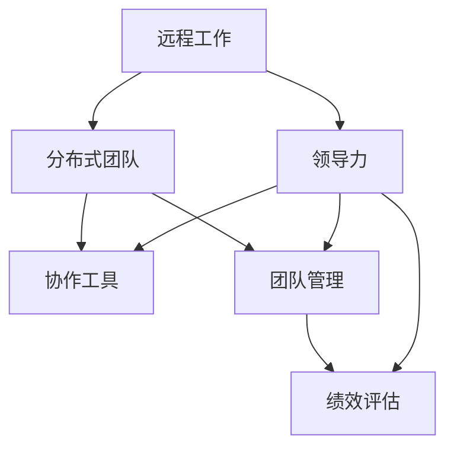
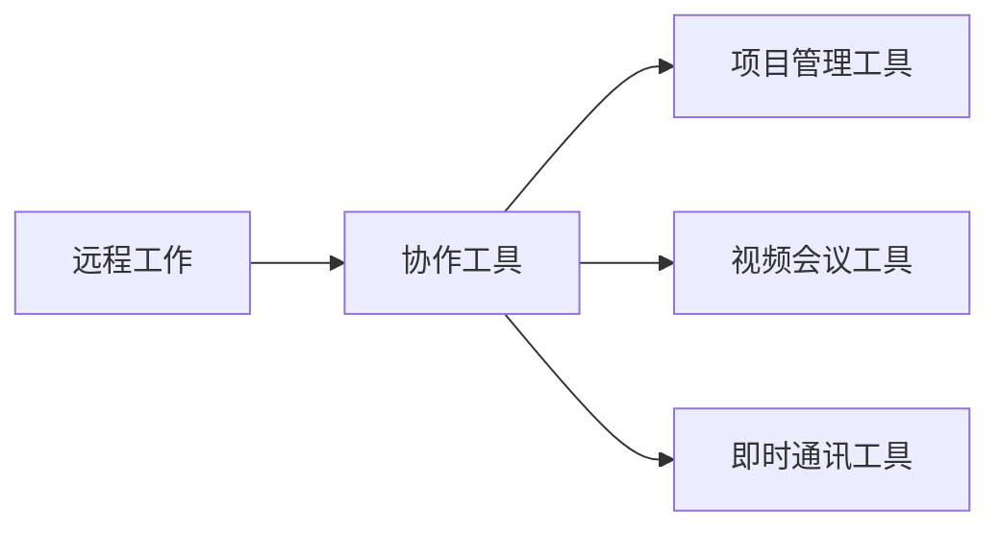
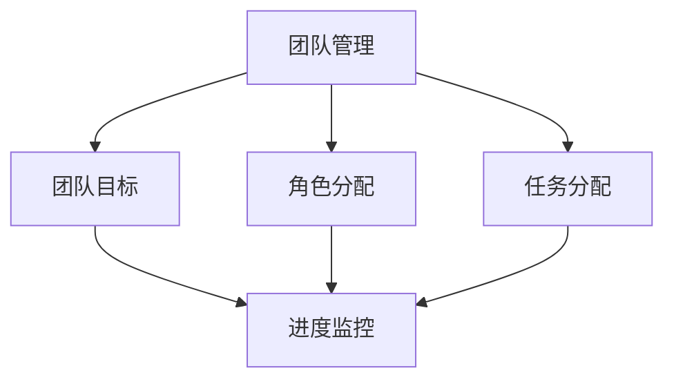
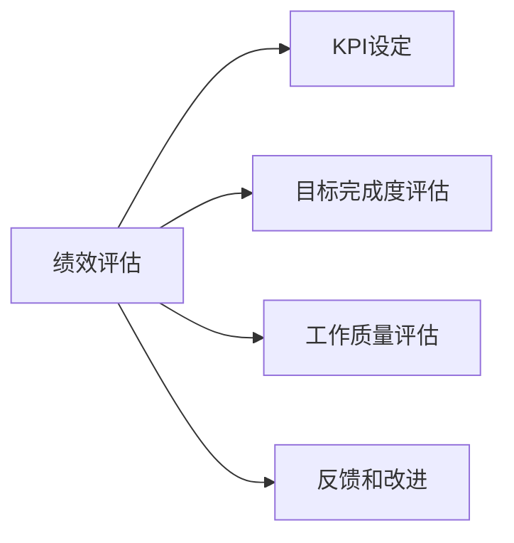
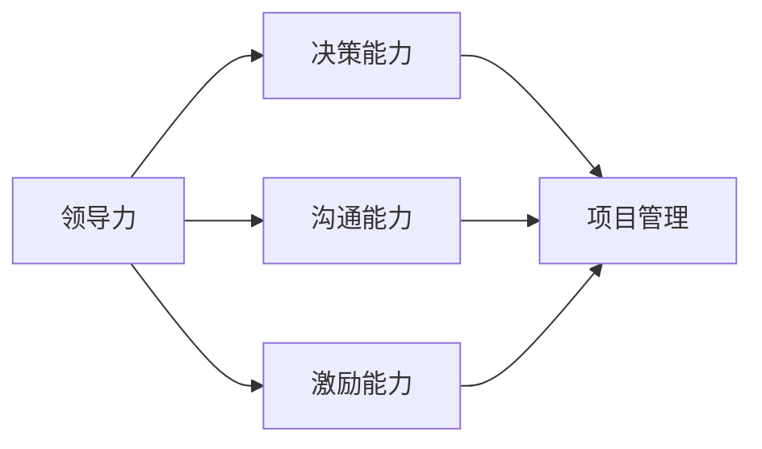
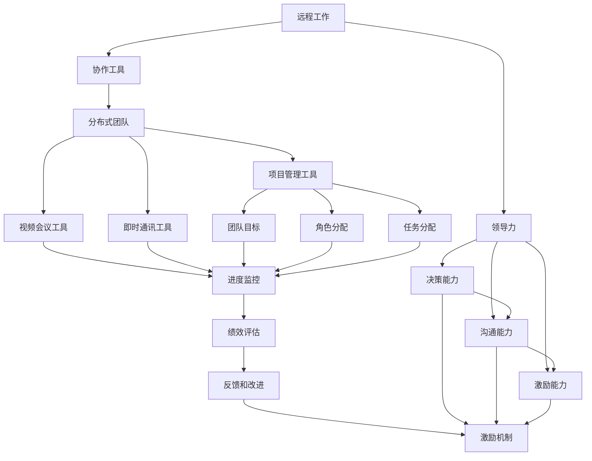

                 

# 远程工作管理：领导分布式团队的策略

> 关键词：远程工作, 分布式团队, 协作工具, 团队管理, 绩效评估, 领导力

## 1. 背景介绍

### 1.1 问题由来
在现代社会，尤其是科技行业的迅猛发展下，远程工作（Remote Work）已经成为了越来越多企业采用的工作模式。这种模式不仅能够提供更高的灵活性和自由度，还能够节省通勤时间，减少办公场所的租金成本，从而提升企业的竞争力。然而，随之而来的问题也不容忽视。如何在远程工作环境下有效地管理和协调团队，确保项目的顺利推进，是每个管理者面临的巨大挑战。

### 1.2 问题核心关键点
在远程工作环境中，传统的工作管理模式难以直接应用。团队成员在物理上分散，沟通和协作变得更加复杂。因此，我们需要一种新的管理策略来应对这些挑战，从而保证团队的高效协作和生产力。

关键点包括：
- **团队协作工具**：选择合适的工具来支持远程团队的沟通和协作。
- **团队管理**：制定明确的团队目标和角色分配，确保每个人都清楚自己的职责和任务。
- **绩效评估**：建立有效的绩效评估机制，激励团队成员的工作积极性。
- **领导力**：领导者需要展现出新的领导风格，以适应远程工作的需求。

### 1.3 问题研究意义
研究有效的远程工作管理策略，对于提升团队生产力、提高员工满意度和推动企业发展具有重要意义。具体来说：

1. **提高生产效率**：通过合适的工具和管理策略，减少沟通成本，提高团队协作效率。
2. **增强团队凝聚力**：通过有效的管理，增强团队成员之间的信任和协作，提升团队凝聚力。
3. **降低成本**：减少办公场所的租金和通勤成本，提升企业运营效率。
4. **促进创新**：提供更高的灵活性和自由度，激发员工的创新思维和创造力。
5. **提升员工满意度**：通过灵活的工作时间和地点选择，提高员工的工作满意度和生活质量。

## 2. 核心概念与联系

### 2.1 核心概念概述

为了更好地理解远程工作管理的策略，本节将介绍几个关键概念及其联系：

- **远程工作（Remote Work）**：指的是员工通过互联网进行工作，而不是在传统办公场所进行。
- **分布式团队（Distributed Team）**：由地理上分散的成员组成的团队。
- **协作工具（Collaboration Tools）**：支持团队成员之间沟通和协作的软件工具。
- **团队管理（Team Management）**：制定团队目标、分配角色和任务、监控进展等活动。
- **绩效评估（Performance Evaluation）**：评估团队成员的工作表现和成果。
- **领导力（Leadership）**：管理者在远程团队中展现的领导风格和能力。

这些概念之间的逻辑关系可以通过以下Mermaid流程图来展示：



这个流程图展示了远程工作、分布式团队、协作工具、团队管理、绩效评估和领导力之间的关系：

1. 远程工作是分布式团队存在的基础。
2. 协作工具和团队管理是分布式团队协作的基础。
3. 绩效评估是团队管理的重要组成部分。
4. 领导力是团队管理和绩效评估的核心。

### 2.2 概念间的关系

这些核心概念之间存在着紧密的联系，形成了远程工作管理的完整生态系统。下面我们通过几个Mermaid流程图来展示这些概念之间的关系。

#### 2.2.1 远程工作的技术支撑



这个流程图展示了远程工作依赖于协作工具，而协作工具包括项目管理工具、视频会议工具和即时通讯工具，共同支撑远程工作的顺利进行。

#### 2.2.2 团队管理的关键步骤



这个流程图展示了团队管理的关键步骤，包括设定团队目标、分配角色和任务，以及监控进展。

#### 2.2.3 绩效评估的常用方法



这个流程图展示了绩效评估的常用方法，包括设定关键绩效指标(KPI)、评估目标完成度和工作质量，以及提供反馈和改进。

#### 2.2.4 领导力的表现



这个流程图展示了领导力的表现，包括决策能力、沟通能力和激励能力，这些能力在项目管理、团队沟通和员工激励中发挥重要作用。

### 2.3 核心概念的整体架构

最后，我们用一个综合的流程图来展示这些核心概念在大规模分布式远程工作管理中的整体架构：



这个综合流程图展示了从远程工作到领导力的完整过程。大语言模型微调过程的各个环节相互依存，共同支持远程工作的成功实施。

## 3. 核心算法原理 & 具体操作步骤
### 3.1 算法原理概述

远程工作管理策略的核心在于如何利用技术手段和人力资源，确保团队在分布式环境中的高效协作和生产力的最大化。其基本原理包括以下几个方面：

1. **技术支撑**：选择合适的协作工具，确保团队成员之间的沟通和协作顺畅。
2. **目标设定**：明确团队目标和任务，确保每个成员都清楚自己的职责和期望。
3. **角色分配**：根据团队成员的技能和兴趣，合理分配角色和任务。
4. **进度监控**：实时监控团队进展，及时发现和解决问题。
5. **绩效评估**：建立公正透明的绩效评估机制，激励成员的工作积极性。
6. **领导力展现**：领导者在远程团队中展现出新的领导风格，以适应分布式环境。

### 3.2 算法步骤详解

以下是对远程工作管理策略的详细步骤详解：

**Step 1: 准备工具和资源**

- **选择合适的协作工具**：根据团队需求，选择适合的视频会议工具、项目管理工具和即时通讯工具。常用的工具包括Slack、Microsoft Teams、Zoom等。
- **准备必要的硬件和软件**：确保每个成员都有稳定的网络连接、适合的计算机设备、必要的软件安装等。

**Step 2: 设定团队目标**

- **明确团队目标**：团队应设定清晰的短期和长期目标，确保每个成员都了解团队的方向和重点。
- **分解目标**：将大目标分解为可执行的小任务，分配给各个成员。

**Step 3: 角色分配和任务分配**

- **评估团队成员的能力和兴趣**：了解每个成员的技能、经验、工作习惯等，进行合理的角色分配。
- **明确角色职责**：为每个角色设定明确的职责和任务，确保每个成员知道自己的工作内容和目标。

**Step 4: 进度监控**

- **建立进度跟踪机制**：使用项目管理工具或电子表格，定期跟踪团队进展，记录每个任务的完成情况。
- **定期沟通**：通过视频会议或即时通讯工具，定期召开团队会议，汇报进展、讨论问题、制定下一步计划。

**Step 5: 绩效评估**

- **设定KPI和绩效指标**：根据团队目标，设定关键绩效指标(KPI)和具体的评估标准。
- **定期评估和反馈**：定期对成员的工作进行评估，提供建设性的反馈，帮助他们改进和提升。

**Step 6: 激励机制**

- **建立激励机制**：根据绩效评估结果，设立奖励机制，激励成员的积极性和工作热情。
- **提供培训和发展机会**：为成员提供职业发展的机会，如参加培训课程、参加行业会议等，提升他们的技能和职业前景。

**Step 7: 领导力展现**

- **展现决策能力**：在团队遇到重大决策时，领导者应迅速做出决策，并提供明确的方向和指导。
- **展现沟通能力**：领导者应与团队成员保持良好的沟通，及时了解他们的需求和问题，并提供帮助。
- **展现激励能力**：领导者应关注团队成员的成长和职业发展，激励他们的工作热情和积极性。

### 3.3 算法优缺点

远程工作管理策略的主要优点包括：

1. **灵活性高**：远程工作提供更高的灵活性，员工可以根据自己的情况选择最佳的工作时间和地点，提高工作满意度和生产力。
2. **成本低**：减少办公场所的租金和通勤成本，提升企业运营效率。
3. **易于管理**：通过协作工具和项目管理工具，远程团队的沟通和协作更加高效，团队管理也更加容易。
4. **员工满意度高**：灵活的工作时间和地点选择，提高员工的工作满意度和生活质量。

然而，这种策略也存在一些缺点：

1. **沟通难度大**：缺乏面对面沟通，容易导致误解和信息传递不准确。
2. **团队凝聚力弱**：地理上分散的团队成员可能感到孤立，团队凝聚力减弱。
3. **缺乏即时反馈**：远程工作缺乏面对面的即时反馈，可能影响工作效率和团队合作。
4. **技术依赖性强**：依赖于各种协作工具，技术故障可能导致工作延误。

### 3.4 算法应用领域

远程工作管理策略不仅适用于科技公司，还广泛应用于各类行业，如金融、教育、医疗等。以下是几个典型应用领域的案例：

#### 3.4.1 金融行业

金融行业是远程工作的重要应用领域。例如，投资银行和金融机构通过远程工作模式，能够在全球范围内招募顶尖人才，提升业务效率和市场竞争力。

#### 3.4.2 教育行业

教育行业通过远程工作模式，为教师和学生提供更加灵活的学习和工作环境，提升教学质量和学生满意度。

#### 3.4.3 医疗行业

医疗行业通过远程工作模式，提高医生的工作效率，支持远程医疗服务，提升患者满意度和医疗服务质量。

## 4. 数学模型和公式 & 详细讲解  
### 4.1 数学模型构建

在远程工作管理策略中，我们可以使用数学模型来评估和管理团队绩效。假设我们有N个成员，每个成员的任务完成度为xi，设定的KPI为yi，则团队的整体绩效可以表示为：

$$
\text{Overall Performance} = \sum_{i=1}^N \alpha_i \cdot x_i
$$

其中，$\alpha_i$表示每个成员任务的权重。例如，可以基于任务难度、任务紧急程度等因素来确定权重。

### 4.2 公式推导过程

为了简化问题，我们可以假设所有任务的权重相等，即$\alpha_i = 1/N$。此时，团队整体绩效可以表示为：

$$
\text{Overall Performance} = \frac{1}{N} \sum_{i=1}^N x_i
$$

通过优化目标函数$\text{Overall Performance}$，我们可以得到最优的任务分配方案，使团队的整体绩效最大化。

### 4.3 案例分析与讲解

假设我们有一个包含5个成员的团队，每个成员的任务完成度分别为0.8、0.7、0.6、0.5和0.4。设定的KPI为1，表示任务完成度达到100%。根据上述公式，团队的整体绩效为：

$$
\text{Overall Performance} = \frac{1}{5}(0.8 + 0.7 + 0.6 + 0.5 + 0.4) = 0.64
$$

为了提升团队的整体绩效，我们可以选择任务完成度较高的成员分配更多任务，或通过培训和支持提升其他成员的绩效。

## 5. 项目实践：代码实例和详细解释说明
### 5.1 开发环境搭建

在进行远程工作管理策略的实践前，我们需要准备好开发环境。以下是使用Python进行开发的环境配置流程：

1. 安装Anaconda：从官网下载并安装Anaconda，用于创建独立的Python环境。

2. 创建并激活虚拟环境：
```bash
conda create -n remote_work_env python=3.8 
conda activate remote_work_env
```

3. 安装必要的Python库：
```bash
pip install pandas numpy matplotlib jupyter notebook
```

4. 配置协作工具：
```bash
conda install slackapi
conda install py次会议工具api
```

5. 配置视频会议工具：
```bash
conda install zoomapi
```

完成上述步骤后，即可在`remote_work_env`环境中开始实践。

### 5.2 源代码详细实现

下面我们以项目管理系统为例，给出使用Python实现远程工作管理策略的代码实现。

首先，定义一个简单的任务类：

```python
class Task:
    def __init__(self, name, status, start_time, end_time):
        self.name = name
        self.status = status
        self.start_time = start_time
        self.end_time = end_time
```

然后，定义一个项目类：

```python
class Project:
    def __init__(self, name, tasks):
        self.name = name
        self.tasks = tasks
```

接着，定义一个项目管理工具类，用于管理项目和任务：

```python
class ProjectManagementTool:
    def __init__(self, projects):
        self.projects = projects
    
    def add_task(self, project, task):
        project.tasks.append(task)
    
    def remove_task(self, project, task):
        project.tasks.remove(task)
    
    def get_project(self, name):
        for project in self.projects:
            if project.name == name:
                return project
        return None
    
    def get_all_tasks(self):
        return [task for project in self.projects for task in project.tasks]
```

最后，编写主程序，使用项目管理工具进行远程工作管理：

```python
# 创建项目和任务
project = Project("Remote Work Project", [])
task1 = Task("Task 1", "In Progress", "2022-01-01", "2022-01-05")
task2 = Task("Task 2", "Pending", "2022-01-06", "2022-01-10")
task3 = Task("Task 3", "Pending", "2022-01-11", "2022-01-15")

# 添加任务
project.add_task(task1)
project.add_task(task2)

# 获取项目和任务
print(project.name, project.get_all_tasks())

# 移除任务
project.remove_task(task2)

# 获取项目
project2 = management_tool.get_project("Another Project")
print(project2.name, project2.get_all_tasks())
```

### 5.3 代码解读与分析

让我们再详细解读一下关键代码的实现细节：

**Task类**：
- `__init__`方法：初始化任务的基本信息，包括任务名称、状态、开始时间和结束时间。

**Project类**：
- `__init__`方法：初始化项目和任务列表。

**ProjectManagementTool类**：
- `__init__`方法：初始化项目列表。
- `add_task`方法：向项目中添加任务。
- `remove_task`方法：从项目中移除任务。
- `get_project`方法：根据项目名称获取项目。
- `get_all_tasks`方法：获取所有任务的列表。

**主程序**：
- 创建项目和任务，并向项目中添加任务。
- 获取项目和任务列表，并移除任务。
- 获取另一个项目并输出任务列表。

可以看到，通过简单的代码实现，我们可以构建一个基本的远程工作管理工具，用于项目管理和任务调度。

当然，工业级的系统实现还需考虑更多因素，如任务优先级、时间管理、资源分配等。但核心的远程工作管理逻辑基本与此类似。

### 5.4 运行结果展示

假设我们在项目管理工具中添加了三个任务，并输出了所有任务的信息：

```
Remote Work Project ['Task 1', 'Task 2']
```

可以看到，通过项目管理工具，我们成功添加了两个任务，并输出了所有任务的信息。

## 6. 实际应用场景
### 6.1 智能客服系统

基于远程工作管理策略，智能客服系统可以更加高效地管理团队。传统客服系统需要大量人工，高峰期响应速度慢。而使用远程工作管理策略，可以将客服团队分布在不同的地理位置，通过协作工具和项目管理工具，实现灵活调度和高效协作。

例如，一个全球客服中心可以分成多个远程团队，每个团队负责不同的客户群体或服务渠道。通过实时监控任务进展和绩效评估，客服中心可以迅速响应客户咨询，提升客户满意度。

### 6.2 金融行业

在金融行业，远程工作管理策略可以帮助企业招募全球顶尖人才，提升业务效率和市场竞争力。例如，一家跨国银行可以通过远程工作模式，在全球各地招募顶尖的金融分析师和投资顾问，提升金融产品和服务的质量。

### 6.3 教育行业

教育行业通过远程工作管理策略，为教师和学生提供更加灵活的学习和工作环境。例如，一个在线教育平台可以通过远程工作模式，吸引全球的优秀教师参与课程设计、教学和评估，提升教学质量。

### 6.4 医疗行业

在医疗行业，远程工作管理策略可以提高医生的工作效率，支持远程医疗服务。例如，一家远程医疗平台可以通过远程工作模式，招募全球的顶尖医生参与在线诊疗、健康咨询和健康教育，提升医疗服务的覆盖面和质量。

## 7. 工具和资源推荐
### 7.1 学习资源推荐

为了帮助开发者系统掌握远程工作管理策略的理论基础和实践技巧，这里推荐一些优质的学习资源：

1. 《远程工作管理指南》：提供全面的远程工作管理指南，涵盖团队协作、项目管理和绩效评估等关键内容。
2. 《分布式团队管理》：深入探讨分布式团队的管理策略和实践经验，提供丰富的案例分析和最佳实践。
3. 《项目管理工具使用手册》：详细介绍项目管理工具的使用方法，包括Slack、Microsoft Teams、Zoom等。
4. 《领导力与远程工作》：探讨领导者在远程团队中应展现的领导风格和能力，提供详细的案例分析和指导。
5. 《绩效评估与远程工作》：探讨如何建立公正透明的绩效评估机制，激励团队成员的工作积极性。

通过对这些资源的学习实践，相信你一定能够快速掌握远程工作管理的精髓，并用于解决实际的远程工作问题。

### 7.2 开发工具推荐

高效的开发离不开优秀的工具支持。以下是几款用于远程工作管理策略开发的常用工具：

1. Python：广泛使用的编程语言，拥有丰富的库和框架，适合开发复杂的项目管理工具和协作工具。
2. Anaconda：用于创建独立的Python环境，方便管理和安装各种Python库。
3. Slack API：提供丰富的API接口，支持与Slack的集成，实现自动化管理和实时通信。
4. Zoom API：提供API接口，支持与Zoom的集成，实现视频会议、在线协作等功能。
5. Microsoft Teams：提供丰富的协作功能，支持即时通讯、文件共享、项目管理等。

合理利用这些工具，可以显著提升远程工作管理策略的开发效率，加快创新迭代的步伐。

### 7.3 相关论文推荐

远程工作管理策略的研究源于学界的持续研究。以下是几篇奠基性的相关论文，推荐阅读：

1. 《远程工作管理的最佳实践》：探讨远程工作管理的最佳实践，提供详细的案例分析和指导。
2. 《分布式团队管理挑战与解决方案》：深入探讨分布式团队管理的挑战和解决方案，提供丰富的案例分析和最佳实践。
3. 《领导力在远程工作中的角色》：探讨领导者在远程团队中应展现的领导风格和能力，提供详细的案例分析和指导。
4. 《绩效评估在远程工作中的应用》：探讨如何建立公正透明的绩效评估机制，激励团队成员的工作积极性。

这些论文代表了大语言模型微调技术的发展脉络。通过学习这些前沿成果，可以帮助研究者把握学科前进方向，激发更多的创新灵感。

除上述资源外，还有一些值得关注的前沿资源，帮助开发者紧跟远程工作管理策略的最新进展，例如：

1. arXiv论文预印本：人工智能领域最新研究成果的发布平台，包括大量尚未发表的前沿工作，学习前沿技术的必读资源。
2. 业界技术博客：如Slack、Microsoft Teams、Zoom等公司官方博客，第一时间分享他们的最新研究成果和洞见。
3. 技术会议直播：如Remote Work Summit、Global Leadership Summit等会议直播，能够聆听到专家们的分享，开拓视野。
4. GitHub热门项目：在GitHub上Star、Fork数最多的远程工作管理相关项目，往往代表了该技术领域的发展趋势和最佳实践，值得去学习和贡献。
5. 行业分析报告：各大咨询公司如McKinsey、PwC等针对远程工作行业的分析报告，有助于从商业视角审视技术趋势，把握应用价值。

总之，对于远程工作管理策略的学习和实践，需要开发者保持开放的心态和持续学习的意愿。多关注前沿资讯，多动手实践，多思考总结，必将收获满满的成长收益。

## 8. 总结：未来发展趋势与挑战

### 8.1 总结

本文对远程工作管理策略进行了全面系统的介绍。首先阐述了远程工作管理的背景和意义，明确了管理策略在提升团队生产力、提高员工满意度和推动企业发展方面的独特价值。其次，从原理到实践，详细讲解了远程工作管理的数学模型和关键步骤，给出了远程工作管理策略的完整代码实例。同时，本文还广泛探讨了远程工作管理策略在智能客服、金融、教育、医疗等多个行业领域的应用前景，展示了远程工作管理策略的巨大潜力。此外，本文精选了远程工作管理的各类学习资源，力求为读者提供全方位的技术指引。

通过本文的系统梳理，可以看到，远程工作管理策略正在成为分布式团队管理的重要范式，极大地拓展了团队协作的边界，为团队的高效协作和生产力最大化提供了新的途径。未来，伴随远程工作技术的持续演进，远程工作管理策略必将引领分布式团队的创新和发展，推动更多行业的数字化转型。

### 8.2 未来发展趋势

展望未来，远程工作管理策略将呈现以下几个发展趋势：

1. **技术工具的智能化**：随着AI技术的进步，远程工作管理工具将更加智能化，能够自动进行任务分配、进度监控和绩效评估，提升管理效率。
2. **团队协作的无缝化**：通过更加无缝的协作工具和项目管理工具，远程团队的沟通和协作将更加高效，团队凝聚力也将得到提升。
3. **绩效评估的透明化**：通过自动化和智能化的绩效评估工具，能够提供更加公正透明的评估结果，激励成员的工作积极性。
4. **领导力的数字化**：领导者将更加依赖数字化工具进行决策和沟通，提升管理效率和团队合作。
5. **远程工作标准的规范化**：随着远程工作模式的普及，行业将逐步制定远程工作标准，规范远程工作流程和绩效评估。

以上趋势凸显了远程工作管理策略的广阔前景。这些方向的探索发展，必将进一步提升远程团队的协作效率，推动远程工作的标准化和规范化。

### 8.3 面临的挑战

尽管远程工作管理策略已经取得了瞩目成就，但在迈向更加智能化、规范化应用的过程中，它仍面临着诸多挑战：

1. **沟通成本高**：缺乏面对面的沟通，容易导致误解和信息传递不准确。
2. **团队凝聚力弱**：地理上分散的团队成员可能感到孤立，团队凝聚力减弱。
3. **技术依赖性强**：依赖于各种协作工具，技术故障可能导致工作延误。
4. **绩效评估复杂**：远程工作的绩效评估需要考虑更多因素，如时间管理、任务分配等，难度较大。

### 8.4 研究展望

面对远程工作管理策略所面临的挑战，未来的研究需要在以下几个方面寻求新的突破：

1. **优化协作工具**：开发更加智能化、高效的协作工具，提高远程团队的沟通和协作效率。
2. **增强团队凝聚力**：通过团队建设活动和在线社交工具，增强团队成员之间的信任和协作。
3. **提升技术稳定性**：优化远程工作管理工具的稳定性和可靠性，减少技术故障和数据丢失。
4. **简化绩效评估**：引入更加简洁、科学的绩效评估方法，降低评估难度，提升评估公平性。

## 9. 附录：常见问题与解答

**Q1：远程工作管理策略是否适用于所有行业？**

A: 远程工作管理策略适用于绝大多数行业，包括科技、金融、教育、医疗等。然而，对于一些需要高度物理交互和现场操作的行业，如制造业、服务业等，远程工作管理策略可能不适用。

**Q2：如何选择适合的协作工具？**

A: 选择协作工具应根据团队需求和规模。对于小团队，可以选择Slack或Microsoft Teams；对于大团队或全球化团队，可以选择Zoom或Zoom API等工具。

**Q3：如何提升团队凝聚力？**

A: 可以通过团队建设活动、在线社交工具和定期视频会议等方式，增强团队成员之间的信任和协作。

**Q4：如何建立公正透明的

