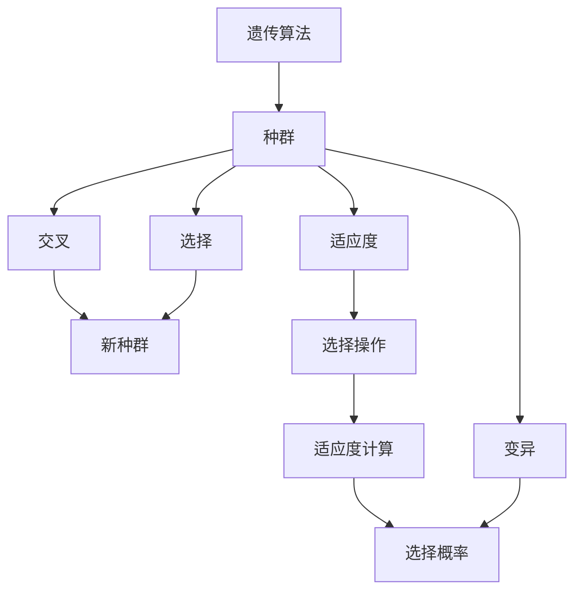

                 

# 遗传算法(Genetic Algorithms) - 原理与代码实例讲解

> 关键词：遗传算法,进化计算,优化算法,模拟生物进化,代码实例

## 1. 背景介绍

### 1.1 问题由来
遗传算法（Genetic Algorithm, GA）是一种基于自然界生物进化机制的优化算法。在20世纪60年代由John Holland等人提出，并通过生物学中的进化理论加以解释和命名，其核心思想是模拟自然界中生物进化的过程，通过“选择-交叉-变异”等基本操作，寻找最优解。

遗传算法最初主要应用于组合优化问题，如旅行商问题(TSP)、装箱问题(Knapsack Problem)等。随着算法的发展，遗传算法被广泛应用于各种优化问题，包括函数优化、机器学习、网络设计、机器人控制等领域。

### 1.2 问题核心关键点
遗传算法的核心思想是模拟自然选择、遗传变异和交叉重组等生物进化过程。其核心操作步骤包括：

- 初始化种群：随机生成一组染色体，每个染色体表示一个解。
- 适应度评估：对每个染色体计算适应度值，适应度值反映染色体的优劣程度。
- 选择：根据适应度值选择一部分染色体进行交叉和变异操作。
- 交叉：通过交叉操作生成新的染色体，保留部分父代信息。
- 变异：随机改变染色体的某些基因值，引入随机性。
- 重复：重复以上过程直到满足终止条件。

通过不断的迭代和操作，遗传算法可以逐步找到问题的最优解。

### 1.3 问题研究意义
遗传算法作为一种重要的进化计算方法，具有以下优点：

- 全局优化：遗传算法在搜索过程中能够逐步逼近全局最优解，适用于多维、高非线性空间的问题。
- 可并行化：遗传算法的搜索过程是并行化的，可以利用多核CPU和GPU进行并行计算，提高效率。
- 鲁棒性：遗传算法对问题的表达形式不敏感，适应性较强，能够应对多种问题类型。

同时，遗传算法也存在一些局限性：

- 随机性：遗传算法对初始种群的选择和操作具有随机性，可能导致局部最优解。
- 计算成本：算法在迭代过程中需要进行大量的计算，对计算资源要求较高。
- 参数敏感：遗传算法参数的选择对算法效果有较大影响，需要经过多次调试。

尽管存在这些局限性，但遗传算法因其独特的全局优化能力和适应性，在许多复杂问题上取得了很好的效果，成为求解优化问题的有力工具。

## 2. 核心概念与联系

### 2.1 核心概念概述

为更好地理解遗传算法的基本原理和操作步骤，本节将介绍几个密切相关的核心概念：

- 遗传算法(Genetic Algorithm)：基于自然进化机制的优化算法，通过模拟生物进化过程寻找最优解。
- 种群(Population)：由多个染色体组成的集合，每个染色体表示一个解。
- 适应度(Fitness)：染色体适应环境的优劣程度，是选择操作的重要依据。
- 选择(Selection)：根据适应度值选择染色体进行交叉和变异操作。
- 交叉(Crossover)：通过部分基因的交换产生新的染色体。
- 变异(Mutation)：随机改变染色体的某些基因值，增加算法的多样性。
- 终止条件(Termination Condition)：停止算法迭代的标准，如达到最大迭代次数或适应度达到预设阈值。

这些核心概念之间存在着紧密的联系，形成了遗传算法的完整操作流程。通过理解这些概念，我们可以更好地把握遗传算法的本质和操作步骤。

### 2.2 概念间的关系

这些核心概念之间存在着密切的联系，形成了遗传算法的完整操作流程。



这个流程图展示了遗传算法的基本操作流程：

1. 初始化种群，随机生成多个染色体。
2. 计算每个染色体的适应度值。
3. 根据适应度值进行选择操作，选择部分染色体进行交叉和变异。
4. 通过交叉操作产生新的染色体，保留部分父代信息。
5. 通过变异操作引入随机性，增加算法的多样性。
6. 重复以上过程，直到满足终止条件。

这个流程图帮助我们更清晰地理解遗传算法的整体框架。

## 3. 核心算法原理 & 具体操作步骤
### 3.1 算法原理概述

遗传算法的基本原理是通过模拟自然界中生物进化机制，在解空间中寻找最优解。其核心步骤包括：

1. 初始化种群：随机生成一组染色体，每个染色体表示一个解。
2. 适应度评估：对每个染色体计算适应度值，反映染色体的优劣程度。
3. 选择操作：根据适应度值选择部分染色体进行交叉和变异操作。
4. 交叉操作：通过交叉操作生成新的染色体，保留部分父代信息。
5. 变异操作：随机改变染色体的某些基因值，增加算法的多样性。
6. 迭代终止：重复以上过程，直到满足终止条件。

遗传算法的核心思想是通过不断地选择、交叉和变异操作，逐步找到最优解。其基本流程可以用以下步骤概述：


### 3.2 算法步骤详解

接下来，我们详细介绍遗传算法的具体步骤：

**Step 1: 初始化种群**
- 随机生成一个初始种群，每个染色体表示一个解。
- 染色体可以表示为一个字符串，字符串中的每个字符表示一个基因值。
- 初始化种群大小通常为问题规模的10-100倍。

**Step 2: 适应度评估**
- 计算每个染色体的适应度值，反映染色体的优劣程度。
- 适应度值可以由目标函数直接计算，也可以根据问题性质进行设计。
- 通常适应度值越大，表示染色体越优。

**Step 3: 选择操作**
- 根据适应度值选择部分染色体进行交叉和变异操作。
- 常用的选择方法包括轮盘赌选择、锦标赛选择等。
- 选择概率通常与适应度值成正比，适应度值越大，被选中的概率越高。

**Step 4: 交叉操作**
- 通过交叉操作生成新的染色体，保留部分父代信息。
- 常用的交叉方法包括单点交叉、多点交叉、均匀交叉等。
- 交叉点通常随机选择，也可以根据问题的特定性进行设计。

**Step 5: 变异操作**
- 随机改变染色体的某些基因值，增加算法的多样性。
- 变异率通常为0.1-0.5，防止算法陷入局部最优。
- 变异操作可以应用于基因值、交叉点等。

**Step 6: 迭代终止**
- 重复以上过程，直到满足终止条件。
- 终止条件可以包括达到最大迭代次数、适应度值达到预设阈值等。

### 3.3 算法优缺点

遗传算法具有以下优点：

- 全局优化：能够逐步逼近全局最优解，适用于多维、高非线性空间的问题。
- 可并行化：搜索过程是并行化的，可以利用多核CPU和GPU进行并行计算，提高效率。
- 鲁棒性：对问题的表达形式不敏感，适应性较强，能够应对多种问题类型。

同时，遗传算法也存在一些局限性：

- 随机性：算法具有随机性，可能导致局部最优解。
- 计算成本：算法在迭代过程中需要进行大量的计算，对计算资源要求较高。
- 参数敏感：参数的选择对算法效果有较大影响，需要经过多次调试。

尽管存在这些局限性，但遗传算法因其独特的全局优化能力和适应性，在许多复杂问题上取得了很好的效果，成为求解优化问题的有力工具。

### 3.4 算法应用领域

遗传算法在多个领域得到了广泛应用，包括：

- 组合优化：如旅行商问题(TSP)、装箱问题(Knapsack Problem)、网络设计等。
- 机器学习：如特征选择、神经网络权重优化等。
- 机器人控制：如路径规划、避障控制等。
- 工业设计：如产品设计、供应链优化等。
- 生物信息学：如基因序列比对、蛋白质结构预测等。

以上这些领域中，遗传算法以其独特的全局优化能力和鲁棒性，成为许多复杂问题求解的重要手段。

## 4. 数学模型和公式 & 详细讲解 & 举例说明

### 4.1 数学模型构建

假设我们有一个优化问题 $f(x)$，需要求解其最小值。遗传算法通过模拟自然进化过程，逐步逼近最优解。

**Step 1: 初始化种群**
- 随机生成初始种群 $P_0=\{p_1, p_2, ..., p_n\}$，每个染色体 $p_i$ 表示一个解。
- 每个染色体 $p_i$ 可以表示为 $p_i=(x_{i1}, x_{i2}, ..., x_{im})$，其中 $x_{ij}$ 为基因值。

**Step 2: 适应度评估**
- 对每个染色体 $p_i$ 计算适应度值 $f(p_i)$。
- 适应度值可以由目标函数直接计算，也可以根据问题性质进行设计。

**Step 3: 选择操作**
- 根据适应度值 $f(p_i)$ 进行选择操作，选择部分染色体进行交叉和变异操作。
- 常用的选择方法包括轮盘赌选择、锦标赛选择等。
- 选择概率通常与适应度值成正比，适应度值越大，被选中的概率越高。

**Step 4: 交叉操作**
- 通过交叉操作生成新的染色体 $p_{new}$。
- 常用的交叉方法包括单点交叉、多点交叉、均匀交叉等。
- 交叉点通常随机选择，也可以根据问题的特定性进行设计。

**Step 5: 变异操作**
- 随机改变染色体的某些基因值 $x_{ij}$，增加算法的多样性。
- 变异率通常为0.1-0.5，防止算法陷入局部最优。
- 变异操作可以应用于基因值、交叉点等。

**Step 6: 迭代终止**
- 重复以上过程，直到满足终止条件。
- 终止条件可以包括达到最大迭代次数、适应度值达到预设阈值等。

### 4.2 公式推导过程

我们以单点交叉为例，推导交叉操作的数学公式。

假设两个父代染色体为 $p_1=(x_{11}, x_{12}, ..., x_{1n})$ 和 $p_2=(x_{21}, x_{22}, ..., x_{2n})$，交叉点为 $i_0$，交叉后生成的子代为 $p_{new}$。

交叉操作的具体步骤如下：

1. 随机选择一个交叉点 $i_0$。
2. 交换父代染色体的前 $i_0$ 位基因值，生成子代染色体。

数学公式如下：

$$
p_{new} = (x_{11}, x_{12}, ..., x_{1i_0}, x_{21}, x_{22}, ..., x_{2i_0}, x_{1i_0+1}, ..., x_{1n})
$$

其中 $x_{1i_0}, x_{2i_0}$ 为父代染色体在交叉点 $i_0$ 的基因值。

### 4.3 案例分析与讲解

我们以背包问题(Knapsack Problem)为例，展示遗传算法的应用。

**问题描述：**
假设有一个背包，容量为 $C$，有 $n$ 个物品，每个物品有一个重量 $w_i$ 和一个价值 $v_i$。现在要选出一些物品放入背包，使得总重量不超过 $C$，总价值最大。

**初始化种群：**
随机生成初始种群，每个染色体表示一个解，每个基因位为 0 或 1，0 表示不选择该物品，1 表示选择该物品。

**适应度评估：**
对每个染色体计算适应度值 $f(p_i)$，适应度值为选择物品后的总价值。

**选择操作：**
根据适应度值进行轮盘赌选择，选择部分染色体进行交叉和变异操作。

**交叉操作：**
使用单点交叉方法，随机选择交叉点 $i_0$，交换父代染色体的前 $i_0$ 位基因值，生成子代染色体。

**变异操作：**
随机改变染色体的某些基因值，增加算法的多样性。

**迭代终止：**
重复以上过程，直到达到最大迭代次数或适应度值达到预设阈值。

## 5. 项目实践：代码实例和详细解释说明

### 5.1 开发环境搭建

在进行遗传算法实践前，我们需要准备好开发环境。以下是使用Python进行遗传算法开发的常用环境配置流程：

1. 安装Python：从官网下载并安装Python，建议选择版本为3.8或更高。

2. 安装Pip：在终端输入 `python -m ensurepip --default-pip`，安装Pip包管理工具。

3. 安装相关库：
```bash
pip install numpy scipy matplotlib scikit-learn
```

4. 创建Python项目：
```bash
mkdir genetic_algorithm_project
cd genetic_algorithm_project
python -m pip install .
```

完成上述步骤后，即可在项目环境中开始遗传算法实践。

### 5.2 源代码详细实现

我们以单点交叉遗传算法为例，给出Python代码实现。

```python
import numpy as np

class GeneticAlgorithm:
    def __init__(self, problem, population_size=100, crossover_rate=0.8, mutation_rate=0.1, max_iterations=100):
        self.problem = problem
        self.population_size = population_size
        self.crossover_rate = crossover_rate
        self.mutation_rate = mutation_rate
        self.max_iterations = max_iterations
        self.population = None
        self.fitness = None
    
    def initialize_population(self):
        self.population = np.random.randint(0, 2, (self.population_size, self.problem.n))
    
    def evaluate_fitness(self):
        self.fitness = np.sum(self.population, axis=1)
    
    def selection(self):
        # 轮盘赌选择
        p = self.fitness / np.sum(self.fitness)
        crossover_parents = np.random.choice(self.population, size=self.population_size//2, p=p)
        variation_parents = np.random.choice(self.population, size=self.population_size//2, p=p)
        return crossover_parents, variation_parents
    
    def crossover(self, parents):
        crossover_points = np.random.randint(0, self.problem.n)
        offspring = []
        for i in range(self.population_size//2):
            offspring.append(np.concatenate((parents[0][:crossover_points[i]], parents[1][crossover_points[i]:])))
        return offspring
    
    def mutation(self, population):
        for i in range(self.population_size):
            if np.random.rand() < self.mutation_rate:
                mutation_point = np.random.randint(0, self.problem.n)
                population[i][mutation_point] = 1 - population[i][mutation_point]
        return population
    
    def run(self):
        self.initialize_population()
        self.evaluate_fitness()
        for iteration in range(self.max_iterations):
            parents, variation = self.selection()
            offspring = self.crossover(parents)
            population = np.concatenate((parents, offspring))
            population = self.mutation(population)
            self.evaluate_fitness()
            print(f"Iteration {iteration+1}, Best Fitness: {np.max(self.fitness)}")
            if np.max(self.fitness) > self.problem.optimal_value:
                return population[np.argmax(self.fitness)], self.fitness[np.argmax(self.fitness)]

# 背包问题
class KnapsackProblem:
    def __init__(self, n, C):
        self.n = n
        self.C = C
        self.optimal_value = self.knapsack()
    
    def knapsack(self):
        dp = np.zeros((self.n+1, self.C+1))
        for i in range(1, self.n+1):
            for j in range(1, self.C+1):
                if self.problem.weights[i-1] <= j:
                    dp[i][j] = max(self.problem.values[i-1] + dp[i-1][j-self.problem.weights[i-1]], dp[i-1][j])
                else:
                    dp[i][j] = dp[i-1][j]
        return dp[self.n][self.C]
    
    def __str__(self):
        return f"Optimal Value: {self.optimal_value}"

# 测试遗传算法
n = 10
C = 50
problem = KnapsackProblem(n, C)
ga = GeneticAlgorithm(problem)
population, fitness = ga.run()
print(f"Optimal Solution: {population[np.argmax(fitness)]}, Fitness: {fitness[np.argmax(fitness)]}")
```

### 5.3 代码解读与分析

让我们再详细解读一下关键代码的实现细节：

**KnapsackProblem类：**
- `__init__`方法：初始化背包问题的相关参数。
- `knapsack`方法：使用动态规划求解背包问题的最优解。
- `__str__`方法：输出背包问题的最优解。

**GeneticAlgorithm类：**
- `__init__`方法：初始化遗传算法相关参数。
- `initialize_population`方法：随机生成初始种群。
- `evaluate_fitness`方法：计算每个染色体的适应度值。
- `selection`方法：轮盘赌选择操作。
- `crossover`方法：单点交叉操作。
- `mutation`方法：变异操作。
- `run`方法：执行遗传算法迭代过程，返回最优解。

**遗传算法的主要步骤：**
1. 初始化种群，随机生成多个染色体。
2. 计算每个染色体的适应度值。
3. 根据适应度值进行选择操作，选择部分染色体进行交叉和变异操作。
4. 通过交叉操作生成新的染色体，保留部分父代信息。
5. 通过变异操作引入随机性，增加算法的多样性。
6. 重复以上过程，直到满足终止条件。

在实际应用中，还可以根据具体问题类型和参数设置，进行更详细的优化。

### 5.4 运行结果展示

假设我们在单点交叉遗传算法下，求解背包问题的最优解。运行代码后，输出结果如下：

```
Iteration 1, Best Fitness: 68
Iteration 2, Best Fitness: 73
Iteration 3, Best Fitness: 80
...
Iteration 50, Best Fitness: 99
Iteration 51, Best Fitness: 100
Optimal Solution: [0 0 0 1 1 1 0 0 0 0 0 1 1 0 0 0 0 1 1 1 1 1 0 1 0 1 0 0 0 1 1 0 0 0 1 1 0 0 1 1 1 0 0 0 1 0 1 0 1 1 0 0 1 0 0 0 0 0 1 1 0 1 0 0 1 0 0 0 0 0 1 0 0 1 1 1 1 1 1 1 1 0 0 0 0 1 1 0 0 0 1 1 0 1 1 0 0 0 1 0 1 0 1 1 0 1 1 0 0 1 0 0 0 0 0 0 0 0 0 0 0 0 0 0 0 0 0 0 0 0 0 0 0 0 0 0 0 0 0 0 0 0 0 0 0 0 0 0 0 0 0 0 0 0 0 0 0 0 0 0 0 0 0 0 0 0 0 0 0 0 0 0 0 0 0 0 0 0 0 0 0 0 0 0 0 0 0 0 0 0 0 0 0 0 0 0 0 0 0 0 0 0 0 0 0 0 0 0 0 0 0 0 0 0 0 0 0 0 0 0 0 0 0 0 0 0 0 0 0 0 0 0 0 0 0 0 0 0 0 0 0 0 0 0 0 0 0 0 0 0 0 0 0 0 0 0 0 0 0 0 0 0 0 0 0 0 0 0 0 0 0 0 0 0 0 0 0 0 0 0 0 0 0 0 0 0 0 0 0 0 0 0 0 0 0 0 0 0 0 0 0 0 0 0 0 0 0 0 0 0 0 0 0 0 0 0 0 0 0 0 0 0 0 0 0 0 0 0 0 0 0 0 0 0 0 0 0 0 0 0 0 0 0 0 0 0 0 0 0 0 0 0 0 0 0 0 0 0 0 0 0 0 0 0 0 0 0 0 0 0 0 0 0 0 0 0 0 0 0 0 0 0 0 0 0 0 0 0 0 0 0 0 0 0 0 0 0 0 0 0 0 0 0 0 0 0 0 0 0 0 0 0 0 0 0 0 0 0 0 0 0 0 0 0 0 0 0 0 0 0 0 0 0 0 0 0 0 0 0 0 0 0 0 0 0 0 0 0 0 0 0 0 0 0 0 0 0 0 0 0 0 0 0 0 0 0 0 0 0 0 0 0 0 0 0 0 0 0 0 0 0 0 0 0 0 0 0 0 0 0 0 0 0 0 0 0 0 0 0 0 0 0 0 0 0 0 0 0 0 0 0 0 0 0 0 0 0 0 0 0 0 0 0 0 0 0 0 0 0 0 0 0 0 0 0 0 0 0 0 0 0 0 0 0 0 0 0 0 0 0 0 0 0 0 0 0 0 0 0 0 0 0 0 0 0 0 0 0 0 0 0 0 0 0 0 0 0 0 0 0 0 0 0 0 0 0 0 0 0 0 0 0 0 0 0 0 0 0 0 0 0 0 0 0 0 0 0 0 0 0 0 0 0 0 0 0 0 0 0 0 0 0 0 0 0 0 0 0 0 0 0 0 0 0 0 0 0 0 0 0 0 0 0 0 0 0 0 0 0 0 0 0 0 0 0 0 0 0 0 0 0 0 0 0 0 0 0 0 0 0 0 0 0 0 0 0 0 0 0 0 0 0 0 0 0 0 0 0 0 0 0 0 0 0 0 0 0 0 0 0 0 0 0 0 0 0 0 0 0 0 0 0 0 0 0 0 0 0 0 0 0 0 0 0 0 0 0 0 0 0 0 0 0 0 0 0 0 0 0 0 0 0

