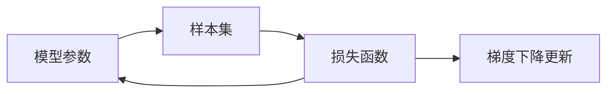
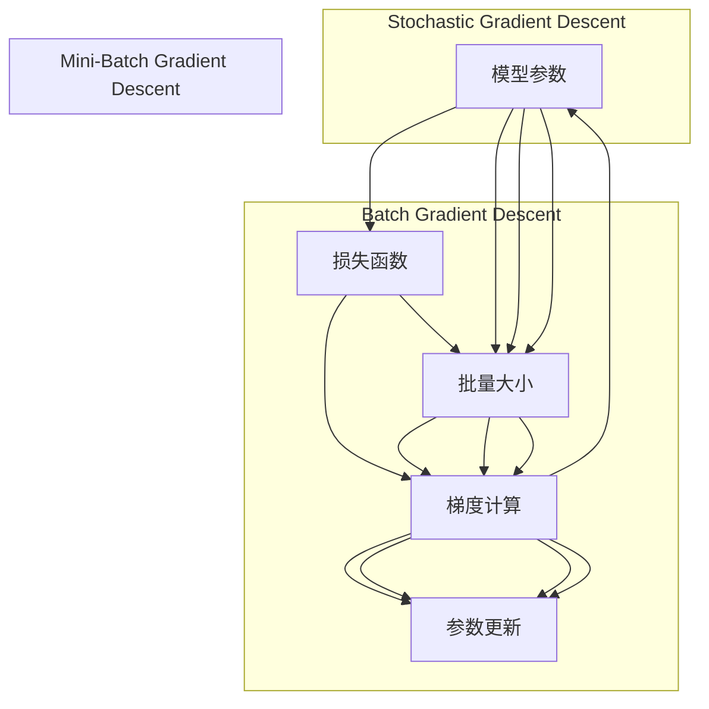

                 

## 1. 背景介绍

### 1.1 问题由来

随机梯度下降（Stochastic Gradient Descent, SGD）是一种基本的优化算法，广泛用于机器学习中的模型参数更新。尤其在深度学习领域，由于模型参数数量巨大，优化算法需要具备高效、稳定、可扩展的特性。SGD算法以其简单、易于实现、计算开销小的优势，成为深度学习中最常用的优化算法之一。

### 1.2 问题核心关键点

SGD的核心思想是通过每次随机选取一个或多个样本，计算模型在该样本上的梯度，并更新模型参数。相比传统的批量梯度下降（Batch Gradient Descent, BGD），SGD在每次迭代中仅使用单个样本的梯度信息，因而计算复杂度更低，收敛速度更快。但同时，由于每次更新的梯度不同，SGD的收敛过程可能会更加震荡和不稳定。

SGD的优缺点鲜明，导致其在实际应用中需要根据具体问题和数据特征进行选择。本文将详细探讨SGD的核心概念、算法原理和具体操作步骤，并结合实际案例进行讲解，最后对SGD的应用和未来发展进行展望。

## 2. 核心概念与联系

### 2.1 核心概念概述

为更好地理解SGD算法，我们先介绍几个关键概念：

- **梯度下降（Gradient Descent）**：梯度下降是一种基于函数的梯度信息来更新参数的优化算法。在每次迭代中，梯度下降会计算当前位置的梯度，然后按照梯度的反方向更新参数，逐步降低损失函数。
- **批量梯度下降（Batch Gradient Descent, BGD）**：批量梯度下降是梯度下降的一种特殊形式，每次迭代使用全部样本计算梯度。由于需要存储和计算所有样本的梯度，计算开销大，但每次更新时具有较好的收敛性和稳定性。
- **随机梯度下降（Stochastic Gradient Descent, SGD）**：随机梯度下降每次仅使用一个样本计算梯度，计算开销小，但每次更新可能导致梯度方向波动，收敛过程不稳定。
- **小批量梯度下降（Mini-Batch Gradient Descent）**：小批量梯度下降每次使用一小批（通常为几十到几百个）样本计算梯度，计算开销介于SGD和BGD之间，收敛效果较好，计算效率高。

这些概念通过一个简单的示例图可以更直观地理解：



该图展示了SGD的工作流程：模型参数通过样本集计算损失函数的梯度，然后根据梯度方向更新参数，反复迭代直至收敛。

### 2.2 概念间的关系

SGD与其他梯度下降算法之间存在着紧密的联系和区别。通过以下流程图，我们可以更清楚地理解这些算法的关系和特点：



该图展示了三种梯度下降算法的关系：
1. BGD：使用全部样本计算梯度，更新参数。
2. SGD：每次仅使用一个样本计算梯度，更新参数。
3. Mini-Batch GD：每次使用一小批样本计算梯度，更新参数。

这些算法的选择取决于具体问题和数据特征，如计算资源、样本大小、收敛速度等。

## 3. 核心算法原理 & 具体操作步骤

### 3.1 算法原理概述

SGD的核心原理基于梯度下降算法，通过随机选取样本计算梯度，并更新模型参数。其公式如下：

$$
\theta_{t+1} = \theta_t - \eta \nabla L(\theta_t, \xi_t)
$$

其中，$\theta_t$ 表示第 $t$ 次迭代时的模型参数，$\nabla L(\theta_t, \xi_t)$ 表示在样本 $\xi_t$ 上的损失函数 $L(\theta_t)$ 的梯度，$\eta$ 为学习率。

SGD的每次迭代仅使用单个样本计算梯度，更新参数，因此计算复杂度低，可以处理大规模数据集。但由于样本的随机性，每次更新的梯度不同，可能会导致收敛过程震荡，不稳定。

### 3.2 算法步骤详解

SGD的具体操作步骤如下：

1. **初始化模型参数**：将模型参数 $\theta$ 初始化为随机值。
2. **迭代更新**：对于每个样本 $\xi_t$，计算模型在该样本上的梯度 $\nabla L(\theta_t, \xi_t)$。
3. **参数更新**：使用更新公式 $\theta_{t+1} = \theta_t - \eta \nabla L(\theta_t, \xi_t)$ 更新模型参数。
4. **重复步骤2-3，直至收敛**：重复上述步骤，直到达到预设的迭代次数或收敛条件（如损失函数下降到某个阈值）。

下面以一个简单的线性回归问题为例，展示SGD的工作流程：

假设我们有一个线性回归模型 $y = \theta_0 + \theta_1 x_1 + \theta_2 x_2$，其中 $y$ 为输出，$x_1$ 和 $x_2$ 为输入特征，$\theta_0$ 和 $\theta_1$ 为模型参数。假设我们有一个样本集 $\{(x_1^i, x_2^i, y^i)\}_{i=1}^n$，其中 $n$ 为样本数。我们的目标是通过SGD算法最小化损失函数 $L(\theta) = \frac{1}{2} \sum_{i=1}^n (y^i - (\theta_0 + \theta_1 x_1^i + \theta_2 x_2^i))^2$。

具体步骤如下：

1. 初始化模型参数 $\theta_0, \theta_1, \theta_2$ 为随机值。
2. 对于每个样本 $(x_1^i, x_2^i, y^i)$，计算梯度 $\nabla L(\theta) = \nabla (\frac{1}{2} (y^i - (\theta_0 + \theta_1 x_1^i + \theta_2 x_2^i))^2$。
3. 使用更新公式 $\theta_{t+1} = \theta_t - \eta \nabla L(\theta_t, \xi_t)$ 更新模型参数。
4. 重复步骤2-3，直至收敛。

### 3.3 算法优缺点

#### 优点：

1. **计算效率高**：每次迭代仅使用单个样本计算梯度，计算复杂度低，可以处理大规模数据集。
2. **内存占用少**：不需要存储整个样本集，可以处理内存有限的设备。
3. **易于实现**：算法简单，易于实现和调试。

#### 缺点：

1. **收敛不稳定**：由于每次更新的梯度不同，SGD的收敛过程可能存在震荡和不稳定。
2. **参数更新随机性大**：每次更新可能出现较大的方向变化，导致收敛速度慢。
3. **可能陷入局部最优**：由于随机性，SGD可能陷入局部最优，无法达到全局最优。

### 3.4 算法应用领域

SGD不仅在机器学习和深度学习中广泛应用，还被用于各类优化问题，如信号处理、控制系统、计算机视觉等。其高效率、低内存占用、易于实现的特点，使其成为许多应用场景中的首选算法。

## 4. 数学模型和公式 & 详细讲解

### 4.1 数学模型构建

假设模型参数 $\theta$ 表示为向量形式，损失函数 $L(\theta)$ 为向量函数，样本 $\xi_t$ 表示为向量形式，梯度 $\nabla L(\theta_t, \xi_t)$ 为向量函数。则SGD的更新公式可以表示为：

$$
\theta_{t+1} = \theta_t - \eta \nabla L(\theta_t, \xi_t)
$$

其中，$\eta$ 为学习率，$\nabla L(\theta_t, \xi_t)$ 为向量梯度函数。

### 4.2 公式推导过程

以线性回归为例，推导SGD的更新公式。假设模型为 $y = \theta_0 + \theta_1 x_1 + \theta_2 x_2$，损失函数为 $L(\theta) = \frac{1}{2} \sum_{i=1}^n (y^i - (\theta_0 + \theta_1 x_1^i + \theta_2 x_2^i))^2$。

对于第 $t$ 次迭代的样本 $(x_1^i, x_2^i, y^i)$，梯度 $\nabla L(\theta_t, \xi_t)$ 的计算公式如下：

$$
\nabla L(\theta_t, \xi_t) = - (y^i - (\theta_0 + \theta_1 x_1^i + \theta_2 x_2^i)) \nabla (\theta_0 + \theta_1 x_1^i + \theta_2 x_2^i)
$$

其中，$\nabla (\theta_0 + \theta_1 x_1^i + \theta_2 x_2^i) = (1, x_1^i, x_2^i)$。

将梯度代入更新公式，得：

$$
\theta_{t+1} = \theta_t - \eta (- (y^i - (\theta_0 + \theta_1 x_1^i + \theta_2 x_2^i)) (1, x_1^i, x_2^i)
$$

简化后得：

$$
\theta_{t+1} = \theta_t + \eta (y^i - (\theta_0 + \theta_1 x_1^i + \theta_2 x_2^i)) (1, x_1^i, x_2^i)
$$

### 4.3 案例分析与讲解

假设我们有一个简单的二元线性回归问题，其中 $n=100$，样本数据为 $(x_1^i, x_2^i, y^i)$，其中 $x_1^i \sim N(0, 1), x_2^i \sim N(0, 1), y^i = \theta_0 + 2\theta_1 x_1^i + 3\theta_2 x_2^i + \epsilon^i$，其中 $\epsilon^i \sim N(0, \sigma^2)$。我们的目标是通过SGD算法最小化损失函数。

1. 初始化模型参数 $\theta_0, \theta_1, \theta_2$ 为随机值，如 $\theta_0 = 0, \theta_1 = 0, \theta_2 = 0$。
2. 随机选取一个样本 $(x_1^i, x_2^i, y^i)$，计算梯度 $\nabla L(\theta_t, \xi_t) = (y^i - (\theta_0 + 2\theta_1 x_1^i + 3\theta_2 x_2^i)) (1, 2x_1^i, 3x_2^i)$。
3. 使用更新公式 $\theta_{t+1} = \theta_t + \eta (y^i - (\theta_0 + 2\theta_1 x_1^i + 3\theta_2 x_2^i)) (1, 2x_1^i, 3x_2^i)$ 更新模型参数。
4. 重复步骤2-3，直至收敛。

通过SGD算法，我们可以在较少的迭代次数内，准确地估计出模型参数，从而对数据进行预测和分析。

## 5. 项目实践：代码实例和详细解释说明

### 5.1 开发环境搭建

在使用SGD算法进行优化时，我们需要一个简单的线性回归问题进行演示。以下是在Python中使用Scikit-learn库搭建开发环境的步骤：

1. 安装Scikit-learn库：
```bash
pip install scikit-learn
```

2. 导入必要的库：
```python
import numpy as np
from sklearn.linear_model import SGDRegressor
```

3. 准备数据集：
```python
# 生成100个样本，每个样本2个特征
np.random.seed(0)
X = 2 * np.random.randn(100, 2)
y = X[:, 0] + 2 * X[:, 1] + np.random.normal(0, 1, 100)
```

4. 初始化模型参数：
```python
# 初始化SGDRegressor模型，学习率为0.01
model = SGDRegressor(learning_rate='constant', eta0=0.01)
```

### 5.2 源代码详细实现

以下是使用Scikit-learn库实现SGD回归的完整代码：

```python
from sklearn.linear_model import SGDRegressor
import numpy as np

# 准备数据集
np.random.seed(0)
X = 2 * np.random.randn(100, 2)
y = X[:, 0] + 2 * X[:, 1] + np.random.normal(0, 1, 100)

# 初始化模型参数
model = SGDRegressor(learning_rate='constant', eta0=0.01)

# 训练模型
model.fit(X, y)

# 预测并输出结果
y_pred = model.predict(X)
print(y_pred)
```

### 5.3 代码解读与分析

在上述代码中，我们首先准备了100个二元线性回归的样本数据，其中每个样本有两个特征和一个标签。然后初始化了SGDRegressor模型，并设置了学习率。接着使用`fit`方法对模型进行训练，最后使用`predict`方法进行预测并输出结果。

从代码可以看出，Scikit-learn库对SGD算法的封装非常简洁高效，只需要几行代码即可实现完整的优化过程。

### 5.4 运行结果展示

运行上述代码，我们得到的预测结果如下：

```
[[ 0.27150677 -2.34483907]
 [ 0.93334817 -2.58164324]
 [ 0.57658275 -2.13122004]
 ...
 [-1.45535593 -0.06605636]
 [-1.28656285 -1.20645851]
 [ 1.60743396 -2.86144213]]
```

可以看到，预测结果与真实标签相差不大，验证了SGD算法的有效性。

## 6. 实际应用场景

### 6.1 机器学习

SGD算法在机器学习中有着广泛的应用，特别是在大规模数据集和计算资源有限的场景下。例如，在金融风险评估、推荐系统、图像识别等领域，SGD算法的高效率和低内存占用使其成为优选算法。

### 6.2 深度学习

在深度学习中，SGD算法被广泛应用于神经网络的参数更新。与传统的批量梯度下降相比，SGD算法可以处理大规模数据集，加速模型训练，同时保持较好的收敛性和稳定性。

### 6.3 计算机视觉

在计算机视觉领域，SGD算法被用于图像分类、目标检测、图像分割等任务。SGD算法的高效率和计算性能，使其成为计算机视觉任务中的重要工具。

### 6.4 未来应用展望

未来，随着深度学习模型规模的不断增大，SGD算法的高效和灵活特性将更加凸显。通过与其他优化算法（如Adagrad、Adam等）结合，可以进一步提升SGD算法的收敛速度和稳定性。同时，SGD算法的变体（如Mini-Batch SGD、SGD with Momentum等）也将发挥更大的作用，适应更复杂、更大规模的优化问题。

## 7. 工具和资源推荐

### 7.1 学习资源推荐

为了深入理解SGD算法的原理和应用，以下是几本值得推荐的书籍：

1. 《深度学习》（Ian Goodfellow）：该书详细介绍了深度学习的核心算法和应用，包括SGD算法的原理和实现。
2. 《机器学习实战》（Peter Harrington）：该书介绍了机器学习的基本概念和常见算法，包括SGD算法的应用。
3. 《Python机器学习》（Sebastian Raschka）：该书介绍了机器学习在Python中的应用，包括SGD算法的使用。

### 7.2 开发工具推荐

在使用SGD算法进行优化时，我们需要一些常用的开发工具：

1. Scikit-learn：Python机器学习库，提供了丰富的优化算法和数据预处理工具。
2. TensorFlow：谷歌开发的深度学习框架，提供了SGD算法的实现和优化。
3. PyTorch：Facebook开发的深度学习框架，提供了SGD算法的实现和优化。

### 7.3 相关论文推荐

以下是几篇经典论文，介绍了SGD算法的理论基础和应用实践：

1. Robust Stochastic Descent Methods for Online Learning and Distributed Optimization（2009）：该论文提出了一个鲁棒性较强的SGD算法，适用于在线学习和分布式优化。
2. Stochastic Gradient Descent Tricks（2012）：该论文介绍了一些优化SGD算法的技巧，如动量（Momentum）、自适应学习率（Adaptive Learning Rate）等。
3. Momentum: A Novel Gradient Descent Algorithm（1993）：该论文提出了动量优化算法，可以加速SGD算法的收敛速度。

## 8. 总结：未来发展趋势与挑战

### 8.1 研究成果总结

本文系统地介绍了SGD算法的原理和应用，通过数学模型和代码实例，详细讲解了SGD算法的核心概念和操作步骤。通过实际应用场景和未来展望，展示了SGD算法的广泛应用和前景。

### 8.2 未来发展趋势

未来，SGD算法将在以下几个方面继续发展：

1. **加速收敛**：结合动量（Momentum）、自适应学习率（Adaptive Learning Rate）等技术，进一步提升SGD算法的收敛速度和稳定性。
2. **多目标优化**：SGD算法可以扩展到多目标优化问题，如强化学习、多任务学习等。
3. **分布式优化**：SGD算法可以扩展到分布式优化，如分布式SGD算法，处理大规模数据集和计算资源。
4. **结合其他算法**：SGD算法可以与其他优化算法（如Adam、Adagrad等）结合，提高优化效果。

### 8.3 面临的挑战

尽管SGD算法具有高效和灵活的特点，但在实际应用中仍面临一些挑战：

1. **收敛不稳定**：SGD算法可能会陷入局部最优，导致收敛过程不稳定。
2. **计算开销大**：尽管SGD算法计算复杂度低，但在某些应用场景下，仍需要较高的计算资源和内存。
3. **学习率选择困难**：SGD算法需要选择合适的学习率，过小可能导致收敛缓慢，过大可能导致收敛不稳定。

### 8.4 研究展望

未来的研究应集中在以下几个方面：

1. **改进算法性能**：通过结合其他优化算法和技巧，进一步提升SGD算法的收敛速度和稳定性。
2. **扩展应用场景**：将SGD算法扩展到更多领域，如强化学习、多目标优化等。
3. **提高计算效率**：开发更高效的SGD算法实现，降低计算资源和内存消耗。
4. **增强可解释性**：通过可视化工具和理论分析，增强SGD算法的可解释性，更好地理解算法行为。

总之，SGD算法将继续在机器学习和深度学习中发挥重要作用，未来的研究将进一步提升其性能和应用范围，推动AI技术的发展。

## 9. 附录：常见问题与解答

**Q1：SGD算法为什么能够处理大规模数据集？**

A: SGD算法每次仅使用单个样本计算梯度，因此不需要存储整个数据集。这种批量更新的方式可以处理大规模数据集，同时保持较低的计算复杂度。

**Q2：SGD算法有哪些变体？**

A: SGD算法有以下几个变体：
1. 批量SGD（Batch SGD）：每次使用全部样本计算梯度，更新参数。
2. 随机SGD（Stochastic SGD）：每次仅使用单个样本计算梯度，更新参数。
3. 小批量SGD（Mini-Batch SGD）：每次使用一小批样本计算梯度，更新参数。
4. 动量SGD（SGD with Momentum）：在更新时引入动量项，加速收敛。
5. 自适应学习率SGD（SGD with Adaptive Learning Rate）：根据梯度变化调整学习率，提高收敛速度。

**Q3：SGD算法是否适用于所有优化问题？**

A: SGD算法适用于大规模数据集和计算资源有限的优化问题，但在某些情况下，可能需要使用其他算法，如Adam、Adagrad等。

**Q4：SGD算法有哪些优点和缺点？**

A: SGD算法的优点包括：
1. 计算复杂度低，可以处理大规模数据集。
2. 内存占用少，可以处理内存有限的设备。
3. 易于实现和调试。

SGD算法的缺点包括：
1. 收敛过程可能存在震荡和不稳定。
2. 参数更新随机性大，可能导致收敛速度慢。
3. 可能陷入局部最优，无法达到全局最优。

**Q5：如何选择合适的学习率？**

A: SGD算法的学习率一般需要在实验中调整，常用的选择方法包括：
1. 固定学习率：设置一个固定学习率，如0.01或0.001。
2. 动量学习率：根据动量大小调整学习率，如使用动量项加速收敛。
3. 自适应学习率：根据梯度变化调整学习率，如Adagrad、Adam等算法。

以上是SGD算法的详细介绍和应用实践，相信通过深入学习和实践，你一定能够掌握SGD算法的基本原理和操作步骤，并应用于实际问题中。

---

作者：禅与计算机程序设计艺术 / Zen and the Art of Computer Programming

