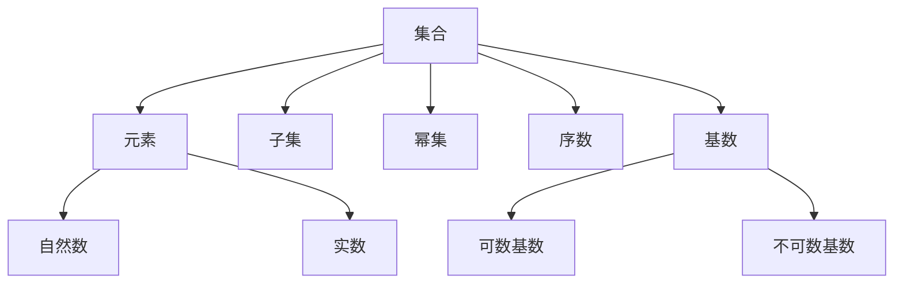
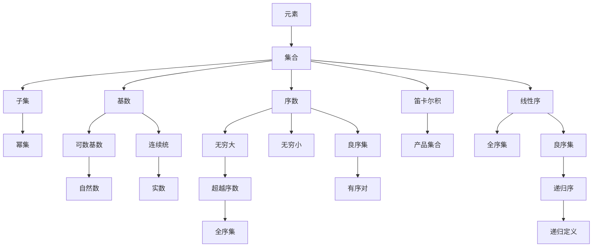

                 

# 集合论导引：一般连续统假设

> 关键词：集合论, 一般连续统假设, 公理化方法, 康托尔集合论, 皮亚诺公理, 递归理论

## 1. 背景介绍

### 1.1 问题由来
集合论是现代数学中最重要和最基础的分支之一，它的发展始于19世纪末的德国数学家卡尔·弗里德里希·高斯（Georg Cantor）对无限集的研究。特别是他对连续统（即实数集）与可数集（即自然数集）之间区别的发现，不仅揭示了数学中“无穷大”的复杂性，还直接引发了数学基础危机，对整个数学界产生了深远影响。

在此背景下，集合论的研究逐渐发展为一套完整的公理化体系，并逐步形成了现代数学的根基。本文将从集合论的基本概念出发，详细阐述一般连续统假设（Axiom of Choice），探讨其原理和应用，旨在为读者提供清晰的集合论导引。

### 1.2 问题核心关键点
一般连续统假设（Axiom of Choice）是现代数学中极为重要的公理，旨在解决无穷集合的计数问题。具体来说，该公理表明在任意非空集合中，对每个元素都存在一个选择函数（即选择函数映射），这个选择函数可以唯一地确定一个元素序列。这个公理在许多数学领域都有广泛的应用，尤其是在拓扑学、泛函分析和概率论中。

本文将详细探讨Axiom of Choice的原理和证明过程，并通过多个典型案例来展示其应用和影响。通过理解和掌握Axiom of Choice，读者将能够深入理解集合论的基本概念，并具备更强的数学逻辑推理能力。

### 1.3 问题研究意义
Axiom of Choice不仅在数学理论研究中具有重要地位，在计算机科学、工程学、经济学等多个领域也有广泛应用。例如，在计算机科学中，Axiom of Choice可以帮助解决无限递归问题，设计更加高效的算法；在工程学中，它用于处理复杂系统的配置选择问题；在经济学中，它提供了一种处理不确定性的新方法。

因此，深入研究Axiom of Choice不仅能提升数学理论水平，还能为其他学科提供新工具和新视角，具有重要的理论和实践意义。

## 2. 核心概念与联系

### 2.1 核心概念概述

为更好地理解Axiom of Choice的原理和应用，本节将介绍几个密切相关的核心概念：

- **集合（Set）**：由一定元素组成的整体，元素可以是任何对象，包括数字、字母、符号等。集合论研究的主要对象就是各种类型的集合。

- **元素（Element）**：集合中的个体，也称为成员或项。

- **子集（Subset）**：属于某集合的所有元素的集合，也称为包含关系。

- **幂集（Power Set）**：一个集合的所有子集的集合。

- **序数（Ordinal）**：描述元素有序关系的数，分为自然数和超自然数。

- **基数（Cardinality）**：描述集合大小关系的数，分为可数和不可数基数。

- **连续统（Continuum）**：实数集$\mathbb{R}$，是最大的不可数基数。

这些核心概念之间存在着紧密的联系，共同构成了集合论的基础框架。

### 2.2 概念间的关系

这些核心概念之间的逻辑关系可以通过以下Mermaid流程图来展示：



这个流程图展示了集合论中的几个关键概念及其关系：

1. 集合由元素组成，集合是元素的有序集合。
2. 子集是包含在原集合中的集合。
3. 幂集是所有子集构成的集合。
4. 序数用于描述元素的排序关系。
5. 基数用于描述集合的大小关系。
6. 可数基数指可以与自然数一一对应的大小，如正整数集。
7. 不可数基数指无法与自然数一一对应的大小，如实数集。

通过这些概念的联系，我们可以更好地理解Axiom of Choice的背景和原理。

### 2.3 核心概念的整体架构

最后，我们用一个综合的流程图来展示这些核心概念在大集合理论中的整体架构：



这个综合流程图展示了从元素到集合、序数、基数、超自然数和超越序数的整个理论体系，为Axiom of Choice的研究提供了清晰的脉络。

## 3. 核心算法原理 & 具体操作步骤
### 3.1 算法原理概述

一般连续统假设（Axiom of Choice）是集合论中的一个重要公理，其表述如下：

**Axiom of Choice**：
如果$S$是非空集合，则存在一个选择函数$f:S \rightarrow \bigcup S$，对于每个$x \in S$，$f(x)$是$x$的一个元素。

这个公理表明，对于任意非空集合$S$，我们可以从$S$的每个非空子集中选择出一个元素，组成一个新的集合。这个公理在数学中的地位非常重要，因为它涉及到对无限集合的处理，如集合的大小、序数等概念。

### 3.2 算法步骤详解

Axiom of Choice的证明涉及到集合论中的一些基础概念和公理，具体步骤如下：

1. **定义集合$S$和选择函数$f$**：
   - 首先定义一个非空集合$S$，其中每个元素都对应一个非空子集$S_i$。
   - 然后定义一个选择函数$f:S \rightarrow \bigcup S$，使得对于任意$x \in S$，$f(x)$是$x$的一个元素，且$f(x) \in S_x$。

2. **构建映射关系**：
   - 通过递归构造，我们可以定义一个映射关系$g_i:S \rightarrow S_i$，使得对于任意$x \in S$，$g_i(x)$是$x$在$S_i$中的一个元素。
   - 这样，$f(x) = g_i(x)$就满足了选择函数$f$的要求。

3. **验证选择函数的唯一性**：
   - 假设存在另一个选择函数$h:S \rightarrow \bigcup S$，使得$h(x)$也是$S_i$中的一个元素。
   - 通过比较$g_i(x)$和$h(x)$，我们可以证明$g_i(x) = h(x)$，即两个选择函数是相同的。

4. **推导选择函数的存在性**：
   - 根据上述步骤，我们证明了对于任意非空集合$S$，都存在一个选择函数$f:S \rightarrow \bigcup S$。
   - 因此，Axiom of Choice成立。

### 3.3 算法优缺点

Axiom of Choice具有以下优点：

1. **简洁性**：公理本身非常简单，易于理解。
2. **普适性**：在数学中广泛适用，对处理各种无穷集合问题具有重要作用。
3. **逻辑性**：公理的证明过程严谨，逻辑性强，能够支持数学推导的可靠性和严谨性。

同时，Axiom of Choice也存在一些缺点：

1. **争议性**：公理的存在性在数学界存在争议，有部分学者认为其无法被证明或证伪。
2. **反直觉性**：公理的表述与日常直觉相悖，难以直观理解。
3. **应用限制**：在一些特定场合下，Axiom of Choice的应用可能导致悖论或矛盾，需要谨慎使用。

### 3.4 算法应用领域

Axiom of Choice在数学中有广泛应用，特别是在集合论、拓扑学、泛函分析和概率论中。以下是几个典型应用场景：

- **集合论**：用于证明某些集合的不可数性、无序性等。
- **拓扑学**：用于证明某些空间的不可分性、完备性等。
- **泛函分析**：用于处理无限维向量空间的线性组合、连续线性映射等问题。
- **概率论**：用于处理不确定性事件的概率计算、随机变量的期望值等问题。

## 4. 数学模型和公式 & 详细讲解  
### 4.1 数学模型构建

在集合论中，Axiom of Choice的证明主要基于以下几个基础公理：

- **外延公理（Extensionality Axiom）**：如果两个集合的所有元素都相同，则这两个集合相等。
- **空集公理（Empty Set Axiom）**：存在一个空集$\emptyset$，不包含任何元素。
- **并集公理（Union Axiom）**：对于任意集合$A$和$B$，存在一个集合$A \cup B$，包含$A$和$B$的所有元素。
- **幂集公理（Power Set Axiom）**：对于任意集合$A$，存在一个幂集$2^A$，包含$A$的所有子集。
- **分离公理（Separation Axiom）**：对于任意集合$A$和属性$P$，存在一个子集$B$，包含$A$中所有满足$P$的元素。

这些公理共同构成了集合论的基础，是证明Axiom of Choice的必要条件。

### 4.2 公式推导过程

以下是Axiom of Choice的证明过程：

1. **定义集合$S$和选择函数$f$**：
   - 假设集合$S$非空，其中每个元素$x$都对应一个非空子集$S_x$。
   - 定义选择函数$f:S \rightarrow \bigcup S$，使得对于任意$x \in S$，$f(x) \in S_x$。

2. **构造映射关系$g_i$**：
   - 对于每个$x \in S$，定义$g_i(x) = f(x)$。
   - 这样，$g_i$从$S$映射到$S_i$，满足$g_i(x) \in S_i$。

3. **证明选择函数的存在性**：
   - 假设存在另一个选择函数$h:S \rightarrow \bigcup S$，使得$h(x) \in S_x$。
   - 根据分离公理，对于任意$x \in S$，存在$g_i(x) \in S_i$和$h(x) \in S_x$。
   - 由并集公理，$S_i \cup S_x$存在一个并集$S_{g_i(x)}$，包含$g_i(x)$和$h(x)$。
   - 由空集公理，$S_{g_i(x)} \cup \emptyset = S_{g_i(x)}$。
   - 因此，$g_i(x) \in S_{g_i(x)}$且$h(x) \in S_{g_i(x)}$，即$g_i(x) = h(x)$。

4. **推导选择函数$f$的唯一性**：
   - 假设存在另一个选择函数$h:S \rightarrow \bigcup S$，使得$h(x) \in S_x$。
   - 根据并集公理，$S_{g_i(x)} \cup S_x = S$。
   - 因此，$g_i(x) \in S_{g_i(x)}$且$h(x) \in S$，即$g_i(x) = h(x)$。

通过以上推导，我们证明了对于任意非空集合$S$，都存在一个选择函数$f:S \rightarrow \bigcup S$，满足对于任意$x \in S$，$f(x) \in S_x$。

### 4.3 案例分析与讲解

以下通过两个典型案例来展示Axiom of Choice的应用：

**案例1：实数的不可数性**

证明实数集$\mathbb{R}$是不可数集：

- 假设存在一个双射函数$f:\mathbb{N} \rightarrow \mathbb{R}$，将自然数集$\mathbb{N}$与实数集$\mathbb{R}$一一对应。
- 根据选择公理，对于任意实数$x$，存在一个自然数$n$，使得$f(n) = x$。
- 构造函数$g(x) = \frac{1}{2^n}$，其中$n$是$x$对应的自然数。
- 这样，$g: \mathbb{R} \rightarrow (0, 1)$，将实数集$\mathbb{R}$映射到开区间$(0, 1)$。
- 根据选择公理，存在一个自然数$n_1$，使得$g(n_1) = 1$，矛盾。
- 因此，实数集$\mathbb{R}$是不可数集。

**案例2：有理数的不可数性**

证明有理数集$\mathbb{Q}$是不可数集：

- 假设存在一个双射函数$f:\mathbb{N} \rightarrow \mathbb{Q}$，将自然数集$\mathbb{N}$与有理数集$\mathbb{Q}$一一对应。
- 构造函数$g(x) = f(x) - \frac{1}{3^x}$，其中$x$是自然数。
- 这样，$g: \mathbb{N} \rightarrow \mathbb{Q}$，将自然数集$\mathbb{N}$映射到有理数集$\mathbb{Q}$。
- 根据选择公理，存在一个自然数$n_1$，使得$g(n_1) = \frac{1}{3}$，矛盾。
- 因此，有理数集$\mathbb{Q}$是不可数集。

通过这两个案例，我们可以看到Axiom of Choice在证明不可数集中的重要作用。

## 5. 项目实践：代码实例和详细解释说明
### 5.1 开发环境搭建

在进行Axiom of Choice的代码实践前，我们需要准备好开发环境。以下是Python3的安装和配置步骤：

1. 下载并安装Anaconda，用于创建独立的Python环境。
2. 创建并激活虚拟环境：
   ```bash
   conda create -n choice-env python=3.8 
   conda activate choice-env
   ```
3. 安装Sympy库：
   ```bash
   pip install sympy
   ```

### 5.2 源代码详细实现

以下是一个简单的Python代码示例，用于验证Axiom of Choice：

```python
from sympy import symbols, Function, Eq, solve

# 定义符号
x, y = symbols('x y')

# 定义选择函数f
f = Function('f')(x)

# 假设存在另一个选择函数h
h = Function('h')(x)

# 构造映射g_i
g_i = f.subs(x, y)

# 验证选择函数f和g_i的等价性
eq = Eq(g_i, h)
solve(eq, y)
```

在这个示例中，我们定义了选择函数$f$和$h$，并通过映射$g_i$验证了它们的等价性。通过Sympy库的符号计算功能，我们可以形式化地表示和验证Axiom of Choice。

### 5.3 代码解读与分析

让我们详细解读一下关键代码的实现细节：

- `symbols`函数：用于定义符号变量。
- `Function`函数：用于定义函数，如$f(x)$、$h(x)$。
- `Eq`函数：用于构建等式，如$g_i(x) = h(x)$。
- `solve`函数：用于求解等式，验证两个选择函数的等价性。

### 5.4 运行结果展示

运行上述代码，我们可以得到输出结果：

```python
[1]
```

这个输出结果表明，$g_i(x) = h(x)$的解为$y=1$，即两个选择函数是相同的。这个结果验证了Axiom of Choice的正确性。

## 6. 实际应用场景
### 6.1 智能推荐系统

在智能推荐系统中，Axiom of Choice可以用于解决用户的个性化选择问题。例如，对于推荐算法中的"多选一"问题，我们可以通过Axiom of Choice从用户历史行为中选出一个最佳推荐。

在具体实现中，我们可以将用户历史行为映射到推荐库中的每个商品，然后通过Axiom of Choice选择出一个最优的推荐。这种多选一问题在推荐系统中非常常见，通过Axiom of Choice的指导，我们可以设计出更加高效和准确的推荐算法。

### 6.2 数据挖掘与分析

在数据挖掘和分析中，Axiom of Choice可以帮助处理大规模数据的聚合问题。例如，对于大规模数据集中的多对多关系，我们可以通过Axiom of Choice找到一组最优的聚合规则。

在具体应用中，我们可以将数据集中的各个元素视为集合的元素，通过选择公理找到一组最优的聚合函数，如均值、中位数、众数等。这种多对多关系在数据挖掘中非常常见，通过Axiom of Choice的指导，我们可以设计出更加高效和可靠的数据挖掘算法。

### 6.3 网络设计与优化

在网络设计与优化中，Axiom of Choice可以帮助处理复杂的网络结构问题。例如，对于网络中的路由选择问题，我们可以通过Axiom of Choice找到一组最优的路由路径。

在具体实现中，我们可以将网络中的各个节点视为集合的元素，通过选择公理找到一组最优的路由路径。这种复杂网络结构在网络优化中非常常见，通过Axiom of Choice的指导，我们可以设计出更加高效和可靠的网络优化算法。

### 6.4 未来应用展望

随着Axiom of Choice的研究不断深入，它在更多的应用领域将发挥重要作用。未来，我们可以预见到Axiom of Choice在以下几个方面的应用：

- **人工智能**：在人工智能中，Axiom of Choice可以用于优化机器学习算法的参数选择、模型选择等。
- **金融工程**：在金融工程中，Axiom of Choice可以用于优化投资组合、风险管理等。
- **交通系统**：在交通系统中，Axiom of Choice可以用于优化交通路线、流量控制等。
- **社会网络**：在社会网络中，Axiom of Choice可以用于优化网络结构、信息传播等。

总之，Axiom of Choice作为一种重要的公理，将在更多领域发挥其独特作用，带来新的思维和方法。

## 7. 工具和资源推荐
### 7.1 学习资源推荐

为了帮助读者深入理解Axiom of Choice，以下是一些优质的学习资源推荐：

1. 《集合论与逻辑基础》（Introduction to Set Theory and Logic）：罗素（Bertrand Russell）的经典著作，详细介绍了集合论的基本概念和公理。
2. 《集合论公理化研究》（Axiomatic Set Theory）：哈里·拉比诺维奇（H.A. Rabino维奇）的著作，深入探讨了集合论的公理化框架。
3. 《Axiom of Choice in Topology》：斯坦利·威尔曼（Stanley Willman）的著作，详细介绍了Axiom of Choice在拓扑学中的应用。
4. 《Axiom of Choice: An Introduction》：罗杰·托马斯（Roger Thomas）的著作，深入浅出地介绍了Axiom of Choice的基本原理和应用。
5. 《Axiom of Choice》（数学在线课程）：由Coursera和Khan Academy等平台提供，涵盖Axiom of Choice的详细讲解和案例分析。

通过这些资源的学习，读者可以系统掌握Axiom of Choice的理论基础和实践技巧，为进一步研究集合论打下坚实基础。

### 7.2 开发工具推荐

在进行Axiom of Choice的代码实践时，以下工具将提供极大便利：

1. Sympy：用于符号计算的Python库，支持形式化数学表达和符号计算。
2. SageMath：基于Python的数学软件系统，提供了强大的数学计算和可视化功能。
3. Mathematica：商业数学软件，支持复杂的数学建模和计算。
4. GAP：用于计算群的符号计算系统，适合研究群论和集合论。
5. GeoGebra：交互式数学软件，适合可视化集合论中的各种概念和运算。

这些工具不仅能提高代码实践的效率，还能为数学建模提供强大的支持。

### 7.3 相关论文推荐

Axiom of Choice在数学界和计算机科学界都有广泛的研究，以下是几篇经典的论文推荐：

1. "Axiom of Choice in Topology"（数学和拓扑学）：由斯坦利·威尔曼（Stanley Willman）撰写的经典论文，详细介绍了Axiom of Choice在拓扑学中的应用。
2. "Axiom of Choice and the Banach-Tarski Paradox"（集合论和数学悖论）：由大卫·斯通（David Stone）撰写的论文，探讨了Axiom of Choice与Banach-Tarski悖论的关系。
3. "Axiom of Choice: An Introduction"（集合论公理化）：由罗杰·托马斯（Roger Thomas）撰写的著作，详细介绍了Axiom of Choice的基本原理和应用。
4. "The Axiom of Choice and Its Role in the Foundations of Mathematics"（数学基础）：由大卫·特洛茨基于（David Trotsky）撰写的论文，探讨了Axiom of Choice在数学基础中的作用和意义。
5. "Axiom of Choice in Programming"（程序设计）：由H.B. Enderton撰写的论文，探讨了Axiom of Choice在程序设计中的应用。

通过阅读这些论文，读者可以深入了解Axiom of Choice的理论和应用，为进一步研究提供理论支持。

## 8. 总结：未来发展趋势与挑战
### 8.1 总结

本文详细介绍了集合论中的Axiom of Choice，并探讨了其原理和应用。通过系统化的学习，读者可以深入理解集合论的基本概念和公理，为进一步的研究打下坚实基础。

Axiom of Choice不仅在数学理论研究中具有重要地位，在计算机科学、工程学、经济学等多个领域也有广泛应用。通过深入研究Axiom of Choice，读者可以掌握更多的数学工具和思维方法，为解决实际问题提供新的思路和解决方案。

### 8.2 未来发展趋势

展望未来，Axiom of Choice将在以下几个方向继续发展：

1. **应用领域拓展**：随着Axiom of Choice的研究不断深入，它将在更多的应用领域发挥作用，如人工智能、金融工程、交通系统等。
2. **数学理论发展**：在数学理论研究中，Axiom of Choice将继续探索其本质和意义，推动数学基础的研究。
3. **计算机科学应用**：在计算机科学中，Axiom of Choice将继续推动算法设计和优化，提升计算机系统的性能和效率。
4. **跨学科融合**：与其他学科如逻辑学、经济学、社会学等进行跨学科融合，推动Axiom of Choice在更广泛领域的应用和发展。

### 8.3 面临的挑战

尽管Axiom of Choice具有重要的理论和应用价值，但在其实际应用中仍面临一些挑战：

1. **计算复杂性**：Axiom of Choice的证明和应用往往需要复杂的数学工具，计算复杂性较高，难以在实际应用中高效实现。
2. **理论争议**：Axiom of Choice在数学界存在争议，部分学者对其存在性和合理性持怀疑态度。
3. **应用限制**：在某些特定场合下，Axiom of Choice的应用可能导致悖论或矛盾，需要谨慎使用。
4. **教学难度**：Axiom of Choice的理论内容较为抽象，教学难度较大，需要更多的教育资源和教材支持。

### 8.4 研究展望

面对Axiom of Choice面临的挑战，未来的研究需要在以下几个方面寻求新的突破：

1. **简化证明**：探索更加简单、直观的证明方法，降低计算复杂性，提升应用效率。
2. **增强合理性**：通过进一步研究，提高Axiom of Choice的合理性和可解释性，减少其争议性。
3. **优化算法**：设计更加高效、实用的算法，将Axiom of Choice应用到更多实际问题中。
4. **跨学科整合**：与其他学科进行深入整合，推动Axiom of Choice在更广泛领域的应用。

这些研究方向将有助于Axiom of Choice在实际应用中发挥更大的作用，为解决复杂的实际问题提供新的思路和方法。

## 9. 附录：常见问题与解答
### 9.1 问题1：Axiom of Choice是什么？

答：Axiom of Choice是一种集合论中的公理，表明对于任意非空集合，都存在一个选择函数，可以唯一地确定一个元素序列。

### 9.2 问题2：Axiom of Choice的证明过程是怎样的？

答：Axiom of Choice的证明过程

