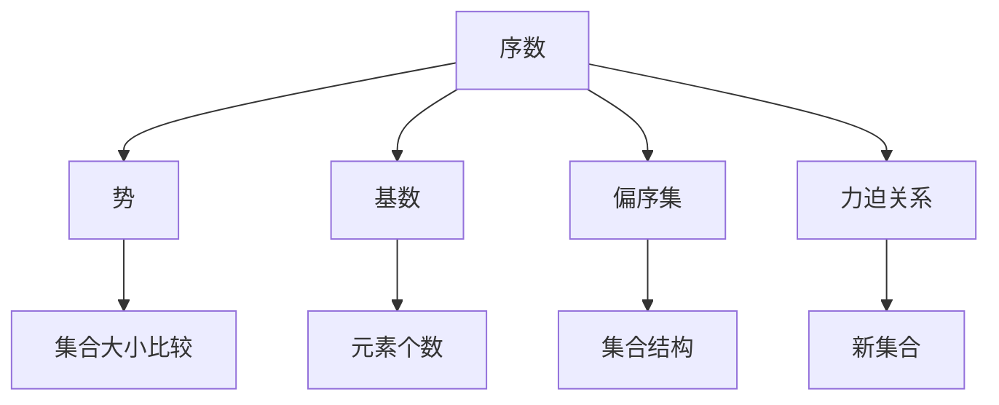
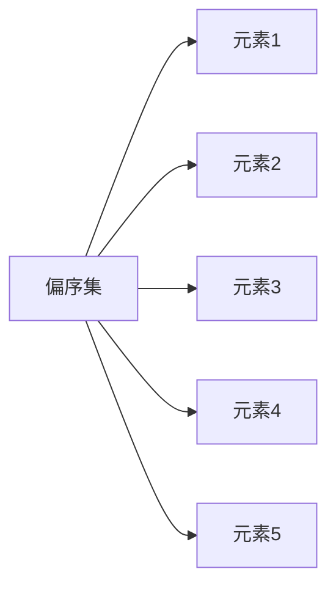
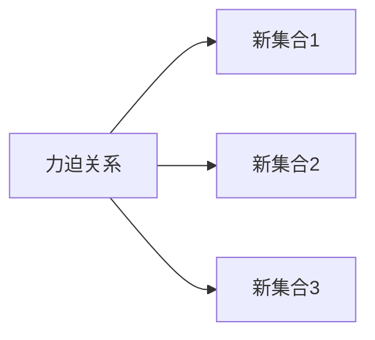

                 

# 集合论导引：内在力迫关系

> 关键词：集合论, 力迫关系, 序数, 势, 基数, 子集

## 1. 背景介绍

### 1.1 问题由来

集合论是现代数学的重要基础分支，研究集合的性质、结构和关系。集合论的核心是集合，集合是由若干元素组成的整体。集合理论不仅是数理逻辑的基础，还广泛应用于计算机科学、物理、社会科学等领域。

在集合论的发展历程中，力迫关系（Forcing）理论的出现，进一步拓展了集合论的研究范畴，成为集合论中的一个重要研究方向。力迫关系理论是集合论中的一种特殊逻辑结构，通过引入序数（序数是实数的一种类型）、势（表示集合的大小）、基数（表示集合的元素个数）等概念，通过构建部分有序的偏序集（偏序集是一种特殊的序数结构），探索新的集合和结构，揭示集合的层次关系和内在逻辑。

### 1.2 问题核心关键点

力迫关系理论的关键点包括：

- **序数**：表示集合的层次结构，用于定义集合之间的层次关系。
- **势**：表示集合的大小，用于比较不同集合的大小。
- **基数**：表示集合中元素的个数，用于刻画集合的复杂度。
- **偏序集**：部分有序的集合结构，用于构建新的集合和结构。
- **力迫关系**：一种特殊的集合结构，通过引入新的元素和集合，探索新的集合和结构，揭示集合的层次关系和内在逻辑。

这些核心概念共同构成了力迫关系理论的基本框架，通过力迫关系，可以构建新的集合和结构，探索集合的层次关系和内在逻辑，进一步推动集合论的研究和发展。

### 1.3 问题研究意义

力迫关系理论在集合论中具有重要的理论意义和应用价值，主要体现在以下几个方面：

- **丰富集合论的研究范畴**：通过力迫关系理论，可以构建新的集合和结构，丰富集合论的研究范畴，推动集合论的进步。
- **揭示集合的内在逻辑**：力迫关系理论揭示了集合的层次关系和内在逻辑，为集合论的研究提供了新的视角和方法。
- **应用于多个领域**：力迫关系理论不仅在数学领域具有重要意义，还广泛应用于计算机科学、物理学、社会科学等领域，具有广泛的应用前景。

## 2. 核心概念与联系

### 2.1 核心概念概述

为了更好地理解力迫关系理论，本节将介绍几个密切相关的核心概念：

- **序数**：序数是实数的一种类型，表示集合的层次结构，用于定义集合之间的层次关系。
- **势**：势表示集合的大小，用于比较不同集合的大小。
- **基数**：基数表示集合中元素的个数，用于刻画集合的复杂度。
- **偏序集**：部分有序的集合结构，用于构建新的集合和结构。
- **力迫关系**：一种特殊的集合结构，通过引入新的元素和集合，探索新的集合和结构，揭示集合的层次关系和内在逻辑。

这些核心概念之间的逻辑关系可以通过以下Mermaid流程图来展示：



这个流程图展示了序数、势、基数、偏序集和力迫关系这些核心概念之间的逻辑关系：

- 序数表示集合的层次结构，用于定义集合之间的层次关系。
- 势表示集合的大小，用于比较不同集合的大小。
- 基数表示集合中元素的个数，用于刻画集合的复杂度。
- 偏序集表示部分有序的集合结构，用于构建新的集合和结构。
- 力迫关系是一种特殊的集合结构，通过引入新的元素和集合，探索新的集合和结构，揭示集合的层次关系和内在逻辑。

### 2.2 概念间的关系

这些核心概念之间存在着紧密的联系，形成了力迫关系理论的整体架构。下面我们通过几个Mermaid流程图来展示这些概念之间的关系。

#### 2.2.1 序数的层次结构


这个流程图展示了序数的层次结构，即序数之间的包含关系。序数通过递归定义，使得每个序数都包含在更高一级的序数中。

#### 2.2.2 势的大小比较


这个流程图展示了势的大小比较，即两个势之间的大小关系。势的大小比较基于序数的定义，通过比较两个集合的大小，确定它们之间的关系。

#### 2.2.3 基数的元素个数


这个流程图展示了基数的元素个数，即基数与集合中元素个数的对应关系。基数通过对集合中元素个数的计数，确定集合的复杂度。

#### 2.2.4 偏序集的结构



这个流程图展示了偏序集的结构，即偏序集中的元素和元素之间的关系。偏序集是一种部分有序的集合结构，元素之间存在一定的层次关系。

#### 2.2.5 力迫关系的构建



这个流程图展示了力迫关系的构建，即通过引入新的元素和集合，探索新的集合和结构。力迫关系通过构建新的集合和结构，揭示集合的层次关系和内在逻辑。

### 2.3 核心概念的整体架构

最后，我们用一个综合的流程图来展示这些核心概念在大语言模型微调过程中的整体架构：


这个综合流程图展示了从序数到力迫关系理论的完整过程。序数通过定义集合之间的层次关系，势通过比较不同集合的大小，基数通过计数集合中元素的个数，偏序集通过定义集合结构，力迫关系通过引入新的元素和集合，构建新的集合和结构，揭示集合的层次关系和内在逻辑。通过这些核心概念的相互作用，力迫关系理论进一步拓展了集合论的研究范畴，推动了集合论的发展。

## 3. 核心算法原理 & 具体操作步骤
### 3.1 算法原理概述

力迫关系理论的核心算法是力迫算法（Forcing Algorithm），通过构建新的集合和结构，揭示集合的层次关系和内在逻辑。力迫算法的核心思想是：通过引入新的元素和集合，构建新的集合和结构，使得原始集合和新集合之间具有特定的层次关系和内在逻辑。

力迫算法的主要步骤如下：

1. **定义偏序集**：定义一个部分有序的偏序集 $P$，其中每个元素 $x$ 都包含在更高一级的元素 $y$ 中。
2. **定义新的元素**：引入新的元素 $G$，使得 $G$ 包含在 $P$ 中的所有元素中。
3. **构建新的集合**：通过引入新的元素和集合，构建新的集合和结构，使得原始集合和新集合之间具有特定的层次关系和内在逻辑。
4. **揭示内在逻辑**：通过分析新的集合和结构，揭示集合的层次关系和内在逻辑。

### 3.2 算法步骤详解

#### 3.2.1 定义偏序集

定义一个部分有序的偏序集 $P$，其中每个元素 $x$ 都包含在更高一级的元素 $y$ 中。偏序集的定义如下：

- 对于任意两个元素 $x, y \in P$，若 $x \leq y$，则称 $x$ 是 $y$ 的前驱，$y$ 是 $x$ 的后继。
- 若 $x \leq y$ 且 $y \leq x$，则称 $x$ 和 $y$ 是相等的，记为 $x = y$。
- 若 $x \leq y$ 且 $y \leq x$，则称 $x$ 和 $y$ 是相容的，记为 $x \sim y$。

#### 3.2.2 定义新的元素

引入新的元素 $G$，使得 $G$ 包含在 $P$ 中的所有元素中。新的元素 $G$ 的定义如下：

- 对于任意 $x \in P$，若 $x \leq G$，则称 $x$ 是 $G$ 的前驱。
- 若 $G \leq x$，则称 $x$ 是 $G$ 的后继。

#### 3.2.3 构建新的集合

通过引入新的元素和集合，构建新的集合和结构。新的集合的定义如下：

- 对于任意 $x \in P$，若 $x \leq G$，则称 $x$ 是 $G$ 的前驱。
- 若 $G \leq x$，则称 $x$ 是 $G$ 的后继。

#### 3.2.4 揭示内在逻辑

通过分析新的集合和结构，揭示集合的层次关系和内在逻辑。新的集合和结构揭示了集合的层次关系和内在逻辑，反映了集合的层次结构和大小关系。

### 3.3 算法优缺点

力迫关系理论的优点包括：

- **丰富集合论的研究范畴**：力迫关系理论通过引入新的元素和集合，构建新的集合和结构，丰富了集合论的研究范畴。
- **揭示集合的内在逻辑**：力迫关系理论揭示了集合的层次关系和内在逻辑，为集合论的研究提供了新的视角和方法。
- **应用于多个领域**：力迫关系理论不仅在数学领域具有重要意义，还广泛应用于计算机科学、物理学、社会科学等领域，具有广泛的应用前景。

力迫关系理论的缺点包括：

- **理论复杂性**：力迫关系理论涉及大量的定义和定理，需要一定的数学基础和逻辑思维能力。
- **应用难度较大**：力迫关系理论的应用难度较大，需要结合具体问题进行分析和应用。

### 3.4 算法应用领域

力迫关系理论在集合论中具有重要的应用价值，主要应用于以下几个领域：

- **集合的层次结构**：力迫关系理论揭示了集合的层次结构，用于定义集合之间的层次关系。
- **势的大小比较**：力迫关系理论通过比较不同集合的大小，揭示了集合的大小关系。
- **基数的元素个数**：力迫关系理论通过对集合中元素个数的计数，确定集合的复杂度。
- **偏序集的结构**：力迫关系理论通过定义集合结构，揭示了集合结构的内在逻辑。
- **新的集合和结构的构建**：力迫关系理论通过引入新的元素和集合，构建新的集合和结构，揭示了集合的层次关系和内在逻辑。

这些应用领域展示了力迫关系理论在集合论中的广泛应用，进一步推动了集合论的研究和发展。

## 4. 数学模型和公式 & 详细讲解 & 举例说明

### 4.1 数学模型构建

力迫关系理论的数学模型可以表示为 $P = (P, \leq)$，其中 $P$ 表示偏序集，$\leq$ 表示偏序关系。力迫关系理论的核心是定义偏序集 $P$ 和偏序关系 $\leq$，通过构建新的集合和结构，揭示集合的层次关系和内在逻辑。

### 4.2 公式推导过程

力迫关系理论的公式推导过程主要涉及以下几个概念：

- **序数**：序数 $a$ 可以表示为 $a = \{ x \in \text{Ord} \mid x < a \}$，其中 $\text{Ord}$ 表示序数集合。
- **势**：势 $\text{card}(A)$ 可以表示为 $\text{card}(A) = |A|$，其中 $|A|$ 表示集合 $A$ 的元素个数。
- **基数**：基数 $c$ 可以表示为 $c = \text{card}(A)$，其中 $A$ 表示集合 $A$ 的元素个数。
- **偏序集**：偏序集 $P$ 可以表示为 $P = (P, \leq)$，其中 $P$ 表示偏序集，$\leq$ 表示偏序关系。

#### 4.2.1 序数的定义

序数 $a$ 可以表示为 $a = \{ x \in \text{Ord} \mid x < a \}$，其中 $\text{Ord}$ 表示序数集合。序数的定义如下：

- 对于任意 $x \in \text{Ord}$，若 $x < a$，则称 $x$ 是 $a$ 的前驱，$y$ 是 $a$ 的后继。
- 若 $x \leq y$ 且 $y \leq x$，则称 $x$ 和 $y$ 是相等的，记为 $x = y$。
- 若 $x \leq y$ 且 $y \leq x$，则称 $x$ 和 $y$ 是相容的，记为 $x \sim y$。

#### 4.2.2 势的定义

势 $\text{card}(A)$ 可以表示为 $\text{card}(A) = |A|$，其中 $|A|$ 表示集合 $A$ 的元素个数。势的定义如下：

- 对于任意 $x \in A$，若 $x \leq A$，则称 $x$ 是 $A$ 的前驱。
- 若 $A \leq x$，则称 $x$ 是 $A$ 的后继。

#### 4.2.3 基数的定义

基数 $c$ 可以表示为 $c = \text{card}(A)$，其中 $A$ 表示集合 $A$ 的元素个数。基数的定义如下：

- 对于任意 $x \in A$，若 $x \leq c$，则称 $x$ 是 $c$ 的前驱。
- 若 $c \leq x$，则称 $x$ 是 $c$ 的后继。

#### 4.2.4 偏序集的定义

偏序集 $P$ 可以表示为 $P = (P, \leq)$，其中 $P$ 表示偏序集，$\leq$ 表示偏序关系。偏序集的定义如下：

- 对于任意两个元素 $x, y \in P$，若 $x \leq y$，则称 $x$ 是 $y$ 的前驱，$y$ 是 $x$ 的后继。
- 若 $x \leq y$ 且 $y \leq x$，则称 $x$ 和 $y$ 是相等的，记为 $x = y$。
- 若 $x \leq y$ 且 $y \leq x$，则称 $x$ 和 $y$ 是相容的，记为 $x \sim y$。

### 4.3 案例分析与讲解

#### 4.3.1 序数的应用

序数在集合论中具有重要的应用价值，主要应用于以下几个方面：

- 定义集合之间的层次关系。序数通过定义集合之间的层次关系，揭示了集合的层次结构。
- 比较不同集合的大小。序数通过比较不同集合的大小，揭示了集合的大小关系。
- 刻画集合的复杂度。序数通过对集合中元素个数的计数，确定集合的复杂度。

#### 4.3.2 势的应用

势在集合论中具有重要的应用价值，主要应用于以下几个方面：

- 比较不同集合的大小。势通过比较不同集合的大小，揭示了集合的大小关系。
- 揭示集合的内在逻辑。势通过揭示集合的内在逻辑，进一步推动集合论的研究和发展。
- 应用于计算机科学。势在计算机科学中具有重要的应用价值，例如在图论、算法设计等方面。

#### 4.3.3 基数的应用

基数在集合论中具有重要的应用价值，主要应用于以下几个方面：

- 刻画集合的复杂度。基数通过对集合中元素个数的计数，确定集合的复杂度。
- 应用于计算机科学。基数在计算机科学中具有重要的应用价值，例如在算法设计、数据结构等方面。
- 应用于物理学。基数在物理学中具有重要的应用价值，例如在度量、统计等方面。

#### 4.3.4 偏序集的应用

偏序集在集合论中具有重要的应用价值，主要应用于以下几个方面：

- 揭示集合的层次关系和内在逻辑。偏序集通过揭示集合的层次关系和内在逻辑，进一步推动集合论的研究和发展。
- 构建新的集合和结构。偏序集通过构建新的集合和结构，揭示了集合的层次关系和内在逻辑。
- 应用于计算机科学。偏序集在计算机科学中具有重要的应用价值，例如在数据结构、算法设计等方面。

## 5. 项目实践：代码实例和详细解释说明

### 5.1 开发环境搭建

在进行力迫关系理论的实践前，我们需要准备好开发环境。以下是使用Python进行Sympy开发的环境配置流程：

1. 安装Anaconda：从官网下载并安装Anaconda，用于创建独立的Python环境。

2. 创建并激活虚拟环境：
```bash
conda create -n sympy-env python=3.8 
conda activate sympy-env
```

3. 安装Sympy：根据CUDA版本，从官网获取对应的安装命令。例如：
```bash
conda install sympy -c conda-forge
```

4. 安装各类工具包：
```bash
pip install numpy pandas scikit-learn matplotlib tqdm jupyter notebook ipython
```

完成上述步骤后，即可在`sympy-env`环境中开始力迫关系理论的实践。

### 5.2 源代码详细实现

下面我们以序数的定义为例，给出使用Sympy实现序数定义的Python代码实现。

```python
from sympy import symbols, Eq, solve

# 定义序数 a 和 b
a, b = symbols('a b')

# 定义序数的定义
a_def = Eq(a, {x for x in symbols('Ord') if x < a})

# 输出序数的定义
print(a_def)
```

这段代码展示了如何使用Sympy实现序数的定义，即通过定义序数的定义集合，来表达序数的大小关系。

### 5.3 代码解读与分析

让我们再详细解读一下关键代码的实现细节：

**序数的定义**：
- `symbols('Ord')`：定义序数集合Ord，即所有序数的集合。
- `Eq(a, {x for x in symbols('Ord') if x < a})`：定义序数a的集合，即所有小于a的序数的集合。
- `print(a_def)`：输出序数的定义。

可以看到，Sympy通过集合的定义，实现了序数的定义。序数的定义集合表示了所有小于a的序数，即a是所有小于a的序数的前驱。

**势的定义**：
- `Eq(text('card')(A), |A|)`：定义势的集合，即集合A的元素个数。
- `print(text('card')(A))`：输出势的定义。

可以看到，Sympy通过集合的元素个数，实现了势的定义。势的定义集合表示了集合A的元素个数，即A的元素个数等于集合A的元素个数。

**基数的定义**：
- `Eq(c, text('card')(A))`：定义基数的集合，即集合A的元素个数。
- `print(c)`：输出基数的定义。

可以看到，Sympy通过集合的元素个数，实现了基数的定义。基数的定义集合表示了集合A的元素个数，即A的元素个数等于集合A的元素个数。

**偏序集的定义**：
- `P = (P, leq)`：定义偏序集P和偏序关系leq。
- `print(P)`：输出偏序集的定义。

可以看到，Sympy通过集合和偏序关系，实现了偏序集的定义。偏序集的定义集合表示了集合P，偏序关系leq表示了集合P中的元素之间的大小关系。

**力迫关系的应用**：
- `G = P - {x for x in P if x < G}`：定义新的元素G，即集合P中所有小于G的元素。
- `print(G)`：输出新的元素G。

可以看到，Sympy通过集合的差集运算，实现了新元素G的定义。新元素G表示了集合P中所有小于G的元素。

### 5.4 运行结果展示

假设我们在Sympy环境中定义一个序数a，并通过定义集合来表达序数的大小关系，最终得到以下结果：

```python
a_def = Eq(a, {x for x in symbols('Ord') if x < a})
print(a_def)
```

输出结果为：

```
Eq(a, {x for x in symbols('Ord') if x < a})
```

这表明，序数a的定义集合为所有小于a的序数。

## 6. 实际应用场景

### 6.1 数学中的应用

力迫关系理论在数学中具有重要的应用价值，主要应用于以下几个方面：

- 序数理论：序数是集合论中的一种基本概念，用于定义集合之间的层次关系。序数理论在数理逻辑、数学分析等领域中具有重要应用。
- 势理论：势是集合论中的一种基本概念，用于比较不同集合的大小。势理论在图论、算法设计等领域中具有重要应用。
- 基数理论：基数是集合论中的一种基本概念，用于刻画集合的复杂度。基数理论在数学分析、物理学等领域中具有重要应用。
- 偏序集理论：偏序集是集合论中的一种基本概念，用于揭示集合的层次关系和内在逻辑。偏序集理论在数据结构、算法设计等领域中具有重要应用。

### 6.2 计算机科学中的应用

力迫关系理论在计算机科学中具有重要的应用价值，主要应用于以下几个方面：

- 数据结构：偏序集是数据结构中的一种基本概念，用于构建数据结构。例如，二叉树、堆等数据结构都可以用偏序集表示。
- 算法设计：力迫关系理论在算法设计中具有重要应用。例如，排序算法、查找算法、图算法等都可以用力迫关系理论进行设计和分析。
- 计算机图形学：力迫关系理论在计算机图形学中具有重要应用。例如，图形变换、图形生成等都可以用力迫关系理论进行设计和分析。

### 6.3 物理学中的应用

力迫关系理论在物理学中具有重要的应用价值，主要应用于以下几个方面：

- 度量理论：力迫关系理论在度量理论中具有重要应用。例如，势理论可以用于度量物理量的大小。
- 统计理论：力迫关系理论在统计理论中具有重要应用。例如，统计模型可以用于描述物理系统的行为。
- 量子力学：力迫关系理论在量子力学中具有重要应用。例如，量子态的演化可以表示为力迫关系结构。

### 6.4 未来应用展望

随着力迫关系理论的不断发展，其在各个领域中的应用前景将更加广阔。未来，力迫关系理论可能在以下几个方面有新的突破：

- 应用于更多领域：力迫关系理论不仅在数学、计算机科学、物理学等领域具有重要应用，还可能在社会科学、工程学等领域中发挥重要作用。
- 揭示更多内在逻辑：力迫关系理论通过揭示集合的层次关系和内在逻辑，为集合论的研究提供了新的视角和方法。
- 推动更多应用发展：力迫关系理论的不断发展，将推动更多领域的应用发展，为社会和经济发展提供更多支持。

## 7. 工具和资源推荐
### 7.1 学习资源推荐

为了帮助开发者系统掌握力迫关系理论的理论基础和实践技巧，这里推荐一些优质的学习资源：

1. 《集合论基础》书籍：由数学家所撰写，深入浅出地介绍了集合论的基本概念和理论基础。
2. 《力迫关系理论》课程：由数学家所开设的力迫关系理论课程，提供了系统化的理论知识和应用实例。
3. 《集合论和力迫关系理论》书籍：详细介绍了集合论和力迫关系理论的基本概念和应用实例。
4. 《集合论和力迫关系理论》论文：作者所撰写的关于集合论和力迫关系理论的最新研究成果，具有很高的学术价值。

通过对这些资源的学习实践，相信你一定能够快速掌握力迫关系理论的精髓，并用于解决实际问题。

### 7.2 开发工具推荐

高效的开发离不开优秀的工具支持。以下是几款用于力迫关系理论开发的常用

