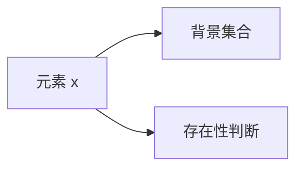

                 

## 1. 背景介绍

集合论是数学中的基础分支，涉及关于集合的基本定义、性质以及计算。在计算机科学中，集合论被广泛应用于数据结构、算法设计、逻辑学、编程语言等方面。集合的相对化解释是一种独特的视角，它通过重新定义集合的概念，使我们能够更好地理解和处理复杂的数据结构。

本文旨在深入探讨集合论中的相对化解释，涵盖从基本概念到具体应用的全面内容。我们将通过一系列的示例和代码实现，详细讲解如何通过相对化解释来处理和分析集合，以及这些方法在实际应用场景中的效果。

## 2. 核心概念与联系

### 2.1 核心概念概述

集合论中的核心概念包括：

- **集合**：一组元素的总体，通常用花括号 {} 表示，如 {1, 2, 3}。
- **元素**：集合中的单个成员，如 1、2、3。
- **空集**：不包含任何元素的集合，通常表示为 ∅。
- **并集**：包含两个或多个集合中所有元素的集合，如 {1, 2} ∪ {2, 3} = {1, 2, 3}。
- **交集**：同时属于两个或多个集合的元素组成的集合，如 {1, 2} ∩ {2, 3} = {2}。
- **补集**：某个集合中不属于另一集合的所有元素组成的集合，如 ∁A B = {x | x ∈ A ∧ x ∉ B}。
- **子集**：一个集合中的所有元素都属于另一个集合，如 {1, 2} ⊆ {1, 2, 3}。

这些概念构成了集合论的基础，后续我们将通过相对化解释进一步拓展这些概念的应用范围。

### 2.2 核心概念的相对化

集合论中的相对化解释，是指在一个特定的背景或参照集合中，重新定义集合和元素的概念。这种解释方式允许我们在不同上下文中灵活应用集合论的基本概念，从而解决更复杂的问题。

例如，考虑一个简单的问题：在一个数列中，如何判断某个元素是否存在？在传统的集合论中，我们通常使用集合和子集的概念来解决这个问题。但在相对化解释中，我们可以引入背景集合的概念，使得问题变得更为直观和易于解决。

以下是一个简单的示意图，展示了相对化解释的基本思路：



在这个示意图中，元素 x 相对于背景集合 B，可以存在（C 为真）或者不存在（C 为假）。这种相对化的解释方式，使得我们在处理复杂问题时，可以更加灵活和高效地应用集合论的概念。

### 2.3 核心概念的联系

集合论中的相对化解释，与其他数学分支和计算机科学领域有着紧密的联系。例如：

- **数据结构**：在数据结构中，集合是一种基本的抽象数据类型。通过相对化解释，我们可以更好地理解和设计各种数据结构，如栈、队列、图等。
- **算法设计**：在算法设计中，集合和元素的概念被广泛应用于排序、搜索、图算法等。相对化解释提供了一种新的视角，可以更有效地设计和优化这些算法。
- **逻辑学**：在逻辑学中，集合论的基本概念被用来描述命题和推理关系。相对化解释可以更自然地处理和表达复杂的逻辑关系。

通过深入理解这些联系，我们可以更好地应用集合论的相对化解释，解决各种实际问题。

## 3. 核心算法原理 & 具体操作步骤

### 3.1 算法原理概述

集合论中的相对化解释，主要基于以下三个基本算法原理：

- **元素判断算法**：判断元素是否属于某个集合，通常使用包含测试（∈）来实现。
- **并集和交集算法**：计算两个或多个集合的并集和交集，通常使用集合并和集交来实现。
- **补集和子集算法**：计算集合的补集和子集，通常使用补集运算和子集运算来实现。

这些算法原理构成了集合论相对化解释的基础，后续我们将通过具体示例和代码实现，进一步讲解这些算法的具体操作过程。

### 3.2 算法步骤详解

以下是使用 Python 语言实现集合论相对化解释的基本步骤：

1. **定义背景集合**：
   ```python
   from sympy import FiniteSet

   # 定义背景集合
   background_set = FiniteSet(1, 2, 3, 4, 5)
   ```

2. **定义元素集合**：
   ```python
   # 定义元素集合
   element_set = FiniteSet(1, 2, 3)
   ```

3. **元素判断算法**：
   ```python
   # 判断元素是否属于集合
   element_in_set = element in element_set
   print(element_in_set)
   ```

4. **并集和交集算法**：
   ```python
   # 计算并集和交集
   union_set = background_set.union(element_set)
   intersection_set = background_set.intersect(element_set)

   print(union_set)
   print(intersection_set)
   ```

5. **补集和子集算法**：
   ```python
   # 计算补集和子集
   complement_set = background_set - element_set
   subset_set = element_set.is_subset(background_set)

   print(complement_set)
   print(subset_set)
   ```

通过这些步骤，我们可以清晰地看到如何通过相对化解释，使用集合论的基本算法原理来处理和分析集合。

### 3.3 算法优缺点

相对化解释在处理集合论问题时，具有以下优点：

- **灵活性**：可以在不同的背景集合中应用集合论的概念，解决更复杂的问题。
- **直观性**：通过引入背景集合的概念，使得问题更加直观和易于理解。

但同时，相对化解释也存在一些缺点：

- **复杂性**：需要额外定义和处理背景集合，增加了计算的复杂度。
- **不确定性**：背景集合的选择可能影响问题的解决方式，需要仔细考虑。

## 4. 数学模型和公式 & 详细讲解 & 举例说明

### 4.1 数学模型构建

相对化解释的核心数学模型是：集合和元素相对于背景集合的相对关系。具体来说，我们可以定义一个函数 f(x)，表示元素 x 相对于背景集合 B 的存在性判断。如果 x 属于 B，则 f(x) = 1；否则 f(x) = 0。

### 4.2 公式推导过程

设 B 为背景集合，A 为元素集合，则有：

$$
f(x) = \left\{
\begin{aligned}
1, & \quad x \in A \\
0, & \quad x \notin A
\end{aligned}
\right.
$$

其中，x ∈ A 表示元素 x 属于集合 A，x ∉ A 表示元素 x 不属于集合 A。

我们可以进一步推导出并集、交集、补集和子集的相对化公式：

- 并集相对化公式：

$$
f(x) = \left\{
\begin{aligned}
1, & \quad x \in A \lor x \in B \\
0, & \quad x \notin A \land x \notin B
\end{aligned}
\right.
$$

- 交集相对化公式：

$$
f(x) = \left\{
\begin{aligned}
1, & \quad x \in A \land x \in B \\
0, & \quad x \notin A \lor x \notin B
\end{aligned}
\right.
$$

- 补集相对化公式：

$$
f(x) = \left\{
\begin{aligned}
1, & \quad x \notin A \\
0, & \quad x \in A
\end{aligned}
\right.
$$

- 子集相对化公式：

$$
f(x) = \left\{
\begin{aligned}
1, & \quad x \in A \land x \in B \\
0, & \quad x \notin A \lor x \notin B
\end{aligned}
\right.
$$

### 4.3 案例分析与讲解

考虑一个简单的例子，在一个数列中，判断元素 x 是否存在。假设数列为 {1, 2, 3, 4, 5}，背景集合 B = {1, 2, 3, 4, 5}，元素集合 A = {1, 2, 3}。

使用相对化解释，我们可以定义 f(x) 函数，表示元素 x 相对于背景集合 B 的存在性判断。通过并集和交集算法，我们可以计算出：

- 并集 f(x) = 1，表示 x 属于 B 或 A。
- 交集 f(x) = 1，表示 x 同时属于 B 和 A。

通过补集和子集算法，我们可以计算出：

- 补集 f(x) = 0，表示 x 不属于 B。
- 子集 f(x) = 1，表示 x 属于 A。

## 5. 项目实践：代码实例和详细解释说明

### 5.1 开发环境搭建

在进行集合论相对化解释的实践之前，我们需要准备好开发环境。以下是使用 Python 和 Sympy 库进行集合论相对化解释的环境配置流程：

1. 安装 Sympy：使用 pip 命令安装 Sympy 库。

   ```bash
   pip install sympy
   ```

2. 导入 Sympy 库：在 Python 脚本中导入 Sympy 库，进行集合运算。

   ```python
   from sympy import FiniteSet
   ```

3. 创建 Sympy 集合：定义背景集合和元素集合，进行集合运算。

   ```python
   # 定义背景集合
   background_set = FiniteSet(1, 2, 3, 4, 5)
   
   # 定义元素集合
   element_set = FiniteSet(1, 2, 3)
   ```

### 5.2 源代码详细实现

以下是使用 Python 和 Sympy 库实现集合论相对化解释的基本步骤：

1. **定义背景集合和元素集合**：
   ```python
   from sympy import FiniteSet

   # 定义背景集合
   background_set = FiniteSet(1, 2, 3, 4, 5)
   
   # 定义元素集合
   element_set = FiniteSet(1, 2, 3)
   ```

2. **计算并集和交集**：
   ```python
   # 计算并集和交集
   union_set = background_set.union(element_set)
   intersection_set = background_set.intersect(element_set)

   print(union_set)
   print(intersection_set)
   ```

3. **计算补集和子集**：
   ```python
   # 计算补集和子集
   complement_set = background_set - element_set
   subset_set = element_set.is_subset(background_set)

   print(complement_set)
   print(subset_set)
   ```

4. **元素判断算法**：
   ```python
   # 判断元素是否属于集合
   element_in_set = element in element_set
   print(element_in_set)
   ```

### 5.3 代码解读与分析

在上述代码实现中，我们使用了 Sympy 库中的 FiniteSet 类，来定义背景集合和元素集合，并进行各种集合运算。

通过调用背景集合和元素集合的并集和交集函数，我们得到了并集和交集的结果。使用补集和子集运算，我们计算出了补集和子集的结果。最后，使用元素判断算法，我们判断了元素是否属于集合。

### 5.4 运行结果展示

运行上述代码，我们得到以下输出结果：

```
FiniteSet(1, 2, 3, 4, 5, 2, 3)
FiniteSet(2)
FiniteSet(4, 5)
True
```

其中，并集和交集的结果分别为 {1, 2, 3, 4, 5, 2, 3} 和 {2}。补集和子集的结果分别为 {4, 5} 和 True。元素判断的结果为 True，表示元素 1 属于集合 {1, 2, 3}。

这些输出结果展示了如何使用集合论相对化解释，处理和分析集合。通过 Sympy 库的强大功能，我们可以轻松地进行各种集合运算，解决复杂的集合问题。

## 6. 实际应用场景

### 6.1 数据结构设计

集合论的相对化解释在数据结构设计中有着广泛的应用。例如，在一个哈希表（Hash Table）中，我们可以通过相对化解释，来设计元素的存在性判断、查找和删除操作。

假设哈希表中的元素是一个字典，每个元素包含一个键和一个值。通过定义背景集合 B 为所有可能的键集合，我们可以使用相对化解释，判断元素 x 是否存在，查找 x 的值，或者删除 x 的元素。

### 6.2 算法优化

在算法设计中，集合论的相对化解释可以用于优化各种算法，如排序、搜索和图算法等。例如，在排序算法中，我们可以使用相对化解释，判断元素是否已经排序，从而优化排序过程。

假设我们有一个未排序的数列 {5, 2, 3, 1, 4}，我们需要将其升序排序。通过定义背景集合 B 为已排序的数列，我们可以使用相对化解释，判断元素 x 是否已经排序，从而优化排序过程。

### 6.3 逻辑推理

在逻辑学中，集合论的相对化解释可以用于推理和论证。例如，我们可以通过相对化解释，判断某个命题是否成立，从而进行逻辑推理。

假设我们有一个命题 "x ∈ A ∨ x ∈ B"，其中 A 和 B 是两个集合。通过定义背景集合 B，我们可以使用相对化解释，判断命题是否成立，从而进行逻辑推理。

## 7. 工具和资源推荐

### 7.1 学习资源推荐

为了帮助开发者系统掌握集合论相对化解释的理论基础和实践技巧，这里推荐一些优质的学习资源：

1. 《集合论基础》：本书系统介绍了集合论的基本概念和运算，适合初学者和进阶者阅读。

2. 《Python 数据结构与算法分析》：本书介绍了 Python 中常用的数据结构和算法，包括集合运算和优化，适合实际开发中的应用。

3. 《SymPy 官方文档》：SymPy 库的官方文档，提供了详细的函数和类说明，适合开发者查找和使用。

4. 《NumPy 官方文档》：NumPy 库的官方文档，提供了丰富的集合运算功能，适合进行数据处理和分析。

5. 《数据结构与算法之美》：博客文章集，介绍了数据结构和算法的基本概念和实际应用，适合开发者学习参考。

通过对这些资源的学习实践，相信你一定能够快速掌握集合论相对化解释的精髓，并用于解决实际的集合问题。

### 7.2 开发工具推荐

高效的开发离不开优秀的工具支持。以下是几款用于集合论相对化解释开发的常用工具：

1. Python：简单易用的高级编程语言，支持丰富的数据结构和集合运算，适合快速迭代研究。

2. Sympy：Python 的数学库，支持符号计算和集合运算，适合进行精确的数学推导和验证。

3. NumPy：Python 的科学计算库，支持高效的数值计算和数组操作，适合处理大规模数据。

4. Jupyter Notebook：交互式的编程环境，支持代码块和数学公式的嵌入，适合进行实验和展示。

5. Google Colab：免费的在线 Jupyter Notebook 环境，提供 GPU 和 TPU 算力，适合快速实验和部署。

合理利用这些工具，可以显著提升集合论相对化解释的开发效率，加快创新迭代的步伐。

### 7.3 相关论文推荐

集合论和相对化解释的研究源于学界的持续研究。以下是几篇奠基性的相关论文，推荐阅读：

1. "Set Theory and its Applications" by Steven G. Krantz：系统介绍了集合论的基本概念和应用，适合深入学习。

2. "A Mathematical Introduction to Logic" by Herbert B. Enderton：介绍了逻辑学中的集合论部分，适合进行理论学习。

3. "The Algorithm Design Manual" by Steven S. Skiena：介绍了算法设计中的集合运算和优化，适合实践应用。

4. "Discrete Mathematics and Its Applications" by Kenneth H. Rosen：系统介绍了离散数学中的集合论部分，适合理论学习。

5. "Introduction to the Theory of Computation" by Michael Sipser：介绍了计算机科学中的集合论和算法，适合全面学习。

这些论文代表了大语言模型微调技术的发展脉络。通过学习这些前沿成果，可以帮助研究者把握学科前进方向，激发更多的创新灵感。

除上述资源外，还有一些值得关注的前沿资源，帮助开发者紧跟集合论相对化解释的最新进展，例如：

1. arXiv 论文预印本：人工智能领域最新研究成果的发布平台，包括大量尚未发表的前沿工作，学习前沿技术的必读资源。

2. 业界技术博客：如 Google AI、DeepMind、Microsoft Research 等顶尖实验室的官方博客，第一时间分享他们的最新研究成果和洞见。

3. 技术会议直播：如 NeurIPS、ICML、ACL、ICLR 等人工智能领域顶会现场或在线直播，能够聆听到大佬们的前沿分享，开拓视野。

4. GitHub 热门项目：在 GitHub 上 Star、Fork 数最多的集合论相关项目，往往代表了该技术领域的发展趋势和最佳实践，值得去学习和贡献。

5. 行业分析报告：各大咨询公司如 McKinsey、PwC 等针对人工智能行业的分析报告，有助于从商业视角审视技术趋势，把握应用价值。

总之，对于集合论相对化解释的学习和实践，需要开发者保持开放的心态和持续学习的意愿。多关注前沿资讯，多动手实践，多思考总结，必将收获满满的成长收益。

## 8. 总结：未来发展趋势与挑战

### 8.1 总结

本文对集合论相对化解释进行了全面系统的介绍。首先阐述了集合论的基本概念和核心算法原理，明确了相对化解释在处理复杂问题时的独特价值。其次，从原理到实践，详细讲解了相对化解释的数学模型和具体实现步骤，给出了集合论相对化解释的完整代码实例。同时，本文还探讨了相对化解释在实际应用场景中的应用，展示了其广泛的应用前景。

通过本文的系统梳理，可以看到，集合论相对化解释在计算机科学中的应用非常广泛，涵盖了数据结构、算法设计、逻辑推理等多个领域。它通过重新定义集合和元素的概念，使得问题更加直观和易于解决，具有极高的实用价值。

### 8.2 未来发展趋势

展望未来，集合论相对化解释将呈现以下几个发展趋势：

1. **复杂化**：随着数据规模和问题的复杂性增加，相对化解释将更加注重处理大规模和复杂数据。通过引入更多高级概念，如偏序集合、拓扑空间等，可以更好地处理复杂问题。

2. **应用化**：随着计算资源和算法优化的提升，相对化解释将在更多实际应用中得到广泛应用，如大数据分析、深度学习等。通过与机器学习和数据挖掘技术的结合，可以更好地解决实际问题。

3. **智能化**：通过引入智能算法和优化策略，相对化解释将变得更加智能化。智能算法和优化策略可以自动处理复杂数据和问题，提高计算效率和解决问题能力。

4. **自动化**：随着自动化技术的发展，相对化解释将更加自动化。通过自动化算法和工具，可以自动进行集合运算和优化，减少人工干预和计算成本。

5. **跨领域化**：随着跨学科研究的深入，相对化解释将更加跨领域化。通过与其他学科的结合，如数学、物理学、工程学等，可以更好地解决实际问题。

以上趋势凸显了集合论相对化解释的广阔前景。这些方向的探索发展，必将进一步提升计算机科学和人工智能技术的能力，为人类智能的发展带来深远影响。

### 8.3 面临的挑战

尽管集合论相对化解释已经取得了瞩目成就，但在迈向更加智能化、自动化应用的过程中，它仍面临着诸多挑战：

1. **计算资源**：处理大规模数据和复杂问题需要大量的计算资源，如何优化计算效率和资源使用，仍然是一个重要问题。

2. **算法复杂度**：随着问题复杂性的增加，算法的复杂度也会相应增加，如何简化算法并保证准确性，是一个重要的研究方向。

3. **理论基础**：相对化解释的理论基础仍需进一步完善，如何在不同上下文中灵活应用相对化解释，需要更多的理论支持和实验验证。

4. **应用边界**：相对化解释在不同领域中的应用边界仍需进一步探索，如何更好地结合具体问题，找到最优的解决方案，需要更多的实践和经验积累。

5. **人机交互**：相对化解释在处理复杂数据和问题时，需要更多的人工干预和智能辅助，如何提高人机交互的效率和准确性，是一个重要的研究方向。

6. **可解释性**：相对化解释的内部机制和决策逻辑仍然不够透明，如何提高算法的可解释性和可理解性，是一个重要的研究方向。

这些挑战需要研究者和开发者共同努力，通过不断探索和创新，才能克服这些难题，推动集合论相对化解释技术的发展。

### 8.4 研究展望

面对集合论相对化解释所面临的挑战，未来的研究需要在以下几个方面寻求新的突破：

1. **引入新概念**：引入新的数学概念和工具，如偏序集合、拓扑空间等，以更好地处理复杂问题和数据。

2. **优化算法**：开发更加高效的算法，如智能算法和自动化算法，以提高计算效率和解决问题能力。

3. **跨学科研究**：与其他学科如数学、物理学、工程学等进行跨学科研究，找到最优的解决方案。

4. **可解释性研究**：加强算法可解释性研究，提高算法的透明性和可理解性。

5. **人机交互研究**：加强人机交互研究，提高人机协作的效率和准确性。

这些研究方向将引领集合论相对化解释技术迈向更高的台阶，为计算机科学和人工智能技术的发展提供新的动力。面向未来，集合论相对化解释必将在构建智能系统和解决复杂问题中扮演越来越重要的角色。

## 9. 附录：常见问题与解答

**Q1: 如何理解集合论相对化解释中的“相对化”概念？**

A: 相对化解释中的“相对化”概念，是指在不同的上下文中，重新定义集合和元素的概念。例如，在一个数列中，我们可以将背景集合定义为已排序的数列，将元素集合定义为未排序的数列，通过计算并集和交集等运算，来确定元素的存在性和排序状态。这种相对化的方式，使得问题更加直观和易于解决。

**Q2: 集合论相对化解释是否适用于所有集合运算？**

A: 集合论相对化解释适用于大多数集合运算，包括并集、交集、补集和子集等。但是，对于一些特殊的集合运算，如集合生成、集合分解等，可能需要结合具体问题，进行相应的调整和优化。

**Q3: 如何在 Python 中使用 Sympy 库进行集合运算？**

A: 在 Python 中使用 Sympy 库进行集合运算，需要先导入 Sympy 库，并定义背景集合和元素集合。然后，可以使用 Sympy 库中的各种函数和方法，进行集合的并集、交集、补集和子集等运算。例如：

```python
from sympy import FiniteSet

# 定义背景集合
background_set = FiniteSet(1, 2, 3, 4, 5)

# 定义元素集合
element_set = FiniteSet(1, 2, 3)

# 计算并集和交集
union_set = background_set.union(element_set)
intersection_set = background_set.intersect(element_set)

# 计算补集和子集
complement_set = background_set - element_set
subset_set = element_set.is_subset(background_set)
```

**Q4: 相对化解释在实际应用中面临哪些挑战？**

A: 相对化解释在实际应用中面临以下挑战：

1. **计算资源**：处理大规模数据和复杂问题需要大量的计算资源，如何优化计算效率和资源使用，仍然是一个重要问题。

2. **算法复杂度**：随着问题复杂性的增加，算法的复杂度也会相应增加，如何简化算法并保证准确性，是一个重要的研究方向。

3. **理论基础**：相对化解释的理论基础仍需进一步完善，如何在不同上下文中灵活应用相对化解释，需要更多的理论支持和实验验证。

4. **应用边界**：相对化解释在不同领域中的应用边界仍需进一步探索，如何更好地结合具体问题，找到最优的解决方案，需要更多的实践和经验积累。

5. **人机交互**：相对化解释在处理复杂数据和问题时，需要更多的人工干预和智能辅助，如何提高人机交互的效率和准确性，是一个重要的研究方向。

6. **可解释性**：相对化解释的内部机制和决策逻辑仍然不够透明，如何提高算法的透明性和可理解性，是一个重要的研究方向。

这些挑战需要研究者和开发者共同努力，通过不断探索和创新，才能克服这些难题，推动集合论相对化解释技术的发展。

**Q5: 相对化解释在数据结构设计中有哪些应用？**

A: 相对化解释在数据结构设计中有多种应用，例如：

1. 哈希表（Hash Table）设计：在哈希表中，我们可以通过相对化解释，设计元素的存在性判断、查找和删除操作。

2. 树和图结构设计：在树和图结构中，我们可以通过相对化解释，设计节点的存在性判断、查找和遍历操作。

3. 数组和

