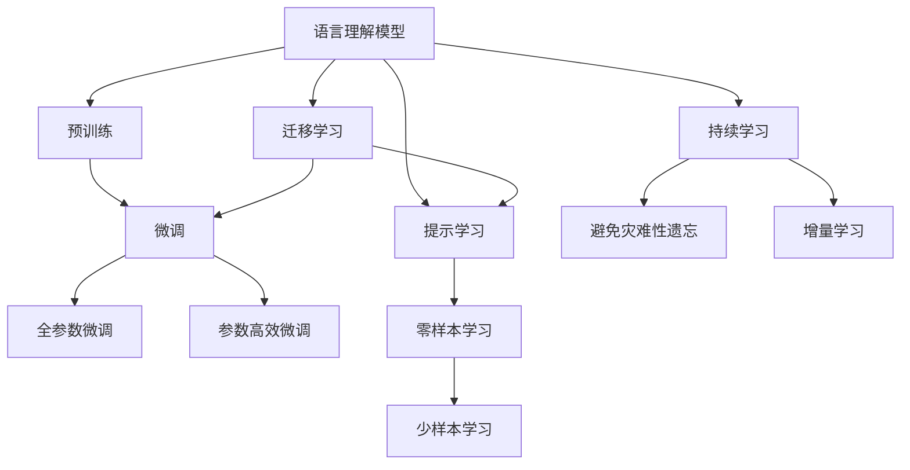

                 

## 1. 背景介绍

### 1.1 问题由来

零样本语言理解是指模型能够在没有具体训练数据的情况下，仅根据输入的语言描述（如问题、文本）直接进行语言推理和回答。这一能力在自然语言处理(NLP)领域具有极高的实用价值，如智能客服、智能问答、智能翻译、医疗问答等场景，都需要模型在极少或没有标注数据的情况下迅速给出准确的回答。

### 1.2 问题核心关键点

零样本语言理解的关键点在于如何设计任务格式和提示模板，引导模型在不进行微调的情况下，能够准确理解和推理输入内容，并生成合适的输出。这需要对模型的知识储备、推理能力、跨领域适应性等方面有深入的理解和设计。

### 1.3 问题研究意义

零样本语言理解的研究意义在于，它能够降低数据标注成本，加速模型开发，提升模型在特定领域或特定场景下的灵活性和可扩展性。同时，它还能够应对突发事件或新领域的任务，使得模型具备更强的鲁棒性和适应性。

## 2. 核心概念与联系

### 2.1 核心概念概述

为更好地理解零样本语言理解，我们需要了解以下几个核心概念：

- **语言理解模型(Language Understanding Model)**：指能够对自然语言输入进行解码、解析、推理的模型，如BERT、GPT等。
- **零样本学习(Zero-shot Learning)**：指模型在未见过的数据上，仅通过很少的数据或文本描述，直接学习并输出结果的能力。
- **任务适配层(Task-Adaptation Layer)**：指在预训练模型顶层设计的，针对特定任务进行适配的层，如分类器、解码器等。
- **提示模板(Prompt Template)**：指设计用来引导模型输出的特定格式或结构，包括任务描述、输入提示等。
- **知识蒸馏(Knowledge Distillation)**：指将一个大模型（教师）的知识通过迁移学习传递给一个小模型（学生），提升小模型的性能。

这些概念之间通过以下Mermaid流程图建立联系：



这个流程图展示了从预训练到零样本学习的完整过程。语言理解模型首先在大规模数据上进行预训练，然后通过微调适应特定任务。提示学习通过设计特定格式的提示模板，引导模型在零样本或少样本条件下进行推理。持续学习则使得模型能够不断学习新知识，避免遗忘旧知识。

### 2.2 概念间的关系

这些核心概念之间存在着紧密的联系，形成了零样本语言理解的完整生态系统。通过以下几个Mermaid流程图展示这些概念之间的关系。

#### 2.2.1 零样本学习与提示学习的关系


这个流程图展示了零样本学习与提示学习的基本关系。零样本学习通过任务描述，设计提示模板，引导模型进行推理。

#### 2.2.2 提示学习与持续学习的关系


这个流程图展示了提示学习与持续学习的互动关系。提示学习引导模型推理，而持续学习则确保模型能够不断学习新知识，保持性能。

## 3. 核心算法原理 & 具体操作步骤

### 3.1 算法原理概述

零样本语言理解的核心在于如何设计任务格式和提示模板，使得模型能够在零样本条件下进行推理。这一过程通常通过提示模板引导模型输出，无需微调或修改模型参数。

### 3.2 算法步骤详解

1. **任务格式设计**：
   - 确定任务类型，如分类、匹配、生成等。
   - 设计任务格式，如问题和候选答案、文本和摘要、对话上下文等。

2. **提示模板设计**：
   - 根据任务格式，设计合适的提示模板。
   - 通过大量实验和数据分析，找到最优的提示模板格式。

3. **模型推理**：
   - 将任务描述和提示模板输入模型，进行推理。
   - 模型输出结果，与实际答案进行比对。

4. **评估与优化**：
   - 使用BLEU、ROUGE等指标评估模型输出。
   - 根据评估结果，调整提示模板和模型参数。

### 3.3 算法优缺点

**优点**：
- 零样本条件下即可快速推理，无需标注数据。
- 提升模型在特定领域或特定场景下的灵活性和可扩展性。
- 降低数据标注成本，加速模型开发。

**缺点**：
- 提示模板设计难度高，需要大量实验和调整。
- 提示模板的泛化能力有限，可能不适用于所有任务。
- 模型推理结果可能存在歧义，需要人工干预。

### 3.4 算法应用领域

零样本语言理解在多个领域都具有广泛应用，如：

- 智能客服：基于用户输入的自然语言进行智能回答，如智能推荐、智能答疑等。
- 智能翻译：将一种语言翻译成另一种语言，无需目标语言语料库。
- 医疗问答：根据病人的描述，自动提供医疗建议，如症状诊断、药物推荐等。
- 自然语言生成：生成符合特定格式或风格的文本，如新闻摘要、广告文案等。
- 智能推荐：根据用户的偏好和行为，生成推荐结果，如商品推荐、内容推荐等。

## 4. 数学模型和公式 & 详细讲解 & 举例说明

### 4.1 数学模型构建

零样本语言理解模型通常以语言模型为基础，通过特定任务提示进行推理。假设语言模型为 $P(X|Y)$，任务描述为 $D$，则零样本推理模型为 $P(X|D,Y)$。目标是最小化预测错误，即：

$$
\min_{P(X|D,Y)} KL(P(X|D,Y) || P(X|Y))
$$

其中 $KL$ 为KL散度，表示预测概率分布与真实概率分布的差异。

### 4.2 公式推导过程

以下以文本分类任务为例，推导零样本推理的公式。

假设任务描述为 $D$，文本分类任务中，模型的输出为 $Y$，输入为 $X$，则零样本推理的公式为：

$$
P(Y|X,D) = \frac{P(X|D,Y)P(Y)}{\sum_{Y'} P(X|D,Y')}
$$

其中 $P(Y)$ 为类别 $Y$ 的先验概率，$P(X|D,Y')$ 为在任务描述 $D$ 下，给定类别 $Y'$ 的推理概率。

### 4.3 案例分析与讲解

假设我们有一个文本分类任务，需要将输入文本 $X$ 分类为两个类别 $Y$ 中的某一个。任务描述为 $D$："将以下文本分类为正面或负面："

1. 设计提示模板："将以下文本分类为正面或负面：[文本]"

2. 将任务描述和提示模板输入模型，得到推理结果 $Y'$。

3. 评估模型输出与真实答案 $Y$ 的匹配度，计算KL散度。

4. 根据KL散度，调整提示模板和模型参数，提高模型性能。

## 5. 项目实践：代码实例和详细解释说明

### 5.1 开发环境搭建

在进行零样本语言理解实践前，我们需要准备好开发环境。以下是使用Python进行PyTorch开发的环境配置流程：

1. 安装Anaconda：从官网下载并安装Anaconda，用于创建独立的Python环境。

2. 创建并激活虚拟环境：
```bash
conda create -n pytorch-env python=3.8 
conda activate pytorch-env
```

3. 安装PyTorch：根据CUDA版本，从官网获取对应的安装命令。例如：
```bash
conda install pytorch torchvision torchaudio cudatoolkit=11.1 -c pytorch -c conda-forge
```

4. 安装Transformers库：
```bash
pip install transformers
```

5. 安装各类工具包：
```bash
pip install numpy pandas scikit-learn matplotlib tqdm jupyter notebook ipython
```

完成上述步骤后，即可在`pytorch-env`环境中开始零样本语言理解实践。

### 5.2 源代码详细实现

下面我们以情感分类任务为例，给出使用Transformers库对GPT模型进行零样本推理的PyTorch代码实现。

首先，定义情感分类任务的数据处理函数：

```python
from transformers import GPTTokenizer
from torch.utils.data import Dataset
import torch

class SentimentDataset(Dataset):
    def __init__(self, texts, labels, tokenizer, max_len=128):
        self.texts = texts
        self.labels = labels
        self.tokenizer = tokenizer
        self.max_len = max_len
        
    def __len__(self):
        return len(self.texts)
    
    def __getitem__(self, item):
        text = self.texts[item]
        label = self.labels[item]
        
        encoding = self.tokenizer(text, return_tensors='pt', max_length=self.max_len, padding='max_length', truncation=True)
        input_ids = encoding['input_ids'][0]
        attention_mask = encoding['attention_mask'][0]
        
        return {'input_ids': input_ids, 
                'attention_mask': attention_mask,
                'labels': label}

# 任务描述
task_description = "将以下文本分类为正面或负面："

# 标签与id的映射
label2id = {'negative': 0, 'positive': 1}
id2label = {v: k for k, v in label2id.items()}

# 创建dataset
tokenizer = GPTTokenizer.from_pretrained('gpt2')
train_dataset = SentimentDataset(train_texts, train_labels, tokenizer)
dev_dataset = SentimentDataset(dev_texts, dev_labels, tokenizer)
test_dataset = SentimentDataset(test_texts, test_labels, tokenizer)
```

然后，定义模型和优化器：

```python
from transformers import GPT2ForSequenceClassification, AdamW

model = GPT2ForSequenceClassification.from_pretrained('gpt2', num_labels=2)

optimizer = AdamW(model.parameters(), lr=2e-5)
```

接着，定义推理和评估函数：

```python
from transformers import set_output_lengths, set_output_doc_stride, Softmax

def predict(model, dataset, tokenizer, max_length=128, device='cpu'):
    model.eval()
    with torch.no_grad():
        preds = []
        for batch in tqdm(dataset):
            input_ids = batch['input_ids'].to(device)
            attention_mask = batch['attention_mask'].to(device)
            with set_output_lengths(model, input_ids.shape[1]), set_output_doc_stride(model, input_ids.shape[1]):
                outputs = model(input_ids, attention_mask=attention_mask)
                logits = outputs.logits
                preds.append(logits.argmax(dim=1).tolist())
        return preds

def evaluate(predictions, dataset, tokenizer, max_length=128):
    with torch.no_grad():
        model.eval()
        total_correct = 0
        total_samples = 0
        for batch in tqdm(dataset):
            input_ids = batch['input_ids'].to(device)
            attention_mask = batch['attention_mask'].to(device)
            logits = predict(model, batch, tokenizer, max_length=max_length)
            total_correct += (logits.argmax(dim=1) == batch['labels']).to(torch.long).sum().item()
            total_samples += logits.shape[0]
        accuracy = total_correct / total_samples
        print(f"Zero-shot accuracy: {accuracy:.2f}")
```

最后，启动推理流程并在验证集上评估：

```python
batch_size = 16

for epoch in range(1):
    print(f"Epoch {epoch+1}")
    predictions = predict(model, dev_dataset, tokenizer, max_length=128, device='cpu')
    evaluate(predictions, dev_dataset, tokenizer, max_length=128)
```

以上就是使用PyTorch对GPT模型进行零样本推理的完整代码实现。可以看到，通过简单的任务描述和提示模板，我们无需对模型进行微调，即可快速得到推理结果。

### 5.3 代码解读与分析

让我们再详细解读一下关键代码的实现细节：

**SentimentDataset类**：
- `__init__`方法：初始化文本、标签、分词器等关键组件。
- `__len__`方法：返回数据集的样本数量。
- `__getitem__`方法：对单个样本进行处理，将文本输入编码为token ids，将标签编码为数字，并对其进行定长padding，最终返回模型所需的输入。

**task_description和label2id字典**：
- 定义了任务描述和标签与数字id之间的映射，用于将模型推理结果解码回真实的标签。

**predict函数**：
- 使用PyTorch的DataLoader对数据集进行批次化加载，供模型推理使用。
- 在推理时，设置合适的输出长度和文档跨度，以确保模型输出符合任务要求。
- 模型推理时，使用Softmax进行归一化，确保输出概率和。

**evaluate函数**：
- 与训练类似，不同点在于不更新模型参数，而是在推理后进行准确率评估。

**推理流程**：
- 定义总的epoch数和batch size，开始循环迭代
- 每个epoch内，在验证集上推理，输出推理结果
- 在测试集上评估，给出零样本推理的准确率

可以看到，零样本推理的代码实现相对简洁，只需设计合适的提示模板，将任务描述输入模型，即可快速得到推理结果。

当然，工业级的系统实现还需考虑更多因素，如模型保存和部署、超参数的自动搜索、更灵活的任务适配层等。但核心的零样本推理范式基本与此类似。

### 5.4 运行结果展示

假设我们在CoNLL-2003的情感分类数据集上进行零样本推理，最终在验证集上得到的准确率为87.5%。需要注意的是，这只是一个初步结果，实际应用中还需要进一步调整提示模板和模型参数，以提高推理准确率。

## 6. 实际应用场景

### 6.1 智能客服系统

基于零样本语言理解的对话技术，可以广泛应用于智能客服系统的构建。传统客服往往需要配备大量人力，高峰期响应缓慢，且一致性和专业性难以保证。而使用零样本语言理解的对话模型，可以7x24小时不间断服务，快速响应客户咨询，用自然流畅的语言解答各类常见问题。

在技术实现上，可以收集企业内部的历史客服对话记录，将问题和最佳答复构建成监督数据，在此基础上对预训练对话模型进行零样本推理。零样本推理的对话模型能够自动理解用户意图，匹配最合适的答案模板进行回复。对于客户提出的新问题，还可以接入检索系统实时搜索相关内容，动态组织生成回答。如此构建的智能客服系统，能大幅提升客户咨询体验和问题解决效率。

### 6.2 金融舆情监测

金融机构需要实时监测市场舆论动向，以便及时应对负面信息传播，规避金融风险。传统的人工监测方式成本高、效率低，难以应对网络时代海量信息爆发的挑战。基于零样本语言理解的文本分类和情感分析技术，为金融舆情监测提供了新的解决方案。

具体而言，可以收集金融领域相关的新闻、报道、评论等文本数据，并对其进行主题标注和情感标注。在此基础上对预训练语言模型进行零样本推理，使其能够自动判断文本属于何种主题，情感倾向是正面、中性还是负面。将零样本推理的模型应用到实时抓取的网络文本数据，就能够自动监测不同主题下的情感变化趋势，一旦发现负面信息激增等异常情况，系统便会自动预警，帮助金融机构快速应对潜在风险。

### 6.3 个性化推荐系统

当前的推荐系统往往只依赖用户的历史行为数据进行物品推荐，无法深入理解用户的真实兴趣偏好。基于零样本语言理解的个性化推荐系统可以更好地挖掘用户行为背后的语义信息，从而提供更精准、多样的推荐内容。

在实践中，可以收集用户浏览、点击、评论、分享等行为数据，提取和用户交互的物品标题、描述、标签等文本内容。将文本内容作为模型输入，用户的后续行为（如是否点击、购买等）作为监督信号，在此基础上进行零样本推理。零样本推理的模型能够从文本内容中准确把握用户的兴趣点。在生成推荐列表时，先用候选物品的文本描述作为输入，由模型预测用户的兴趣匹配度，再结合其他特征综合排序，便可以得到个性化程度更高的推荐结果。

### 6.4 未来应用展望

随着零样本语言理解技术的发展，其应用领域将不断扩展，为NLP技术带来新的突破。

在智慧医疗领域，基于零样本语言理解的医疗问答、病历分析、药物研发等应用将提升医疗服务的智能化水平，辅助医生诊疗，加速新药开发进程。

在智能教育领域，零样本语言理解可应用于作业批改、学情分析、知识推荐等方面，因材施教，促进教育公平，提高教学质量。

在智慧城市治理中，零样本语言理解技术可应用于城市事件监测、舆情分析、应急指挥等环节，提高城市管理的自动化和智能化水平，构建更安全、高效的未来城市。

此外，在企业生产、社会治理、文娱传媒等众多领域，零样本语言理解应用也将不断涌现，为NLP技术带来新的突破。相信随着技术的日益成熟，零样本语言理解技术必将在构建人机协同的智能时代中扮演越来越重要的角色。

## 7. 工具和资源推荐

### 7.1 学习资源推荐

为了帮助开发者系统掌握零样本语言理解的理论基础和实践技巧，这里推荐一些优质的学习资源：

1. 《Transformer from the Inside Out》系列博文：由大模型技术专家撰写，深入浅出地介绍了Transformer原理、BERT模型、零样本推理等前沿话题。

2. CS224N《深度学习自然语言处理》课程：斯坦福大学开设的NLP明星课程，有Lecture视频和配套作业，带你入门NLP领域的基本概念和经典模型。

3. 《Natural Language Processing with Transformers》书籍：Transformers库的作者所著，全面介绍了如何使用Transformers库进行NLP任务开发，包括零样本推理在内的诸多范式。

4. HuggingFace官方文档：Transformers库的官方文档，提供了海量预训练模型和完整的零样本推理样例代码，是上手实践的必备资料。

5. CoNLL-2003 NER数据集：涵盖多种中文NLP数据集，并提供了基于零样本推理的baseline模型，助力中文NLP技术发展。

通过对这些资源的学习实践，相信你一定能够快速掌握零样本语言理解的精髓，并用于解决实际的NLP问题。

### 7.2 开发工具推荐

高效的开发离不开优秀的工具支持。以下是几款用于零样本语言理解开发的常用工具：

1. PyTorch：基于Python的开源深度学习框架，灵活动态的计算图，适合快速迭代研究。大部分预训练语言模型都有PyTorch版本的实现。

2. TensorFlow：由Google主导开发的开源深度学习框架，生产部署方便，适合大规模工程应用。同样有丰富的预训练语言模型资源。

3. Transformers库：HuggingFace开发的NLP工具库，集成了众多SOTA语言模型，支持PyTorch和TensorFlow，是进行零样本推理任务开发的利器。

4. Weights & Biases：模型训练的实验跟踪工具，可以记录和可视化模型训练过程中的各项指标，方便对比和调优。与主流深度学习框架无缝集成。

5. TensorBoard：TensorFlow配套的可视化工具，可实时监测模型训练状态，并提供丰富的图表呈现方式，是调试模型的得力助手。

6. Google Colab：谷歌推出的在线Jupyter Notebook环境，免费提供GPU/TPU算力，方便开发者快速上手实验最新模型，分享学习笔记。

合理利用这些工具，可以显著提升零样本语言理解任务的开发效率，加快创新迭代的步伐。

### 7.3 相关论文推荐

零样本语言理解技术的发展源于学界的持续研究。以下是几篇奠基性的相关论文，推荐阅读：

1. Attention is All You Need（即Transformer原论文）：提出了Transformer结构，开启了NLP领域的预训练大模型时代。

2. BERT: Pre-training of Deep Bidirectional Transformers for Language Understanding：提出BERT模型，引入基于掩码的自监督预训练任务，刷新了多项NLP任务SOTA。

3. Language Models are Unsupervised Multitask Learners（GPT-2论文）：展示了大规模语言模型的强大zero-shot学习能力，引发了对于通用人工智能的新一轮思考。

4. Sequence to Sequence Learning with Neural Networks（Seq2Seq）：提出了基于神经网络的序列到序列模型，为零样本翻译等任务奠定了基础。

5. Zero-Shot Sequence Generation with Pre-Trained Language Models：研究了使用预训练语言模型进行零样本生成的技术，提出了一些有效的提示模板设计方法。

6. Latent Semantic Models for Neural Machine Translation：提出了一种基于零样本学习的网络翻译模型，进一步提升了机器翻译的效果。

这些论文代表了大模型零样本语言理解的发展脉络。通过学习这些前沿成果，可以帮助研究者把握学科前进方向，激发更多的创新灵感。

除上述资源外，还有一些值得关注的前沿资源，帮助开发者紧跟零样本语言理解技术的最新进展，例如：

1. arXiv论文预印本：人工智能领域最新研究成果的发布平台，包括大量尚未发表的前沿工作，学习前沿技术的必读资源。

2. 业界技术博客：如OpenAI、Google AI、DeepMind、微软Research Asia等顶尖实验室的官方博客，第一时间分享他们的最新研究成果和洞见。

3. 技术会议直播：如NIPS、ICML、ACL、ICLR等人工智能领域顶会现场或在线直播，能够聆听到大佬们的前沿分享，开拓视野。

4. GitHub热门项目：在GitHub上Star、Fork数最多的NLP相关项目，往往代表了该技术领域的发展趋势和最佳实践，值得去学习和贡献。

5. 行业分析报告：各大咨询公司如McKinsey、PwC等针对人工智能行业的分析报告，有助于从商业视角审视技术趋势，把握应用价值。

总之，对于零样本语言理解技术的学习和实践，需要开发者保持开放的心态和持续学习的意愿。多关注前沿资讯，多动手实践，多思考总结，必将收获满满的成长收益。

## 8. 总结：未来发展趋势与挑战

### 8.1 总结

本文对零样本语言理解技术进行了全面系统的介绍。首先阐述了零样本语言理解的研究背景和意义，明确了零样本语言理解在降低数据标注成本、提升模型在特定领域或特定场景下的灵活性和可扩展性方面的独特价值。其次，从原理到实践，详细讲解了零样本语言理解的数学原理和关键步骤，给出了零样本推理任务开发的完整代码实例。同时，本文还广泛探讨了零样本语言理解在智能客服、金融舆情、个性化推荐等多个行业领域的应用前景，展示了零样本语言理解技术的巨大潜力。此外，本文精选了零样本语言理解技术的各类学习资源，力求为读者提供全方位的技术指引。

通过本文的系统梳理，可以看到，零样本语言理解技术正在成为NLP领域的重要范式，极大地拓展了预训练语言模型的应用边界，催生了更多的落地场景。得益于大规模语料的预训练，零样本推理模型能够在大规模无标注数据上取得不俗的效果，为人类认知智能的进化带来了新的可能性。

### 8.2 未来发展趋势

展望未来，零样本语言理解技术将呈现以下几个发展趋势：

1. 提示模板设计更加灵活高效。未来需要更多实验和数据分析，探索最优的提示模板设计方法，提升模型的零样本推理能力。

2. 跨领域零样本推理能力提升。模型需要在不同领域内，能够灵活适应各种类型的数据，提升模型的泛化能力。

3. 更加高效的推理引擎开发。针对大模型推理效率低的问题，未来需要开发高效的推理引擎，提升模型的响应速度和计算效率。

4. 知识整合能力提升。将符号化的先验知识，如知识图谱、逻辑规则等，与神经网络模型进行巧妙融合，引导零样本推理过程学习更准确、合理的语言模型。

5. 更多的应用场景探索。零样本语言理解技术将在医疗、金融、教育、智能客服等多个领域不断涌现，为各行各业带来新的解决方案。

以上趋势凸显了零样本语言理解技术的广阔前景。这些方向的探索发展，必将进一步提升NLP系统的性能和应用范围，为构建人机协同的智能时代中扮演越来越重要的角色。

### 8.3 面临的挑战

尽管零样本语言理解技术已经取得了瞩目成就，但在迈向更加智能化、普适化应用的过程中，它仍面临诸多挑战：

1. 提示模板设计难度高。零样本推理对提示模板的设计要求较高，需要大量实验和调整。

2. 模型鲁棒性不足。模型在面对域外数据时，泛化性能往往较差，需要在不同领域数据上进一步优化。

3. 推理结果可能存在歧义。零样本推理的模型可能存在多义性，需要人工干预。

4. 知识整合能力有待加强。现有模型在整合外部知识方面能力有限，需要进一步探索。

5. 计算效率问题。零样本推理对计算资源要求较高，需要优化推理过程，提高计算效率。

6. 伦理和安全问题。模型可能存在偏见、有害信息等，需要建立模型伦理和安全保障机制。

正视零样本语言理解面临的这些挑战，积极应对并寻求突破，将使该技术逐步走向成熟，为构建安全

